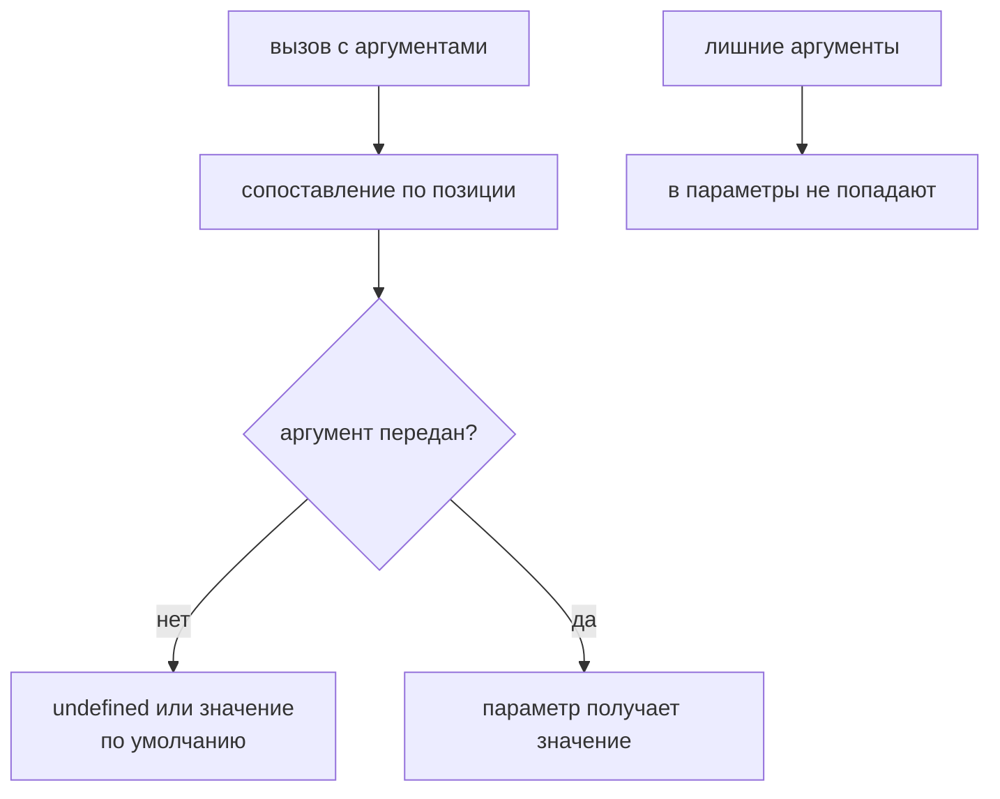

# Параметры

## Связь с предыдущей главой

Предыдущие главы раздела **Functions** показали, как создавать function objects разными способами.

Теперь читатель уже знает:

Но остается следующий вопрос:

> Как функция получает данные?

Например, helper проверяет status code.

```javascript
function validateStatus() {
  console.log('Validate status');
}
```

Но какой именно status code он должен проверить?

```text
200?
201?
404?
500?
```

Главный вопрос этой главы:

> Откуда пришло это значение?

---

## Предварительные требования

Для этой главы нужно понимать:

* что функция - это вызываемый function object;
* что тело функции выполняется только после вызова;
* что Function Declaration, Function Expression и Arrow Function создают функции;
* что переменная может хранить значение;
* что имя должно помогать читать код.

Не требуется знать default parameters, rest parameters, destructuring parameters, `arguments` object, spread, TypeScript parameter types, optional parameters или callbacks. Эти темы будут изучаться позже.

---

## Время изучения

Ориентировочное время:

```text
Чтение главы:            110-140 минут
Разбор схем:             40-60 минут
Запуск примеров:         20-30 минут
Практика:                100-130 минут
Повторение материала:    25 минут
```

Уровень сложности: **L3**.

Параметры выглядят как маленькая синтаксическая деталь, но именно они превращают фиксированный helper в переиспользуемый инструмент.

---

## Навигация

Предыдущая глава:

```text
docs/01-javascript/23-arrow-functions.md
```

Текущая глава:

```text
docs/01-javascript/24-parameters.md
```

Следующая глава:

```text
docs/01-javascript/25-return.md
```

Следующая глава ответит:

> Как функция отправляет данные обратно?

---

## Цели обучения

После изучения этой главы вы будете понимать:

* зачем существуют параметры;
* что такое parameter;
* что такое argument;
* чем parameter отличается от argument;
* как вызов функции передает значения;
* как работает функция без параметров;
* как работает один параметр;
* как работают несколько параметров;
* почему сопоставление идет по позиции;
* что происходит при missing arguments на высоком уровне;
* что происходит при extra arguments на высоком уровне;
* почему имена параметров важны;
* как параметры используются в Automation QA.

---

## Мотивация

Начнем с реальной проблемы.

Есть helper:

```javascript
function validateStatus() {
  console.log('Validate status');
}
```

Он называется правильно, но данных ему не хватает.

Если зашить значение внутрь:

```javascript
function validateStatus() {
  const statusCode = 200;
  console.log(statusCode);
}
```

helper всегда будет проверять только `200`.

Проблема:

Именно для этого существуют параметры.

Зачем существуют parameters:

Главный вопрос:

> Откуда пришло это значение?

---

## Теория

### Зачем существуют параметры

Параметры нужны, чтобы функция могла получать данные извне.

Без параметров функция может работать только с теми значениями, которые записаны
прямо в её теле: чтобы проверить другой статус, пришлось бы писать вторую функцию.

С параметрами одна и та же функция обслуживает любые входные данные — значение
приходит в момент вызова.

Параметр делает вспомогательную функцию гибкой:

```text
validateStatus(200)
validateStatus(201)
validateStatus(404)
```

Один алгоритм. Разные входные значения.

### Параметр

Параметр — это имя внутри определения функции, через которое функция получает значение.

```javascript
function validateStatus(statusCode) {
  console.log(statusCode);
}
```

Схема:

```text
function validateStatus(statusCode)
                        ^^^^^^^^^^ параметр — имя внутри функции
```

Параметр относится к определению функции:

Параметр похож на локальное имя для входного значения.

### Аргумент

Аргумент — это значение, которое передаётся при вызове функции.

```javascript
validateStatus(200);
```

Схема:

```text
validateStatus(200)
               ^^^ аргумент — значение при вызове
```

Аргумент относится к вызову функции:

```text
одна функция  —  один список параметров
много вызовов —  каждый со своими аргументами
```

Главное различие:

| | Параметр | Аргумент |
| --- | --- | --- |
| где появляется | в объявлении функции | в строке вызова |
| что это | имя | значение |
| сколько раз существует | один на функцию | своё на каждый вызов |

### Аргумент → параметр

При вызове JavaScript сопоставляет аргумент с параметром.

```javascript
function validateStatus(statusCode) {
  console.log(statusCode);
}

validateStatus(200);
```

Схема:

```text
вызов:     validateStatus(200)
внутри:    statusCode  ──→  [ 200 ]
```

Поток данных:

```text
200  →  подставляется на место параметра statusCode
        →  становится доступно внутри тела функции
```

Внутри функции имя `statusCode` становится способом обратиться к переданному значению.

### Вызов с аргументами

Вызов с аргументами выглядит так:

```javascript
validateStatus(200);
```

Жизненный цикл вызова:

```text
1. вычисляются значения аргументов
2. создаётся окружение вызова
3. параметры получают значения аргументов
4. выполняется тело функции
5. окружение вызова уходит вместе с параметрами
```

Главный вопрос:

```text
какие значения функция получает извне, чтобы выполнить свою работу?
```

### Ноль параметров

Функция может не получать данные.

```javascript
function printTestStart() {
  console.log('Test started');
}

printTestStart();
```

Ноль параметров:

```text
скобки при вызове пустые — извне ничего не передаётся
```

Такая функция выполняет фиксированное действие.

### Один параметр

Функция может получать одно значение.

```javascript
function validateStatus(statusCode) {
  console.log(statusCode);
}

validateStatus(200);
```

Один параметр:

```text
объявление:  validateStatus(statusCode)
вызов:       validateStatus(200)
```

Сопоставление:

```text
statusCode  ←  200
```

### Несколько параметров

Функция может получать несколько значений.

```javascript
function compareStatus(actualStatus, expectedStatus) {
  console.log(actualStatus === expectedStatus);
}

compareStatus(200, 200);
```

Несколько параметров:

```text
объявление:  compareStatus(actualStatus, expectedStatus)
```

Аргументы:

```text
actualStatus    ←  первый аргумент,  200
expectedStatus  ←  второй аргумент,  200
```

### Сопоставление по позиции

JavaScript сопоставляет аргументы и параметры по позиции.

Схема:

```text
compareStatus(200, 201)
              │    └──→ второй параметр
              └───────→ первый параметр
```

Для примера: при вызове `compareStatus(200, 201)` первый параметр получит `200`, второй — `201`, независимо от того, как они названы.

Имена аргументов не передаются. Передаются значения, и JavaScript кладет их по порядку.

### Недостающие аргументы

Если аргумент не передан, параметр получает `undefined` на высоком уровне.

```javascript
function validateStatus(statusCode) {
  console.log(statusCode);
}

validateStatus();
```

Схема:

```text
аргумент не передан  →  параметр получает undefined
```

Это не значение по умолчанию. Значения по умолчанию будут изучаться позже.

### Лишние аргументы

Если аргументов больше, чем параметров, лишние значения на этом уровне просто не получают имени параметра.

```javascript
function validateStatus(statusCode) {
  console.log(statusCode);
}

validateStatus(200, 201);
```

Схема:

```text
аргументов больше, чем параметров  →  лишние игнорируются
```

Лишний аргумент:

Объект `arguments`, остаточные параметры и раскрытие будут изучаться позже.

### Имена параметров

Имя параметра должно объяснять, какое значение ожидает функция.

Плохо:

```javascript
function validateStatus(x) {
  console.log(x);
}
```

Лучше:

```javascript
function validateStatus(statusCode) {
  console.log(statusCode);
}
```

Именование параметров — не косметика: имя параметра видно в теле функции и в
подсказках редактора, а имя аргумента при вызове не видно вовсе.

Хорошее имя отвечает на вопрос:

```text
Что за значение пришло в функцию?
```

---

Аргументы попадают в параметры по позиции:


```mermaid
flowchart TD
    A["вызов с аргументами"] --> B["сопоставление по позиции"]
    B --> C{"аргумент передан?"}
    C -- "нет" --> D["undefined или значение<br/>по умолчанию"]
    C -- "да" --> E["параметр получает значение"]
    F["лишние аргументы"] --> G["в параметры не попадают"]
```

## Внутренний механизм

На концептуальном уровне вызов функции создает момент передачи данных.

---

### Сопоставление идёт по позиции

```text
function validateStatus(expected, actual) { … }

validateStatus(200, 404)
               │    └──→ actual
               └───────→ expected
```

Имена параметров в сопоставлении не участвуют: движок связывает первый аргумент
с первым параметром, второй — со вторым. Поэтому перепутанный порядок не даёт
ошибки — он даёт неверный результат.

### Что происходит при несовпадении количества

| Вызов | Что получат параметры |
| --- | --- |
| аргументов меньше | недостающие получают `undefined` |
| аргументов больше | лишние просто не попадают в параметры |
| аргумент `undefined` явно | то же, что не передать |

Первая строка объясняет самый частый случай в тестах: забытый аргумент не падает
на вызове, а проявляется позже — при обращении к свойству `undefined`.

### Параметр — локальное имя

```javascript
function rename(title) {
  title = 'другое';   // меняется только параметр
}

const original = 'Отчёт';
rename(original);
console.log(original);   // 'Отчёт'
```

Присваивание параметру не меняет переменную вызывающего кода: параметр — это своё
имя в контексте вызова. Но если аргумент был объектом, через это имя доступен тот
же самый объект — и его свойства изменить можно.

## Ментальная модель

### Доставка посылки

Аргумент похож на посылку.

### Почтовый ящик

Параметр похож на почтовый ящик с именем.

### Поля формы

Функция похожа на форму.

### Вход станка

Параметры — это входные отверстия станка: их количество и порядок заданы
заранее, а подавать в них можно разные детали.

```text
станок compareStatus:  вход 1 — фактический код
                       вход 2 — ожидаемый код
```

Перепутать входы местами станок не мешает — он просто выдаст неверный
результат.

### Ингредиенты рецепта

Параметры — это список ингредиентов в рецепте, а аргументы — то, что реально
положили в кастрюлю. Рецепт написан один раз и не меняется; продукты
подставляются при каждом приготовлении.

Отсюда и краткая модель: параметр принадлежит объявлению функции, аргумент —
вызову. Их легко перепутать, потому что в теле функции они обозначены одним
именем.

---

## Примеры кода

Все примеры находятся в:

```text
examples/01-javascript/chapter-24/
```

Запуск:

```bash
node examples/01-javascript/chapter-24/01-no-parameters.js
node examples/01-javascript/chapter-24/02-one-parameter.js
node examples/01-javascript/chapter-24/03-multiple-parameters.js
node examples/01-javascript/chapter-24/04-missing-extra-arguments.js
node examples/01-javascript/chapter-24/05-common-mistakes.js
node examples/01-javascript/chapter-24/06-qa-example.js
```

### 01-no-parameters.js

Показывает функцию без параметров.

### 02-one-parameter.js

Показывает один параметр и один аргумент.

### 03-multiple-parameters.js

Показывает сопоставление нескольких аргументов с параметрами по позиции.

### 04-missing-extra-arguments.js

Показывает пропущенный и лишний аргумент на высоком уровне.

### 05-common-mistakes.js

Показывает ошибку порядка аргументов.

### 06-qa-example.js

Показывает проверку, которая получает ожидаемое и фактическое значения.

---

## Частые вопросы

### Параметр и аргумент — это одно и то же?

Нет. Параметр находится в определении функции. Аргумент — в вызове.

### Почему важно различать эти слова?

Потому что они отвечают за разные места кода. Параметр говорит, как функция назовёт полученное значение. Аргумент говорит, какое значение реально передано.

### Что будет, если аргумент не передать?

На этом уровне можно считать, что параметр получит `undefined`. Более сложные способы обработки отсутствующих значений будут изучаться позже.

### Что будет, если передать лишний аргумент?

Если для него нет параметра, при обычном чтении функции он не получает имени. Остаточные параметры и объект `arguments` будут изучаться позже.

### Можно ли использовать параметры в стрелочных функциях?

Да. Параметры есть у объявления функции, у выражения-функции и у стрелочной функции.

### Можно ли указать тип параметра?

В JavaScript — нет. Типы параметров будут изучаться в части про TypeScript.

---

## Распространённые мифы

### Миф: параметр и аргумент — синонимы

Реальность:

Параметр принадлежит определению функции. Аргумент — вызову.

### Миф: JavaScript сопоставляет значения по именам

Реальность:

Аргументы сопоставляются с параметрами по позиции.

### Миф: пропущенный аргумент всегда ошибка

Реальность:

На уровне JavaScript это допустимо, но параметр получит `undefined`, если нет другого механизма.

### Миф: лишние аргументы всегда ломают функцию

Реальность:

На этом уровне лишний аргумент просто не получает имени параметра.

---

## Распространённые ошибки

### Ошибка 1. Путать параметр и аргумент

Неправильное объяснение:

```text
В validateStatus(statusCode) значение statusCode - это argument.
```

Правильно:

```text
statusCode в определении функции - parameter.
200 в validateStatus(200) - argument.
```

### Ошибка 2. Неправильный порядок аргументов

```javascript
function compareStatus(actualStatus, expectedStatus) {
  console.log(actualStatus === expectedStatus);
}

compareStatus(200, 201);
```

Сопоставление:

Если перепутать порядок, функция будет сравнивать не то.

### Ошибка 3. Неясные имена параметров

Плохо:

```javascript
function compare(a, b) {
  console.log(a === b);
}
```

Лучше:

```javascript
function compareStatus(actualStatus, expectedStatus) {
  console.log(actualStatus === expectedStatus);
}
```

### Ошибка 4. Пропущенный аргумент

```javascript
function validateStatus(statusCode) {
  console.log(statusCode);
}

validateStatus();
```

`statusCode` получает `undefined`.

### Ошибка 5. Лишний аргумент

```javascript
function validateStatus(statusCode) {
  console.log(statusCode);
}

validateStatus(200, 201);
```

`200` попадает в `statusCode`. `201` лишний на этом уровне.

---

## Практическое использование

Параметры нужны, когда одна вспомогательная функция должна работать с разными данными.

Практический чек-лист:

```text
1. Какие данные нужны функции?
2. Как назвать parameter?
3. Где передается argument?
4. Совпадает ли порядок arguments с parameters?
5. Понятна ли сигнатура helper?
```

Читаемые имена параметров:

```text
statusCode
expectedStatus
actualStatus
userEmail
profileLocator
```

---

## Использование в Automation QA

### Проверки, получающие ожидаемые значения

```javascript
function validateStatus(actualStatus, expectedStatus) {
  console.log(actualStatus === expectedStatus);
}

validateStatus(200, 200);
```

QA-валидатор:

```text
функция описывает саму проверку один раз,
а конкретные коды ответов приходят аргументами на каждом вызове
```

Так одна проверка работает и для успешного ответа, и для ошибки.

### Проверка кода состояния API

```javascript
function validateApiStatus(statusCode) {
  console.log(statusCode);
}

validateApiStatus(200);
```

### Переиспользуемые вспомогательные функции

```javascript
function openUserProfile(userId) {
  console.log(userId);
}
```

`userId` делает функцию переиспользуемой.

### Передача локаторов

```javascript
function clickElement(locatorName) {
  console.log(locatorName);
}

clickElement('profile button');
```

Локаторы Playwright будут изучаться позже. Здесь важно увидеть саму идею передачи значения.

### Передача тестовых данных

```javascript
function createUser(userEmail) {
  console.log(userEmail);
}

createUser('anna@example.com');
```

### Читаемые сигнатуры вспомогательных функций

Сигнатура функции должна объяснять, какие данные ей нужны.

---

## Итоги

Параметры отвечают на вопрос:

```text
Как функция получает данные?
```

Главная модель: параметр — это имя внутри функции, аргумент — значение снаружи, а связывает их позиция при вызове.

Самое важное:

```text
Параметры принадлежат объявлению функции.
Аргументы принадлежат её вызову.
Аргументы становятся доступны внутри функции через параметры.
```

Следующая глава ответит:

```text
Как функция отправляет данные обратно?
```

Это тема возврата значения.

---

## Что нужно запомнить

* Параметр — имя в определении функции.
* Аргумент — значение в вызове функции.
* Функция получает данные через параметры.
* Вызов передаёт аргументы.
* Аргументы сопоставляются с параметрами по позиции.
* Пропущенный аргумент на высоком уровне даёт параметру значение `undefined`.
* Лишний аргумент может не получить имени параметра.
* Имена параметров должны объяснять входные данные.
* В автоматизации тестов параметры делают вспомогательные функции и проверки переиспользуемыми.
* Значения по умолчанию, остаточные параметры, деструктуризация, раскрытие, типы и обратные вызовы будут позже.

---

## Проверьте себя

Ответьте без запуска кода.

1. Зачем существуют параметры?
2. Что такое параметр?
3. Что такое аргумент?
4. Где находится параметр: в определении или в вызове?
5. Где находится аргумент: в определении или в вызове?
6. Как аргумент становится доступным внутри функции?
7. Как JavaScript сопоставляет аргументы и параметры?
8. Что происходит при пропущенном аргументе?
9. Что происходит при лишнем аргументе?
10. Почему имя параметра важно для автоматизации тестов?

### Ответы

1. Чтобы одна функция работала с разными данными. Без параметров пришлось бы писать отдельную функцию под каждое значение.
2. Имя в объявлении функции, под которым внутри будет доступно переданное значение.
3. Значение, переданное функции при вызове.
4. В определении.
5. В вызове.
6. При вызове создаётся окружение, и параметры получают значения аргументов. Дальше внутри тела обращаются к параметру как к обычной переменной.
7. По позиции: первый аргумент — первому параметру, второй — второму. Имена аргументов при этом роли не играют.
8. Параметр получает `undefined`. Ошибки не будет, и функция продолжит работать с этим значением.
9. Он просто не попадает ни в один параметр. Ошибки тоже не будет.
10. Имя параметра объясняет, что именно ожидается на этом месте. `compareStatus(actual, expected)` читается однозначно, а `compareStatus(a, b)` заставляет открывать тело, чтобы не перепутать порядок.

---

## Практика

Практика находится в файле:

```text
practice/01-javascript/24-parameters.md
```

Сначала решайте задания на предсказание вывода без запуска. Главная цель — не смешивать параметр и аргумент.

---

## Решения

Решения находятся в файле:

```text
solutions/01-javascript/24-parameters.md
```

Читайте решения после самостоятельной попытки. Проверяйте главный вопрос: откуда пришло это значение?
