# Return

## Связь с предыдущей главой

Предыдущая глава объяснила, как данные входят в функцию.

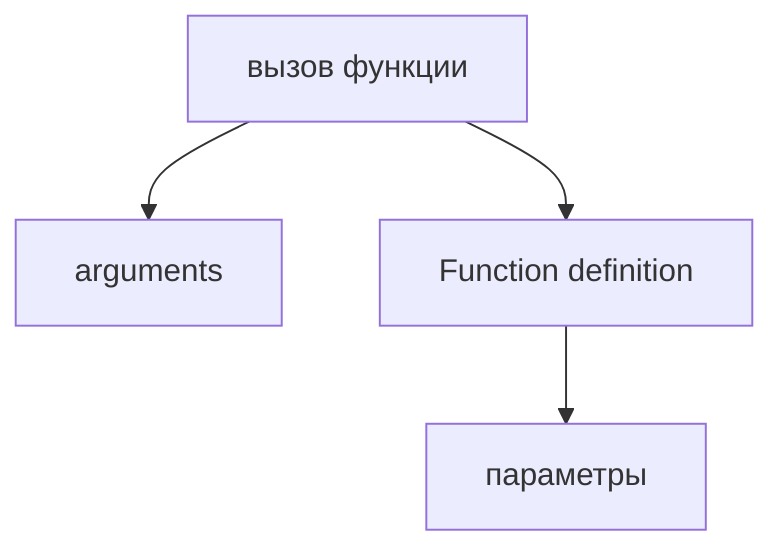

Теперь появляется следующий вопрос:

> Как функция отправляет данные обратно?

Например, helper проверяет status code:

```javascript
function isSuccessfulStatus(statusCode) {
  statusCode === 200;
}
```

Внутри функции есть проверка. Но вызывающий код не получает ответ.

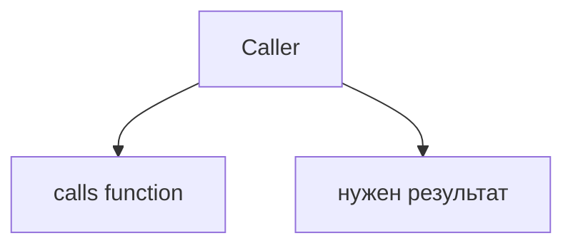

Главный вопрос этой главы:

> Как результат выходит из функции?

---

## Предварительные требования

Для этой главы нужно понимать:

* что функция - это вызываемый function object;
* что arguments передаются при вызове;
* что parameters получают arguments внутри функции;
* что тело функции выполняется после invocation;
* что `console.log()` выводит значение в консоль.

Не требуется знать returning objects in detail, destructuring returned значения, generators, async return, Promise, recursion или higher-order functions. Эти темы будут изучаться позже.

---

## Время изучения

Ориентировочное время:

```text
Чтение главы:            110-140 минут
Разбор схем:             40-60 минут
Запуск примеров:         20-30 минут
Практика:                100-130 минут
Повторение материала:    25 минут
```

Уровень сложности: **L3**.

`return` выглядит как одно слово, но меняет роль функции: функция становится не только набором действий, а преобразованием входных данных в результат.

---

## Навигация

Предыдущая глава:

```text
docs/01-javascript/24-parameters.md
```

Текущая глава:

```text
docs/01-javascript/25-return.md
```

Следующая глава:

```text
docs/01-javascript/26-rest.md
```

Следующая глава ответит:

> Как функция может получить неизвестное количество arguments?

---

## Цели обучения

После изучения этой главы вы будете понимать:

* зачем существует `return`;
* что такое return value;
* как функция возвращает данные;
* почему выполнение останавливается после `return`;
* что происходит в функции без explicit return;
* что такое implicit `undefined`;
* как работает один `return`;
* как работают multiple return paths;
* почему `console.log()` не заменяет `return`;
* как писать читаемые return paths;
* как `return` используется в Automation QA.

---

## Мотивация

Начнем с проблемы.

Функция получает status code:

```javascript
function isSuccessfulStatus(statusCode) {
  statusCode === 200;
}
```

Внутри есть выражение:

```text
statusCode === 200
```

Но вызывающий код не получает результат.

```javascript
const result = isSuccessfulStatus(200);
console.log(result);
```

Что должен получить `result`?

```text
true?
false?
undefined?
```

Чтобы результат вышел из функции, нужен `return`.

Зачем существует return:

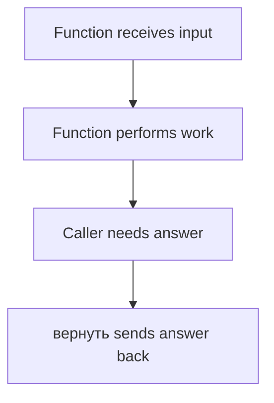

Функции - это не только переиспользуемые алгоритмы. Часто это переиспользуемые преобразования данных.

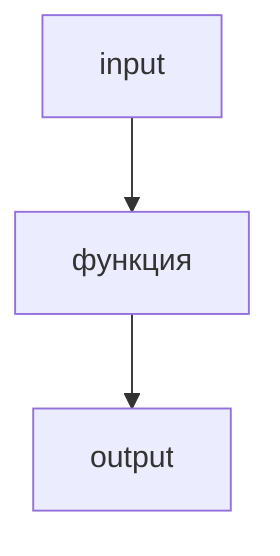

Главный вопрос:

> Как результат выходит из функции?

---

## Теория

### Зачем существует return

`return` нужен, чтобы функция могла отправить результат обратно в место вызова.

Без `return`:

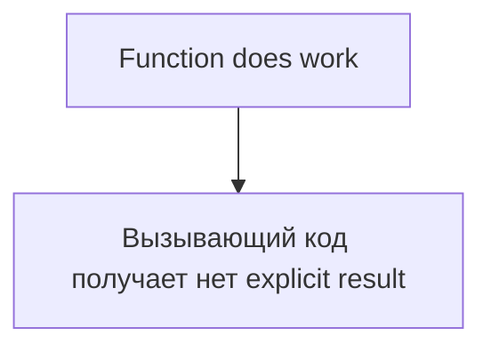

С `return`:

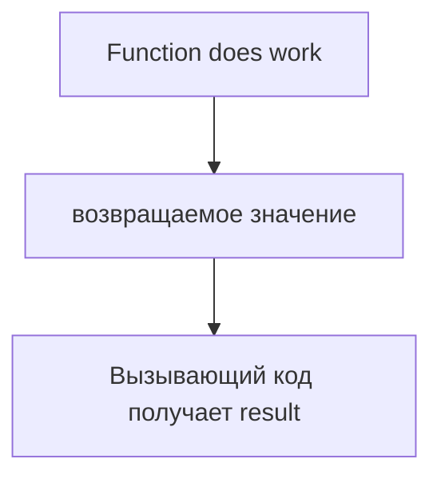

Function вход/вывод:

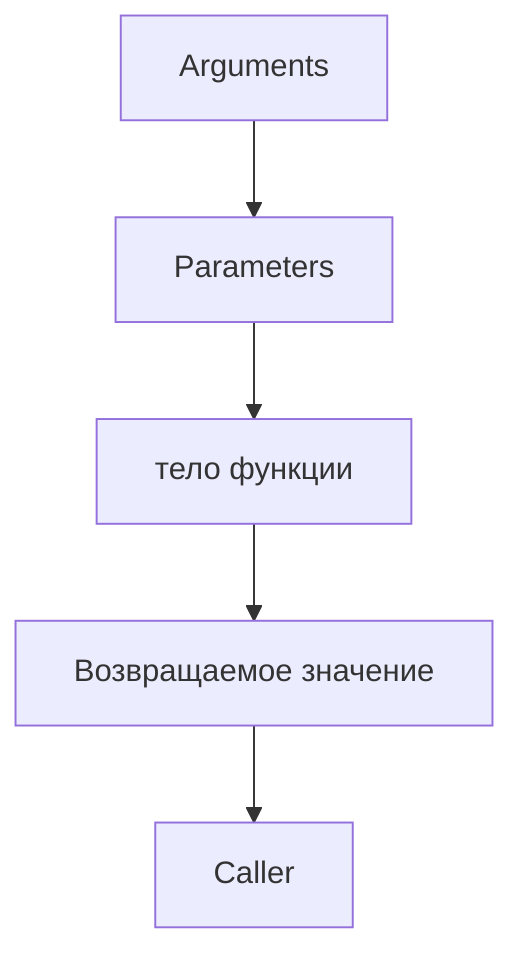

### Возвращаемое значение

Возвращаемое значение - это значение, которое функция отправляет вызывающему коду.

```javascript
function isSuccessfulStatus(statusCode) {
  return statusCode === 200;
}
```

Схема:

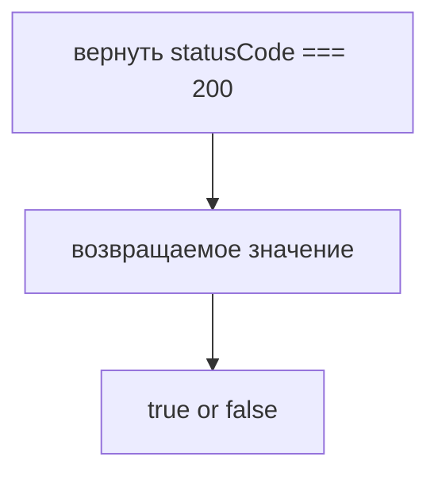

Вызов:

```javascript
const result = isSuccessfulStatus(200);
```

Схема:

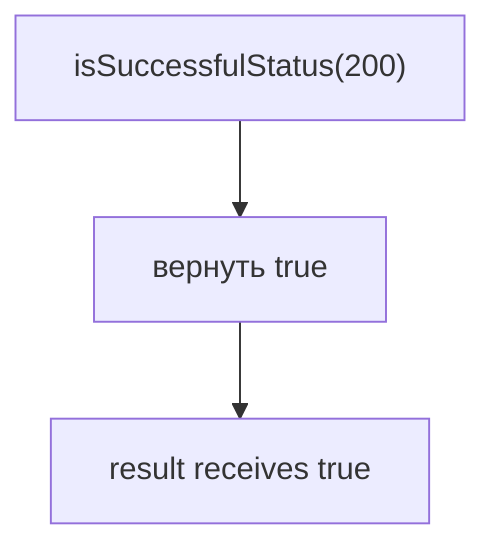

### Returning data

Функция может вернуть результат вычисления.

```javascript
function compareStatus(actualStatus, expectedStatus) {
  return actualStatus === expectedStatus;
}
```

Data поток:

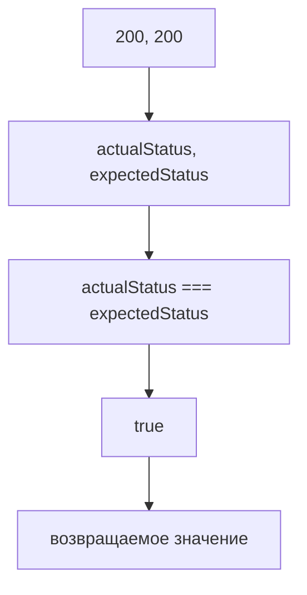

`return` делает результат доступным снаружи функции.

### Return boundary

Функция имеет границу.

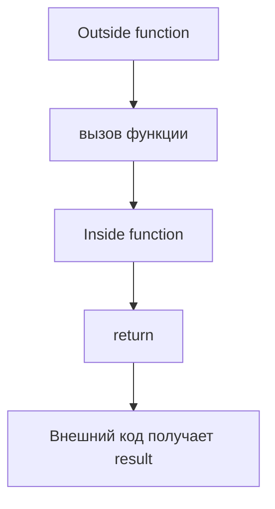

Return boundary:

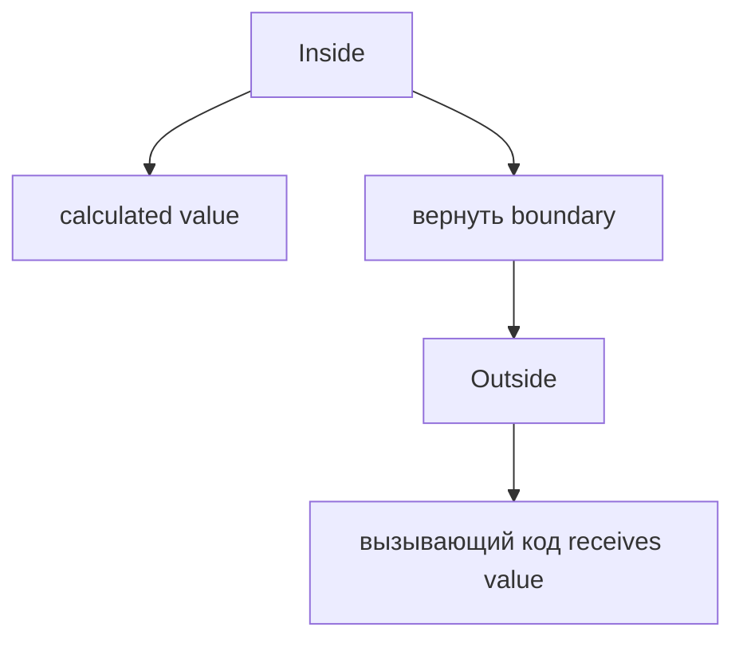

### Returning immediately

`return` завершает выполнение функции сразу.

```javascript
function validateStatus(statusCode) {
  return statusCode === 200;
  console.log('This will not run');
}
```

Execution stops:

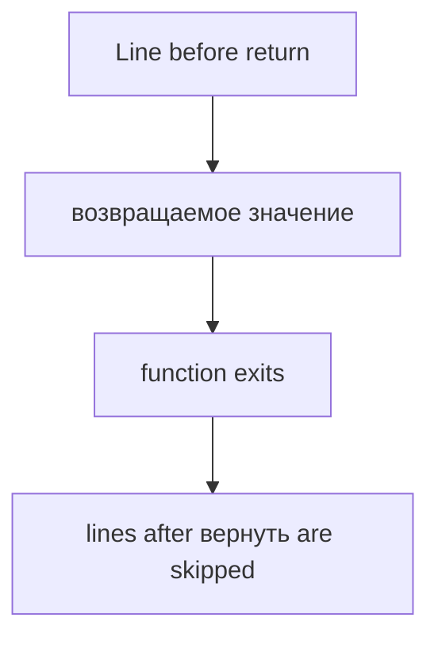

После `return` тело функции дальше не выполняется.

### Execution stops after return

Это не рекомендация стиля, а механизм выполнения.

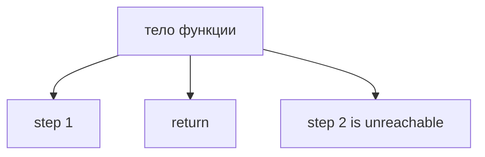

Пример:

```javascript
function getStatusMessage(statusCode) {
  if (statusCode === 200) {
    return 'OK';
  }

  return 'Not OK';
}
```

Если первый `return` выполнен, функция завершилась.

Return path:

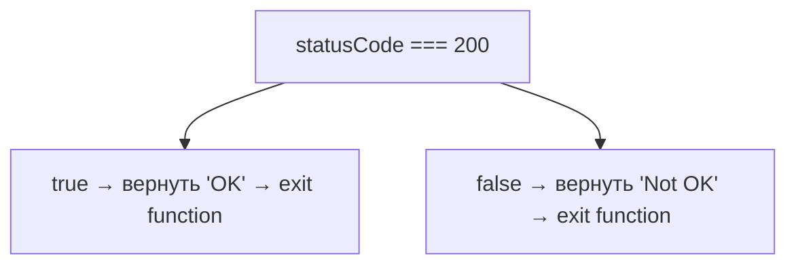

### Function without explicit return

Функция может не содержать `return`.

```javascript
function logStatus(statusCode) {
  console.log(statusCode);
}
```

Она может выполнить действие, но не отправить явный результат назад.

Function without return:

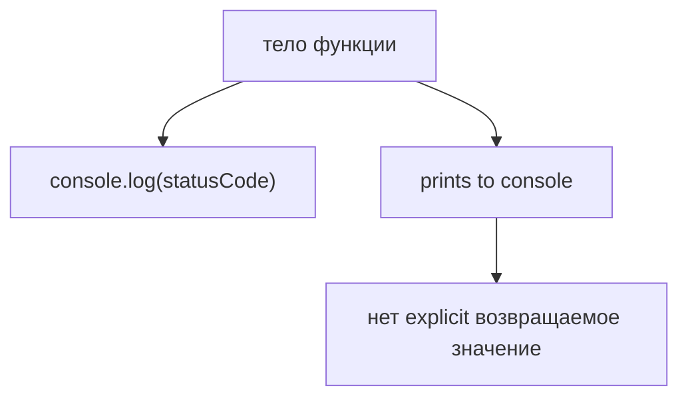

### Implicit undefined

Если функция завершилась без explicit `return`, результатом вызова будет `undefined`.

```javascript
function logStatus(statusCode) {
  console.log(statusCode);
}

const result = logStatus(200);
console.log(result);
```

Implicit undefined:

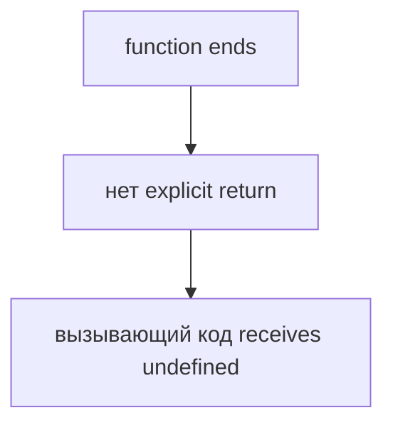

Важно:

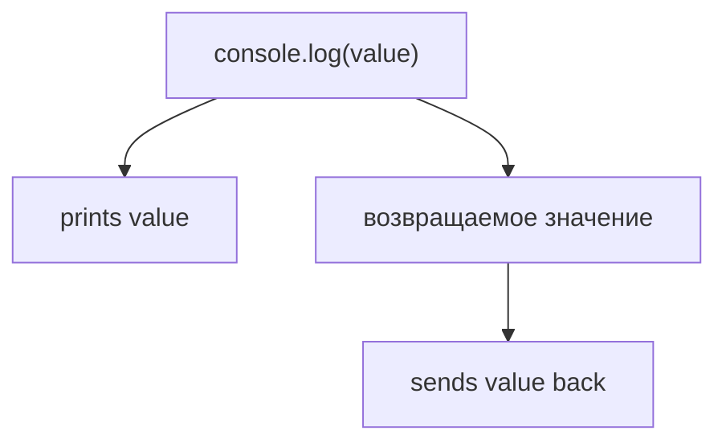

### Одна инструкция return

Функция может иметь один `return`.

```javascript
function isSuccessfulStatus(statusCode) {
  return statusCode === 200;
}
```

One return:

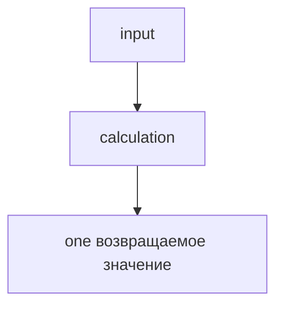

Это удобно для простых преобразований.

### Multiple return paths

Функция может иметь несколько путей возврата.

```javascript
function getStatusMessage(statusCode) {
  if (statusCode === 200) {
    return 'Success';
  }

  return 'Failure';
}
```

Multiple возвращает:

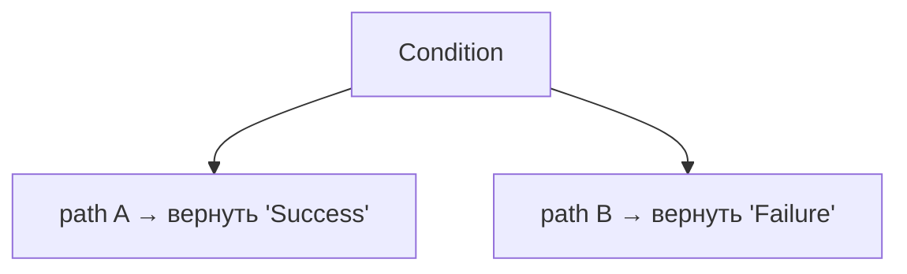

Важно, чтобы каждый путь был понятен.

```mermaid
flowchart TD
    N1["Readable вернуть paths"]
    N2["clear condition"]
    N3["clear возвращённое значение"]
    N4["нет hidden work after return"]
    N1 --> N2
    N1 --> N3
    N1 --> N4
```

### Readability of return

`return` должен помогать читать поток данных.

Плохо:

```javascript
function check(statusCode) {
  if (statusCode === 200) return true;
  if (statusCode === 201) return true;
  if (statusCode === 204) return true;
  return false;
}
```

Лучше на этом уровне:

```javascript
function isSuccessfulStatus(statusCode) {
  return statusCode === 200;
}
```

Читаемость:

```mermaid
flowchart TD
    N1["Good return"]
    N2["clear function name"]
    N3["clear возвращённое значение"]
    N4["clear вызывающий код usage"]
    N1 --> N2
    N1 --> N3
    N1 --> N4
```

---

## Внутренний механизм

На концептуальном уровне `return` завершает текущий function execution и передает значение наружу.

Function lifecycle:

```mermaid
flowchart TD
    N1["Function is called"]
    N2["Arguments enter"]
    N3["Parameters receive values"]
    N4["Body выполняется"]
    N5["вернуть sends result"]
    N6["Function exits"]
    N1 --> N2
    N2 --> N3
    N3 --> N4
    N4 --> N5
    N5 --> N6
```

Что делает движок:

```mermaid
flowchart TD
    N1["I reach isSuccessfulStatus(200)."]
    N2["I pass 200 into statusCode."]
    N3["I выполнить the body."]
    N4["I evaluate statusCode === 200."]
    N5["I reach return."]
    N6["I send the value back to the вызывающий код."]
    N7["I stop executing this function."]
    N1 --> N2
    N2 --> N3
    N3 --> N4
    N4 --> N5
    N5 --> N6
    N6 --> N7
```

Complete вход/вывод model:

```mermaid
flowchart TD
    N1["Caller"]
    N2["sends arguments"]
    N3["Function"]
    N4["receives parameters"]
    N5["performs work"]
    N6["создает result"]
    N7["возвращает value"]
    N8["Caller"]
    N9["receives возвращаемое значение"]
    N1 --> N2
    N1 --> N3
    N3 --> N4
    N3 --> N5
    N3 --> N6
    N3 --> N7
    N3 --> N8
    N8 --> N9
```

Текущее место в модели JavaScript:

```mermaid
flowchart TD
    N1["Functions"]
    N2["Function Declaration"]
    N3["Function Expression"]
    N4["Arrow Functions"]
    N5["Parameters"]
    N6["data enters function"]
    N7["Return"]
    N8["data leaves function"]
    N1 --> N2
    N1 --> N3
    N1 --> N4
    N1 --> N5
    N1 --> N6
    N1 --> N7
    N7 --> N8
```

Переход к Rest Parameters:

```mermaid
flowchart TD
    N1["Parameters"]
    N2["known number of inputs"]
    N3["Return"]
    N4["output from function"]
    N5["Next question"]
    N6["unknown number of arguments"]
    N7["Rest Parameters"]
    N1 --> N2
    N1 --> N3
    N3 --> N4
    N3 --> N5
    N5 --> N6
    N5 --> N7
```

---

## Ментальная модель

### Автомат с выдачей

Функция похожа на автомат.

```mermaid
flowchart TD
    N1["Insert input"]
    N2["Machine works"]
    N3["Machine gives output"]
    N1 --> N2
    N2 --> N3
```

Arguments входят. Возвращаемое значение выходит.

### Калькулятор

```mermaid
flowchart TD
    N1["Calculator"]
    N2["receives numbers"]
    N3["calculates"]
    N4["возвращает result"]
    N1 --> N2
    N1 --> N3
    N1 --> N4
```

Если калькулятор только показывает число на экране, это похоже на `console.log`. Если он отдает число другой части программы, это похоже на `return`.

### Input/вывод machine

```mermaid
flowchart TD
    N1["Input"]
    N2["Function"]
    N3["Output"]
    N1 --> N2
    N2 --> N3
```

### Request/response

```mermaid
flowchart TD
    N1["Request"]
    N2["вызов функции with arguments"]
    N3["Response"]
    N4["возвращаемое значение"]
    N1 --> N2
    N1 --> N3
    N3 --> N4
```

### Служба доставки

```mermaid
flowchart TD
    N1["Caller sends package"]
    N2["Function processes package"]
    N3["Функция отправляет результат обратно"]
    N1 --> N2
    N2 --> N3
```

Краткая ментальная модель:

```text
Arguments enter the function.
Parameters receive them.
The function performs work.
Return sends the result back.
Execution stops immediately after return.
```

Complete Return overview:

```mermaid
flowchart TD
    N1["return"]
    N2["sends value to вызывающий код"]
    N3["stops function выполнение"]
    N4["can appear in one path"]
    N5["can appear in multiple paths"]
    N6["differs from console.log()"]
    N1 --> N2
    N1 --> N3
    N1 --> N4
    N1 --> N5
    N1 --> N6
```

---

## Примеры кода

Все примеры находятся в:

```text
examples/01-javascript/chapter-25/
```

Запуск:

```bash
node examples/01-javascript/chapter-25/01-basic-return.js
node examples/01-javascript/chapter-25/02-return-value.js
node examples/01-javascript/chapter-25/03-multiple-return.js
node examples/01-javascript/chapter-25/04-implicit-undefined.js
node examples/01-javascript/chapter-25/05-common-mistakes.js
node examples/01-javascript/chapter-25/06-qa-example.js
```

### 01-basic-return.js

Показывает базовый `return`.

### 02-return-value.js

Показывает, как вызывающий код получает return value.

### 03-multiple-return.js

Показывает несколько return paths.

### 04-implicit-undefined.js

Показывает implicit `undefined` в функции без explicit return.

### 05-common-mistakes.js

Показывает различие между `console.log()` и `return`.

### 06-qa-example.js

Показывает QA validator, который возвращает boolean.

---

## Частые вопросы

### console.log возвращает значение?

`console.log()` выводит значение в консоль. Он не заменяет `return`.

### Что получает вызывающий код, если в функции нет return?

Caller получает `undefined`.

### Можно ли писать несколько return?

Да. Главное, чтобы return paths были понятными.

### Выполняется ли код после return?

Нет. Когда `return` выполнен, функция сразу завершается.

### Может ли функция вернуть object?

Да, но возвращение objects в деталях будет изучаться позже. В этой главе достаточно понимать сам механизм выхода значения.

### Как return работает с async functions?

Async return связан с Promise и будет изучаться позже.

---

## Распространенные мифы

### Миф: console.log и return делают одно и то же

Реальность:

`console.log()` печатает. `return` отправляет значение вызывающему коду.

### Миф: функция без return ничего не возвращает

Реальность:

Она возвращает `undefined` на уровне результата вызова.

### Миф: после return код продолжает выполняться

Реальность:

`return` завершает выполнение функции немедленно.

### Миф: много return всегда плохо

Реальность:

Несколько return paths допустимы, если они читаемы и объясняют логику.

Схема типичных ошибок:

```mermaid
flowchart TD
    N1["Ошибка"]
    N2["путать console.log и return"]
    N3["забыть return"]
    N4["писать код после return"]
    N5["не сохранить возвращаемое значение"]
    N6["сделать вернуть paths неочевидными"]
    N1 --> N2
    N1 --> N3
    N1 --> N4
    N1 --> N5
    N1 --> N6
```

---

## Типичные ошибки

### Ошибка 1. Путать console.log и return

Неправильно:

```javascript
function isSuccessfulStatus(statusCode) {
  console.log(statusCode === 200);
}
```

Функция печатает результат, но вызывающий код получает `undefined`.

Исправление:

```javascript
function isSuccessfulStatus(statusCode) {
  return statusCode === 200;
}
```

### Ошибка 2. Забыть return

```javascript
function isSuccessfulStatus(statusCode) {
  statusCode === 200;
}
```

Выражение вычисляется, но не отправляется наружу.

### Ошибка 3. Код после return

```javascript
function validateStatus(statusCode) {
  return statusCode === 200;
  console.log('Done');
}
```

`console.log('Done')` не выполнится.

### Ошибка 4. Не использовать return value

```javascript
function isSuccessfulStatus(statusCode) {
  return statusCode === 200;
}

isSuccessfulStatus(200);
```

Результат возвращен, но вызывающий код его не использовал.

### Ошибка 5. Неочевидные return paths

Если в функции много условий и много return, читатель должен легко понимать, какой путь выполнится.

```mermaid
flowchart TD
    N1["Readable returns"]
    N2["clear condition"]
    N3["clear value"]
    N4["нет hidden side effects"]
    N1 --> N2
    N1 --> N3
    N1 --> N4
```

---

## Практическое использование

`return` нужен, когда результат функции должен быть использован дальше.

```mermaid
flowchart TD
    N1["Function calculates value"]
    N2["вернуть sends value"]
    N3["вызывающий код stores or checks value"]
    N1 --> N2
    N2 --> N3
```

Практический чек-лист:

```text
1. Что функция получает?
2. Что функция должна вычислить?
3. Что вызывающий код должен получить?
4. Где находится return?
5. Есть ли код после return?
6. Не перепутан ли console.log с return?
```

Функция как преобразование:

```mermaid
flowchart TD
    N1["statusCode"]
    N2["isSuccessfulStatus"]
    N3["boolean"]
    N1 --> N2
    N2 --> N3
```

---

## Использование в Automation QA

### Validators, возвращающие boolean

```javascript
function isSuccessfulStatus(statusCode) {
  return statusCode === 200;
}
```

QA-валидатор:

```mermaid
flowchart TD
    N1["statusCode"]
    N2["validator"]
    N3["булев результат"]
    N1 --> N2
    N2 --> N3
```

### Helper functions

```javascript
function getStatusMessage(statusCode) {
  if (statusCode === 200) {
    return 'Status is successful';
  }

  return 'Status is not successful';
}
```

### Reusable checks

```javascript
const passed = isSuccessfulStatus(200);
console.log(passed);
```

Возвращаемое значение можно сохранить и использовать дальше.

### Возврат parsed значения

На высоком уровне helper может вернуть подготовленное значение:

```javascript
function getUserEmail() {
  return 'anna@example.com';
}
```

Подробная работа с parsed objects будет изучаться позже.

### Возврат locators

На высоком уровне helper может вернуть locator name:

```javascript
function getProfileButtonName() {
  return 'profile button';
}
```

Настоящие Playwright locators будут изучаться позже.

### Читаемые helper APIs

Хороший helper API показывает, что входит и что выходит.

```mermaid
flowchart TD
    N1["isSuccessfulStatus(statusCode) → boolean"]
    N2["getUserEmail() → string"]
    N3["getStatusMessage(statusCode) → string"]
    N1 --> N2
    N2 --> N3
```

Async helpers, Promise и async return будут изучаться позже.

---

## Итоги

`return` отвечает на вопрос:

```text
Как функция отправляет данные обратно?
```

Главная модель:

```text
Arguments enter the function.
Parameters receive them.
The function performs work.
Return sends the result back.
Execution stops immediately after return.
```

Критическое различие:

```mermaid
flowchart TD
    N1["console.log(value)"]
    N2["prints value"]
    N3["возвращаемое значение"]
    N4["sends value back to вызывающий код"]
    N1 --> N2
    N1 --> N3
    N3 --> N4
```

Следующая глава ответит:

```text
Как функция может получить неизвестное количество arguments?
```

Это тема Rest Parameters.

---

## Что нужно запомнить

* `return` отправляет значение вызывающему коду.
* Возвращаемое значение - значение, которое получает вызывающий код.
* `return` немедленно завершает выполнение функции.
* Код после выполненного `return` не запускается.
* Функция без explicit return возвращает `undefined`.
* `console.log()` печатает значение, но не возвращает его вызывающий код.
* Функция может иметь один инструкция return.
* Функция может иметь multiple return paths.
* В Automation QA validators часто возвращают boolean.
* Returning objects, async return, Promise, generators, recursion и higher-order functions будут изучаться позже.

---

## Проверьте себя

Ответьте без запуска кода.

1. Зачем существует `return`?
2. Что такое return value?
3. Что получает вызывающий код?
4. Что происходит после выполнения `return`?
5. Что возвращает функция без explicit return?
6. Чем `console.log()` отличается от `return`?
7. Может ли функция иметь несколько return paths?
8. Почему return paths должны быть читаемыми?
9. Как `return` используется в Automation QA?
10. Какая тема идет следующей?

---

## Практика

Практика находится в файле:

```text
practice/01-javascript/25-return.md
```

Сначала решайте задания на предсказание вывода без запуска. Главная цель - отличать вывод в консоль от возвращения значения.

---

## Решения

Решения находятся в файле:

```text
solutions/01-javascript/25-return.md
```

Читайте решения после самостоятельной попытки. Проверяйте главный вопрос: как результат выходит из функции?
