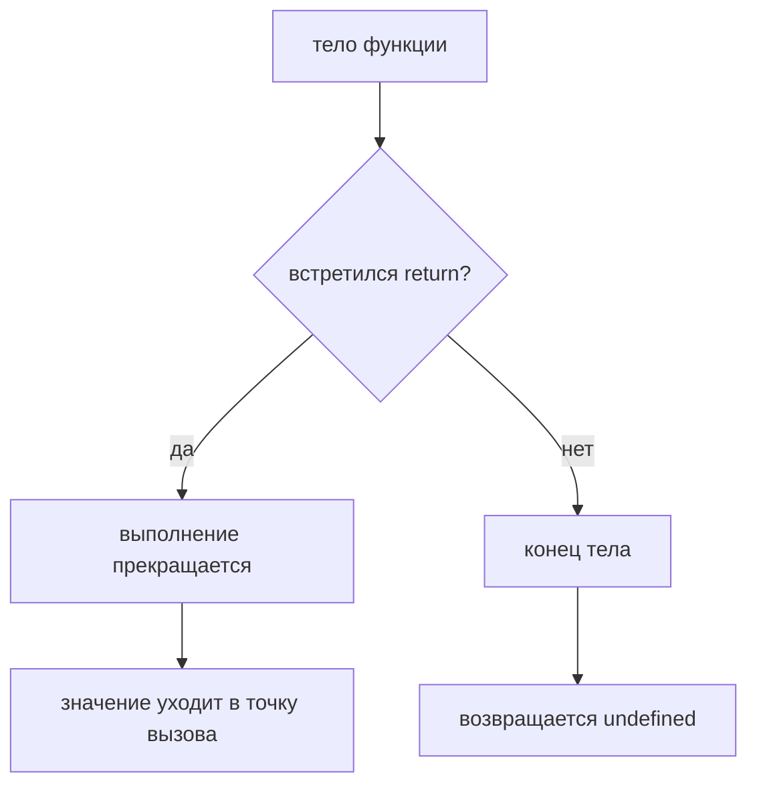

# Возврат значения

## Связь с предыдущей главой

Предыдущая глава объяснила, как данные входят в функцию.

Теперь появляется следующий вопрос:

> Как функция отправляет данные обратно?

Например, helper проверяет status code:

```javascript
function isSuccessfulStatus(statusCode) {
  statusCode === 200;
}
```

Внутри функции есть проверка. Но вызывающий код не получает ответ.

Главный вопрос этой главы:

> Как результат выходит из функции?

---

## Предварительные требования

Для этой главы нужно понимать:

* что функция - это вызываемый function object;
* что arguments передаются при вызове;
* что parameters получают arguments внутри функции;
* что тело функции выполняется после invocation;
* что `console.log()` выводит значение в консоль.

Не требуется знать returning objects in detail, destructuring returned значения, generators, async return, Promise, recursion или higher-order functions. Эти темы будут изучаться позже.

---

## Время изучения

Ориентировочное время:

```text
Чтение главы:            110-140 минут
Разбор схем:             40-60 минут
Запуск примеров:         20-30 минут
Практика:                100-130 минут
Повторение материала:    25 минут
```

Уровень сложности: **L3**.

`return` выглядит как одно слово, но меняет роль функции: функция становится не только набором действий, а преобразованием входных данных в результат.

---

## Навигация

Предыдущая глава:

```text
docs/01-javascript/24-parameters.md
```

Текущая глава:

```text
docs/01-javascript/25-return.md
```

Следующая глава:

```text
docs/01-javascript/26-rest.md
```

Следующая глава ответит:

> Как функция может получить неизвестное количество arguments?

---

## Цели обучения

После изучения этой главы вы будете понимать:

* зачем существует `return`;
* что такое return value;
* как функция возвращает данные;
* почему выполнение останавливается после `return`;
* что происходит в функции без explicit return;
* что такое implicit `undefined`;
* как работает один `return`;
* как работают multiple return paths;
* почему `console.log()` не заменяет `return`;
* как писать читаемые return paths;
* как `return` используется в Automation QA.

---

## Мотивация

Начнем с проблемы.

Функция получает status code:

```javascript
function isSuccessfulStatus(statusCode) {
  statusCode === 200;
}
```

Внутри есть выражение:

```text
statusCode === 200
```

Но вызывающий код не получает результат.

```javascript
const result = isSuccessfulStatus(200);
console.log(result);
```

Что должен получить `result`?

```text
true?
false?
undefined?
```

Чтобы результат вышел из функции, нужен `return`.

Зачем существует return:

Функции - это не только переиспользуемые алгоритмы. Часто это переиспользуемые преобразования данных.

Главный вопрос:

> Как результат выходит из функции?

---

## Теория

### Зачем существует `return`

`return` нужен, чтобы функция могла отправить результат обратно в место вызова.

Без `return` функция выполняет работу, но вызывающий код получает `undefined` —
результат остаётся внутри.

С `return` результат уходит наружу, и его можно сохранить, сравнить или передать
дальше.

Вход и выход функции:

```text
аргументы  →  [ функция ]  →  возвращаемое значение
```

### Возвращаемое значение

Возвращаемое значение - это значение, которое функция отправляет вызывающему коду.

```javascript
function isSuccessfulStatus(statusCode) {
  return statusCode === 200;
}
```

Схема:

```text
функция без return  →  возвращает undefined
```

Вызов:

```javascript
const result = isSuccessfulStatus(200);
```

Схема:

```text
вызов  →  выполнение тела  →  return  →  значение в месте вызова
```

### Возврат данных

Функция может вернуть результат вычисления.

```javascript
function compareStatus(actualStatus, expectedStatus) {
  return actualStatus === expectedStatus;
}
```

Поток данных:

```text
аргументы  →  внутрь функции
результат  →  наружу, на место вызова
```

`return` делает результат доступным снаружи функции.

### Граница возврата

Функция имеет границу.

Граница возврата:

```text
внутри функции   —  параметры, локальные имена, вычисления
наружу проходит  —  только то, что указано после return
```

Всё остальное остаётся внутри и исчезает вместе с вызовом.

### Немедленный возврат

`return` завершает выполнение функции сразу.

```javascript
function validateStatus(statusCode) {
  return statusCode === 200;
  console.log('This will not run');
}
```

Выполнение прекращается:

```text
строка return   →  значение отдано, вызов завершён
строка ниже     →  не выполняется никогда
```

После `return` тело функции дальше не выполняется.

### После `return` выполнение прекращается

Это не рекомендация стиля, а механизм выполнения.

Пример:

```javascript
function getStatusMessage(statusCode) {
  if (statusCode === 200) {
    return 'OK';
  }

  return 'Not OK';
}
```

Если первый `return` выполнен, функция завершилась.

Путь возврата:

```text
statusCode === 200  →  return 'OK',      вторая строка return не достигается
statusCode иной     →  первый if пропущен, return 'Not OK'
```

### Функция без явного `return`

Функция может не содержать `return`.

```javascript
function logStatus(statusCode) {
  console.log(statusCode);
}
```

Она может выполнить действие, но не отправить явный результат назад.

Функция без возврата:

```text
функция выполнила действие  →  наружу ничего не передано
```

Такую функцию вызывают ради её действия, а не ради результата.

### Неявный `undefined`

Если функция завершилась без явного `return`, результатом вызова будет `undefined`.

```javascript
function logStatus(statusCode) {
  console.log(statusCode);
}

const result = logStatus(200);
console.log(result);
```

Неявный `undefined`:

```text
console.log(result)  →  undefined
```

Важно:

```text
undefined здесь не ошибка и не «пустой результат» —
это признак того, что функция ничего не возвращала
```

Отсюда типичная путаница: `console.log` внутри функции показывает значение,
но не передаёт его наружу.

### Одна инструкция `return`

Функция может иметь один `return`.

```javascript
function isSuccessfulStatus(statusCode) {
  return statusCode === 200;
}
```

Один возврат:

Это удобно для простых преобразований.

### Несколько путей возврата

Функция может иметь несколько путей возврата.

```javascript
function getStatusMessage(statusCode) {
  if (statusCode === 200) {
    return 'Success';
  }

  return 'Failure';
}
```

Несколько возвращаемых значений:

Важно, чтобы каждый путь был понятен.

### Читаемость возврата

`return` должен помогать читать поток данных.

Плохо:

```javascript
function check(statusCode) {
  if (statusCode === 200) return true;
  if (statusCode === 201) return true;
  if (statusCode === 204) return true;
  return false;
}
```

Лучше на этом уровне:

```javascript
function isSuccessfulStatus(statusCode) {
  return statusCode === 200;
}
```

Функция возвращает готовый ответ, а не печатает его. Поэтому её результат
можно присвоить, передать в проверку или объединить с другим условием —
вызывающий код решает сам, что с ним делать.

---

`return` завершает функцию, а не только отдаёт значение:


```mermaid
flowchart TD
    A["тело функции"] --> B{"встретился return?"}
    B -- "да" --> C["выполнение прекращается"]
    C --> D["значение уходит в точку вызова"]
    B -- "нет" --> E["конец тела"]
    E --> F["возвращается undefined"]
```

## Внутренний механизм

На концептуальном уровне `return` завершает текущее выполнение функции и передаёт значение наружу.

Что делает движок при вызове:

```text
1. создать контекст выполнения, связать параметры с аргументами
2. выполнять тело строка за строкой
3. встретить return → вычислить выражение, СРАЗУ завершить функцию
4. снять контекст, передать значение в место вызова
```

Шаг 3 объясняет главное свойство: строки после `return` не выполняются, а
локальные значения перестают существовать вместе с контекстом.

Полная модель входа и выхода:

```text
вход:   аргументы
работа: тело функции
выход:  значение из return
```

---

## Ментальная модель

### Автомат с выдачей

Функция похожа на автомат.

Аргументы входят. Возвращаемое значение выходит.

### Калькулятор

Если калькулятор только показывает число на экране, это похоже на `console.log`. Если он отдает число другой части программы, это похоже на `return`.

### Станок со входом и выходом

У функции есть вход (аргументы) и выход (возвращаемое значение). Вывод в
консоль — это не выход станка, а лампочка на его корпусе: посмотреть можно,
использовать дальше — нет.

### Запрос и ответ

Вызов функции похож на запрос: вызывающий код спрашивает, функция отвечает.

```text
вопрос:  isSuccessfulStatus(500)
ответ:   false
```

Функция без `return` — это запрос, на который не пришло ответа.

### Служба доставки

Краткая ментальная модель:

```text
Arguments enter the function.
Parameters receive them.
The function performs work.
Return sends the result back.
Execution stops immediately after return.
```

Полный обзор возврата: аргументы входят в функцию, тело выполняет работу,
`return` отдаёт результат наружу и немедленно прекращает выполнение. Код после
`return` в этом вызове не выполняется никогда — это не стилистическая
рекомендация, а правило языка.

---

## Примеры кода

Все примеры находятся в:

```text
examples/01-javascript/chapter-25/
```

Запуск:

```bash
node examples/01-javascript/chapter-25/01-basic-return.js
node examples/01-javascript/chapter-25/02-return-value.js
node examples/01-javascript/chapter-25/03-multiple-return.js
node examples/01-javascript/chapter-25/04-implicit-undefined.js
node examples/01-javascript/chapter-25/05-common-mistakes.js
node examples/01-javascript/chapter-25/06-qa-example.js
```

### 01-basic-return.js

Показывает базовый `return`.

### 02-return-value.js

Показывает, как вызывающий код получает возвращённое значение.

### 03-multiple-return.js

Показывает несколько путей возврата.

### 04-implicit-undefined.js

Показывает неявный `undefined` в функции без явного возврата.

### 05-common-mistakes.js

Показывает различие между `console.log()` и `return`.

### 06-qa-example.js

Показывает проверку, которая возвращает булево значение.

---

## Частые вопросы

### `console.log` возвращает значение?

`console.log()` выводит значение в консоль. Он не заменяет `return`.

### Что получает вызывающий код, если в функции нет `return`?

Вызывающий код получает `undefined`.

### Можно ли писать несколько `return`?

Да. Главное, чтобы пути возврата были понятными.

### Выполняется ли код после `return`?

Нет. Когда `return` выполнен, функция сразу завершается.

### Может ли функция вернуть объект?

Да, но возврат объектов в деталях будет изучаться позже. В этой главе достаточно понимать сам механизм выхода значения.

### Как `return` работает в асинхронных функциях?

Возврат из асинхронной функции связан с промисами и будет изучаться позже.

---

## Распространённые мифы

### Миф: `console.log` и `return` делают одно и то же

Реальность:

`console.log()` печатает. `return` отправляет значение вызывающему коду.

### Миф: функция без `return` ничего не возвращает

Реальность:

Она возвращает `undefined` на уровне результата вызова.

### Миф: после `return` код продолжает выполняться

Реальность:

`return` завершает выполнение функции немедленно.

### Миф: много `return` — всегда плохо

Реальность:

Несколько путей возврата допустимы, если они читаемы и объясняют логику.

---

## Распространённые ошибки

### Ошибка 1. Путать `console.log` и `return`

Неправильно:

```javascript
function isSuccessfulStatus(statusCode) {
  console.log(statusCode === 200);
}
```

Функция печатает результат, но вызывающий код получает `undefined`.

Исправление:

```javascript
function isSuccessfulStatus(statusCode) {
  return statusCode === 200;
}
```

### Ошибка 2. Забыть `return`

```javascript
function isSuccessfulStatus(statusCode) {
  statusCode === 200;
}
```

Выражение вычисляется, но не отправляется наружу.

### Ошибка 3. Код после `return`

```javascript
function validateStatus(statusCode) {
  return statusCode === 200;
  console.log('Done');
}
```

`console.log('Done')` не выполнится.

### Ошибка 4. Не использовать возвращённое значение

```javascript
function isSuccessfulStatus(statusCode) {
  return statusCode === 200;
}

isSuccessfulStatus(200);
```

Результат возвращен, но вызывающий код его не использовал.

### Ошибка 5. Неочевидные пути возврата

Если в функции много условий и много возвратов, читатель должен легко понимать, какой путь выполнится.

---

## Практическое использование

`return` нужен, когда результат функции должен быть использован дальше.

Практический чек-лист:

```text
1. Что функция получает?
2. Что функция должна вычислить?
3. Что вызывающий код должен получить?
4. Где находится return?
5. Есть ли код после return?
6. Не перепутан ли console.log с return?
```

Функция как преобразование: на вход приходят аргументы, на выходе получается
одно значение. Всё, что функция сообщает вызывающему коду, проходит через
`return`; вывод в консоль адресован человеку и вызывающему коду недоступен.

---

## Использование в Automation QA

### Проверки, возвращающие булево значение

```javascript
function isSuccessfulStatus(statusCode) {
  return statusCode === 200;
}
```

QA-валидатор:

```text
console.log внутри проверки  —  человек увидит результат в выводе
return внутри проверки       —  результат сможет использовать тест
```

Проверка, которая ничего не возвращает, не может провалить тест.

### Вспомогательные функции

```javascript
function getStatusMessage(statusCode) {
  if (statusCode === 200) {
    return 'Status is successful';
  }

  return 'Status is not successful';
}
```

### Переиспользуемые проверки

```javascript
const passed = isSuccessfulStatus(200);
console.log(passed);
```

Возвращаемое значение можно сохранить и использовать дальше.

### Возврат разобранного значения

На высоком уровне вспомогательная функция может вернуть подготовленное значение:

```javascript
function getUserEmail() {
  return 'anna@example.com';
}
```

Подробная работа с разобранными объектами будет изучаться позже.

### Возврат локаторов

На высоком уровне вспомогательная функция может вернуть имя локатора:

```javascript
function getProfileButtonName() {
  return 'profile button';
}
```

Настоящие локаторы Playwright будут изучаться позже.

### Читаемые сигнатуры вспомогательных функций

Хорошая сигнатура показывает, что входит и что выходит.

Асинхронные вспомогательные функции, промисы и возврат из асинхронного кода будут изучаться позже.

---

## Итоги

`return` отвечает на вопрос:

```text
Как функция отправляет данные обратно?
```

Главная модель:

```text
Аргументы входят в функцию.
Параметры их получают.
Функция выполняет работу.
return отправляет результат обратно.
Выполнение прекращается сразу после return.
```

Критическое различие: **вывод в терминал и возврат значения — разные вещи**.
`console.log` показывает значение человеку, `return` отдаёт его программе.

Следующая глава ответит:

```text
как функция может получить неизвестное количество аргументов?
```

Это тема остаточных параметров.

---

## Что нужно запомнить

* `return` отправляет значение вызывающему коду.
* Возвращаемое значение - значение, которое получает вызывающий код.
* `return` немедленно завершает выполнение функции.
* Код после выполненного `return` не запускается.
* Функция без явного `return` возвращает `undefined`.
* `console.log()` печатает значение, но не возвращает его вызывающий код.
* В функции может быть одна инструкция `return`.
* В функции может быть несколько путей возврата.
* В автоматизации тестов проверки часто возвращают булево значение.
* Возврат объектов, асинхронный возврат, промисы, генераторы, рекурсия и функции высшего порядка будут изучаться позже.

---

## Проверьте себя

Ответьте без запуска кода.

1. Зачем существует `return`?
2. Что такое возвращаемое значение?
3. Что получает вызывающий код?
4. Что происходит после выполнения `return`?
5. Что возвращает функция без явного `return`?
6. Чем `console.log()` отличается от `return`?
7. Может ли функция иметь несколько путей возврата?
8. Почему пути возврата должны быть читаемыми?
9. Как `return` используется в Automation QA?
10. Какая тема идет следующей?

### Ответы

1. Чтобы функция могла отдать результат наружу и им можно было воспользоваться дальше.
2. Значение, которое функция передаёт на место своего вызова.
3. Ровно это значение. Всё остальное — параметры, локальные имена, промежуточные вычисления — остаётся внутри и исчезает вместе с вызовом.
4. Вызов немедленно завершается. Строки ниже в теле функции не выполняются.
5. `undefined`. Это признак того, что функция ничего не возвращала, а не «пустой результат».
6. `console.log()` показывает значение человеку, `return` передаёт его программе. Вывод в консоль нельзя присвоить переменной или сравнить с ожидаемым.
7. Да. Условие может завершить функцию раньше, а основной случай — в конце. Выполнится ровно один из них.
8. Читая функцию, нужно понимать, при каких условиях какой результат получится. Если путей много и они разбросаны по телу, ошибку в одном из них не видно.
9. Проверка возвращает результат, и тест может на него опереться; вспомогательная функция возвращает подготовленные данные или собранный адрес. Проверка без `return` не способна провалить тест.
10. Как передать функции заранее неизвестное количество аргументов.

---

## Практика

Практика находится в файле:

```text
practice/01-javascript/25-return.md
```

Сначала решайте задания на предсказание вывода без запуска. Главная цель - отличать вывод в консоль от возвращения значения.

---

## Решения

Решения находятся в файле:

```text
solutions/01-javascript/25-return.md
```

Читайте решения после самостоятельной попытки. Проверяйте главный вопрос: как результат выходит из функции?
