# Rest Parameters

## Связь с предыдущей главой

Предыдущие главы объяснили две стороны функции:

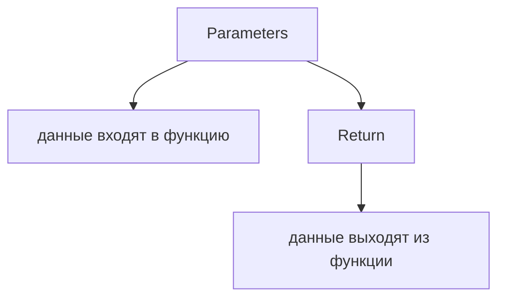

Теперь появляется следующий вопрос:

> Что если функция заранее не знает, сколько arguments получит?

Например, сегодня validator проверяет один status code:

```javascript
validateStatuses(200);
```

Завтра - три:

```javascript
validateStatuses(200, 201, 204);
```

Через неделю - десять.

Главный вопрос этой главы:

> Как функция собирает все входящие arguments?

---

## Предварительные требования

Для этой главы нужно понимать:

* что arguments передаются при вызове функции;
* что parameters получают arguments по позиции;
* что `return` отправляет результат вызывающий код;
* что array может хранить несколько значений на высоком уровне;
* что helper должен иметь читаемую сигнатуру.

Не требуется знать Spread syntax, destructuring with rest, `arguments` object, array methods, callbacks, higher-order functions или TypeScript tuple rest types. Эти темы будут изучаться позже.

---

## Время изучения

Ориентировочное время:

```text
Чтение главы:            100-130 минут
Разбор схем:             35-55 минут
Запуск примеров:         20-30 минут
Практика:                90-120 минут
Повторение материала:    25 минут
```

Уровень сложности: **L3**.

Rest Parameters выглядят как три точки, но важно не заучить символы, а увидеть механизм сбора arguments.

---

## Навигация

Предыдущая глава:

```text
docs/01-javascript/25-return.md
```

Текущая глава:

```text
docs/01-javascript/26-rest.md
```

Следующая глава:

```text
docs/01-javascript/27-spread.md
```

Следующая глава ответит:

> Как распаковать значения из array или object?

---

## Цели обучения

После изучения этой главы вы будете понимать:

* зачем существуют Rest Parameters;
* что делать с неизвестным количеством arguments;
* что означает синтаксис `...rest`;
* как rest parameter собирает arguments;
* почему rest parameter становится array;
* как работает один rest parameter;
* где должен находиться rest parameter;
* что происходит при нуле собранных значений;
* как читать helper APIs с rest parameter;
* какие ошибки встречаются чаще всего;
* как Rest Parameters применяются в Automation QA.

---

## Мотивация

Начнем с обычных parameters.

```javascript
function compareStatus(actualStatus, expectedStatus) {
  return actualStatus === expectedStatus;
}
```

Эта функция знает заранее:

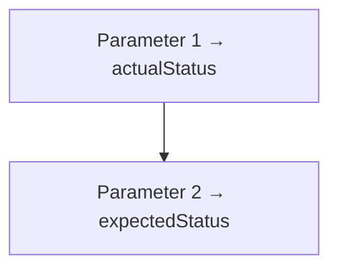

Но иногда количество arguments заранее неизвестно.

```javascript
validateStatuses(200);
validateStatuses(200, 201, 204);
validateStatuses(200, 201, 204, 301, 404);
```

Проблема:

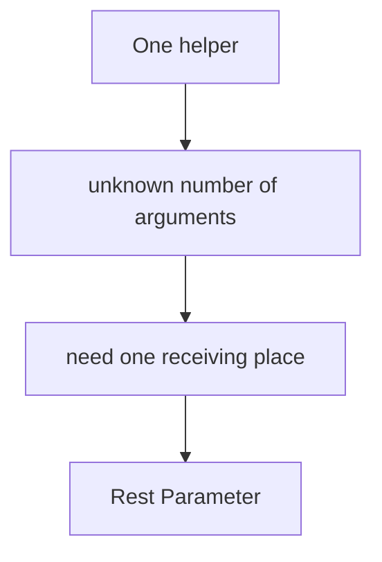

Зачем существуют Rest Parameters:

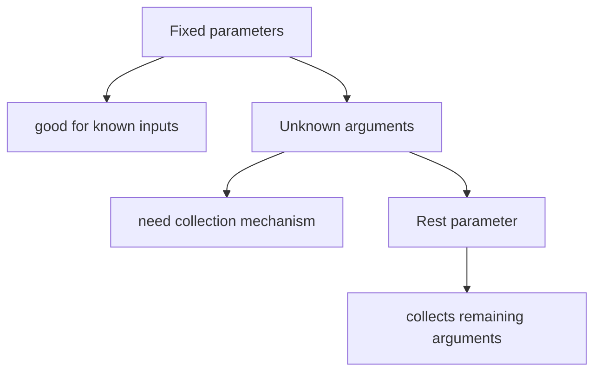

---

## Теория

### Зачем существуют Rest Parameters

Rest Parameters существуют, чтобы функция могла принять неизвестное количество arguments.

Фиксированные параметры:

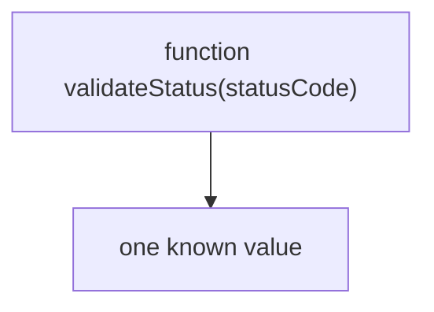

Unknown number of arguments:

```text
validateStatuses(200)
validateStatuses(200, 201)
validateStatuses(200, 201, 204)
```

Rest collection:

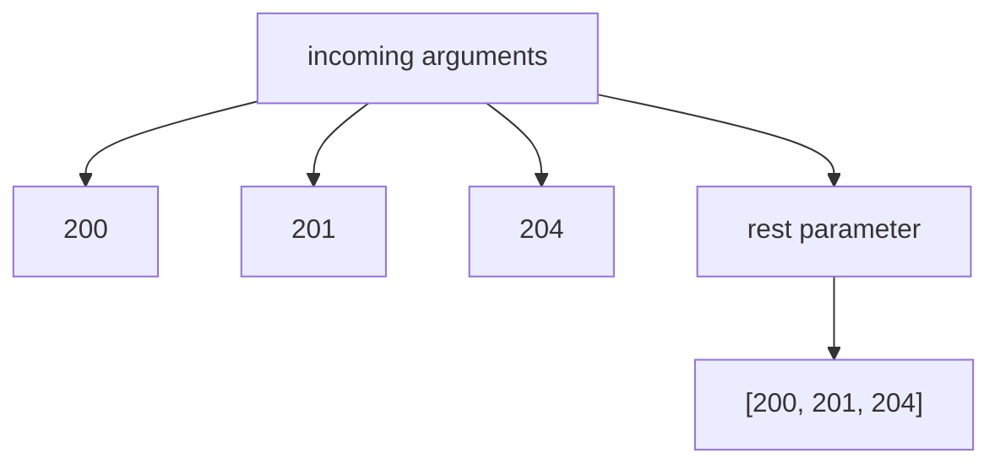

### Синтаксис ...rest

Rest parameter записывается с тремя точками перед именем.

```javascript
function validateStatuses(...statusCodes) {
  console.log(statusCodes);
}
```

Схема:

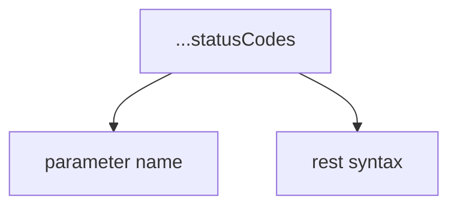

Важно:

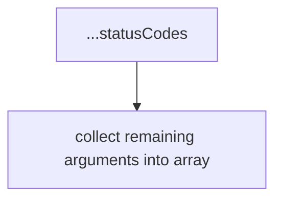

Это не Spread syntax. Spread будет изучаться в следующей главе.

### Collecting arguments

При вызове все подходящие arguments собираются в rest parameter.

```javascript
validateStatuses(200, 201, 204);
```

Argument поток:

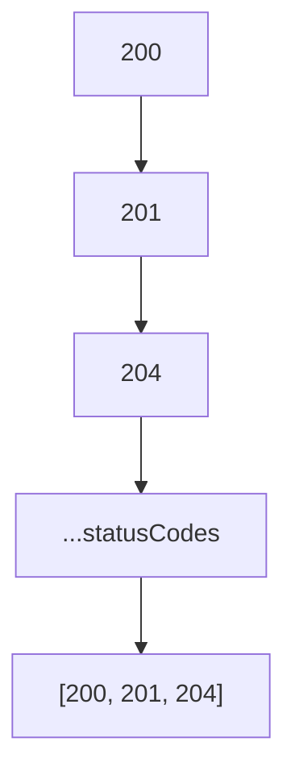

Rest array:

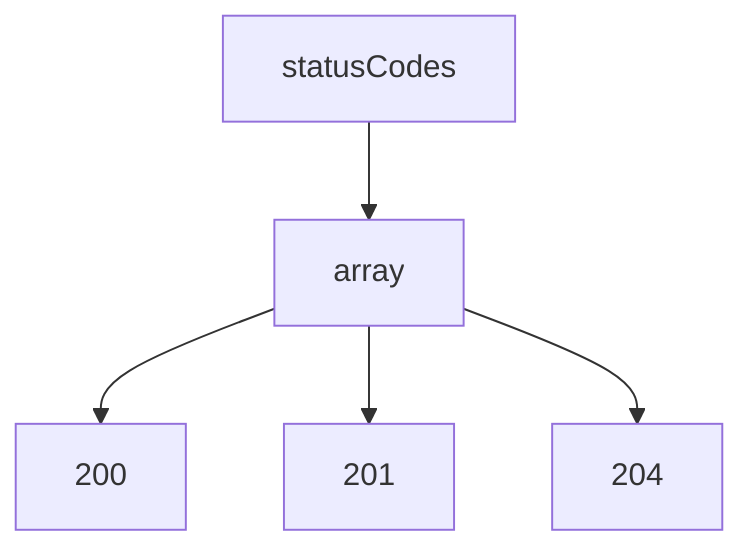

Внутри функции `statusCodes` - обычное имя parameter, но значение в нем array.

### Rest parameter as an array

Rest parameter получает array.

```javascript
function validateStatuses(...statusCodes) {
  console.log(Array.isArray(statusCodes));
}
```

Модель:

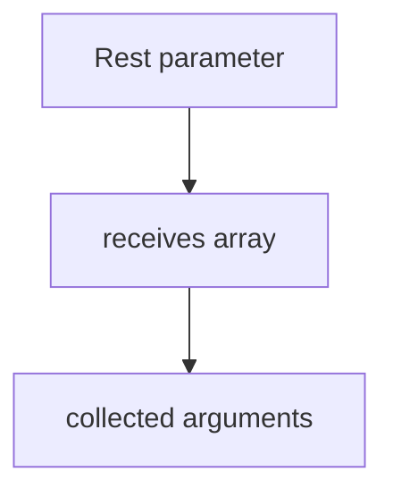

Эта глава не изучает array methods. Пока важно только понять форму данных:

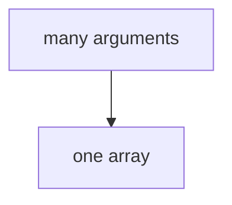

### One rest parameter

Функция может иметь один rest parameter.

```javascript
function collectStatuses(...statusCodes) {
  console.log(statusCodes);
}
```

One rest parameter:

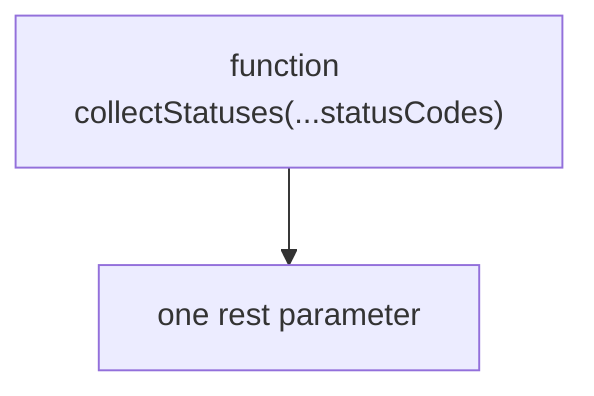

Не нужно добавлять второй rest parameter.

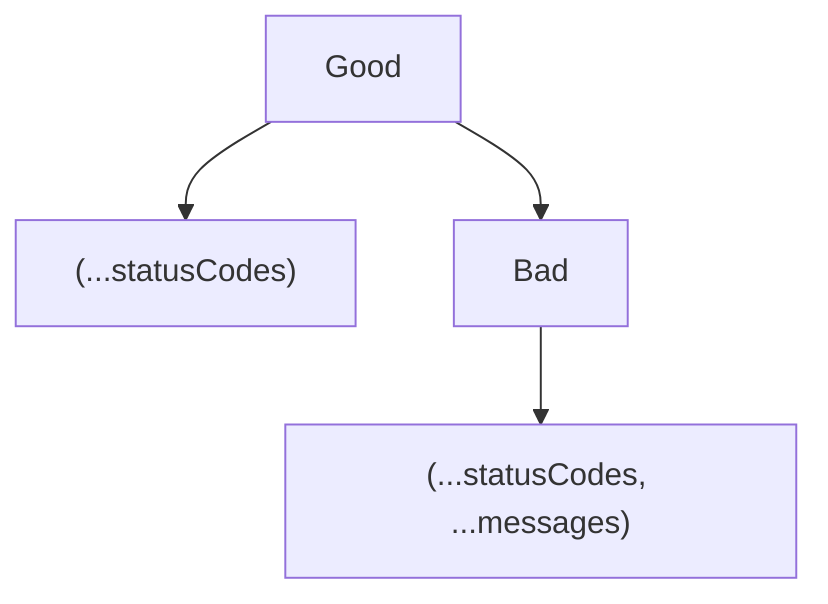

Второй вариант недопустим синтаксически.

### Rest parameter position

Rest parameter должен быть последним в списке parameters.

```javascript
function validateStatuses(expectedStatus, ...actualStatuses) {
  console.log(expectedStatus);
  console.log(actualStatuses);
}
```

Rest position:

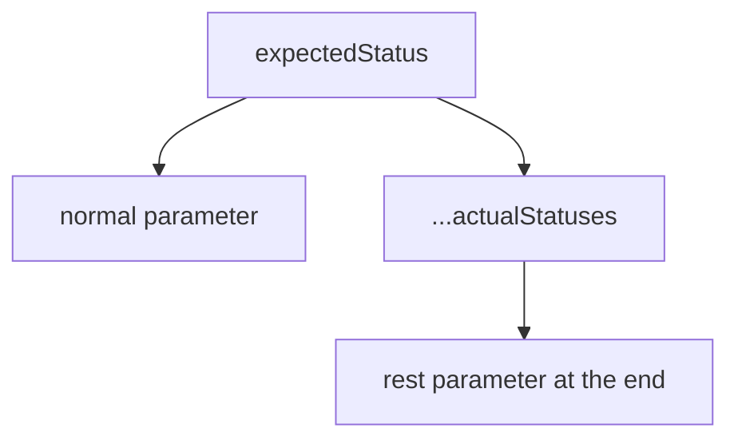

Почему в конце:

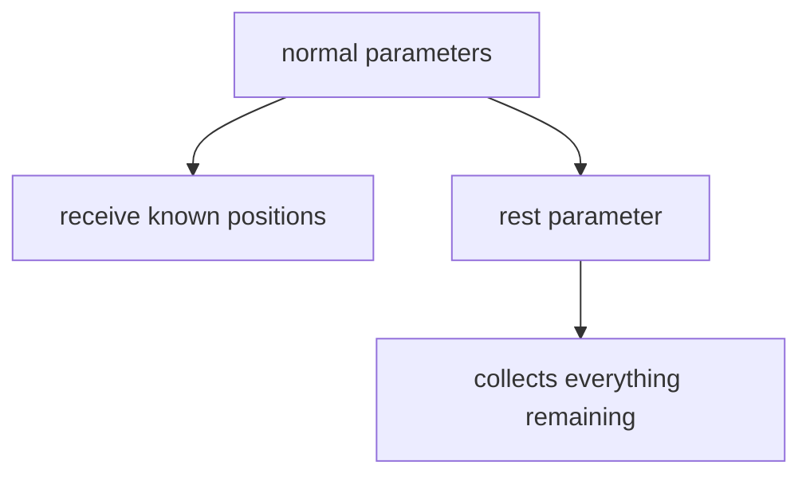

Если rest parameter не последний, JavaScript не сможет понять, что должно остаться для следующих parameters.

### One parameter + Rest

Можно сочетать обычный parameter и rest parameter.

```javascript
function validateStatuses(expectedStatus, ...actualStatuses) {
  console.log(expectedStatus);
  console.log(actualStatuses);
}

validateStatuses(200, 200, 201, 204);
```

Parameter matching:

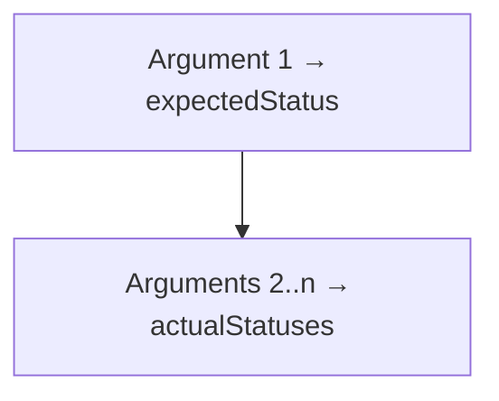

Схема:

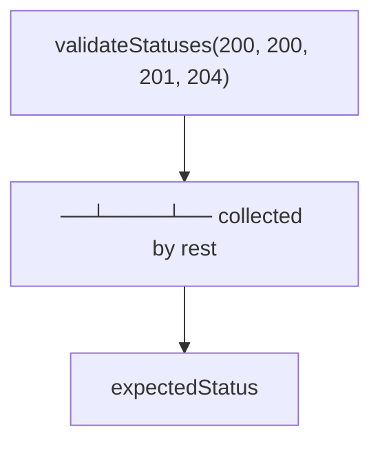

Результат:

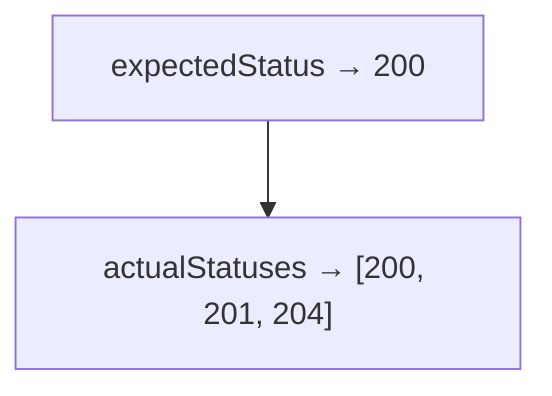

### Zero collected значения

Rest parameter может собрать ноль значений.

```javascript
function collectStatuses(...statusCodes) {
  console.log(statusCodes);
}

collectStatuses();
```

Zero arguments:

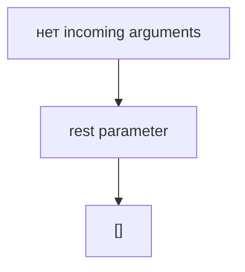

Это не `undefined`. Это empty array.

### Many arguments

Если arguments много, rest parameter соберет их в один array.

```javascript
collectStatuses(200, 201, 204, 301, 404);
```

Many arguments:

```mermaid
flowchart TD
    N1["200"]
    N2["201"]
    N3["204"]
    N4["301"]
    N5["404"]
    N6["[200, 201, 204, 301, 404]"]
    N5 --> N6
    N1 --> N2
    N2 --> N3
    N3 --> N4
    N4 --> N5
```

Function вход model:

```mermaid
flowchart TD
    N1["Known inputs"]
    N2["normal parameters"]
    N3["Unknown remaining inputs"]
    N4["rest parameter"]
    N1 --> N2
    N1 --> N3
    N3 --> N4
```

### Читаемость

Rest parameter должен быть назван как collection.

Плохо:

```javascript
function validateStatuses(...statusCode) {}
```

Лучше:

```javascript
function validateStatuses(...statusCodes) {}
```

Читаемость:

```mermaid
flowchart TD
    N1["Singular name"]
    N2["suggests one value"]
    N3["Plural name"]
    N4["suggests collection"]
    N1 --> N2
    N1 --> N3
    N3 --> N4
```

Хорошие имена:

```text
statusCodes
userEmails
messages
locatorNames
```

---

## Внутренний механизм

На концептуальном уровне rest parameter работает после обычного positional matching.

Жизненный цикл вызова:

```mermaid
flowchart TD
    N1["вызов функции starts"]
    N2["Arguments arrive one by one"]
    N3["Normal parameters receive known positions"]
    N4["Rest parameter collects remaining values"]
    N5["тело функции выполняется"]
    N1 --> N2
    N2 --> N3
    N3 --> N4
    N4 --> N5
```

Rest collection временная шкала:

```mermaid
flowchart TD
    N1["Call: validateStatuses(200, 200, 201)"]
    N2["argument 1 goes to expectedStatus"]
    N3["argument 2 goes into rest array"]
    N4["argument 3 goes into rest array"]
    N1 --> N2
    N1 --> N3
    N1 --> N4
```

Граница функции:

```mermaid
flowchart TD
    N1["Outside function"]
    N2["many separate arguments"]
    N3["Function boundary"]
    N4["Inside function"]
    N5["one array parameter"]
    N1 --> N2
    N1 --> N3
    N3 --> N4
    N4 --> N5
```

Что делает движок:

```mermaid
flowchart TD
    N1["I see validateStatuses(200, 200, 201)."]
    N2["I match first argument to expectedStatus."]
    N3["I collect remaining arguments."]
    N4["I создать an array for actualStatuses."]
    N5["I run the тело функции."]
    N1 --> N2
    N2 --> N3
    N3 --> N4
    N4 --> N5
```

Текущее место в модели JavaScript:

```mermaid
flowchart TD
    N1["Functions"]
    N2["Parameters"]
    N3["known inputs"]
    N4["Return"]
    N5["output"]
    N6["Rest Parameters"]
    N7["unknown number of inputs"]
    N1 --> N2
    N1 --> N3
    N1 --> N4
    N1 --> N5
    N1 --> N6
    N6 --> N7
```

Переход к Spread:

```mermaid
flowchart TD
    N1["Rest Parameters"]
    N2["collect many arguments into array"]
    N3["Next question"]
    N4["how to unpack array values?"]
    N5["Spread"]
    N1 --> N2
    N1 --> N3
    N3 --> N4
    N3 --> N5
```

Spread будет изучаться в следующей главе. В этой главе важно только направление Rest: many incoming arguments → one array.

---

## Ментальная модель

### Корзина

Rest parameter похож на корзину.

```mermaid
flowchart TD
    N1["Arguments"]
    N2["200"]
    N3["201"]
    N4["204"]
    N5["Basket"]
    N6["[200, 201, 204]"]
    N1 --> N2
    N1 --> N3
    N1 --> N4
    N1 --> N5
    N5 --> N6
```

### Коробка

```mermaid
flowchart TD
    N1["Box: statusCodes"]
    N2["item 1: 200"]
    N3["item 2: 201"]
    N4["item 3: 204"]
    N1 --> N2
    N1 --> N3
    N1 --> N4
```

### Пакет для покупок

```mermaid
flowchart TD
    N1["At checkout"]
    N2["item"]
    N3["item"]
    N4["item"]
    N5["One shopping bag"]
    N1 --> N2
    N1 --> N3
    N1 --> N4
    N1 --> N5
```

### Лоток для сбора

```mermaid
flowchart TD
    N1["Incoming values"]
    N2["Collection tray"]
    N3["rest array"]
    N1 --> N2
    N2 --> N3
```

### Mailbox receiving many letters

```mermaid
flowchart TD
    N1["Mailbox: messages"]
    N2["letter 1"]
    N3["letter 2"]
    N4["letter 3"]
    N1 --> N2
    N1 --> N3
    N1 --> N4
```

Краткая ментальная модель:

```text
Arguments arrive one by one.
Normal parameters receive known values.
Rest parameter collects remaining arguments.
Collected values become one array.
```

Complete Rest model:

```mermaid
flowchart TD
    N1["function helper(first, ...rest)"]
    N2["first argument → first"]
    N3["remaining arguments → rest array"]
    N1 --> N2
    N1 --> N3
```

---

## Примеры кода

Все примеры находятся в:

```text
examples/01-javascript/chapter-26/
```

Запуск:

```bash
node examples/01-javascript/chapter-26/01-rest-basic.js
node examples/01-javascript/chapter-26/02-rest-array.js
node examples/01-javascript/chapter-26/03-rest-position.js
node examples/01-javascript/chapter-26/04-zero-many-arguments.js
node examples/01-javascript/chapter-26/05-common-mistakes.js
node examples/01-javascript/chapter-26/06-qa-example.js
```

### 01-rest-basic.js

Показывает базовый rest parameter.

### 02-rest-array.js

Показывает, что rest parameter получает array.

### 03-rest-position.js

Показывает обычный parameter плюс rest parameter в конце.

### 04-zero-many-arguments.js

Показывает empty array при нуле arguments и array при многих arguments.

### 05-common-mistakes.js

Показывает ошибку чтения: rest parameter - collection, а не одно значение.

### 06-qa-example.js

Показывает QA helper, который принимает много actual statuses.

---

## Частые вопросы

### Rest Parameter и Spread - это одно и то же?

Нет. В этой главе Rest собирает incoming arguments в array. Spread будет изучаться в следующей главе.

### Rest parameter получает undefined, если arguments нет?

Нет. Он получает empty array.

### Можно ли поставить rest parameter первым?

Нет, если после него есть другие parameters. Rest parameter должен быть последним.

### Можно ли иметь два rest parameters?

Нет. Один rest parameter собирает все оставшиеся arguments.

### Rest parameter - это arguments object?

Нет. `arguments` object будет изучаться позже. Rest parameter дает обычный array.

### Нужно ли знать array methods?

Пока нет. В этой главе важно понять сбор значения в array.

---

## Распространенные мифы

### Миф: rest parameter собирает только один argument

Реальность:

Rest parameter собирает все remaining arguments в array.

### Миф: если arguments нет, rest parameter равен undefined

Реальность:

Он равен empty array.

### Миф: rest parameter можно поставить где угодно

Реальность:

Он должен быть последним parameter.

### Миф: Rest и Spread можно изучить как одну тему

Реальность:

У них одинаковые три точки, но направление разное. Spread будет изучаться отдельно.

Схема типичных ошибок:

```mermaid
flowchart TD
    N1["Ошибка"]
    N2["поставить rest не последним"]
    N3["ждать undefined вместо []"]
    N4["назвать collection singular name"]
    N5["объяснять Rest через Spread"]
    N6["использовать rest там, где inputs fixed"]
    N1 --> N2
    N1 --> N3
    N1 --> N4
    N1 --> N5
    N1 --> N6
```

---

## Типичные ошибки

### Ошибка 1. Rest parameter не последний

Неправильно:

```javascript
function validateStatuses(...actualStatuses, expectedStatus) {}
```

Правильно:

```javascript
function validateStatuses(expectedStatus, ...actualStatuses) {}
```

### Ошибка 2. Ожидать undefined

```javascript
function collectStatuses(...statusCodes) {
  console.log(statusCodes);
}

collectStatuses();
```

Результат:

```text
[]
```

### Ошибка 3. Плохое имя

Плохо:

```javascript
function collectStatuses(...statusCode) {}
```

Лучше:

```javascript
function collectStatuses(...statusCodes) {}
```

### Ошибка 4. Использовать rest для fixed входs

Если функция всегда получает `actualStatus` и `expectedStatus`, обычные parameters читаются лучше.

```javascript
function compareStatus(actualStatus, expectedStatus) {}
```

### Ошибка 5. Объяснять Rest через Spread

В этой главе модель простая:

```mermaid
flowchart TD
    N1["Rest"]
    N2["many arguments into one array"]
    N1 --> N2
```

Spread будет позже.

---

## Практическое использование

Rest Parameters полезны, когда helper должен принимать переменное количество значений.

```text
validateStatuses(200)
validateStatuses(200, 201)
validateStatuses(200, 201, 204)
```

Практический чек-лист:

```text
1. Количество arguments заранее известно?
2. Если известно, нужны обычные parameters.
3. Если неизвестно, может помочь rest parameter.
4. Rest parameter стоит последним?
5. Имя rest parameter выглядит как collection?
```

Readable helper API:

```text
logMessages(...messages)
collectUserEmails(...userEmails)
validateStatuses(expectedStatus, ...actualStatuses)
```

---

## Использование в Automation QA

### Validators receiving many значения

```javascript
function validateStatuses(expectedStatus, ...actualStatuses) {
  console.log(expectedStatus);
  console.log(actualStatuses);
}
```

Пример QA-helper:

```mermaid
flowchart TD
    N1["expectedStatus"]
    N2["known value"]
    N3["actualStatuses"]
    N4["collected actual values"]
    N1 --> N2
    N1 --> N3
    N3 --> N4
```

### Collecting test data

```javascript
function collectUserEmails(...userEmails) {
  console.log(userEmails);
}
```

### Helper APIs

Rest parameter делает API helper гибким, но не должен скрывать смысл.

```mermaid
flowchart TD
    N1["Good"]
    N2["logMessages(...messages)"]
    N3["Questionable"]
    N4["validateEverything(...items)"]
    N1 --> N2
    N1 --> N3
    N3 --> N4
```

### Flexible logging helpers

```javascript
function logMessages(...messages) {
  console.log(messages);
}
```

### Reusable utility functions

```javascript
function collectLocatorNames(...locatorNames) {
  return locatorNames;
}
```

Spread не нужен для понимания этих examples. Здесь функция только собирает incoming arguments.

---

## Итоги

Rest Parameters отвечают на вопрос:

```text
Что если функция заранее не знает,
сколько arguments получит?
```

Главная модель:

```text
Arguments enter a function.
Normal parameters receive known values.
Rest Parameter collects all remaining arguments into one array.
```

Ключевой поток:

```mermaid
flowchart TD
    N1["arg1, arg2, arg3"]
    N2["...rest"]
    N3["[arg1, arg2, arg3]"]
    N1 --> N2
    N2 --> N3
```

Следующая глава ответит:

```text
Как распаковать значения из array или object?
```

Это тема Spread.

---

## Что нужно запомнить

* Rest parameter собирает remaining arguments.
* Синтаксис rest parameter: `...name`.
* Rest parameter получает array.
* Если значения нет, rest parameter получает `[]`.
* Rest parameter должен быть последним.
* Обычные parameters получают known значения.
* Rest parameter получает unknown remaining значения.
* Имя rest parameter должно звучать как collection.
* В Automation QA Rest полезен для flexible helpers и logging utilities.
* Spread syntax, destructuring, `arguments` object, callbacks и TypeScript tuple rest types будут позже.

---

## Проверьте себя

Ответьте без запуска кода.

1. Зачем существуют Rest Parameters?
2. Что означает `...statusCodes` в parameter list?
3. Что собирает rest parameter?
4. Какой тип значения получает rest parameter?
5. Что будет внутри rest array при нуле arguments?
6. Почему rest parameter должен быть последним?
7. Что получает обычный parameter перед rest parameter?
8. Почему имя rest parameter лучше писать во множественном числе?
9. Где Rest Parameters полезны в Automation QA?
10. Какая тема идет следующей?

---

## Практика

Практика находится в файле:

```text
practice/01-javascript/26-rest.md
```

Сначала решайте задания на предсказание вывода без запуска. Главная цель - видеть, что находится внутри rest array.

---

## Решения

Решения находятся в файле:

```text
solutions/01-javascript/26-rest.md
```

Читайте решения после самостоятельной попытки. Проверяйте главный вопрос: как функция собирает все входящие arguments?
