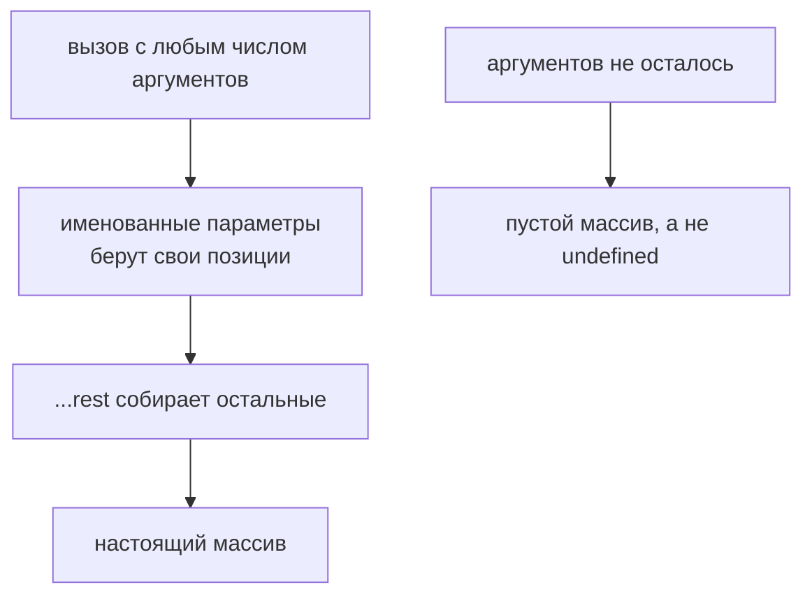

# Параметры сбора

## Связь с предыдущей главой

Предыдущие главы объяснили две стороны функции:

Теперь появляется следующий вопрос:

> Что если функция заранее не знает, сколько arguments получит?

Например, сегодня validator проверяет один status code:

```javascript
validateStatuses(200);
```

Завтра - три:

```javascript
validateStatuses(200, 201, 204);
```

Через неделю - десять.

Главный вопрос этой главы:

> Как функция собирает все входящие arguments?

---

## Предварительные требования

Для этой главы нужно понимать:

* что arguments передаются при вызове функции;
* что parameters получают arguments по позиции;
* что `return` отправляет результат вызывающий код;
* что array может хранить несколько значений на высоком уровне;
* что helper должен иметь читаемую сигнатуру.

Не требуется знать Spread syntax, destructuring with rest, `arguments` object, array methods, callbacks, higher-order functions или TypeScript tuple rest types. Эти темы будут изучаться позже.

---

## Время изучения

Ориентировочное время:

```text
Чтение главы:            100-130 минут
Разбор схем:             35-55 минут
Запуск примеров:         20-30 минут
Практика:                90-120 минут
Повторение материала:    25 минут
```

Уровень сложности: **L3**.

Rest Parameters выглядят как три точки, но важно не заучить символы, а увидеть механизм сбора arguments.

---

## Навигация

Предыдущая глава:

```text
docs/01-javascript/25-return.md
```

Текущая глава:

```text
docs/01-javascript/26-rest.md
```

Следующая глава:

```text
docs/01-javascript/27-spread.md
```

Следующая глава ответит:

> Как распаковать значения из array или object?

---

## Цели обучения

После изучения этой главы вы будете понимать:

* зачем существуют Rest Parameters;
* что делать с неизвестным количеством arguments;
* что означает синтаксис `...rest`;
* как rest parameter собирает arguments;
* почему rest parameter становится array;
* как работает один rest parameter;
* где должен находиться rest parameter;
* что происходит при нуле собранных значений;
* как читать helper APIs с rest parameter;
* какие ошибки встречаются чаще всего;
* как Rest Parameters применяются в Automation QA.

---

## Мотивация

Начнем с обычных parameters.

```javascript
function compareStatus(actualStatus, expectedStatus) {
  return actualStatus === expectedStatus;
}
```

Эта функция знает заранее:

Но иногда количество arguments заранее неизвестно.

```javascript
validateStatuses(200);
validateStatuses(200, 201, 204);
validateStatuses(200, 201, 204, 301, 404);
```

Проблема:

Зачем существуют Rest Parameters:

---

## Теория

### Зачем существуют остаточные параметры

Остаточные параметры существуют, чтобы функция могла принять неизвестное количество аргументов.

Фиксированные параметры:

```text
function validateStatus(statusCode)        —  ровно один аргумент
function compareStatus(actual, expected)   —  ровно два
```

Неизвестное количество аргументов:

```text
validateStatuses(200)
validateStatuses(200, 201)
validateStatuses(200, 201, 204)
```

Сбор аргументов:

```text
все аргументы, которым не хватило именованного параметра,
складываются в один массив
```

### Синтаксис `...имя`

Остаточный параметр записывается с тремя точками перед именем.

```javascript
function validateStatuses(...statusCodes) {
  console.log(statusCodes);
}
```

Схема:

```text
validateStatuses(200, 201, 204)
                 └──────┬──────┘
                        └──→ statusCodes = [200, 201, 204]
```

Важно:

Это не раскрытие. Раскрытие будет изучаться в следующей главе.

### Сбор аргументов

При вызове все подходящие аргументы собираются в остаточный параметр.

```javascript
validateStatuses(200, 201, 204);
```

Поток аргументов:

```text
validateStatuses(200, 201, 204)
                 └──────┬─────┘
                 statusCodes = [200, 201, 204]
```

Массив собирается на каждый вызов заново: при вызове без аргументов он будет
пустым (`[]`), а не `undefined`.

Внутри функции `statusCodes` — обычное имя параметра, но лежит в нём массив.

### Остаточный параметр как массив

Остаточный параметр получает массив.

```javascript
function validateStatuses(...statusCodes) {
  console.log(Array.isArray(statusCodes));
}
```

Модель:

```text
rest-параметр всегда получает массив,
даже если аргументов не передали вовсе — тогда он пустой
```

Эта глава не изучает методы массивов. Пока важно только понять форму данных:

```text
validateStatuses(200, 201)  →  statusCodes = [200, 201]
validateStatuses()          →  statusCodes = []
```

Форма всегда одна — массив; меняется только его длина.

### Один остаточный параметр

У функции может быть один остаточный параметр.

```javascript
function collectStatuses(...statusCodes) {
  console.log(statusCodes);
}
```

Один остаточный параметр:

Не нужно добавлять второй остаточный параметр.

Второй вариант недопустим синтаксически.

### Место остаточного параметра

Остаточный параметр должен быть последним в списке параметров.

```javascript
function validateStatuses(expectedStatus, ...actualStatuses) {
  console.log(expectedStatus);
  console.log(actualStatuses);
}
```

Положение параметра сбора — всегда последнее:

```javascript
function f(...rest, last) {}   // SyntaxError
```

Почему в конце: остаточный параметр забирает **все** оставшиеся аргументы.

Если он не последний, JavaScript не сможет понять, что должно остаться для следующих параметров.

### Обычный параметр плюс остаточный

Обычный и остаточный параметры можно сочетать.

```javascript
function validateStatuses(expectedStatus, ...actualStatuses) {
  console.log(expectedStatus);
  console.log(actualStatuses);
}

validateStatuses(200, 200, 201, 204);
```

Сопоставление идёт слева направо: сначала обычные параметры получают свои
значения по позиции, и только потом остаток собирается в массив.

Схема:

```text
validateStatuses(200, 200, 201, 204)
                 └───────┬────────┘
                         └──→ один массив из четырёх значений
```

Результат: внутри функции `statusCodes` равен `[200, 200, 201, 204]`.

### Ноль собранных значений

Остаточный параметр может собрать ноль значений.

```javascript
function collectStatuses(...statusCodes) {
  console.log(statusCodes);
}

collectStatuses();
```

Ноль аргументов:

```text
collectStatuses()  →  statusCodes = []
```

Это не `undefined`. Это пустой массив.

### Много аргументов

Если аргументов много, остаточный параметр соберёт их в один массив.

```javascript
collectStatuses(200, 201, 204, 301, 404);
```

Много аргументов:

```text
statusCodes = [200, 201, 204, 301, 404]
```

Модель входа функции:

```text
вызов          —  значения перечислены через запятую
внутри функции —  те же значения лежат в одном массиве
```

### Читаемость

Остаточный параметр должен называться как коллекция.

Плохо:

```javascript
function validateStatuses(...statusCode) {}
```

Лучше:

```javascript
function validateStatuses(...statusCodes) {}
```

Читаемость здесь решает имя: по нему должно быть видно, что внутри массив, а не
одно значение — поэтому имя ставят во множественном числе.

Хорошие имена:

```text
statusCodes
userEmails
messages
locatorNames
```

---

Остаточный параметр забирает то, что не разобрали именованные:


```mermaid
flowchart TD
    A["вызов с любым числом аргументов"] --> B["именованные параметры<br/>берут свои позиции"]
    B --> C["...rest собирает остальные"]
    C --> D["настоящий массив"]
    E["аргументов не осталось"] --> F["пустой массив, а не undefined"]
```

## Внутренний механизм

На концептуальном уровне остаточный параметр работает после обычного сопоставления по позиции.

Что делает движок при вызове:

```text
1. взять список переданных аргументов
2. выдать значения обычным параметрам по позиции
3. всё, что осталось, собрать в НОВЫЙ массив
4. связать этот массив с именем остаточного параметра
```

Шаг 3 объясняет два свойства сразу: массив создаётся на каждый вызов (и его можно
безопасно изменять), а при отсутствии лишних аргументов он получается пустым.

Граница функции при этом не меняется: снаружи вызов выглядит как обычный вызов с
любым числом аргументов, внутри — как работа с одним массивом.

```text
снаружи │ validateStatuses(200, 201, 204)   — три аргумента
внутри  │ statusCodes.length === 3          — один массив
```

Раскрытие будет изучаться в следующей главе. Здесь важно только направление: много входящих аргументов → один массив.

---

## Ментальная модель

### Корзина

Остаточный параметр похож на корзину: сколько бы предметов ни положили, наружу она
остаётся одной корзиной.

```text
положили 0 предметов  →  корзина пустая, но она есть
положили 5            →  та же корзина, в ней 5 предметов
```

Именно поэтому внутри функции работают не с «неизвестным числом аргументов»,
а с обычным массивом.

### Почтовый ящик, принимающий много писем

Краткая ментальная модель:

```text
Аргументы приходят по одному.
Normal parameters receive known values.
Rest parameter collects remaining arguments.
Собранные значения становятся одним массивом.
```

Полная модель такая: обычные параметры разбирают аргументы по позициям, а
параметр сбора забирает всё, что осталось, и всегда даёт массив — даже когда
осталось ноль аргументов. Поэтому он обязан стоять последним: после него
разбирать уже нечего.

---

## Примеры кода

Все примеры находятся в:

```text
examples/01-javascript/chapter-26/
```

Запуск:

```bash
node examples/01-javascript/chapter-26/01-rest-basic.js
node examples/01-javascript/chapter-26/02-rest-array.js
node examples/01-javascript/chapter-26/03-rest-position.js
node examples/01-javascript/chapter-26/04-zero-many-arguments.js
node examples/01-javascript/chapter-26/05-common-mistakes.js
node examples/01-javascript/chapter-26/06-qa-example.js
```

### 01-rest-basic.js

Показывает базовый остаточный параметр.

### 02-rest-array.js

Показывает, что остаточный параметр получает массив.

### 03-rest-position.js

Показывает обычный параметр плюс остаточный в конце.

### 04-zero-many-arguments.js

Показывает пустой массив при нуле аргументов и массив при многих.

### 05-common-mistakes.js

Показывает ошибку чтения: остаточный параметр — коллекция, а не одно значение.

### 06-qa-example.js

Показывает вспомогательную функцию, которая принимает много фактических статусов.

---

## Частые вопросы

### Остаточный параметр и раскрытие — это одно и то же?

Нет. В этой главе остаточный параметр собирает входящие аргументы в массив. Раскрытие будет изучаться в следующей главе.

### Остаточный параметр получает `undefined`, если аргументов нет?

Нет. Он получает пустой массив.

### Можно ли поставить остаточный параметр первым?

Нет, если после него есть другие параметры. Он должен быть последним.

### Можно ли иметь два остаточных параметра?

Нет. Один остаточный параметр собирает все оставшиеся аргументы.

### Остаточный параметр — это объект `arguments`?

Нет. Объект `arguments` будет изучаться позже. Остаточный параметр даёт обычный массив.

### Нужно ли знать методы массивов?

Пока нет. В этой главе важно понять сбор значений в массив.

---

## Распространённые мифы

### Миф: остаточный параметр собирает только один аргумент

Реальность:

Он собирает все оставшиеся аргументы в массив.

### Миф: если аргументов нет, остаточный параметр равен `undefined`

Реальность:

Он равен пустому массиву.

### Миф: остаточный параметр можно поставить где угодно

Реальность:

Он должен быть последним параметром.

### Миф: сбор и раскрытие можно изучить как одну тему

Реальность:

У них одинаковые три точки, но направление разное. Раскрытие изучается отдельно.

---

## Распространённые ошибки

### Ошибка 1. Остаточный параметр не последний

Неправильно:

```javascript
function validateStatuses(...actualStatuses, expectedStatus) {}
```

Правильно:

```javascript
function validateStatuses(expectedStatus, ...actualStatuses) {}
```

### Ошибка 2. Ожидать `undefined`

```javascript
function collectStatuses(...statusCodes) {
  console.log(statusCodes);
}

collectStatuses();
```

Результат:

```text
[]
```

### Ошибка 3. Плохое имя

Плохо:

```javascript
function collectStatuses(...statusCode) {}
```

Лучше:

```javascript
function collectStatuses(...statusCodes) {}
```

### Ошибка 4. Использовать сбор для фиксированного набора входов

Если функция всегда получает `actualStatus` и `expectedStatus`, обычные параметры читаются лучше.

```javascript
function compareStatus(actualStatus, expectedStatus) {}
```

### Ошибка 5. Объяснять сбор через раскрытие

В этой главе модель простая: остаточный параметр собирает несколько аргументов в один массив при объявлении функции.

Раскрытие будет позже.

---

## Практическое использование

Остаточные параметры полезны, когда функция должна принимать переменное количество значений.

```text
validateStatuses(200)
validateStatuses(200, 201)
validateStatuses(200, 201, 204)
```

Практический чек-лист:

```text
1. Количество arguments заранее известно?
2. Если известно, нужны обычные parameters.
3. Если неизвестно, может помочь rest parameter.
4. Rest parameter стоит последним?
5. Имя rest parameter выглядит как collection?
```

Читаемый интерфейс вспомогательной функции:

```text
logMessages(...messages)
collectUserEmails(...userEmails)
validateStatuses(expectedStatus, ...actualStatuses)
```

---

## Использование в Automation QA

### Проверки, получающие много значений

```javascript
function validateStatuses(expectedStatus, ...actualStatuses) {
  console.log(expectedStatus);
  console.log(actualStatuses);
}
```

Пример вспомогательной функции: `function checkAll(expected, ...actual)` — первый аргумент обязателен, остальные собираются в массив для проверки.

### Сбор тестовых данных

```javascript
function collectUserEmails(...userEmails) {
  console.log(userEmails);
}
```

### Интерфейсы вспомогательных функций

Остаточный параметр делает вспомогательную функцию гибкой, но не должен скрывать смысл.

### Гибкие функции журналирования

```javascript
function logMessages(...messages) {
  console.log(messages);
}
```

### Переиспользуемые утилиты

```javascript
function collectLocatorNames(...locatorNames) {
  return locatorNames;
}
```

Раскрытие для понимания этих примеров не нужно. Здесь функция только собирает входящие аргументы.

---

## Итоги

Остаточные параметры отвечают на вопрос:

```text
Что если функция заранее не знает,
сколько arguments получит?
```

Главная модель:

```text
Аргументы приходят в функцию.
Обычные параметры получают известные значения по позиции.
Остаточный параметр собирает все оставшиеся аргументы в один массив.
```

Ключевой поток: **много входящих аргументов → один массив внутри функции**.

Следующая глава ответит на обратный вопрос:

```text
Как распаковать значения из массива или объекта?
```

Это тема раскрытия.

---

## Что нужно запомнить

* Остаточный параметр собирает оставшиеся аргументы.
* Синтаксис остаточного параметра: `...имя`.
* Остаточный параметр получает массив.
* Если значений нет, он получает `[]`.
* Остаточный параметр должен быть последним.
* Обычные параметры получают известные значения.
* Остаточный параметр получает заранее неизвестные оставшиеся значения.
* Его имя должно звучать как название коллекции.
* В автоматизации тестов сбор полезен для гибких вспомогательных функций и журналирования.
* Раскрытие, деструктуризация, объект `arguments`, обратные вызовы и типы кортежей будут позже.

---

## Проверьте себя

Ответьте без запуска кода.

1. Зачем существуют остаточные параметры?
2. Что означает `...statusCodes` в списке параметров?
3. Что собирает остаточный параметр?
4. Какого типа значение получает остаточный параметр?
5. Что будет в нём при нуле аргументов?
6. Почему остаточный параметр должен быть последним?
7. Что получает обычный параметр перед остаточным?
8. Почему имя остаточного параметра лучше писать во множественном числе?
9. Где остаточные параметры полезны в автоматизации тестов?
10. Какая тема идет следующей?

### Ответы

1. Чтобы функция принимала заранее неизвестное количество аргументов и работала с ними как с одним списком.
2. Что все аргументы, которым не досталось именованного параметра, будут собраны в массив `statusCodes`.
3. Оставшиеся аргументы вызова — те, что идут после всех именованных параметров.
4. Всегда массив.
5. Пустой массив. Не `undefined` — форма значения одна и та же, меняется только длина.
6. Он забирает все оставшиеся аргументы, поэтому после него параметру ничего не досталось бы. Язык запрещает такую запись.
7. Своё значение по позиции, как обычно. Сбор в массив начинается только с остаточного параметра.
8. Потому что это список, а не одно значение. Имя `statusCodes` подсказывает, что внутри массив, а `statusCode` ввело бы в заблуждение.
9. В функциях, принимающих набор ожидаемых значений или несколько проверок сразу, и в обёртках, которые передают аргументы дальше, не зная их состава.
10. Обратная операция: как раскрыть готовый список обратно в отдельные значения.

---

## Практика

Практика находится в файле:

```text
practice/01-javascript/26-rest.md
```

Сначала решайте задания на предсказание вывода без запуска. Главная цель — видеть, что находится внутри собранного массива.

---

## Решения

Решения находятся в файле:

```text
solutions/01-javascript/26-rest.md
```

Читайте решения после самостоятельной попытки. Проверяйте главный вопрос: как функция собирает все входящие аргументы?
