# Spread

## Связь с предыдущей главой

Предыдущая глава объяснила Rest Parameters.

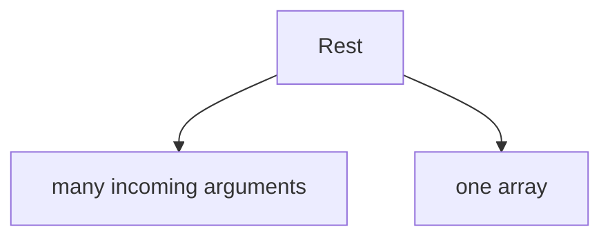

Теперь появляется обратный вопрос:

> Как один array снова превратить в много отдельных значений?

Например, функция ожидает три arguments:

```javascript
function compareStatuses(firstStatus, secondStatus, thirdStatus) {
  console.log(firstStatus, secondStatus, thirdStatus);
}
```

А значения уже лежат в одном array:

```javascript
const statuses = [200, 201, 204];
```

Как передать array так, чтобы функция получила три отдельных значения?

Главный вопрос этой главы:

> Как раскрываются значения?

---

## Предварительные требования

Для этой главы нужно понимать:

* что arguments передаются в function call;
* что parameters получают arguments по позиции;
* что Rest Parameter собирает many arguments into one array;
* что array хранит значения по порядку;
* что object хранит properties;
* что references и shallow copy уже были объяснены на концептуальном уровне.

Не требуется знать deep copy, `structuredClone`, recursion, destructuring with rest, immutable состояние management, React patterns или advanced object merging. Эти темы будут изучаться позже.

---

## Время изучения

Ориентировочное время:

```text
Чтение главы:            110-140 минут
Разбор схем:             40-60 минут
Запуск примеров:         20-30 минут
Практика:                100-130 минут
Повторение материала:    25 минут
```

Уровень сложности: **L3**.

Spread использует те же три точки, что и Rest, но направление другое. Это главная мысль главы.

---

## Навигация

Предыдущая глава:

```text
docs/01-javascript/26-rest.md
```

Текущая глава:

```text
docs/01-javascript/27-spread.md
```

Следующая глава:

```text
docs/01-javascript/28-closures.md
```

Следующая глава ответит:

> Как функция может помнить данные после выполнения?

---

## Цели обучения

После изучения этой главы вы будете понимать:

* зачем существует Spread syntax;
* чем Spread отличается от Rest;
* как раскрывать array значения;
* как раскрывать object properties;
* как использовать Spread в function call;
* как копировать arrays на высоком уровне;
* как копировать objects на высоком уровне;
* как объединять arrays;
* как объединять objects;
* что такое shallow copy на высоком уровне;
* какие ошибки встречаются чаще всего;
* как Spread используется в Automation QA.

---

## Мотивация

Начнем с проблемы.

Функция ожидает отдельные arguments:

```javascript
function validateThreeStatuses(firstStatus, secondStatus, thirdStatus) {
  console.log(firstStatus);
  console.log(secondStatus);
  console.log(thirdStatus);
}
```

Но данные уже собраны в array:

```javascript
const statuses = [200, 201, 204];
```

Проблема:

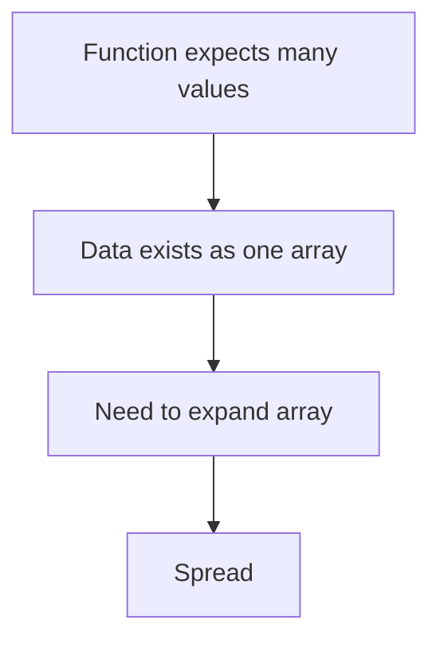

Зачем существует Spread:

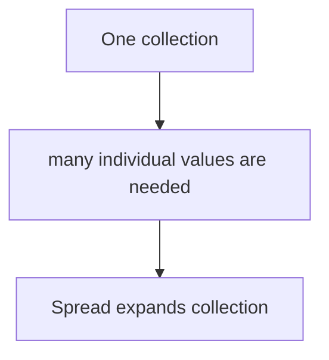

Главный вопрос:

> Как раскрываются значения?

---

## Теория

### Rest vs Spread

Начнем с направления.

Rest:

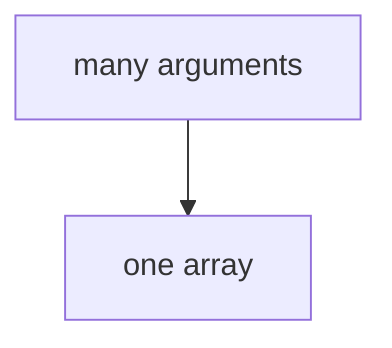

Spread:

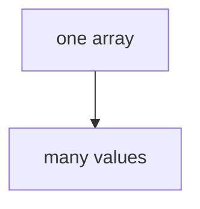

Complete Rest ↔ Spread picture:

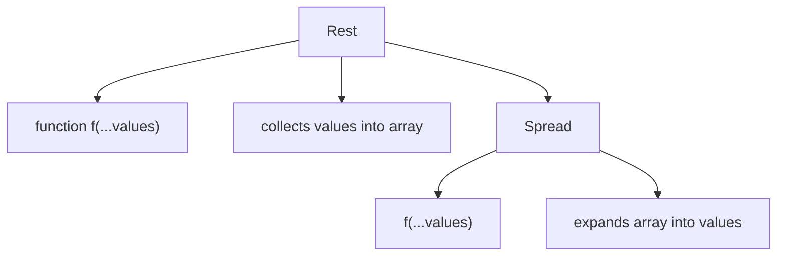

Одинаковые три точки не означают одну универсальную операцию. Значение зависит от места в коде.

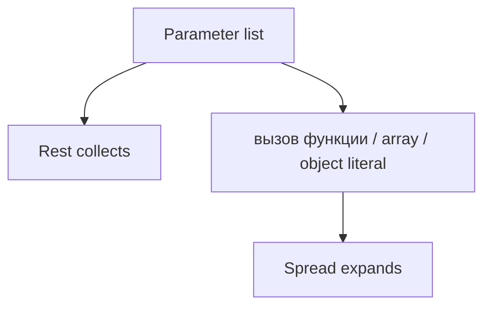

### Зачем существует Spread

Spread нужен, когда одно collection value должно раскрыться в отдельные значения.

Collection expansion:

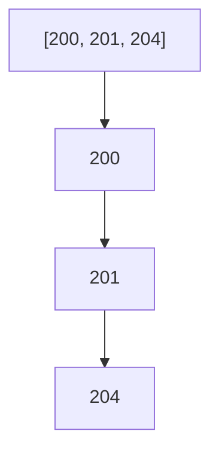

Spread direction:

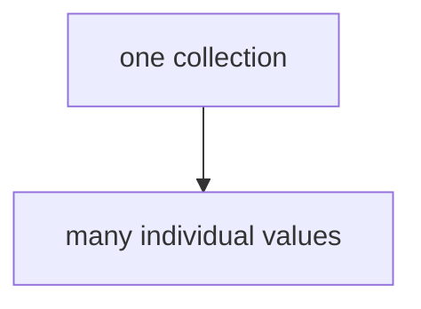

Это обратное направление относительно Rest.

### Expanding array значения

Array можно раскрыть через `...`.

```javascript
const statuses = [200, 201, 204];

console.log(...statuses);
```

Array expansion:

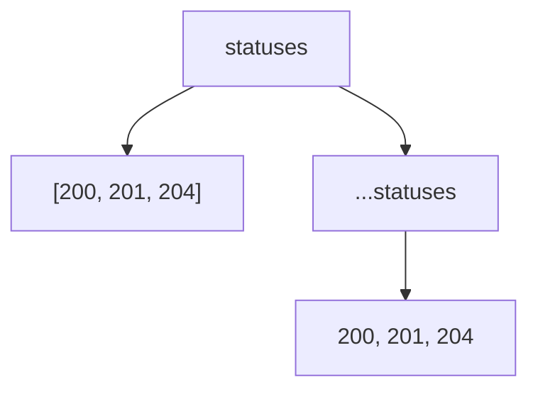

Spread не изменяет сам array. Он раскрывает его значения в текущем месте.

### Function calls with Spread

Spread часто используется в function call.

```javascript
function validateThreeStatuses(firstStatus, secondStatus, thirdStatus) {
  console.log(firstStatus, secondStatus, thirdStatus);
}

const statuses = [200, 201, 204];

validateThreeStatuses(...statuses);
```

Function call:

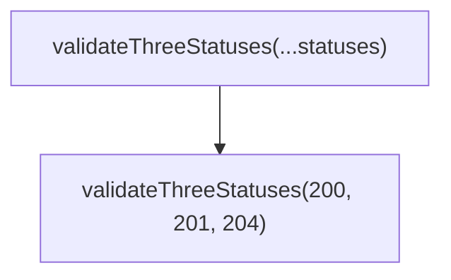

Вызов функции:

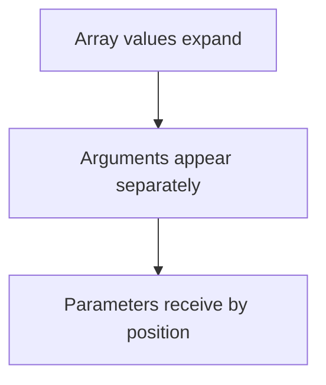

Parameters still receive значения by position.

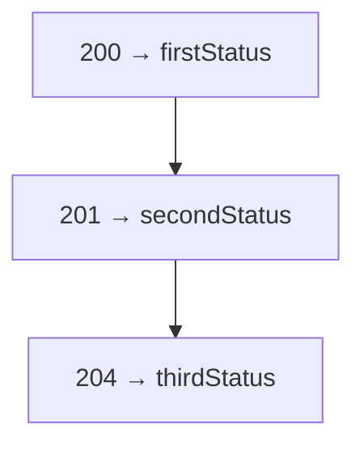

### Expanding object properties

Spread can also expand object properties inside object literal.

```javascript
const baseUser = {
  role: 'user'
};

const adminUser = {
  ...baseUser,
  role: 'admin'
};
```

Object expansion:

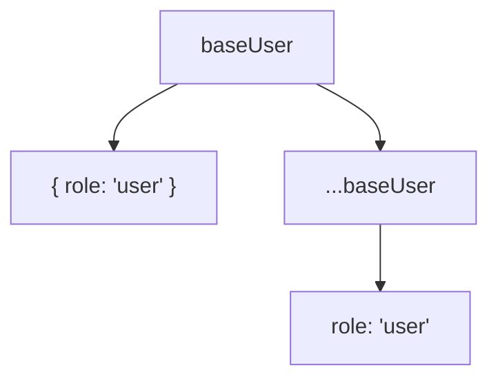

Object spread expands properties, not function arguments.

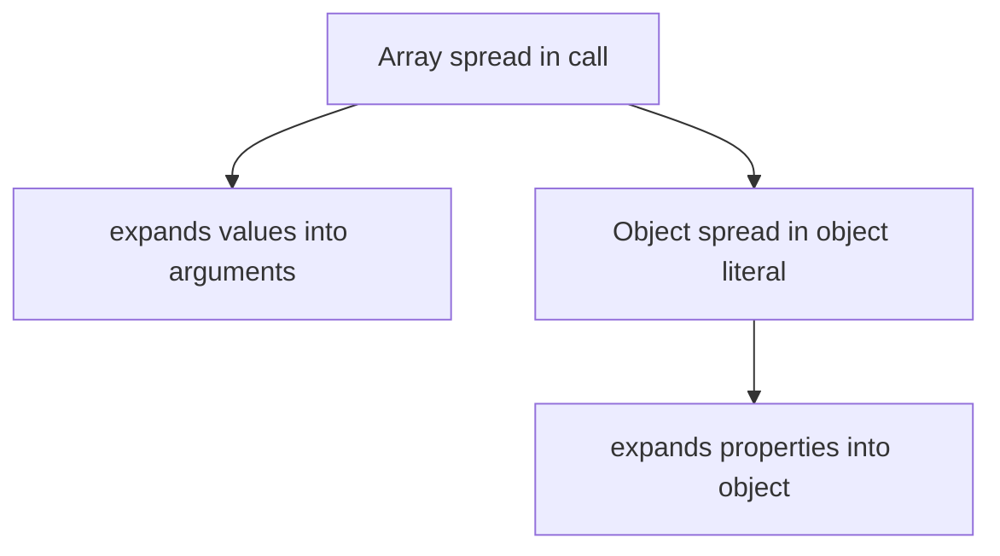

### Copying arrays

Spread can create a shallow copy of an array.

```javascript
const statuses = [200, 201];
const copiedStatuses = [...statuses];
```

Copy array:

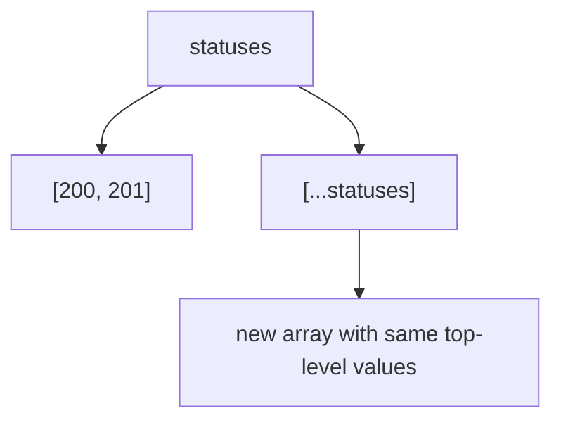

Это shallow copy. Deep copy будет отдельной темой.

### Copying objects

Object spread can create a shallow copy of an object.

```javascript
const basePayload = {
  role: 'user'
};

const copiedPayload = {
  ...basePayload
};
```

Copy object:

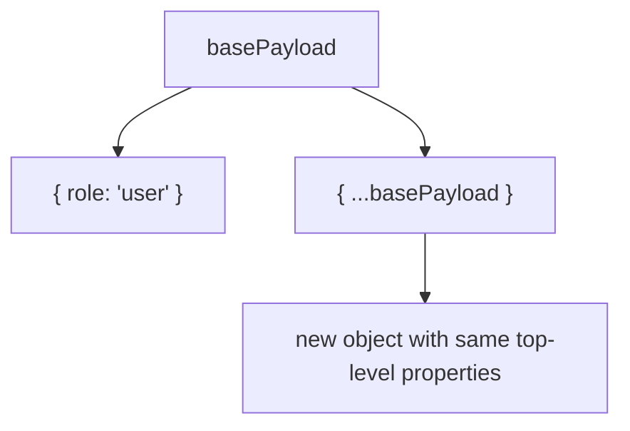

Again: this is shallow copy.

### Combining arrays

Spread can combine arrays.

```javascript
const smokeStatuses = [200, 201];
const regressionStatuses = [204, 301];

const allStatuses = [...smokeStatuses, ...regressionStatuses];
```

Merge arrays:

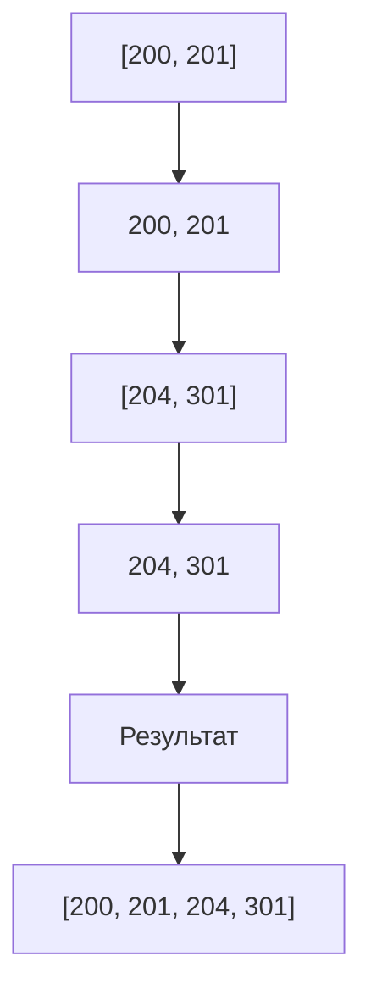

### Combining objects

Object spread can combine objects.

```javascript
const baseConfig = {
  retries: 1
};

const localConfig = {
  baseUrl: 'http://localhost'
};

const config = {
  ...baseConfig,
  ...localConfig
};
```

Merge objects:

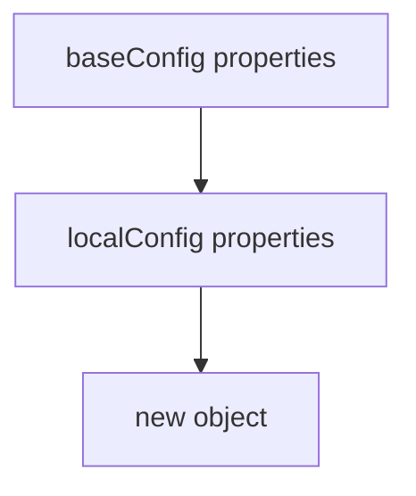

If the same property appears later, later value wins at this high level.

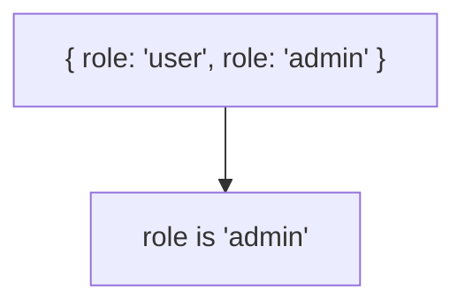

Advanced object merging will be studied later.

### Shallow copy

Shallow copy means top-level container is new, but nested objects are not deeply copied.

```mermaid
flowchart TD
    N1["New outer array/object"]
    N2["same nested object references at deeper levels"]
    N1 --> N2
```

Shallow copy:

```mermaid
flowchart TD
    N1["Top level"]
    N2["copied"]
    N3["Nested level"]
    N4["not deeply copied here"]
    N1 --> N2
    N1 --> N3
    N3 --> N4
```

Эта глава не учит deep copy или `structuredClone`.

### Читаемость

Spread is useful when expansion is visible and meaningful.

Читаемость:

```mermaid
flowchart TD
    N1["Good"]
    N2["validateThreeStatuses(...statuses)"]
    N3["Questionable"]
    N4["too many spreads in one expression"]
    N1 --> N2
    N1 --> N3
    N3 --> N4
```

Spread should answer:

```text
What collection is being expanded?
Where are values expanded into?
```

---

## Внутренний механизм

Spread is contextual.

```mermaid
flowchart TD
    N1["... inside function parameter list"]
    N2["Rest"]
    N3["... inside вызов функции"]
    N4["Spread"]
    N5["... inside array literal"]
    N6["Spread"]
    N7["... inside object literal"]
    N8["Spread"]
    N1 --> N2
    N1 --> N3
    N3 --> N4
    N3 --> N5
    N5 --> N6
    N5 --> N7
    N7 --> N8
```

Spread lifecycle:

```mermaid
flowchart TD
    N1["Engine reaches ...statuses"]
    N2["reads collection"]
    N3["expands top-level values"]
    N4["places values into current context"]
    N1 --> N2
    N2 --> N3
    N3 --> N4
```

Data expansion:

```mermaid
flowchart TD
    N1["Collection"]
    N2["Spread"]
    N3["Individual values"]
    N4["Current context receives them"]
    N1 --> N2
    N2 --> N3
    N3 --> N4
```

Function invocation with spread:

```mermaid
flowchart TD
    N1["statuses = [200, 201, 204]"]
    N2["validate(...statuses)"]
    N3["validate(200, 201, 204)"]
    N4["parameters receive values"]
    N1 --> N2
    N2 --> N3
    N3 --> N4
```

Текущее место в модели JavaScript:

```mermaid
flowchart TD
    N1["Functions"]
    N2["Parameters"]
    N3["Return"]
    N4["Rest"]
    N5["collect many into one"]
    N6["Spread"]
    N7["expand one into many"]
    N1 --> N2
    N1 --> N3
    N1 --> N4
    N1 --> N5
    N1 --> N6
    N6 --> N7
```

Переход к Closures:

```mermaid
flowchart TD
    N1["Spread"]
    N2["values are moved into calls and objects"]
    N3["Next question"]
    N4["how can function remember data after выполнение?"]
    N5["Closures"]
    N1 --> N2
    N1 --> N3
    N3 --> N4
    N3 --> N5
```

---

## Ментальная модель

### Opening a box

```mermaid
flowchart TD
    N1["Box"]
    N2["[200, 201, 204]"]
    N3["open box"]
    N4["200"]
    N5["201"]
    N6["204"]
    N1 --> N2
    N1 --> N3
    N3 --> N4
    N4 --> N5
    N5 --> N6
```

### Unpacking luggage

```mermaid
flowchart TD
    N1["Suitcase"]
    N2["shirt"]
    N3["shoes"]
    N4["jacket"]
    N5["unpacked items"]
    N1 --> N2
    N1 --> N3
    N1 --> N4
    N1 --> N5
```

### Emptying a basket

Basket opening:

```mermaid
flowchart TD
    N1["Basket"]
    N2["value 1"]
    N3["value 2"]
    N4["value 3"]
    N5["individual values"]
    N1 --> N2
    N1 --> N3
    N1 --> N4
    N1 --> N5
```

### Dealing cards

```mermaid
flowchart TD
    N1["Deck"]
    N2["[card1, card2, card3]"]
    N3["deal cards"]
    N4["card1, card2, card3"]
    N1 --> N2
    N1 --> N3
    N3 --> N4
```

### Unpacking a delivery

```mermaid
flowchart TD
    N1["Delivery package"]
    N2["object properties"]
    N3["unpacked into new object"]
    N1 --> N2
    N1 --> N3
```

Краткая ментальная модель:

```text
Spread expands one collection.
Array spread expands values.
Object spread expands properties.
Rest collects.
Spread expands.
```

Complete Spread model:

```mermaid
flowchart TD
    N1["Collection"]
    N2["..."]
    N3["expanded values/properties"]
    N4["new context"]
    N1 --> N2
    N2 --> N3
    N3 --> N4
```

---

## Примеры кода

Все примеры находятся в:

```text
examples/01-javascript/chapter-27/
```

Запуск:

```bash
node examples/01-javascript/chapter-27/01-array-spread.js
node examples/01-javascript/chapter-27/02-function-call.js
node examples/01-javascript/chapter-27/03-object-spread.js
node examples/01-javascript/chapter-27/04-copy-merge.js
node examples/01-javascript/chapter-27/05-common-mistakes.js
node examples/01-javascript/chapter-27/06-qa-example.js
```

### 01-array-spread.js

Показывает array spread.

### 02-function-call.js

Показывает function call с Spread.

### 03-object-spread.js

Показывает object spread.

### 04-copy-merge.js

Показывает shallow copy и merge arrays/objects на высоком уровне.

### 05-common-mistakes.js

Показывает направление Rest vs Spread.

### 06-qa-example.js

Показывает merging test data и request payload.

---

## Частые вопросы

### Spread и Rest - это одно и то же?

Нет. Rest собирает значения. Spread раскрывает collection.

### Почему у них одинаковые три точки?

Синтаксис похож, но значение зависит от context. В parameter list это Rest. В call, array literal и object literal это Spread.

### Spread делает deep copy?

Нет. На этом уровне нужно помнить: Spread делает shallow copy. Deep copy будет изучаться позже.

### Можно ли Spread использовать с object?

Да, внутри object literal он раскрывает properties.

### Что произойдет при одинаковых object properties?

На высоком уровне later property value overwrites earlier property value.

### Нужно ли сейчас знать React или immutable состояние?

Нет. Эти patterns будут изучаться отдельно, если понадобятся.

---

## Распространенные мифы

### Миф: три точки всегда означают одно и то же

Реальность:

Значение зависит от context.

### Миф: Spread собирает значения

Реальность:

Spread раскрывает collection. Rest собирает.

### Миф: Spread делает deep copy

Реальность:

Spread создает shallow copy на этом уровне.

### Миф: Object spread всегда безопасно объединяет любые objects

Реальность:

Object spread выполняет top-level merge. Advanced object merging будет позже.

Схема типичных ошибок:

```mermaid
flowchart TD
    N1["Ошибка"]
    N2["путать Rest и Spread"]
    N3["ожидать deep copy"]
    N4["забыть порядок object properties"]
    N5["делать слишком длинные spread expressions"]
    N6["воспринимать ... как одну универсальную операцию"]
    N1 --> N2
    N1 --> N3
    N1 --> N4
    N1 --> N5
    N1 --> N6
```

---

## Типичные ошибки

### Ошибка 1. Путать направление

Rest:

```javascript
function collect(...values) {}
```

Spread:

```javascript
collect(...values);
```

Direction:

```mermaid
flowchart TD
    N1["Rest → many into one"]
    N2["Spread → one into many"]
    N1 --> N2
```

### Ошибка 2. Ожидать deep copy

```javascript
const copiedPayload = {
  ...basePayload
};
```

Это shallow copy на высоком уровне.

### Ошибка 3. Забыть порядок properties

```javascript
const user = {
  role: 'user',
  role: 'admin'
};
```

Later value wins.

### Ошибка 4. Слишком сложный Spread

Если expression трудно читать, лучше разбить на несколько шагов.

```mermaid
flowchart TD
    N1["Readable setup"]
    N2["base payload"]
    N3["overrides"]
    N4["final payload"]
    N1 --> N2
    N1 --> N3
    N1 --> N4
```

### Ошибка 5. Использовать Spread там, где проще передать значения явно

Если значения уже отдельные и их мало, явный вызов может быть понятнее.

---

## Практическое использование

Spread полезен, когда нужно:

```mermaid
flowchart TD
    N1["array → arguments"]
    N2["array → new array"]
    N3["object → new object"]
    N4["many arrays → one array"]
    N5["many objects → one object"]
    N1 --> N2
    N2 --> N3
    N3 --> N4
    N4 --> N5
```

Практический чек-лист:

```text
1. Что раскрывается?
2. Это array или object?
3. В какой context раскрываются values?
4. Нужно ли помнить порядок?
5. Не ожидаю ли я deep copy?
```

---

## Использование в Automation QA

### Merging test data

```javascript
const baseUser = {
  role: 'user'
};

const adminUser = {
  ...baseUser,
  role: 'admin'
};
```

### Copying request payloads

```javascript
const basePayload = {
  active: true
};

const requestPayload = {
  ...basePayload,
  email: 'anna@example.com'
};
```

### Extending configuration

```javascript
const baseConfig = {
  retries: 1
};

const localConfig = {
  ...baseConfig,
  baseUrl: 'http://localhost'
};
```

### Composing helper arguments

```javascript
function validateThreeStatuses(firstStatus, secondStatus, thirdStatus) {
  console.log(firstStatus, secondStatus, thirdStatus);
}

const statuses = [200, 201, 204];

validateThreeStatuses(...statuses);
```

### Readable test setup

Пример QA-helper:

```mermaid
flowchart TD
    N1["base test data"]
    N2["spread into new object"]
    N3["scenario-specific override"]
    N4["final payload"]
    N1 --> N2
    N2 --> N3
    N3 --> N4
```

Spread helps compose data, but test setup must remain readable.

---

## Итоги

Spread отвечает:

```text
How can one collection become many values?
```

Главная модель:

```text
Rest collects many values into one collection.
Spread expands one collection into many values.
```

Complete Rest ↔ Spread picture:

```mermaid
flowchart TD
    N1["Rest"]
    N2["values → array"]
    N3["Spread"]
    N4["array/object → values/properties"]
    N1 --> N2
    N1 --> N3
    N3 --> N4
```

Следующая глава ответит:

```text
Как функция может помнить данные после выполнения?
```

Это тема Closures.

---

## Что нужно запомнить

* Spread раскрывает collection.
* Rest собирает значения, Spread раскрывает значения.
* В function call array spread становится separate arguments.
* В array literal Spread раскрывает array значения.
* В object literal Spread раскрывает properties.
* Spread copy - shallow copy на этом уровне.
* При object merge later properties override earlier properties.
* `...` не является одной универсальной операцией: meaning depends on context.
* В Automation QA Spread полезен для payloads, configs и helper arguments.
* Deep copy, structuredClone, destructuring with rest и advanced merging будут позже.

---

## Проверьте себя

Ответьте без запуска кода.

1. Зачем существует Spread?
2. Чем Spread отличается от Rest?
3. Что делает Spread в function call?
4. Что делает Spread в array literal?
5. Что делает Spread в object literal?
6. Что такое shallow copy на высоком уровне?
7. Почему порядок object properties важен?
8. Где Spread полезен в Automation QA?
9. Почему `...` нельзя понимать как одну универсальную операцию?
10. Какая тема идет следующей?

---

## Практика

Практика находится в файле:

```text
practice/01-javascript/27-spread.md
```

Сначала решайте задания на предсказание вывода без запуска. Главная цель - видеть направление: Rest собирает, Spread раскрывает.

---

## Решения

Решения находятся в файле:

```text
solutions/01-javascript/27-spread.md
```

Читайте решения после самостоятельной попытки. Проверяйте главный вопрос: как раскрываются значения?
