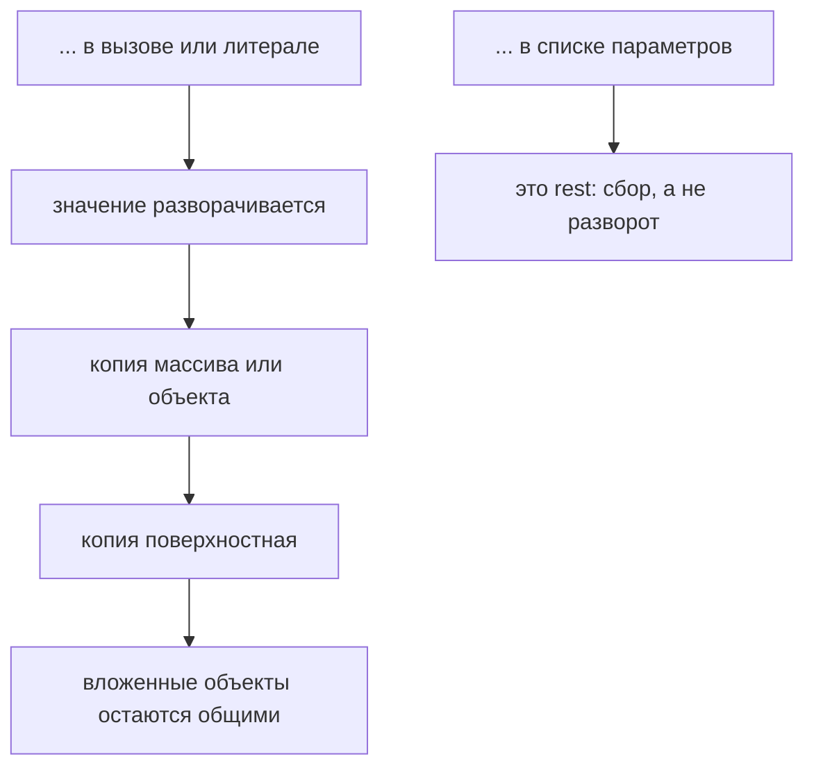

# Раскрытие

## Связь с предыдущей главой

Предыдущая глава объяснила Rest Parameters.

Теперь появляется обратный вопрос:

> Как один array снова превратить в много отдельных значений?

Например, функция ожидает три arguments:

```javascript
function compareStatuses(firstStatus, secondStatus, thirdStatus) {
  console.log(firstStatus, secondStatus, thirdStatus);
}
```

А значения уже лежат в одном array:

```javascript
const statuses = [200, 201, 204];
```

Как передать array так, чтобы функция получила три отдельных значения?

Главный вопрос этой главы:

> Как раскрываются значения?

---

## Предварительные требования

Для этой главы нужно понимать:

* что arguments передаются в function call;
* что parameters получают arguments по позиции;
* что Rest Parameter собирает many arguments into one array;
* что array хранит значения по порядку;
* что object хранит properties;
* что references и shallow copy уже были объяснены на концептуальном уровне.

Не требуется знать deep copy, `structuredClone`, recursion, destructuring with rest, immutable состояние management, React patterns или advanced object merging. Эти темы будут изучаться позже.

---

## Время изучения

Ориентировочное время:

```text
Чтение главы:            110-140 минут
Разбор схем:             40-60 минут
Запуск примеров:         20-30 минут
Практика:                100-130 минут
Повторение материала:    25 минут
```

Уровень сложности: **L3**.

Spread использует те же три точки, что и Rest, но направление другое. Это главная мысль главы.

---

## Навигация

Предыдущая глава:

```text
docs/01-javascript/26-rest.md
```

Текущая глава:

```text
docs/01-javascript/27-spread.md
```

Следующая глава:

```text
docs/01-javascript/28-closures.md
```

Следующая глава ответит:

> Как функция может помнить данные после выполнения?

---

## Цели обучения

После изучения этой главы вы будете понимать:

* зачем существует Spread syntax;
* чем Spread отличается от Rest;
* как раскрывать array значения;
* как раскрывать object properties;
* как использовать Spread в function call;
* как копировать arrays на высоком уровне;
* как копировать objects на высоком уровне;
* как объединять arrays;
* как объединять objects;
* что такое shallow copy на высоком уровне;
* какие ошибки встречаются чаще всего;
* как Spread используется в Automation QA.

---

## Мотивация

Начнем с проблемы.

Функция ожидает отдельные arguments:

```javascript
function validateThreeStatuses(firstStatus, secondStatus, thirdStatus) {
  console.log(firstStatus);
  console.log(secondStatus);
  console.log(thirdStatus);
}
```

Но данные уже собраны в array:

```javascript
const statuses = [200, 201, 204];
```

Проблема:

Зачем существует Spread:

Главный вопрос:

> Как раскрываются значения?

---

## Теория

### Сбор и раскрытие

Начнем с направления.

```text
сбор (глава 26):   много значений  →  один массив
                   validateStatuses(200, 201, 204)
                                     └──── statusCodes ────┘

раскрытие:         одна коллекция  →  много значений
                   validateStatuses(...statuses)
```

Одинаковые три точки не означают одну универсальную операцию. Значение зависит от места в коде.

### Зачем существует раскрытие

Раскрытие нужно, когда одно значение-коллекция должно превратиться в отдельные значения.

```text
[200, 201, 204]  ──раскрытие──→  200, 201, 204
```

Слева одно значение, справа три отдельных. Это обратное направление по отношению к сбору.

### Раскрытие значений массива

Массив можно раскрыть через `...`.

```javascript
const statuses = [200, 201, 204];

console.log(...statuses);
```

Раскрытие массива:

Раскрытие не изменяет сам массив. Оно подставляет его значения в текущее место.

### Вызовы функций с раскрытием

Раскрытие часто используется в вызове функции.

```javascript
function validateThreeStatuses(firstStatus, secondStatus, thirdStatus) {
  console.log(firstStatus, secondStatus, thirdStatus);
}

const statuses = [200, 201, 204];

validateThreeStatuses(...statuses);
```

```text
validateThreeStatuses(...statuses)
   │ раскрытие происходит В МОМЕНТ вызова
   ▼
validateThreeStatuses(200, 201, 204)
```

Параметры по-прежнему получают значения по позиции.

### Раскрытие свойств объекта

Раскрытие также может подставить свойства объекта внутрь литерала объекта.

```javascript
const baseUser = {
  role: 'user'
};

const adminUser = {
  ...baseUser,
  role: 'admin'
};
```

Раскрытие объекта:

В объекте раскрытие подставляет свойства, а не аргументы функции.

### Копирование массивов

Раскрытие может создать поверхностную копию массива.

```javascript
const statuses = [200, 201];
const copiedStatuses = [...statuses];
```

Копия массива:

Это поверхностная копия. Глубокое копирование будет отдельной темой.

### Копирование объектов

Раскрытие объекта может создать его поверхностную копию.

```javascript
const basePayload = {
  role: 'user'
};

const copiedPayload = {
  ...basePayload
};
```

Копия объекта:

Ещё раз: это поверхностная копия.

### Объединение массивов

Раскрытие может объединять массивы.

```javascript
const smokeStatuses = [200, 201];
const regressionStatuses = [204, 301];

const allStatuses = [...smokeStatuses, ...regressionStatuses];
```

Объединение массивов:

```text
[...smokeStatuses, ...regressionStatuses]  →  [200, 201, 204, 301]
```

Исходные массивы не меняются: получается третий массив со скопированными
значениями.

### Объединение объектов

Раскрытие объектов может объединять объекты.

```javascript
const baseConfig = {
  retries: 1
};

const localConfig = {
  baseUrl: 'http://localhost'
};

const config = {
  ...baseConfig,
  ...localConfig
};
```

Объединение объектов:

Если то же свойство встречается позже, на этом уровне побеждает более позднее значение.

Более сложное объединение объектов будет изучаться позже.

### Поверхностная копия

Поверхностная копия означает, что верхний уровень новый, а вложенные объекты не копируются.

Поверхностная копия:

Эта глава не учит глубокому копированию и `structuredClone`.

### Читаемость

Раскрытие полезно, когда оно заметно и осмысленно.

Читаемость страдает, когда раскрытий несколько подряд и непонятно, что откуда
взялось.

Раскрытие должно отвечать на два вопроса:

```text
какая коллекция раскрывается?
куда именно раскрываются значения?
```

---

Одинаковый синтаксис делает противоположные вещи:


```mermaid
flowchart TD
    A["... в вызове или литерале"] --> B["значение разворачивается"]
    B --> C["копия массива или объекта"]
    C --> D["копия поверхностная"]
    D --> E["вложенные объекты остаются общими"]
    F["... в списке параметров"] --> G["это rest: сбор, а не разворот"]
```

## Внутренний механизм

Раскрытие зависит от места записи.

Время жизни раскрытия:

```text
1. движок вычисляет значение, стоящее после трёх точек
2. смотрит, где оно записано: в массиве, в объекте или в вызове
3. подставляет элементы или свойства по одному на это место
```

Раскрытие данных:

```text
в массиве  —  элементы становятся элементами нового массива
в объекте  —  свойства становятся свойствами нового объекта
```

Вызов функции с раскрытием:

```text
collect(...[200, 201])  →  collect(200, 201)
```

Текущее место в модели JavaScript:

```text
Rest    —  много значений собираются в одно
Spread  —  одно значение раскрывается во много
```

Переход к замыканиям:

```text
Rest и Spread закрывают тему передачи данных в функцию и из неё.
Следующий вопрос — что функция помнит о месте, где была создана.
```

---

## Ментальная модель

### Распаковка коробки

Раскрытие вскрывает коробку и выкладывает её содержимое на стол по одному
предмету. Коробка при этом не исчезает — появляется новая раскладка.

```text
коробка [200, 201]  →  на столе: 200, 201
```

### Раздача карт

В вызове функции раскрытие работает как раздача карт: колода превращается в
отдельные карты, и каждая ложится на своё место — на свой параметр.

```text
collect(...[200, 201, 204])  →  три отдельных аргумента
```

Краткая ментальная модель:

```text
Spread expands one collection.
Array spread expands values.
Object spread expands properties.
Rest collects.
Spread expands.
```

Полная модель такая: сбор и раскрытие записываются одинаково, но работают в
противоположные стороны. Сбор стоит **в объявлении** и превращает несколько
значений в одно; раскрытие стоит **в вызове или литерале** и превращает одно
значение в несколько. Место записи и определяет, какая из двух операций перед
вами.

---

## Примеры кода

Все примеры находятся в:

```text
examples/01-javascript/chapter-27/
```

Запуск:

```bash
node examples/01-javascript/chapter-27/01-array-spread.js
node examples/01-javascript/chapter-27/02-function-call.js
node examples/01-javascript/chapter-27/03-object-spread.js
node examples/01-javascript/chapter-27/04-copy-merge.js
node examples/01-javascript/chapter-27/05-common-mistakes.js
node examples/01-javascript/chapter-27/06-qa-example.js
```

### 01-array-spread.js

Показывает раскрытие массива.

### 02-function-call.js

Показывает вызов функции с раскрытием.

### 03-object-spread.js

Показывает раскрытие объекта.

### 04-copy-merge.js

Показывает поверхностную копию и объединение массивов и объектов на высоком уровне.

### 05-common-mistakes.js

Показывает направление сбора и раскрытия.

### 06-qa-example.js

Показывает объединение тестовых данных и тела запроса.

---

## Частые вопросы

### Раскрытие и сбор — это одно и то же?

Нет. Сбор собирает значения. Раскрытие раскрывает коллекцию.

### Почему у них одинаковые три точки?

Синтаксис похож, но смысл зависит от места. В списке параметров это сбор. В вызове, литерале массива и литерале объекта — раскрытие.

### Раскрытие делает глубокую копию?

Нет. На этом уровне нужно помнить: раскрытие делает поверхностную копию. Глубокое копирование будет изучаться позже.

### Можно ли раскрывать объект?

Да, внутри литерала объекта оно подставляет свойства.

### Что произойдёт при одинаковых свойствах объекта?

На высоком уровне более позднее значение свойства перезаписывает раннее.

### Нужно ли сейчас знать про неизменяемое состояние?

Нет. Эти приёмы будут изучаться отдельно, если понадобятся.

---

## Распространённые мифы

### Миф: три точки всегда означают одно и то же

Реальность:

Смысл зависит от места записи.

### Миф: раскрытие собирает значения

Реальность:

Раскрытие раскрывает коллекцию. Собирает — остаточный параметр.

### Миф: раскрытие делает глубокую копию

Реальность:

На этом уровне раскрытие создаёт поверхностную копию.

### Миф: раскрытие объектов всегда безопасно объединяет любые объекты

Реальность:

Раскрытие объединяет только верхний уровень. Более сложное объединение будет позже.

---

## Распространённые ошибки

### Ошибка 1. Путать направление

Сбор:

```javascript
function collect(...values) {}
```

Раскрытие:

```javascript
collect(...values);
```

Направление:

```text
Rest    —  в объявлении функции: много аргументов → один массив
Spread  —  в вызове или литерале: один массив → много значений
```

Синтаксис одинаковый, направление противоположное — и определяет его место
записи, а не сами три точки.

### Ошибка 2. Ожидать глубокую копию

```javascript
const copiedPayload = {
  ...basePayload
};
```

На высоком уровне это поверхностная копия.

### Ошибка 3. Забыть про порядок свойств

```javascript
const user = {
  role: 'user',
  role: 'admin'
};
```

Побеждает более позднее значение.

### Ошибка 4. Слишком сложное раскрытие

Если выражение трудно читать, лучше разбить его на несколько шагов.

### Ошибка 5. Использовать раскрытие там, где проще передать значения явно

Если значения уже отдельные и их мало, явный вызов может быть понятнее.

---

## Практическое использование

Раскрытие полезно, когда нужно передать элементы коллекции как отдельные
аргументы, собрать новый массив из нескольких, или создать объект на основе
существующего с изменёнными полями.

Практический чек-лист:

```text
1. Что раскрывается?
2. Это массив или объект?
3. Куда раскрываются значения — в вызов, в массив, в объект?
4. Важен ли порядок?
5. Не жду ли я глубокого копирования?
```

---

## Использование в Automation QA

### Объединение тестовых данных

```javascript
const baseUser = {
  role: 'user'
};

const adminUser = {
  ...baseUser,
  role: 'admin'
};
```

### Копирование тел запросов

```javascript
const basePayload = {
  active: true
};

const requestPayload = {
  ...basePayload,
  email: 'anna@example.com'
};
```

### Расширение конфигурации

```javascript
const baseConfig = {
  retries: 1
};

const localConfig = {
  ...baseConfig,
  baseUrl: 'http://localhost'
};
```

### Сборка аргументов вспомогательной функции

```javascript
function validateThreeStatuses(firstStatus, secondStatus, thirdStatus) {
  console.log(firstStatus, secondStatus, thirdStatus);
}

const statuses = [200, 201, 204];

validateThreeStatuses(...statuses);
```

### Читаемая подготовка теста

Пример вспомогательной функции: `validateThreeStatuses(...statuses)` раскладывает массив на отдельные аргументы — это обратная операция к сбору из предыдущей главы.

Раскрытие помогает собирать данные, но подготовка теста должна оставаться читаемой.

---

## Итоги

Раскрытие отвечает:

```text
How can one collection become many values?
```

Главная модель:

```text
Сбор собирает много значений в одну коллекцию.
Раскрытие превращает одну коллекцию во много значений.
```

Синтаксис у них общий, а направление противоположное: место в коде и решает,
какая из двух операций выполняется.

Следующая глава ответит:

```text
Как функция может помнить данные после выполнения?
```

Это тема замыканий.

---

## Что нужно запомнить

* Раскрытие раскрывает коллекцию.
* Остаточный параметр собирает значения, раскрытие их раскрывает.
* В вызове функции раскрытие массива даёт отдельные аргументы.
* В литерале массива раскрытие подставляет его значения.
* В литерале объекта раскрытие подставляет свойства.
* Копия через раскрытие на этом уровне поверхностная.
* При объединении объектов более поздние свойства перекрывают ранние.
* `...` не является одной универсальной операцией: смысл зависит от места записи.
* В автоматизации тестов раскрытие полезно для тел запросов, настроек и аргументов вспомогательных функций.
* Глубокое копирование, `structuredClone`, деструктуризация со сбором и сложное объединение будут позже.

---

## Проверьте себя

Ответьте без запуска кода.

1. Зачем существует раскрытие?
2. Чем раскрытие отличается от сбора?
3. Что делает раскрытие в вызове функции?
4. Что делает раскрытие в литерале массива?
5. Что делает раскрытие в литерале объекта?
6. Что такое поверхностная копия на высоком уровне?
7. Почему порядок свойств объекта важен?
8. Где раскрытие полезно в автоматизации тестов?
9. Почему `...` нельзя понимать как одну универсальную операцию?
10. Какая тема идет следующей?

### Ответы

1. Чтобы раскрыть готовую коллекцию в отдельные значения: передать массив как набор аргументов, собрать новый массив из существующих, скопировать свойства объекта.
2. Направление противоположное. Остаточный параметр в объявлении собирает много значений в одно; раскрытие в вызове или литерале превращает одно значение во много. Синтаксис один, различает их место записи.
3. Превращает элементы коллекции в отдельные аргументы: `collect(...[200, 201])` равнозначно `collect(200, 201)`.
4. Подставляет элементы исходного массива в новый. Исходный массив при этом не меняется.
5. Подставляет свойства исходного объекта в новый. Получается новый объект, а не ссылка на прежний.
6. Копируется только верхний уровень. Значения вложенных объектов остаются теми же ссылками, поэтому изменение внутри вложенного объекта видно и в копии, и в оригинале.
7. При совпадении имён побеждает свойство, записанное позже. На этом строится подмена настроек: сначала базовые значения, затем переопределяющие.
8. В подготовке тестовых данных: базовый набор плюс отличия конкретного теста. Так один эталон не изменяется разными тестами.
9. Потому что результат зависит от места: в объявлении функции это сбор, в вызове и литерале — раскрытие. Одна «универсальная операция» объяснила бы оба случая неверно.
10. Замыкания: что функция помнит о месте, где была создана.

---

## Практика

Практика находится в файле:

```text
practice/01-javascript/27-spread.md
```

Сначала решайте задания на предсказание вывода без запуска. Главная цель — видеть направление: остаточный параметр собирает, раскрытие раскрывает.

---

## Решения

Решения находятся в файле:

```text
solutions/01-javascript/27-spread.md
```

Читайте решения после самостоятельной попытки. Проверяйте главный вопрос: как раскрываются значения?
