# Closures

## Связь с предыдущей главой

Предыдущая глава объяснила Spread.

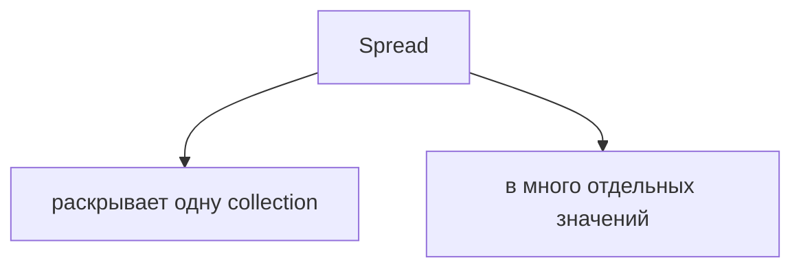

Теперь мы возвращаемся к функциям и к модели выполнения JavaScript.

К этому моменту уже известно:

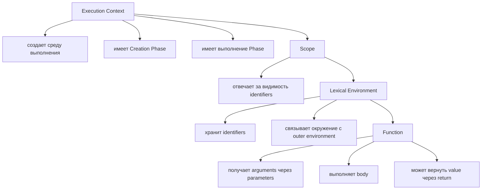

Теперь появляется один из самых важных вопросов JavaScript:

> Функция уже завершила выполнение. Почему некоторые значения все еще существуют?

Это вопрос о Closures.

Главный вопрос главы:

> Почему это значение все еще существует?

---

## Предварительные требования

Для этой главы нужно понимать:

* что Execution Context создается при выполнении функции;
* что Call Stack управляет активными Execution Contexts;
* что Scope определяет, где identifier видим;
* что Lexical Environment хранит identifiers и связь с outer environment;
* что function object можно вернуть из функции;
* что `return` завершает выполнение функции и отправляет value обратно;
* что function body выполняется только после invocation.

Не требуется знать `this`, modules, private class поля, WeakMap privacy, Garbage Collector internals, React hooks, event listeners или async closures. Эти темы будут изучаться позже.

---

## Время изучения

Ориентировочное время:

```text
Чтение главы:            150-190 минут
Разбор схем:             60-80 минут
Запуск примеров:         25-35 минут
Практика:                120-160 минут
Повторение материала:    35 минут
```

Уровень сложности: **L4**.

Closure часто кажется магией, потому что читатель ожидает, что все локальные данные функции исчезают сразу после ее завершения. На самом деле магии нет: function object удерживает ссылку на то Lexical Environment, где он был создан, если продолжает использовать identifiers из него.

---

## Навигация

Предыдущая глава:

```text
docs/01-javascript/27-spread.md
```

Текущая глава:

```text
docs/01-javascript/28-closures.md
```

Следующая глава:

```text
docs/01-javascript/29-this.md
```

Следующая глава ответит:

> Как определяется контекст выполнения функции через `this`?

---

## Цели обучения

После изучения этой главы вы будете понимать:

* зачем существуют Closures;
* почему функция может помнить outer variables;
* как Closure связана с Lexical Environment;
* почему outer scope может оставаться доступным после завершения функции;
* чем expected lifetime отличается от actual lifetime;
* как работают multiple closures;
* почему independent closures не мешают друг другу;
* как Closure связана с Execution Context и Call Stack;
* какие ошибки чаще всего возникают;
* как Closures применяются в Automation QA.

---

## Мотивация

Начнем с поведения, которое сначала кажется странным.

```javascript
function createStatusValidator() {
  const expectedStatus = 200;

  return function validateStatus(actualStatus) {
    return actualStatus === expectedStatus;
  };
}

const validateSuccess = createStatusValidator();

console.log(validateSuccess(200));
```

Функция `createStatusValidator()` уже завершилась.

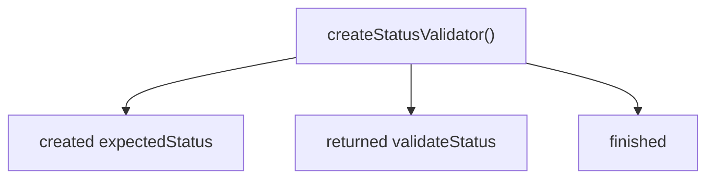

Но `validateStatus()` все еще может прочитать `expectedStatus`.

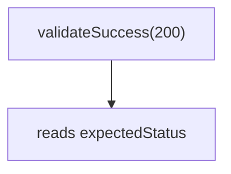

Ожидание читателя:

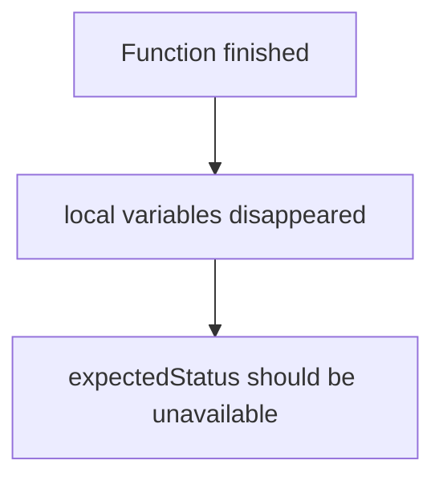

Фактическое поведение:

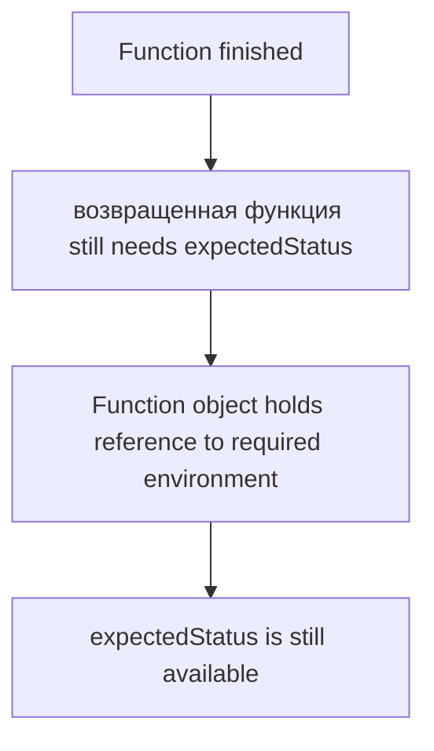

Главный вопрос:

> Почему `expectedStatus` все еще существует?

Closure отвечает именно на этот вопрос.

---

## Теория

### Проблема исчезающих локальных данных

Обычная функция выполняется так:

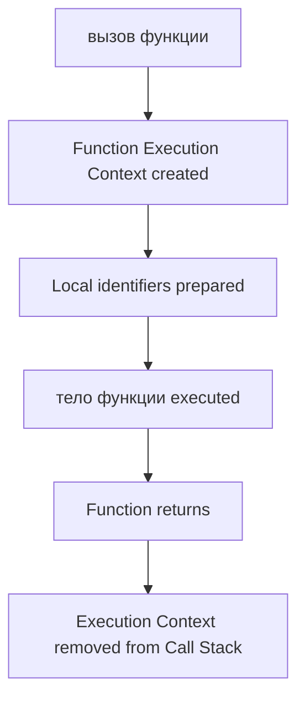

Выполнение функции:

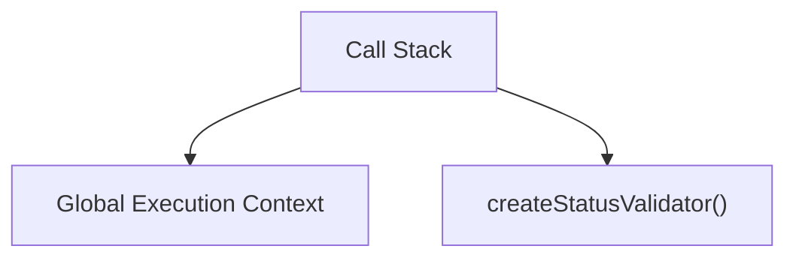

Function finishes:

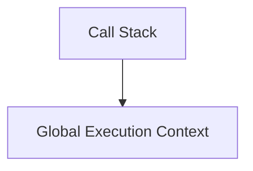

После завершения функции ее Execution Context больше не активен.

Но важно не смешивать две идеи:

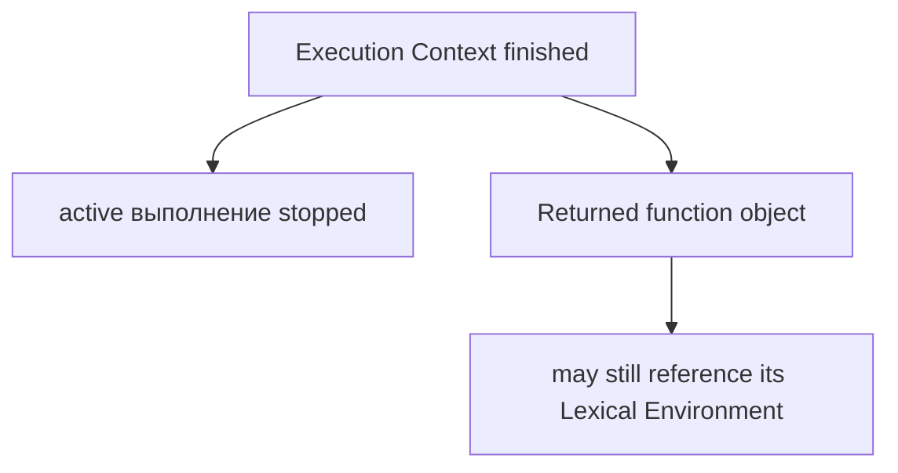

Execution Context отвечает за выполнение.

Lexical Environment хранит identifiers, которые могут понадобиться function object позже.

---

### Наблюдаемое противоречие

Посмотрим на минимальный пример:

```javascript
function outer() {
  const message = 'Saved value';

  function inner() {
    return message;
  }

  return inner;
}

const readMessage = outer();

console.log(readMessage());
```

Reader expectation:

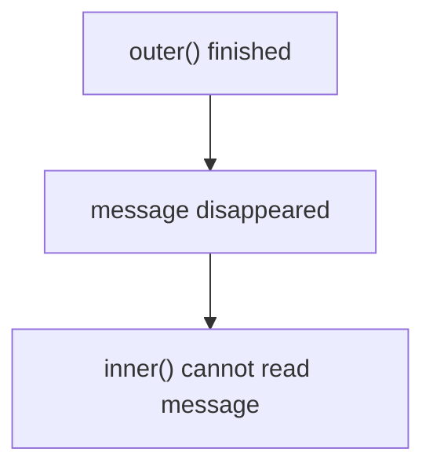

Фактическое поведение:

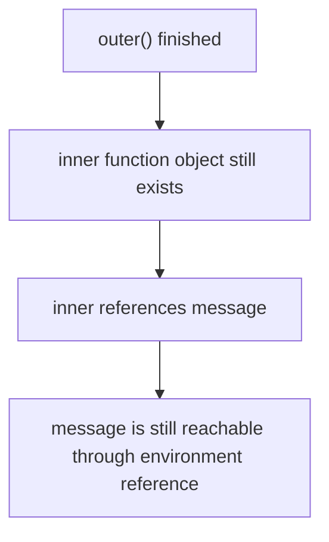

Вот момент, где рождается Closure.

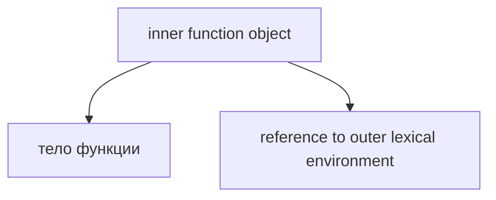

Closure creation:

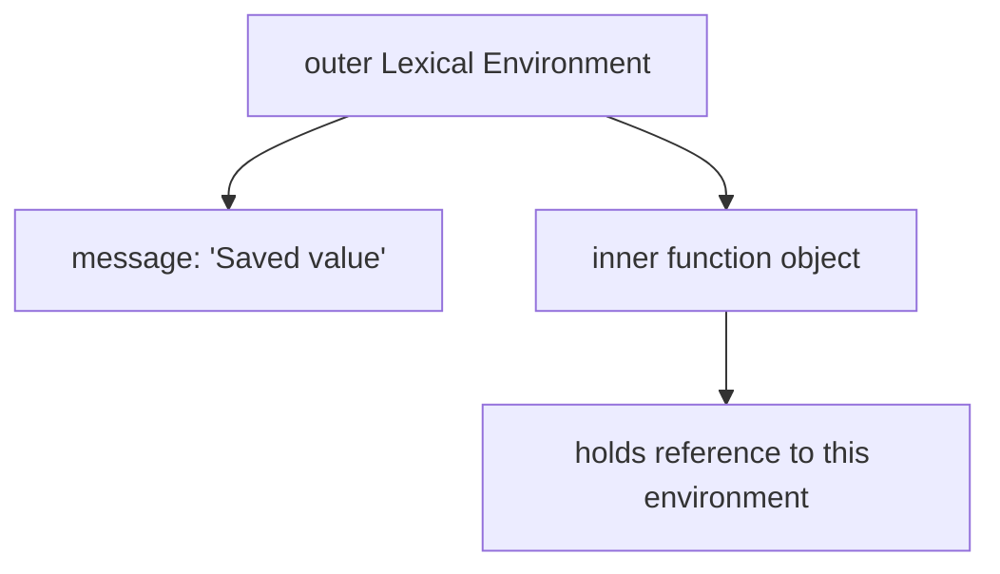

Closure - это не отдельная синтаксическая конструкция.

Это поведение, которое возникает, когда function object удерживает ссылку на lexical environment, где он был создан.

---

### Что такое Closure

Теперь можно дать рабочее определение.

Closure - это поведение function object, который удерживает ссылку на Lexical Environment, где он был создан.

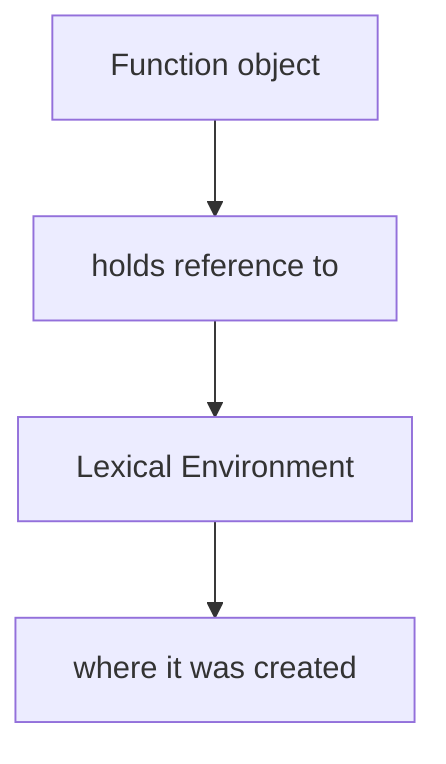

Более практичная формулировка:

> Closure позволяет функции использовать variables из outer scope даже после того, как outer function завершила выполнение.

Важно:

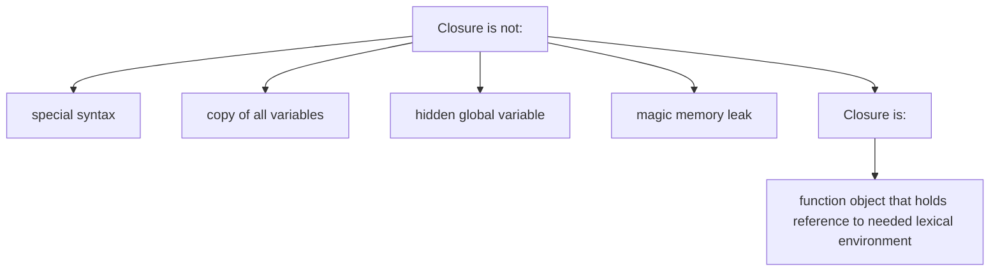

Миф -> Реальность:

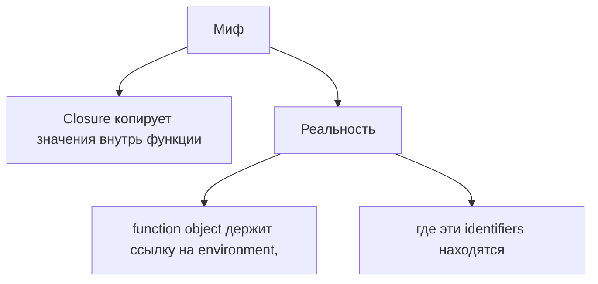

---

### Lexical Environment revisit

В главе про Lexical Environment мы видели:

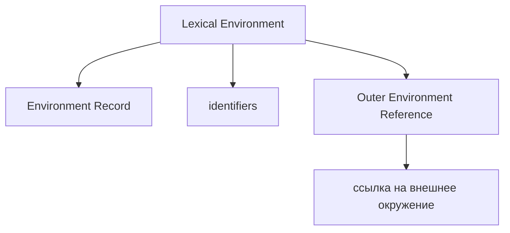

Теперь эта модель становится особенно важной.

Когда функция создается, она создается не в пустоте.

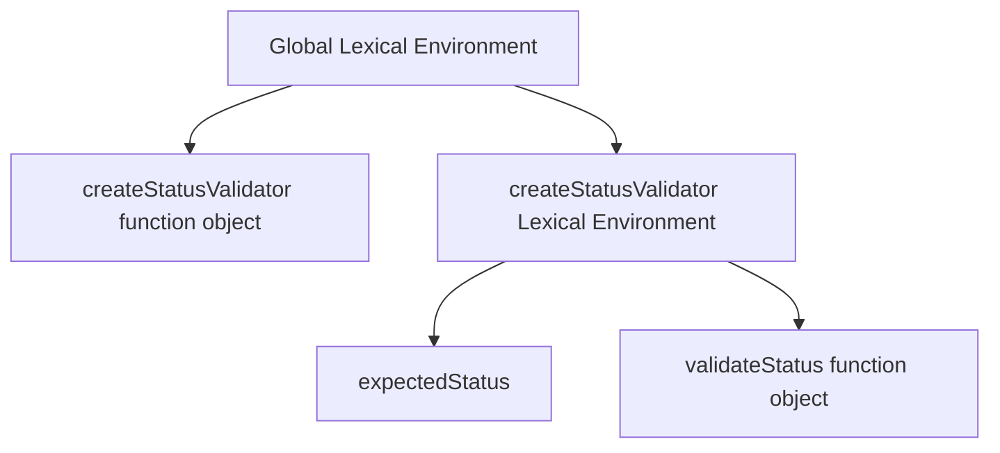

Функция `validateStatus` была создана внутри `createStatusValidator`.

Значит, ее lexical position выглядит так:

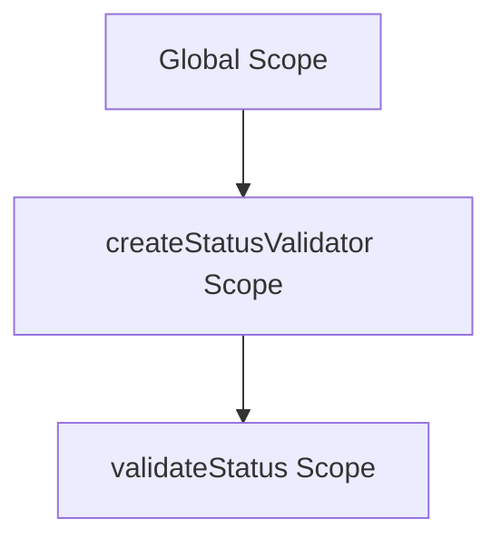

Scope Chain revisit:

```mermaid
flowchart TD
    N1["validateStatus()"]
    N2["search in own environment"]
    N3["search in createStatusValidator environment"]
    N4["search in global environment"]
    N1 --> N2
    N1 --> N3
    N1 --> N4
```

Closure появляется потому, что `validateStatus` удерживает доступ к outer environment, где лежит `expectedStatus`.

---

### Outer scope access

Функция ищет identifier так же, как раньше:

```mermaid
flowchart TD
    N1["Need expectedStatus"]
    N2["Search local environment"]
    N3["Not found"]
    N4["Search outer environment"]
    N5["Found"]
    N1 --> N2
    N2 --> N3
    N3 --> N4
    N4 --> N5
```

Outer scope:

```mermaid
flowchart TD
    N1["createStatusValidator()"]
    N2["expectedStatus = 200"]
    N3["validateStatus()"]
    N4["can read expectedStatus"]
    N1 --> N2
    N1 --> N3
    N3 --> N4
```

После завершения `createStatusValidator()` меняется не правило поиска, а lifetime нужного environment.

```mermaid
flowchart TD
    N1["До: return"]
    N2["validateStatus uses outer expectedStatus"]
    N3["После: return"]
    N4["validateStatus still uses outer expectedStatus"]
    N1 --> N2
    N1 --> N3
    N3 --> N4
```

Главный вопрос остается тем же:

> Почему это значение все еще существует?

Потому что function object все еще существует и все еще ссылается на environment, где находится это значение.

---

## Внутренний механизм

### Полная последовательность

Разберем пример как фильм.

```javascript
function createValidator(expectedStatus) {
  return function validate(actualStatus) {
    return actualStatus === expectedStatus;
  };
}

const validateOk = createValidator(200);

console.log(validateOk(200));
console.log(validateOk(404));
```

Complete Closure model:

```mermaid
flowchart TD
    N1["1. Global code starts"]
    N2["2. createValidator function object exists"]
    N3["3. createValidator(200) is called"]
    N4["4. Function Execution Context is created"]
    N5["5. expectedStatus receives 200"]
    N6["6. validate function object is created inside"]
    N7["7. validate holds reference to outer lexical environment"]
    N8["8. createValidator возвращает validate"]
    N9["9. createValidator выполнение завершается"]
    N10["10. validateOk stores возвращенная функция object"]
    N11["11. validateOk(200) is called later"]
    N12["12. validate reads expectedStatus through environment reference"]
    N1 --> N2
    N2 --> N3
    N3 --> N4
    N4 --> N5
    N5 --> N6
    N6 --> N7
    N7 --> N8
    N8 --> N9
    N9 --> N10
    N10 --> N11
    N11 --> N12
```

Execution Context revisit:

```mermaid
flowchart TD
    N1["createValidator Execution Context"]
    N2["parameter expectedStatus = 200"]
    N3["создает validate function object"]
    N4["возвращает validate"]
    N1 --> N2
    N1 --> N3
    N1 --> N4
```

Function returned:

```mermaid
flowchart TD
    N1["createValidator()"]
    N2["возвращает function object"]
    N3["name: validate"]
    N4["reference to outer environment"]
    N1 --> N2
    N2 --> N3
    N2 --> N4
```

Returned function called later:

```mermaid
flowchart TD
    N1["validateOk(200)"]
    N2["actualStatus = 200"]
    N3["expectedStatus found through outer environment reference"]
    N4["возвращает true"]
    N1 --> N2
    N1 --> N3
    N1 --> N4
```

---

### Как удерживается доступ

Closure не означает, что JavaScript сохраняет весь Call Stack.

Call Stack interaction:

```mermaid
flowchart TD
    N1["Call Stack during createValidator()"]
    N2["Global Execution Context"]
    N3["createValidator Execution Context"]
    N4["Call Stack after return"]
    N5["Global Execution Context"]
    N1 --> N2
    N1 --> N3
    N1 --> N4
    N4 --> N5
```

Сохраняется не "активный вызов функции".

Function object удерживает ссылку на нужное lexical environment.

```mermaid
flowchart TD
    N1["Execution Context"]
    N2["нет longer active"]
    N3["Lexical Environment needed by closure"]
    N4["still reachable through function reference"]
    N1 --> N2
    N1 --> N3
    N3 --> N4
```

Интуитивная модель памяти:

```mermaid
flowchart TD
    N1["validateOk"]
    N2["function object"]
    N3["code: вернуть actualStatus === expectedStatus"]
    N4["environment link"]
    N5["expectedStatus = 200"]
    N1 --> N2
    N2 --> N3
    N2 --> N4
    N4 --> N5
```

Мы не углубляемся в Garbage Collector. Важно только одно:

```mermaid
flowchart TD
    N1["If function still needs environment"]
    N2["environment cannot be discarded"]
    N1 --> N2
```

Garbage Collector будет изучаться позже. Сейчас достаточно понимать: пока function object доступен и ему нужен outer environment, это окружение остается достижимым через ссылку function object.

---

### Lifetime captured variables

Обычная локальная переменная:

```mermaid
flowchart TD
    N1["Function starts"]
    N2["local variable created"]
    N3["function завершается"]
    N4["variable нет longer needed"]
    N1 --> N2
    N2 --> N3
    N3 --> N4
```

Captured variable:

```mermaid
flowchart TD
    N1["Function starts"]
    N2["local variable created"]
    N3["inner function uses it"]
    N4["inner function returned"]
    N5["outer function завершается"]
    N6["variable still needed through function reference"]
    N7["environment remains reachable"]
    N1 --> N2
    N2 --> N3
    N3 --> N4
    N4 --> N5
    N5 --> N6
    N6 --> N7
```

Ожидаемое время жизни vs Фактическое время жизни:

```mermaid
flowchart TD
    N1["Expected"]
    N2["variable lives until outer function завершается"]
    N3["Actual with Closure"]
    N4["variable lives while возвращенная функция can still use it"]
    N1 --> N2
    N1 --> N3
    N3 --> N4
```

Data reachability:

```mermaid
flowchart TD
    N1["expectedStatus"]
    N2["created during createValidator(200)"]
    N3["captured by validate"]
    N4["reachable after createValidator завершается"]
    N5["read when validateOk is called"]
    N1 --> N2
    N1 --> N3
    N1 --> N4
    N1 --> N5
```

---

### Multiple closures

Одна factory function может создать несколько closures.

```javascript
function createCounter(start) {
  let count = start;

  return function increment() {
    count = count + 1;
    return count;
  };
}

const firstCounter = createCounter(0);
const secondCounter = createCounter(10);

console.log(firstCounter());
console.log(firstCounter());
console.log(secondCounter());
```

Multiple counters:

```mermaid
flowchart TD
    N1["createCounter(0)"]
    N2["closure A"]
    N3["count = 0"]
    N4["createCounter(10)"]
    N5["closure B"]
    N6["count = 10"]
    N1 --> N2
    N2 --> N3
    N1 --> N4
    N4 --> N5
    N5 --> N6
```

Independent closures:

```mermaid
flowchart TD
    N1["firstCounter()"]
    N2["uses environment A"]
    N3["count: 0 → 1 → 2"]
    N4["secondCounter()"]
    N5["uses environment B"]
    N6["count: 10 → 11"]
    N1 --> N2
    N2 --> N3
    N1 --> N4
    N4 --> N5
    N5 --> N6
```

Они не делят один `count`, потому что каждый вызов `createCounter()` создает новое lexical environment.

```mermaid
flowchart TD
    N1["One function definition"]
    N2["many function calls"]
    N3["many lexical environments"]
    N4["many independent closures"]
    N1 --> N2
    N2 --> N3
    N3 --> N4
```

---

### Closure timeline

Closure временная шкала:

```mermaid
flowchart TD
    N1["T1 createCounter function object exists"]
    N2["T2 createCounter(0) called"]
    N3["T3 count created with value 0"]
    N4["T4 increment function object created"]
    N5["T5 increment captures access to count"]
    N6["T6 createCounter возвращает increment"]
    N7["T7 createCounter завершается"]
    N8["T8 count is still needed"]
    N9["T9 firstCounter() called"]
    N10["T10 firstCounter reads and updates count"]
    N1 --> N2
    N2 --> N3
    N3 --> N4
    N4 --> N5
    N5 --> N6
    N6 --> N7
    N7 --> N8
    N8 --> N9
    N9 --> N10
```

Environment lifetime:

```mermaid
flowchart TD
    N1["createCounter environment"]
    N2["active while createCounter runs"]
    N3["remains reachable because increment references it"]
    N1 --> N2
    N1 --> N3
```

Closure lifetime:

```mermaid
flowchart TD
    N1["Returned function exists"]
    N2["function object holds environment reference"]
    N3["возвращенная функция can read captured variables"]
    N1 --> N2
    N2 --> N3
```

---

## Ментальная модель

### Рюкзак

Представьте функцию, которая выходит из комнаты, но берет с собой рюкзак.

В рюкзаке не лежит копия всего мира. Эта модель означает, что у function object остается ссылка на то окружение, которое функции нужно.

Backpack analogy:

```mermaid
flowchart TD
    N1["Function object"]
    N2["code"]
    N3["backpack"]
    N4["access to outer variables"]
    N1 --> N2
    N1 --> N3
    N3 --> N4
```

Когда функция вызывается позже:

```mermaid
flowchart TD
    N1["function called later"]
    N2["uses its own parameters"]
    N3["opens backpack when outer variable is needed"]
    N1 --> N2
    N1 --> N3
```

Эта модель полезна, но ее нужно понимать аккуратно:

```mermaid
flowchart TD
    N1["Backpack means"]
    N2["reference to lexical environment"]
    N3["Backpack does not mean"]
    N4["copied values snapshot"]
    N1 --> N2
    N1 --> N3
    N3 --> N4
```

---

### Запомненная комната

Другая модель - linked room.

```mermaid
flowchart TD
    N1["Outer function room"]
    N2["expectedStatus"]
    N3["inner function was created here"]
    N1 --> N2
    N1 --> N3
```

Когда outer function завершилась, комната не уничтожается, если inner function все еще может туда вернуться за нужным identifier.

Remembered room:

```mermaid
flowchart TD
    N1["inner function"]
    N2["has a link to room where it was created"]
    N3["can read variables from that room"]
    N1 --> N2
    N2 --> N3
```

Invisible link:

```mermaid
flowchart TD
    N1["validateOk"]
    N2["function object"]
    N3["invisible link"]
    N4["createValidator environment"]
    N1 --> N2
    N2 --> N3
    N3 --> N4
```

---

### Notebook

Closure можно представить как notebook с записями, которые функция может использовать позже.

```mermaid
flowchart TD
    N1["Notebook"]
    N2["expectedStatus: 200"]
    N3["baseUrl: 'https://api.example.test'"]
    N1 --> N2
    N1 --> N3
```

Объект функции:

```mermaid
flowchart TD
    N1["validator"]
    N2["receives actualStatus"]
    N3["reads expectedStatus from notebook"]
    N1 --> N2
    N1 --> N3
```

Notebook помогает понять, почему helper factory удобна в тестах:

```mermaid
flowchart TD
    N1["createApiValidator(baseUrl)"]
    N2["возвращает validator"]
    N3["has access to baseUrl through environment reference"]
    N1 --> N2
    N2 --> N3
```

---

### Текущее место в модели JavaScript

Текущее место в модели JavaScript:

```mermaid
flowchart TD
    N1["JavaScript выполнение model"]
    N2["Engine and Runtime"]
    N3["Execution Context"]
    N4["Call Stack"]
    N5["Memory"]
    N6["Variables"]
    N7["Scope"]
    N8["Lexical Environment"]
    N9["Functions"]
    N10["Declaration"]
    N11["Expression"]
    N12["Arrow Functions"]
    N13["Parameters"]
    N14["Return"]
    N15["Rest"]
    N16["Spread"]
    N17["Closures"]
    N18["this"]
    N19["next chapter"]
    N1 --> N2
    N1 --> N3
    N1 --> N4
    N1 --> N5
    N1 --> N6
    N1 --> N7
    N1 --> N8
    N1 --> N9
    N1 --> N10
    N1 --> N11
    N1 --> N12
    N1 --> N13
    N1 --> N14
    N1 --> N15
    N1 --> N16
    N1 --> N17
    N1 --> N18
    N18 --> N19
```

Переход к this:

```mermaid
flowchart TD
    N1["Closure"]
    N2["explains how function keeps access to lexical environment"]
    N3["this"]
    N4["will explain how function receives выполнение receiver/context"]
    N1 --> N2
    N1 --> N3
    N3 --> N4
```

Closure отвечает:

```text
What variables can this function still access?
```

`this` ответит:

```text
How is this function called and what is its receiver?
```

---

## Примеры кода

Примеры находятся в папке:

```text
examples/01-javascript/chapter-28/
```

Запуск:

```bash
node examples/01-javascript/chapter-28/01-first-closure.js
node examples/01-javascript/chapter-28/02-counter.js
node examples/01-javascript/chapter-28/03-independent-closures.js
node examples/01-javascript/chapter-28/04-common-mistakes.js
node examples/01-javascript/chapter-28/05-memory-intuition.js
node examples/01-javascript/chapter-28/06-qa-example.js
```

### Первый Closure

```javascript
function createMessageReader() {
  const message = 'Environment is reachable';

  return function readMessage() {
    return message;
  };
}

const readMessage = createMessageReader();

console.log(readMessage());
```

Что происходит:

```mermaid
flowchart TD
    N1["createMessageReader()"]
    N2["создает message"]
    N3["создает readMessage"]
    N4["readMessage uses message"]
    N5["возвращает readMessage"]
    N1 --> N2
    N1 --> N3
    N1 --> N4
    N1 --> N5
```

Позже:

```mermaid
flowchart TD
    N1["readMessage()"]
    N2["reads message through environment reference"]
    N1 --> N2
```

---

### Counter

```javascript
function createCounter() {
  let count = 0;

  return function increment() {
    count = count + 1;
    return count;
  };
}

const counter = createCounter();

console.log(counter());
console.log(counter());
console.log(counter());
```

Complete counter picture:

```mermaid
flowchart TD
    N1["counter"]
    N2["increment function object"]
    N3["reference to lexical environment"]
    N4["count: 0 → 1 → 2 → 3"]
    N1 --> N2
    N2 --> N3
    N3 --> N4
```

`count` не становится global variable. Он остается доступным только через returned function.

---

### Independent closures

```javascript
function createCounter(start) {
  let count = start;

  return function increment() {
    count = count + 1;
    return count;
  };
}

const smallCounter = createCounter(0);
const largeCounter = createCounter(100);

console.log(smallCounter());
console.log(smallCounter());
console.log(largeCounter());
console.log(largeCounter());
```

Independent environment picture:

```mermaid
flowchart TD
    N1["smallCounter"]
    N2["count starts at 0"]
    N3["largeCounter"]
    N4["count starts at 100"]
    N1 --> N2
    N1 --> N3
    N3 --> N4
```

Каждый вызов `createCounter()` создает отдельное lexical environment.

---

### Memory intuition

```javascript
function createUserReader(userName) {
  return function readUserName() {
    return userName;
  };
}

const readAdminName = createUserReader('Anna');
const readGuestName = createUserReader('Ivan');

console.log(readAdminName());
console.log(readGuestName());
```

Интуитивная модель памяти:

```mermaid
flowchart TD
    N1["readAdminName"]
    N2["environment A"]
    N3["userName = 'Anna'"]
    N4["readGuestName"]
    N5["environment B"]
    N6["userName = 'Ivan'"]
    N1 --> N2
    N2 --> N3
    N1 --> N4
    N4 --> N5
    N5 --> N6
```

Это концептуальная модель, а не описание внутренней памяти конкретного engine.

---

### QA-пример

```javascript
function createStatusValidator(expectedStatus) {
  return function validateResponse(response) {
    return response.status === expectedStatus;
  };
}

const validateSuccess = createStatusValidator(200);
const validateCreated = createStatusValidator(201);

const response = {
  status: 200
};

console.log(validateSuccess(response));
console.log(validateCreated(response));
```

Пример QA-helper:

```mermaid
flowchart TD
    N1["createStatusValidator(200)"]
    N2["возвращает validator"]
    N3["reaches expectedStatus = 200 through environment reference"]
    N4["createStatusValidator(201)"]
    N5["возвращает validator"]
    N6["reaches expectedStatus = 201 through environment reference"]
    N1 --> N2
    N2 --> N3
    N1 --> N4
    N4 --> N5
    N5 --> N6
```

Так можно создавать читаемые validators без дублирования expected значения в каждом тесте.

---

## Частые вопросы

### Closure копирует значения?

Нет. Полезнее думать так: function object удерживает ссылку на lexical environment, где лежат нужные identifiers.

```mermaid
flowchart TD
    N1["Not a copy"]
    N2["not a frozen snapshot"]
    N3["Access to environment"]
    N4["reference held by function object"]
    N1 --> N2
    N1 --> N3
    N3 --> N4
```

### Closure появляется только при return function?

Нет. Но в этой главе мы используем `return function`, потому что это самый понятный способ увидеть поведение. Другие применения будут встречаться позже, например в callbacks и event listeners.

### Closure делает переменную global?

Нет. Captured variable не становится global variable.

```mermaid
flowchart TD
    N1["Global variable"]
    N2["accessible from global scope"]
    N3["Captured variable"]
    N4["accessible through function that captured it"]
    N1 --> N2
    N1 --> N3
    N3 --> N4
```

### Closure всегда плохо влияет на память?

Нет. Closure - нормальный механизм языка. Проблемы появляются, когда код случайно сохраняет больше данных, чем нужно. Garbage Collector и memory management будут изучаться позже.

---

## Распространенные мифы

### Миф 1. Closure - это редкая продвинутая техника

Реальность: Closures встречаются в обычном JavaScript-коде постоянно, особенно в helper creators, validators и factory functions.

```mermaid
flowchart TD
    N1["Factory function"]
    N2["возвращает configured helper"]
    N3["closure is already involved"]
    N1 --> N2
    N2 --> N3
```

### Миф 2. Closure хранит копию всех переменных outer function

Реальность: правильнее мыслить через ссылку function object на нужное lexical environment.

```mermaid
flowchart TD
    N1["Not:"]
    N2["copy all values"]
    N3["Better model:"]
    N4["function object references environment it needs"]
    N1 --> N2
    N1 --> N3
    N3 --> N4
```

### Миф 3. Closure делает код непредсказуемым

Реальность: Closure предсказуема, если вручную отслеживать:

```mermaid
flowchart TD
    N1["Where function was created"]
    N2["What outer identifiers it uses"]
    N3["Which environment is referenced"]
    N1 --> N2
    N2 --> N3
```

Closure становится сложной только тогда, когда разработчик пытается запомнить определение вместо того, чтобы рисовать environment.

---

## Типичные ошибки

### Ошибка 1. Думать, что outer variable исчезла всегда

Неправильная модель:

```mermaid
flowchart TD
    N1["outer function finished"]
    N2["all local data must disappear"]
    N1 --> N2
```

Что произошло:

```mermaid
flowchart TD
    N1["inner function still references outer variable"]
    N2["environment remains reachable through function reference"]
    N1 --> N2
```

Исправленная модель:

```mermaid
flowchart TD
    N1["outer function выполнение finished"]
    N2["needed lexical environment may still be reachable"]
    N1 --> N2
```

---

### Ошибка 2. Думать, что Closure хранит копию значения

```javascript
function createCounter() {
  let count = 0;

  return function increment() {
    count = count + 1;
    return count;
  };
}
```

Если бы Closure хранила копию, `count` каждый раз был бы `0`.

Фактическое поведение:

```mermaid
flowchart TD
    N1["same reachable variable"]
    N2["updated on every call"]
    N1 --> N2
```

---

### Ошибка 3. Создавать общий состояние случайно

```javascript
let sharedStatus = 200;

function validateStatus(actualStatus) {
  return actualStatus === sharedStatus;
}
```

Это не factory. Это global mutable состояние.

Более контролируемый вариант:

```javascript
function createStatusValidator(expectedStatus) {
  return function validateStatus(actualStatus) {
    return actualStatus === expectedStatus;
  };
}
```

Типичные ошибки:

```mermaid
flowchart TD
    N1["Global mutable state"]
    N2["many tests can accidentally affect it"]
    N3["Closure factory"]
    N4["each validator references its own environment"]
    N1 --> N2
    N1 --> N3
    N3 --> N4
```

---

### Ошибка 4. Путать Closure и Scope

Scope отвечает на вопрос:

```text
Where is identifier visible?
```

Closure отвечает на вопрос:

```text
Why can function still reach outer environment later?
```

Они связаны, но это не одно и то же.

---

## Практическое использование

Closure полезна, когда нужно создать функцию, которая имеет доступ к части настройки из Lexical Environment, где была создана.

Factory function:

```mermaid
flowchart TD
    N1["input configuration"]
    N2["создать specialized function"]
    N3["use specialized function later"]
    N1 --> N2
    N2 --> N3
```

Пример:

```javascript
function createPrefixLogger(prefix) {
  return function logMessage(message) {
    console.log(prefix + ': ' + message);
  };
}

const logApi = createPrefixLogger('API');
const logUi = createPrefixLogger('UI');

logApi('Request started');
logUi('Button clicked');
```

Complete practical picture:

```mermaid
flowchart TD
    N1["createPrefixLogger('API')"]
    N2["logMessage reaches prefix = 'API'"]
    N3["createPrefixLogger('UI')"]
    N4["logMessage reaches prefix = 'UI'"]
    N1 --> N2
    N1 --> N3
    N3 --> N4
```

Closure помогает:

* создавать specialized helpers;
* избегать лишних global variables;
* хранить configuration рядом с поведение;
* делать код выразительнее;
* уменьшать дублирование.

---

## Использование в Automation QA

### Factory functions

В Automation QA часто нужны helpers, которые отличаются только настройкой.

```javascript
function createHeaderValidator(expectedHeaderName) {
  return function validateHeaders(headers) {
    return headers[expectedHeaderName] !== undefined;
  };
}
```

QA factory:

```mermaid
flowchart TD
    N1["createHeaderValidator('x-request-id')"]
    N2["возвращает validator"]
    N3["references environment with header name"]
    N1 --> N2
    N2 --> N3
```

---

### Reusable validators

```javascript
function createResponseValidator(expectedStatus) {
  return function validateResponse(response) {
    return response.status === expectedStatus;
  };
}

const validateOk = createResponseValidator(200);
const validateCreated = createResponseValidator(201);
```

Automation QA object:

```mermaid
flowchart TD
    N1["response"]
    N2["status"]
    N3["body"]
    N4["headers"]
    N5["validator closure"]
    N6["reaches expected status through environment reference"]
    N1 --> N2
    N1 --> N3
    N1 --> N4
    N1 --> N5
    N5 --> N6
```

Такой подход полезен для REST API проверок, где один и тот же алгоритм применяется к разным expected значения.

---

### Configuration capture

```javascript
function createApiUrlBuilder(baseUrl) {
  return function buildUrl(path) {
    return baseUrl + path;
  };
}

const buildStagingUrl = createApiUrlBuilder('https://staging.example.test');

console.log(buildStagingUrl('/users'));
```

Configuration capture:

```mermaid
flowchart TD
    N1["baseUrl"]
    N2["captured once"]
    N3["path"]
    N4["provided on every call"]
    N1 --> N2
    N1 --> N3
    N3 --> N4
```

Это удобно для helpers, которые должны помнить environment configuration.

---

### Locator factories

В Playwright locator factories часто строятся вокруг контекста страницы или selector prefix, к которым helper получает доступ через environment reference. Подробно Playwright будет изучаться позже, но сама идея Closure уже понятна.

```mermaid
flowchart TD
    N1["createLocator(prefix)"]
    N2["возвращает function"]
    N3["holds reference to environment with prefix"]
    N1 --> N2
    N2 --> N3
```

Важно: callbacks, async поведение и event listeners будут разобраны позже. Здесь достаточно понять: Closure позволяет helper иметь доступ к данным из Lexical Environment, где он был создан.

---

## Практика

Практика находится в файле:

```text
practice/01-javascript/28-closures.md
```

Выполняйте задания после запуска примеров из `examples/01-javascript/chapter-28/`.

Решения находятся отдельно:

```text
solutions/01-javascript/28-closures.md
```

Сначала решите задания самостоятельно. Для Closures особенно важно не угадывать ответ, а вручную рисовать environment:

```mermaid
flowchart TD
    N1["function object"]
    N2["reference to lexical environment"]
    N1 --> N2
```

---

## Решения

Файл с решениями:

```text
solutions/01-javascript/28-closures.md
```

В решениях важно смотреть не только на итоговый код, но и на reasoning: для Closures главный навык - объяснять, почему function object все еще имеет доступ к конкретному lexical environment.

```mermaid
flowchart TD
    N1["Answer"]
    N2["code result"]
    N3["reasoning"]
    N4["common mistake"]
    N5["Связь с Automation QA"]
    N1 --> N2
    N1 --> N3
    N1 --> N4
    N1 --> N5
```

---

## Итоги

Closure объясняет, почему функция может использовать outer variables после завершения outer function.

Главная идея:

```mermaid
flowchart TD
    N1["Function object"]
    N2["holds reference to"]
    N3["Lexical Environment"]
    N4["where it was created"]
    N1 --> N2
    N2 --> N3
    N3 --> N4
```

Полная картина:

```mermaid
flowchart TD
    N1["Outer function called"]
    N2["Outer Lexical Environment created"]
    N3["Inner function object created"]
    N4["Inner function uses outer identifiers"]
    N5["Outer function возвращает inner function"]
    N6["Outer выполнение завершается"]
    N7["Returned function keeps environment reachable"]
    N8["Returned function is called later"]
    N9["Outer variables are still accessible"]
    N1 --> N2
    N2 --> N3
    N3 --> N4
    N4 --> N5
    N5 --> N6
    N6 --> N7
    N7 --> N8
    N8 --> N9
```

Closure не является магией. Function object удерживает ссылку на Lexical Environment, где он был создан, потому что продолжает использовать identifiers из этого окружения.

---

## Что нужно запомнить

* Closure - это поведение function object, который удерживает ссылку на Lexical Environment, где был создан.
* Closure появляется, когда функция использует variables из outer scope.
* Outer function может завершиться, но нужное lexical environment может оставаться достижимым через function object.
* Captured variable не становится global variable.
* Closure не копирует значения как frozen snapshot.
* Каждый вызов factory function может создать независимое lexical environment.
* Closures полезны для factory functions, validators, configuration capture и QA helpers.
* Следующая глава про `this` объяснит другой вопрос: не какие variables видны функции, а как определяется ее execution объект выполнения.

Краткая ментальная модель:

```mermaid
flowchart TD
    N1["Closure"]
    N2["function object"]
    N3["code to execute"]
    N4["reference to lexical environment"]
    N1 --> N2
    N1 --> N3
    N1 --> N4
```

---

## Проверьте себя

Ответьте без запуска кода:

1. Почему `expectedStatus` доступен после завершения `createStatusValidator()`?
2. Closure копирует значение переменной или function object удерживает ссылку на environment?
3. Почему два вызова `createCounter()` создают независимые counters?
4. Чем Scope отличается от Closure?
5. Почему captured variable не является global variable?
6. Какая тема логически следует после Closures и почему?
