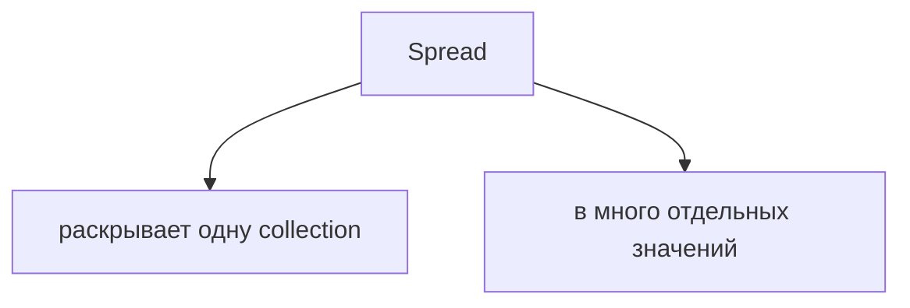
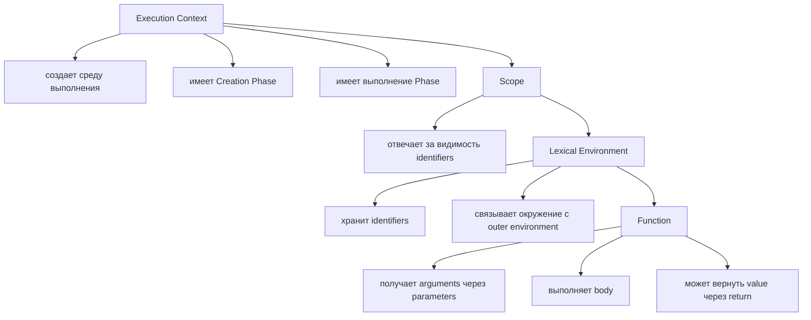
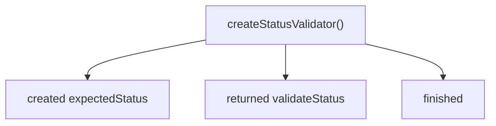
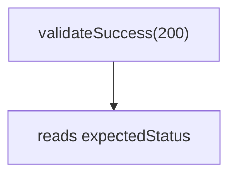
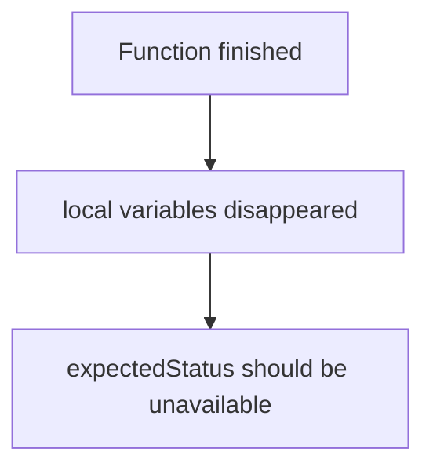
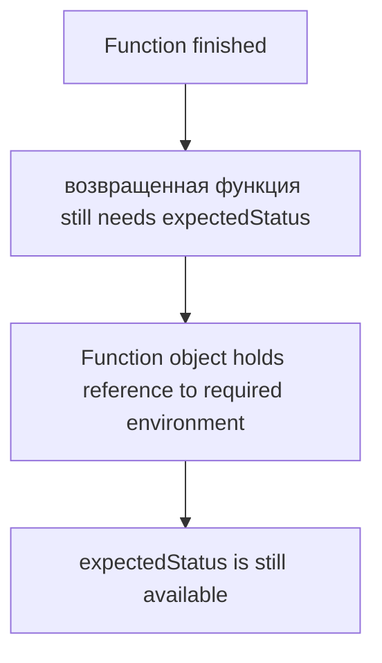
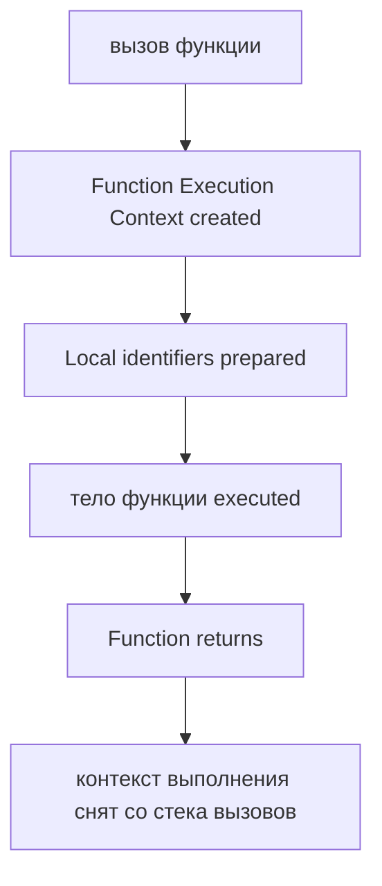
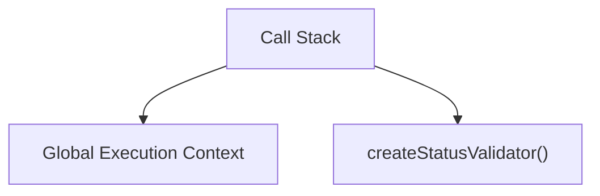

# Замыкания

## Связь с предыдущей главой

Предыдущая глава объяснила Spread.


```mermaid
flowchart TD
    N1["Spread"]
    N2["раскрывает одну collection"]
    N3["в много отдельных значений"]
    N1 --> N2
    N1 --> N3
```

Теперь мы возвращаемся к функциям и к модели выполнения JavaScript.

К этому моменту уже известно:


```mermaid
flowchart TD
    N1["Execution Context"]
    N2["создает среду выполнения"]
    N3["имеет Creation Phase"]
    N4["имеет выполнение Phase"]
    N5["Scope"]
    N6["отвечает за видимость identifiers"]
    N7["Lexical Environment"]
    N8["хранит identifiers"]
    N9["связывает окружение с outer environment"]
    N10["Function"]
    N11["получает arguments через parameters"]
    N12["выполняет body"]
    N13["может вернуть value через return"]
    N1 --> N2
    N1 --> N3
    N1 --> N4
    N1 --> N5
    N5 --> N6
    N5 --> N7
    N7 --> N8
    N7 --> N9
    N7 --> N10
    N10 --> N11
    N10 --> N12
    N10 --> N13
```

Теперь появляется один из самых важных вопросов JavaScript:

> Функция уже завершила выполнение. Почему некоторые значения все еще существуют?

Это вопрос о Closures.

Главный вопрос главы:

> Почему это значение все еще существует?

---

## Предварительные требования

Для этой главы нужно понимать:

* что Execution Context создается при выполнении функции;
* что Call Stack управляет активными Execution Contexts;
* что Scope определяет, где identifier видим;
* что Lexical Environment хранит identifiers и связь с outer environment;
* что function object можно вернуть из функции;
* что `return` завершает выполнение функции и отправляет value обратно;
* что function body выполняется только после invocation.

Не требуется знать `this`, modules, private class поля, WeakMap privacy, Garbage Collector internals, React hooks, event listeners или async closures. Эти темы будут изучаться позже.

---

## Время изучения

Ориентировочное время:

```text
Чтение главы:            150-190 минут
Разбор схем:             60-80 минут
Запуск примеров:         25-35 минут
Практика:                120-160 минут
Повторение материала:    35 минут
```

Уровень сложности: **L4**.

Closure часто кажется магией, потому что читатель ожидает, что все локальные данные функции исчезают сразу после ее завершения. На самом деле магии нет: function object удерживает ссылку на то Lexical Environment, где он был создан, если продолжает использовать identifiers из него.

---

## Навигация

Предыдущая глава:

```text
docs/01-javascript/27-spread.md
```

Текущая глава:

```text
docs/01-javascript/28-closures.md
```

Следующая глава:

```text
docs/01-javascript/29-this.md
```

Следующая глава ответит:

> Как определяется контекст выполнения функции через `this`?

---

## Цели обучения

После изучения этой главы вы будете понимать:

* зачем существуют Closures;
* почему функция может помнить outer variables;
* как Closure связана с Lexical Environment;
* почему outer scope может оставаться доступным после завершения функции;
* чем expected lifetime отличается от actual lifetime;
* как работают multiple closures;
* почему independent closures не мешают друг другу;
* как Closure связана с Execution Context и Call Stack;
* какие ошибки чаще всего возникают;
* как Closures применяются в Automation QA.

---

## Мотивация

Начнем с поведения, которое сначала кажется странным.

```javascript
function createStatusValidator() {
  const expectedStatus = 200;

  return function validateStatus(actualStatus) {
    return actualStatus === expectedStatus;
  };
}

const validateSuccess = createStatusValidator();

console.log(validateSuccess(200));
```

Функция `createStatusValidator()` уже завершилась.


```mermaid
flowchart TD
    N1["createStatusValidator()"]
    N2["created expectedStatus"]
    N3["returned validateStatus"]
    N4["finished"]
    N1 --> N2
    N1 --> N3
    N1 --> N4
```

Но `validateStatus()` все еще может прочитать `expectedStatus`.


```mermaid
flowchart TD
    N1["validateSuccess(200)"]
    N2["reads expectedStatus"]
    N1 --> N2
```

Ожидание читателя:


```mermaid
flowchart TD
    N1["Function finished"]
    N2["local variables disappeared"]
    N3["expectedStatus should be unavailable"]
    N1 --> N2
    N2 --> N3
```

Фактическое поведение:


```mermaid
flowchart TD
    N1["Function finished"]
    N2["возвращенная функция still needs expectedStatus"]
    N3["Function object holds reference to required environment"]
    N4["expectedStatus is still available"]
    N1 --> N2
    N2 --> N3
    N3 --> N4
```

Главный вопрос:

> Почему `expectedStatus` все еще существует?

Closure отвечает именно на этот вопрос.

---

## Теория

### Проблема исчезающих локальных данных

Обычная функция выполняется так:


```mermaid
flowchart TD
    N1["вызов функции"]
    N2["Function Execution Context created"]
    N3["Local identifiers prepared"]
    N4["тело функции executed"]
    N5["Function returns"]
    N6["контекст выполнения снят со стека вызовов"]
    N1 --> N2
    N2 --> N3
    N3 --> N4
    N4 --> N5
    N5 --> N6
```

Выполнение функции:


```mermaid
flowchart TD
    N1["Call Stack"]
    N2["Global Execution Context"]
    N3["createStatusValidator()"]
    N1 --> N2
    N1 --> N3
```

Функция завершается:

После завершения функции её контекст выполнения больше не активен.

Но важно не смешивать две идеи:

Контекст выполнения отвечает за выполнение.

Лексическое окружение хранит имена, которые могут понадобиться объекту функции позже.

---

### Наблюдаемое противоречие

Посмотрим на минимальный пример:

```javascript
function outer() {
  const message = 'Saved value';

  function inner() {
    return message;
  }

  return inner;
}

const readMessage = outer();

console.log(readMessage());
```

Ожидание читателя: `outer()` завершилась, её локальные имена исчезли, поэтому
`readMessage()` должна упасть или вернуть `undefined`.

Фактическое поведение: возвращается сохранённое значение. Окружение внешней
функции продолжает жить, потому что на него ссылается возвращённая функция.

Вот момент, где рождается замыкание.

```text
outer() вызвана        создано окружение с message
return inner           функция создана ВНУТРИ этого окружения и помнит его
outer() завершилась    кадр стека снят, но окружение ещё нужно inner
readMessage()          message по-прежнему доступно
```

Замыкание — это не отдельная синтаксическая конструкция.

Это поведение, которое возникает, когда объект функции удерживает ссылку на лексическое окружение, где он был создан.

---

### Что такое замыкание

Теперь можно дать рабочее определение.

Замыкание — поведение объекта функции, который удерживает ссылку на лексическое окружение, где он был создан.

Более практичная формулировка:

> Замыкание позволяет функции использовать переменные внешней области даже после того, как внешняя функция завершила выполнение.

Важно различать формулировку и механизм:

| Как часто говорят | Что происходит на самом деле |
| --- | --- |
| «функция помнит значения» | функция держит ссылку на окружение, а не копию значений |
| «переменные копируются в функцию» | копирования нет: чтение идёт из того же окружения |
| «замыкание создаётся при вызове» | замыкание создаётся при **создании** объекта функции |

Разница не педантичная: если бы значения копировались, счётчик из следующего
раздела не смог бы увеличиваться.

---

### Лексическое окружение ещё раз

В главе про лексическое окружение мы видели:

Теперь эта модель становится особенно важной.

Когда функция создается, она создается не в пустоте.

Функция `validateStatus` была создана внутри `createStatusValidator`.

Значит, её место в коде выглядит так:

```text
окружение createStatusValidator   expectedStatus
 └─ окружение validateStatus       actualStatus (параметр)
```

Цепочка областей видимости ещё раз: имя ищется сначала в своём окружении, потом
во внешнем — и это правило не меняется после завершения внешней функции.

Замыкание появляется потому, что `validateStatus` удерживает доступ к внешнему окружению, где лежит `expectedStatus`.

---

### Доступ к внешней области

Функция ищет имя так же, как раньше: сначала в своём окружении, затем во внешнем.

```text
validateStatus:  actualStatus → своё окружение
                 expectedStatus → не нашли → внешнее окружение → нашли
```

После завершения `createStatusValidator()` меняется не правило поиска, а время жизни нужного окружения.

Главный вопрос остается тем же:

> Почему это значение все еще существует?

Потому что объект функции всё ещё существует и всё ещё ссылается на окружение, где находится это значение.

---

## Внутренний механизм

### Полная последовательность

Разберем пример как фильм.

```javascript
function createValidator(expectedStatus) {
  return function validate(actualStatus) {
    return actualStatus === expectedStatus;
  };
}

const validateOk = createValidator(200);

console.log(validateOk(200));
console.log(validateOk(404));
```

```text
createValidator(200)  │ создан контекст, в нём имя expectedStatus = 200
      return …        │ создан объект функции со ссылкой на это окружение
      контекст снят   │ но окружение достижимо через возвращённую функцию
validateOk(200)       │ новый контекст; expectedStatus читается из окружения
```

Контекст `createValidator` завершился, а его окружение живо: на него ссылается
возвращённый объект функции. Именно это и называется замыканием.

---

### Как удерживается доступ

Замыкание не означает, что JavaScript сохраняет весь стек вызовов.

Взаимодействие со стеком вызовов:

Сохраняется не "активный вызов функции".

Объект функции удерживает ссылку на нужное лексическое окружение.

Интуитивная модель памяти:

```text
function object  ──→  ссылка на окружение  ──→  переменные живы
```

Мы не углубляемся в сборку мусора. Важно только одно:

Сборка мусора будет изучаться позже. Сейчас достаточно понимать: пока объект функции доступен и ему нужно внешнее окружение, это окружение остаётся достижимым через его ссылку.

---

### Время жизни захваченных переменных

```text
обычная локальная  │ живёт, пока выполняется вызов, дальше недостижима
захваченная        │ живёт, пока достижима функция, которая её использует
```

Ожидание «переменная исчезает вместе с вызовом» здесь не работает. Время жизни
значения определяется не тем, закончился ли вызов, а тем, может ли к нему
кто-то обратиться. Достижимость, а не момент возврата.

---

### Несколько замыканий

Одна функция-фабрика может создать несколько замыканий.

```javascript
function createCounter(start) {
  let count = start;

  return function increment() {
    count = count + 1;
    return count;
  };
}

const firstCounter = createCounter(0);
const secondCounter = createCounter(10);

console.log(firstCounter());
console.log(firstCounter());
console.log(secondCounter());
```

Вывод показывает, что счётчики независимы:

```text
1
2
1     ← secondCounter начинает заново
```

Они не делят один `count`, потому что каждый вызов `createCounter()` создаёт новое лексическое окружение.

---

### Временная шкала замыкания

```text
создание функции   ──┐
                     │  окружение создано и связано с объектом функции
завершение вызова ───┤  контекст снят, окружение остаётся достижимым
                     │
вызов через минуту ──┤  чтение из того же окружения
                     │
ссылок больше нет ───┘  окружение становится недостижимым
```

Замыкание заканчивается не с возвратом внешней функции, а с потерей последней
ссылки на внутреннюю.

---

## Ментальная модель

### Рюкзак

Представьте функцию, которая выходит из комнаты, но берет с собой рюкзак.

В рюкзаке не лежит копия всего мира. Эта модель означает, что у объекта функции остаётся ссылка на то окружение, которое ему нужно.

Когда функция вызывается позже, она достаёт значение из рюкзака — то есть
читает окружение в момент вызова, а не то, что было при выходе из комнаты.

Модель полезна, но её нужно понимать аккуратно: рюкзак не копия, а ссылка.
Если кто-то другой изменит содержимое того же окружения, функция увидит
изменение.

---

### Запомненная комната

Другая модель — связанная комната.

Когда внешняя функция завершилась, комната не уничтожается, если внутренняя функция всё ещё может туда вернуться за нужным именем.

Связь между функцией и её комнатой невидима в коде: в тексте программы нет
строки, которая бы её создавала. Она появляется в момент создания объекта
функции и существует, пока существует сам объект.

---

### Блокнот

Замыкание можно представить как блокнот с записями, которые функция может использовать позже.

Блокнот помогает понять, почему фабрика вспомогательных функций удобна в
тестах: настройка записывается один раз при создании, а дальше функция носит
её с собой. Вызывающему коду не нужно передавать одно и то же значение в каждый
вызов и следить, чтобы оно нигде не разошлось.

---

### Текущее место в модели JavaScript

Замыкание отвечает на вопрос:

```text
к каким переменным эта функция по-прежнему имеет доступ?
```

Следующая глава вводит `this`, который отвечает на другой вопрос:

```text
как эта функция вызвана и кто её получатель?
```

Разница между ними — та же, что между местом создания и формой вызова: первое
фиксируется один раз, второе решается на каждом вызове.

---

## Примеры кода

Примеры находятся в папке:

```text
examples/01-javascript/chapter-28/
```

Запуск:

```bash
node examples/01-javascript/chapter-28/01-first-closure.js
node examples/01-javascript/chapter-28/02-counter.js
node examples/01-javascript/chapter-28/03-independent-closures.js
node examples/01-javascript/chapter-28/04-common-mistakes.js
node examples/01-javascript/chapter-28/05-memory-intuition.js
node examples/01-javascript/chapter-28/06-qa-example.js
```

### Первое замыкание

```javascript
function createMessageReader() {
  const message = 'Environment is reachable';

  return function readMessage() {
    return message;
  };
}

const readMessage = createMessageReader();

console.log(readMessage());
```

Что происходит: `createMessageReader()` завершился, его контекст снят, но имя
`message` осталось достижимым — на окружение ссылается возвращённая функция.

Позже, при вызове `readMessage()`, чтение идёт из того же окружения. Значение
не было скопировано в момент возврата: оно читается тогда, когда его
запросили.

---

### Счётчик

```javascript
function createCounter() {
  let count = 0;

  return function increment() {
    count = count + 1;
    return count;
  };
}

const counter = createCounter();

console.log(counter());
console.log(counter());
console.log(counter());
```

Полная картина счётчика:

`count` не становится глобальной переменной. Он остаётся доступным только через возвращённую функцию.

---

### Независимые замыкания

```javascript
function createCounter(start) {
  let count = start;

  return function increment() {
    count = count + 1;
    return count;
  };
}

const smallCounter = createCounter(0);
const largeCounter = createCounter(100);

console.log(smallCounter());
console.log(smallCounter());
console.log(largeCounter());
console.log(largeCounter());
```

Картина независимых окружений:

Каждый вызов `createCounter()` создаёт отдельное лексическое окружение.

---

### Интуиция о памяти

```javascript
function createUserReader(userName) {
  return function readUserName() {
    return userName;
  };
}

const readAdminName = createUserReader('Anna');
const readGuestName = createUserReader('Ivan');

console.log(readAdminName());
console.log(readGuestName());
```

Интуитивная модель памяти:

```text
внешняя функция завершилась,
но её окружение достижимо через возвращённую функцию
```

Это концептуальная модель, а не описание внутренней памяти конкретного движка.

---

### QA-пример

```javascript
function createStatusValidator(expectedStatus) {
  return function validateResponse(response) {
    return response.status === expectedStatus;
  };
}

const validateSuccess = createStatusValidator(200);
const validateCreated = createStatusValidator(201);

const response = {
  status: 200
};

console.log(validateSuccess(response));
console.log(validateCreated(response));
```

Пример вспомогательной функции: фабрика `createLogger(config)` возвращает функцию, которая помнит настройку и не требует передавать её при каждом вызове.

Так можно создавать читаемые проверки без дублирования ожидаемого значения в каждом тесте.

---

## Частые вопросы

### Замыкание копирует значения?

Нет. Полезнее думать так: объект функции удерживает ссылку на лексическое окружение, где лежат нужные имена.

### Замыкание появляется только при возврате функции?

Нет. Но в этой главе мы используем возврат функции, потому что это самый понятный способ увидеть поведение. Другие применения будут встречаться позже, например в обратных вызовах и обработчиках событий.

### Замыкание делает переменную глобальной?

Нет. Захваченная переменная не становится глобальной.

### Замыкание всегда плохо влияет на память?

Нет. Замыкание — нормальный механизм языка. Проблемы появляются, когда код случайно удерживает больше данных, чем нужно. Сборка мусора и управление памятью будут изучаться позже.

---

## Распространённые мифы

### Миф 1. Замыкание — редкая продвинутая техника

Реальность: замыкания встречаются в обычном коде постоянно, особенно в фабриках вспомогательных функций, проверках и создателях настроенных функций.

### Миф 2. Замыкание хранит копию всех переменных внешней функции

Реальность: правильнее мыслить через ссылку объекта функции на нужное лексическое окружение.

### Миф 3. Замыкание делает код непредсказуемым

Реальность: замыкание предсказуемо, если вручную отслеживать:

Замыкание становится сложным только тогда, когда разработчик пытается запомнить определение вместо того, чтобы рисовать окружение.

---

## Распространённые ошибки

### Ошибка 1. Думать, что внешняя переменная исчезает всегда

Неправильная модель: будто локальные переменные внешней функции исчезают сразу после её завершения.

Что произошло: завершение вызова снимает контекст, но не удаляет окружение,
на которое кто-то ссылается.

Исправленная модель: значение живёт, пока достижимо. Момент возврата из
внешней функции к этому отношения не имеет.

---

### Ошибка 2. Думать, что замыкание хранит копию значения

```javascript
function createCounter() {
  let count = 0;

  return function increment() {
    count = count + 1;
    return count;
  };
}
```

Если бы замыкание хранило копию, `count` каждый раз был бы равен `0`.

Фактическое поведение другое: каждый вызов читает и изменяет **ту же самую**
переменную в том же окружении, поэтому значения накапливаются.

---

### Ошибка 3. Создавать общий состояние случайно

```javascript
let sharedStatus = 200;

function validateStatus(actualStatus) {
  return actualStatus === sharedStatus;
}
```

Это не фабрика. Это общее изменяемое состояние.

Более контролируемый вариант:

```javascript
function createStatusValidator(expectedStatus) {
  return function validateStatus(actualStatus) {
    return actualStatus === expectedStatus;
  };
}
```

---

### Ошибка 4. Путать замыкание и область видимости

Область видимости отвечает на вопрос:

```text
Где имя видно?
```

Замыкание отвечает на вопрос:

```text
Почему функция позже по-прежнему достаёт внешнее окружение?
```

Они связаны, но это не одно и то же.

---

## Практическое использование

Замыкание полезно, когда нужно создать функцию, у которой есть доступ к части настройки из лексического окружения, где она была создана.

Функция-фабрика — самая частая форма: внешняя функция принимает настройку и
возвращает функцию, которая эту настройку помнит.

Пример:

```javascript
function createPrefixLogger(prefix) {
  return function logMessage(message) {
    console.log(prefix + ': ' + message);
  };
}

const logApi = createPrefixLogger('API');
const logUi = createPrefixLogger('UI');

logApi('Request started');
logUi('Button clicked');
```

Оба вызова используют один и тот же код `logMessage`, но каждый помнит свой
`prefix` — второго экземпляра функции при этом не появляется, появляется второе
окружение.

Замыкание помогает:

* создавать специализированные вспомогательные функции;
* избегать лишних глобальных переменных;
* хранить настройку рядом с поведением;
* делать код выразительнее;
* уменьшать дублирование.

---

## Использование в Automation QA

### Функции-фабрики

В автоматизации тестов часто нужны вспомогательные функции, которые отличаются только настройкой.

```javascript
function createHeaderValidator(expectedHeaderName) {
  return function validateHeaders(headers) {
    return headers[expectedHeaderName] !== undefined;
  };
}
```

Фабрика возвращает готовую проверку: имя заголовка зафиксировано при создании,
а сама проверка принимает только заголовки ответа. Два вызова фабрики дают две
независимые проверки, которые не мешают друг другу.

---

### Переиспользуемые проверки

```javascript
function createResponseValidator(expectedStatus) {
  return function validateResponse(response) {
    return response.status === expectedStatus;
  };
}

const validateOk = createResponseValidator(200);
const validateCreated = createResponseValidator(201);
```

Объект автоматизации тестов:

Такой подход полезен для проверок REST API, где один и тот же алгоритм применяется к разным ожидаемым значениям.

---

### Захват конфигурации

```javascript
function createApiUrlBuilder(baseUrl) {
  return function buildUrl(path) {
    return baseUrl + path;
  };
}

const buildStagingUrl = createApiUrlBuilder('https://staging.example.test');

console.log(buildStagingUrl('/users'));
```

Захват конфигурации:

Это удобно для функций, которые должны помнить настройку окружения.

---

### Фабрики локаторов

Фабрики локаторов в Playwright часто строятся вокруг контекста страницы или префикса селектора, к которым функция получает доступ через ссылку на окружение. Подробно Playwright будет изучаться позже, но сама идея замыкания уже понятна.

Важно: обратные вызовы, асинхронное поведение и обработчики событий будут разобраны позже. Здесь достаточно понять: замыкание даёт функции доступ к данным из лексического окружения, где она была создана.

---

## Практика

Практика находится в файле:

```text
practice/01-javascript/28-closures.md
```

Выполняйте задания после запуска примеров из раздела «Примеры кода».

Решения находятся отдельно:

```text
solutions/01-javascript/28-closures.md
```

Сначала решите задания самостоятельно. Для замыканий особенно важно не
угадывать ответ, а вручную рисовать окружение: какие имена создал вызов, какая
функция на них ссылается и когда эта ссылка исчезает.

---

## Решения

Файл с решениями:

```text
solutions/01-javascript/28-closures.md
```

В решениях важно смотреть не только на итоговый код, но и на рассуждение: для замыканий главный навык — объяснять, почему объект функции всё ещё имеет доступ к конкретному лексическому окружению.

---

## Итоги

Замыкание объясняет, почему функция может использовать внешние переменные после завершения внешней функции.

Главная идея: объект функции хранит ссылку на окружение, а не копию значений.

Полная картина: окружение создаётся при вызове внешней функции, связывается с
созданным внутри объектом функции и остаётся достижимым ровно столько, сколько
достижим этот объект.

Замыкание не является магией. Объект функции удерживает ссылку на лексическое окружение, где был создан, потому что продолжает использовать имена из этого окружения.

---

## Что нужно запомнить

* Замыкание — поведение объекта функции, который удерживает ссылку на лексическое окружение, где был создан.
* Замыкание появляется, когда функция использует переменные внешней области.
* Внешняя функция может завершиться, но нужное лексическое окружение остаётся достижимым через объект функции.
* Захваченная переменная не становится глобальной.
* Замыкание не копирует значения как застывший снимок.
* Каждый вызов функции-фабрики может создать независимое лексическое окружение.
* Замыкания полезны для фабрик, проверок, захвата настройки и вспомогательных функций тестов.
* Следующая глава про `this` объяснит другой вопрос: не какие переменные видны функции, а как определяется объект, с которым она выполняется.

Краткая ментальная модель: функция уносит с собой не значения, а ссылку на
комнату, где они лежат.

---

## Проверьте себя

Ответьте без запуска кода:

1. Почему `expectedStatus` доступен после завершения `createStatusValidator()`?
2. Замыкание копирует значение переменной или объект функции удерживает ссылку на окружение?
3. Почему два вызова `createCounter()` создают независимые счётчики?
4. Чем область видимости отличается от замыкания?
5. Почему захваченная переменная не является глобальной?
6. Какая тема логически следует после замыканий и почему?

### Ответы

1. Потому что функция помнит окружение, в котором была создана, и удерживает его. Вызов `createStatusValidator()` завершился, но его окружение осталось жить вместе с возвращённой функцией.
2. Удерживает ссылку на окружение. Поэтому функция видит текущее состояние переменной, а не её значение на момент создания.
3. Каждый вызов создаёт свой контекст выполнения и своё окружение. Возвращённые функции удерживают разные окружения, поэтому и счётчики независимы.
4. Область видимости — правило, откуда имя доступно, оно задаётся при написании кода. Замыкание — следствие этого правила во времени: окружение продолжает жить, пока на него ссылается функция.
5. Захваченная переменная доступна только той функции, которая её удерживает. Снаружи к ней не обратиться ни по имени, ни иначе — в отличие от глобальной, видимой всему коду.
6. `this`: замыкание объясняет, что функция помнит о месте создания, а `this` — то, что определяется в момент вызова. Эти два механизма постоянно путают между собой.

