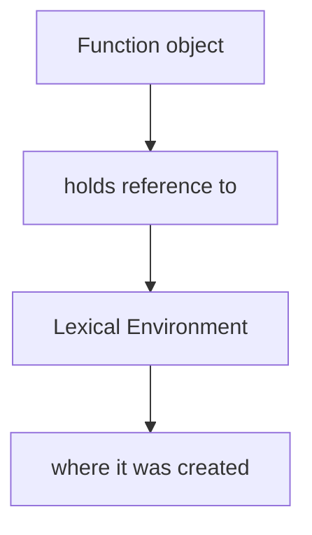
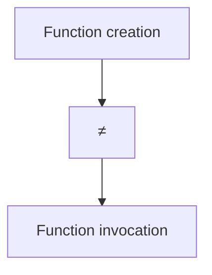
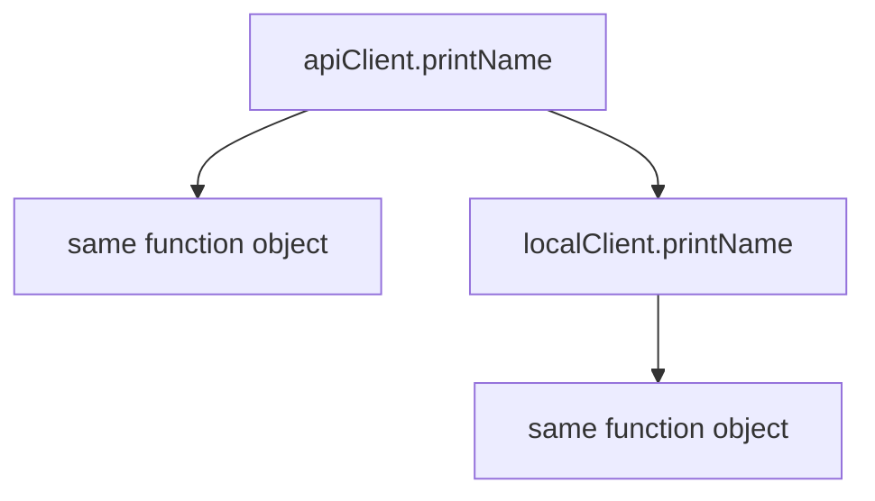
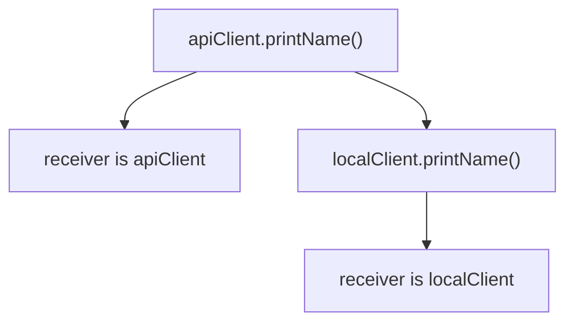
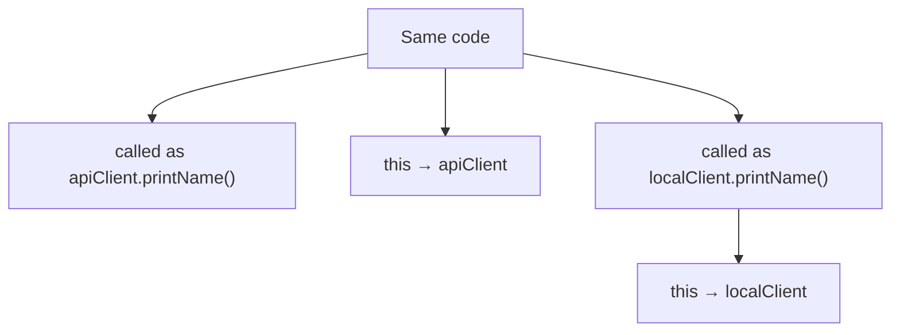
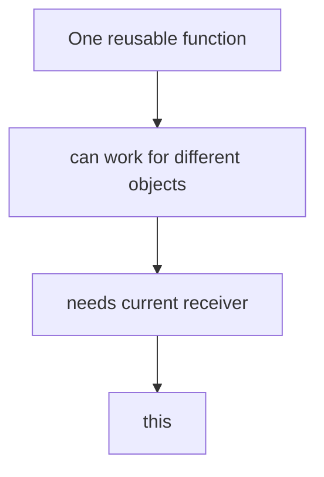

# this

## Связь с предыдущей главой

Предыдущая глава объяснила Closures.

Главная модель была такой:



Closure отвечает на вопрос:

```text
Which variables can the function access?
```

Теперь появляется другой вопрос.

Одна и та же функция может быть вызвана по-разному:

```javascript
function printName() {
  console.log(this.name);
}

const user = {
  name: 'Anna',
  printName
};

const admin = {
  name: 'Kate',
  printName
};

user.printName();
admin.printName();
```

Код функции один и тот же.

Но результат зависит от вызова.

Главный вопрос этой главы:

> Кто решил, чем будет `this`?

---

## Предварительные требования

Для этой главы нужно понимать:

* что функция - это function object;
* что function object можно хранить в переменной;
* что object может хранить properties;
* что property value может быть function object;
* что Closure связана с Lexical Environment;
* что Execution Context создается при вызове функции;
* что Call Stack управляет активными вызовами.

Не требуется знать `call()`, `apply()`, `bind()`, classes, constructors, `new`, DOM event handlers или async callbacks. Эти темы будут изучаться позже.

---

## Время изучения

Ориентировочное время:

```text
Чтение главы:            150-190 минут
Разбор схем:             60-80 минут
Запуск примеров:         25-35 минут
Практика:                120-160 минут
Повторение материала:    35 минут
```

Уровень сложности: **L4**.

`this` сложен не из-за синтаксиса. Он сложен потому, что многие пытаются определить `this` по месту создания функции. В обычных function declarations и function expressions это неверная модель.

Главная мысль главы:



`this` определяется во время invocation.

---

## Навигация

Предыдущая глава:

```text
docs/01-javascript/28-closures.md
```

Текущая глава:

```text
docs/01-javascript/29-this.md
```

Следующая глава:

```text
docs/01-javascript/30-call.md
```

Следующая глава ответит:

> Можно ли выбрать объект выполнения вручную?

---

## Цели обучения

После изучения этой главы вы будете понимать:

* зачем существует `this`;
* что такое execution объект выполнения;
* почему `this` определяется во время вызова;
* чем global invocation отличается от method invocation;
* почему detached function теряет объект выполнения;
* почему Creation Phase не решает значение `this` заранее;
* чем Closure отличается от `this`;
* как Arrow Function связана с `this` на высоком уровне;
* какие ошибки чаще всего возникают;
* как `this` встречается в Automation QA коде.

---

## Мотивация

Начнем с неожиданного поведения.

```javascript
const apiClient = {
  name: 'staging client',
  printName: function () {
    console.log(this.name);
  }
};

const localClient = {
  name: 'local client',
  printName: apiClient.printName
};

apiClient.printName();
localClient.printName();
```

Function object один:



Но вызовы разные:



Same function, different invocation:



Если думать, что `this` определяется там, где функция была создана, этот пример невозможно объяснить.

Правильный вопрос:

> Как функция была вызвана?

Зачем существует `this`:



---

## Теория

### Зачем существует this

Функция часто описывает действие, которое должно выполняться для конкретного object.

```javascript
const response = {
  status: 200,
  isSuccessful: function () {
    return this.status === 200;
  }
};
```

Внутри `isSuccessful` нужно обратиться к текущему response object.

Без `this` пришлось бы явно указывать имя объекта:

```javascript
const response = {
  status: 200,
  isSuccessful: function () {
    return response.status === 200;
  }
};
```

Но тогда функция жестко привязана к имени `response`.

`this` решает другую задачу:

Receiver model:

`this` нужен, чтобы один function object мог работать с тем object, для которого он вызван.

---

### Execution объект выполнения

Execution объект выполнения - это object, для которого выполняется function call.

В выражении:

```javascript
apiClient.printName();
```

объект выполнения:

Current объект выполнения:

Важно:

Один function object может быть property разных objects.

---

### Как определяется this

Для обычных function calls, которые рассматриваются в этой главе, используем рабочее правило:

```text
this is determined by invocation
```

Invocation determines `this`:

Creation vs invocation:

Для обычного вызова вида `object.method()` ключевой вопрос для чтения кода:

```text
Кто находится слева от точки в момент вызова?
```

Пример:

```javascript
client.printName();
```

Это не универсальное правило для всех форм вызова в JavaScript. Сейчас мы строим базовую модель объект выполнения для обычных вызовов `object.method()` и standalone calls. Другие формы вызова будут изучаться в следующих главах.

---

### Global invocation

Global invocation - это вызов функции без object объект выполнения.

```javascript
'use strict';

function printThis() {
  console.log(this);
}

printThis();
```

Глобальный вызов:

В strict mode:

В старом non-strict поведении `this` мог указывать на global object. В этом курсе мы строим современную практическую модель и будем избегать зависимости от non-strict поведения.

Global invocation схема:

---

### Method invocation

Method invocation - это вызов function object как property object.

```javascript
const user = {
  name: 'Anna',
  printName: function () {
    console.log(this.name);
  }
};

user.printName();
```

Object method:

Вызов метода:

Current object:

Same code, different объект выполнения:

---

### Detached function

Detached function - это function object, который взяли из object property и вызвали отдельно.

```javascript
'use strict';

const apiClient = {
  name: 'staging',
  printName: function () {
    console.log(this.name);
  }
};

const printClientName = apiClient.printName;

printClientName();
```

Method extraction:

Function reference:

Потерянный объект выполнения:

В strict mode `this` будет `undefined`, поэтому попытка прочитать `this.name` приведет к ошибке.

Detached function схема:

```text
obj.method()   →  this = obj
const f = obj.method; f()  →  this потерян
```

Это одна из самых частых ошибок в JavaScript.

---

### Arrow Function overview

Arrow Functions ведут себя с `this` иначе, но в этой главе мы не разбираем lexical `this` глубоко.

Достаточно зафиксировать:

Arrow function preview:

Не используйте Arrow Function как "просто короткую method syntax" для object methods, если внутри нужен `this`.

Подробности lexical `this` будут изучаться позже, когда появятся callbacks и более сложные function patterns.

---

## Внутренний механизм

### Execution Context revisit

Когда function call начинается, JavaScript создает Function Execution Context.

В главах раньше мы смотрели на:

Теперь добавляем еще один вопрос:

Execution Context revisit:

Важно: `this` не ищется как обычная variable через Scope Chain.

`this` поиск:

---

### Invocation flow

Разберем вызов:

```javascript
client.printStatus();
```

Invocation поток:

Выбор объекта выполнения:

Other invocation forms:

Полная картина выполнения:

---

### Closure vs this

Closures и `this` часто путают, потому что обе темы связаны с функциями.

Но они отвечают на разные вопросы.

Closure vs `this`:

Environment vs объект выполнения:

Пример:

```javascript
function createPrinter(prefix) {
  return function printName() {
    console.log(prefix + ': ' + this.name);
  };
}
```

Внутри `printName` есть две разные зависимости:

Одна функция может одновременно использовать Closure и `this`, но механизмы разные.

---

### Timeline

Временная шкала:

Function creation:

Вызов функции:

Это центральная граница главы.

---

## Ментальная модель

### Current объект выполнения

Думайте о `this` как о current объект выполнения card, которую JavaScript кладет перед функцией на время вызова.

Current context card:

Для `apiClient.request()`:

Для `request()`:

---

### Current owner

Модель "current owner" полезна, если не понимать ее буквально.

Функция не принадлежит object навсегда.

Active object:

---

### Current speaker

Ещё одна модель: `this` — это не переменная функции, а часть информации о вызове, которую движок подставляет в момент обращения.

Current speaker:

Эта модель помогает читать Page Object methods: метод, вызванный через объект страницы, получает его как `this`, а тот же метод, переданный в колбэк, — нет.

Но помните: если method extracted, speaker теряется.

---

### Краткая ментальная модель

Итоговая схема:

---

### Текущее место в модели JavaScript

Переход к call/apply/bind:

---

## Примеры кода

Примеры находятся в папке:

```text
examples/01-javascript/chapter-29/
```

Запуск:

```bash
node examples/01-javascript/chapter-29/01-global-call.js
node examples/01-javascript/chapter-29/02-method-call.js
node examples/01-javascript/chapter-29/03-detached-function.js
node examples/01-javascript/chapter-29/04-arrow-preview.js
node examples/01-javascript/chapter-29/05-common-mistakes.js
node examples/01-javascript/chapter-29/06-qa-example.js
```

### Global call

```javascript
'use strict';

function showReceiver() {
  console.log(this);
}

showReceiver();
```

Глобальный вызов:

---

### Method call

```javascript
const apiClient = {
  name: 'staging',
  printName: function () {
    console.log(this.name);
  }
};

apiClient.printName();
```

Вызов метода:

---

### Detached function

```javascript
'use strict';

const apiClient = {
  name: 'staging',
  getName: function () {
    return this.name;
  }
};

const getClientName = apiClient.getName;

console.log(getClientName());
```

Этот пример intentionally demonstrates an error. Detached function вызывается без объект выполнения, поэтому `this` равен `undefined` в strict mode.

---

### Arrow preview

```javascript
const apiClient = {
  name: 'staging',
  getName: () => {
    return this.name;
  }
};

console.log(apiClient.getName());
```

В Node.js этот пример обычно выводит `undefined`, потому что Arrow Function не получает `this` от вызова `apiClient.getName()`.

Подробная механика Arrow Function и `this` будет разобрана позже.

---

## Частые вопросы

### this - это то же самое, что Closure?

Нет.

### this указывает на функцию?

Нет. `this` указывает на объект выполнения текущего вызова, а не на function object.

### this определяется там, где функция написана?

Для обычных functions - нет. `this` определяется тем, как функция вызвана.

### Почему detached function теряет this?

В модели обычных вызовов из этой главы `functionName()` вызывается без object объект выполнения. Поэтому такой вызов не выбирает объект выполнения так же, как `object.method()`.

### Нужно ли всегда избегать this?

Нет. `this` полезен в object methods, page objects, API clients и helper objects. Проблема не в `this`, а в неправильной mental model.

---

## Распространённые мифы

### Миф 1. this всегда указывает на object, где функция была создана

Реальность:

### Миф 2. this и Scope Chain работают одинаково

Реальность:

### Миф 3. Arrow Functions - лучший метод для object methods

Реальность: если method должен использовать объект выполнения через `this`, обычная function часто понятнее. Arrow Functions имеют особое поведение `this`, которое будет изучаться позже.

---

## Распространённые ошибки

### Ошибка 1. Потерять объект выполнения

Неправильный код:

```javascript
'use strict';

const helper = {
  prefix: 'API',
  log: function (message) {
    console.log(this.prefix + ': ' + message);
  }
};

const log = helper.log;

log('Request failed');
```

Что произошло:

Почему это произошло:

Исправленный вариант в рамках уже изученного:

```javascript
helper.log('Request failed');
```

`call()`, `apply()` и `bind()` дадут другие способы управления объект выполнения в следующих главах.

---

### Ошибка 2. Думать, что this берется из Closure

```javascript
function createPrinter(prefix) {
  return function printName() {
    console.log(prefix + ': ' + this.name);
  };
}
```

`prefix` приходит из Closure.

`this.name` приходит из объект выполнения текущего вызова.

Типичные ошибки:

---

### Ошибка 3. Использовать Arrow Function как method с this

```javascript
const user = {
  name: 'Anna',
  getName: () => {
    return this.name;
  }
};
```

Что произошло:

Исправленный вариант:

```javascript
const user = {
  name: 'Anna',
  getName: function () {
    return this.name;
  }
};
```

---

## Практическое использование

`this` полезен, когда object хранит данные и поведение рядом.

```javascript
const response = {
  status: 200,
  isSuccessful: function () {
    return this.status === 200;
  }
};
```

Практическая модель: чтобы понять, чему равен `this`, смотрите не на объявление функции, а на строку её вызова.

`this` делает method reusable внутри object model:

В обычном прикладном коде это встречается в clients, builders, validators и page objects.

---

## Использование в Automation QA

### Page Object methods

Page Object часто хранит locators, page reference и methods.

Если method вызывается как `loginPage.open()`, объект выполнения - `loginPage`.

Если method detached, объект выполнения может потеряться.

---

### API client objects

```javascript
const apiClient = {
  baseUrl: 'https://api.example.test',
  buildUrl: function (path) {
    return this.baseUrl + path;
  }
};
```

QA object example:

Это помогает держать configuration и поведение рядом.

---

### Helper objects

Helper object:

Понимание `this` помогает:

* читать page object methods;
* находить потерянный объект выполнения;
* понимать ошибки в helper objects;
* не путать Closure configuration и объект выполнения состояние;
* аккуратно проектировать API clients.

---

## Практика

Практика находится в файле:

```text
practice/01-javascript/29-this.md
```

Выполняйте задания после запуска примеров из раздела «Примеры кода».

Главное упражнение этой главы - для каждого вызова задавать вопрос:

```text
Who is the receiver of this invocation?
```

---

## Решения

Файл с решениями:

```text
solutions/01-javascript/29-this.md
```

В решениях обращайте внимание на reasoning. Для `this` недостаточно назвать результат; нужно объяснить, какая форма invocation выбрала объект выполнения.

---

## Итоги

`this` отвечает на вопрос:

```text
Who is the current receiver?
```

Полная модель: значение `this` определяется формой вызова — через объект, напрямую, через `call`/`apply`/`bind` или через `new`.

Closure и `this` решают разные задачи:

Следующая глава про `call()` покажет, как выбрать объект выполнения вручную.

---

## Что нужно запомнить

* `this` определяется во время invocation.
* Function creation не фиксирует `this` навсегда.
* В обычном вызове `object.method()` объект выполнения обычно object слева от точки.
* В detached function объект выполнения теряется.
* В strict mode global call дает `this === undefined`.
* Closure отвечает про variables, `this` отвечает про объект выполнения.
* Arrow Functions имеют особое поведение `this`; подробно оно будет изучаться позже.
* Следующие главы покажут другие формы вызова и ручной выбор объект выполнения.

---

## Проверьте себя

Ответьте без запуска кода:

1. Чем Closure отличается от `this`?
2. Что является объект выполнения в вызове `apiClient.buildUrl('/users')`?
3. Почему `const fn = object.method; fn()` может сломать `this`?
4. Когда определяется `this`: при создании функции или при вызове?
5. Почему Arrow Function не стоит механически использовать как object method с `this`?
6. Какую проблему будет решать следующая глава про `call()`?
