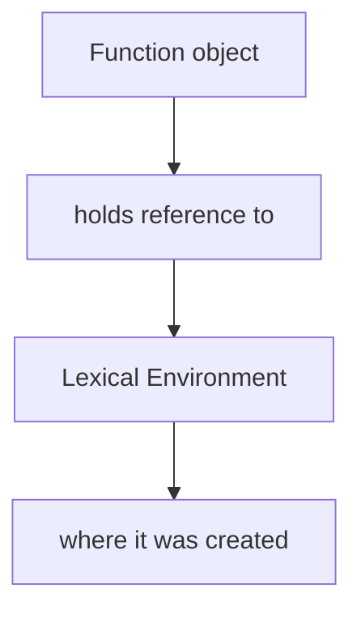
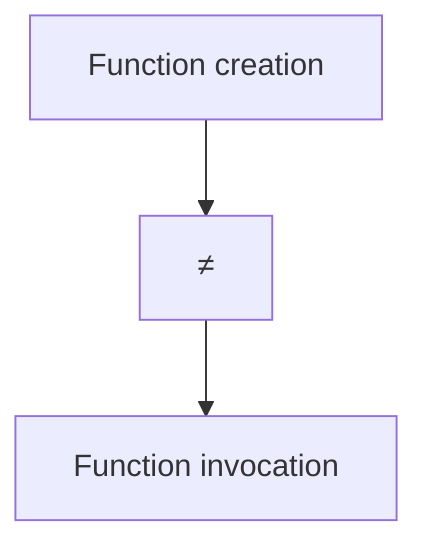
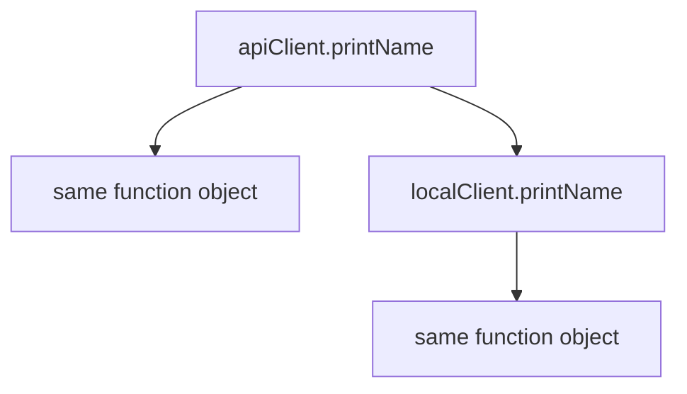
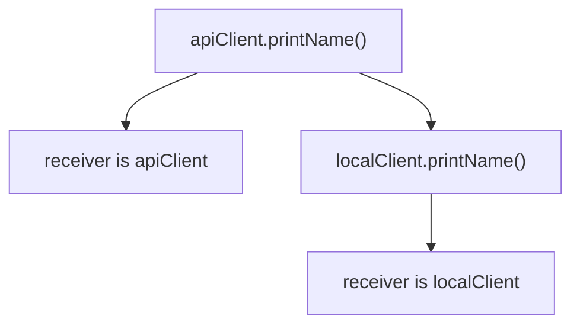
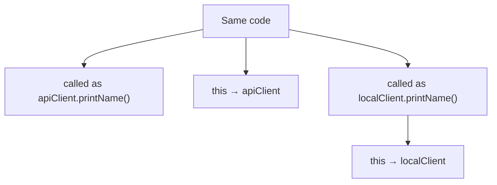
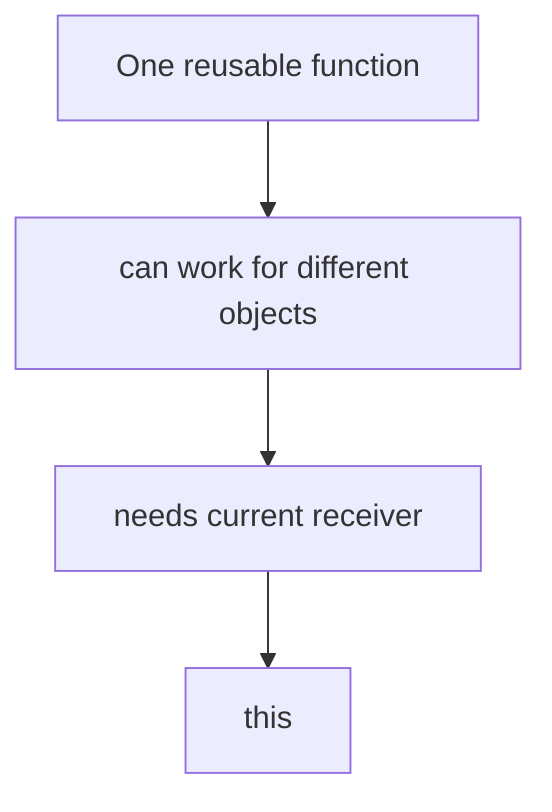

# Ключевое слово `this`

## Связь с предыдущей главой

Предыдущая глава объяснила Closures.

Главная модель была такой:


```mermaid
flowchart TD
    N1["Function object"]
    N2["holds reference to"]
    N3["Lexical Environment"]
    N4["where it was created"]
    N1 --> N2
    N2 --> N3
    N3 --> N4
```

Closure отвечает на вопрос:

```text
Which variables can the function access?
```

Теперь появляется другой вопрос.

Одна и та же функция может быть вызвана по-разному:

```javascript
function printName() {
  console.log(this.name);
}

const user = {
  name: 'Anna',
  printName
};

const admin = {
  name: 'Kate',
  printName
};

user.printName();
admin.printName();
```

Код функции один и тот же.

Но результат зависит от вызова.

Главный вопрос этой главы:

> Кто решил, чем будет `this`?

---

## Предварительные требования

Для этой главы нужно понимать:

* что функция - это function object;
* что function object можно хранить в переменной;
* что object может хранить properties;
* что property value может быть function object;
* что Closure связана с Lexical Environment;
* что Execution Context создается при вызове функции;
* что Call Stack управляет активными вызовами.

Не требуется знать `call()`, `apply()`, `bind()`, classes, constructors, `new`, DOM event handlers или async callbacks. Эти темы будут изучаться позже.

---

## Время изучения

Ориентировочное время:

```text
Чтение главы:            150-190 минут
Разбор схем:             60-80 минут
Запуск примеров:         25-35 минут
Практика:                120-160 минут
Повторение материала:    35 минут
```

Уровень сложности: **L4**.

`this` сложен не из-за синтаксиса. Он сложен потому, что многие пытаются определить `this` по месту создания функции. В обычных function declarations и function expressions это неверная модель.

Главная мысль главы:


```mermaid
flowchart TD
    N1["Function creation"]
    N2["≠"]
    N3["Function invocation"]
    N1 --> N2
    N2 --> N3
```

`this` определяется во время invocation.

---

## Навигация

Предыдущая глава:

```text
docs/01-javascript/28-closures.md
```

Текущая глава:

```text
docs/01-javascript/29-this.md
```

Следующая глава:

```text
docs/01-javascript/30-call.md
```

Следующая глава ответит:

> Можно ли выбрать объект выполнения вручную?

---

## Цели обучения

После изучения этой главы вы будете понимать:

* зачем существует `this`;
* что такое execution объект выполнения;
* почему `this` определяется во время вызова;
* чем global invocation отличается от method invocation;
* почему detached function теряет объект выполнения;
* почему Creation Phase не решает значение `this` заранее;
* чем Closure отличается от `this`;
* как Arrow Function связана с `this` на высоком уровне;
* какие ошибки чаще всего возникают;
* как `this` встречается в Automation QA коде.

---

## Мотивация

Начнем с неожиданного поведения.

```javascript
const apiClient = {
  name: 'staging client',
  printName: function () {
    console.log(this.name);
  }
};

const localClient = {
  name: 'local client',
  printName: apiClient.printName
};

apiClient.printName();
localClient.printName();
```

Function object один:


```mermaid
flowchart TD
    N1["apiClient.printName"]
    N2["same function object"]
    N3["localClient.printName"]
    N4["same function object"]
    N1 --> N2
    N1 --> N3
    N3 --> N4
```

Но вызовы разные:


```mermaid
flowchart TD
    N1["apiClient.printName()"]
    N2["receiver is apiClient"]
    N3["localClient.printName()"]
    N4["receiver is localClient"]
    N1 --> N2
    N1 --> N3
    N3 --> N4
```

Same function, different invocation:


```mermaid
flowchart TD
    N1["Same code"]
    N2["called as apiClient.printName()"]
    N3["this → apiClient"]
    N4["called as localClient.printName()"]
    N5["this → localClient"]
    N1 --> N2
    N1 --> N3
    N1 --> N4
    N4 --> N5
```

Если думать, что `this` определяется там, где функция была создана, этот пример невозможно объяснить.

Правильный вопрос:

> Как функция была вызвана?

Зачем существует `this`:


```mermaid
flowchart TD
    N1["One reusable function"]
    N2["can work for different objects"]
    N3["needs current receiver"]
    N4["this"]
    N1 --> N2
    N2 --> N3
    N3 --> N4
```

---

## Теория

### Зачем существует `this`

Функция часто описывает действие, которое должно выполняться для конкретного объекта.

```javascript
const response = {
  status: 200,
  isSuccessful: function () {
    return this.status === 200;
  }
};
```

Внутри `isSuccessful` нужно обратиться к текущему объекту ответа.

Без `this` пришлось бы явно указывать имя объекта:

```javascript
const response = {
  status: 200,
  isSuccessful: function () {
    return response.status === 200;
  }
};
```

Но тогда функция жестко привязана к имени `response`.

`this` решает другую задачу: он даёт функции доступ к тому объекту, для которого
её вызвали, не называя этот объект по имени.

Модель получателя:

```text
apiClient.check(response)
└───────┘
получатель — он и станет this внутри check
```

`this` нужен, чтобы один объект функции мог работать с тем объектом, для которого он вызван.

---

### Объект выполнения

Объект выполнения — это объект, для которого выполняется вызов функции.

В выражении:

```javascript
apiClient.printName();
```

объект выполнения — это `apiClient`: он стоит слева от точки в момент вызова.

```text
apiClient . printName ()
└───────┘   └───────┘
  this       функция
```

Важно различать две вещи: объект выполнения принадлежит **вызову**, а не
функции. Один объект функции может быть свойством разных объектов, и тогда у
каждого вызова свой `this`.

---

### Как определяется `this`

Для обычных вызовов, которые рассматриваются в этой главе, используем рабочее правило:

```text
this определяется формой вызова
```

Что это означает на практике:

```text
obj.method()       →  this === obj
method()           →  this === undefined в строгом режиме
new Ctor()         →  this === создаваемый объект
fn.call(obj)       →  this === obj  (глава 30)
```

Создание и вызов — разные моменты: при создании функции `this` не определён
вовсе, потому что неизвестно, как её вызовут.

Для обычного вызова вида `object.method()` ключевой вопрос для чтения кода:

```text
Кто находится слева от точки в момент вызова?
```

Пример:

```javascript
client.printName();
```

Это не универсальное правило для всех форм вызова. Сейчас мы строим базовую модель для обычных вызовов вида `object.method()` и вызовов без объекта. Другие формы будут изучаться в следующих главах.

---

### Вызов в глобальном контексте

Вызов без объекта — это вызов функции, у которого нет объекта выполнения.

```javascript
'use strict';

function printThis() {
  console.log(this);
}

printThis();
```

Вызов идёт без объекта слева от точки, поэтому в строгом режиме `this`
остаётся `undefined`.

В старом нестрогом поведении `this` мог указывать на глобальный объект. В этом
курсе мы строим современную практическую модель и избегаем зависимости от
нестрогого поведения.

```text
printThis()
└── слева от точки ничего нет
    └── строгий режим   →  this === undefined
        нестрогий режим →  this === globalThis
```

---

### Вызов как метода

Вызов метода — это вызов объекта функции как свойства объекта.

```javascript
const user = {
  name: 'Anna',
  printName: function () {
    console.log(this.name);
  }
};

user.printName();
```

Здесь слева от точки стоит `user`, поэтому он и становится объектом
выполнения.

```text
user.printName()
└──┘
 this
```

Тело функции при этом не меняется. Один и тот же код даёт разные объекты
выполнения — решает не объявление, а форма вызова.

---

### Оторванная функция

Оторванная функция — это объект функции, который взяли из свойства объекта и вызвали отдельно.

```javascript
'use strict';

const apiClient = {
  name: 'staging',
  printName: function () {
    console.log(this.name);
  }
};

const printClientName = apiClient.printName;

printClientName();
```

Что произошло по шагам:

```text
apiClient.printName        прочитано свойство — получен объект функции
const printClientName = …  в переменной лежит ФУНКЦИЯ, объекта рядом нет
printClientName()          вызов без получателя
```

Объект не «отвязался» — его здесь никогда и не было: свойство хранит функцию, а
связь с объектом создаёт форма вызова.

В строгом режиме `this` будет равен `undefined`, поэтому попытка прочитать `this.name` приведёт к ошибке.

Схема оторванной функции:

```text
obj.method()   →  this = obj
const f = obj.method; f()  →  this потерян
```

Это одна из самых частых ошибок в JavaScript.

---

### Стрелочные функции: краткий обзор

Стрелочные функции ведут себя с `this` иначе, но в этой главе мы не разбираем это глубоко.

Достаточно зафиксировать: стрелочная функция **не получает** своего объекта
выполнения. Она берёт `this` из того места, где была создана, и никакая форма
вызова этого не меняет.

```text
obj.method()        обычная функция  →  this = obj
obj.arrowMethod()   стрелочная       →  this из окружающего кода, не obj
```

Не используйте стрелочную функцию как «просто короткую запись метода», если внутри нужен `this`.

Подробности того, откуда стрелка берёт `this`, будут изучаться позже, когда появятся обратные вызовы и более сложные приёмы.

---

## Внутренний механизм

### Контекст выполнения ещё раз

Когда вызов функции начинается, JavaScript создаёт контекст выполнения функции.

Раньше нас интересовали два вопроса о контексте: какие имена в нём
зарегистрированы и какое окружение считается внешним. Теперь добавляется
третий — какой объект стал объектом выполнения.

Важно: `this` не ищется как обычная переменная по цепочке областей видимости.

```text
имя переменной │ ищется по цепочке окружений вверх
this           │ не ищется: записывается в контекст при вызове
```

Поэтому вложенная обычная функция не «наследует» `this` внешней: её вызов
создаёт свой контекст со своим объектом выполнения.

---

### Поток вызова

Разберем вызов:

```javascript
client.printStatus();
```

```text
1. Прочитано выражение вызова      client.printStatus()
2. Определён объект слева от точки client
3. Создан контекст выполнения      this = client
4. Выполнено тело                  this.status доступен
```

Шаг 2 — единственное место, где решается значение `this`. Другие формы вызова
меняют именно его: `printStatus()` не даст объекта, `printStatus.call(other)`
задаст `other`, а стрелочная функция возьмёт `this` из окружающего кода.

---

### Замыкание и `this`

Замыкания и `this` часто путают, потому что обе темы связаны с функциями.

Но они отвечают на разные вопросы.

| | Замыкание | `this` |
| --- | --- | --- |
| что даёт доступ | место **создания** функции | форма **вызова** |
| когда определяется | при создании | при каждом вызове |
| меняется между вызовами | нет | да |

Пример:

```javascript
function createPrinter(prefix) {
  return function printName() {
    console.log(prefix + ': ' + this.name);
  };
}
```

Внутри `printName` есть две разные зависимости:

* `prefix` приходит из замыкания — он зафиксирован при создании функции;
* `this.name` приходит из объекта выполнения — он меняется от вызова к вызову.

Одна функция может одновременно использовать замыкание и `this`, но механизмы разные.

---

### Временная шкала

```text
создание функции │ зафиксировано внешнее окружение (замыкание)
                 │ this НЕ определён — неизвестно, как вызовут
     ↓
вызов № 1        │ this = apiClient
вызов № 2        │ this = ordersApi
вызов № 3        │ this = undefined (вызов без получателя)
```

Левая часть шкалы происходит один раз, правая — на каждый вызов. Это центральная
граница главы: замыкание фиксируется при создании, объект выполнения — при
вызове.

---

## Ментальная модель

### Текущий объект выполнения

Думайте о `this` как о карточке текущего объекта, которую JavaScript кладёт перед функцией на время вызова.

```text
вызов                      карточка перед функцией
apiClient.request()   →    this: apiClient
request()             →    this: undefined
```

Карточка кладётся на время вызова и убирается после него. Та же функция при
следующем вызове получит другую карточку.

---

### Текущий владелец

Модель «текущий владелец» полезна, если не понимать её буквально.

Функция не принадлежит объекту навсегда: её можно присвоить другой переменной,
передать в обратный вызов или вызвать через `call()`.

```javascript
const detached = apiClient.request;

detached();                 // this потерян
apiClient.request();        // this === apiClient
```

«Владелец» — это не свойство функции, а результат конкретного вызова.

---

### Текущий говорящий

Ещё одна модель: `this` — это не переменная функции, а часть информации о вызове, которую движок подставляет в момент обращения.

Текущий говорящий:

Эта модель помогает читать методы объектов страниц: метод, вызванный через объект страницы, получает его как `this`, а тот же метод, переданный в обратный вызов, — нет.

Но помните: если метод оторвать от объекта, говорящий теряется.

---

### Краткая ментальная модель

`this` — не переменная функции, а часть информации о вызове. Чтобы ответить,
чему он равен, нужно смотреть не на объявление, а на строку вызова.

---

### Текущее место в модели JavaScript

Значение `this` определяет форма вызова, и до сих пор мы только наблюдали
результат. Следующие главы дают способ выбирать объект выполнения
самостоятельно: `call()` и `apply()` задают его на один вызов, `bind()` —
закрепляет заранее.

---

## Примеры кода

Примеры находятся в папке:

```text
examples/01-javascript/chapter-29/
```

Запуск:

```bash
node examples/01-javascript/chapter-29/01-global-call.js
node examples/01-javascript/chapter-29/02-method-call.js
node examples/01-javascript/chapter-29/03-detached-function.js
node examples/01-javascript/chapter-29/04-arrow-preview.js
node examples/01-javascript/chapter-29/05-common-mistakes.js
node examples/01-javascript/chapter-29/06-qa-example.js
```

### Глобальный вызов

```javascript
'use strict';

function showReceiver() {
  console.log(this);
}

showReceiver();
```

Слева от точки ничего нет, поэтому в строгом режиме объект выполнения
отсутствует и `this` равен `undefined`.

---

### Вызов метода

```javascript
const apiClient = {
  name: 'staging',
  printName: function () {
    console.log(this.name);
  }
};

apiClient.printName();
```

Тот же код в форме метода получает объект выполнения из выражения вызова:
`this` равен `apiClient`, и `this.name` читается.

---

### Оторванная функция

```javascript
'use strict';

const apiClient = {
  name: 'staging',
  getName: function () {
    return this.name;
  }
};

const getClientName = apiClient.getName;

console.log(getClientName());
```

Этот пример намеренно показывает ошибку. Оторванная функция вызывается без объекта выполнения, поэтому в строгом режиме `this` равен `undefined`.

---

### Предварительно о стрелочных функциях

```javascript
const apiClient = {
  name: 'staging',
  getName: () => {
    return this.name;
  }
};

console.log(apiClient.getName());
```

В Node.js этот пример обычно выводит `undefined`, потому что стрелочная функция не получает `this` от вызова `apiClient.getName()`.

Подробная механика стрелочных функций и `this` будет разобрана позже.

---

## Частые вопросы

### `this` — это то же самое, что замыкание?

Нет.

### `this` указывает на функцию?

Нет. `this` указывает на объект выполнения текущего вызова, а не на объект функции.

### `this` определяется там, где функция написана?

Для обычных функций — нет. `this` определяется тем, как функция вызвана.

### Почему оторванная функция теряет `this`?

В модели обычных вызовов из этой главы `functionName()` вызывается без объекта. Поэтому такой вызов не выбирает объект выполнения так, как `object.method()`.

### Нужно ли всегда избегать `this`?

Нет. `this` полезен в методах объектов, объектах страниц, клиентах API и вспомогательных объектах. Проблема не в `this`, а в неверной мысленной модели.

---

## Распространённые мифы

### Миф 1. `this` всегда указывает на объект, где функция была создана

Реальность: значение `this` определяется формой вызова, а не местом
объявления. Одна и та же функция, вызванная как метод объекта и как обычная
функция, получит разные значения `this`.

### Миф 2. `this` и цепочка областей видимости работают одинаково

Реальность: это два независимых механизма. Обычные имена ищутся по цепочке
окружений, которая зафиксирована при объявлении; `this` не ищется нигде — он
задаётся в момент вызова.

### Миф 3. Стрелочные функции — лучший способ писать методы объекта

Реальность: если методу нужен объект выполнения через `this`, обычная функция часто понятнее. У стрелочных функций особое поведение `this`, которое будет изучаться позже.

---

## Распространённые ошибки

### Ошибка 1. Потерять объект выполнения

Неправильный код:

```javascript
'use strict';

const helper = {
  prefix: 'API',
  log: function (message) {
    console.log(this.prefix + ': ' + message);
  }
};

const log = helper.log;

log('Request failed');
```

Что произошло: в строгом режиме `this` равен `undefined`, поэтому чтение
`this.prefix` даёт `TypeError: Cannot read properties of undefined`.

Почему это произошло: `helper.log` прочитало свойство и вернуло функцию.
Получателя в переменной нет, а форма вызова `log(...)` его не задаёт.

Исправленный вариант в рамках уже изученного:

```javascript
helper.log('Request failed');
```

`call()`, `apply()` и `bind()` дадут другие способы управления объект выполнения в следующих главах.

---

### Ошибка 2. Думать, что `this` берётся из замыкания

```javascript
function createPrinter(prefix) {
  return function printName() {
    console.log(prefix + ': ' + this.name);
  };
}
```

`prefix` приходит из замыкания.

`this.name` приходит из объекта выполнения текущего вызова.

Два источника легко перепутать: `prefix` зафиксирован при создании функции и
больше не меняется, а `this` определяется заново на каждом вызове. Ошибка
возникает, когда от `this` ждут такой же стабильности, как от замкнутой
переменной.

---

### Ошибка 3. Использовать стрелочную функцию как метод с `this`

```javascript
const user = {
  name: 'Anna',
  getName: () => {
    return this.name;
  }
};
```

Что произошло: стрелочная функция взяла `this` из места создания — то есть из
кода, окружающего литерал объекта, а не из самого объекта. Обращение
`user.getName()` вернёт `undefined` или упадёт, но объект `user` в решении
вопроса не участвовал вовсе.

Исправленный вариант:

```javascript
const user = {
  name: 'Anna',
  getName: function () {
    return this.name;
  }
};
```

---

## Практическое использование

`this` полезен, когда объект хранит данные и поведение рядом.

```javascript
const response = {
  status: 200,
  isSuccessful: function () {
    return this.status === 200;
  }
};
```

Практическая модель: чтобы понять, чему равен `this`, смотрите не на объявление функции, а на строку её вызова.

`this` делает метод переиспользуемым внутри модели объекта: один и тот же метод
работает с любым объектом, который его вызывает.

```javascript
const ok = { status: 200, isSuccessful: response.isSuccessful };
const failed = { status: 500, isSuccessful: response.isSuccessful };

console.log(ok.isSuccessful());      // true
console.log(failed.isSuccessful());  // false
```

В обычном прикладном коде это встречается в клиентах, сборщиках, проверках и объектах страниц.

---

## Использование в Automation QA

### Методы объектов страниц

Объект страницы часто хранит локаторы, ссылку на страницу и методы.

Если метод вызывается как `loginPage.open()`, объектом выполнения будет `loginPage`.

Если метод оторвать от объекта, объект выполнения может потеряться.

---

### Объекты клиента API

```javascript
const apiClient = {
  baseUrl: 'https://api.example.test',
  buildUrl: function (path) {
    return this.baseUrl + path;
  }
};
```

Пример объекта:

Это помогает держать настройку и поведение рядом.

---

### Вспомогательные объекты

```javascript
const retryPolicy = {
  attempts: 3,
  describe: function () {
    return `попыток: ${this.attempts}`;
  }
};

// Передаём метод в раннер — получатель теряется.
scheduleReport(retryPolicy.describe);          // this === undefined
scheduleReport(() => retryPolicy.describe());  // рабочая форма
```

Именно в таком виде потеря получателя и встречается в тестовом коде: метод
передают в повторы, в обработчики событий, в ожидания. Ошибка приходит не там,
где метод передали, а там, где раннер его вызвал.

Понимание `this` помогает:

* читать методы объектов страниц;
* находить потерянный объект выполнения;
* понимать ошибки во вспомогательных объектах;
* не путать настройку из замыкания и состояние объекта выполнения;
* аккуратно проектировать клиенты API.

---

## Практика

Практика находится в файле:

```text
practice/01-javascript/29-this.md
```

Выполняйте задания после запуска примеров из раздела «Примеры кода».

Главное упражнение этой главы - для каждого вызова задавать вопрос:

```text
Who is the receiver of this invocation?
```

---

## Решения

Файл с решениями:

```text
solutions/01-javascript/29-this.md
```

В решениях обращайте внимание на рассуждение. Для `this` недостаточно назвать результат; нужно объяснить, какая форма вызова выбрала объект выполнения.

---

## Итоги

`this` отвечает на вопрос:

```text
Who is the current receiver?
```

Полная модель: значение `this` определяется формой вызова — через объект, напрямую, через `call`/`apply`/`bind` или через `new`.

Замыкание и `this` решают разные задачи:

Следующая глава про `call()` покажет, как выбрать объект выполнения вручную.

---

## Что нужно запомнить

* `this` определяется во время вызова.
* Создание функции не фиксирует `this` навсегда.
* В обычном вызове `object.method()` объектом выполнения обычно становится объект слева от точки.
* В оторванной функции объект выполнения теряется.
* В строгом режиме вызов без объекта даёт `this === undefined`.
* Замыкание отвечает про переменные, `this` — про объект выполнения.
* У стрелочных функций особое поведение `this`; подробно оно будет изучаться позже.
* Следующие главы покажут другие формы вызова и ручной выбор объект выполнения.

---

## Проверьте себя

Ответьте без запуска кода:

1. Чем замыкание отличается от `this`?
2. Что является объект выполнения в вызове `apiClient.buildUrl('/users')`?
3. Почему `const fn = object.method; fn()` может сломать `this`?
4. Когда определяется `this`: при создании функции или при вызове?
5. Почему стрелочную функцию не стоит механически использовать как метод объекта с `this`?
6. Какую проблему будет решать следующая глава про `call()`?

### Ответы

1. Замыкание фиксируется при создании функции и зависит от того, где она написана. `this` определяется в момент вызова и зависит от того, как её вызвали.
2. Объект `apiClient` — он стоит слева от точки.
3. Из переменной функция вызывается без объекта слева от точки, поэтому прежняя связь теряется. `this` внутри перестаёт указывать на объект, и чтение его свойств даёт ошибку или не то значение.
4. При вызове. Одна и та же функция в разных формах вызова получает разный `this`.
5. У стрелочной функции нет своего `this` — она берёт его из окружающего кода. Как метод объекта она не получит сам объект, и обращение к его свойствам работать не будет.
6. Как задать объект выполнения явно, не полагаясь на форму вызова.

