# call()

## Связь с предыдущей главой

Предыдущая глава объяснила `this`.

Главная модель была такой:

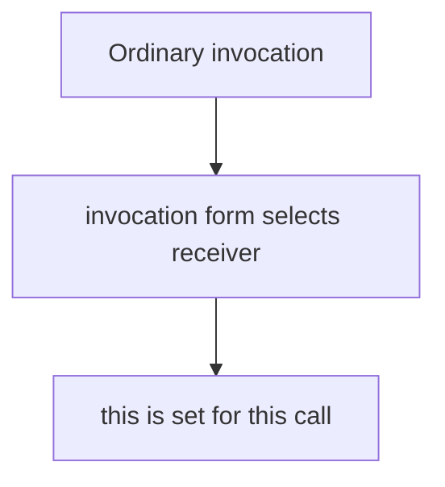

Для обычного вызова `object.method()` объект выполнения обычно выбирается из формы вызова.

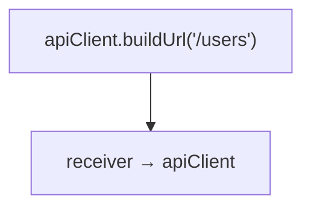

Но detached function теряет объект выполнения:

```javascript
'use strict';

const apiClient = {
  baseUrl: 'https://api.example.test',
  buildUrl: function (path) {
    return this.baseUrl + path;
  }
};

const buildUrl = apiClient.buildUrl;

buildUrl('/users');
```

Здесь вызов идет как standalone function:

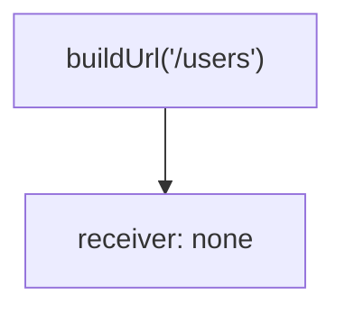

Теперь появляется следующий вопрос:

> Можно ли выбрать объект выполнения вручную?

Да. Для этого существует `call()`.

Главный вопрос главы:

> Кто выбирает объект выполнения теперь?

---

## Предварительные требования

Для этой главы нужно понимать:

* что function object можно хранить в переменной;
* что object может хранить methods;
* что `this` определяется во время invocation;
* что обычный вызов `object.method()` выбирает объект выполнения из формы вызова;
* что detached function теряет объект выполнения;
* что parameters получают arguments по позиции;
* что `return` отправляет результат из функции.

Не требуется знать `apply()`, `bind()`, constructors, classes, `Reflect.apply()`, decorators или proxies. Эти темы будут изучаться позже.

---

## Время изучения

Ориентировочное время:

```text
Чтение главы:            120-150 минут
Разбор схем:             45-65 минут
Запуск примеров:         20-30 минут
Практика:                100-130 минут
Повторение материала:    25 минут
```

Уровень сложности: **L4**.

`call()` выглядит как небольшой method, но концептуально это важный поворот: объект выполнения выбирает не форма обычного вызова, а разработчик.

---

## Навигация

Предыдущая глава:

```text
docs/01-javascript/29-this.md
```

Текущая глава:

```text
docs/01-javascript/30-call.md
```

Следующая глава:

```text
docs/01-javascript/31-apply.md
```

Следующая глава ответит:

> Как передать arguments в ручной invocation, если они уже лежат в array?

---

## Цели обучения

После изучения этой главы вы будете понимать:

* зачем существует `call()`;
* что такое manual объект выполнения selection;
* как `call(объект выполнения)` выбирает `this`;
* как передавать arguments через `call()`;
* как `call()` заменяет ordinary invocation;
* как `call()` помогает в ситуации с detached function;
* как один function object использовать с разными объект выполненияs;
* какие ошибки чаще всего встречаются;
* когда `call()` улучшает читаемость;
* как `call()` может применяться в Automation QA.

---

## Мотивация

Начнем с проблемы, где необходимость явного выбора объект выполнения видна особенно хорошо.

Есть helper object:

```javascript
'use strict';

const apiClient = {
  baseUrl: 'https://api.example.test',
  buildUrl: function (path) {
    return this.baseUrl + path;
  }
};
```

Обычный method call работает:

```javascript
apiClient.buildUrl('/users');
```

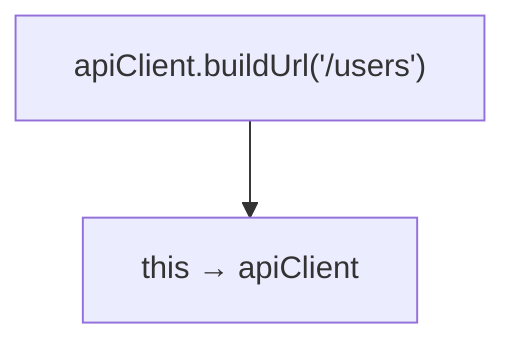

Но если method detached:

```javascript
const buildUrl = apiClient.buildUrl;
```

то обычный вызов теряет объект выполнения:

```javascript
buildUrl('/users');
```

Detached function:

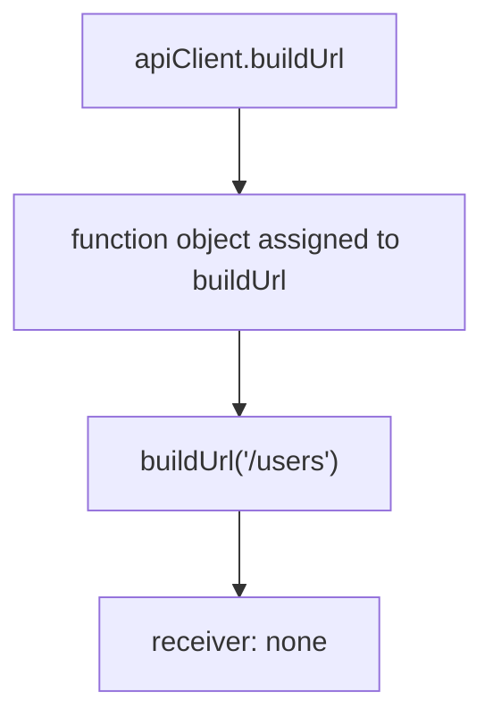

Потерянный объект выполнения:

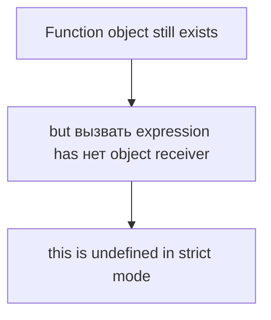

Вопрос:

> Если ordinary invocation не выбрала объект выполнения, можем ли мы выбрать его сами?

`call()` отвечает:

```text
yes
```

Явный выбор объекта выполнения:

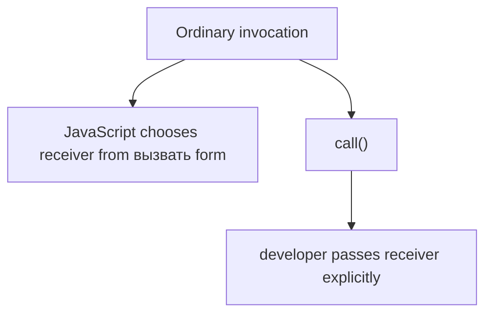

---

## Теория

### Зачем существует call()

`call()` существует для ручного вызова function object с явно указанным объект выполнения.

Обычный вызов:

```javascript
apiClient.buildUrl('/users');
```

Receiver выбирается из обычной формы вызова:

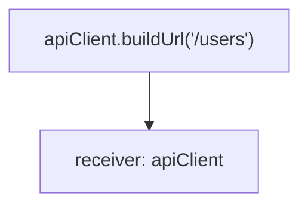

Вызов через `call()`:

```javascript
buildUrl.call(apiClient, '/users');
```

Receiver выбирает разработчик:

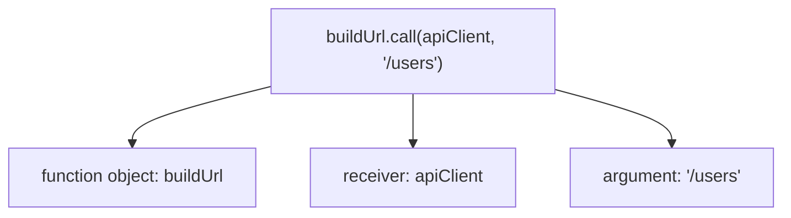

Зачем существует `call()`:

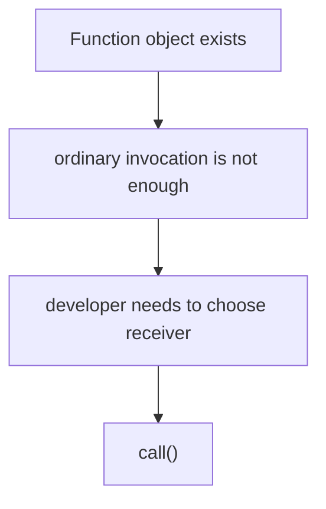

Центральная модель:

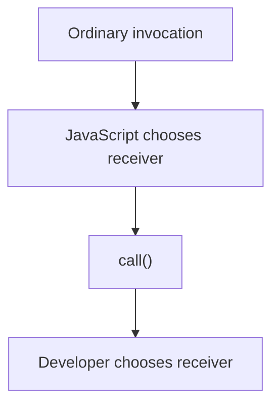

---

### call(объект выполнения)

Минимальная форма:

```javascript
function printBaseUrl() {
  console.log(this.baseUrl);
}

const apiClient = {
  baseUrl: 'https://api.example.test'
};

printBaseUrl.call(apiClient);
```

call() syntax:

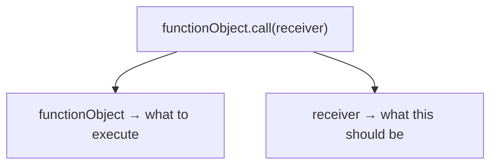

Manual invocation:

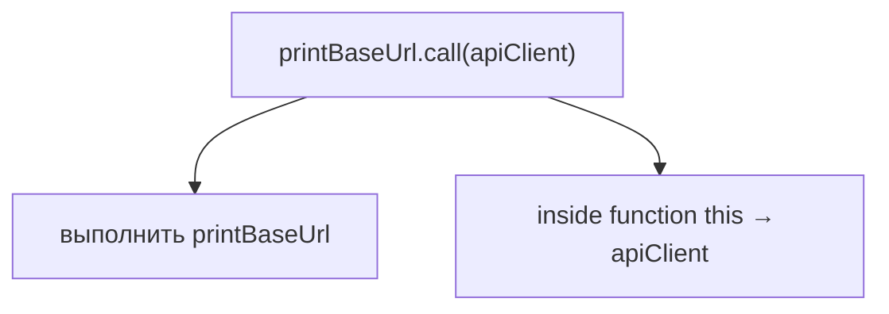

Receiver replacement:

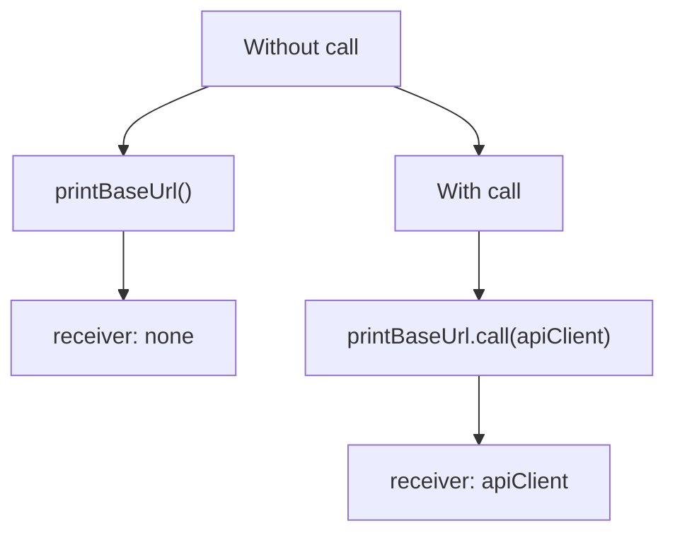

Главный вопрос:

> Кто выбирает объект выполнения теперь?

Ответ:

```text
developer
```

---

### Passing arguments

`call()` выбирает объект выполнения первым argument.

Остальные arguments передаются в вызываемую function.

```javascript
function buildUrl(path) {
  return this.baseUrl + path;
}

const apiClient = {
  baseUrl: 'https://api.example.test'
};

console.log(buildUrl.call(apiClient, '/users'));
```

Передача аргументов:

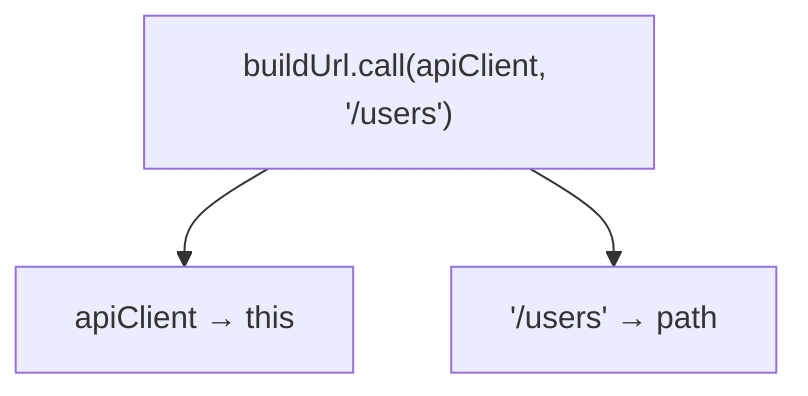

Если parameters несколько:

```javascript
function formatRequest(method, path) {
  return method + ' ' + this.baseUrl + path;
}

const usersApi = {
  baseUrl: 'https://api.example.test'
};

console.log(formatRequest.call(usersApi, 'GET', '/users'));
```

Arguments поток:

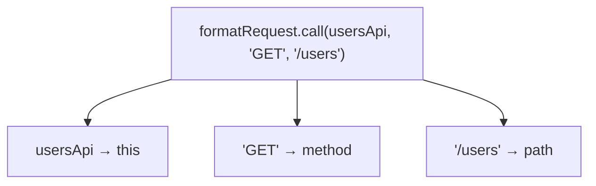

Важно:

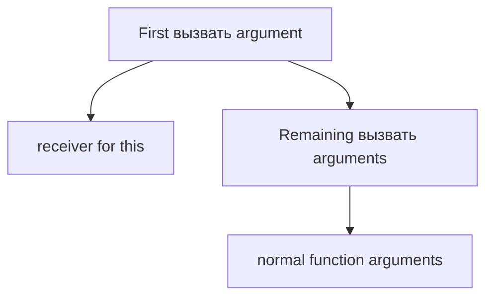

---

### Replacing ordinary invocation

`call()` может выразить тот же объект выполнения, что и обычный method call.

```javascript
apiClient.buildUrl('/users');
```

Можно записать так:

```javascript
apiClient.buildUrl.call(apiClient, '/users');
```

Invocation comparison:

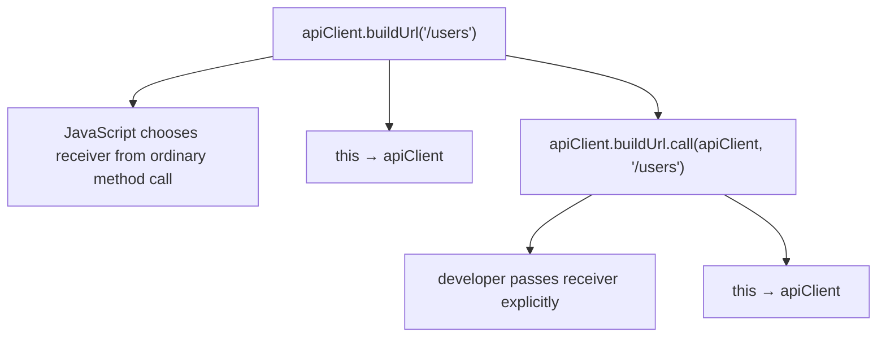

Before call():

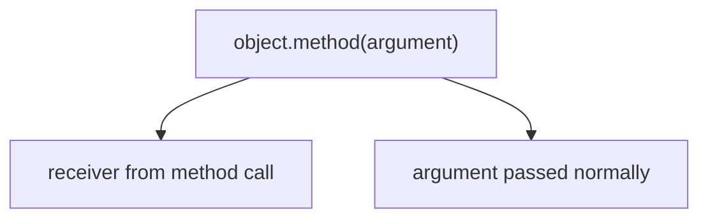

After call():

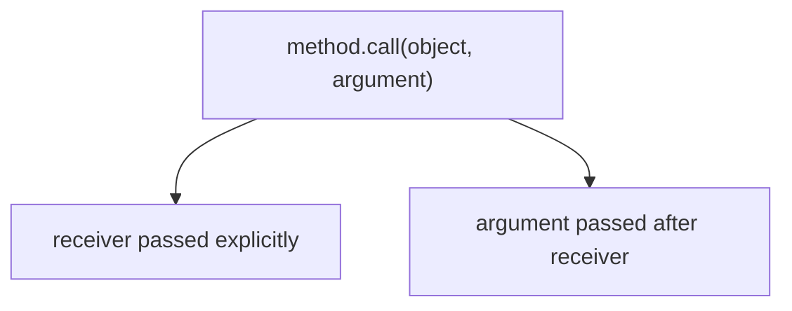

Это не значит, что обычные method calls нужно заменять на `call()`. Обычно `object.method()` читается лучше.

`call()` нужен, когда объект выполнения нужно выбрать явно.

---

### Detached functions

Detached function - один из самых понятных случаев, где `call()` оказывается полезен.

Но важно не сужать модель:

```mermaid
flowchart TD
    N1["call()"]
    N2["general mechanism for explicit receiver selection"]
    N3["detached function"]
    N4["one practical case where this helps"]
    N1 --> N2
    N1 --> N3
    N3 --> N4
```

```javascript
'use strict';

const apiClient = {
  baseUrl: 'https://api.example.test',
  buildUrl: function (path) {
    return this.baseUrl + path;
  }
};

const buildUrl = apiClient.buildUrl;

console.log(buildUrl.call(apiClient, '/users'));
```

Явный выбор объекта выполнения:

```mermaid
flowchart TD
    N1["Detached function"]
    N2["buildUrl"]
    N3["receiver lost in ordinary call"]
    N4["Manual receiver selection"]
    N5["buildUrl.call(apiClient, '/users')"]
    N6["receiver selected explicitly"]
    N1 --> N2
    N2 --> N3
    N1 --> N4
    N4 --> N5
    N5 --> N6
```

Receiver поток:

```mermaid
flowchart TD
    N1["buildUrl"]
    N2["function object"]
    N3["call(apiClient, '/users')"]
    N4["this → apiClient"]
    N5["path → '/users'"]
    N1 --> N2
    N1 --> N3
    N3 --> N4
    N3 --> N5
```

`call()` не приклеивает объект выполнения к функции навсегда.

```mermaid
flowchart TD
    N1["call()"]
    N2["chooses receiver for one invocation"]
    N1 --> N2
```

Следующий вызов может выбрать другой объект выполнения.

---

### Same function, different объект выполнения

Один function object можно вызвать с разными объект выполненияs.

```javascript
function buildUrl(path) {
  return this.baseUrl + path;
}

const usersApi = {
  baseUrl: 'https://users.example.test'
};

const ordersApi = {
  baseUrl: 'https://orders.example.test'
};

console.log(buildUrl.call(usersApi, '/list'));
console.log(buildUrl.call(ordersApi, '/list'));
```

Same function, different объект выполнения:

```mermaid
flowchart TD
    N1["buildUrl.call(usersApi, '/list')"]
    N2["this → usersApi"]
    N3["buildUrl.call(ordersApi, '/list')"]
    N4["this → ordersApi"]
    N1 --> N2
    N1 --> N3
    N3 --> N4
```

Объект функции:

```mermaid
flowchart TD
    N1["buildUrl function object"]
    N2["can be called with usersApi"]
    N3["can be called with ordersApi"]
    N1 --> N2
    N1 --> N3
```

Это особенно полезно, когда поведение общий, а configuration хранится в разных objects.

---

## Внутренний механизм

### Что происходит при call()

В обычном method call объект выполнения выбирается из формы invocation, которую мы изучали в предыдущей главе.

```mermaid
flowchart TD
    N1["apiClient.buildUrl('/users')"]
    N2["ordinary method вызвать selects apiClient"]
    N1 --> N2
```

При `call()` объект выполнения передается явно.

```mermaid
flowchart TD
    N1["buildUrl.call(apiClient, '/users')"]
    N2["вызвать receives apiClient as manual receiver"]
    N1 --> N2
```

call lifecycle:

```mermaid
flowchart TD
    N1["1. Read function object"]
    N2["2. Read вызвать method from function object"]
    N3["3. Pass receiver as first argument"]
    N4["4. Pass normal arguments after receiver"]
    N5["5. Execute original function"]
    N6["6. Inside original function this → receiver"]
    N1 --> N2
    N2 --> N3
    N3 --> N4
    N4 --> N5
    N5 --> N6
```

Execution Context revisit:

```mermaid
flowchart TD
    N1["buildUrl.call(apiClient, '/users')"]
    N2["Function Execution Context for buildUrl"]
    N3["this → apiClient"]
    N4["path → '/users'"]
    N1 --> N2
    N2 --> N3
    N2 --> N4
```

`call()` не меняет function body.

```mermaid
flowchart TD
    N1["тело функции"]
    N2["still says this.baseUrl + path"]
    N3["call()"]
    N4["decides what this is for this invocation"]
    N1 --> N2
    N1 --> N3
    N3 --> N4
```

---

### call() vs ordinary invocation

call vs ordinary invocation:

```mermaid
flowchart TD
    N1["Ordinary invocation"]
    N2["object.method(value)"]
    N3["receiver selected by ordinary вызвать form"]
    N4["arguments passed inside parentheses"]
    N5["call()"]
    N6["method.call(receiver, value)"]
    N7["receiver passed manually"]
    N8["arguments passed after receiver"]
    N1 --> N2
    N1 --> N3
    N1 --> N4
    N1 --> N5
    N5 --> N6
    N5 --> N7
    N5 --> N8
```

Выбор объекта выполнения:

```mermaid
flowchart TD
    N1["object.method()"]
    N2["receiver comes from ordinary method call"]
    N3["function.call(receiver)"]
    N4["receiver comes from developer"]
    N1 --> N2
    N1 --> N3
    N3 --> N4
```

Явный выбор объекта выполнения:

```mermaid
flowchart TD
    N1["Developer"]
    N2["chooses object"]
    N3["passes object into call()"]
    N4["function выполняется with this object as this"]
    N1 --> N2
    N2 --> N3
    N3 --> N4
```

Именно поэтому вопрос главы звучит так:

> Кто выбирает объект выполнения теперь?

---

### Timeline

Временная шкала:

```mermaid
flowchart TD
    N1["T1 Function object exists"]
    N2["T2 Function may be stored in object"]
    N3["T3 Function may become detached"]
    N4["T4 Developer calls functionObject.call(receiver)"]
    N5["T5 call() receives receiver"]
    N6["T6 original function starts выполнение"]
    N7["T7 this inside original function points to receiver"]
    N8["T8 function возвращает result"]
    N1 --> N2
    N2 --> N3
    N3 --> N4
    N4 --> N5
    N5 --> N6
    N6 --> N7
    N7 --> N8
```

Manual invocation временная шкала:

```mermaid
flowchart TD
    N1["detached function"]
    N2["call(receiver)"]
    N3["receiver selected manually"]
    N4["body выполняется"]
    N5["result returned"]
    N1 --> N2
    N2 --> N3
    N3 --> N4
    N4 --> N5
```

Полная модель call():

```mermaid
flowchart TD
    N1["Function object"]
    N2[".call(receiver, arg1, arg2)"]
    N3["receiver becomes this"]
    N4["arg1, arg2 become normal arguments"]
    N5["тело функции выполняется"]
    N1 --> N2
    N2 --> N3
    N3 --> N4
    N4 --> N5
```

---

## Ментальная модель

### Ручное управление

Обычный вызов похож на автоматический выбор объект выполнения.

```mermaid
flowchart TD
    N1["object.method()"]
    N2["JavaScript reads ordinary вызвать form"]
    N3["selects receiver"]
    N1 --> N2
    N2 --> N3
```

`call()` похож на manual steering.

```mermaid
flowchart TD
    N1["function.call(receiver)"]
    N2["developer manually steers this"]
    N1 --> N2
```

Manual steering:

```mermaid
flowchart TD
    N1["Steering wheel"]
    N2["developer chooses direction"]
    N3["call()"]
    N4["developer chooses receiver"]
    N1 --> N2
    N1 --> N3
    N3 --> N4
```

---

### Remote control

Представьте function object как устройство, а объект выполнения как выбранный target.

```mermaid
flowchart TD
    N1["Remote control"]
    N2["function to run"]
    N3["target object"]
    N1 --> N2
    N1 --> N3
```

`call()` говорит:

```mermaid
flowchart TD
    N1["Run this function"]
    N2["as if this object is the current receiver"]
    N1 --> N2
```

Remote control model:

```mermaid
flowchart TD
    N1["functionObject.call(receiver)"]
    N2["functionObject → command"]
    N3["receiver → target"]
    N1 --> N2
    N1 --> N3
```

---

### Selecting a speaker

В главе про `this` была модель current speaker.

`call()` выбирает speaker вручную.

```mermaid
flowchart TD
    N1["printName.call(user)"]
    N2["speaker: user"]
    N3["printName.call(admin)"]
    N4["speaker: admin"]
    N1 --> N2
    N1 --> N3
    N3 --> N4
```

Choosing an actor:

```mermaid
flowchart TD
    N1["Same script"]
    N2["different actor"]
    N3["different this"]
    N1 --> N2
    N2 --> N3
```

Function body - это script.

Receiver - это actor, который исполняет script в данном вызове.

---

### Краткая ментальная модель

```mermaid
flowchart TD
    N1["call()"]
    N2["does not создать a new function"]
    N3["does not permanently bind receiver"]
    N4["invokes function immediately"]
    N5["sets this for this one invocation"]
    N1 --> N2
    N1 --> N3
    N1 --> N4
    N1 --> N5
```

Итоговая схема:

```mermaid
flowchart TD
    N1["function object"]
    N2["call(receiver, ...arguments)"]
    N3["this → receiver"]
    N4["parameters receive arguments"]
    N5["function выполняется"]
    N1 --> N2
    N2 --> N3
    N3 --> N4
    N4 --> N5
```

---

### Текущее место в модели JavaScript

```mermaid
flowchart TD
    N1["Functions"]
    N2["Function Declaration"]
    N3["Function Expression"]
    N4["Arrow Functions"]
    N5["Parameters"]
    N6["Return"]
    N7["Rest"]
    N8["Spread"]
    N9["Closures"]
    N10["this"]
    N11["call()"]
    N12["manual receiver selection"]
    N1 --> N2
    N1 --> N3
    N1 --> N4
    N1 --> N5
    N1 --> N6
    N1 --> N7
    N1 --> N8
    N1 --> N9
    N1 --> N10
    N1 --> N11
    N11 --> N12
```

Переход к apply():

```mermaid
flowchart TD
    N1["call()"]
    N2["receiver + arguments one by one"]
    N3["apply()"]
    N4["receiver + arguments as array-like collection"]
    N1 --> N2
    N1 --> N3
    N3 --> N4
```

`apply()` решает похожую задачу, но с другой формой передачи arguments. Подробности будут в следующей главе.

---

## Примеры кода

Примеры находятся в папке:

```text
examples/01-javascript/chapter-30/
```

Запуск:

```bash
node examples/01-javascript/chapter-30/01-basic-call.js
node examples/01-javascript/chapter-30/02-detached-method.js
node examples/01-javascript/chapter-30/03-call-with-arguments.js
node examples/01-javascript/chapter-30/04-reusing-methods.js
node examples/01-javascript/chapter-30/05-common-mistakes.js
node examples/01-javascript/chapter-30/06-qa-example.js
```

### Basic call

```javascript
function printBaseUrl() {
  console.log(this.baseUrl);
}

const apiClient = {
  baseUrl: 'https://api.example.test'
};

printBaseUrl.call(apiClient);
```

Что происходит:

```mermaid
flowchart TD
    N1["printBaseUrl.call(apiClient)"]
    N2["receiver: apiClient"]
    N3["this.baseUrl → apiClient.baseUrl"]
    N1 --> N2
    N1 --> N3
```

---

### Detached method

```javascript
'use strict';

const apiClient = {
  baseUrl: 'https://api.example.test',
  buildUrl: function (path) {
    return this.baseUrl + path;
  }
};

const buildUrl = apiClient.buildUrl;

console.log(buildUrl.call(apiClient, '/users'));
```

Явный выбор объекта выполнения:

```mermaid
flowchart TD
    N1["buildUrl"]
    N2["detached function object"]
    N3["buildUrl.call(apiClient, '/users')"]
    N4["receiver selected manually"]
    N1 --> N2
    N1 --> N3
    N3 --> N4
```

---

### call with arguments

```javascript
function formatRequest(method, path) {
  return method + ' ' + this.baseUrl + path;
}

const apiClient = {
  baseUrl: 'https://api.example.test'
};

console.log(formatRequest.call(apiClient, 'GET', '/users'));
```

Передача аргументов:

```mermaid
flowchart TD
    N1["formatRequest.call(apiClient, 'GET', '/users')"]
    N2["apiClient → this"]
    N3["'GET' → method"]
    N4["'/users' → path"]
    N1 --> N2
    N1 --> N3
    N1 --> N4
```

---

## Частые вопросы

### call() создает новую функцию?

Нет. `call()` сразу вызывает existing function object.

```mermaid
flowchart TD
    N1["call()"]
    N2["invokes immediately"]
    N1 --> N2
```

`bind()` будет изучаться позже. Он решает связанную, но другую задачу.

### call() меняет this навсегда?

Нет. `call()` выбирает объект выполнения только для одного invocation.

```mermaid
flowchart TD
    N1["first call()"]
    N2["receiver A"]
    N3["second call()"]
    N4["receiver B"]
    N1 --> N2
    N1 --> N3
    N3 --> N4
```

### Первый argument call() становится обычным parameter?

Нет. Первый argument `call()` становится `this`.

Обычные parameters получают arguments, которые идут после объект выполнения.

### Нужно ли заменять все method calls на call()?

Нет. Если обычный `object.method()` читается ясно, он обычно лучше. `call()` нужен, когда объект выполнения надо выбрать явно.

### Чем call() отличается от apply()?

Обе темы связаны с ручным объект выполнения. В этой главе изучается `call()`, где arguments передаются по одному. `apply()` будет изучаться в следующей главе.

---

## Распространенные мифы

### Миф 1. call() нужен только для исправления ошибок

Реальность: `call()` является общим механизмом явного выбора объект выполнения. Detached function - один из случаев, где этот механизм особенно заметен.

### Миф 2. call() permanently привязывает this

Реальность:

```mermaid
flowchart TD
    N1["call()"]
    N2["one invocation only"]
    N1 --> N2
```

Постоянное связывание объект выполнения будет изучаться позже в главе `bind()`.

### Миф 3. call() и apply() - одно и то же

Реальность: они решают похожие задачи, но отличаются способом передачи arguments. Подробно `apply()` будет изучен в следующей главе.

---

## Типичные ошибки

### Ошибка 1. Забыть первый argument объект выполнения

Неправильный код:

```javascript
function buildUrl(path) {
  return this.baseUrl + path;
}

const apiClient = {
  baseUrl: 'https://api.example.test'
};

buildUrl.call('/users');
```

Что произошло:

```mermaid
flowchart TD
    N1["buildUrl.call('/users')"]
    N2["'/users' becomes this"]
    N1 --> N2
```

Почему это произошло:

```mermaid
flowchart TD
    N1["first argument of call()"]
    N2["receiver"]
    N1 --> N2
```

Исправленный вариант:

```javascript
buildUrl.call(apiClient, '/users');
```

---

### Ошибка 2. Думать, что call() сохраняет объект выполнения навсегда

```javascript
function getBaseUrl() {
  return this.baseUrl;
}

const apiClient = {
  baseUrl: 'https://api.example.test'
};

getBaseUrl.call(apiClient);
getBaseUrl();
```

Первый вызов выбирает объект выполнения manually.

Второй вызов снова standalone.

```mermaid
flowchart TD
    N1["getBaseUrl.call(apiClient)"]
    N2["this → apiClient"]
    N3["getBaseUrl()"]
    N4["receiver: none"]
    N1 --> N2
    N1 --> N3
    N3 --> N4
```

---

### Ошибка 3. Путать объект выполнения и normal arguments

```javascript
function validateStatus(response) {
  return response.status === this.expectedStatus;
}

const assertionConfig = {
  expectedStatus: 200
};

const response = {
  status: 200
};

validateStatus.call(response, assertionConfig);
```

Что произошло:

```mermaid
flowchart TD
    N1["response → this"]
    N2["assertionConfig → response parameter"]
    N1 --> N2
```

Исправленный вариант:

```javascript
validateStatus.call(assertionConfig, response);
```

Типичные ошибки:

```mermaid
flowchart TD
    N1["call(receiver, arg1)"]
    N2["receiver → this"]
    N3["arg1 → first parameter"]
    N1 --> N2
    N1 --> N3
```

---

## Практическое использование

`call()` полезен, когда function object уже есть, но объект выполнения нужно выбрать явно.

Практическое использование:

```mermaid
flowchart TD
    N1["shared function"]
    N2["different configuration objects"]
    N3["call(configObject, data)"]
    N4["same behavior, different receiver"]
    N1 --> N2
    N2 --> N3
    N3 --> N4
```

Пример:

```javascript
function validateStatus(response) {
  return response.status === this.expectedStatus;
}

const okAssertion = {
  expectedStatus: 200
};

const createdAssertion = {
  expectedStatus: 201
};

console.log(validateStatus.call(okAssertion, { status: 200 }));
console.log(validateStatus.call(createdAssertion, { status: 200 }));
```

Читаемость:

```mermaid
flowchart TD
    N1["Use call()"]
    N2["when manual receiver is the main idea"]
    N3["Avoid call()"]
    N4["when ordinary method вызвать is clearer"]
    N1 --> N2
    N1 --> N3
    N3 --> N4
```

`call()` должен улучшать понимание механизма, а не превращать код в головоломку.

---

## Использование в Automation QA

### Reusable assertion helpers

Один validator можно использовать с разными assertion configs.

```javascript
function statusMatches(response) {
  return response.status === this.expectedStatus;
}

const okConfig = {
  expectedStatus: 200
};

const serverErrorConfig = {
  expectedStatus: 500
};
```

Пример QA-helper:

```mermaid
flowchart TD
    N1["statusMatches.call(okConfig, response)"]
    N2["this → okConfig"]
    N3["response → response"]
    N4["statusMatches.call(serverErrorConfig, response)"]
    N5["this → serverErrorConfig"]
    N6["response → response"]
    N1 --> N2
    N1 --> N3
    N1 --> N4
    N4 --> N5
    N4 --> N6
```

---

### API client methods

Если API client method оказался detached, `call()` позволяет явно выбрать нужный config object как объект выполнения.

```mermaid
flowchart TD
    N1["buildUrl.call(stagingClient, '/users')"]
    N2["this.baseUrl → stagingClient.baseUrl"]
    N1 --> N2
```

Это полезно для понимания механизма, хотя в обычном production-коде чаще читается прямой method call:

```text
stagingClient.buildUrl('/users')
```

---

### Helper reuse

`call()` может помочь переиспользовать общий helper с разными configuration objects.

```mermaid
flowchart TD
    N1["shared validator"]
    N2["config A via call()"]
    N3["config B via call()"]
    N1 --> N2
    N1 --> N3
```

Для Automation QA это может встречаться в:

* reusable assertion helpers;
* API client utilities;
* configuration objects;
* shared validators;
* debugging detached methods.

При этом главное назначение `call()` шире:

```mermaid
flowchart TD
    N1["call()"]
    N2["explicit receiver selection"]
    N3["detached methods"]
    N4["shared validators"]
    N5["reusable helper functions"]
    N1 --> N2
    N2 --> N3
    N2 --> N4
    N2 --> N5
```

Важно: не строить всю архитектуру вокруг `call()` без причины. В большинстве случаев ясные objects и methods читаются лучше.

---

## Практика

Практика находится в файле:

```text
practice/01-javascript/30-call.md
```

Выполняйте задания после запуска примеров из `examples/01-javascript/chapter-30/`.

Главный вопрос практики:

```text
Who chooses the receiver?
```

---

## Решения

Файл с решениями:

```text
solutions/01-javascript/30-call.md
```

В решениях важно смотреть не только на результат, но и на объект выполнения поток:

```mermaid
flowchart TD
    N1["call(receiver, arg1, arg2)"]
    N2["receiver → this"]
    N3["arg1 → first parameter"]
    N4["arg2 → second parameter"]
    N1 --> N2
    N1 --> N3
    N1 --> N4
```

---

## Итоги

`call()` вводит ручной выбор объект выполнения.

Итоговая модель:

```mermaid
flowchart TD
    N1["Ordinary invocation"]
    N2["JavaScript chooses receiver from ordinary invocation form"]
    N3["call()"]
    N4["Developer chooses receiver explicitly"]
    N1 --> N2
    N2 --> N3
    N3 --> N4
```

Полная модель call():

```mermaid
flowchart TD
    N1["functionObject.call(receiver, arg1, arg2)"]
    N2["functionObject → function to execute"]
    N3["receiver → this"]
    N4["arg1 → first parameter"]
    N5["arg2 → second parameter"]
    N1 --> N2
    N1 --> N3
    N1 --> N4
    N1 --> N5
```

`call()` вызывает function immediately и выбирает объект выполнения только для этого invocation.

Следующая глава про `apply()` покажет похожую идею, но arguments будут передаваться иначе.

---

## Что нужно запомнить

* `call()` вызывает function object immediately.
* Первый argument `call()` становится `this`.
* Остальные arguments передаются в function parameters.
* `call()` выбирает объект выполнения только для одного invocation.
* `call()` помогает в ситуации с detached function, но не сводится к ней.
* `call()` не заменяет обычные method calls там, где `object.method()` читается лучше.
* `apply()` будет изучаться в следующей главе и продолжит тему manual объект выполнения selection.

Краткая ментальная модель:

```mermaid
flowchart TD
    N1["call()"]
    N2["manual receiver"]
    N3["immediate invocation"]
    N4["arguments one by one"]
    N1 --> N2
    N1 --> N3
    N1 --> N4
```

---

## Проверьте себя

Ответьте без запуска кода:

1. Кто выбирает объект выполнения при ordinary invocation?
2. Кто выбирает объект выполнения при `call()`?
3. Что становится `this` в `buildUrl.call(apiClient, '/users')`?
4. Что получает parameter `path` в `buildUrl.call(apiClient, '/users')`?
5. Почему `call()` не сохраняет объект выполнения навсегда?
6. Почему `apply()` логически продолжает эту тему?
