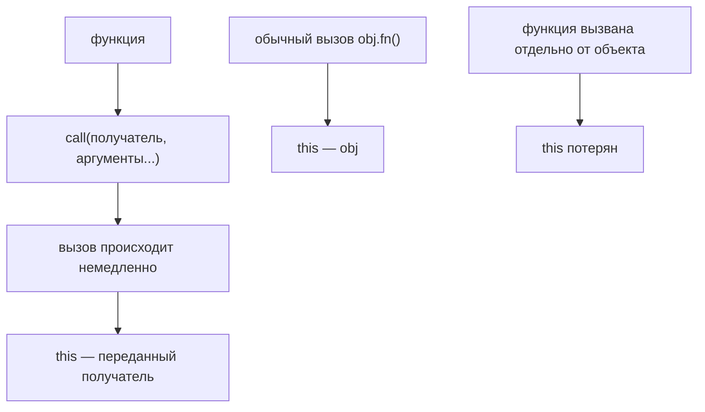

# Метод `call()`

## Связь с предыдущей главой

Предыдущая глава объяснила `this`.

Главная модель была такой: значение `this` определяется формой вызова, а не местом объявления функции.

Для обычного вызова `object.method()` объект выполнения обычно выбирается из формы вызова.

Но detached function теряет объект выполнения:

```javascript
'use strict';

const apiClient = {
  baseUrl: 'https://api.example.test',
  buildUrl: function (path) {
    return this.baseUrl + path;
  }
};

const buildUrl = apiClient.buildUrl;

buildUrl('/users');
```

Здесь вызов идет как standalone function:

Теперь появляется следующий вопрос:

> Можно ли выбрать объект выполнения вручную?

Да. Для этого существует `call()`.

Главный вопрос главы:

> Кто выбирает объект выполнения теперь?

---

## Предварительные требования

Для этой главы нужно понимать:

* что function object можно хранить в переменной;
* что object может хранить methods;
* что `this` определяется во время invocation;
* что обычный вызов `object.method()` выбирает объект выполнения из формы вызова;
* что detached function теряет объект выполнения;
* что parameters получают arguments по позиции;
* что `return` отправляет результат из функции.

Не требуется знать `apply()`, `bind()`, constructors, classes, `Reflect.apply()`, decorators или proxies. Эти темы будут изучаться позже.

---

## Время изучения

Ориентировочное время:

```text
Чтение главы:            120-150 минут
Разбор схем:             45-65 минут
Запуск примеров:         20-30 минут
Практика:                100-130 минут
Повторение материала:    25 минут
```

Уровень сложности: **L4**.

`call()` выглядит как небольшой method, но концептуально это важный поворот: объект выполнения выбирает не форма обычного вызова, а разработчик.

---

## Навигация

Предыдущая глава:

```text
docs/01-javascript/29-this.md
```

Текущая глава:

```text
docs/01-javascript/30-call.md
```

Следующая глава:

```text
docs/01-javascript/31-apply.md
```

Следующая глава ответит:

> Как передать arguments в ручной invocation, если они уже лежат в array?

---

## Цели обучения

После изучения этой главы вы будете понимать:

* зачем существует `call()`;
* что такое manual объект выполнения selection;
* как `call(объект выполнения)` выбирает `this`;
* как передавать arguments через `call()`;
* как `call()` заменяет ordinary invocation;
* как `call()` помогает в ситуации с detached function;
* как один function object использовать с разными объект выполненияs;
* какие ошибки чаще всего встречаются;
* когда `call()` улучшает читаемость;
* как `call()` может применяться в Automation QA.

---

## Мотивация

Начнем с проблемы, где необходимость явного выбора объект выполнения видна особенно хорошо.

Есть helper object:

```javascript
'use strict';

const apiClient = {
  baseUrl: 'https://api.example.test',
  buildUrl: function (path) {
    return this.baseUrl + path;
  }
};
```

Обычный method call работает:

```javascript
apiClient.buildUrl('/users');
```

Но если method detached:

```javascript
const buildUrl = apiClient.buildUrl;
```

то обычный вызов теряет объект выполнения:

```javascript
buildUrl('/users');
```

Detached function:

Потерянный объект выполнения:

Вопрос:

> Если ordinary invocation не выбрала объект выполнения, можем ли мы выбрать его сами?

`call()` отвечает:

```text
yes
```

Явный выбор объекта выполнения:

---

## Теория

### Зачем существует `call()`

`call()` существует для ручного вызова объекта функции с явно указанным объектом выполнения.

Обычный вызов:

```javascript
apiClient.buildUrl('/users');
```

Здесь объект выполнения выбрала форма записи: слева от точки стоит
`apiClient`, значит `this` — это он.

Вызов через `call()`:

```javascript
buildUrl.call(apiClient, '/users');
```

Объект выполнения здесь выбирает не форма записи вызова, а разработчик.

```text
buildUrl('/users')              →  this определяется способом вызова
buildUrl.call(apiClient, '/users')  →  this задан явно
```

`call()` существует ровно для этого: он отделяет «какую функцию вызвать» от
«с каким объектом выполнения». До него оба решения принимались одной строкой
вызова, и оторванный метод терял свой объект.

---

### `call(объектВыполнения)`

Минимальная форма:

```javascript
function printBaseUrl() {
  console.log(this.baseUrl);
}

const apiClient = {
  baseUrl: 'https://api.example.test'
};

printBaseUrl.call(apiClient);
```

Разбор записи:

```text
printBaseUrl . call ( apiClient )
└──────────┘   └──┘   └───────┘
  функция      метод   объект выполнения
```

`call()` — метод, который есть у любой функции. Он вызывает эту функцию
немедленно и подставляет первый аргумент в качестве `this`.

Функция при этом не меняется: `printBaseUrl` остаётся той же функцией, а
`apiClient` получателем становится только на время одного вызова.

Главный вопрос:

> Кто выбирает объект выполнения теперь?

Ответ:

```text
developer
```

---

### Передача аргументов

`call()` выбирает объект выполнения первым аргументом.

Остальные аргументы передаются в вызываемую функцию.

```javascript
function buildUrl(path) {
  return this.baseUrl + path;
}

const apiClient = {
  baseUrl: 'https://api.example.test'
};

console.log(buildUrl.call(apiClient, '/users'));
```

Здесь `apiClient` стал объектом выполнения, а `'/users'` попал в параметр
`path`.

Если параметров несколько:

```javascript
function formatRequest(method, path) {
  return method + ' ' + this.baseUrl + path;
}

const usersApi = {
  baseUrl: 'https://api.example.test'
};

console.log(formatRequest.call(usersApi, 'GET', '/users'));
```

```text
formatRequest.call(usersApi, 'GET', '/users')
                   └──────┘  └───────────────┘
                     this      обычные аргументы
```

Важно: первый аргумент `call()` в параметры функции **не попадает**. Параметр
`method` получает второй аргумент, `path` — третий. Сдвиг на одну позицию —
самая частая ошибка при переходе с обычного вызова.

---

### Замена обычного вызова

`call()` может задать тот же объект выполнения, что и обычный вызов метода.

```javascript
apiClient.buildUrl('/users');
```

Можно записать так:

```javascript
apiClient.buildUrl.call(apiClient, '/users');
```

Сравнение форм вызова:

| Запись | Кто выбрал объект выполнения |
| --- | --- |
| `apiClient.buildUrl('/users')` | форма вызова: то, что слева от точки |
| `apiClient.buildUrl.call(apiClient, '/users')` | разработчик, явно |

Результат одинаковый, различается источник решения.

Это не значит, что обычные вызовы методов нужно заменять на `call()`. Обычно `object.method()` читается лучше.

`call()` нужен, когда объект выполнения нужно выбрать явно.

---

### Оторванные функции

Оторванная функция — один из самых понятных случаев, где `call()` оказывается полезен.

Но важно не сужать модель:

```javascript
'use strict';

const apiClient = {
  baseUrl: 'https://api.example.test',
  buildUrl: function (path) {
    return this.baseUrl + path;
  }
};

const buildUrl = apiClient.buildUrl;

console.log(buildUrl.call(apiClient, '/users'));
```

Переменная `buildUrl` хранит саму функцию — без объекта. Обычный вызов
`buildUrl('/users')` в строгом режиме дал бы `this === undefined` и ошибку
чтения свойства. `call()` возвращает потерянного получателя явно.

Поток объекта выполнения:

```text
apiClient.buildUrl   →  функция скопирована в переменную, объект остался позади
buildUrl('/users')   →  this === undefined
buildUrl.call(apiClient, '/users')  →  this === apiClient
```

`call()` не приклеивает объект выполнения к функции навсегда.

Следующий вызов может выбрать другой объект выполнения.

---

### Одна функция, разные объекты выполнения

Один объект функции можно вызвать с разными объектами выполнения.

```javascript
function buildUrl(path) {
  return this.baseUrl + path;
}

const usersApi = {
  baseUrl: 'https://users.example.test'
};

const ordersApi = {
  baseUrl: 'https://orders.example.test'
};

console.log(buildUrl.call(usersApi, '/list'));
console.log(buildUrl.call(ordersApi, '/list'));
```

Вывод показывает два разных адреса, хотя функция одна:

```text
https://users.example.test/list
https://orders.example.test/list
```

Объект функции при этом создан один раз и не хранит ни `usersApi`, ни
`ordersApi`. Получатель приходит аргументом на каждый вызов.

Это особенно полезно, когда поведение общее, а настройка хранится в разных объектах.

---

`call()` выбирает получателя и вызывает сразу:


```mermaid
flowchart TD
    A["функция"] --> B["call(получатель, аргументы...)"]
    B --> C["вызов происходит немедленно"]
    C --> D["this — переданный получатель"]
    E["обычный вызов obj.fn()"] --> F["this — obj"]
    G["функция вызвана отдельно от объекта"] --> H["this потерян"]
```

## Внутренний механизм

### Что происходит при `call()`

В обычном вызове метода объект выполнения выбирается из формы вызова, которую мы изучали в предыдущей главе.

При `call()` объект выполнения передается явно.

Время жизни `call()`:

```text
до вызова    функция не связана ни с каким объектом
во время     создан контекст выполнения, в нём this = первый аргумент
после        контекст снят, связь исчезла
```

Иначе говоря, `call()` действует ровно на один вызов. Никакого состояния в
функции он не оставляет — следующий вызов снова решает вопрос получателя с нуля.

`call()` не меняет тело функции.

---

### `call()` и обычный вызов

| | обычный вызов | `call()` |
| --- | --- | --- |
| кто выбирает `this` | форма записи вызова | первый аргумент |
| когда выполняется | сразу | сразу |
| что происходит с функцией | ничего | ничего |
| работает с оторванной функцией | нет | да |

Строки «когда выполняется» и «что происходит с функцией» совпадают намеренно:
`call()` отличается от обычного вызова ровно одним — источником решения о
получателе. Отложенный вызов и запоминание получателя — это уже `bind()` из
главы 32.

Именно поэтому вопрос главы звучит так:

> Кто выбирает объект выполнения теперь?

---

### Временная шкала

```text
объявление  │ функция существует, this не определён
call()      │ выбран объект выполнения и переданы аргументы
выполнение  │ тело читает this и параметры
возврат     │ контекст снят, выбор объекта не сохраняется
```

Привязка действует один вызов. Чтобы закрепить объект выполнения надолго,
нужен `bind()` — он появится через две главы.

---

## Ментальная модель

### Ручное управление

Обычный вызов похож на автоматический выбор объект выполнения.

`call()` похож на ручное управление: маршрут задаёт не устройство, а водитель.

```text
обычный вызов  │ объект выполнения выбирает форма записи
call()         │ объект выполнения выбирает вызывающий код
```

---

### Пульт управления

Представьте объект функции как устройство, а объект выполнения как выбранную цель.

`call()` говорит: «выполни это действие, направив его вот на этот объект».

```text
пульт:      buildUrl
цель:       apiClient
команда:    buildUrl.call(apiClient, '/users')
```

Устройство одно, целей может быть много. Именно поэтому одна и та же функция
работает с разными клиентами API без копирования.

---

### Выбор говорящего

В главе про `this` была модель текущего говорящего.

`call()` выбирает говорящего вручную.

Выбор актёра:

Тело функции — это сценарий.

Объект выполнения — актёр, который исполняет сценарий в данном вызове.

---

### Краткая ментальная модель

`call()` — это обычный вызов, у которого первый аргумент отвечает на вопрос
«кто здесь `this`», а остальные идут в параметры как всегда.

---

### Текущее место в модели JavaScript

Переход к `apply()`:

`apply()` решает похожую задачу, но с другой формой передачи аргументов. Подробности будут в следующей главе.

---

## Примеры кода

Примеры находятся в папке:

```text
examples/01-javascript/chapter-30/
```

Запуск:

```bash
node examples/01-javascript/chapter-30/01-basic-call.js
node examples/01-javascript/chapter-30/02-detached-method.js
node examples/01-javascript/chapter-30/03-call-with-arguments.js
node examples/01-javascript/chapter-30/04-reusing-methods.js
node examples/01-javascript/chapter-30/05-common-mistakes.js
node examples/01-javascript/chapter-30/06-qa-example.js
```

### Простой вызов

```javascript
function printBaseUrl() {
  console.log(this.baseUrl);
}

const apiClient = {
  baseUrl: 'https://api.example.test'
};

printBaseUrl.call(apiClient);
```

Функция объявлена вне объекта и своего `this` не имеет. `call()` подставляет
`apiClient`, и `this.baseUrl` читается. Без `call()` тот же вызов дал бы
`undefined` либо ошибку в строгом режиме.

---

### Оторванный метод

```javascript
'use strict';

const apiClient = {
  baseUrl: 'https://api.example.test',
  buildUrl: function (path) {
    return this.baseUrl + path;
  }
};

const buildUrl = apiClient.buildUrl;

console.log(buildUrl.call(apiClient, '/users'));
```

Здесь видны оба решения сразу: объект выполнения — `apiClient`, аргумент
параметра `path` — `'/users'`. Прочитать такую строку можно, не заглядывая
в объявление функции.

---

### `call()` с аргументами

```javascript
function formatRequest(method, path) {
  return method + ' ' + this.baseUrl + path;
}

const apiClient = {
  baseUrl: 'https://api.example.test'
};

console.log(formatRequest.call(apiClient, 'GET', '/users'));
```

Аргументы перечисляются после объекта выполнения, в обычном порядке
параметров. Этим `call()` и отличается от `apply()`: там те же значения
передаются одним массивом.

---

## Частые вопросы

### `call()` создаёт новую функцию?

Нет. `call()` сразу вызывает существующий объект функции.

`bind()` будет изучаться позже. Он решает связанную, но другую задачу.

### `call()` меняет `this` навсегда?

Нет. `call()` выбирает объект выполнения только для одного вызова.

### Первый аргумент `call()` становится обычным параметром?

Нет. Первый аргумент `call()` становится значением `this`.

Обычные параметры получают аргументы, которые идут после объекта выполнения.

### Нужно ли заменять все вызовы методов на `call()`?

Нет. Если обычный `object.method()` читается ясно, он обычно лучше. `call()` нужен, когда объект выполнения надо выбрать явно.

### Чем `call()` отличается от `apply()`?

Обе темы связаны с ручным выбором объекта выполнения. В этой главе изучается `call()`, где аргументы передаются по одному. `apply()` будет изучаться в следующей главе.

---

## Распространённые мифы

### Миф 1. `call()` нужен только для исправления ошибок

Реальность: `call()` — общий механизм явного выбора объекта выполнения. Оторванная функция — один из случаев, где этот механизм особенно заметен.

### Миф 2. `call()` привязывает `this` навсегда

Реальность:

Постоянное связывание объект выполнения будет изучаться позже в главе `bind()`.

### Миф 3. `call()` и `apply()` — одно и то же

Реальность: они решают похожие задачи, но отличаются способом передачи аргументов. Подробно `apply()` будет изучен в следующей главе.

---

## Распространённые ошибки

### Ошибка 1. Забыть первый аргумент — объект выполнения

Неправильный код:

```javascript
function buildUrl(path) {
  return this.baseUrl + path;
}

const apiClient = {
  baseUrl: 'https://api.example.test'
};

buildUrl.call('/users');
```

Что произошло: строка `'/users'` стала объектом выполнения, а параметр `path`
не получил ничего.

```text
buildUrl.call('/users')
              └──────┘
                this        path === undefined
результат: '/users'.baseUrl + undefined  →  'undefined' + 'undefined'
```

Почему это произошло: первый аргумент `call()` — всегда получатель. Он не
попадает в параметры, каким бы по смыслу ни был.

Исправленный вариант:

```javascript
buildUrl.call(apiClient, '/users');
```

---

### Ошибка 2. Думать, что `call()` сохраняет объект выполнения навсегда

```javascript
function getBaseUrl() {
  return this.baseUrl;
}

const apiClient = {
  baseUrl: 'https://api.example.test'
};

getBaseUrl.call(apiClient);
getBaseUrl();
```

Первый вызов выбирает объект выполнения вручную.

Второй вызов снова идёт без объекта.

---

### Ошибка 3. Путать объект выполнения и обычные аргументы

```javascript
function validateStatus(response) {
  return response.status === this.expectedStatus;
}

const assertionConfig = {
  expectedStatus: 200
};

const response = {
  status: 200
};

validateStatus.call(response, assertionConfig);
```

Что произошло: получателем стал `response`, поэтому `this.expectedStatus` —
`undefined`. А в параметр `response` попал объект настроек, и сравнение
превратилось в `undefined === undefined`.

```text
ожидалось:  this = assertionConfig, response = response
получилось: this = response,        response = assertionConfig
результат:  true — но проверка ничего не проверила
```

Опасность именно в этом: перепутанный порядок не даёт ошибки, а даёт
неверный `true`.

Исправленный вариант:

```javascript
validateStatus.call(assertionConfig, response);
```

Типичные ошибки в этом месте две. Первая — передать настройки вторым
аргументом, оставив первый пустым: тогда `this` останется прежним, а параметр
получит не то значение. Вторая — вызвать `validateStatus(response)` напрямую и
получить `undefined` при чтении `this.expectedStatus`.

---

## Практическое использование

`call()` полезен, когда объект функции уже есть, но объект выполнения нужно выбрать явно.

Где это встречается на практике:

* одна функция проверки применяется к нескольким наборам настроек;
* метод одного объекта нужно применить к похожему объекту без наследования;
* функция получена как значение (из массива, из параметра) и потеряла получателя;
* нужно вызвать метод-предок с текущим получателем.

Пример:

```javascript
function validateStatus(response) {
  return response.status === this.expectedStatus;
}

const okAssertion = {
  expectedStatus: 200
};

const createdAssertion = {
  expectedStatus: 201
};

console.log(validateStatus.call(okAssertion, { status: 200 }));
console.log(validateStatus.call(createdAssertion, { status: 200 }));
```

Читаемость:

`call()` должен улучшать понимание механизма, а не превращать код в головоломку.

---

## Использование в Automation QA

### Переиспользуемые вспомогательные проверки

Одну проверку можно использовать с разными настройками.

```javascript
function statusMatches(response) {
  return response.status === this.expectedStatus;
}

const okConfig = {
  expectedStatus: 200
};

const serverErrorConfig = {
  expectedStatus: 500
};
```

```javascript
function matchesExpectation(response) {
  return response.status === this.expectedStatus;
}

console.log(matchesExpectation.call(okConfig, { status: 200 }));
console.log(matchesExpectation.call(serverErrorConfig, { status: 200 }));
```

Одна проверка обслуживает оба ожидания: меняется только объект выполнения.
Копировать функцию под каждый ожидаемый код состояния не нужно.

---

### Методы клиента API

Если метод клиента API оказался оторван от объекта, `call()` позволяет явно выбрать нужный объект настройки как объект выполнения.

Это полезно для понимания механизма, хотя в обычном рабочем коде чаще читается прямой вызов метода:

```text
stagingClient.buildUrl('/users')
```

---

### Переиспользование вспомогательной функции

`call()` может помочь переиспользовать общую функцию с разными объектами настройки.

Для Automation QA это может встречаться в:

* переиспользуемых проверок;
* утилиты клиента API;
* объекты конфигурации;
* общие проверки;
* разбора ошибок с оторванными методами.

При этом главное назначение `call()` шире:

Важно: не строить всю архитектуру вокруг `call()` без причины. В большинстве случаев понятные объекты и методы читаются лучше.

---

## Практика

Практика находится в файле:

```text
practice/01-javascript/30-call.md
```

Выполняйте задания после запуска примеров из раздела «Примеры кода».

Главный вопрос практики:

```text
Кто выбирает получателя?
```

---

## Решения

Файл с решениями:

```text
solutions/01-javascript/30-call.md
```

В решениях важно смотреть не только на результат, но и на то, какой объект
стал объектом выполнения: два разных вызова могут вернуть одно значение и при
этом читать `this` из разных объектов.

---

## Итоги

`call()` вводит ручной выбор объект выполнения.

Итоговая модель: `call()` выполняет функцию немедленно, подставляя указанный объект как `this`.

Полная модель `call()`: первый аргумент задаёт объект выполнения, остальные передаются функции по одному.

`call()` вызывает функцию немедленно и выбирает объект выполнения только для этого вызова.

Следующая глава про `apply()` покажет похожую идею, но аргументы будут передаваться иначе.

---

## Что нужно запомнить

* `call()` вызывает объект функции немедленно.
* Первый аргумент `call()` становится значением `this`.
* Остальные аргументы передаются в параметры функции.
* `call()` выбирает объект выполнения только для одного вызова.
* `call()` помогает в ситуации с оторванной функцией, но не сводится к ней.
* `call()` не заменяет обычных вызовов методов там, где `object.method()` читается лучше.
* `apply()` будет изучаться в следующей главе и продолжит тему ручного выбора объекта выполнения.

Краткая ментальная модель: `call()` — обычный вызов, где объект выполнения
передан первым аргументом.

---

## Проверьте себя

Ответьте без запуска кода:

1. Кто выбирает объект выполнения при обычном вызове?
2. Кто выбирает объект выполнения при `call()`?
3. Что становится `this` в `buildUrl.call(apiClient, '/users')`?
4. Что получает параметр `path` в `buildUrl.call(apiClient, '/users')`?
5. Почему `call()` не сохраняет объект выполнения навсегда?
6. Почему `apply()` логически продолжает эту тему?

### Ответы

1. Форма вызова: объект слева от точки становится объектом выполнения, а при вызове без точки его нет.
2. Вызывающий код: объект передаётся первым аргументом `call()`.
3. Объект `apiClient`.
4. Строку `'/users'` — второй аргумент `call()` и дальше по порядку.
5. `call()` задаёт объект выполнения только для одного вызова. Следующий обычный вызов снова определит `this` по своей форме.
6. Он решает ту же задачу, но принимает аргументы списком — а это нужно, когда аргументы уже лежат в массиве.

