# apply()

## Связь с предыдущей главой

Предыдущая глава объяснила `call()`.

Главная модель была такой:

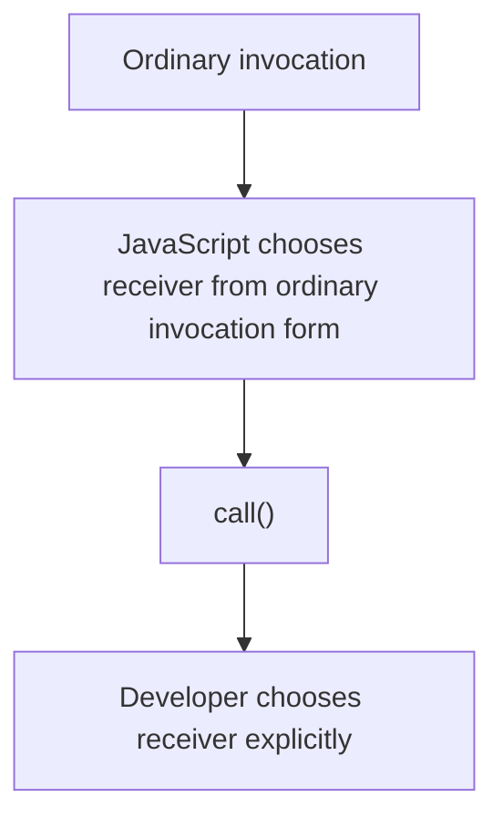

В `call()` объект выполнения передается первым argument:

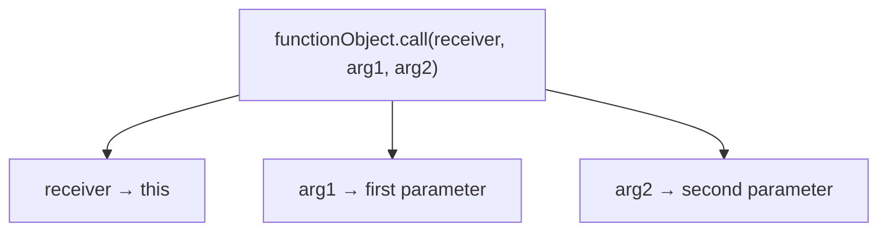

Теперь появляется следующий вопрос:

> Что делать, если arguments уже лежат в одном array?

Например, function ожидает отдельные parameters:

```javascript
function formatRequest(method, path, body) {
  return method + ' ' + this.baseUrl + path + ' ' + body;
}
```

Но данные уже подготовлены как array:

```javascript
const requestParts = ['POST', '/users', '{"name":"Anna"}'];
```

Главный вопрос этой главы:

> Что изменилось по сравнению с `call()`?

Ответ:

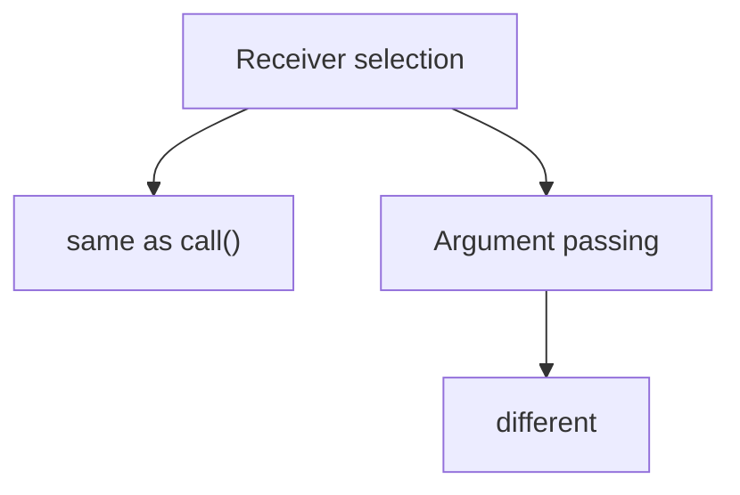

---

## Предварительные требования

Для этой главы нужно понимать:

* что `this` - объект выполнения текущего invocation;
* что `call()` позволяет явно выбрать объект выполнения;
* что первый argument `call()` становится `this`;
* что остальные arguments в `call()` передаются в parameters по позиции;
* что array хранит значения по порядку;
* что parameters получают значения по позиции.

Не требуется знать Spread syntax replacement, `Reflect.apply()`, `bind()`, constructors, classes, `arguments` object internals или proxies. Эти темы будут изучаться позже.

---

## Время изучения

Ориентировочное время:

```text
Чтение главы:            120-150 минут
Разбор схем:             45-65 минут
Запуск примеров:         20-30 минут
Практика:                100-130 минут
Повторение материала:    25 минут
```

Уровень сложности: **L4**.

`apply()` легко запомнить как "`call()`, но с array". Но для понимания этого мало. Важно увидеть проблему: объект выполнения выбирается так же, а arguments уже лежат в одном ordered argument list.

---

## Навигация

Предыдущая глава:

```text
docs/01-javascript/30-call.md
```

Текущая глава:

```text
docs/01-javascript/31-apply.md
```

Следующая глава:

```text
docs/01-javascript/32-bind.md
```

Следующая глава ответит:

> Как создать новую function с заранее выбранным объект выполнения?

---

## Цели обучения

После изучения этой главы вы будете понимать:

* зачем существует `apply()`;
* почему `apply()` решает проблему передачи arguments;
* почему объект выполнения selection у `call()` и `apply()` одинаковый;
* как array значения попадают в parameters;
* что такое array-like collections на высоком уровне;
* чем `call()` отличается от `apply()`;
* когда `apply()` может быть удобнее `call()`;
* какие ошибки чаще всего встречаются;
* как `apply()` применим в Automation QA;
* почему `bind()` логически продолжает эту тему.

---

## Мотивация

Начнем с проблемы.

Есть function:

```javascript
function formatRequest(method, path, body) {
  return method + ' ' + this.baseUrl + path + ' ' + body;
}
```

Она ожидает три отдельных arguments:

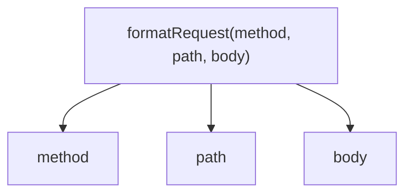

Но test data уже подготовлены как array:

```javascript
const requestParts = ['POST', '/users', '{"name":"Anna"}'];
```

Packaged arguments:

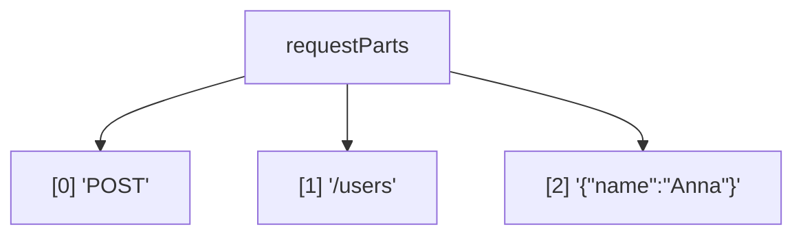

Через `call()` пришлось бы вручную распаковать значения:

```javascript
formatRequest.call(apiClient, requestParts[0], requestParts[1], requestParts[2]);
```

Это работает, но плохо выражает намерение.

Проблема:

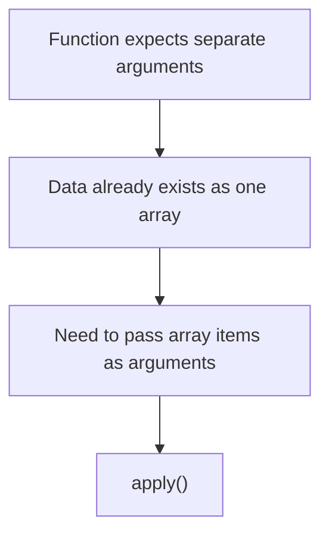

Зачем существует apply():

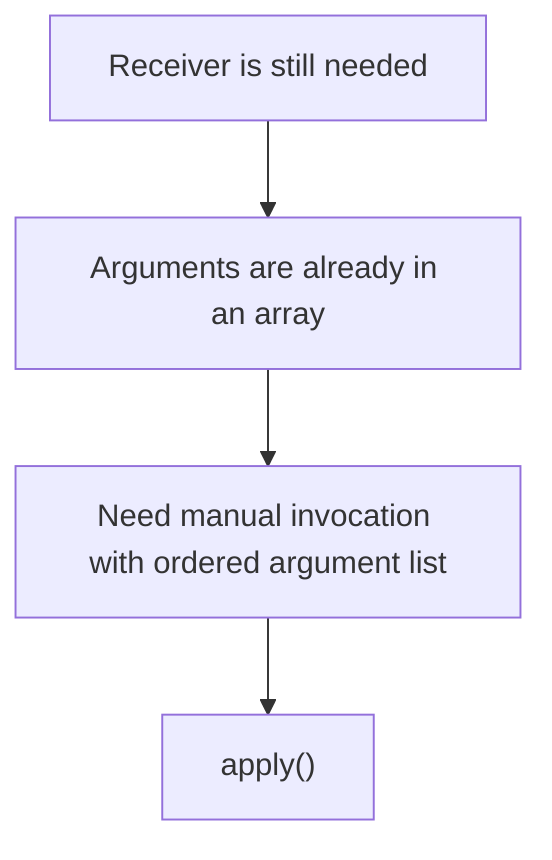

Центральная мысль:

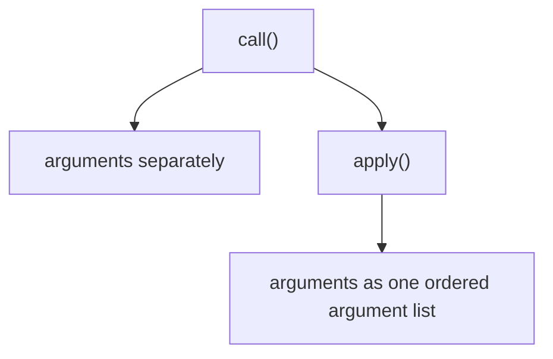

---

## Теория

### Зачем существует apply()

`apply()` существует для вызова function object с явно выбранным объект выполнения и arguments, переданными как array или array-like collection.

```javascript
formatRequest.apply(apiClient, requestParts);
```

Полная модель apply():

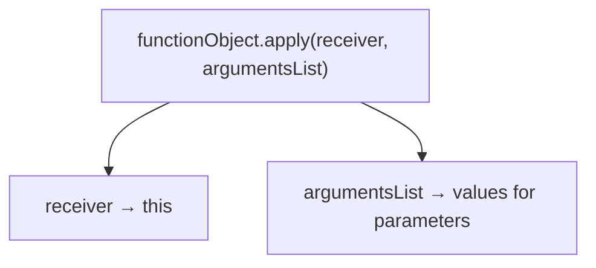

Объект выполнения тот же:

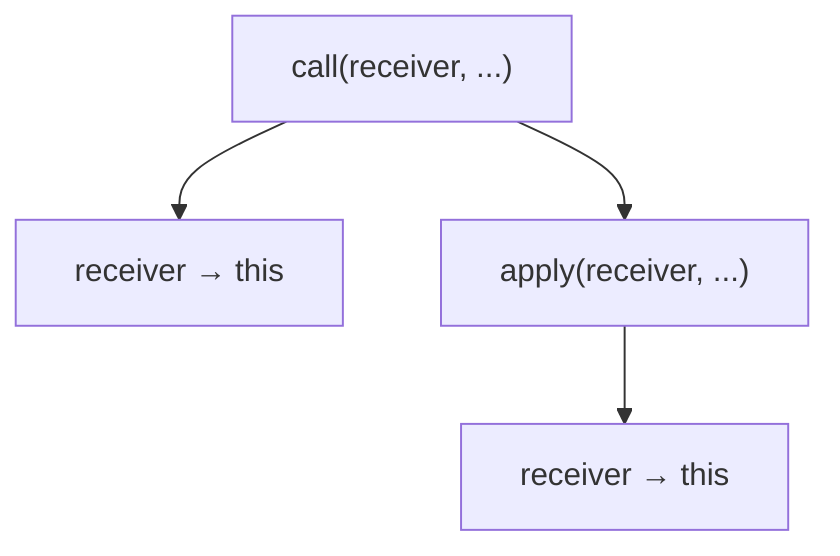

Arguments differ:

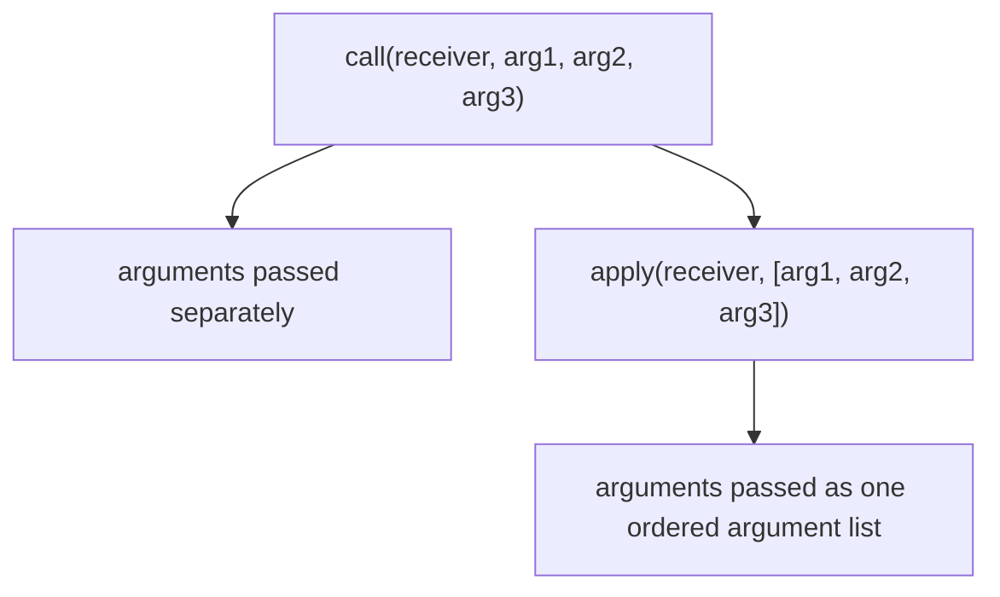

`apply()` решает не новую проблему объект выполнения.

Он решает проблему формы arguments.

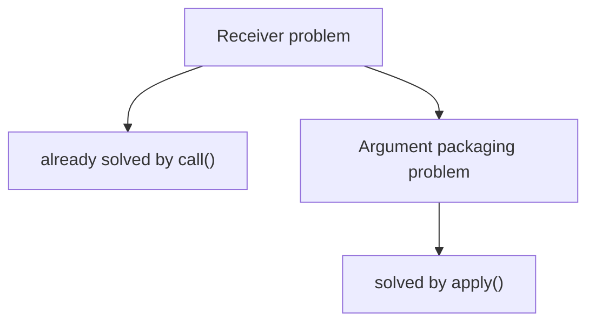

---

### Receiver selection

Receiver в `apply()` работает так же, как в `call()`.

```javascript
function getBaseUrl() {
  return this.baseUrl;
}

const apiClient = {
  baseUrl: 'https://api.example.test'
};

console.log(getBaseUrl.apply(apiClient));
```

Receiver поток:

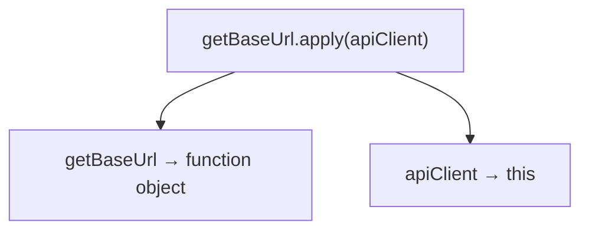

Same объект выполнения:

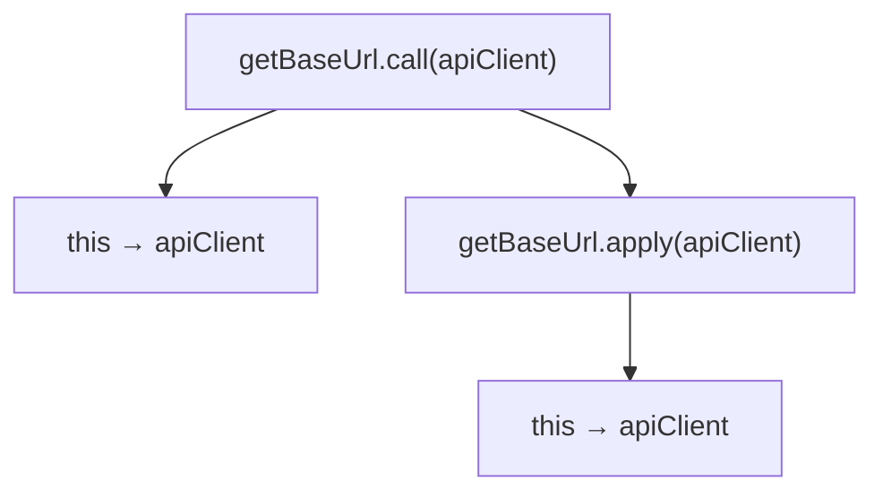

Главный вопрос для объект выполнения:

```text
Who becomes this?
```

Ответ одинаковый:

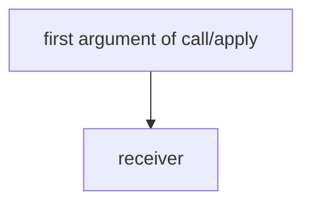

---

### Arguments from array

Главное отличие `apply()` - второй argument.

```javascript
function formatRequest(method, path, body) {
  return method + ' ' + this.baseUrl + path + ' ' + body;
}

const apiClient = {
  baseUrl: 'https://api.example.test'
};

const requestParts = ['POST', '/users', '{"name":"Anna"}'];

console.log(formatRequest.apply(apiClient, requestParts));
```

Array to parameters:

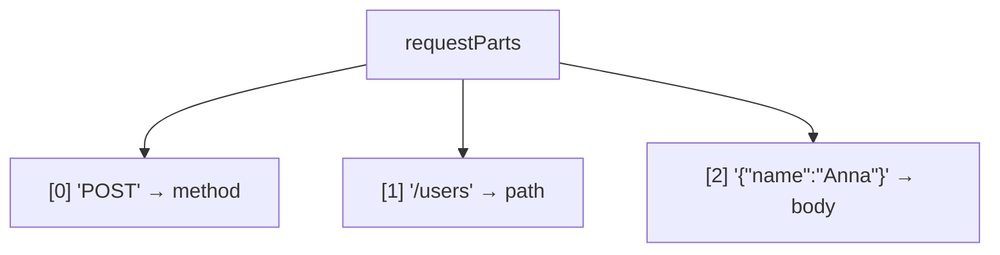

Сопоставление параметров:

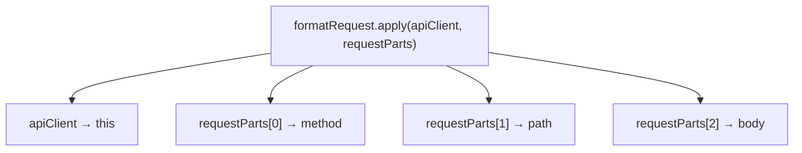

Array expansion concept:

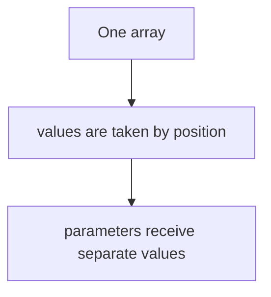

Мы не объясняем Spread syntax заново. В современном JavaScript часто встречаются альтернативные формы передачи array значения, но в этой главе важно понять сам механизм `apply()`.

---

### Array-like collections

`apply()` исторически полезен не только с arrays, но и с array-like collections.

На высоком уровне:

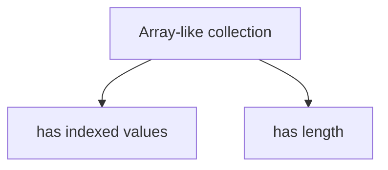

Array-like collections:

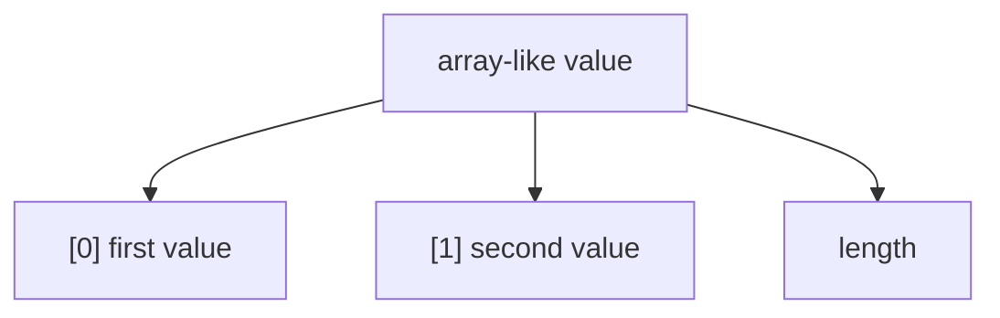

Мы не разбираем `arguments` object internals. Это отдельная тема. Сейчас достаточно понимать:

```mermaid
flowchart TD
    N1["apply()"]
    N2["expects an array or array-like ordered argument list"]
    N1 --> N2
```

---

### call() vs apply()

Сравним на одном примере.

```javascript
function validateRequest(status, path, body) {
  return this.expectedStatus === status &&
    path === this.expectedPath &&
    body !== '';
}
```

Через `call()`:

```javascript
validateRequest.call(config, 200, '/users', '{"name":"Anna"}');
```

Через `apply()`:

```javascript
const requestData = [200, '/users', '{"name":"Anna"}'];

validateRequest.apply(config, requestData);
```

call/apply comparison:

```mermaid
flowchart TD
    N1["call(config, 200, '/users', body)"]
    N2["config → this"]
    N3["arguments listed one by one"]
    N4["apply(config, requestData)"]
    N5["config → this"]
    N6["arguments taken from requestData"]
    N1 --> N2
    N1 --> N3
    N1 --> N4
    N4 --> N5
    N4 --> N6
```

Different argument passing:

```mermaid
flowchart TD
    N1["call()"]
    N2["separate arguments"]
    N3["apply()"]
    N4["arguments as array or array-like list"]
    N1 --> N2
    N1 --> N3
    N3 --> N4
```

Объект выполнения тот же:

```mermaid
flowchart TD
    N1["call(config, ...)"]
    N2["this → config"]
    N3["apply(config, ...)"]
    N4["this → config"]
    N1 --> N2
    N1 --> N3
    N3 --> N4
```

---

## Внутренний механизм

### Invocation lifecycle

Разберем:

```javascript
formatRequest.apply(apiClient, requestParts);
```

Жизненный цикл вызова:

```mermaid
flowchart TD
    N1["1. Read function object: formatRequest"]
    N2["2. Read apply method"]
    N3["3. Receive first argument: apiClient"]
    N4["4. Use apiClient as receiver"]
    N5["5. Receive second argument: requestParts"]
    N6["6. Take values from requestParts by position"]
    N7["7. Start function выполнение"]
    N8["8. Parameters receive extracted values"]
    N1 --> N2
    N2 --> N3
    N3 --> N4
    N4 --> N5
    N5 --> N6
    N6 --> N7
    N7 --> N8
```

Выполнение функции:

```mermaid
flowchart TD
    N1["Function Execution Context"]
    N2["this → apiClient"]
    N3["method → requestParts[0]"]
    N4["path → requestParts[1]"]
    N5["body → requestParts[2]"]
    N1 --> N2
    N1 --> N3
    N1 --> N4
    N1 --> N5
```

Receiver поток:

```mermaid
flowchart TD
    N1["apply(apiClient, requestParts)"]
    N2["apiClient → this"]
    N1 --> N2
```

Arguments поток:

```mermaid
flowchart TD
    N1["apply(apiClient, requestParts)"]
    N2["requestParts → parameters by position"]
    N1 --> N2
```

---

### Function object

Как и `call()`, `apply()` вызывается у function object.

```mermaid
flowchart TD
    N1["functionObject.apply(...)"]
    N2["functionObject is what will execute"]
    N1 --> N2
```

Объект функции:

```mermaid
flowchart TD
    N1["formatRequest"]
    N2["function object"]
    N3["has apply available"]
    N1 --> N2
    N2 --> N3
```

Мы не углубляемся в prototype mechanics. Prototype будет изучаться позже. Сейчас важно только:

```mermaid
flowchart TD
    N1["Function objects"]
    N2["can be invoked through apply()"]
    N1 --> N2
```

---

### Timeline

Временная шкала:

```mermaid
flowchart TD
    N1["T1 Function object exists"]
    N2["T2 Receiver object exists"]
    N3["T3 Arguments array exists"]
    N4["T4 apply(receiver, argumentsList) is called"]
    N5["T5 Receiver becomes this"]
    N6["T6 Array values map to parameters"]
    N7["T7 тело функции выполняется"]
    N8["T8 Function возвращает result"]
    N1 --> N2
    N2 --> N3
    N3 --> N4
    N4 --> N5
    N5 --> N6
    N6 --> N7
    N7 --> N8
```

Complete объект выполнения model:

```mermaid
flowchart TD
    N1["this chapter"]
    N2["this → receiver concept"]
    N3["call() → manual receiver + separate arguments"]
    N4["apply() → manual receiver + array/array-like arguments"]
    N1 --> N2
    N1 --> N3
    N1 --> N4
```

Итоговая схема:

```mermaid
flowchart TD
    N1["apply(receiver, [a, b, c])"]
    N2["receiver → this"]
    N3["a → first parameter"]
    N4["b → second parameter"]
    N5["c → third parameter"]
    N1 --> N2
    N1 --> N3
    N1 --> N4
    N1 --> N5
```

---

## Ментальная модель

### Tray with prepared items

Представьте, что arguments уже лежат на подносе.

```mermaid
flowchart TD
    N1["Tray"]
    N2["method"]
    N3["path"]
    N4["body"]
    N1 --> N2
    N1 --> N3
    N1 --> N4
```

`call()` требует передавать items по одному.

```text
call(receiver, method, path, body)
```

`apply()` принимает весь tray.

```text
apply(receiver, tray)
```

Tray model:

```mermaid
flowchart TD
    N1["Prepared tray"]
    N2["apply receives tray"]
    N3["function parameters receive items by position"]
    N1 --> N2
    N2 --> N3
```

---

### Package of arguments

`apply()` можно представить как delivery box.

```mermaid
flowchart TD
    N1["Delivery box"]
    N2["item 0"]
    N3["item 1"]
    N4["item 2"]
    N1 --> N2
    N1 --> N3
    N1 --> N4
```

Function получает не box целиком в первый parameter, а items из box по positions.

```mermaid
flowchart TD
    N1["apply(receiver, box)"]
    N2["box[0] → parameter 1"]
    N3["box[1] → parameter 2"]
    N4["box[2] → parameter 3"]
    N1 --> N2
    N1 --> N3
    N1 --> N4
```

Envelope containing arguments:

```mermaid
flowchart TD
    N1["Envelope"]
    N2["contains prepared argument list"]
    N3["apply opens it for вызов функции"]
    N1 --> N2
    N1 --> N3
```

---

### Краткая ментальная модель

```mermaid
flowchart TD
    N1["call()"]
    N2["receiver"]
    N3["arguments separately"]
    N4["apply()"]
    N5["receiver"]
    N6["arguments as ordered argument list"]
    N1 --> N2
    N1 --> N3
    N1 --> N4
    N4 --> N5
    N4 --> N6
```

Читаемость:

```mermaid
flowchart TD
    N1["Use call()"]
    N2["when arguments are already separate"]
    N3["Use apply()"]
    N4["when arguments are already in array or array-like list"]
    N1 --> N2
    N1 --> N3
    N3 --> N4
```

Не нужно превращать `apply()` в механическую замену `call()`. Выбор зависит от формы данных.

---

### Текущая модель JavaScript

```mermaid
flowchart TD
    N1["Functions"]
    N2["this"]
    N3["current receiver"]
    N4["call()"]
    N5["manual receiver"]
    N6["arguments separately"]
    N7["apply()"]
    N8["manual receiver"]
    N9["arguments as array or array-like list"]
    N1 --> N2
    N1 --> N3
    N1 --> N4
    N1 --> N5
    N1 --> N6
    N1 --> N7
    N7 --> N8
    N7 --> N9
```

Переход к bind():

```mermaid
flowchart TD
    N1["call()"]
    N2["invoke immediately with chosen receiver"]
    N3["apply()"]
    N4["invoke immediately with chosen receiver and array/array-like arguments"]
    N5["bind()"]
    N6["next chapter: создать a new function with chosen receiver"]
    N1 --> N2
    N1 --> N3
    N3 --> N4
    N3 --> N5
    N5 --> N6
```

---

## Примеры кода

Примеры находятся в папке:

```text
examples/01-javascript/chapter-31/
```

Запуск:

```bash
node examples/01-javascript/chapter-31/01-basic-apply.js
node examples/01-javascript/chapter-31/02-array-arguments.js
node examples/01-javascript/chapter-31/03-call-vs-apply.js
node examples/01-javascript/chapter-31/04-common-mistakes.js
node examples/01-javascript/chapter-31/05-qa-example.js
node examples/01-javascript/chapter-31/06-parameter-mapping.js
```

### Basic apply

```javascript
function getBaseUrl() {
  return this.baseUrl;
}

const apiClient = {
  baseUrl: 'https://api.example.test'
};

console.log(getBaseUrl.apply(apiClient));
```

Receiver:

```mermaid
flowchart TD
    N1["getBaseUrl.apply(apiClient)"]
    N2["this → apiClient"]
    N1 --> N2
```

---

### Array arguments

```javascript
function formatRequest(method, path, body) {
  return method + ' ' + this.baseUrl + path + ' ' + body;
}

const apiClient = {
  baseUrl: 'https://api.example.test'
};

const requestParts = ['POST', '/users', '{"name":"Anna"}'];

console.log(formatRequest.apply(apiClient, requestParts));
```

Сопоставление параметров:

```mermaid
flowchart TD
    N1["requestParts[0] → method"]
    N2["requestParts[1] → path"]
    N3["requestParts[2] → body"]
    N1 --> N2
    N2 --> N3
```

---

### call vs apply

```javascript
function buildUrl(path) {
  return this.baseUrl + path;
}

const apiClient = {
  baseUrl: 'https://api.example.test'
};

console.log(buildUrl.call(apiClient, '/users'));
console.log(buildUrl.apply(apiClient, ['/users']));
```

Разница:

```mermaid
flowchart TD
    N1["call(apiClient, '/users')"]
    N2["argument separately"]
    N3["apply(apiClient, ['/users'])"]
    N4["argument inside array"]
    N1 --> N2
    N1 --> N3
    N3 --> N4
```

---

## Частые вопросы

### apply() решает новую проблему объект выполнения?

Нет. Receiver selection такая же, как у `call()`.

```mermaid
flowchart TD
    N1["call(receiver, ...)"]
    N2["apply(receiver, ...)"]
    N3["receiver → this"]
    N2 --> N3
    N1 --> N2
```

Разница в arguments.

### apply() устарел?

Нет. В современном JavaScript часто есть альтернативные способы передавать значения из array, но `apply()` остается важным механизмом языка и помогает понять Function API.

### apply() передает array как первый parameter?

Нет. Array используется как ordered argument list.

```mermaid
flowchart TD
    N1["apply(receiver, [a, b])"]
    N2["a → first parameter"]
    N3["b → second parameter"]
    N1 --> N2
    N1 --> N3
```

### Можно ли использовать apply() без arguments?

Да, если function не ожидает arguments или если нужно только явно выбрать объект выполнения.

```javascript
fn.apply(receiver);
```

### Чем apply() отличается от bind()?

`apply()` вызывает function immediately. `bind()` будет изучаться в следующей главе и создаст новую function с выбранным объект выполнения.

---

## Распространенные мифы

### Миф 1. apply() существует только как старая версия Spread

Реальность: `apply()` - самостоятельный механизм manual invocation с объект выполнения и ordered argument list. Современные альтернативы существуют, но они не отменяют полезность модели `apply()`.

### Миф 2. apply() меняет объект выполнения иначе, чем call()

Реальность:

```mermaid
flowchart TD
    N1["Receiver selection"]
    N2["call() → first argument"]
    N3["apply() → first argument"]
    N1 --> N2
    N1 --> N3
```

### Миф 3. apply() всегда делает код сложнее

Реальность: если arguments уже лежат в ordered argument list, `apply()` может выражать намерение яснее, чем ручное обращение к indexes.

---

## Типичные ошибки

### Ошибка 1. Передать arguments не array или array-like collection

Неправильный код:

```javascript
function buildUrl(path) {
  return this.baseUrl + path;
}

const apiClient = {
  baseUrl: 'https://api.example.test'
};

buildUrl.apply(apiClient, '/users');
```

Что произошло:

```mermaid
flowchart TD
    N1["Second argument of apply()"]
    N2["should be array or array-like ordered argument list"]
    N1 --> N2
```

Исправленный вариант:

```javascript
buildUrl.apply(apiClient, ['/users']);
```

---

### Ошибка 2. Перепутать объект выполнения и arguments array

```javascript
function validateStatus(response) {
  return response.status === this.expectedStatus;
}

const config = {
  expectedStatus: 200
};

const response = {
  status: 200
};

validateStatus.apply([response], config);
```

Что произошло:

```mermaid
flowchart TD
    N1["[response] → this"]
    N2["config → expected argument list"]
    N1 --> N2
```

Исправленный вариант:

```javascript
validateStatus.apply(config, [response]);
```

---

### Ошибка 3. Думать, что apply() сохраняет объект выполнения

```javascript
function getBaseUrl() {
  return this.baseUrl;
}

const apiClient = {
  baseUrl: 'https://api.example.test'
};

getBaseUrl.apply(apiClient);
getBaseUrl();
```

Первый вызов выбирает объект выполнения.

Второй вызов снова ordinary standalone invocation.

```mermaid
flowchart TD
    N1["apply()"]
    N2["one invocation only"]
    N1 --> N2
```

---

## Практическое использование

`apply()` полезен, когда arguments уже подготовлены как array или array-like ordered argument list.

Практическое использование:

```mermaid
flowchart TD
    N1["Test data array"]
    N2["apply(receiver, values)"]
    N3["function receives separate parameters"]
    N1 --> N2
    N2 --> N3
```

Пример:

```javascript
function validateRequest(status, path, body) {
  return status === this.expectedStatus &&
    path === this.expectedPath &&
    body !== '';
}

const config = {
  expectedStatus: 200,
  expectedPath: '/users'
};

const requestData = [200, '/users', '{"name":"Anna"}'];

console.log(validateRequest.apply(config, requestData));
```

Читаемость:

```mermaid
flowchart TD
    N1["apply()"]
    N2["clearer when arguments are already collected"]
    N3["call()"]
    N4["clearer when arguments are already separate"]
    N1 --> N2
    N1 --> N3
    N3 --> N4
```

---

## Использование в Automation QA

### Reusable validators

В Automation QA test data часто существует как array.

```javascript
function validateResponse(status, path, body) {
  return status === this.expectedStatus &&
    path === this.expectedPath &&
    body !== '';
}

const assertionConfig = {
  expectedStatus: 200,
  expectedPath: '/users'
};

const responseParts = [200, '/users', '{"name":"Anna"}'];
```

Пример QA-helper:

```mermaid
flowchart TD
    N1["validateResponse.apply(assertionConfig, responseParts)"]
    N2["assertionConfig → this"]
    N3["responseParts[0] → status"]
    N4["responseParts[1] → path"]
    N5["responseParts[2] → body"]
    N1 --> N2
    N1 --> N3
    N1 --> N4
    N1 --> N5
```

---

### Request builders

Request formatter:

```mermaid
flowchart TD
    N1["formatRequest.apply(apiClient, requestParts)"]
    N2["apiClient → this.baseUrl"]
    N3["requestParts → method, path, body"]
    N1 --> N2
    N1 --> N3
```

Это полезно, когда data provider уже подготовил array значения для helper.

---

### Configuration objects

`apply()` помогает разделить:

```mermaid
flowchart TD
    N1["Configuration"]
    N2["receiver / this"]
    N3["Test data array"]
    N4["ordered argument list"]
    N1 --> N2
    N1 --> N3
    N3 --> N4
```

Для Automation QA это важно в:

* reusable validators;
* request builders;
* helper functions;
* configuration objects;
* test data arrays.

---

## Практика

Практика находится в файле:

```text
practice/01-javascript/31-apply.md
```

Выполняйте задания после запуска примеров из `examples/01-javascript/chapter-31/`.

Главный вопрос практики:

```text
What changed compared to call()?
```

---

## Решения

Файл с решениями:

```text
solutions/01-javascript/31-apply.md
```

В решениях важно отдельно отслеживать:

```mermaid
flowchart TD
    N1["receiver"]
    N2["first argument of apply()"]
    N3["параметры"]
    N4["values from second argument array or array-like list"]
    N1 --> N2
    N1 --> N3
    N3 --> N4
```

---

## Итоги

`apply()` продолжает тему `call()`.

Выбор объекта выполнения:

```mermaid
flowchart TD
    N1["call()"]
    N2["first argument → this"]
    N3["apply()"]
    N4["first argument → this"]
    N1 --> N2
    N1 --> N3
    N3 --> N4
```

Разница:

```mermaid
flowchart TD
    N1["call()"]
    N2["arguments separately"]
    N3["apply()"]
    N4["arguments as one ordered argument list"]
    N1 --> N2
    N1 --> N3
    N3 --> N4
```

Полная модель apply():

```mermaid
flowchart TD
    N1["functionObject.apply(receiver, argumentsList)"]
    N2["receiver → this"]
    N3["argumentsList[0] → first parameter"]
    N4["argumentsList[1] → second parameter"]
    N5["argumentsList[2] → third parameter"]
    N1 --> N2
    N1 --> N3
    N1 --> N4
    N1 --> N5
```

Следующая глава про `bind()` ответит:

> Как создать новую function с заранее выбранным объект выполнения?

---

## Что нужно запомнить

* `apply()` вызывает function immediately.
* Первый argument `apply()` становится `this`.
* Второй argument `apply()` содержит array или array-like ordered argument list.
* Receiver selection у `call()` и `apply()` одинаковый.
* Главное отличие - способ передачи arguments.
* `apply()` удобен, когда arguments уже собраны в array или array-like collection.
* `bind()` будет изучаться дальше и решит другую задачу: создать новую function с выбранным объект выполнения.

Краткая ментальная модель:

```mermaid
flowchart TD
    N1["apply()"]
    N2["manual receiver"]
    N3["immediate invocation"]
    N4["ordered argument list"]
    N1 --> N2
    N1 --> N3
    N1 --> N4
```

---

## Проверьте себя

Ответьте без запуска кода:

1. Что общего у `call()` и `apply()`?
2. Что отличается у `call()` и `apply()`?
3. Что становится `this` в `fn.apply(config, значения)`?
4. Откуда берутся normal parameters при `apply()`?
5. Когда `apply()` удобнее `call()`?
6. Почему `bind()` логически следует после `apply()`?
