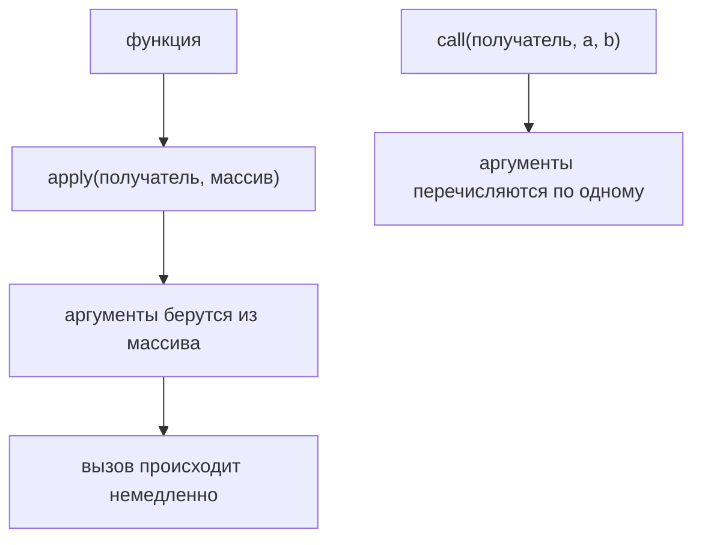

# Метод `apply()`

## Связь с предыдущей главой

Предыдущая глава объяснила `call()`.

Главная модель была такой: `call()` выполняет функцию сразу и принимает аргументы по одному.

В `call()` объект выполнения передается первым argument:

Теперь появляется следующий вопрос:

> Что делать, если arguments уже лежат в одном array?

Например, function ожидает отдельные parameters:

```javascript
function formatRequest(method, path, body) {
  return method + ' ' + this.baseUrl + path + ' ' + body;
}
```

Но данные уже подготовлены как array:

```javascript
const requestParts = ['POST', '/users', '{"name":"Anna"}'];
```

Главный вопрос этой главы:

> Что изменилось по сравнению с `call()`?

Ответ:

---

## Предварительные требования

Для этой главы нужно понимать:

* что `this` - объект выполнения текущего invocation;
* что `call()` позволяет явно выбрать объект выполнения;
* что первый argument `call()` становится `this`;
* что остальные arguments в `call()` передаются в parameters по позиции;
* что array хранит значения по порядку;
* что parameters получают значения по позиции.

Не требуется знать Spread syntax replacement, `Reflect.apply()`, `bind()`, constructors, classes, `arguments` object internals или proxies. Эти темы будут изучаться позже.

---

## Время изучения

Ориентировочное время:

```text
Чтение главы:            120-150 минут
Разбор схем:             45-65 минут
Запуск примеров:         20-30 минут
Практика:                100-130 минут
Повторение материала:    25 минут
```

Уровень сложности: **L4**.

`apply()` легко запомнить как "`call()`, но с array". Но для понимания этого мало. Важно увидеть проблему: объект выполнения выбирается так же, а arguments уже лежат в одном ordered argument list.

---

## Навигация

Предыдущая глава:

```text
docs/01-javascript/30-call.md
```

Текущая глава:

```text
docs/01-javascript/31-apply.md
```

Следующая глава:

```text
docs/01-javascript/32-bind.md
```

Следующая глава ответит:

> Как создать новую function с заранее выбранным объект выполнения?

---

## Цели обучения

После изучения этой главы вы будете понимать:

* зачем существует `apply()`;
* почему `apply()` решает проблему передачи arguments;
* почему объект выполнения selection у `call()` и `apply()` одинаковый;
* как array значения попадают в parameters;
* что такое array-like collections на высоком уровне;
* чем `call()` отличается от `apply()`;
* когда `apply()` может быть удобнее `call()`;
* какие ошибки чаще всего встречаются;
* как `apply()` применим в Automation QA;
* почему `bind()` логически продолжает эту тему.

---

## Мотивация

Начнем с проблемы.

Есть function:

```javascript
function formatRequest(method, path, body) {
  return method + ' ' + this.baseUrl + path + ' ' + body;
}
```

Она ожидает три отдельных arguments:

Но test data уже подготовлены как array:

```javascript
const requestParts = ['POST', '/users', '{"name":"Anna"}'];
```

Packaged arguments:

Через `call()` пришлось бы вручную распаковать значения:

```javascript
formatRequest.call(apiClient, requestParts[0], requestParts[1], requestParts[2]);
```

Это работает, но плохо выражает намерение.

Проблема:

Зачем существует apply():

Центральная мысль:

---

## Теория

### Зачем существует `apply()`

`apply()` существует для вызова объекта функции с явно выбранным объектом выполнения и аргументами, переданными массивом или похожей на массив коллекцией.

```javascript
formatRequest.apply(apiClient, requestParts);
```

Полная модель `apply()`:

```text
fn.apply(obj, [a, b])   →  fn вызвана с this = obj и аргументами a, b
```

| | `call()` | `apply()` |
| --- | --- | --- |
| объект выполнения | первый аргумент | первый аргумент — **то же самое** |
| остальные аргументы | по одному, через запятую | одним массивом |

`apply()` решает не новую проблему объект выполнения.

Он решает задачу формы аргументов.

---

### Выбор получателя

Объект выполнения в `apply()` работает так же, как в `call()`.

```javascript
function getBaseUrl() {
  return this.baseUrl;
}

const apiClient = {
  baseUrl: 'https://api.example.test'
};

console.log(getBaseUrl.apply(apiClient));
```

Первый аргумент `apply()` отвечает на тот же вопрос, что и первый аргумент
`call()`: кто станет объектом выполнения.

```text
getBaseUrl.apply(apiClient)
                 └──────┘
                 this внутри вызова
```

Ответ одинаковый у обоих методов — различаются они только тем, как передаются
остальные аргументы.

---

### Аргументы из массива

Главное отличие `apply()` — второй аргумент.

```javascript
function formatRequest(method, path, body) {
  return method + ' ' + this.baseUrl + path + ' ' + body;
}

const apiClient = {
  baseUrl: 'https://api.example.test'
};

const requestParts = ['POST', '/users', '{"name":"Anna"}'];

console.log(formatRequest.apply(apiClient, requestParts));
```

Элементы массива раскладываются по параметрам **по позициям**:

```text
requestParts = ['POST', '/users', '{"name":"Anna"}']
                  │         │             │
                  ▼         ▼             ▼
formatRequest(method,     path,         body)
```

Массив здесь не попадает в первый параметр целиком: `apply()` разбирает его и
передаёт элементы по одному. Длина массива и число параметров совпадать не
обязаны — лишние элементы просто не будут прочитаны, а недостающие параметры
получат `undefined`.

Современный JavaScript решает ту же задачу раскрытием, но механизм `apply()`
полезно понимать: он встречается в старом коде и в реализациях библиотек.

---

### Похожие на массив коллекции

`apply()` исторически полезен не только с массивами, но и с похожими на массив коллекциями.

Похожая на массив коллекция — объект с числовыми ключами и свойством `length`,
но без методов массива:

```javascript
function collect() {
  // arguments — не массив: у него нет map, filter и forEach.
  return Math.max.apply(null, arguments);
}

console.log(collect(3, 11, 7));
```

`apply()` работает с такой коллекцией, потому что читает только `length` и
элементы по индексам. Устройство объекта `arguments` здесь не разбирается —
достаточно понимать, что массивом он не является, а `apply()` этого и не
требует.

---

### `call()` и `apply()`

Сравним на одном примере.

```javascript
function validateRequest(status, path, body) {
  return this.expectedStatus === status &&
    path === this.expectedPath &&
    body !== '';
}
```

Через `call()`:

```javascript
validateRequest.call(config, 200, '/users', '{"name":"Anna"}');
```

Через `apply()`:

```javascript
const requestData = [200, '/users', '{"name":"Anna"}'];

validateRequest.apply(config, requestData);
```

| | `call()` | `apply()` |
| --- | --- | --- |
| Первый аргумент | объект выполнения | объект выполнения |
| Остальные аргументы | перечисляются через запятую | передаются одним массивом |
| Когда удобнее | аргументы известны заранее | аргументы уже лежат в массиве |

Объект выполнения задаётся одинаково — различается только форма передачи
остальных аргументов. Поэтому выбор между методами определяется тем, в каком
виде данные уже есть, а не тем, какой метод «лучше».

---

Отличие от `call()` — только в форме передачи аргументов:


```mermaid
flowchart TD
    A["функция"] --> B["apply(получатель, массив)"]
    B --> C["аргументы берутся из массива"]
    C --> D["вызов происходит немедленно"]
    E["call(получатель, a, b)"] --> F["аргументы перечисляются по одному"]
```

## Внутренний механизм

### Время жизни вызова

Разберем:

```javascript
formatRequest.apply(apiClient, requestParts);
```

```text
1. Прочитан объект функции            formatRequest
2. Взят первый аргумент apply()       apiClient  →  this
3. Разобран массив                    requestParts → method, path, body
4. Создан контекст выполнения         с этими this и параметрами
5. Выполнено тело                     возвращено значение
```

Шаги 2 и 3 независимы: объект выполнения и аргументы приходят из разных мест
вызова и не влияют друг на друга.

---

### Объект функции

Как и `call()`, `apply()` вызывается у объекта функции.

```javascript
console.log(typeof formatRequest.apply);   // 'function'
```

Метод `apply()` принадлежит не конкретной функции, а всем функциям сразу: он
приходит из прототипа. Механика прототипов разбирается позже, сейчас важно
только одно — `apply()` доступен у любой функции, потому что это её метод,
а не отдельный оператор языка.

---

### Временная шкала

```text
до вызова   │ функция объявлена, this ещё не определён
вызов       │ apply() задаёт this и раскладывает массив по параметрам
выполнение  │ тело читает this и параметры
после       │ контекст снят, this снова не определён
```

Главное следствие: объект выполнения живёт ровно один вызов. Следующий вызов
той же функции без `apply()` получит другой `this` — привязки не остаётся.

---

## Ментальная модель

### Поднос с подготовленными предметами

Представьте, что аргументы уже лежат на подносе.

`call()` требует передавать предметы по одному.

```text
call(receiver, method, path, body)
```

`apply()` принимает весь поднос.

```text
apply(receiver, tray)
```

Поднос — это массив: функция берёт с него предметы по позициям, а не получает
поднос целиком.

---

### Посылка с аргументами

`apply()` можно представить как коробку доставки.

Функция получает не коробку целиком в первый параметр, а предметы из коробки по позициям.

Первый аргумент `apply()` при этом лежит отдельно от коробки — это адрес
получателя, а не её содержимое.

---

### Краткая ментальная модель

`call()` читается лучше, когда аргументов немного и они известны в месте
вызова. `apply()` читается лучше, когда аргументы уже собраны в массив и
перечислять их пришлось бы вручную.

Не нужно превращать `apply()` в механическую замену `call()`. Выбор зависит от формы данных.

---

### Текущая модель JavaScript

`call()` и `apply()` задают объект выполнения **в момент вызова**. Оба метода
вызывают функцию немедленно, и привязка действует ровно один вызов.

Следующая глава вводит `bind()` — способ закрепить объект выполнения заранее,
не вызывая функцию сейчас.

---

## Примеры кода

Примеры находятся в папке:

```text
examples/01-javascript/chapter-31/
```

Запуск:

```bash
node examples/01-javascript/chapter-31/01-basic-apply.js
node examples/01-javascript/chapter-31/02-array-arguments.js
node examples/01-javascript/chapter-31/03-call-vs-apply.js
node examples/01-javascript/chapter-31/04-common-mistakes.js
node examples/01-javascript/chapter-31/05-qa-example.js
node examples/01-javascript/chapter-31/06-parameter-mapping.js
```

### Простой вызов `apply()`

```javascript
function getBaseUrl() {
  return this.baseUrl;
}

const apiClient = {
  baseUrl: 'https://api.example.test'
};

console.log(getBaseUrl.apply(apiClient));
```

Второй аргумент не передан, и это допустимо: функция не принимает параметров.
Единственная работа `apply()` здесь — сделать `apiClient` объектом выполнения,
поэтому `this.baseUrl` читается.

---

### Аргументы массивом

```javascript
function formatRequest(method, path, body) {
  return method + ' ' + this.baseUrl + path + ' ' + body;
}

const apiClient = {
  baseUrl: 'https://api.example.test'
};

const requestParts = ['POST', '/users', '{"name":"Anna"}'];

console.log(formatRequest.apply(apiClient, requestParts));
```

Три элемента массива встают в три параметра по порядку: `'POST'` → `method`,
`'/users'` → `path`, тело запроса → `body`. Имена параметров на это
сопоставление не влияют — важны только позиции.

---

### `call()` против `apply()`

```javascript
function buildUrl(path) {
  return this.baseUrl + path;
}

const apiClient = {
  baseUrl: 'https://api.example.test'
};

console.log(buildUrl.call(apiClient, '/users'));
console.log(buildUrl.apply(apiClient, ['/users']));
```

Обе строки печатают одно и то же. Разница только в форме записи: `call()`
принимает `'/users'` как обычный аргумент, `apply()` — как единственный элемент
массива. Для одного аргумента запись через `call()` короче и читается лучше.

---

## Частые вопросы

### `apply()` решает новую задачу с объектом выполнения?

Нет. Выбор объекта выполнения такой же, как у `call()`.

Разница в аргументах.

### `apply()` устарел?

Нет. В современном JavaScript часто есть другие способы передавать значения из массива, но `apply()` остаётся важным механизмом языка и помогает понять устройство функций.

### `apply()` передаёт массив как первый параметр?

Нет. Массив используется как упорядоченный список аргументов.

### Можно ли использовать `apply()` без аргументов?

Да, если функция не ожидает аргументов или если нужно только явно выбрать объект выполнения.

```javascript
fn.apply(receiver);
```

### Чем `apply()` отличается от `bind()`?

`apply()` вызывает функцию немедленно. `bind()` будет изучаться в следующей главе и создаст новую функцию с выбранным объектом выполнения.

---

## Распространённые мифы

### Миф 1. `apply()` существует только как старая версия раскрытия

Реальность: `apply()` — самостоятельный механизм ручного вызова с объектом выполнения и упорядоченным списком аргументов. Современные альтернативы существуют, но они не отменяют полезности этой модели.

### Миф 2. `apply()` меняет объект выполнения иначе, чем `call()`

Реальность: объект выполнения оба задают одинаково — первым аргументом.
Различается только передача остальных аргументов: `call()` перечисляет их
через запятую, `apply()` берёт из массива.

### Миф 3. `apply()` всегда делает код сложнее

Реальность: если аргументы уже лежат в упорядоченном списке, `apply()` может выражать намерение яснее, чем ручное обращение по индексам.

---

## Распространённые ошибки

### Ошибка 1. Передать аргументы не массивом и не похожей на массив коллекцией

Неправильный код:

```javascript
function buildUrl(path) {
  return this.baseUrl + path;
}

const apiClient = {
  baseUrl: 'https://api.example.test'
};

buildUrl.apply(apiClient, '/users');
```

Что произошло: строка — не массив и не похожая на массив коллекция с
числовыми ключами в том смысле, который нужен `apply()`. Современные движки
бросают `TypeError: CreateListFromArrayLike called on non-object` для значений,
которые вообще не объекты; строка же разбирается по символам, и в `path` попадёт
`'/'` вместо всего пути.

В обоих случаях ошибка не про `apply()`, а про форму второго аргумента — он
обязан быть коллекцией.

Исправленный вариант:

```javascript
buildUrl.apply(apiClient, ['/users']);
```

---

### Ошибка 2. Перепутать объект выполнения и массив аргументов

```javascript
function validateStatus(response) {
  return response.status === this.expectedStatus;
}

const config = {
  expectedStatus: 200
};

const response = {
  status: 200
};

validateStatus.apply([response], config);
```

Что произошло: массив стал объектом выполнения, а объект настроек — списком
аргументов.

```text
ожидалось:  this = config,      response = response
получилось: this = [response],  response = undefined
результат:  undefined === undefined  →  true
```

Как и в главе про `call()`, перепутанный порядок не падает — он даёт ложный
`true`.

Исправленный вариант:

```javascript
validateStatus.apply(config, [response]);
```

---

### Ошибка 3. Думать, что `apply()` сохраняет объект выполнения

```javascript
function getBaseUrl() {
  return this.baseUrl;
}

const apiClient = {
  baseUrl: 'https://api.example.test'
};

getBaseUrl.apply(apiClient);
getBaseUrl();
```

Первый вызов выбирает объект выполнения.

Второй вызов снова идёт без объекта.

---

## Практическое использование

`apply()` полезен, когда аргументы уже подготовлены как массив или упорядоченный список.

Где это встречается:

* данные теста пришли параметризованным набором;
* значения разобраны из ответа и сложены в массив;
* число аргументов заранее неизвестно;
* нужно передать дальше полученный список, не перечисляя элементы.

Пример:

```javascript
function validateRequest(status, path, body) {
  return status === this.expectedStatus &&
    path === this.expectedPath &&
    body !== '';
}

const config = {
  expectedStatus: 200,
  expectedPath: '/users'
};

const requestData = [200, '/users', '{"name":"Anna"}'];

console.log(validateRequest.apply(config, requestData));
```

Данные пришли массивом — из подготовки теста, из разбора ответа или из
параметризованного набора. Перечислять их через `call()` пришлось бы вручную,
по индексам, и любое изменение порядка ломало бы вызов.

---

## Использование в Automation QA

### Переиспользуемые проверки

В автоматизации тестов данные часто существуют как массив.

```javascript
function validateResponse(status, path, body) {
  return status === this.expectedStatus &&
    path === this.expectedPath &&
    body !== '';
}

const assertionConfig = {
  expectedStatus: 200,
  expectedPath: '/users'
};

const responseParts = [200, '/users', '{"name":"Anna"}'];
```

```javascript
function reportResponse(status, path, body) {
  return `${this.env}: ${status} ${path} ${body}`;
}

const context = { env: 'local' };

console.log(reportResponse.apply(context, responseParts));
```

Вспомогательная функция получает окружение через объект выполнения, а данные
ответа — массивом. Оба источника заданы в месте вызова и видны при чтении кода.

---

### Построители запросов

```javascript
function buildRequest(method, path, body) {
  return `${method} ${this.baseUrl}${path} ${body}`;
}

const parts = ['POST', '/work-items', '{"title":"Отчёт"}'];

console.log(buildRequest.apply({ baseUrl: 'http://127.0.0.1:4310' }, parts));
```

Это полезно, когда источник данных уже подготовил массив значений.

---

### Объекты конфигурации

`apply()` помогает разделить два источника: настройка приходит объектом
выполнения, данные — массивом аргументов. Настройка меняется редко, данные — на
каждый вызов, и в записи вызова эта разница видна.

Для Automation QA это важно в:

* переиспользуемые проверки;
* построители запросов;
* вспомогательные функции;
* объекты конфигурации;
* массивов тестовых данных.

---

## Практика

Практика находится в файле:

```text
practice/01-javascript/31-apply.md
```

Выполняйте задания после запуска примеров из раздела «Примеры кода».

Главный вопрос практики:

```text
что изменилось по сравнению с call()?
```

---

## Решения

Файл с решениями:

```text
solutions/01-javascript/31-apply.md
```

В решениях важно отдельно отслеживать два вопроса:

1. **Кто стал объектом выполнения** — это первый аргумент, и он не зависит от остальных.
2. **Как разложились аргументы** — сколько элементов было в массиве и какие параметры они заняли.

Большинство ошибок в этой теме — смешение двух вопросов: массив считают
единственным аргументом или, наоборот, ищут объект выполнения среди его
элементов.

---

## Итоги

`apply()` продолжает тему `call()`.

Выбор объекта выполнения у них одинаковый — первым аргументом.

Разница только в форме передачи остальных аргументов: `call()` перечисляет их
через запятую, `apply()` берёт из массива.

Полная модель `apply()`: то же, что `call()`, но аргументы передаются одной коллекцией.

Следующая глава про `bind()` ответит:

> Как создать новую функцию с заранее выбранным объектом выполнения?

---

## Что нужно запомнить

* `apply()` вызывает функцию немедленно.
* Первый аргумент `apply()` становится значением `this`.
* Второй аргумент содержит массив или похожий на массив упорядоченный список аргументов.
* Выбор объекта выполнения у `call()` и `apply()` одинаковый.
* Главное отличие — способ передачи аргументов.
* `apply()` удобен, когда аргументы уже собраны в массив или похожую коллекцию.
* `bind()` будет изучаться дальше и решит другую задачу: создать новую функцию с выбранным объектом выполнения.

Краткая ментальная модель: `apply()` — это `call()` с аргументами на подносе.

---

## Проверьте себя

Ответьте без запуска кода:

1. Что общего у `call()` и `apply()`?
2. Что отличается у `call()` и `apply()`?
3. Что становится `this` в `fn.apply(config, значения)`?
4. Откуда берутся обычные параметры при `apply()`?
5. Когда `apply()` удобнее `call()`?
6. Почему `bind()` логически следует после `apply()`?

### Ответы

1. Оба вызывают функцию немедленно и оба задают объект выполнения первым аргументом.
2. Способ передачи остальных аргументов: `call()` перечисляет их через запятую, `apply()` берёт из массива.
3. Объект `config`.
4. Из элементов переданного массива, по порядку: первый элемент — первому параметру и так далее.
5. Когда аргументы уже собраны в массив и их состав или количество заранее неизвестны.
6. `call()` и `apply()` вызывают функцию сейчас. Остаётся вопрос, как закрепить объект выполнения на будущее, — на него отвечает `bind()`.

