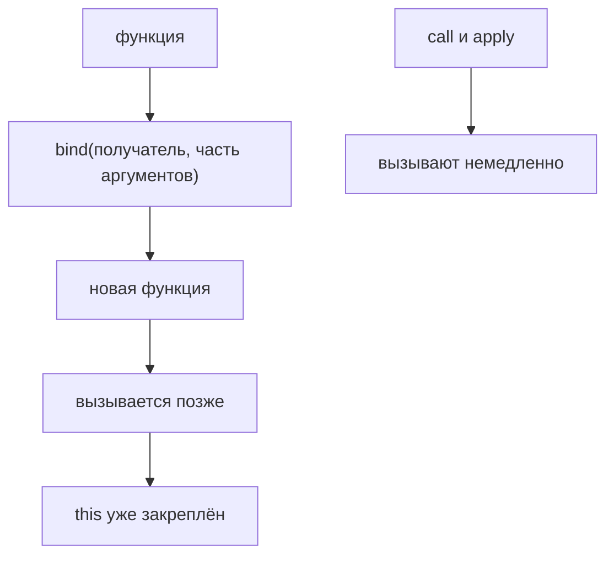

# bind()

## Связь с предыдущей главой

Предыдущая глава объяснила `apply()`.

Главная модель была такой: `call()` и `apply()` выполняют функцию немедленно с выбранным объектом выполнения.

До этого `call()` показал другой вариант:

Оба механизма делают invocation сразу.

Теперь появляется следующий вопрос:

> Что делать, если объект выполнения нужно выбрать один раз, а function вызвать позже?

Или так:

Для этого существует `bind()`.

Главный вопрос главы:

> Что отличается от `call()`?

Ответ:

---

## Предварительные требования

Для этой главы нужно понимать:

* что function object можно хранить в переменной;
* что `this` определяется формой invocation;
* что обычный `object.method()` выбирает объект выполнения из формы вызова;
* что `call()` позволяет явно выбрать объект выполнения;
* что `apply()` отличается от `call()` способом передачи arguments;
* что функция начинает выполнение только при invocation;
* что один function object можно использовать с разными объект выполненияs.

Не требуется знать constructors with `bind`, `new`, classes, decorators, polyfills или внутреннее устройство `Function.prototype.bind`. Эти темы будут изучаться позже.

---

## Время изучения

Ориентировочное время:

```text
Чтение главы:            130-160 минут
Разбор схем:             55-75 минут
Запуск примеров:         20-30 минут
Практика:                110-140 минут
Повторение материала:    30 минут
```

Уровень сложности: **L4**.

`bind()` сложен не синтаксисом. Сложность в том, что он не вызывает функцию сразу. Он создает новую function, у которой объект выполнения уже выбран заранее.

---

## Навигация

Предыдущая глава:

```text
docs/01-javascript/31-apply.md
```

Текущая глава:

```text
docs/01-javascript/32-bind.md
```

Следующая глава:

```text
docs/01-javascript/33-objects.md
```

Следующая глава начнет новый раздел и вернется к object значения уже глубже:

> Как устроены objects как основная форма группировки данных и поведения?

---

## Цели обучения

После изучения этой главы вы будете понимать:

* зачем существует `bind()`;
* почему `bind()` не выполняет function сразу;
* что `bind()` создает новую function;
* что объект выполнения в bound function выбран заранее;
* чем `bind()` отличается от `call()` и `apply()`;
* как работает delayed invocation;
* зачем нужна reusable bound function;
* что такое partial arguments на высоком уровне;
* какие ошибки чаще всего встречаются;
* как `bind()` используется в Automation QA.

---

## Мотивация

Начнем с проблемы.

Есть validator:

```javascript
'use strict';

function validateStatus(path, actualStatus, expectedStatus) {
  const message = this.environment + ' ' + path;

  if (actualStatus !== expectedStatus) {
    return message + ' failed';
  }

  return message + ' passed';
}

const stagingConfig = {
  environment: 'staging'
};
```

Через `call()` можно явно выбрать объект выполнения:

```javascript
validateStatus.call(stagingConfig, '/users', 200, 200);
validateStatus.call(stagingConfig, '/orders', 201, 201);
validateStatus.call(stagingConfig, '/profile', 200, 200);
```

Это работает.

Но объект выполнения повторяется каждый раз:

Проблема не в том, что `call()` плохой.

`call()` отлично подходит, когда объект выполнения нужен для одного конкретного invocation.

Проблема другая:

Вопрос:

> Можно ли выбрать объект выполнения один раз и получить function, которую потом удобно вызывать?

`bind()` отвечает:

```text
yes
```

Зачем существует bind():

Центральная мысль:

---

## Теория

Не начинаем с определения. Сначала посмотрим на отличие поведения.

```javascript
const boundValidateStatus = validateStatus.bind(stagingConfig);
```

Эта строка не запускает `validateStatus`.

Она создает новую function:

Теперь новую function можно вызвать обычным образом:

```javascript
boundValidateStatus('/users', 200, 200);
boundValidateStatus('/orders', 201, 201);
```

При каждом таком вызове объект выполнения уже известен:

### Что такое `bind()`

`bind()` - это method function object, который создает новую function с заранее выбранным объект выполнения.

Важно:

Синтаксис:

```javascript
const boundFunction = originalFunction.bind(receiver);
```

Модель:

```text
bind()  →  новая функция с закреплённым this
           исходная функция не изменяется
```

### Что отличается от `call()`

`call()`:

```javascript
validateStatus.call(stagingConfig, '/users', 200, 200);
```

`bind()`:

```javascript
const validateInStaging = validateStatus.bind(stagingConfig);
```

### Что отличается от `apply()`

`apply()` решает задачу с ordered argument list:

```javascript
validateStatus.apply(stagingConfig, ['/users', 200, 200]);
```

`bind()` решает другую задачу:

### Bound function

Function, созданная через `bind()`, часто называется bound function.

Это не новый тип значения отдельно от objects.

Функция в JavaScript - это function object. `bind()` возвращает новый function object, который можно вызвать.

### Привязанный объект выполнения

Receiver, переданный в `bind()`, становится заранее выбранным объект выполнения для будущих вызовов.

Ментальная модель: постоянный badge.

### Delayed invocation

Delayed invocation означает:

Это особенно полезно, когда function нужно передать дальше, сохранить в переменной или использовать много раз.

В этой главе мы не изучаем callbacks подробно. Callback - это function, которую передают другому коду для будущего вызова. Эта тема будет отдельной позже.

### Partial arguments

`bind()` может заранее фиксировать не только объект выполнения, но и первые arguments.

```javascript
const validateUsers = validateStatus.bind(stagingConfig, '/users');

console.log(validateUsers(200, 200));
```

Высокоуровневая модель:

```text
подготовить сейчас  →  вызвать потом
```

Подробные сценарии частичного применения arguments будут изучаться позже. Сейчас важно только увидеть, что `bind()` может подготовить function заранее.

---

`bind()` ничего не вызывает — он готовит функцию:



## Внутренний механизм

Спросим главный вопрос главы:

> Что отличается от `call()`?

### Шаг 1. Есть исходная function

```javascript
function validateStatus(path, actualStatus, expectedStatus) {
  return this.environment + ' ' + path;
}
```

Концептуальное состояние:

### Шаг 2. Вызывается `bind()`

```javascript
const validateInStaging = validateStatus.bind(stagingConfig);
```

Engine видит:

### Шаг 3. Создается новая function

Это ключевой момент.

`bind()` не меняет исходную function.

### Шаг 4. Receiver фиксируется в новой function

Это концептуальная схема. Мы не изучаем внутренние слоты ECMAScript и точную реализацию engine.

### Шаг 5. Ничего не выполняется

После `bind()` тело исходной function еще не запускалось.

Это ответ на частую ошибку:

> Почему `bind()` ничего не вывел в консоль?

Потому что `bind()` готовит function. Invocation будет позже.

### Шаг 6. Bound function вызывается позже

```javascript
validateInStaging('/users', 200, 200);
```

Теперь происходит invocation:

### Execution Context revisit

Когда bound function вызывается, JavaScript все равно создает Execution Context для выполнения function.

Но объект выполнения берется не из обычной формы вызова:

Концептуальное выполнение:

### Function identity

`bind()` возвращает новую function. Поэтому identity отличается.

```javascript
const first = validateStatus.bind(stagingConfig);
const second = validateStatus.bind(stagingConfig);

console.log(first === second);
```

Результат:

```text
false
```

Почему:

Receiver может быть тем же самым. Function objects все равно разные.

---

## Ментальная модель

`bind()` удобно понимать через preconfigured remote.

Обычная function:

`call()`:

`bind()`:

Еще одна модель: fixed driver.

Модель assigned employee: сотрудник закреплён за участком — куда бы его ни позвали, работает он на своём участке.

Главное не перепутать:

---

## Примеры кода

Примеры находятся в:

```text
examples/01-javascript/chapter-32/
```

Запуск:

```bash
node examples/01-javascript/chapter-32/01-basic-bind.js
node examples/01-javascript/chapter-32/02-bound-function.js
node examples/01-javascript/chapter-32/03-call-vs-bind.js
node examples/01-javascript/chapter-32/04-common-mistakes.js
node examples/01-javascript/chapter-32/05-qa-example.js
node examples/01-javascript/chapter-32/06-reusable-helper.js
```

### Пример 1. Basic bind

```javascript
'use strict';

function printEnvironment() {
  console.log(this.environment);
}

const stagingConfig = {
  environment: 'staging'
};

const printStagingEnvironment = printEnvironment.bind(stagingConfig);

printStagingEnvironment();
```

Что делает engine:

### Пример 2. Bound function

```javascript
'use strict';

function buildUrl(path) {
  return this.baseUrl + path;
}

const apiClient = {
  baseUrl: 'https://api.example.test'
};

const buildApiUrl = buildUrl.bind(apiClient);

console.log(buildApiUrl('/users'));
console.log(buildApiUrl('/orders'));
```

Одна подготовленная function используется несколько раз.

### Пример 3. call vs bind

```javascript
'use strict';

function formatStatus(path, status) {
  return this.environment + ' ' + path + ' ' + status;
}

const config = {
  environment: 'staging'
};

console.log(formatStatus.call(config, '/users', 200));

const formatStagingStatus = formatStatus.bind(config);
console.log(formatStagingStatus('/orders', 201));
```

Сравнение:

| | `call()` / `apply()` | `bind()` |
| --- | --- | --- |
| когда выполняется | немедленно | позже |
| что возвращает | результат функции | новую функцию |

### Пример 4. Типичные ошибки

```javascript
'use strict';

function printBaseUrl() {
  console.log(this.baseUrl);
}

const client = {
  baseUrl: 'https://api.example.test'
};

const preparedPrint = printBaseUrl.bind(client);

console.log('After bind');
preparedPrint();
```

`bind()` не выводит `baseUrl`. Вывод происходит только при вызове `preparedPrint()`.

### Пример 5. QA example

```javascript
'use strict';

function validateResponse(path, actualStatus, expectedStatus) {
  const prefix = this.project + ' ' + this.environment;

  if (actualStatus === expectedStatus) {
    return prefix + ' ' + path + ' passed';
  }

  return prefix + ' ' + path + ' failed';
}

const qaConfig = {
  project: 'billing',
  environment: 'staging'
};

const validateBillingStaging = validateResponse.bind(qaConfig);

console.log(validateBillingStaging('/invoices', 200, 200));
console.log(validateBillingStaging('/payments', 500, 200));
```

QA смысл: метод, переданный в колбэк раннера, теряет объект выполнения — `bind()` закрепляет его заранее.

### Пример 6. Reusable helper

```javascript
'use strict';

function createReportLine(testName, status) {
  return this.suite + ': ' + testName + ' -> ' + status;
}

const smokeSuite = {
  suite: 'smoke'
};

const createSmokeReportLine = createReportLine.bind(smokeSuite);

console.log(createSmokeReportLine('login', 'passed'));
console.log(createSmokeReportLine('checkout', 'failed'));
```

Такой helper удобно передавать или использовать повторно без постоянного `.call(smokeSuite, ...)`.

---

## Частые вопросы

### `bind()` вызывает функцию?

Нет.

Вызов происходит позже, когда вызывается returned function.

### `bind()` меняет исходную function?

Нет.

### Можно ли вызвать bound function много раз?

Да.

Именно поэтому `bind()` полезен:

### Чем `bind()` отличается от `call()`?

### Чем `bind()` отличается от `apply()`?

`apply()` вызывает function сразу и передает arguments через array или array-like collection.

`bind()` возвращает новую function и откладывает invocation.

---

## Распространённые мифы

### Миф: `bind()` просто устанавливает `this` внутри существующей function

Реальность:

Исходная function остается доступной как раньше.

### Миф: после `bind()` объект выполнения можно легко заменить обычным вызовом

Реальность:

В этой главе достаточно помнить: объект выполнения выбран заранее. Продвинутые особенности с constructors будут изучаться позже.

### Миф: `bind()` нужен только для detached functions

Реальность:

Detached function - один полезный сценарий.

Более общая идея:

---

## Распространённые ошибки

### Ошибка 1. Ожидать немедленного выполнения

Неправильно:

```javascript
const result = validateStatus.bind(stagingConfig);
console.log(result);
```

Что произошло:

`result` - это function, а не результат выполнения validation.

Исправление:

```javascript
const validateInStaging = validateStatus.bind(stagingConfig);
const result = validateInStaging('/users', 200, 200);
console.log(result);
```

### Ошибка 2. Создавать bound function и не сохранять ее

Неправильно:

```javascript
validateStatus.bind(stagingConfig);
validateStatus('/users', 200, 200);
```

`bind()` вернул новую function, но она потерялась.

Исправление:

```javascript
const validateInStaging = validateStatus.bind(stagingConfig);
validateInStaging('/users', 200, 200);
```

### Ошибка 3. Думать, что `bind()` меняет original function

Неправильная модель: будто `bind()` меняет саму функцию, к которой применён.

Правильная модель: создаётся новая функция-обёртка, а исходная остаётся прежней.

### Ошибка 4. Скрывать намерение

Иногда `bind()` ухудшает читаемость, если объект выполнения нужен только один раз.

```javascript
const once = validateStatus.bind(stagingConfig);
console.log(once('/users', 200, 200));
```

Если invocation одноразовый, `call()` может быть понятнее:

```javascript
console.log(validateStatus.call(stagingConfig, '/users', 200, 200));
```

---

## Практическое использование

`bind()` полезен, когда есть:

Типичные случаи:

* заранее настроенный formatter;
* reusable validator;
* helper, привязанный к configuration object;
* function, которую нужно передать дальше без потери объект выполнения;
* подготовленная операция для конкретной среды.

Сравнение:

| Задача | Инструмент |
| --- | --- |
| выполнить сейчас с чужим объектом | `call()` |
| то же, аргументы в массиве | `apply()` |
| передать функцию дальше | `bind()` |

Модель читаемости: в современном коде ту же задачу часто решает стрелочная обёртка — она короче и не требует помнить о необратимости привязки.

Пример именования:

```javascript
const validateStagingResponse = validateResponse.bind(stagingConfig);
```

Такое имя говорит:

```text
this helper validates staging responses
```

---

## Использование в Automation QA

В Automation QA `bind()` встречается там, где helper должен работать с заранее выбранным context object.

### Reusable validators

```javascript
'use strict';

function validateStatus(path, actualStatus, expectedStatus) {
  return this.environment + ' ' + path + ': ' + (actualStatus === expectedStatus);
}

const staging = {
  environment: 'staging'
};

const validateStagingStatus = validateStatus.bind(staging);
```

Модель:

```text
validateStatus.bind(staging)  →  функция, всегда работающая со staging
```

### Assertion helpers

Helper может использовать configuration:

Вместо того чтобы передавать config каждый раз, можно подготовить bound helper.

### API client helpers

API client method может зависеть от `baseUrl`.

### Page Object helpers

В будущих главах про Automation QA мы будем изучать Page Object подробно. Сейчас достаточно одной идеи:

### Configuration binding

Для разных окружений можно подготовить разные helpers:

Это делает тестовый код выразительнее:

```text
validateStaging('/users', 200, 200)
validateProd('/health', 200, 200)
```

---

## Диаграммы главы

### 1. Why bind() exists

### 2. call vs bind

### 3. apply vs bind

### 4. New function creation

### 5. Receiver fixing

### 6. Delayed invocation

### 7. Function factory

### 8. Текущая модель JavaScript

### 9. Receiver timeline

### 10. Invocation timeline

### 11. Bound function

### 12. Receiver comparison

### 13. Execution Context revisit

### 14. Типичные ошибки

### 15. Читаемость

### 16. QA helper example

### 17. Reusable validator

### 18. Preconfigured helper

### 19. Bound объект выполнения

### 20. Function identity

### 21. Краткая ментальная модель

### 22. Complete bind model

### 23. Переход к object methods

Objects will be studied in more detail in the next section.

### 24. Переход к callbacks

Callbacks will be studied later.

### 25. Function lifecycle

### 26. Receiver persistence

### 27. One-time configuration

### 28. call/apply/bind comparison

### 29. Complete объект выполнения picture

### 30. Итоговая схема

---

## Практика

Практика находится в:

```text
practice/01-javascript/32-bind.md
```

Рекомендуемый порядок:

```text
1. Ответить на концептуальные вопросы.
2. Предсказать вывод кода.
3. Запустить examples/01-javascript/chapter-32/.
4. Выполнить debugging tasks.
5. Сделать QA mini-project.
6. Свериться с solutions/01-javascript/32-bind.md.
```

---

## Решения

Решения находятся в:

```text
solutions/01-javascript/32-bind.md
```

Не открывайте решения до самостоятельной попытки. В этой теме особенно важно самому различить:

---

## Итоги

`bind()` завершает цепочку:

Теперь модель объекта выполнения стала полной на базовом уровне: `this` задаётся формой вызова, а `call`, `apply` и `bind` позволяют задать его явно.

Главное отличие `bind()`:

```text
bind() returns a function
```

Он не выполняет исходную function сразу.

---

## Что нужно запомнить

* `bind()` нужен для явного выбора объект выполнения заранее.
* `bind()` создает новую function.
* `bind()` не вызывает исходную function немедленно.
* Bound function можно вызвать позже.
* Receiver в bound function выбран заранее.
* `call()` и `apply()` выполняют invocation сразу.
* `bind()` удобен, когда один объект выполнения нужен для многих будущих вызовов.
* `bind()` не изменяет original function.
* Каждый вызов `bind()` создает новый function object.
* Partial arguments возможны, но в этой главе это только высокоуровневая идея.

---

## Проверьте себя

Ответьте без запуска кода.

1. Что возвращает `bind()`?
2. Выполняет ли `bind()` исходную function сразу?
3. Чем `bind()` отличается от `call()`?
4. Чем `bind()` отличается от `apply()`?
5. Почему два вызова `sameFunction.bind(объект выполнения)` создают разные значения?
6. Когда `bind()` улучшает читаемость?
7. Почему объект выполнения в bound function считается заранее выбранным?
8. Что произойдет, если вызвать `bind()` и не сохранить результат?
9. Как `bind()` может помочь в Automation QA helper?
10. Какая следующая тема логически продолжает этот раздел?
