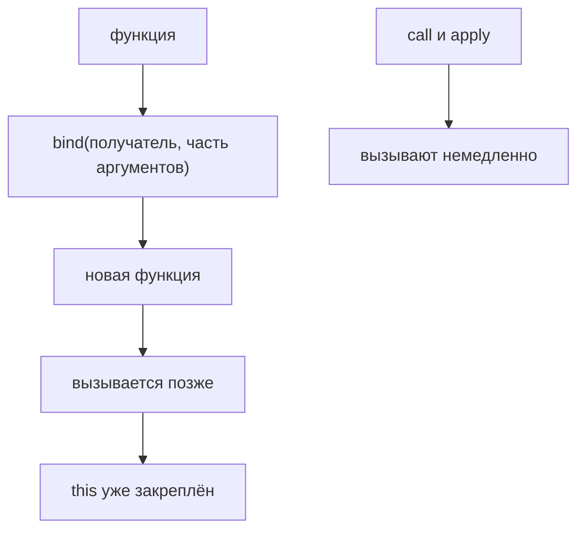

# Метод `bind()`

## Связь с предыдущей главой

Предыдущая глава объяснила `apply()`.

Главная модель была такой: `call()` и `apply()` выполняют функцию немедленно с выбранным объектом выполнения.

До этого `call()` показал другой вариант:

Оба механизма делают invocation сразу.

Теперь появляется следующий вопрос:

> Что делать, если объект выполнения нужно выбрать один раз, а function вызвать позже?

Или так:

Для этого существует `bind()`.

Главный вопрос главы:

> Что отличается от `call()`?

Ответ:

---

## Предварительные требования

Для этой главы нужно понимать:

* что function object можно хранить в переменной;
* что `this` определяется формой invocation;
* что обычный `object.method()` выбирает объект выполнения из формы вызова;
* что `call()` позволяет явно выбрать объект выполнения;
* что `apply()` отличается от `call()` способом передачи arguments;
* что функция начинает выполнение только при invocation;
* что один function object можно использовать с разными объект выполненияs.

Не требуется знать constructors with `bind`, `new`, classes, decorators, polyfills или внутреннее устройство `Function.prototype.bind`. Эти темы будут изучаться позже.

---

## Время изучения

Ориентировочное время:

```text
Чтение главы:            130-160 минут
Разбор схем:             55-75 минут
Запуск примеров:         20-30 минут
Практика:                110-140 минут
Повторение материала:    30 минут
```

Уровень сложности: **L4**.

`bind()` сложен не синтаксисом. Сложность в том, что он не вызывает функцию сразу. Он создает новую function, у которой объект выполнения уже выбран заранее.

---

## Навигация

Предыдущая глава:

```text
docs/01-javascript/31-apply.md
```

Текущая глава:

```text
docs/01-javascript/32-bind.md
```

Следующая глава:

```text
docs/01-javascript/33-objects.md
```

Следующая глава начнет новый раздел и вернется к object значения уже глубже:

> Как устроены objects как основная форма группировки данных и поведения?

---

## Цели обучения

После изучения этой главы вы будете понимать:

* зачем существует `bind()`;
* почему `bind()` не выполняет function сразу;
* что `bind()` создает новую function;
* что объект выполнения в bound function выбран заранее;
* чем `bind()` отличается от `call()` и `apply()`;
* как работает delayed invocation;
* зачем нужна reusable bound function;
* что такое partial arguments на высоком уровне;
* какие ошибки чаще всего встречаются;
* как `bind()` используется в Automation QA.

---

## Мотивация

Начнем с проблемы.

Есть validator:

```javascript
'use strict';

function validateStatus(path, actualStatus, expectedStatus) {
  const message = this.environment + ' ' + path;

  if (actualStatus !== expectedStatus) {
    return message + ' failed';
  }

  return message + ' passed';
}

const stagingConfig = {
  environment: 'staging'
};
```

Через `call()` можно явно выбрать объект выполнения:

```javascript
validateStatus.call(stagingConfig, '/users', 200, 200);
validateStatus.call(stagingConfig, '/orders', 201, 201);
validateStatus.call(stagingConfig, '/profile', 200, 200);
```

Это работает.

Но объект выполнения повторяется каждый раз:

Проблема не в том, что `call()` плохой.

`call()` отлично подходит, когда объект выполнения нужен для одного конкретного invocation.

Проблема другая:

Вопрос:

> Можно ли выбрать объект выполнения один раз и получить function, которую потом удобно вызывать?

`bind()` отвечает:

```text
yes
```

Зачем существует bind():

Центральная мысль:

---

## Теория

Не начинаем с определения. Сначала посмотрим на отличие поведения.

```javascript
const boundValidateStatus = validateStatus.bind(stagingConfig);
```

Эта строка не запускает `validateStatus`.

Она создаёт новую функцию:

```text
validateStatus        —  исходная функция, не изменилась
boundValidateStatus   —  новая функция с закреплённым объектом выполнения
```

Теперь новую функцию можно вызвать обычным образом:

```javascript
boundValidateStatus('/users', 200, 200);
boundValidateStatus('/orders', 201, 201);
```

При каждом таком вызове объект выполнения уже известен:

```text
вызов не задаёт this — его задали один раз, при bind()
```

### Что такое `bind()`

`bind()` — метод объекта функции, который создаёт новую функцию с заранее выбранным объектом выполнения.

Важно:

```text
bind() ничего не выполняет — он только готовит функцию к будущему вызову
```

Синтаксис:

```javascript
const boundFunction = originalFunction.bind(receiver);
```

Модель:

```text
bind()  →  новая функция с закреплённым this
           исходная функция не изменяется
```

### Что отличается от `call()`

`call()`:

```javascript
validateStatus.call(stagingConfig, '/users', 200, 200);
```

`bind()`:

```javascript
const validateInStaging = validateStatus.bind(stagingConfig);
```

### Что отличается от `apply()`

`apply()` решает задачу с упорядоченным списком аргументов:

```javascript
validateStatus.apply(stagingConfig, ['/users', 200, 200]);
```

`bind()` решает другую задачу:

```text
call() и apply()  —  вызвать сейчас с нужным this
bind()            —  получить функцию, которую позже вызовут с этим this
```

### Связанная функция

Функцию, созданную через `bind()`, часто называют связанной функцией.

Это не новый тип значения, отдельный от объектов.

Функция в JavaScript — объект функции. `bind()` возвращает новый объект функции, который можно вызвать.

### Привязанный объект выполнения

Объект, переданный в `bind()`, становится заранее выбранным объектом выполнения для будущих вызовов.

Мысленная модель: постоянный бейдж.

### Отложенный вызов

Отложенный вызов означает:

Это особенно полезно, когда функцию нужно передать дальше, сохранить в переменной или использовать много раз.

В этой главе мы не изучаем обратные вызовы подробно. Обратный вызов — функция, которую передают другому коду для будущего вызова. Эта тема будет отдельной позже.

### Частичное применение аргументов

`bind()` может заранее зафиксировать не только объект выполнения, но и первые аргументы.

```javascript
const validateUsers = validateStatus.bind(stagingConfig, '/users');

console.log(validateUsers(200, 200));
```

Высокоуровневая модель:

```text
подготовить сейчас  →  вызвать потом
```

Подробные сценарии частичного применения аргументов будут изучаться позже. Сейчас важно только увидеть, что `bind()` может подготовить функцию заранее.

---

`bind()` ничего не вызывает — он готовит функцию:


```mermaid
flowchart TD
    A["функция"] --> B["bind(получатель, часть аргументов)"]
    B --> C["новая функция"]
    C --> D["вызывается позже"]
    D --> E["this уже закреплён"]
    F["call и apply"] --> G["вызывают немедленно"]
```

## Внутренний механизм

Спросим главный вопрос главы:

> Что отличается от `call()`?

### Шаг 1. Есть исходная функция

```javascript
function validateStatus(path, actualStatus, expectedStatus) {
  return this.environment + ' ' + path;
}
```

Концептуальное состояние:

```text
validateStatus  —  объект функции
this внутри     —  пока не определён: он зависит от будущего вызова
```

### Шаг 2. Вызывается `bind()`

```javascript
const validateInStaging = validateStatus.bind(stagingConfig);
```

Движок делает так:

```text
1. взять объект функции validateStatus
2. запомнить stagingConfig как закреплённый объект выполнения
3. создать и вернуть новый объект функции с этой пометкой
```

### Шаг 3. Создаётся новая функция

Это ключевой момент.

`bind()` не меняет исходную функцию.

### Шаг 4. Объект выполнения фиксируется в новой функции

```text
validateInStaging
├── ссылается на тело validateStatus
└── закреплённый this ──→ stagingConfig
```

Это концептуальная схема. Мы не изучаем внутренние слоты спецификации и точную реализацию движка.

### Шаг 5. Ничего не выполняется

После `bind()` тело исходной функции ещё не запускалось.

Это ответ на частую ошибку:

> Почему `bind()` ничего не вывел в консоль?

Потому что `bind()` готовит функцию. Вызов будет позже.

### Шаг 6. Связанная функция вызывается позже

```javascript
validateInStaging('/users', 200, 200);
```

Теперь происходит вызов:

```text
аргументы '/users', 200, 200  →  параметрам исходной функции
this                          →  stagingConfig, как закреплено при bind()
```

### Контекст выполнения ещё раз

Когда связанная функция вызывается, JavaScript всё равно создаёт контекст выполнения.

Но объект выполнения берется не из обычной формы вызова:

```text
обычный вызов       →  this определяется тем, как функция вызвана
вызов bound-функции →  this взят из пометки, сделанной при bind()
```

Концептуальное выполнение:

```text
1. создаётся Execution Context для вызова
2. this в нём — закреплённый объект, а не вычисленный из формы вызова
3. параметры получают переданные аргументы
4. выполняется тело исходной функции
```

### Идентичность функции

`bind()` возвращает новую функцию. Поэтому тождественность отличается.

```javascript
const first = validateStatus.bind(stagingConfig);
const second = validateStatus.bind(stagingConfig);

console.log(first === second);
```

Результат:

```text
false
```

Почему:

Объект выполнения может быть тем же самым. Объекты функций всё равно разные.

---

## Ментальная модель

`bind()` удобно понимать через заранее настроенный пульт.

```text
обычная функция │ пульт без настройки: получателя выбирает форма вызова
call()          │ навёл пульт и нажал — один раз, сейчас
bind()          │ настроил пульт заранее и отдал: он всегда нацелен туда же
```

Ещё одна модель: закреплённый водитель.

Модель закреплённого сотрудника: сотрудник привязан к участку — куда бы его ни позвали, работает он на своём участке.

Главное не перепутать две вещи: `bind()` закрепляет объект выполнения, но не
вызывает функцию. Он возвращает новую функцию — вызвать её нужно отдельно.
`call()` и `apply()`, наоборот, вызывают сразу и ничего не закрепляют.

---

## Примеры кода

Примеры находятся в:

```text
examples/01-javascript/chapter-32/
```

Запуск:

```bash
node examples/01-javascript/chapter-32/01-basic-bind.js
node examples/01-javascript/chapter-32/02-bound-function.js
node examples/01-javascript/chapter-32/03-call-vs-bind.js
node examples/01-javascript/chapter-32/04-common-mistakes.js
node examples/01-javascript/chapter-32/05-qa-example.js
node examples/01-javascript/chapter-32/06-reusable-helper.js
```

### Пример 1. Базовый `bind()`

```javascript
'use strict';

function printEnvironment() {
  console.log(this.environment);
}

const stagingConfig = {
  environment: 'staging'
};

const printStagingEnvironment = printEnvironment.bind(stagingConfig);

printStagingEnvironment();
```

Что делает движок:

```text
строка bind()   создаёт новую функцию с закреплённым stagingConfig
строка вызова   выполняет тело printEnvironment, где this — stagingConfig
вывод           staging
```

### Пример 2. Связанная функция

```javascript
'use strict';

function buildUrl(path) {
  return this.baseUrl + path;
}

const apiClient = {
  baseUrl: 'https://api.example.test'
};

const buildApiUrl = buildUrl.bind(apiClient);

console.log(buildApiUrl('/users'));
console.log(buildApiUrl('/orders'));
```

Одна подготовленная функция используется несколько раз.

### Пример 3. `call()` против `bind()`

```javascript
'use strict';

function formatStatus(path, status) {
  return this.environment + ' ' + path + ' ' + status;
}

const config = {
  environment: 'staging'
};

console.log(formatStatus.call(config, '/users', 200));

const formatStagingStatus = formatStatus.bind(config);
console.log(formatStagingStatus('/orders', 201));
```

Сравнение:

| | `call()` / `apply()` | `bind()` |
| --- | --- | --- |
| когда выполняется | немедленно | позже |
| что возвращает | результат функции | новую функцию |

### Пример 4. Типичные ошибки

```javascript
'use strict';

function printBaseUrl() {
  console.log(this.baseUrl);
}

const client = {
  baseUrl: 'https://api.example.test'
};

const preparedPrint = printBaseUrl.bind(client);

console.log('After bind');
preparedPrint();
```

`bind()` не выводит `baseUrl`. Вывод происходит только при вызове `preparedPrint()`.

### Пример 5. Пример из автоматизации тестов

```javascript
'use strict';

function validateResponse(path, actualStatus, expectedStatus) {
  const prefix = this.project + ' ' + this.environment;

  if (actualStatus === expectedStatus) {
    return prefix + ' ' + path + ' passed';
  }

  return prefix + ' ' + path + ' failed';
}

const qaConfig = {
  project: 'billing',
  environment: 'staging'
};

const validateBillingStaging = validateResponse.bind(qaConfig);

console.log(validateBillingStaging('/invoices', 200, 200));
console.log(validateBillingStaging('/payments', 500, 200));
```

QA смысл: метод, переданный в колбэк раннера, теряет объект выполнения — `bind()` закрепляет его заранее.

### Пример 6. Переиспользуемая вспомогательная функция

```javascript
'use strict';

function createReportLine(testName, status) {
  return this.suite + ': ' + testName + ' -> ' + status;
}

const smokeSuite = {
  suite: 'smoke'
};

const createSmokeReportLine = createReportLine.bind(smokeSuite);

console.log(createSmokeReportLine('login', 'passed'));
console.log(createSmokeReportLine('checkout', 'failed'));
```

Такую функцию удобно передавать или использовать повторно без постоянного `.call(smokeSuite, ...)`.

---

## Частые вопросы

### `bind()` вызывает функцию?

Нет.

Вызов происходит позже, когда вызывается возвращённая функция.

### `bind()` меняет исходную функцию?

Нет.

### Можно ли вызвать связанную функцию много раз?

Да.

Именно поэтому `bind()` полезен:

```text
объект выполнения задают один раз,
а вызывают подготовленную функцию сколько угодно раз
```

### Чем `bind()` отличается от `call()`?

`call()` вызывает функцию немедленно и задаёт `this` только для этого одного
вызова. `bind()` ничего не вызывает: он возвращает новую функцию, у которой
`this` закреплён для всех будущих вызовов.

```javascript
validateStatus.call(stagingConfig, '/users', 200, 200); // выполнено сейчас
const bound = validateStatus.bind(stagingConfig);       // выполнится позже
```

### Чем `bind()` отличается от `apply()`?

`apply()` вызывает функцию сразу и передаёт аргументы массивом или похожей коллекцией.

`bind()` возвращает новую функцию и откладывает вызов.

---

## Распространённые мифы

### Миф: `bind()` просто устанавливает `this` внутри существующей функции

Реальность:

Исходная функция остаётся доступной как раньше.

### Миф: после `bind()` объект выполнения можно легко заменить обычным вызовом

Реальность:

В этой главе достаточно помнить: объект выполнения выбран заранее. Особенности с конструкторами будут изучаться позже.

### Миф: `bind()` нужен только для оторванных функций

Реальность:

Оторванная функция — один полезный сценарий.

Более общая идея: `bind()` нужен везде, где вызов произойдёт не здесь, а
где-то дальше — в обратном вызове, в обработчике события, в очереди задач.
В момент такого вызова объекта слева от точки уже не будет, и закрепить его
надо заранее.

---

## Распространённые ошибки

### Ошибка 1. Ожидать немедленного выполнения

Неправильно:

```javascript
const result = validateStatus.bind(stagingConfig);
console.log(result);
```

Что произошло:

`result` — это функция, а не результат выполнения проверки.

Исправление:

```javascript
const validateInStaging = validateStatus.bind(stagingConfig);
const result = validateInStaging('/users', 200, 200);
console.log(result);
```

### Ошибка 2. Создавать связанную функцию и не сохранять её

Неправильно:

```javascript
validateStatus.bind(stagingConfig);
validateStatus('/users', 200, 200);
```

`bind()` вернул новую функцию, но она потерялась.

Исправление:

```javascript
const validateInStaging = validateStatus.bind(stagingConfig);
validateInStaging('/users', 200, 200);
```

### Ошибка 3. Думать, что `bind()` меняет исходную функцию

Неправильная модель: будто `bind()` меняет саму функцию, к которой применён.

Правильная модель: создаётся новая функция-обёртка, а исходная остаётся прежней.

### Ошибка 4. Скрывать намерение

Иногда `bind()` ухудшает читаемость, если объект выполнения нужен только один раз.

```javascript
const once = validateStatus.bind(stagingConfig);
console.log(once('/users', 200, 200));
```

Если вызов одноразовый, `call()` может быть понятнее:

```javascript
console.log(validateStatus.call(stagingConfig, '/users', 200, 200));
```

---

## Практическое использование

`bind()` полезен, когда функцию нужно передать дальше, а получатель должен
остаться прежним.

Типичные случаи:

* заранее настроенный форматировщик;
* переиспользуемая проверка;
* функция, привязанная к объекту настройки;
* функция, которую нужно передать дальше без потери объекта выполнения;
* подготовленная операция для конкретной среды.

Сравнение:

| Задача | Инструмент |
| --- | --- |
| выполнить сейчас с чужим объектом | `call()` |
| то же, аргументы в массиве | `apply()` |
| передать функцию дальше | `bind()` |

Модель читаемости: в современном коде ту же задачу часто решает стрелочная обёртка — она короче и не требует помнить о необратимости привязки.

Пример именования:

```javascript
const validateStagingResponse = validateResponse.bind(stagingConfig);
```

Такое имя говорит:

```text
этот помощник проверяет ответы стенда
```

---

## Использование в Automation QA

В автоматизации тестов `bind()` встречается там, где вспомогательная функция должна работать с заранее выбранным объектом.

### Переиспользуемые проверки

```javascript
'use strict';

function validateStatus(path, actualStatus, expectedStatus) {
  return this.environment + ' ' + path + ': ' + (actualStatus === expectedStatus);
}

const staging = {
  environment: 'staging'
};

const validateStagingStatus = validateStatus.bind(staging);
```

Модель:

```text
validateStatus.bind(staging)  →  функция, всегда работающая со staging
```

### Вспомогательные проверки

Функция может использовать настройку:

```javascript
function validateStatus(path, actualStatus, expectedStatus) {
  return this.environment + ' ' + path;
}
```

Вместо того чтобы передавать настройку каждый раз, можно подготовить связанную функцию.

### Вспомогательные функции клиента API

Метод клиента API может зависеть от `baseUrl`.

```javascript
const stagingClient = sendRequest.bind({ baseUrl: 'https://staging.example.com' });
```

### Вспомогательные методы объектов страниц

В будущих главах про автоматизацию тестов мы будем изучать объекты страниц подробно. Сейчас достаточно одной идеи:

```text
метод страницы работает со своим объектом страницы,
и если метод передают куда-то как значение, эту связь нужно закрепить
```

### Привязка конфигурации

Для разных окружений можно подготовить разные функции:

```javascript
const validateStaging = validateStatus.bind({ environment: 'staging' });
const validateProd = validateStatus.bind({ environment: 'production' });
```

Это делает тестовый код выразительнее:

```text
validateStaging('/users', 200, 200)
validateProd('/health', 200, 200)
```

---

## Практика

Практика находится в:

```text
practice/01-javascript/32-bind.md
```

Рекомендуемый порядок:

```text
1. Ответить на концептуальные вопросы.
2. Предсказать вывод кода.
3. Запустить examples/01-javascript/chapter-32/.
4. Выполнить debugging tasks.
5. Сделать QA mini-project.
6. Свериться с solutions/01-javascript/32-bind.md.
```

---

## Решения

Решения находятся в:

```text
solutions/01-javascript/32-bind.md
```

Не открывайте решения до самостоятельной попытки. В этой теме особенно важно
самому различить три вещи: где функция закрепляется, где она вызывается и
какой объект выполнения она получит при этом вызове.

---

## Итоги

`bind()` завершает цепочку:

Теперь модель объекта выполнения стала полной на базовом уровне: `this` задаётся формой вызова, а `call`, `apply` и `bind` позволяют задать его явно.

Главное отличие `bind()`:

```text
bind() возвращает функцию
```

Он не выполняет исходную функцию сразу.

---

## Что нужно запомнить

* `bind()` нужен для явного выбора объект выполнения заранее.
* `bind()` создаёт новую функцию.
* `bind()` не вызывает исходную функцию немедленно.
* Связанную функцию можно вызвать позже.
* Объект выполнения в связанной функции выбран заранее.
* `call()` и `apply()` выполняют вызов сразу.
* `bind()` удобен, когда один объект выполнения нужен для многих будущих вызовов.
* `bind()` не изменяет исходную функцию.
* Каждый вызов `bind()` создаёт новый объект функции.
* Частичное применение аргументов возможно, но в этой главе это только общая идея.

---

## Проверьте себя

Ответьте без запуска кода.

1. Что возвращает `bind()`?
2. Выполняет ли `bind()` исходную функцию сразу?
3. Чем `bind()` отличается от `call()`?
4. Чем `bind()` отличается от `apply()`?
5. Почему два вызова `sameFunction.bind(объект выполнения)` создают разные значения?
6. Когда `bind()` улучшает читаемость?
7. Почему объект выполнения в связанной функции считается заранее выбранным?
8. Что произойдет, если вызвать `bind()` и не сохранить результат?
9. Как `bind()` может помочь во вспомогательной функции теста?
10. Какая следующая тема логически продолжает этот раздел?

### Ответы

1. Новую функцию с закреплённым объектом выполнения. Исходная функция при этом не меняется.
2. Нет. `bind()` только готовит функцию; тело выполнится при вызове возвращённой функции.
3. `call()` вызывает функцию сразу и задаёт `this` для одного вызова. `bind()` ничего не вызывает и закрепляет `this` для всех будущих вызовов.
4. `apply()` тоже вызывает сразу, отличаясь лишь передачей аргументов массивом. `bind()` откладывает вызов.
5. Каждый вызов `bind()` создаёт новый объект функции. Сравнение таких значений через `===` даёт `false`, хотя тело у них одно и то же.
6. Когда объект выполнения один и тот же для множества вызовов: подготовленная функция читается как самостоятельное действие, и её не нужно каждый раз сопровождать объектом.
7. Потому что он задан один раз, при создании функции, и форма будущего вызова его уже не меняет.
8. Ничего не произойдёт: новая функция создана и сразу потеряна, а исходная не изменилась. Это типичная ошибка — ожидать, что `bind()` изменит функцию на месте.
9. Позволяет заранее закрепить настройку: подготовить проверку для конкретного окружения или клиента и дальше вызывать её без повторной передачи конфигурации.
10. Объекты: их устройство, свойства и способы обращения к ним.

