# Objects

## Связь с предыдущей главой

Предыдущая глава завершила блок Functions и объяснила `bind()`.

Главная модель была такой:

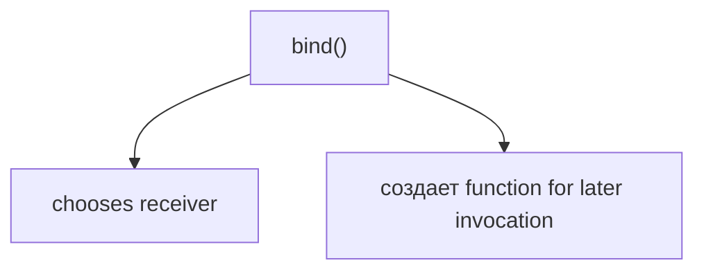

В главах про `this`, `call()`, `apply()` и `bind()` мы постоянно видели objects:

```javascript
const apiClient = {
  baseUrl: 'https://api.example.test'
};
```

Там object был нужен как объект выполнения:

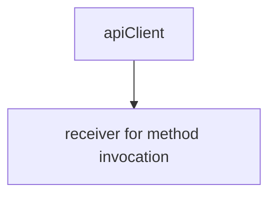

Теперь мы начинаем новый раздел и возвращаемся к objects как к самостоятельной теме.

Главный вопрос этой главы:

> Как хранить related data together?

Не как десять отдельных variables.

А как одну entity:

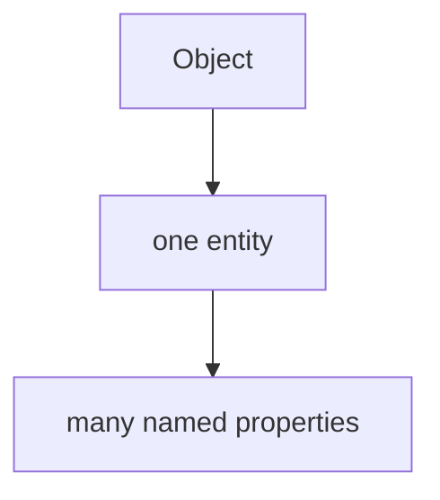

---

## Предварительные требования

Для этой главы нужно понимать:

* что primitive value представляет одно indivisible value;
* что variable дает named access к value;
* что `const` запрещает reassignment identifier;
* что function object тоже относится к object значения;
* что `this` часто указывает на объект выполнения object;
* что dot notation уже встречалась в `object.method()`;
* что references объясняют shared object поведение на концептуальном уровне.

Не требуется знать prototypes, descriptors, classes, `Object.create()`, `Object.assign()`, destructuring, optional chaining, property attributes или JSON. Эти темы будут изучаться позже.

---

## Время изучения

Ориентировочное время:

```text
Чтение главы:            130-160 минут
Разбор схем:             55-75 минут
Запуск примеров:         20-30 минут
Практика:                110-140 минут
Повторение материала:    30 минут
```

Уровень сложности: **L3**.

Синтаксис object literal выглядит простым. Но правильная модель objects важна для всего, что будет дальше: destructuring, optional chaining, object methods, prototypes, classes, API testing and framework configuration.

---

## Навигация

Предыдущая глава:

```text
docs/01-javascript/32-bind.md
```

Текущая глава:

```text
docs/01-javascript/33-objects.md
```

Следующая глава:

```text
docs/01-javascript/34-destructuring.md
```

Следующая глава ответит:

> Как удобно извлекать значения из object?

---

## Цели обучения

После изучения этой главы вы будете понимать:

* зачем objects существуют;
* почему grouping related data делает код понятнее;
* что object literal создает object value;
* что property состоит из key и value;
* как читать properties через dot notation;
* когда нужна bracket notation;
* как добавлять properties;
* как обновлять properties;
* как удалять properties на базовом уровне;
* почему object не стоит описывать только как "key-value pairs";
* как objects используются в Automation QA;
* какие ошибки чаще всего возникают при работе с objects.

---

## Мотивация

Начнем с проблемы.

Допустим, тест проверяет пользователя:

```javascript
const userId = 101;
const userName = 'Anna';
const userRole = 'admin';
const userActive = true;
const userEmail = 'anna@example.test';
```

Каждая variable понятна отдельно.

Но программа пока не говорит главного:

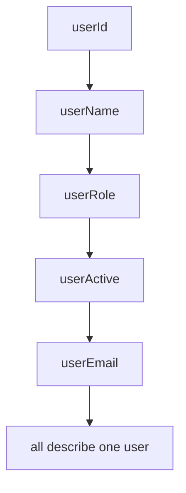

Данные связаны, но связь выражена только в голове читателя.

Проблема:

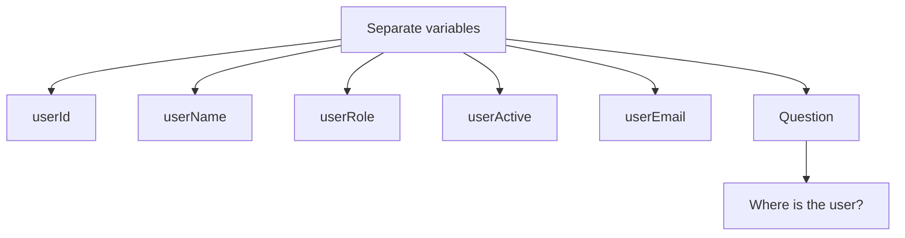

Object позволяет выразить эту связь явно:

```javascript
const user = {
  id: 101,
  name: 'Anna',
  role: 'admin',
  active: true,
  email: 'anna@example.test'
};
```

Теперь в коде есть одна entity:

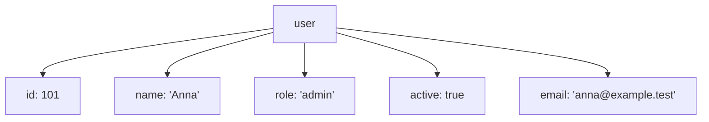

Главное изменение:

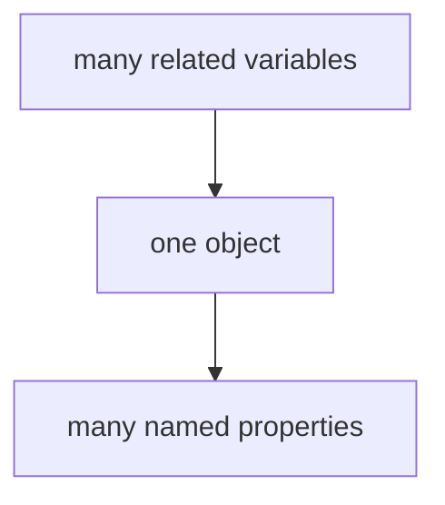

Для Automation QA это не абстрактная тема. API responses, request payloads, user profiles, configuration objects and expected data almost always are objects.

---

## Теория

Не начинаем с определения. Сначала сформулируем проблему.

Если данные описывают одну сущность, они должны быть сгруппированы:

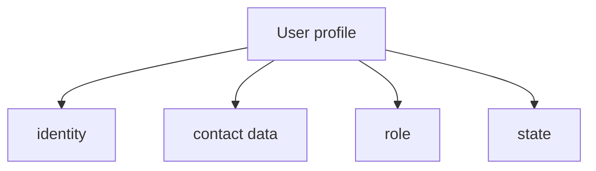

Object решает эту задачу:

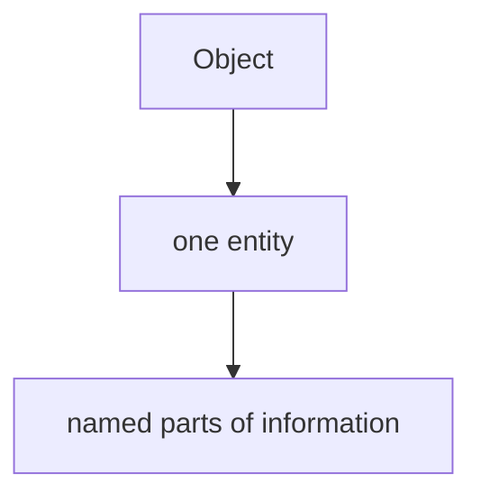

### Почему objects существуют

Primitive значения хороши для отдельных значений:

```javascript
const statusCode = 200;
const isActive = true;
const environment = 'staging';
```

Но программа редко работает только с одним isolated value.

В реальном коде значения образуют смысловые группы:

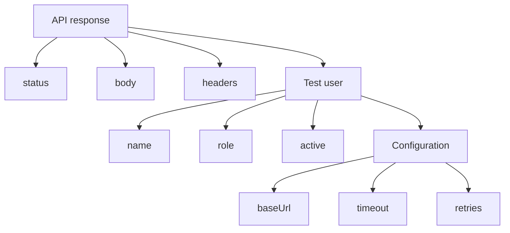

Object нужен, чтобы такая группа стала одним value.

Важно:

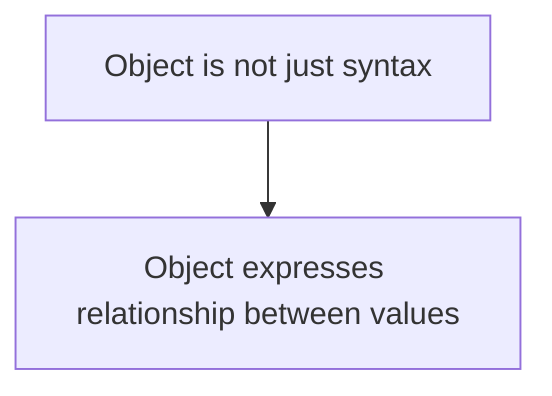

### Object literal

Object literal - это способ создать object value прямо в коде:

```javascript
const user = {
  id: 101,
  name: 'Anna',
  role: 'admin'
};
```

Модель:

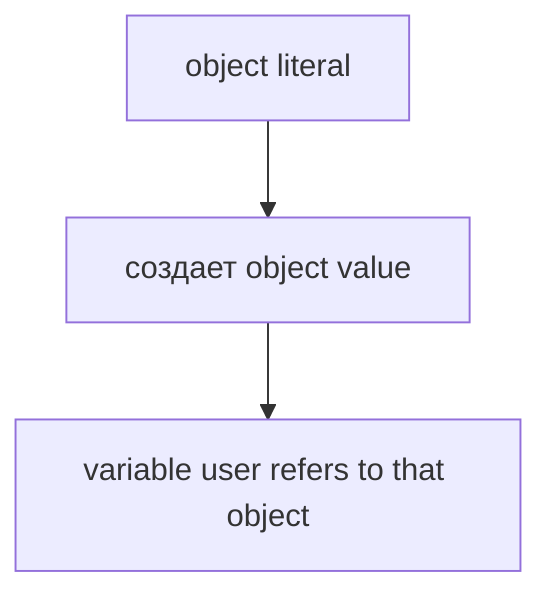

В этой главе мы используем references только на высоком уровне. Подробности уже были в главе `References`.

### Property

Object состоит из properties.

Property - это named part of an object.

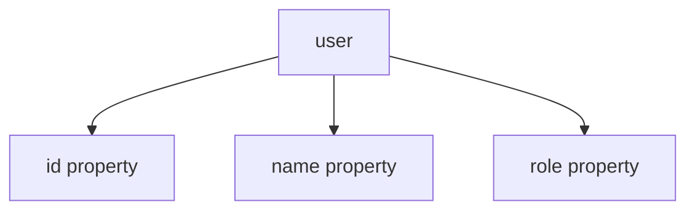

Каждая property имеет:

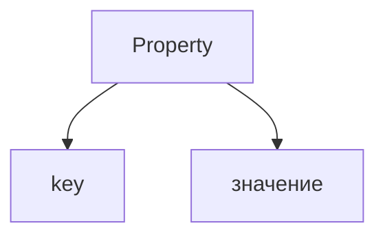

Пример:

```javascript
const user = {
  name: 'Anna'
};
```

Здесь:

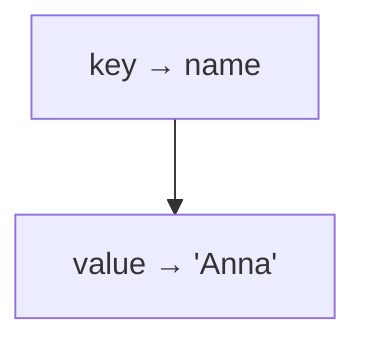

Не стоит сводить object только к фразе "key-value pairs". Такая фраза полезна, но неполна. Для чтения кода важнее видеть object как одну entity with named properties.

### Keys

Key - это имя property.

```javascript
const response = {
  status: 200,
  ok: true
};
```

Keys:

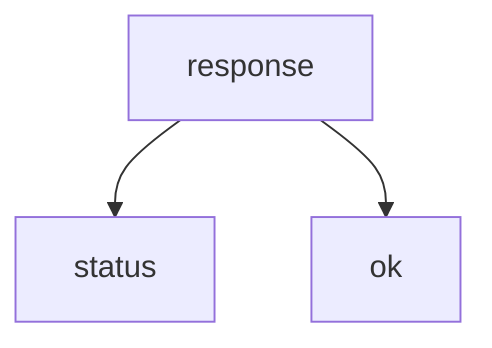

Key отвечает на вопрос:

> Как называется эта часть object?

### Values

Value - это информация, stored in property.

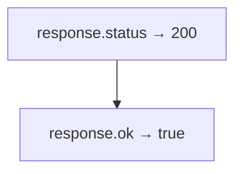

Values могут быть разными:

```javascript
const testResult = {
  name: 'login test',
  passed: true,
  durationMs: 340,
  error: null
};
```

На этом уровне достаточно понимать:

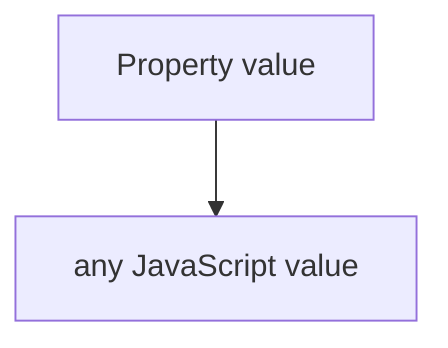

Подробные главы про nested objects, arrays and methods будут позже.

### Dot notation

Dot notation используется, когда property key известен заранее и является обычным identifier-like name:

```javascript
console.log(user.name);
```

Модель:

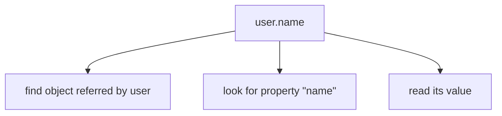

Dot notation хорошо читается:

```javascript
console.log(response.status);
console.log(response.ok);
console.log(config.baseUrl);
```

### Bracket notation

Bracket notation используется, когда key:

* хранится в variable;
* содержит пробел или символы, которые нельзя написать после dot;
* выбирается dynamically.

Пример с dynamic key:

```javascript
const fieldName = 'role';

console.log(user[fieldName]);
```

Модель:

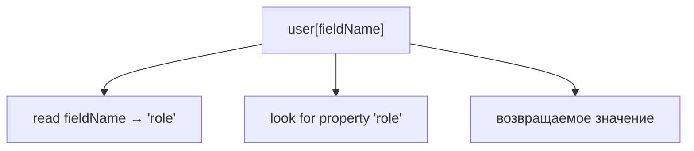

Bracket notation required:

```javascript
const response = {
  'status code': 200
};

console.log(response['status code']);
```

Такой key нельзя прочитать через `response.status code`.

### Reading properties

Reading property не меняет object.

```javascript
const role = user.role;
```

Модель:

```mermaid
flowchart TD
    N1["user"]
    N2["role: 'admin'"]
    N3["read role"]
    N4["'admin'"]
    N1 --> N2
    N1 --> N3
    N3 --> N4
```

Если property отсутствует, результатом будет `undefined`:

```javascript
console.log(user.permissions);
```

На этом этапе важно не пугаться:

```mermaid
flowchart TD
    N1["значение отсутствует property"]
    N2["undefined"]
    N1 --> N2
```

Optional Chaining будет изучаться позже. Он помогает безопаснее читать вложенные свойства, но сейчас мы не вводим эту тему.

### Adding properties

Object можно расширить, добавив новую property:

```javascript
user.lastLogin = '2026-06-26';
```

Модель:

```mermaid
flowchart TD
    N1["Before"]
    N2["user has нет lastLogin"]
    N3["Write"]
    N4["user.lastLogin = '2026-06-26'"]
    N5["After"]
    N6["user has lastLogin property"]
    N1 --> N2
    N1 --> N3
    N3 --> N4
    N3 --> N5
    N5 --> N6
```

### Updating properties

Если property уже существует, assignment обновляет ее value:

```javascript
user.role = 'owner';
```

Модель:

```mermaid
flowchart TD
    N1["Before"]
    N2["role: 'admin'"]
    N3["Update"]
    N4["role = 'owner'"]
    N5["After"]
    N6["role: 'owner'"]
    N1 --> N2
    N1 --> N3
    N3 --> N4
    N3 --> N5
    N5 --> N6
```

### Deleting properties

`delete` удаляет property из object на базовом уровне:

```javascript
delete user.lastLogin;
```

Модель:

```mermaid
flowchart TD
    N1["Before"]
    N2["lastLogin exists"]
    N3["delete"]
    N4["remove property"]
    N5["After"]
    N6["lastLogin is absent"]
    N1 --> N2
    N1 --> N3
    N3 --> N4
    N3 --> N5
    N5 --> N6
```

Мы не разбираем property descriptors and attributes. Они объясняют, почему не каждую property всегда можно удалить. Это будущая глава.

### Object lifecycle

Базовый lifecycle object в этой главе:

```mermaid
flowchart TD
    N1["создать object"]
    N2["read properties"]
    N3["add properties"]
    N4["update properties"]
    N5["delete properties when needed"]
    N1 --> N2
    N2 --> N3
    N3 --> N4
    N4 --> N5
```

Это не lifecycle memory management. Garbage Collector будет изучаться позже.

---

## Внутренний механизм

Спросим вопрос главы:

> Why is grouping useful?

Когда engine видит object literal:

```javascript
const user = {
  id: 101,
  name: 'Anna',
  role: 'admin'
};
```

Концептуально происходит следующее:

```mermaid
flowchart TD
    N1["Object literal"]
    N2["создать object value"]
    N3["создать properties"]
    N4["id"]
    N5["name"]
    N6["role"]
    N7["user refers to object"]
    N1 --> N2
    N2 --> N3
    N3 --> N4
    N3 --> N5
    N3 --> N6
    N3 --> N7
```

### Reading flow

```javascript
user.name;
```

Engine делает:

```mermaid
flowchart TD
    N1["read identifier user"]
    N2["get object value"]
    N3["look for property key &quot;name&quot;"]
    N4["вернуть property value"]
    N1 --> N2
    N2 --> N3
    N3 --> N4
```

### Writing flow

```javascript
user.role = 'owner';
```

Engine делает:

```mermaid
flowchart TD
    N1["read identifier user"]
    N2["get object value"]
    N3["find or создать property &quot;role&quot;"]
    N4["store new value"]
    N1 --> N2
    N2 --> N3
    N3 --> N4
```

Если property существовала, value обновляется.

Если property не существовала, property добавляется.

### Dot notation flow

```javascript
user.email;
```

```mermaid
flowchart TD
    N1["dot notation"]
    N2["property key is written in code"]
    N3["&quot;email&quot;"]
    N1 --> N2
    N2 --> N3
```

### Bracket notation flow

```javascript
const key = 'email';

user[key];
```

```mermaid
flowchart TD
    N1["bracket notation"]
    N2["evaluate expression inside brackets"]
    N3["key → 'email'"]
    N4["use 'email' as property key"]
    N1 --> N2
    N2 --> N3
    N3 --> N4
```

### Memory intuition

На высоком уровне:

```mermaid
flowchart TD
    N1["variable user"]
    N2["refers to object value"]
    N3["object contains named properties"]
    N1 --> N2
    N2 --> N3
```

Это только intuition. В этой главе мы не рисуем precise engine implementation, property attributes, hidden classes or optimization details.

### Property lookup

В этой главе property lookup означает простой вопрос:

> Есть ли у этого object property с таким key?

```mermaid
flowchart TD
    N1["объект"]
    N2["key exists"]
    N3["возвращаемое значение"]
    N4["key does not exist"]
    N5["вернуть undefined"]
    N1 --> N2
    N1 --> N3
    N1 --> N4
    N4 --> N5
```

Prototype Chain тоже участвует в property lookup, но это будущая глава. Сейчас мы говорим только о собственных, очевидных properties object literal.

### Object identity preview

Object identity уже встречалась в главах про References и Equality.

Здесь достаточно напомнить:

```mermaid
flowchart TD
    N1["Two objects with same properties"]
    N2["can still be different objects"]
    N1 --> N2
```

Пример:

```javascript
const firstUser = { id: 101 };
const secondUser = { id: 101 };

console.log(firstUser === secondUser);
```

Результат:

```text
false
```

Подробно object comparison уже рассматривался в `Equality`, а более глубокие модели будут возвращаться в будущих главах.

---

## Ментальная модель

Object удобно представлять как profile card.

```mermaid
flowchart TD
    N1["Profile card: user"]
    N2["id: 101"]
    N3["name: Anna"]
    N4["role: admin"]
    N5["active: true"]
    N1 --> N2
    N1 --> N3
    N1 --> N4
    N1 --> N5
```

Одна карточка описывает одну entity.

Другая модель: folder.

```mermaid
flowchart TD
    N1["Folder: test user"]
    N2["document: id"]
    N3["document: name"]
    N4["document: role"]
    N5["document: active"]
    N1 --> N2
    N1 --> N3
    N1 --> N4
    N1 --> N5
```

Еще одна модель: cabinet with labeled boxes.

```mermaid
flowchart TD
    N1["Cabinet: config"]
    N2["box &quot;baseUrl&quot;"]
    N3["box &quot;timeout&quot;"]
    N4["box &quot;retries&quot;"]
    N1 --> N2
    N1 --> N3
    N1 --> N4
```

Важное ограничение моделей:

```mermaid
flowchart TD
    N1["These models explain grouping"]
    N2["they do not describe exact engine storage"]
    N1 --> N2
```

Главная модель:

```mermaid
flowchart TD
    N1["Object"]
    N2["one entity"]
    N3["many named properties"]
    N1 --> N2
    N2 --> N3
```

---

## Примеры кода

Примеры находятся в:

```text
examples/01-javascript/chapter-33/
```

Запуск:

```bash
node examples/01-javascript/chapter-33/01-object-literal.js
node examples/01-javascript/chapter-33/02-read-properties.js
node examples/01-javascript/chapter-33/03-update-properties.js
node examples/01-javascript/chapter-33/04-bracket-notation.js
node examples/01-javascript/chapter-33/05-common-mistakes.js
node examples/01-javascript/chapter-33/06-qa-example.js
```

### Пример 1. Object literal

```javascript
const user = {
  id: 101,
  name: 'Anna',
  role: 'admin',
  active: true
};

console.log(user);
```

Object literal группирует related data.

### Пример 2. Read properties

```javascript
const user = {
  id: 101,
  name: 'Anna',
  role: 'admin',
  active: true
};

console.log(user.name);
console.log(user.role);
```

Dot notation читает properties by key.

### Пример 3. Update properties

```javascript
const user = {
  id: 101,
  name: 'Anna',
  role: 'admin',
  active: true
};

user.role = 'owner';
user.lastLogin = '2026-06-26';

console.log(user.role);
console.log(user.lastLogin);
```

Assignment может обновлять существующую property или добавлять новую.

### Пример 4. Bracket notation

```javascript
const user = {
  id: 101,
  name: 'Anna',
  role: 'admin',
  'last login': '2026-06-26'
};

const fieldName = 'role';

console.log(user[fieldName]);
console.log(user['last login']);
```

Bracket notation нужна для dynamic keys and keys that cannot be written after dot.

### Пример 5. Типичные ошибки

```javascript
const user = {
  id: 101,
  name: 'Anna'
};

console.log(user.email);

user.email = 'anna@example.test';

console.log(user.email);
```

Missing property дает `undefined`. После adding property value доступно.

### Пример 6. QA example

```javascript
const apiResponse = {
  status: 200,
  body: {
    id: 101,
    name: 'Anna',
    role: 'admin'
  }
};

const expectedUser = {
  id: 101,
  name: 'Anna',
  role: 'admin'
};

console.log(apiResponse.status);
console.log(apiResponse.body.name);
console.log(expectedUser.role);
```

Nested object показан только conceptually. Подробная работа с вложенными structures будет развиваться дальше.

---

## Частые вопросы

### Object - это просто key-value pairs?

Это полезное короткое описание, но недостаточное.

Лучше думать так:

```mermaid
flowchart TD
    N1["Object"]
    N2["one entity"]
    N3["many named properties"]
    N1 --> N2
    N2 --> N3
```

Key-value view помогает читать property. Entity view помогает проектировать данные.

### Почему `const user = {}` позволяет менять `user.name`?

`const` запрещает reassignment identifier.

```mermaid
flowchart TD
    N1["const user"]
    N2["cannot point to another value"]
    N1 --> N2
```

Но object properties можно изменять:

```mermaid
flowchart TD
    N1["user.name"]
    N2["property inside object can be updated"]
    N1 --> N2
```

Object freezing будет изучаться позже.

### Что будет, если property отсутствует?

Reading missing property returns `undefined`.

```mermaid
flowchart TD
    N1["object has нет key"]
    N2["undefined"]
    N1 --> N2
```

### Когда нужна bracket notation?

Bracket notation нужна, когда key выбирается dynamically или не может быть записан через dot notation.

```javascript
const key = 'status';

response[key];
```

### Можно ли удалять properties?

Да, через `delete`, но в этой главе мы рассматриваем только базовую модель. Подробности property descriptors будут позже.

---

## Распространенные мифы

### Миф: object нужен только для больших данных

Реальность:

Object нужен там, где есть related data.

```mermaid
flowchart TD
    N1["Even three related values"]
    N2["can justify object"]
    N1 --> N2
```

### Миф: dot notation и bracket notation делают разные вещи

Реальность:

Обе формы читают property by key. Разница в том, как key задается.

```mermaid
flowchart TD
    N1["dot"]
    N2["key written directly"]
    N3["bracket"]
    N4["key comes from expression"]
    N1 --> N2
    N1 --> N3
    N3 --> N4
```

### Миф: `delete` присваивает `undefined`

Реальность:

`delete` удаляет property.

```mermaid
flowchart TD
    N1["property exists with undefined"]
    N2["≠"]
    N3["property does not exist"]
    N1 --> N2
    N2 --> N3
```

Подробные способы проверять наличие property будут изучаться позже.

---

## Типичные ошибки

### Ошибка 1. Хранить related data в отдельных variables

Неправильно:

```javascript
const baseUrl = 'https://api.example.test';
const timeout = 5000;
const retries = 2;
```

Если это одна configuration, лучше сгруппировать:

```javascript
const config = {
  baseUrl: 'https://api.example.test',
  timeout: 5000,
  retries: 2
};
```

### Ошибка 2. Использовать dot notation для dynamic key

Неправильно:

```javascript
const fieldName = 'role';

console.log(user.fieldName);
```

Что произошло:

```mermaid
flowchart TD
    N1["user.fieldName"]
    N2["looks for key &quot;fieldName&quot;"]
    N1 --> N2
```

Исправление:

```javascript
console.log(user[fieldName]);
```

### Ошибка 3. Думать, что missing property - это ошибка syntax

```javascript
console.log(user.email);
```

Если `email` отсутствует, результат `undefined`.

Это runtime result, а не syntax error.

### Ошибка 4. Путать updating и adding

```javascript
user.role = 'owner';
user.email = 'anna@example.test';
```

Если `role` существовал, он обновился.

Если `email` не существовал, он был добавлен.

### Ошибка 5. Удалять property там, где лучше создать новый object

В тестовых данных иногда лучше явно создать нужный expected object, чем сначала создать лишнее поле и удалить его.

```mermaid
flowchart TD
    N1["clear test data"]
    N2["better assertions"]
    N1 --> N2
```

Immutable patterns будут изучаться позже.

---

## Практическое использование

Objects используются каждый раз, когда нужно выразить entity.

### Configuration object

```javascript
const config = {
  baseUrl: 'https://api.example.test',
  timeout: 5000,
  retries: 2
};
```

Модель:

```mermaid
flowchart TD
    N1["config"]
    N2["baseUrl"]
    N3["timeout"]
    N4["retries"]
    N1 --> N2
    N1 --> N3
    N1 --> N4
```

### User profile

```javascript
const user = {
  id: 101,
  name: 'Anna',
  role: 'admin',
  active: true
};
```

### Request payload

```javascript
const createUserPayload = {
  name: 'Anna',
  role: 'admin',
  active: true
};
```

### Ожидаемый результат

```javascript
const expectedUser = {
  id: 101,
  name: 'Anna',
  role: 'admin'
};
```

Главный практический вопрос:

> Какие значения принадлежат одной entity?

Если ответ ясен, object часто делает код лучше.

---

## Использование в Automation QA

Automation QA код почти невозможно писать без objects.

### API response objects

Response часто выглядит как object:

```javascript
const response = {
  status: 200,
  body: {
    id: 101,
    name: 'Anna'
  }
};
```

Даже если реальный response приходит из HTTP client, в тесте вы обычно работаете с object-like structure.

### Test data objects

```javascript
const testUser = {
  name: 'Anna',
  email: 'anna@example.test',
  role: 'admin'
};
```

Такой object легче передавать в helpers, чем набор отдельных arguments.

### User profiles

```mermaid
flowchart TD
    N1["User profile"]
    N2["identity"]
    N3["credentials"]
    N4["role"]
    N5["state"]
    N1 --> N2
    N1 --> N3
    N1 --> N4
    N1 --> N5
```

В тестах профили часто становятся fixtures. Fixtures будут подробно изучаться в Automation QA части курса.

### Configuration objects

```javascript
const stagingConfig = {
  baseUrl: 'https://staging.example.test',
  timeout: 5000,
  retries: 2
};
```

Configuration object делает setup читаемым:

```mermaid
flowchart TD
    N1["one environment"]
    N2["one config object"]
    N1 --> N2
```

### Request payloads

```javascript
const payload = {
  name: 'Anna',
  role: 'admin'
};
```

Payload как object помогает явно видеть, что отправляется в API.

### Expected vs actual structure

```mermaid
flowchart TD
    N1["expectedUser"]
    N2["what test expects"]
    N3["actualUser"]
    N4["what API returned"]
    N1 --> N2
    N1 --> N3
    N3 --> N4
```

Чем яснее object structure, тем проще писать assertions.

---

## Диаграммы главы

### 1. Why objects exist

```mermaid
flowchart TD
    N1["Related data"]
    N2["needs one entity"]
    N3["Object"]
    N1 --> N2
    N2 --> N3
```

### 2. Separate variables

```mermaid
flowchart TD
    N1["userId"]
    N2["userName"]
    N3["userRole"]
    N4["userActive"]
    N5["many names, hidden relationship"]
    N4 --> N5
    N1 --> N2
    N2 --> N3
    N3 --> N4
```

### 3. Grouped data

```mermaid
flowchart TD
    N1["user"]
    N2["id"]
    N3["name"]
    N4["role"]
    N5["active"]
    N1 --> N2
    N1 --> N3
    N1 --> N4
    N1 --> N5
```

### 4. Object literal

```mermaid
flowchart TD
    N1["{"]
    N2["key: value"]
    N3["}"]
    N4["object value"]
    N3 --> N4
    N1 --> N2
    N2 --> N3
```

### 5. Property structure

```mermaid
flowchart TD
    N1["Property"]
    N2["key"]
    N3["значение"]
    N1 --> N2
    N1 --> N3
```

### 6. Keys and значения

```mermaid
flowchart TD
    N1["name: 'Anna'"]
    N2["значение"]
    N3["key"]
    N1 --> N2
    N1 --> N3
```

### 7. Reading property

```mermaid
flowchart TD
    N1["user.name"]
    N2["read property &quot;name&quot;"]
    N3["'Anna'"]
    N1 --> N2
    N2 --> N3
```

### 8. Writing property

```mermaid
flowchart TD
    N1["user.email = value"]
    N2["write value into property"]
    N1 --> N2
```

### 9. Updating property

```mermaid
flowchart TD
    N1["role: 'admin'"]
    N2["role = 'owner'"]
    N3["role: 'owner'"]
    N1 --> N2
    N2 --> N3
```

### 10. Deleting property

```mermaid
flowchart TD
    N1["property exists"]
    N2["delete property"]
    N3["property absent"]
    N1 --> N2
    N2 --> N3
```

### 11. Dot notation

```mermaid
flowchart TD
    N1["object.key"]
    N2["key written directly"]
    N1 --> N2
```

### 12. Bracket notation

```mermaid
flowchart TD
    N1["object[expression]"]
    N2["expression produces key"]
    N1 --> N2
```

### 13. Текущая модель JavaScript

```mermaid
flowchart TD
    N1["Values"]
    N2["Primitive values"]
    N3["Object values"]
    N4["Objects section begins here"]
    N1 --> N2
    N1 --> N3
    N3 --> N4
```

### 14. QA test data object

```mermaid
flowchart TD
    N1["testUser"]
    N2["name"]
    N3["email"]
    N4["role"]
    N1 --> N2
    N1 --> N3
    N1 --> N4
```

### 15. API response object

```mermaid
flowchart TD
    N1["response"]
    N2["status"]
    N3["headers"]
    N4["body"]
    N1 --> N2
    N1 --> N3
    N1 --> N4
```

### 16. Object lifecycle

```mermaid
flowchart TD
    N1["create"]
    N2["чтение"]
    N3["запись"]
    N4["update"]
    N5["delete"]
    N1 --> N2
    N2 --> N3
    N3 --> N4
    N4 --> N5
```

### 17. Читаемость

```mermaid
flowchart TD
    N1["many related variables"]
    N2["reader reconstructs entity"]
    N3["one object"]
    N4["entity is explicit"]
    N1 --> N2
    N2 --> N3
    N3 --> N4
```

### 18. Типичные ошибки

```mermaid
flowchart TD
    N1["user.fieldName"]
    N2["key is literally &quot;fieldName&quot;"]
    N3["user[fieldName]"]
    N4["key comes from variable"]
    N1 --> N2
    N1 --> N3
    N3 --> N4
```

### 19. Memory intuition

```mermaid
flowchart TD
    N1["variable"]
    N2["refers to object"]
    N3["object has properties"]
    N1 --> N2
    N2 --> N3
```

### 20. Property lookup

```mermaid
flowchart TD
    N1["look for key"]
    N2["found → value"]
    N3["absent → undefined"]
    N1 --> N2
    N1 --> N3
```

### 21. Object identity preview

```mermaid
flowchart TD
    N1["{ id: 101 }"]
    N2["≠"]
    N3["{ id: 101 }"]
    N1 --> N2
    N2 --> N3
```

### 22. Переход к Destructuring

```mermaid
flowchart TD
    N1["object has properties"]
    N2["need convenient extraction"]
    N3["Destructuring"]
    N1 --> N2
    N2 --> N3
```

### 23. Переход к Optional Chaining

```mermaid
flowchart TD
    N1["nested object"]
    N2["property may be absent"]
    N3["Optional Chaining later"]
    N1 --> N2
    N2 --> N3
```

### 24. Complete object model

```mermaid
flowchart TD
    N1["Object"]
    N2["key: value"]
    N3["key: value"]
    N4["key: value"]
    N1 --> N2
    N1 --> N3
    N1 --> N4
```

### 25. Краткая ментальная модель

```mermaid
flowchart TD
    N1["folder"]
    N2["profile card"]
    N3["labeled boxes"]
    N1 --> N2
    N2 --> N3
```

### 26. Object as profile

```mermaid
flowchart TD
    N1["Profile: Anna"]
    N2["id"]
    N3["email"]
    N4["role"]
    N1 --> N2
    N1 --> N3
    N1 --> N4
```

### 27. Object as folder

```mermaid
flowchart TD
    N1["Folder: API test"]
    N2["request data"]
    N3["expected data"]
    N4["config data"]
    N1 --> N2
    N1 --> N3
    N1 --> N4
```

### 28. Property access flow

```mermaid
flowchart TD
    N1["identifier"]
    N2["объект"]
    N3["key"]
    N4["значение"]
    N1 --> N2
    N2 --> N3
    N3 --> N4
```

### 29. Object evolution

```mermaid
flowchart TD
    N1["initial object"]
    N2["add property"]
    N3["update property"]
    N4["delete property"]
    N1 --> N2
    N2 --> N3
    N3 --> N4
```

### 30. Итоговая схема

```mermaid
flowchart TD
    N1["Object"]
    N2["one entity"]
    N3["many named properties"]
    N4["clearer program structure"]
    N1 --> N2
    N2 --> N3
    N3 --> N4
```

---

## Практика

Практика находится в:

```text
practice/01-javascript/33-objects.md
```

Рекомендуемый порядок:

```text
1. Ответить на концептуальные вопросы.
2. Определить properties, keys and values.
3. Предсказать вывод кода.
4. Запустить examples/01-javascript/chapter-33/.
5. Выполнить debugging tasks.
6. Сделать QA mini-project.
7. Свериться с solutions/01-javascript/33-objects.md.
```

---

## Решения

Решения находятся в:

```text
solutions/01-javascript/33-objects.md
```

Не открывайте решения до самостоятельной попытки. В этой теме важно не просто знать syntax, а уметь видеть:

```text
which data belongs together
```

---

## Итоги

Эта глава начала раздел Objects.

Главная модель:

```mermaid
flowchart TD
    N1["Object"]
    N2["one entity"]
    N3["many named properties"]
    N1 --> N2
    N2 --> N3
```

Objects нужны не потому, что JavaScript любит braces.

Objects нужны, потому что реальные программы работают с grouped information:

```text
user
config
response
payload
expected data
```

В этой главе мы изучили:

* object literals;
* properties;
* keys and значения;
* reading properties;
* adding properties;
* updating properties;
* deleting properties;
* dot notation;
* bracket notation;
* QA use cases.

Следующая глава объяснит Destructuring:

```mermaid
flowchart TD
    N1["object has properties"]
    N2["need convenient extraction"]
    N3["destructuring"]
    N1 --> N2
    N2 --> N3
```

---

## Что нужно запомнить

* Object группирует related data.
* Object лучше понимать как одну entity with named properties.
* Property состоит из key и value.
* Object literal создает object value.
* Dot notation удобна для заранее известного key.
* Bracket notation нужна для dynamic keys и keys со специальными символами.
* Reading missing property returns `undefined`.
* Assignment может add or update property.
* `delete` удаляет property на базовом уровне.
* В Automation QA objects используются для API responses, request payloads, test data and configuration.
* Prototypes, descriptors, classes and JSON будут изучаться позже.

---

## Проверьте себя

Ответьте без запуска кода.

1. Почему objects существуют?
2. Почему object не стоит определять только как "key-value pairs"?
3. Что такое property?
4. Чем key отличается от value?
5. Что делает object literal?
6. Когда удобна dot notation?
7. Когда bracket notation required?
8. Что возвращает reading missing property?
9. Чем adding property отличается от updating property?
10. Как objects используются в Automation QA?
