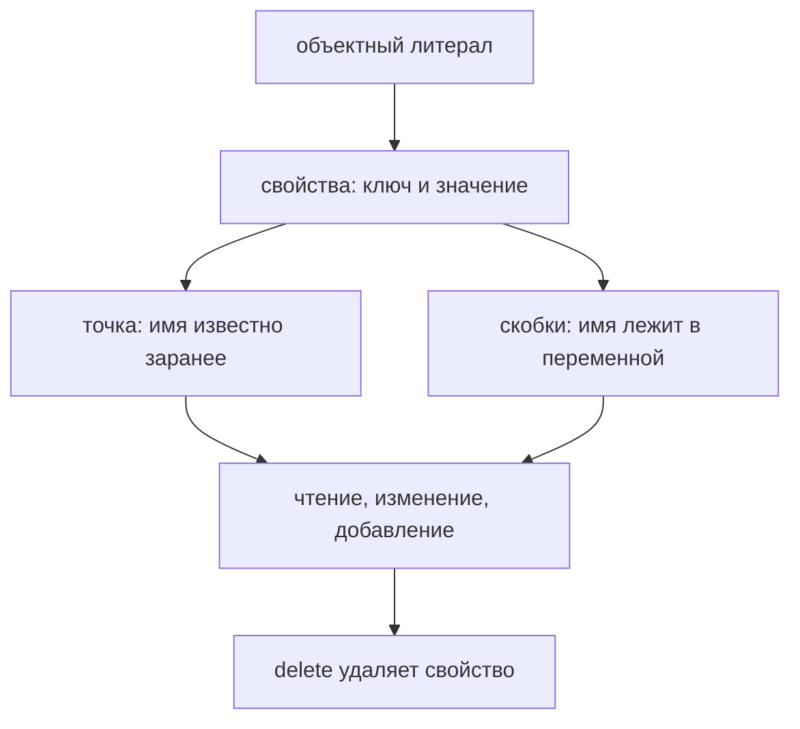

# Objects

## Связь с предыдущей главой

Предыдущая глава завершила блок Functions и объяснила `bind()`.

Главная модель была такой: `bind()` создаёт новую функцию с закреплённым объектом выполнения.

В главах про `this`, `call()`, `apply()` и `bind()` мы постоянно видели objects:

```javascript
const apiClient = {
  baseUrl: 'https://api.example.test'
};
```

Там object был нужен как объект выполнения:

Теперь мы начинаем новый раздел и возвращаемся к objects как к самостоятельной теме.

Главный вопрос этой главы:

> Как хранить related data together?

Не как десять отдельных variables.

А как одну entity:

---

## Предварительные требования

Для этой главы нужно понимать:

* что primitive value представляет одно indivisible value;
* что variable дает named access к value;
* что `const` запрещает reassignment identifier;
* что function object тоже относится к object значения;
* что `this` часто указывает на объект выполнения object;
* что dot notation уже встречалась в `object.method()`;
* что references объясняют shared object поведение на концептуальном уровне.

Не требуется знать prototypes, descriptors, classes, `Object.create()`, `Object.assign()`, destructuring, optional chaining, property attributes или JSON. Эти темы будут изучаться позже.

---

## Время изучения

Ориентировочное время:

```text
Чтение главы:            130-160 минут
Разбор схем:             55-75 минут
Запуск примеров:         20-30 минут
Практика:                110-140 минут
Повторение материала:    30 минут
```

Уровень сложности: **L3**.

Синтаксис object literal выглядит простым. Но правильная модель objects важна для всего, что будет дальше: destructuring, optional chaining, object methods, prototypes, classes, API testing and framework configuration.

---

## Навигация

Предыдущая глава:

```text
docs/01-javascript/32-bind.md
```

Текущая глава:

```text
docs/01-javascript/33-objects.md
```

Следующая глава:

```text
docs/01-javascript/34-destructuring.md
```

Следующая глава ответит:

> Как удобно извлекать значения из object?

---

## Цели обучения

После изучения этой главы вы будете понимать:

* зачем objects существуют;
* почему grouping related data делает код понятнее;
* что object literal создает object value;
* что property состоит из key и value;
* как читать properties через dot notation;
* когда нужна bracket notation;
* как добавлять properties;
* как обновлять properties;
* как удалять properties на базовом уровне;
* почему object не стоит описывать только как "key-value pairs";
* как objects используются в Automation QA;
* какие ошибки чаще всего возникают при работе с objects.

---

## Мотивация

Начнем с проблемы.

Допустим, тест проверяет пользователя:

```javascript
const userId = 101;
const userName = 'Anna';
const userRole = 'admin';
const userActive = true;
const userEmail = 'anna@example.test';
```

Каждая variable понятна отдельно.

Но программа пока не говорит главного:

Данные связаны, но связь выражена только в голове читателя.

Проблема:

Object позволяет выразить эту связь явно:

```javascript
const user = {
  id: 101,
  name: 'Anna',
  role: 'admin',
  active: true,
  email: 'anna@example.test'
};
```

Теперь в коде есть одна entity:

Главное изменение:

Для Automation QA это не абстрактная тема. API responses, request payloads, user profiles, configuration objects and expected data almost always are objects.

---

## Теория

Не начинаем с определения. Сначала сформулируем проблему.

Если данные описывают одну сущность, они должны быть сгруппированы:

Object решает эту задачу:

### Почему objects существуют

Primitive значения хороши для отдельных значений:

```javascript
const statusCode = 200;
const isActive = true;
const environment = 'staging';
```

Но программа редко работает только с одним isolated value.

В реальном коде значения образуют смысловые группы:

```text
имя, роль, активность, окружение  →  один объект user
```

Object нужен, чтобы такая группа стала одним value.

Важно:

### Object literal

Object literal - это способ создать object value прямо в коде:

```javascript
const user = {
  id: 101,
  name: 'Anna',
  role: 'admin'
};
```

Модель:

```text
user.name  →  ключ известен заранее
```

В этой главе мы используем references только на высоком уровне. Подробности уже были в главе `References`.

### Property

Object состоит из properties.

Property - это named part of an object.

Каждая property имеет:

Пример:

```javascript
const user = {
  name: 'Anna'
};
```

Здесь:

Не стоит сводить object только к фразе "key-value pairs". Такая фраза полезна, но неполна. Для чтения кода важнее видеть object как одну entity with named properties.

### Keys

Key - это имя property.

```javascript
const response = {
  status: 200,
  ok: true
};
```

Keys:

Key отвечает на вопрос:

> Как называется эта часть object?

### Values

Value - это информация, stored in property.

Values могут быть разными:

```javascript
const testResult = {
  name: 'login test',
  passed: true,
  durationMs: 340,
  error: null
};
```

На этом уровне достаточно понимать:

Подробные главы про nested objects, arrays and methods будут позже.

### Dot notation

Dot notation используется, когда property key известен заранее и является обычным identifier-like name:

```javascript
console.log(user.name);
```

Модель:

```text
user[fieldName]  →  ключ вычисляется во время выполнения
```

Dot notation хорошо читается:

```javascript
console.log(response.status);
console.log(response.ok);
console.log(config.baseUrl);
```

### Bracket notation

Bracket notation используется, когда key:

* хранится в variable;
* содержит пробел или символы, которые нельзя написать после dot;
* выбирается dynamically.

Пример с dynamic key:

```javascript
const fieldName = 'role';

console.log(user[fieldName]);
```

Модель:

```text
чтение свойства  →  объект не изменяется
```

Bracket notation required:

```javascript
const response = {
  'status code': 200
};

console.log(response['status code']);
```

Такой key нельзя прочитать через `response.status code`.

### Reading properties

Reading property не меняет object.

```javascript
const role = user.role;
```

Модель:

```text
было:  name, role
стало: name, role, lastLogin
```

Если property отсутствует, результатом будет `undefined`:

```javascript
console.log(user.permissions);
```

На этом этапе важно не пугаться:

Optional Chaining будет изучаться позже. Он помогает безопаснее читать вложенные свойства, но сейчас мы не вводим эту тему.

### Adding properties

Object можно расширить, добавив новую property:

```javascript
user.lastLogin = '2026-06-26';
```

Модель:

```text
свойство существует  →  присваивание обновляет значение
```

### Updating properties

Если property уже существует, assignment обновляет ее value:

```javascript
user.role = 'owner';
```

Модель:

```text
delete user.lastLogin  →  свойство удалено
```

### Deleting properties

`delete` удаляет property из object на базовом уровне:

```javascript
delete user.lastLogin;
```

Модель:

```text
обращение к удалённому свойству  →  undefined
```

Мы не разбираем property descriptors and attributes. Они объясняют, почему не каждую property всегда можно удалить. Это будущая глава.

### Object lifecycle

Базовый lifecycle object в этой главе:

Это не lifecycle memory management. Garbage Collector будет изучаться позже.

---

Две записи доступа решают разные задачи:



## Внутренний механизм

Спросим вопрос главы:

> Why is grouping useful?

Когда engine видит object literal:

```javascript
const user = {
  id: 101,
  name: 'Anna',
  role: 'admin'
};
```

Концептуально происходит следующее:

### Reading flow

```javascript
user.name;
```

Engine делает:

### Writing flow

```javascript
user.role = 'owner';
```

Engine делает:

Если property существовала, value обновляется.

Если property не существовала, property добавляется.

### Dot notation flow

```javascript
user.email;
```

### Bracket notation flow

```javascript
const key = 'email';

user[key];
```

### Memory intuition

На высоком уровне:

Это только intuition. В этой главе мы не рисуем precise engine implementation, property attributes, hidden classes or optimization details.

### Property lookup

В этой главе property lookup означает простой вопрос:

> Есть ли у этого object property с таким key?

Prototype Chain тоже участвует в property lookup, но это будущая глава. Сейчас мы говорим только о собственных, очевидных properties object literal.

### Object identity preview

Object identity уже встречалась в главах про References и Equality.

Здесь достаточно напомнить:

Пример:

```javascript
const firstUser = { id: 101 };
const secondUser = { id: 101 };

console.log(firstUser === secondUser);
```

Результат:

```text
false
```

Подробно object comparison уже рассматривался в `Equality`, а более глубокие модели будут возвращаться в будущих главах.

---

## Ментальная модель

Object удобно представлять как profile card.

Одна карточка описывает одну entity.

Другая модель: folder.

Еще одна модель: cabinet with labeled boxes.

Важное ограничение моделей:

Главная модель:

---

## Примеры кода

Примеры находятся в:

```text
examples/01-javascript/chapter-33/
```

Запуск:

```bash
node examples/01-javascript/chapter-33/01-object-literal.js
node examples/01-javascript/chapter-33/02-read-properties.js
node examples/01-javascript/chapter-33/03-update-properties.js
node examples/01-javascript/chapter-33/04-bracket-notation.js
node examples/01-javascript/chapter-33/05-common-mistakes.js
node examples/01-javascript/chapter-33/06-qa-example.js
```

### Пример 1. Object literal

```javascript
const user = {
  id: 101,
  name: 'Anna',
  role: 'admin',
  active: true
};

console.log(user);
```

Object literal группирует related data.

### Пример 2. Read properties

```javascript
const user = {
  id: 101,
  name: 'Anna',
  role: 'admin',
  active: true
};

console.log(user.name);
console.log(user.role);
```

Dot notation читает properties by key.

### Пример 3. Update properties

```javascript
const user = {
  id: 101,
  name: 'Anna',
  role: 'admin',
  active: true
};

user.role = 'owner';
user.lastLogin = '2026-06-26';

console.log(user.role);
console.log(user.lastLogin);
```

Assignment может обновлять существующую property или добавлять новую.

### Пример 4. Bracket notation

```javascript
const user = {
  id: 101,
  name: 'Anna',
  role: 'admin',
  'last login': '2026-06-26'
};

const fieldName = 'role';

console.log(user[fieldName]);
console.log(user['last login']);
```

Bracket notation нужна для dynamic keys and keys that cannot be written after dot.

### Пример 5. Типичные ошибки

```javascript
const user = {
  id: 101,
  name: 'Anna'
};

console.log(user.email);

user.email = 'anna@example.test';

console.log(user.email);
```

Missing property дает `undefined`. После adding property value доступно.

### Пример 6. QA example

```javascript
const apiResponse = {
  status: 200,
  body: {
    id: 101,
    name: 'Anna',
    role: 'admin'
  }
};

const expectedUser = {
  id: 101,
  name: 'Anna',
  role: 'admin'
};

console.log(apiResponse.status);
console.log(apiResponse.body.name);
console.log(expectedUser.role);
```

Nested object показан только conceptually. Подробная работа с вложенными structures будет развиваться дальше.

---

## Частые вопросы

### Object - это просто key-value pairs?

Это полезное короткое описание, но недостаточное.

Лучше думать так:

Key-value view помогает читать property. Entity view помогает проектировать данные.

### Почему `const user = {}` позволяет менять `user.name`?

`const` запрещает reassignment identifier.

Но object properties можно изменять:

Object freezing будет изучаться позже.

### Что будет, если property отсутствует?

Reading missing property returns `undefined`.

### Когда нужна bracket notation?

Bracket notation нужна, когда key выбирается dynamically или не может быть записан через dot notation.

```javascript
const key = 'status';

response[key];
```

### Можно ли удалять properties?

Да, через `delete`, но в этой главе мы рассматриваем только базовую модель. Подробности property descriptors будут позже.

---

## Распространённые мифы

### Миф: object нужен только для больших данных

Реальность:

Object нужен там, где есть related data.

### Миф: dot notation и bracket notation делают разные вещи

Реальность:

Обе формы читают property by key. Разница в том, как key задается.

### Миф: `delete` присваивает `undefined`

Реальность:

`delete` удаляет property.

Подробные способы проверять наличие property будут изучаться позже.

---

## Распространённые ошибки

### Ошибка 1. Хранить related data в отдельных variables

Неправильно:

```javascript
const baseUrl = 'https://api.example.test';
const timeout = 5000;
const retries = 2;
```

Если это одна configuration, лучше сгруппировать:

```javascript
const config = {
  baseUrl: 'https://api.example.test',
  timeout: 5000,
  retries: 2
};
```

### Ошибка 2. Использовать dot notation для dynamic key

Неправильно:

```javascript
const fieldName = 'role';

console.log(user.fieldName);
```

Что произошло:

Исправление:

```javascript
console.log(user[fieldName]);
```

### Ошибка 3. Думать, что missing property - это ошибка syntax

```javascript
console.log(user.email);
```

Если `email` отсутствует, результат `undefined`.

Это runtime result, а не syntax error.

### Ошибка 4. Путать updating и adding

```javascript
user.role = 'owner';
user.email = 'anna@example.test';
```

Если `role` существовал, он обновился.

Если `email` не существовал, он был добавлен.

### Ошибка 5. Удалять property там, где лучше создать новый object

В тестовых данных иногда лучше явно создать нужный expected object, чем сначала создать лишнее поле и удалить его.

Immutable patterns будут изучаться позже.

---

## Практическое использование

Objects используются каждый раз, когда нужно выразить entity.

### Configuration object

```javascript
const config = {
  baseUrl: 'https://api.example.test',
  timeout: 5000,
  retries: 2
};
```

Модель:

```text
объект  →  набор пар «ключ — значение»
```

### User profile

```javascript
const user = {
  id: 101,
  name: 'Anna',
  role: 'admin',
  active: true
};
```

### Request payload

```javascript
const createUserPayload = {
  name: 'Anna',
  role: 'admin',
  active: true
};
```

### Ожидаемый результат

```javascript
const expectedUser = {
  id: 101,
  name: 'Anna',
  role: 'admin'
};
```

Главный практический вопрос:

> Какие значения принадлежат одной entity?

Если ответ ясен, object часто делает код лучше.

---

## Использование в Automation QA

Automation QA код почти невозможно писать без objects.

### API response objects

Response часто выглядит как object:

```javascript
const response = {
  status: 200,
  body: {
    id: 101,
    name: 'Anna'
  }
};
```

Даже если реальный response приходит из HTTP client, в тесте вы обычно работаете с object-like structure.

### Test data objects

```javascript
const testUser = {
  name: 'Anna',
  email: 'anna@example.test',
  role: 'admin'
};
```

Такой object легче передавать в helpers, чем набор отдельных arguments.

### User profiles

В тестах профили часто становятся fixtures. Fixtures будут подробно изучаться в Automation QA части курса.

### Configuration objects

```javascript
const stagingConfig = {
  baseUrl: 'https://staging.example.test',
  timeout: 5000,
  retries: 2
};
```

Configuration object делает setup читаемым:

### Request payloads

```javascript
const payload = {
  name: 'Anna',
  role: 'admin'
};
```

Payload как object помогает явно видеть, что отправляется в API.

### Expected vs actual structure

Чем яснее object structure, тем проще писать assertions.

---

## Диаграммы главы

### 1. Why objects exist

### 2. Separate variables

### 3. Grouped data

### 4. Object literal

### 5. Property structure

### 6. Keys and значения

### 7. Reading property

### 8. Writing property

### 9. Updating property

### 10. Deleting property

### 11. Dot notation

### 12. Bracket notation

### 13. Текущая модель JavaScript

### 14. QA test data object

### 15. API response object

### 16. Object lifecycle

### 17. Читаемость

### 18. Типичные ошибки

### 19. Memory intuition

### 20. Property lookup

### 21. Object identity preview

### 22. Переход к Destructuring

### 23. Переход к Optional Chaining

### 24. Complete object model

### 25. Краткая ментальная модель

### 26. Object as profile

### 27. Object as folder

### 28. Property access flow

### 29. Object evolution

### 30. Итоговая схема

---

## Практика

Практика находится в:

```text
practice/01-javascript/33-objects.md
```

Рекомендуемый порядок:

```text
1. Ответить на концептуальные вопросы.
2. Определить properties, keys and values.
3. Предсказать вывод кода.
4. Запустить examples/01-javascript/chapter-33/.
5. Выполнить debugging tasks.
6. Сделать QA mini-project.
7. Свериться с solutions/01-javascript/33-objects.md.
```

---

## Решения

Решения находятся в:

```text
solutions/01-javascript/33-objects.md
```

Не открывайте решения до самостоятельной попытки. В этой теме важно не просто знать syntax, а уметь видеть:

```text
which data belongs together
```

---

## Итоги

Эта глава начала раздел Objects.

Главная модель: объект группирует связанные значения под общим именем и даёт к ним доступ по ключу.

Objects нужны не потому, что JavaScript любит braces.

Objects нужны, потому что реальные программы работают с grouped information:

```text
user
config
response
payload
expected data
```

В этой главе мы изучили:

* object literals;
* properties;
* keys and значения;
* reading properties;
* adding properties;
* updating properties;
* deleting properties;
* dot notation;
* bracket notation;
* QA use cases.

Следующая глава объяснит Destructuring:

---

## Что нужно запомнить

* Object группирует related data.
* Object лучше понимать как одну entity with named properties.
* Property состоит из key и value.
* Object literal создает object value.
* Dot notation удобна для заранее известного key.
* Bracket notation нужна для dynamic keys и keys со специальными символами.
* Reading missing property returns `undefined`.
* Assignment может add or update property.
* `delete` удаляет property на базовом уровне.
* В Automation QA objects используются для API responses, request payloads, test data and configuration.
* Prototypes, descriptors, classes and JSON будут изучаться позже.

---

## Проверьте себя

Ответьте без запуска кода.

1. Почему objects существуют?
2. Почему object не стоит определять только как "key-value pairs"?
3. Что такое property?
4. Чем key отличается от value?
5. Что делает object literal?
6. Когда удобна dot notation?
7. Когда bracket notation required?
8. Что возвращает reading missing property?
9. Чем adding property отличается от updating property?
10. Как objects используются в Automation QA?
