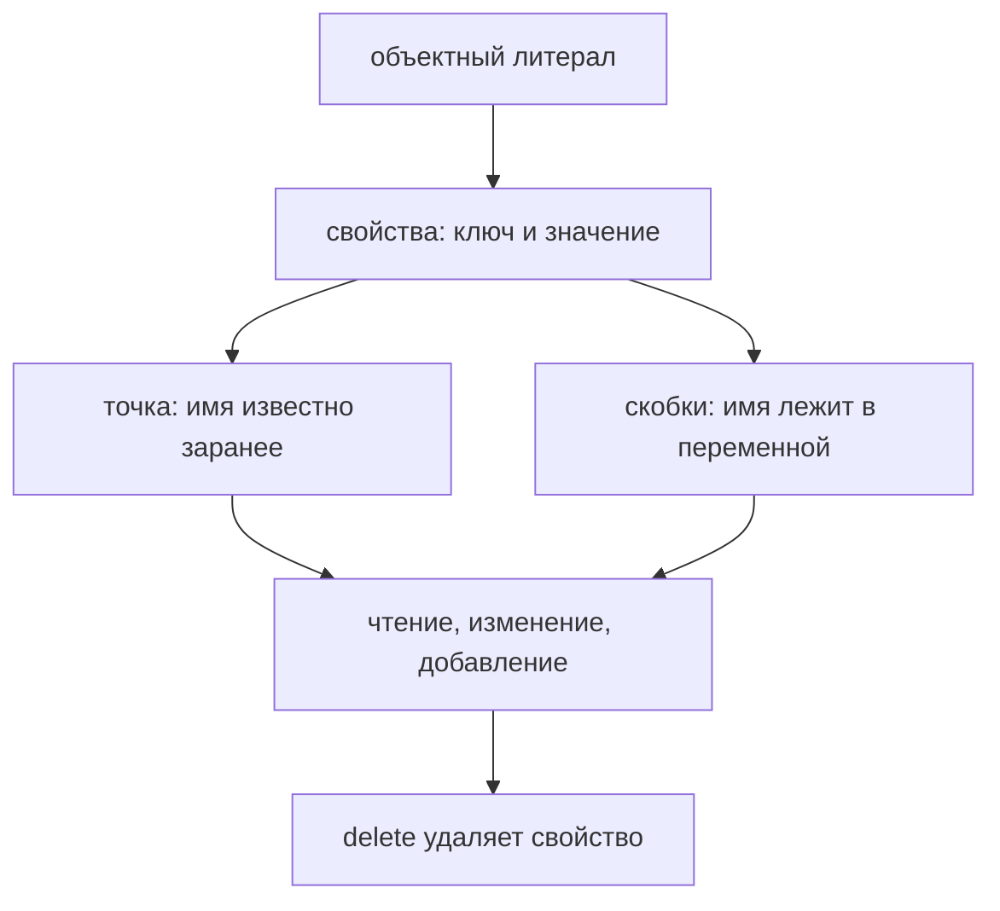

# Объекты

## Связь с предыдущей главой

Предыдущая глава завершила блок Functions и объяснила `bind()`.

Главная модель была такой: `bind()` создаёт новую функцию с закреплённым объектом выполнения.

В главах про `this`, `call()`, `apply()` и `bind()` мы постоянно видели objects:

```javascript
const apiClient = {
  baseUrl: 'https://api.example.test'
};
```

Там object был нужен как объект выполнения:

Теперь мы начинаем новый раздел и возвращаемся к objects как к самостоятельной теме.

Главный вопрос этой главы:

> Как хранить related data together?

Не как десять отдельных variables.

А как одну entity:

---

## Предварительные требования

Для этой главы нужно понимать:

* что primitive value представляет одно indivisible value;
* что variable дает named access к value;
* что `const` запрещает reassignment identifier;
* что function object тоже относится к object значения;
* что `this` часто указывает на объект выполнения object;
* что dot notation уже встречалась в `object.method()`;
* что references объясняют shared object поведение на концептуальном уровне.

Не требуется знать prototypes, descriptors, classes, `Object.create()`, `Object.assign()`, destructuring, optional chaining, property attributes или JSON. Эти темы будут изучаться позже.

---

## Время изучения

Ориентировочное время:

```text
Чтение главы:            130-160 минут
Разбор схем:             55-75 минут
Запуск примеров:         20-30 минут
Практика:                110-140 минут
Повторение материала:    30 минут
```

Уровень сложности: **L3**.

Синтаксис object literal выглядит простым. Но правильная модель objects важна для всего, что будет дальше: destructuring, optional chaining, object methods, prototypes, classes, API testing and framework configuration.

---

## Навигация

Предыдущая глава:

```text
docs/01-javascript/32-bind.md
```

Текущая глава:

```text
docs/01-javascript/33-objects.md
```

Следующая глава:

```text
docs/01-javascript/34-destructuring.md
```

Следующая глава ответит:

> Как удобно извлекать значения из object?

---

## Цели обучения

После изучения этой главы вы будете понимать:

* зачем objects существуют;
* почему grouping related data делает код понятнее;
* что object literal создает object value;
* что property состоит из key и value;
* как читать properties через dot notation;
* когда нужна bracket notation;
* как добавлять properties;
* как обновлять properties;
* как удалять properties на базовом уровне;
* почему object не стоит описывать только как "key-value pairs";
* как objects используются в Automation QA;
* какие ошибки чаще всего возникают при работе с objects.

---

## Мотивация

Начнем с проблемы.

Допустим, тест проверяет пользователя:

```javascript
const userId = 101;
const userName = 'Anna';
const userRole = 'admin';
const userActive = true;
const userEmail = 'anna@example.test';
```

Каждая variable понятна отдельно.

Но программа пока не говорит главного:

Данные связаны, но связь выражена только в голове читателя.

Проблема:

Object позволяет выразить эту связь явно:

```javascript
const user = {
  id: 101,
  name: 'Anna',
  role: 'admin',
  active: true,
  email: 'anna@example.test'
};
```

Теперь в коде есть одна entity:

```text
было:  четыре независимые переменные
стало: один объект user с четырьмя свойствами
```

Главное изменение:

```text
такую сущность можно передать одним аргументом,
вернуть одним значением и сравнить как одно целое
```

Для Automation QA это не абстрактная тема. API responses, request payloads, user profiles, configuration objects and expected data almost always are objects.

---

## Теория

Не начинаем с определения. Сначала сформулируем проблему.

Если данные описывают одну сущность, они должны быть сгруппированы:

```text
userName, userRole, userEmail  —  три имени об одном и том же пользователе
```

Разрозненные переменные легко рассинхронизировать: одну обновили, другую
забыли.

Объект решает эту задачу:

```text
user  —  одно значение, внутри которого связанные свойства
```

### Почему объекты существуют

Примитивные значения хороши для отдельных значений:

```javascript
const statusCode = 200;
const isActive = true;
const environment = 'staging';
```

Но программа редко работает только с одним изолированным значением.

В реальном коде значения образуют смысловые группы:

```text
имя, роль, активность, окружение  →  один объект user
```

Объект нужен, чтобы такая группа стала одним значением.

Важно:

```text
объект — это не «много значений», а одно значение,
у которого есть внутренняя структура
```

### Литерал объекта

Литерал объекта — способ создать объектное значение прямо в коде:

```javascript
const user = {
  id: 101,
  name: 'Anna',
  role: 'admin'
};
```

Модель:

```text
user.name  →  ключ известен заранее
```

В этой главе мы используем ссылки только на высоком уровне. Подробности уже были в главе про ссылки.

### Свойство

Объект состоит из свойств.

Свойство — именованная часть объекта.

У каждого свойства есть две части: ключ (имя) и значение.

Пример:

```javascript
const user = {
  name: 'Anna'
};
```

Здесь:

Не стоит сводить объект только к фразе «пары ключ — значение». Такая фраза полезна, но неполна. Для чтения кода важнее видеть объект как одну сущность с именованными свойствами.

### Ключи

Ключ — имя свойства.

```javascript
const response = {
  status: 200,
  ok: true
};
```

Ключи в примере выше — `status` и `ok`. Ключ всегда строка (или символ), даже
если записан без кавычек.

Ключ отвечает на вопрос:

> Как называется эта часть объекта?

### Значения

Значение — информация, хранящаяся в свойстве.

Значения могут быть разными:

```javascript
const testResult = {
  name: 'login test',
  passed: true,
  durationMs: 340,
  error: null
};
```

На этом уровне достаточно понимать:

Подробные главы про вложенные объекты, массивы и методы будут позже.

### Точечная запись

Запись через точку используется, когда ключ известен заранее и является обычным именем:

```javascript
console.log(user.name);
```

Модель:

```text
user[fieldName]  →  ключ вычисляется во время выполнения
```

Запись через точку хорошо читается:

```javascript
console.log(response.status);
console.log(response.ok);
console.log(config.baseUrl);
```

### Запись через скобки

Запись через квадратные скобки используется, когда ключ:

* хранится в переменной;
* содержит пробел или символы, которые нельзя написать после точки;
* выбирается во время выполнения.

Пример с вычисляемым ключом:

```javascript
const fieldName = 'role';

console.log(user[fieldName]);
```

Модель:

```text
чтение свойства  →  объект не изменяется
```

Когда нужны квадратные скобки:

```javascript
const response = {
  'status code': 200
};

console.log(response['status code']);
```

Такой ключ нельзя прочитать через `response.status code`.

### Чтение свойств

Чтение свойства не меняет объект.

```javascript
const role = user.role;
```

Модель:

```text
было:  name, role
стало: name, role, lastLogin
```

Если свойство отсутствует, результатом будет `undefined`:

```javascript
console.log(user.permissions);
```

На этом этапе важно не пугаться:

Безопасное чтение цепочки будет изучаться позже. Оно помогает читать вложенные свойства, но сейчас мы не вводим эту тему.

### Добавление свойств

Объект можно расширить, добавив новое свойство:

```javascript
user.lastLogin = '2026-06-26';
```

Модель:

```text
свойство существует  →  присваивание обновляет значение
```

### Обновление свойств

Если свойство уже существует, присваивание обновляет его значение:

```javascript
user.role = 'owner';
```

Модель:

```text
delete user.lastLogin  →  свойство удалено
```

### Удаление свойств

`delete` удаляет свойство из объекта на базовом уровне:

```javascript
delete user.lastLogin;
```

Модель:

```text
обращение к удалённому свойству  →  undefined
```

Мы не разбираем дескрипторы и флаги свойств. Они объясняют, почему не каждое свойство можно удалить. Это будущая глава.

### Время жизни объекта

Базовый жизненный цикл объекта в этой главе:

Это не про управление памятью. Сборка мусора будет изучаться позже.

---

Две записи доступа решают разные задачи:


```mermaid
flowchart TD
    A["объектный литерал"] --> B["свойства: ключ и значение"]
    B --> C["точка: имя известно заранее"]
    B --> D["скобки: имя лежит в переменной"]
    C --> E["чтение, изменение, добавление"]
    D --> E
    E --> F["delete удаляет свойство"]
```

## Внутренний механизм

Спросим вопрос главы:

> Зачем нужна группировка?

Когда движок видит литерал объекта:

```javascript
const user = {
  id: 101,
  name: 'Anna',
  role: 'admin'
};
```

Концептуально происходит следующее:

```text
1. вычисляются значения свойств: 101, 'Anna', 'admin'
2. создаётся объект с тремя свойствами
3. имя user связывается с этим объектом
```

### Поток чтения

```javascript
user.name;
```

Движок делает:

```text
1. по имени user находит объект
2. ищет в объекте свойство с именем name
3. свойство есть  →  возвращает 'Anna'
4. свойства нет   →  возвращает undefined
```

### Поток записи

```javascript
user.role = 'owner';
```

Движок делает:

```text
1. по имени user находит объект
2. ищет в объекте свойство с именем role
```

Если свойство существовало, его значение обновляется.

Если свойства не было, оно добавляется.

### Чтение через точку

```javascript
user.email;
```

### Чтение через квадратные скобки

```javascript
const key = 'email';

user[key];
```

### Интуиция о памяти

На высоком уровне:

Это только интуиция. В этой главе мы не описываем точную реализацию движка, флаги свойств, скрытые классы и оптимизации.

### Поиск свойства

В этой главе поиск свойства означает простой вопрос:

> Есть ли у этого объекта свойство с таким ключом?

В поиске свойства участвует и цепочка прототипов, но это будущая глава. Сейчас мы говорим только о собственных, очевидных свойствах литерала.

### Тождественность объекта: напоминание

Тождественность объекта уже встречалась в главах про ссылки и равенство.

Здесь достаточно напомнить: два объекта с одинаковым содержимым — это разные
объекты, и строгое сравнение даёт `false`. Равенство объектов проверяется по
ссылке, а не по содержимому.

Пример:

```javascript
const firstUser = { id: 101 };
const secondUser = { id: 101 };

console.log(firstUser === secondUser);
```

Результат:

```text
false
```

Подробно сравнение объектов рассматривалось в главе про равенство, а более глубокие модели будут возвращаться дальше.

---

## Ментальная модель

Объект удобно представлять как карточку профиля.

Одна карточка описывает одну сущность.

Другая модель: папка.

Ещё одна модель: шкаф с подписанными коробками.

Важное ограничение моделей: ни картотека, ни шкаф не объясняют, что имя
хранит **ссылку** на объект, а не сам объект. Коробку можно передать другому
человеку, и она окажется в одном месте, а не в двух.

Главная модель главы проще: объект — это набор пар «имя свойства → значение»,
доступный по ссылке.

---

## Примеры кода

Примеры находятся в:

```text
examples/01-javascript/chapter-33/
```

Запуск:

```bash
node examples/01-javascript/chapter-33/01-object-literal.js
node examples/01-javascript/chapter-33/02-read-properties.js
node examples/01-javascript/chapter-33/03-update-properties.js
node examples/01-javascript/chapter-33/04-bracket-notation.js
node examples/01-javascript/chapter-33/05-common-mistakes.js
node examples/01-javascript/chapter-33/06-qa-example.js
```

### Пример 1. Литерал объекта

```javascript
const user = {
  id: 101,
  name: 'Anna',
  role: 'admin',
  active: true
};

console.log(user);
```

Литерал объекта группирует связанные данные.

### Пример 2. Чтение свойств

```javascript
const user = {
  id: 101,
  name: 'Anna',
  role: 'admin',
  active: true
};

console.log(user.name);
console.log(user.role);
```

Запись через точку читает свойства по ключу.

### Пример 3. Обновление свойств

```javascript
const user = {
  id: 101,
  name: 'Anna',
  role: 'admin',
  active: true
};

user.role = 'owner';
user.lastLogin = '2026-06-26';

console.log(user.role);
console.log(user.lastLogin);
```

Присваивание может обновить существующее свойство или добавить новое.

### Пример 4. Квадратные скобки

```javascript
const user = {
  id: 101,
  name: 'Anna',
  role: 'admin',
  'last login': '2026-06-26'
};

const fieldName = 'role';

console.log(user[fieldName]);
console.log(user['last login']);
```

Квадратные скобки нужны для вычисляемых ключей и ключей, которые нельзя написать после точки.

### Пример 5. Типичные ошибки

```javascript
const user = {
  id: 101,
  name: 'Anna'
};

console.log(user.email);

user.email = 'anna@example.test';

console.log(user.email);
```

Отсутствующее свойство даёт `undefined`. После добавления значение доступно.

### Пример 6. Пример из автоматизации тестов

```javascript
const apiResponse = {
  status: 200,
  body: {
    id: 101,
    name: 'Anna',
    role: 'admin'
  }
};

const expectedUser = {
  id: 101,
  name: 'Anna',
  role: 'admin'
};

console.log(apiResponse.status);
console.log(apiResponse.body.name);
console.log(expectedUser.role);
```

Вложенный объект показан только концептуально. Подробная работа с вложенными структурами будет развиваться дальше.

---

## Частые вопросы

### Объект — это просто пары ключ — значение?

Это полезное короткое описание, но недостаточное.

Лучше думать так:

Взгляд «ключ — значение» помогает читать свойство. Взгляд «сущность» помогает проектировать данные.

### Почему `const user = {}` позволяет менять `user.name`?

`const` запрещает повторное присваивание имени.

Но свойства объекта можно изменять:

Заморозка объекта будет изучаться позже.

### Что будет, если свойство отсутствует?

Чтение отсутствующего свойства возвращает `undefined`.

### Когда нужны квадратные скобки?

Квадратные скобки нужны, когда ключ выбирается во время выполнения или не может быть записан после точки.

```javascript
const key = 'status';

response[key];
```

### Можно ли удалять свойства?

Да, через `delete`, но в этой главе мы рассматриваем только базовую модель. Подробности дескрипторов будут позже.

---

## Распространённые мифы

### Миф: объект нужен только для больших данных

Реальность:

Объект нужен там, где есть связанные данные.

### Миф: точка и квадратные скобки делают разные вещи

Реальность:

Обе формы читают свойство по ключу. Разница в том, как ключ задаётся.

### Миф: `delete` присваивает `undefined`

Реальность:

`delete` удаляет свойство.

Подробные способы проверять наличие свойства будут изучаться позже.

---

## Распространённые ошибки

### Ошибка 1. Хранить связанные данные в отдельных переменных

Неправильно:

```javascript
const baseUrl = 'https://api.example.test';
const timeout = 5000;
const retries = 2;
```

Если это одна настройка, лучше сгруппировать:

```javascript
const config = {
  baseUrl: 'https://api.example.test',
  timeout: 5000,
  retries: 2
};
```

### Ошибка 2. Использовать точку для вычисляемого ключа

Неправильно:

```javascript
const fieldName = 'role';

console.log(user.fieldName);
```

Что произошло: точечная запись искала свойство с именем `fieldName`, а не
свойство с именем `'role'`. Такого свойства в объекте нет, поэтому результат —
`undefined`, без ошибки.

Исправление:

```javascript
console.log(user[fieldName]);
```

### Ошибка 3. Думать, что отсутствующее свойство — синтаксическая ошибка

```javascript
console.log(user.email);
```

Если `email` отсутствует, результат `undefined`.

Это результат во время выполнения, а не синтаксическая ошибка.

### Ошибка 4. Путать обновление и добавление

```javascript
user.role = 'owner';
user.email = 'anna@example.test';
```

Если `role` существовал, он обновился.

Если `email` не существовал, он был добавлен.

### Ошибка 5. Удалять свойство там, где лучше создать новый объект

В тестовых данных иногда лучше явно создать нужный ожидаемый объект, чем сначала завести лишнее поле и удалить его.

Приёмы работы с неизменяемыми данными будут изучаться позже.

---

## Практическое использование

Объекты используются каждый раз, когда нужно выразить сущность.

### Объект конфигурации

```javascript
const config = {
  baseUrl: 'https://api.example.test',
  timeout: 5000,
  retries: 2
};
```

Модель:

```text
объект  →  набор пар «ключ — значение»
```

### Профиль пользователя

```javascript
const user = {
  id: 101,
  name: 'Anna',
  role: 'admin',
  active: true
};
```

### Тело запроса

```javascript
const createUserPayload = {
  name: 'Anna',
  role: 'admin',
  active: true
};
```

### Ожидаемый результат

```javascript
const expectedUser = {
  id: 101,
  name: 'Anna',
  role: 'admin'
};
```

Главный практический вопрос:

> Какие значения принадлежат одной сущности?

Если ответ ясен, объект часто делает код лучше.

---

## Использование в Automation QA

Код автоматизации тестов почти невозможно писать без объектов.

### Объекты ответа API

Ответ часто выглядит как объект:

```javascript
const response = {
  status: 200,
  body: {
    id: 101,
    name: 'Anna'
  }
};
```

Даже если настоящий ответ приходит от HTTP-клиента, в тесте вы обычно работаете со структурой объекта.

### Объекты тестовых данных

```javascript
const testUser = {
  name: 'Anna',
  email: 'anna@example.test',
  role: 'admin'
};
```

Такой объект легче передавать во вспомогательные функции, чем набор отдельных аргументов.

### Профили пользователей

В тестах профили часто становятся фикстурами. Фикстуры будут подробно изучаться в части про автоматизацию тестов.

### Объекты конфигурации

```javascript
const stagingConfig = {
  baseUrl: 'https://staging.example.test',
  timeout: 5000,
  retries: 2
};
```

Объект настройки делает подготовку читаемой:

```text
одно имя stagingConfig вместо трёх переменных,
и в вызов передаётся один аргумент вместо трёх
```

Добавление новой настройки не меняет сигнатуры функций, которые её
принимают.

### Тела запросов

```javascript
const payload = {
  name: 'Anna',
  role: 'admin'
};
```

Тело запроса как объект помогает явно видеть, что отправляется в API.

### Ожидаемая и фактическая структура

Чем яснее структура объекта, тем проще писать проверки.

---

## Практика

Практика находится в:

```text
practice/01-javascript/33-objects.md
```

Рекомендуемый порядок:

```text
1. Ответить на концептуальные вопросы.
2. Определить properties, keys and values.
3. Предсказать вывод кода.
4. Запустить examples/01-javascript/chapter-33/.
5. Выполнить debugging tasks.
6. Сделать QA mini-project.
7. Свериться с solutions/01-javascript/33-objects.md.
```

---

## Решения

Решения находятся в:

```text
solutions/01-javascript/33-objects.md
```

Не открывайте решения до самостоятельной попытки. В этой теме важно не просто знать синтаксис, а уметь видеть:

```text
which data belongs together
```

---

## Итоги

Эта глава начала раздел про объекты.

Главная модель: объект группирует связанные значения под общим именем и даёт к ним доступ по ключу.

Объекты нужны не потому, что JavaScript любит фигурные скобки.

Объекты нужны, потому что реальные программы работают со сгруппированной информацией:

```text
user
config
response
payload
expected data
```

В этой главе мы изучили:

* литералы объектов;
* свойства;
* ключи и значения;
* чтение свойств;
* добавление свойств;
* обновление свойств;
* удаление свойств;
* точечную запись;
* запись через скобки;
* применение в автоматизации тестов.

Следующая глава объяснит деструктуризацию — способ разобрать объект на
отдельные имена одной строкой вместо нескольких обращений к свойствам.

---

## Что нужно запомнить

* Объект группирует связанные данные.
* Объект лучше понимать как одну сущность с именованными свойствами.
* Свойство состоит из ключа и значения.
* Литерал объекта создаёт объектное значение.
* Точка удобна для заранее известного ключа.
* Квадратные скобки нужны для вычисляемых ключей и ключей со специальными символами.
* Чтение отсутствующего свойства возвращает `undefined`.
* Присваивание может добавить или обновить свойство.
* `delete` удаляет свойство на базовом уровне.
* В автоматизации тестов объекты используются для ответов API, тел запросов, тестовых данных и настройки.
* Прототипы, дескрипторы, классы и JSON будут изучаться позже.

---

## Проверьте себя

Ответьте без запуска кода.

1. Почему объекты существуют?
2. Почему объект не стоит определять только как «пары ключ — значение»?
3. Что такое свойство?
4. Чем ключ отличается от значения?
5. Что делает литерал объекта?
6. Когда удобна запись через точку?
7. Когда нужны квадратные скобки?
8. Что возвращает чтение отсутствующего свойства?
9. Чем добавление свойства отличается от обновления?
10. Как объекты используются в автоматизации тестов?

### Ответы

1. Данные редко бывают отдельными значениями: они образуют сущности. Объект делает такую группу одним значением, которое можно передать, вернуть и сравнить целиком.
2. Это описывает форму записи, но не отвечает, зачем объект нужен. Главное в нём — что связанные данные становятся одним значением с внутренней структурой.
3. Пара «имя — значение» внутри объекта.
4. Ключ — имя свойства, по которому его находят внутри объекта; значение — сами данные, лежащие под этим именем.
5. Создаёт объект прямо в коде: вычисляет значения свойств и собирает из них новое значение.
6. Когда имя свойства известно заранее и записывается как обычный идентификатор: `user.name`.
7. Когда имя вычисляется во время выполнения или не является допустимым идентификатором: `user[key]`, `headers['content-type']`.
8. `undefined`. Ошибки не будет — в отличие от обращения к несуществующей переменной.
9. Ничем по форме записи: `user.role = 'owner'` и добавит свойство, если его не было, и заменит значение, если было. Разница только в том, что произошло с объектом.
10. Тело запроса, ответ сервера, тестовые данные, настройки запуска, описание ожидаемого результата.

