# Destructuring

## Связь с предыдущей главой

Предыдущая глава начала раздел Objects.

Главная модель была такой:

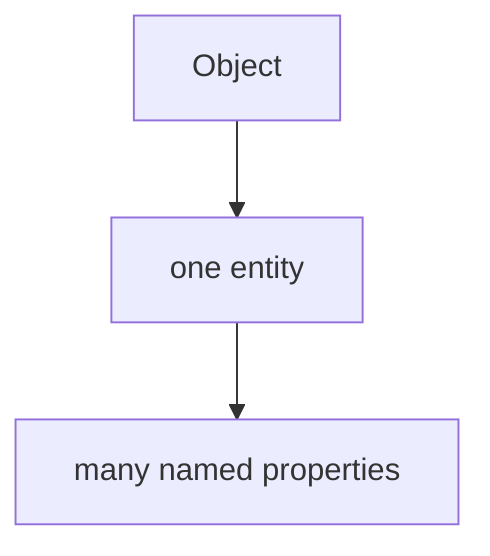

Например:

```javascript
const user = {
  id: 101,
  name: 'Anna',
  role: 'admin',
  active: true
};
```

Object удобно хранит related data together.

Теперь появляется следующий вопрос:

> Как удобно извлечь только те properties, которые нужны прямо сейчас?

Можно писать так:

```javascript
const userName = user.name;
const userRole = user.role;
```

Это работает. Но когда таких извлечений много, код начинает шуметь:

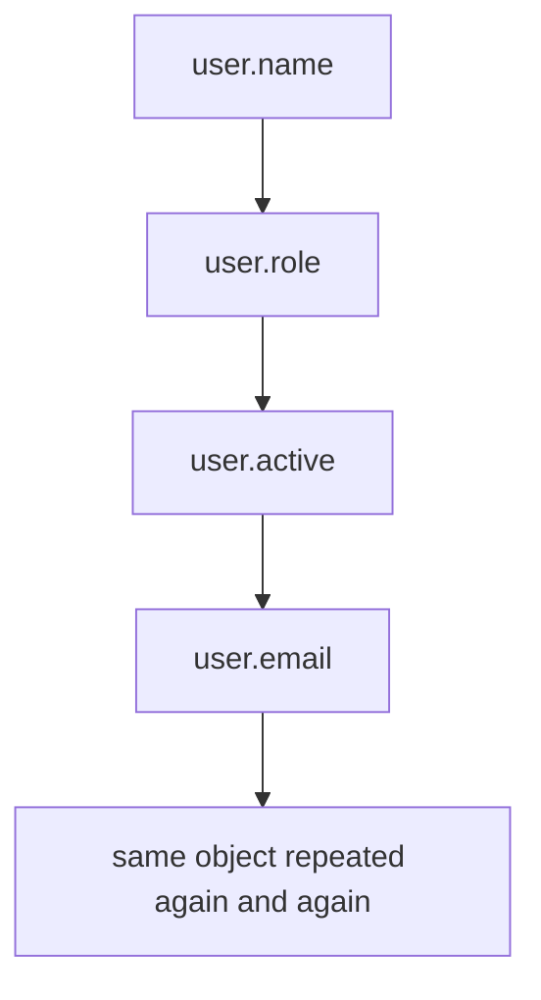

Destructuring отвечает на этот вопрос.

Главная модель главы:

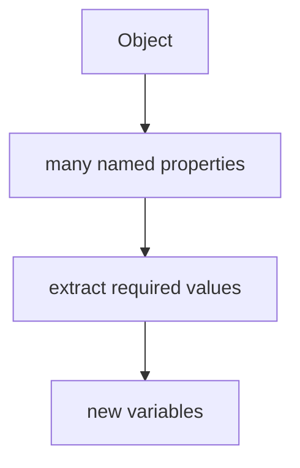

Важно сразу:

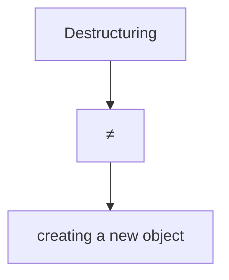

Destructuring читает existing properties and creates variables from them.

---

## Предварительные требования

Для этой главы нужно понимать:

* что object groups related data;
* что object состоит из properties;
* что property имеет key and value;
* как читать property через dot notation;
* как читать property через bracket notation;
* что missing property returns `undefined`;
* что variable дает named access к value.

Не требуется знать array destructuring, rest properties, spread with objects, parameter destructuring, deep nested patterns or TypeScript typing. Эти темы будут изучаться позже.

---

## Время изучения

Ориентировочное время:

```text
Чтение главы:            120-150 минут
Разбор схем:             50-70 минут
Запуск примеров:         20-30 минут
Практика:                100-130 минут
Повторение материала:    25 минут
```

Уровень сложности: **L3**.

Destructuring выглядит как короткий syntax. Но важно понимать не сокращение, а механизм: JavaScript берет object, находит properties по именам и создает variables.

---

## Навигация

Предыдущая глава:

```text
docs/01-javascript/33-objects.md
```

Текущая глава:

```text
docs/01-javascript/34-destructuring.md
```

Следующая глава:

```text
docs/01-javascript/35-optional-chaining.md
```

Следующая глава ответит:

> Как безопасно читать nested properties, которые могут отсутствовать?

---

## Цели обучения

После изучения этой главы вы будете понимать:

* зачем существует destructuring;
* почему destructuring удобен при работе с objects;
* что destructuring извлекает значения из existing properties;
* как object destructuring создает variables;
* как происходит matching by property name;
* что destructuring не меняет исходный object;
* как работают default значения;
* зачем нужно renaming;
* что такое nested destructuring на высоком уровне;
* какие ошибки встречаются чаще всего;
* как destructuring используется в Automation QA.

---

## Мотивация

Начнем с проблемы.

Есть API-ответ:

```javascript
const response = {
  status: 200,
  body: {
    id: 101,
    name: 'Anna',
    role: 'admin'
  },
  durationMs: 340
};
```

Тесту нужны только `status` and `body`.

Обычный вариант:

```javascript
const status = response.status;
const body = response.body;
```

Он понятен, но повторяет `response`:

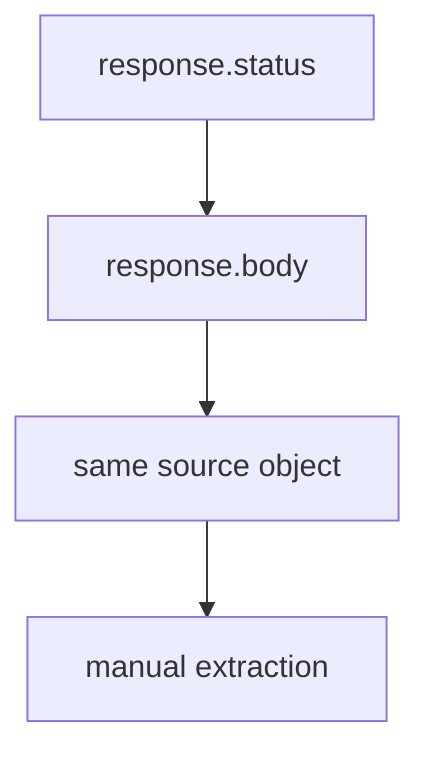

Если properties больше, шум растет:

```javascript
const status = response.status;
const body = response.body;
const durationMs = response.durationMs;
```

Вопрос:

> Можно ли сказать: возьми из `response` эти properties и создай для них variables?

Да.

```javascript
const { status, body, durationMs } = response;
```

Модель:

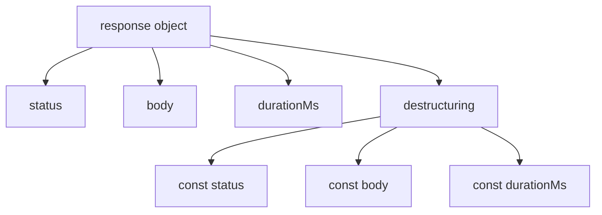

Что важно:

```text
response remains the same object
```

Destructuring не "разбирает" object физически и не создает новый object. Он создает variables from existing property значения.

---

## Теория

Destructuring нужен, когда object содержит много named properties, а текущему участку кода нужны только некоторые из них.

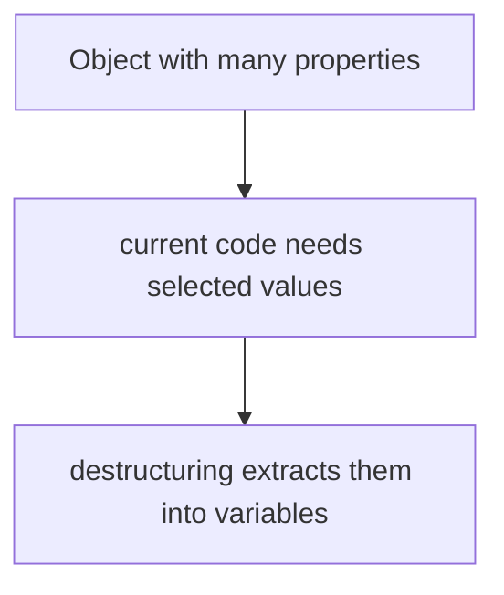

### Object destructuring syntax

Базовая форма:

```javascript
const { name, role } = user;
```

Это означает:

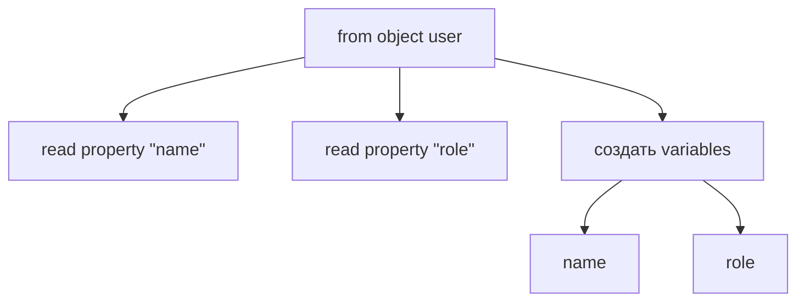

Эквивалент без destructuring:

```javascript
const name = user.name;
const role = user.role;
```

Но destructuring выражает намерение компактнее:

```text
I need these properties from this object
```

### Variable names

В простом destructuring variable name совпадает с property key:

```javascript
const { name } = user;
```

Модель:

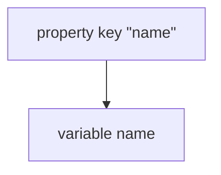

Это не случайность. Matching происходит by property name.

### Property matching

JavaScript не берет "первую", "вторую" или "третью" property.

Object destructuring matches by property name:

```javascript
const user = {
  role: 'admin',
  name: 'Anna'
};

const { name, role } = user;
```

Порядок properties в object здесь не является основой matching.

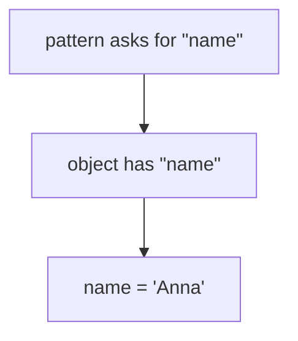

### Missing property

Если property отсутствует, variable получит `undefined`:

```javascript
const { email } = user;

console.log(email);
```

Модель:

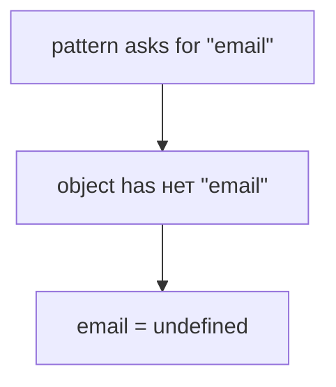

Это продолжает правило из предыдущей главы:

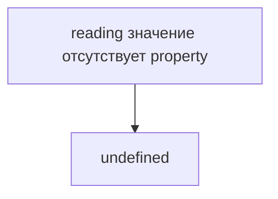

### Default значения

Default value используется, если extracted value is `undefined`:

```javascript
const { role = 'guest' } = user;
```

Модель:

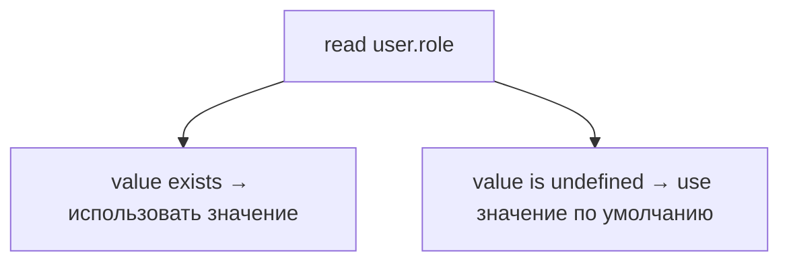

Пример:

```javascript
const user = {
  name: 'Anna'
};

const { role = 'guest' } = user;

console.log(role);
```

Результат:

```text
guest
```

Default value не добавляет property в object.

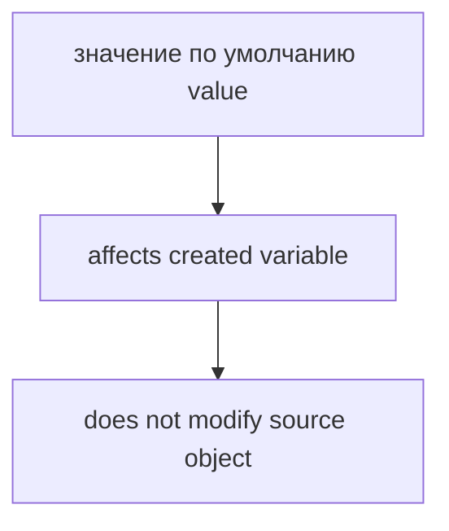

### Renaming variables

Иногда property key не подходит как local variable name.

Например, object has `name`, но в коде лучше `userName`:

```javascript
const { name: userName } = user;
```

Модель:

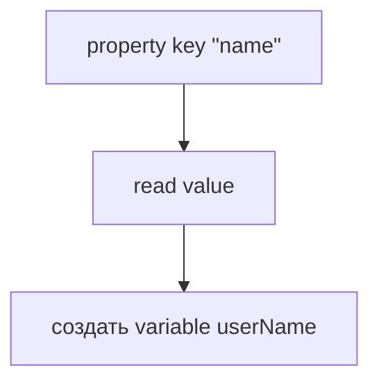

Важно:

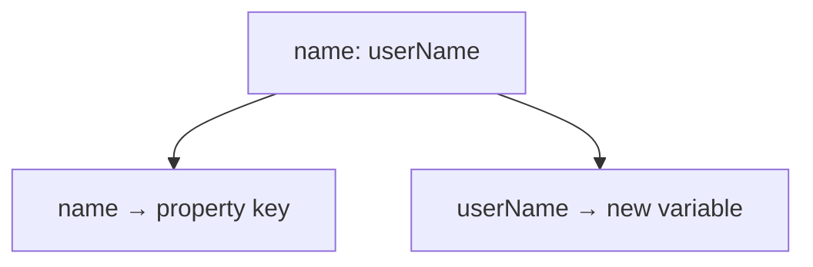

Это частое место ошибок.

### Nested destructuring preview

Object может содержать nested object:

```javascript
const response = {
  status: 200,
  body: {
    name: 'Anna'
  }
};
```

Можно извлечь nested value:

```javascript
const {
  body: { name }
} = response;
```

Высокоуровневая модель:

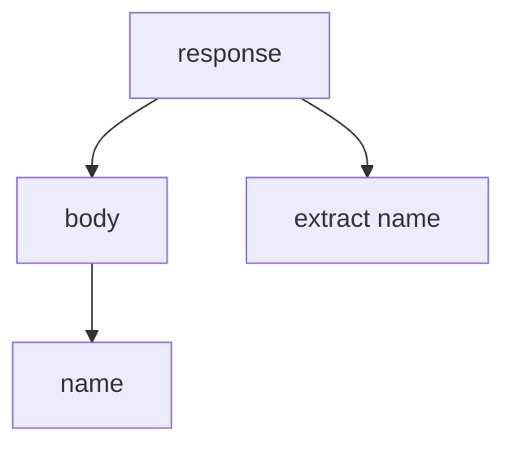

В этой главе nested destructuring только preview. Deep nested patterns can become hard to read, and optional chaining will be studied next.

### Object remains unchanged

Это центральное правило.

```javascript
const { name } = user;
```

После этой строки:

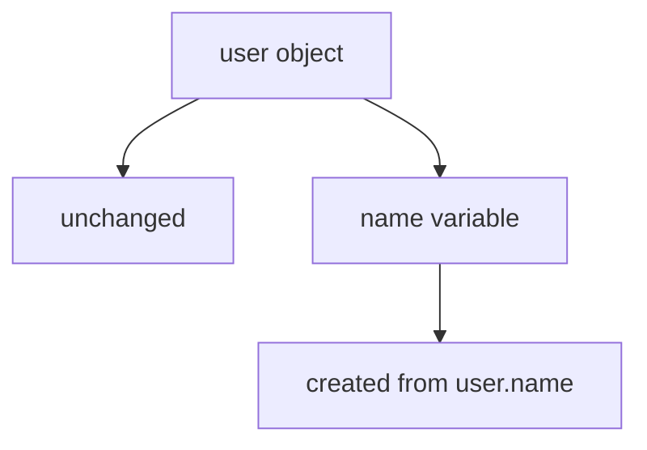

Destructuring:

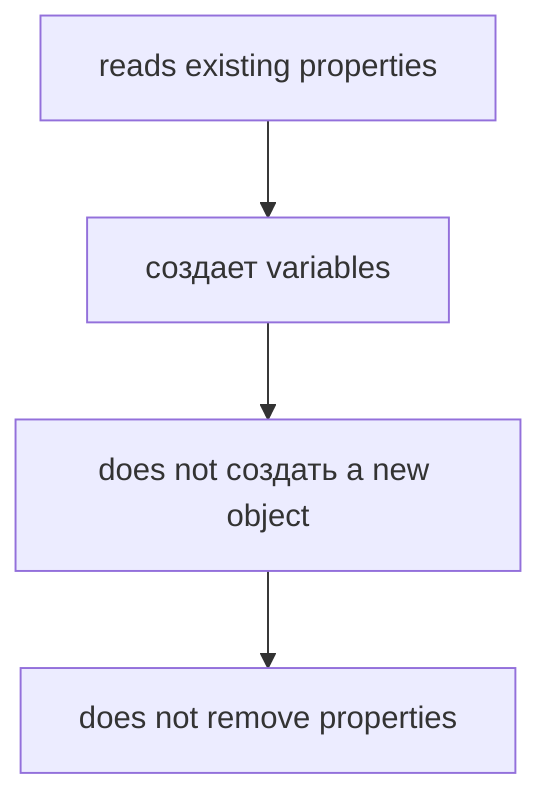

---

## Внутренний механизм

Посмотрим, что делает engine conceptually.

Код:

```javascript
const { status, body } = response;
```

Шаги:

```text
1. Read identifier response
2. Get object value
3. Look for property "status"
4. Create variable status
5. Store response.status value in status
6. Look for property "body"
7. Create variable body
8. Store response.body value in body
```

### Extraction flow

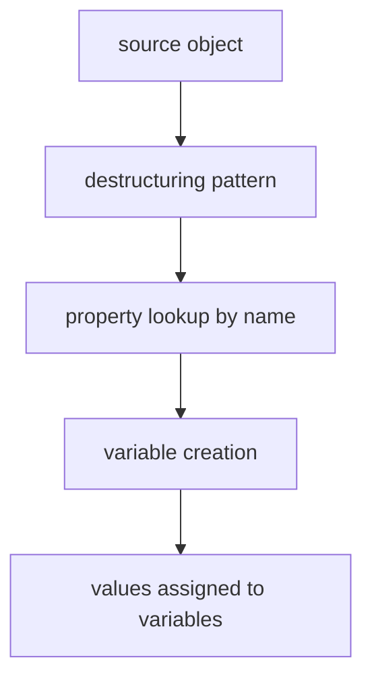

### Variable mapping

```javascript
const { name: userName } = user;
```

Сопоставление:

```mermaid
flowchart TD
    N1["source property"]
    N2["&quot;name&quot;"]
    N3["target variable"]
    N4["userName"]
    N1 --> N2
    N1 --> N3
    N3 --> N4
```

### Default value flow

```javascript
const { timeout = 5000 } = config;
```

Концептуально:

```mermaid
flowchart TD
    N1["read config.timeout"]
    N2["not undefined → timeout = actual value"]
    N3["undefined → timeout = 5000"]
    N1 --> N2
    N1 --> N3
```

### Existing object vs new variables

Очень важно отделить source object от created variables:

```mermaid
flowchart TD
    N1["Source"]
    N2["response object"]
    N3["Created"]
    N4["status variable"]
    N5["body variable"]
    N1 --> N2
    N1 --> N3
    N3 --> N4
    N3 --> N5
```

Destructuring не создает:

```text
new response object
```

Он создает:

```text
new variables
```

### Object identity unchanged

Если переменная ссылалась на object до destructuring, она продолжает ссылаться на тот же object после destructuring.

```mermaid
flowchart TD
    N1["before destructuring"]
    N2["response → object"]
    N3["after destructuring"]
    N4["response → same object"]
    N5["status → value from response.status"]
    N6["body → value from response.body"]
    N1 --> N2
    N1 --> N3
    N3 --> N4
    N3 --> N5
    N3 --> N6
```

Это важно для понимания тестовых данных. Destructuring не делает защитную копию object.

---

## Ментальная модель

Представьте folder с документами:

```mermaid
flowchart TD
    N1["Folder: response"]
    N2["document: status"]
    N3["document: body"]
    N4["document: durationMs"]
    N1 --> N2
    N1 --> N3
    N1 --> N4
```

Destructuring - это не создание новой папки.

Это выбор нужных documents:

```mermaid
flowchart TD
    N1["open folder"]
    N2["take selected labeled documents"]
    N3["put them on desk as variables"]
    N1 --> N2
    N2 --> N3
```

Еще одна модель: profile card.

```mermaid
flowchart TD
    N1["Profile card"]
    N2["id"]
    N3["name"]
    N4["role"]
    N5["active"]
    N1 --> N2
    N1 --> N3
    N1 --> N4
    N1 --> N5
```

Destructuring:

```mermaid
flowchart TD
    N1["select fields"]
    N2["name"]
    N3["role"]
    N4["создать local variables"]
    N1 --> N2
    N1 --> N3
    N1 --> N4
```

Главная модель:

```mermaid
flowchart TD
    N1["Object"]
    N2["many named properties"]
    N3["take only required properties"]
    N4["variables for current code"]
    N1 --> N2
    N2 --> N3
    N3 --> N4
```

---

## Примеры кода

Примеры находятся в:

```text
examples/01-javascript/chapter-34/
```

Запуск:

```bash
node examples/01-javascript/chapter-34/01-basic-destructuring.js
node examples/01-javascript/chapter-34/02-default-values.js
node examples/01-javascript/chapter-34/03-renaming.js
node examples/01-javascript/chapter-34/04-common-mistakes.js
node examples/01-javascript/chapter-34/05-nested-preview.js
node examples/01-javascript/chapter-34/06-qa-example.js
```

### Пример 1. Basic destructuring

```javascript
const response = {
  status: 200,
  body: 'created',
  durationMs: 340
};

const { status, body } = response;

console.log(status);
console.log(body);
```

### Пример 2. Default значения

```javascript
const config = {
  baseUrl: 'https://api.example.test'
};

const { baseUrl, timeout = 5000 } = config;

console.log(baseUrl);
console.log(timeout);
console.log(config.timeout);
```

`timeout` variable gets default value. `config.timeout` remains missing.

### Пример 3. Renaming

```javascript
const user = {
  id: 101,
  name: 'Anna',
  role: 'admin'
};

const { name: userName, role: userRole } = user;

console.log(userName);
console.log(userRole);
```

### Пример 4. Типичные ошибки

```javascript
const user = {
  name: 'Anna',
  role: 'admin'
};

const { name: userName } = user;

console.log(userName);
console.log(user.name);
```

`name: userName` creates `userName`, not `name`.

### Пример 5. Nested preview

```javascript
const response = {
  status: 200,
  body: {
    id: 101,
    name: 'Anna'
  }
};

const {
  body: { name }
} = response;

console.log(name);
```

Nested destructuring works, but deep patterns can reduce readability.

### Пример 6. QA example

```javascript
const apiResponse = {
  status: 200,
  body: {
    id: 101,
    name: 'Anna',
    role: 'admin'
  },
  durationMs: 340
};

const { status, body, durationMs } = apiResponse;
const { name, role } = body;

console.log(status);
console.log(name);
console.log(role);
console.log(durationMs);
```

---

## Частые вопросы

### Destructuring создает новый object?

Нет.

```mermaid
flowchart TD
    N1["destructuring"]
    N2["reads properties"]
    N3["создает variables"]
    N1 --> N2
    N2 --> N3
```

Source object остается тем же.

### Destructuring меняет object?

Нет.

```mermaid
flowchart TD
    N1["object before"]
    N2["same properties"]
    N3["object after"]
    N4["same properties"]
    N1 --> N2
    N1 --> N3
    N3 --> N4
```

### Почему variable name должен совпадать с property key?

В простой форме destructuring matching идет by property name.

```javascript
const { role } = user;
```

JavaScript ищет property `"role"` and creates variable `role`.

### Что делать, если local variable должна называться иначе?

Использовать renaming:

```javascript
const { role: userRole } = user;
```

### Что будет, если property отсутствует?

Variable получит `undefined`, если нет default value.

```mermaid
flowchart TD
    N1["значение отсутствует property"]
    N2["undefined"]
    N1 --> N2
```

---

## Распространенные мифы

### Миф: destructuring - это просто короткий синтаксис

Реальность:

Destructuring выражает намерение:

```mermaid
flowchart TD
    N1["from this object"]
    N2["I need these properties"]
    N1 --> N2
```

Краткость - следствие, но не главная идея.

### Миф: destructuring удаляет properties из object

Реальность:

Object остается unchanged.

```mermaid
flowchart TD
    N1["extract value"]
    N2["≠"]
    N3["remove property"]
    N1 --> N2
    N2 --> N3
```

### Миф: destructuring создает новый object

Реальность:

Создаются variables, not a new object.

```mermaid
flowchart TD
    N1["const { status } = response"]
    N2["variable status"]
    N1 --> N2
```

### Миф: порядок properties определяет matching

Реальность:

Object destructuring matches by property name.

---

## Типичные ошибки

### Ошибка 1. Думать, что renaming создает обе variables

Неправильное ожидание:

```javascript
const { name: userName } = user;

console.log(name);
```

Правильно:

```javascript
const { name: userName } = user;

console.log(userName);
```

`name` здесь property key, not created variable.

### Ошибка 2. Ожидать, что default value добавит property

```javascript
const config = {};
const { timeout = 5000 } = config;

console.log(config.timeout);
```

`config.timeout` is still `undefined`.

Значение по умолчанию относится к созданной переменной.

### Ошибка 3. Использовать deep nested destructuring там, где страдает читаемость

Слишком плотный pattern сложно читать:

```javascript
const {
  body: {
    data: {
      user: { name }
    }
  }
} = response;
```

Иногда лучше сделать extraction in steps. Optional Chaining будет изучаться в следующей главе.

### Ошибка 4. Забыть, что source object остается тем же

```javascript
const { body } = response;
```

Если `body` is object, variable `body` refers to that object. Destructuring не делает deep copy.

---

## Практическое использование

Destructuring удобно, когда текущий код работает с несколькими selected properties.

### API response

```javascript
const { status, body } = response;
```

Так тест сразу показывает, что важны `status` and `body`.

### Config значения

```javascript
const { baseUrl, timeout = 5000 } = config;
```

Это удобно для setup code.

### Ожидаемые данные пользователя

```javascript
const { name, role } = expectedUser;
```

Код фокусируется on значения required for assertion.

### Payload processing

```javascript
const { email, role } = payload;
```

Так helper clearly selects required payload поля.

---

## Использование в Automation QA

### Extracting status/body from API response

```javascript
const { status, body } = apiResponse;
```

Модель:

```mermaid
flowchart TD
    N1["apiResponse"]
    N2["status"]
    N3["body"]
    N4["variables for assertions"]
    N1 --> N2
    N1 --> N3
    N1 --> N4
```

### Reading config значения

```javascript
const { baseUrl, retries = 2 } = stagingConfig;
```

Default value помогает задать fallback for local variable, не меняя config object.

### Ожидаемые данные пользователя

```javascript
const { name: expectedName, role: expectedRole } = expectedUser;
```

Renaming makes assertion code clearer:

```text
expectedName
expectedRole
```

### Assertion helpers

Helper может извлечь только нужные поля from response object:

```javascript
const { status, body } = response;
```

Parameter destructuring будет отдельной темой позже. Сейчас мы destructure inside code block.

---

## Диаграммы главы

### 1. Why destructuring exists

```mermaid
flowchart TD
    N1["Object has many properties"]
    N2["current code needs a few"]
    N3["destructuring"]
    N1 --> N2
    N2 --> N3
```

### 2. Object before extraction

```mermaid
flowchart TD
    N1["response"]
    N2["status"]
    N3["body"]
    N4["durationMs"]
    N1 --> N2
    N1 --> N3
    N1 --> N4
```

### 3. Needed properties

```mermaid
flowchart TD
    N1["needed now"]
    N2["status"]
    N3["body"]
    N1 --> N2
    N1 --> N3
```

### 4. Destructuring process

```mermaid
flowchart TD
    N1["объект"]
    N2["pattern"]
    N3["property values"]
    N4["variables"]
    N1 --> N2
    N2 --> N3
    N3 --> N4
```

### 5. Property matching

```mermaid
flowchart TD
    N1["{ status }"]
    N2["look for property &quot;status&quot;"]
    N1 --> N2
```

### 6. Variable creation

```mermaid
flowchart TD
    N1["property value"]
    N2["new variable"]
    N1 --> N2
```

### 7. Default значения

```mermaid
flowchart TD
    N1["property значение отсутствует"]
    N2["undefined"]
    N3["use значение по умолчанию"]
    N1 --> N2
    N2 --> N3
```

### 8. Renaming

```mermaid
flowchart TD
    N1["name: userName"]
    N2["variable"]
    N3["property key"]
    N1 --> N2
    N1 --> N3
```

### 9. Nested object preview

```mermaid
flowchart TD
    N1["response"]
    N2["body"]
    N3["name"]
    N1 --> N2
    N2 --> N3
```

### 10. Текущая модель JavaScript

```mermaid
flowchart TD
    N1["Objects"]
    N2["object literals"]
    N3["destructuring"]
    N1 --> N2
    N1 --> N3
```

### 11. QA response object

```mermaid
flowchart TD
    N1["apiResponse"]
    N2["status"]
    N3["body"]
    N4["durationMs"]
    N1 --> N2
    N1 --> N3
    N1 --> N4
```

### 12. API payload

```mermaid
flowchart TD
    N1["payload"]
    N2["name"]
    N3["email"]
    N4["role"]
    N1 --> N2
    N1 --> N3
    N1 --> N4
```

### 13. Читаемость

```mermaid
flowchart TD
    N1["response.status"]
    N2["response.body"]
    N3["response.durationMs"]
    N4["const { status, body, durationMs } = response"]
    N3 --> N4
    N1 --> N2
    N2 --> N3
```

### 14. Типичные ошибки

```mermaid
flowchart TD
    N1["name: userName"]
    N2["does not создать name variable"]
    N1 --> N2
```

### 15. Missing property

```mermaid
flowchart TD
    N1["ask for email"]
    N2["object has нет email"]
    N3["email = undefined"]
    N1 --> N2
    N2 --> N3
```

### 16. Extraction flow

```mermaid
flowchart TD
    N1["source"]
    N2["lookup"]
    N3["значение"]
    N4["variable"]
    N1 --> N2
    N2 --> N3
    N3 --> N4
```

### 17. Variable mapping

```mermaid
flowchart TD
    N1["source key"]
    N2["target variable"]
    N1 --> N2
```

### 18. Object unchanged

```text
before: object with properties
after:  same object with properties
```

### 19. Переход к Optional Chaining

```mermaid
flowchart TD
    N1["nested property"]
    N2["may be значение отсутствует"]
    N3["Optional Chaining"]
    N1 --> N2
    N2 --> N3
```

### 20. Краткая ментальная модель

```mermaid
flowchart TD
    N1["open folder"]
    N2["select documents"]
    N3["place on desk"]
    N1 --> N2
    N2 --> N3
```

### 21. Complete destructuring model

```mermaid
flowchart TD
    N1["Object"]
    N2["many named properties"]
    N3["extract required values"]
    N4["variables"]
    N1 --> N2
    N2 --> N3
    N3 --> N4
```

### 22. Folder analogy

```mermaid
flowchart TD
    N1["Folder"]
    N2["status document"]
    N3["body document"]
    N4["duration document"]
    N1 --> N2
    N1 --> N3
    N1 --> N4
```

### 23. Property selection

```mermaid
flowchart TD
    N1["select"]
    N2["status"]
    N3["body"]
    N1 --> N2
    N1 --> N3
```

### 24. Object identity unchanged

```mermaid
flowchart TD
    N1["response → same object"]
    N2["before destructuring"]
    N3["after destructuring"]
    N1 --> N2
    N1 --> N3
```

### 25. Existing object vs new variables

```mermaid
flowchart TD
    N1["existing object"]
    N2["new variables"]
    N1 --> N2
```

### 26. Matching by property name

```mermaid
flowchart TD
    N1["pattern key"]
    N2["object key"]
    N3["match"]
    N1 --> N2
    N2 --> N3
```

### 27. Default value flow

```mermaid
flowchart TD
    N1["value undefined?"]
    N2["да → значение по умолчанию"]
    N3["нет → actual value"]
    N1 --> N2
    N1 --> N3
```

### 28. QA expected data

```mermaid
flowchart TD
    N1["expectedUser"]
    N2["name"]
    N3["role"]
    N4["expectedName"]
    N5["expectedRole"]
    N1 --> N2
    N1 --> N3
    N1 --> N4
    N4 --> N5
```

### 29. Extraction timeline

```mermaid
flowchart TD
    N1["read object"]
    N2["match properties"]
    N3["создать variables"]
    N4["продолжить выполнение"]
    N1 --> N2
    N2 --> N3
    N3 --> N4
```

### 30. Итоговая схема

```mermaid
flowchart TD
    N1["Destructuring"]
    N2["reads existing object"]
    N3["extracts selected values"]
    N4["создает variables"]
    N5["leaves object unchanged"]
    N1 --> N2
    N1 --> N3
    N1 --> N4
    N1 --> N5
```

---

## Практика

Практика находится в:

```text
practice/01-javascript/34-destructuring.md
```

Рекомендуемый порядок:

```text
1. Ответить на концептуальные вопросы.
2. Определить extracted variables.
3. Предсказать вывод кода.
4. Запустить examples/01-javascript/chapter-34/.
5. Выполнить debugging tasks.
6. Сделать QA mini-project.
7. Свериться с solutions/01-javascript/34-destructuring.md.
```

---

## Решения

Решения находятся в:

```text
solutions/01-javascript/34-destructuring.md
```

Не открывайте решения до самостоятельной попытки. Главный навык этой главы - видеть, какие значения are extracted and which variables are created.

---

## Итоги

Destructuring продолжает тему Objects.

```mermaid
flowchart TD
    N1["Objects"]
    N2["group related data"]
    N3["Destructuring"]
    N4["extract selected values from object"]
    N1 --> N2
    N2 --> N3
    N3 --> N4
```

Главная модель:

```mermaid
flowchart TD
    N1["Object"]
    N2["many named properties"]
    N3["extract required values"]
    N4["object remains unchanged"]
    N1 --> N2
    N2 --> N3
    N3 --> N4
```

Destructuring не создает новый object. Он создает variables from existing properties.

---

## Что нужно запомнить

* Destructuring извлекает значения from object properties.
* Destructuring создает variables.
* Source object не меняется.
* Object destructuring matches by property name.
* Missing property gives `undefined`.
* Default value applies to created variable, not to source object.
* Renaming syntax `key: variableName` создает `variableName`.
* Nested destructuring exists, but deep patterns can hurt readability.
* Array destructuring, rest properties and parameter destructuring будут изучаться позже.
* В Automation QA destructuring удобно для API responses, configs, payloads and assertions.

---

## Проверьте себя

Ответьте без запуска кода.

1. Какую проблему решает destructuring?
2. Создает ли destructuring новый object?
3. Меняет ли destructuring source object?
4. Как object destructuring выбирает properties?
5. Что будет, если property отсутствует?
6. Когда сработает default value?
7. Что создает `const { name: userName } = user`?
8. Почему destructuring не стоит понимать только как "короткий синтаксис"?
9. Где destructuring полезен в Automation QA?
10. Какая следующая тема логически продолжает destructuring?
