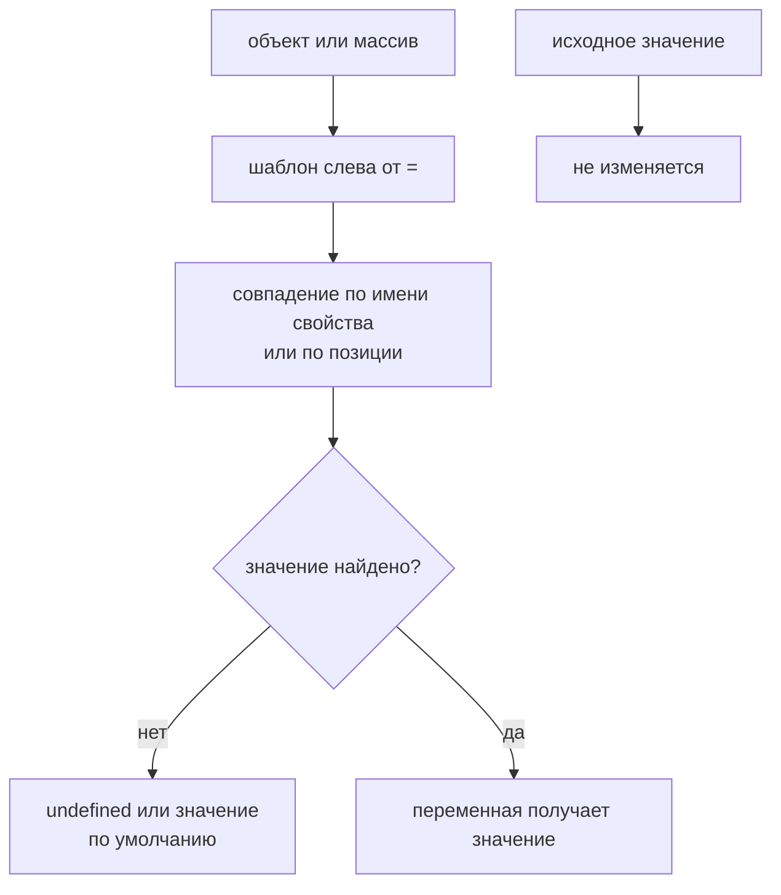

# Деструктуризация

## Связь с предыдущей главой

Предыдущая глава начала раздел Objects.

Главная модель была такой: объект группирует связанные значения и даёт доступ к ним по ключу.

Например:

```javascript
const user = {
  id: 101,
  name: 'Anna',
  role: 'admin',
  active: true
};
```

Object удобно хранит related data together.

Теперь появляется следующий вопрос:

> Как удобно извлечь только те properties, которые нужны прямо сейчас?

Можно писать так:

```javascript
const userName = user.name;
const userRole = user.role;
```

Это работает. Но когда таких извлечений много, код начинает шуметь:

Destructuring отвечает на этот вопрос.

Главная модель главы: destructuring извлекает значения из объекта и сразу связывает их с именами.

Важно сразу:

Destructuring читает existing properties and creates variables from them.

---

## Предварительные требования

Для этой главы нужно понимать:

* что object groups related data;
* что object состоит из properties;
* что property имеет key and value;
* как читать property через dot notation;
* как читать property через bracket notation;
* что missing property returns `undefined`;
* что variable дает named access к value.

Не требуется знать array destructuring, rest properties, spread with objects, parameter destructuring, deep nested patterns or TypeScript typing. Эти темы будут изучаться позже.

---

## Время изучения

Ориентировочное время:

```text
Чтение главы:            120-150 минут
Разбор схем:             50-70 минут
Запуск примеров:         20-30 минут
Практика:                100-130 минут
Повторение материала:    25 минут
```

Уровень сложности: **L3**.

Destructuring выглядит как короткий syntax. Но важно понимать не сокращение, а механизм: JavaScript берет object, находит properties по именам и создает variables.

---

## Навигация

Предыдущая глава:

```text
docs/01-javascript/33-objects.md
```

Текущая глава:

```text
docs/01-javascript/34-destructuring.md
```

Следующая глава:

```text
docs/01-javascript/35-optional-chaining.md
```

Следующая глава ответит:

> Как безопасно читать nested properties, которые могут отсутствовать?

---

## Цели обучения

После изучения этой главы вы будете понимать:

* зачем существует destructuring;
* почему destructuring удобен при работе с objects;
* что destructuring извлекает значения из existing properties;
* как object destructuring создает variables;
* как происходит matching by property name;
* что destructuring не меняет исходный object;
* как работают default значения;
* зачем нужно renaming;
* что такое nested destructuring на высоком уровне;
* какие ошибки встречаются чаще всего;
* как destructuring используется в Automation QA.

---

## Мотивация

Начнем с проблемы.

Есть API-ответ:

```javascript
const response = {
  status: 200,
  body: {
    id: 101,
    name: 'Anna',
    role: 'admin'
  },
  durationMs: 340
};
```

Тесту нужны только `status` and `body`.

Обычный вариант:

```javascript
const status = response.status;
const body = response.body;
```

Он понятен, но повторяет `response`:

Если properties больше, шум растет:

```javascript
const status = response.status;
const body = response.body;
const durationMs = response.durationMs;
```

Вопрос:

> Можно ли сказать: возьми из `response` эти properties и создай для них variables?

Да.

```javascript
const { status, body, durationMs } = response;
```

Модель:

```text
const { status, body } = response;
       └─── имена совпадают с ключами ───┘
```

Что важно:

```text
response remains the same object
```

Destructuring не "разбирает" object физически и не создает новый object. Он создает variables from existing property значения.

---

## Теория

Деструктуризация нужна, когда объект содержит много именованных свойств, а текущему участку кода нужны только некоторые из них.

### Синтаксис деструктуризации объекта

Базовая форма:

```javascript
const { name, role } = user;
```

Это означает: создать имена `name` и `role` и связать их со значениями
одноимённых свойств объекта `user`.

Эквивалент без деструктуризации:

```javascript
const name = user.name;
const role = user.role;
```

Но деструктуризация выражает намерение компактнее:

```text
мне нужны эти свойства из этого объекта
```

### Имена переменных

В простой деструктуризации имя переменной совпадает с ключом свойства:

```javascript
const { name } = user;
```

Модель:

```text
const { name } = user;   →  name получает значение user.name
```

Это не случайность. Сопоставление идёт по имени свойства.

### Сопоставление свойств

JavaScript не берёт «первое», «второе» или «третье» свойство.

Деструктуризация объекта сопоставляет по имени свойства:

```javascript
const user = {
  role: 'admin',
  name: 'Anna'
};

const { name, role } = user;
```

Порядок свойств в объекте здесь не является основой сопоставления.

### Отсутствующее свойство

Если свойство отсутствует, переменная получит `undefined`:

```javascript
const { email } = user;

console.log(email);
```

Модель:

```text
свойства нет  →  переменная получает undefined
```

Это продолжает правило из предыдущей главы: обращение к несуществующему свойству даёт `undefined`, а не ошибку.

### Значения по умолчанию

Значение по умолчанию используется, если извлечённое значение равно `undefined`:

```javascript
const { role = 'guest' } = user;
```

Модель:

```text
const { role = 'guest' } = user;
       значение по умолчанию сработает только при undefined
```

Пример:

```javascript
const user = {
  name: 'Anna'
};

const { role = 'guest' } = user;

console.log(role);
```

Результат:

```text
guest
```

Значение по умолчанию не добавляет свойство в объект.

### Переименование переменных

Иногда ключ свойства не подходит как имя локальной переменной.

Например, в объекте есть `name`, но в коде лучше `userName`:

```javascript
const { name: userName } = user;
```

Модель:

```text
const { name: userName } = user;
              └── новое имя переменной
```

Важно:

Это частое место ошибок.

### Вложенная деструктуризация: предварительный взгляд

Объект может содержать вложенный объект:

```javascript
const response = {
  status: 200,
  body: {
    name: 'Anna'
  }
};
```

Можно извлечь вложенное значение:

```javascript
const {
  body: { name }
} = response;
```

Высокоуровневая модель:

```text
объект  →  извлечь нужные поля  →  отдельные имена
```

В этой главе вложенная деструктуризация только показана. Глубокие шаблоны трудно читать, а безопасное чтение цепочки изучается в следующей главе.

### Объект остаётся неизменным

Это центральное правило.

```javascript
const { name } = user;
```

После этой строки существует обычная переменная `name` со значением из
свойства. Связи с объектом у неё нет: изменение `user.name` позже на `name`
уже не повлияет.

---

Шаблон слева описывает, что достать из значения справа:


```mermaid
flowchart TD
    A["объект или массив"] --> B["шаблон слева от ="]
    B --> C["совпадение по имени свойства<br/>или по позиции"]
    C --> D{"значение найдено?"}
    D -- "нет" --> E["undefined или значение<br/>по умолчанию"]
    D -- "да" --> F["переменная получает значение"]
    G["исходное значение"] --> H["не изменяется"]
```

## Внутренний механизм

Посмотрим, что движок делает концептуально.

Код:

```javascript
const { status, body } = response;
```

Шаги:

```text
1. Read identifier response
2. Get object value
3. Найти свойство "status"
4. Create variable status
5. Записать значение response.status в status
6. Найти свойство "body"
7. Create variable body
8. Записать значение response.body в body
```

### Поток извлечения

```text
объект справа  →  движок ищет в нём перечисленные свойства
имена слева    →  становятся обычными переменными
свойства нет   →  переменная получает undefined, ошибки не будет
```

### Соответствие переменных

```javascript
const { name: userName } = user;
```

Сопоставление:

```text
name      —  имя свойства в объекте
userName  —  имя создаваемой переменной
```

Переменной `name` при этом не появляется: имя слева от двоеточия относится к
объекту, а не к коду вокруг.

### Как работает значение по умолчанию

```javascript
const { timeout = 5000 } = config;
```

Концептуально:

```text
свойство timeout есть в config        →  берётся его значение
свойства нет, значение undefined      →  берётся 5000
свойство есть и равно 0 или null      →  берётся само значение, не 5000
```

Значение по умолчанию подставляется только вместо `undefined`.

### Исходный объект и новые переменные

Очень важно отделить исходный объект от созданных переменных:

```text
response  —  исходный объект, он не изменился
status    —  новая переменная с копией значения свойства
```

Деструктуризация не создаёт:

```text
new response object
```

Он создает:

```text
new variables
```

### Тождественность объекта не меняется

Если переменная ссылалась на объект до деструктуризации, она продолжает ссылаться на тот же объект после.

Это важно для понимания тестовых данных. Деструктуризация не делает защитной копии объекта.

---

## Ментальная модель

Представьте папку с документами:

Деструктуризация — это не создание новой папки.

Это выбор нужных документов:

Ещё одна модель: карточка профиля.

Главная модель главы: деструктуризация — это **чтение** нескольких свойств
одной строкой. Она не создаёт нового объекта, не копирует его и не связывает
переменные с источником.

---

## Примеры кода

Примеры находятся в:

```text
examples/01-javascript/chapter-34/
```

Запуск:

```bash
node examples/01-javascript/chapter-34/01-basic-destructuring.js
node examples/01-javascript/chapter-34/02-default-values.js
node examples/01-javascript/chapter-34/03-renaming.js
node examples/01-javascript/chapter-34/04-common-mistakes.js
node examples/01-javascript/chapter-34/05-nested-preview.js
node examples/01-javascript/chapter-34/06-qa-example.js
```

### Пример 1. Базовая деструктуризация

```javascript
const response = {
  status: 200,
  body: 'created',
  durationMs: 340
};

const { status, body } = response;

console.log(status);
console.log(body);
```

### Пример 2. Значения по умолчанию

```javascript
const config = {
  baseUrl: 'https://api.example.test'
};

const { baseUrl, timeout = 5000 } = config;

console.log(baseUrl);
console.log(timeout);
console.log(config.timeout);
```

Переменная `timeout` получает значение по умолчанию. Свойство `config.timeout` по-прежнему отсутствует.

### Пример 3. Переименование

```javascript
const user = {
  id: 101,
  name: 'Anna',
  role: 'admin'
};

const { name: userName, role: userRole } = user;

console.log(userName);
console.log(userRole);
```

### Пример 4. Типичные ошибки

```javascript
const user = {
  name: 'Anna',
  role: 'admin'
};

const { name: userName } = user;

console.log(userName);
console.log(user.name);
```

`name: userName` создаёт `userName`, а не `name`.

### Пример 5. Вложенная деструктуризация

```javascript
const response = {
  status: 200,
  body: {
    id: 101,
    name: 'Anna'
  }
};

const {
  body: { name }
} = response;

console.log(name);
```

Вложенная деструктуризация работает, но глубокие шаблоны ухудшают читаемость.

### Пример 6. Пример из автоматизации тестов

```javascript
const apiResponse = {
  status: 200,
  body: {
    id: 101,
    name: 'Anna',
    role: 'admin'
  },
  durationMs: 340
};

const { status, body, durationMs } = apiResponse;
const { name, role } = body;

console.log(status);
console.log(name);
console.log(role);
console.log(durationMs);
```

---

## Частые вопросы

### Деструктуризация создаёт новый объект?

Нет.

Исходный объект остаётся тем же.

### Деструктуризация меняет объект?

Нет.

### Почему имя переменной должно совпадать с ключом свойства?

В простой форме сопоставление идёт по имени свойства.

```javascript
const { role } = user;
```

JavaScript ищет свойство `"role"` и создаёт переменную `role`.

### Что делать, если локальная переменная должна называться иначе?

Использовать переименование:

```javascript
const { role: userRole } = user;
```

### Что будет, если свойство отсутствует?

Переменная получит `undefined`, если нет значения по умолчанию.

---

## Распространённые мифы

### Миф: деструктуризация — это просто короткий синтаксис

Реальность: короче она действительно получается, но главное не это.

Деструктуризация выражает намерение: по строке видно, **какие именно** поля нужны
этому участку кода. Обращения по одному такого списка не дают — их приходится
собирать глазами по всему блоку.

Краткость — следствие, но не главная идея.

### Миф: деструктуризация удаляет свойства из объекта

Реальность:

Объект остаётся неизменным.

### Миф: деструктуризация создаёт новый объект

Реальность:

Создаются переменные, а не новый объект.

### Миф: порядок свойств определяет сопоставление

Реальность:

Деструктуризация объекта сопоставляет по имени свойства.

---

## Распространённые ошибки

### Ошибка 1. Думать, что переименование создаёт обе переменные

Неправильное ожидание:

```javascript
const { name: userName } = user;

console.log(name);
```

Правильно:

```javascript
const { name: userName } = user;

console.log(userName);
```

`name` здесь ключ свойства, а не созданная переменная.

### Ошибка 2. Ожидать, что значение по умолчанию добавит свойство

```javascript
const config = {};
const { timeout = 5000 } = config;

console.log(config.timeout);
```

`config.timeout` по-прежнему `undefined`.

Значение по умолчанию относится к созданной переменной.

### Ошибка 3. Использовать глубокую вложенность там, где страдает читаемость

Слишком плотный шаблон сложно читать:

```javascript
const {
  body: {
    data: {
      user: { name }
    }
  }
} = response;
```

Иногда лучше извлекать значения в несколько шагов. Безопасное чтение цепочки будет изучаться в следующей главе.

### Ошибка 4. Забыть, что исходный объект остаётся тем же

```javascript
const { body } = response;
```

Если `body` — объект, то переменная `body` ссылается на него же. Деструктуризация не делает глубокой копии.

---

## Практическое использование

Деструктуризация удобна, когда текущий код работает с несколькими выбранными свойствами.

### Ответ API

```javascript
const { status, body } = response;
```

Так тест сразу показывает, что важны `status` и `body`.

### Значения настройки

```javascript
const { baseUrl, timeout = 5000 } = config;
```

Это удобно в коде подготовки.

### Ожидаемые данные пользователя

```javascript
const { name, role } = expectedUser;
```

Код сосредоточен на значениях, нужных для проверки.

### Обработка тела ответа

```javascript
const { email, role } = payload;
```

Так вспомогательная функция явно выбирает нужные поля тела запроса.

---

## Использование в Automation QA

### Извлечение кода и тела из ответа API

```javascript
const { status, body } = apiResponse;
```

Модель:

```text
const { status, body } = apiResponse;
```

### Чтение значений настройки

```javascript
const { baseUrl, retries = 2 } = stagingConfig;
```

Значение по умолчанию задаёт запасной вариант для локальной переменной, не меняя объект настройки.

### Ожидаемые данные пользователя

```javascript
const { name: expectedName, role: expectedRole } = expectedUser;
```

Переименование делает код проверки понятнее:

```text
expectedName
expectedRole
```

### Вспомогательные проверки

Вспомогательная функция может извлечь только нужные поля из объекта ответа:

```javascript
const { status, body } = response;
```

Деструктуризация параметров будет отдельной темой позже. Сейчас мы извлекаем значения внутри блока кода.

---

## Практика

Практика находится в:

```text
practice/01-javascript/34-destructuring.md
```

Рекомендуемый порядок:

```text
1. Ответить на концептуальные вопросы.
2. Определить extracted variables.
3. Предсказать вывод кода.
4. Запустить examples/01-javascript/chapter-34/.
5. Выполнить debugging tasks.
6. Сделать QA mini-project.
7. Свериться с solutions/01-javascript/34-destructuring.md.
```

---

## Решения

Решения находятся в:

```text
solutions/01-javascript/34-destructuring.md
```

Не открывайте решения до самостоятельной попытки. Главный навык этой главы — видеть, какие значения извлекаются и какие переменные создаются.

---

## Итоги

Деструктуризация продолжает тему объектов.

Главная модель: деструктуризация — способ назвать нужные части объекта в одну строку вместо серии обращений.

Деструктуризация не создаёт новый объект. Она создаёт переменные из существующих свойств.

---

## Что нужно запомнить

* Деструктуризация извлекает значения из свойств объекта.
* Деструктуризация создаёт переменные.
* Исходный объект не меняется.
* Деструктуризация объекта сопоставляет по имени свойства.
* Отсутствующее свойство даёт `undefined`.
* Значение по умолчанию применяется к созданной переменной, а не к исходному объекту.
* Запись `ключ: имяПеременной` создаёт `имяПеременной`.
* Вложенная деструктуризация существует, но глубокие шаблоны ухудшают читаемость.
* Деструктуризация массивов, остаточные свойства и деструктуризация параметров будут изучаться позже.
* В автоматизации тестов деструктуризация удобна для ответов API, настроек, тел запросов и проверок.

---

## Проверьте себя

Ответьте без запуска кода.

1. Какую задачу решает деструктуризация?
2. Создаёт ли деструктуризация новый объект?
3. Меняет ли деструктуризация исходный объект?
4. Как деструктуризация объекта выбирает свойства?
5. Что будет, если свойство отсутствует?
6. Когда сработает значение по умолчанию?
7. Что создает `const { name: userName } = user`?
8. Почему деструктуризацию не стоит понимать только как «короткий синтаксис»?
9. Где деструктуризация полезна в автоматизации тестов?
10. Какая следующая тема логически продолжает деструктуризацию?

### Ответы

1. Избавляет от повторяющегося обращения к одному объекту: вместо нескольких строк вида `const status = response.status` нужные свойства извлекаются одной записью.
2. Нет. Создаются только новые переменные.
3. Нет. Исходный объект остаётся прежним.
4. По имени свойства. Позиция роли не играет, в отличие от деструктуризации массива.
5. Переменная получит `undefined`. Ошибки не будет.
6. Только когда значение равно `undefined` — то есть свойства нет или оно явно не задано. Для `null`, `0`, `''` и `false` подставляется само значение.
7. Переменную `userName` со значением свойства `name`. Переменной `name` при этом не появляется.
8. Потому что важнее, что именно происходит: значения копируются в новые переменные, а связь с объектом теряется. Для примитивов это полная независимость, для вложенных объектов — та же ссылка.
9. При разборе ответа сервера, при получении фикстур в тесте, при чтении настроек: нужные поля называются явно прямо в строке.
10. Безопасное чтение вложенных свойств: деструктуризация падает, если промежуточного объекта нет.

