# Optional Chaining

## Связь с предыдущей главой

Предыдущая глава объяснила Destructuring.

Главная модель была такой:

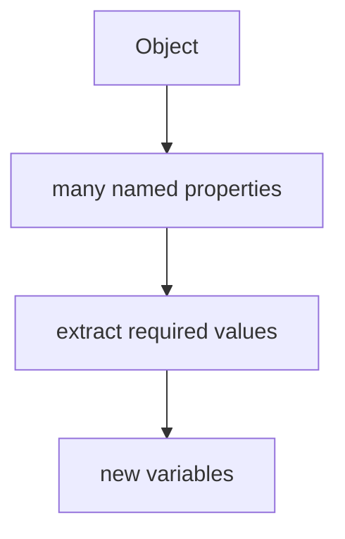

Destructuring удобно извлекает значения из existing properties.

Но теперь появляется другая проблема.

Иногда property chain выглядит так:

```javascript
response.body.user.profile.name
```

И она работает, если весь путь существует:

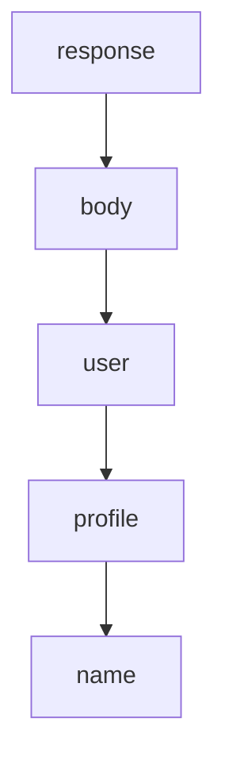

Но в реальном API response часть пути может отсутствовать:

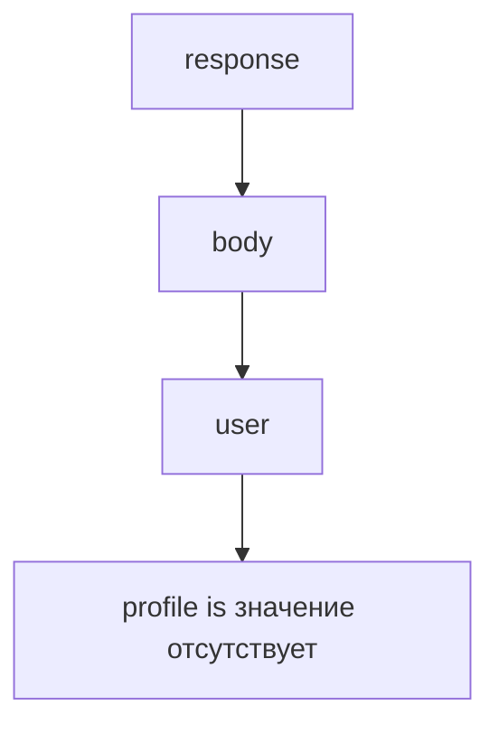

Главный вопрос этой главы:

> Что происходит, если один уровень property chain не существует?

Optional Chaining отвечает:

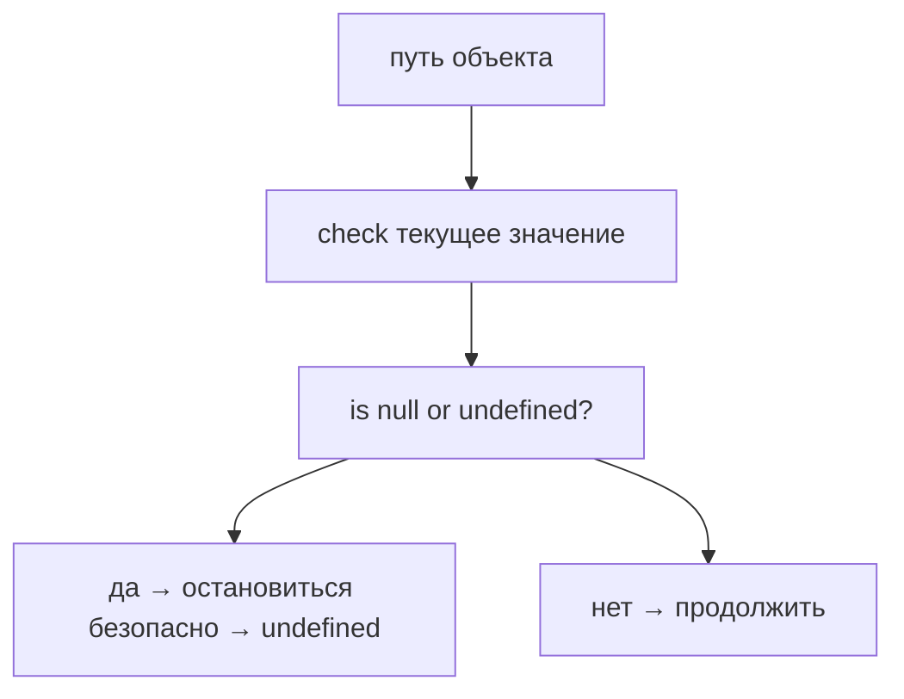

Важно сразу:

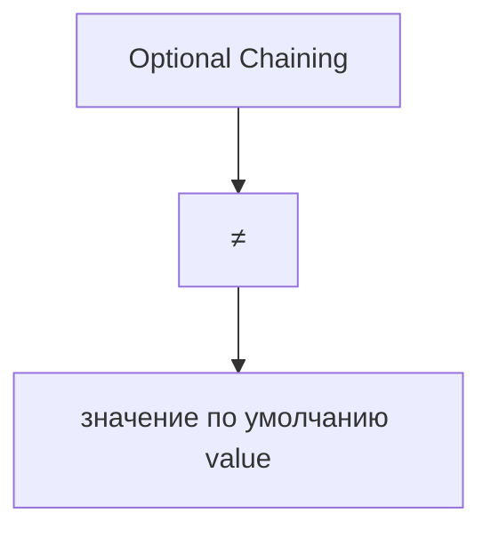

Optional Chaining не выбирает fallback value. Он только safely traverses a property chain and returns `undefined` when traversal cannot continue.

---

## Предварительные требования

Для этой главы нужно понимать:

* что object groups related data;
* что property читается через dot notation;
* что nested object может содержать nested properties;
* что reading missing property returns `undefined`;
* что destructuring извлекает existing properties into variables;
* что `undefined` означает отсутствие usable value в данном месте.

Не требуется знать Nullish Coalescing, logical operators, optional element access, advanced chaining, TypeScript optional properties or proxies. Эти темы будут изучаться позже.

---

## Время изучения

Ориентировочное время:

```text
Чтение главы:            120-150 минут
Разбор схем:             50-70 минут
Запуск примеров:         20-30 минут
Практика:                100-130 минут
Повторение материала:    25 минут
```

Уровень сложности: **L3**.

Optional Chaining выглядит маленьким operator, но он меняет mental model чтения nested data: теперь code can safely stop at missing level вместо crashing.

---

## Навигация

Предыдущая глава:

```text
docs/01-javascript/34-destructuring.md
```

Текущая глава:

```text
docs/01-javascript/35-optional-chaining.md
```

Следующая глава:

```text
docs/01-javascript/36-nullish-coalescing.md
```

Следующая глава ответит:

> Какое value использовать, если результат `null` or `undefined`?

---

## Цели обучения

После изучения этой главы вы будете понимать:

* зачем существует Optional Chaining;
* какую проблему решает safe property access;
* как работает operator `?.`;
* что происходит при чтении nested properties;
* что такое short-circuiting на уровне property chain;
* почему результатом становится `undefined`;
* почему Optional Chaining не задает default value;
* как выглядит optional method call на высоком уровне;
* какие ошибки встречаются чаще всего;
* как Optional Chaining используется в Automation QA.

---

## Мотивация

Начнем с реальной проблемы.

API response иногда возвращает profile:

```javascript
const responseWithProfile = {
  body: {
    user: {
      profile: {
        name: 'Anna'
      }
    }
  }
};
```

Тогда ordinary property access работает:

```javascript
console.log(responseWithProfile.body.user.profile.name);
```

Путь существует:

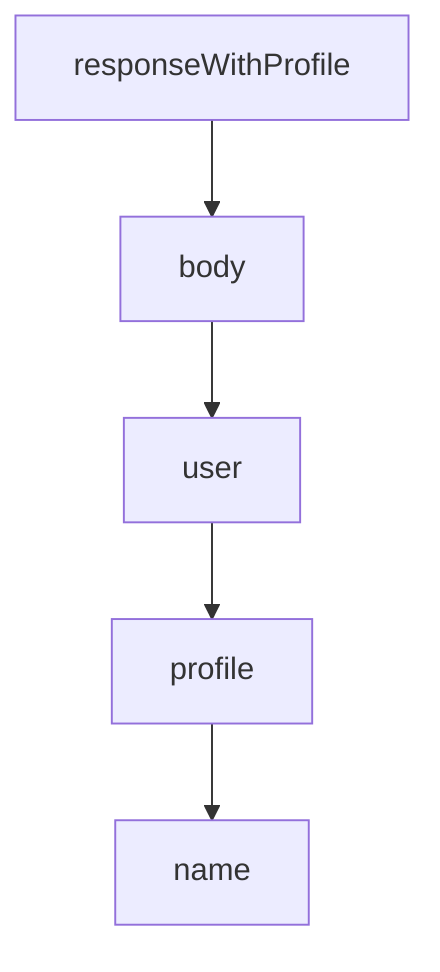

Но другой response может не содержать `profile`:

```javascript
const responseWithoutProfile = {
  body: {
    user: {}
  }
};
```

Обычный доступ ломается:

```javascript
console.log(responseWithoutProfile.body.user.profile.name);
```

Проблема:

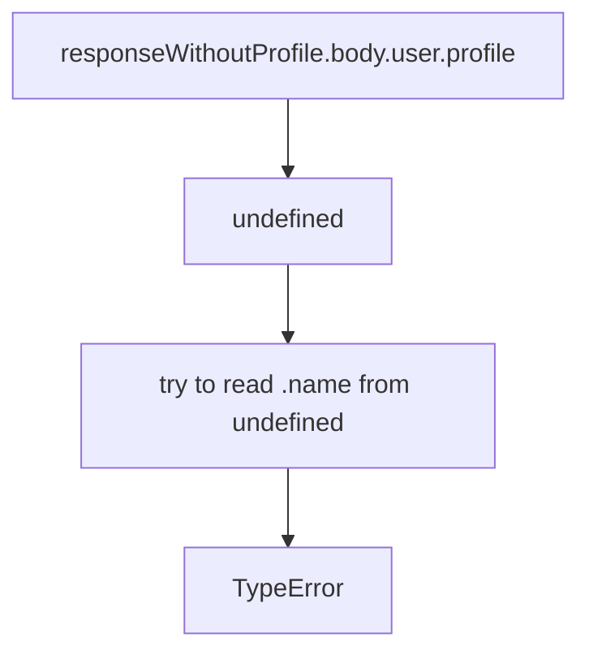

Вопрос:

> Как безопасно пройти по цепочке, если один уровень может отсутствовать?

Optional Chaining:

```javascript
const name = responseWithoutProfile.body.user.profile?.name;

console.log(name);
```

Результат:

```text
undefined
```

Code safely continues.

---

## Теория

Optional Chaining существует для safe property access in chains where some level can be `null` or `undefined`.

Обычная цепочка:

```javascript
response.body.user.profile.name
```

читает каждый уровень без safety checkpoint:

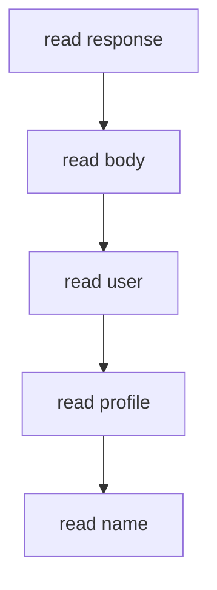

Если intermediate level is `undefined`, следующий property access throws.

Optional Chaining добавляет checkpoint:

```javascript
response.body.user.profile?.name
```

Модель:

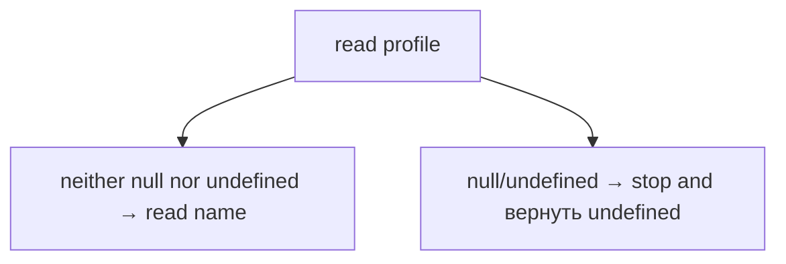

### Operator `?.`

`?.` означает:

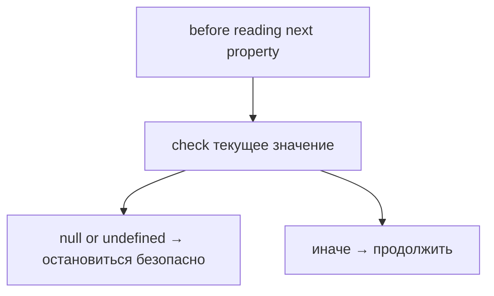

Пример:

```javascript
const city = user.profile?.address?.city;
```

Каждый `?.` ставит checkpoint.

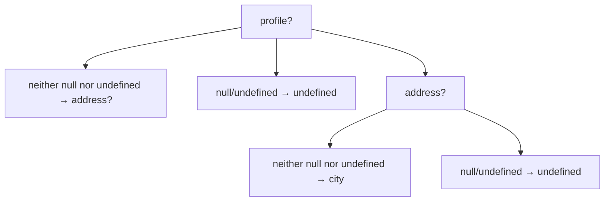

### Nested properties

Nested data in Automation QA common:

```javascript
const response = {
  body: {
    user: {
      profile: {
        email: 'anna@example.test'
      }
    }
  }
};
```

Safe access:

```javascript
const email = response.body.user.profile?.email;
```

Если `profile` есть, result is email.

Если `profile` missing, result is `undefined`.

### Short-circuiting

Short-circuiting означает early stop.

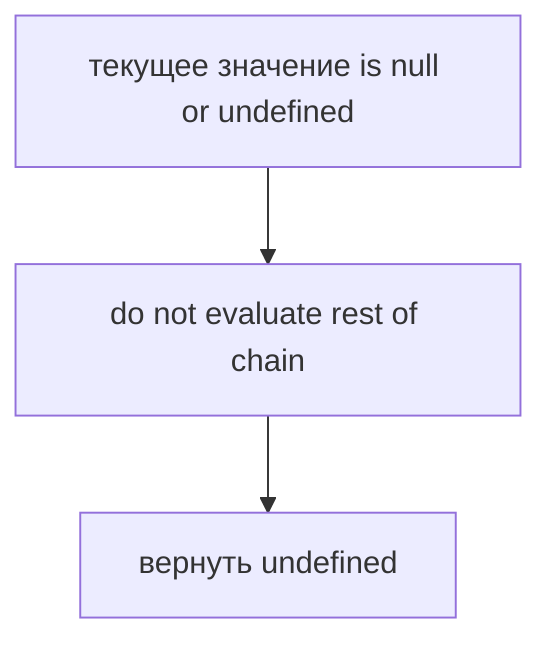

Пример:

```javascript
const name = response.body.user.profile?.name;
```

Если `profile` is `undefined`, JavaScript не пытается читать `.name`.

### Undefined result

Optional Chaining returns `undefined` when it stops safely.

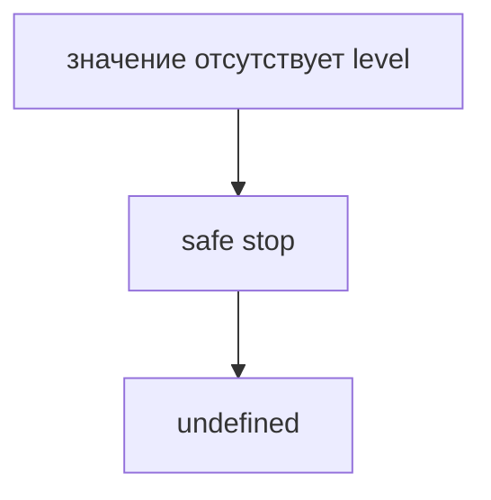

Это не default value.

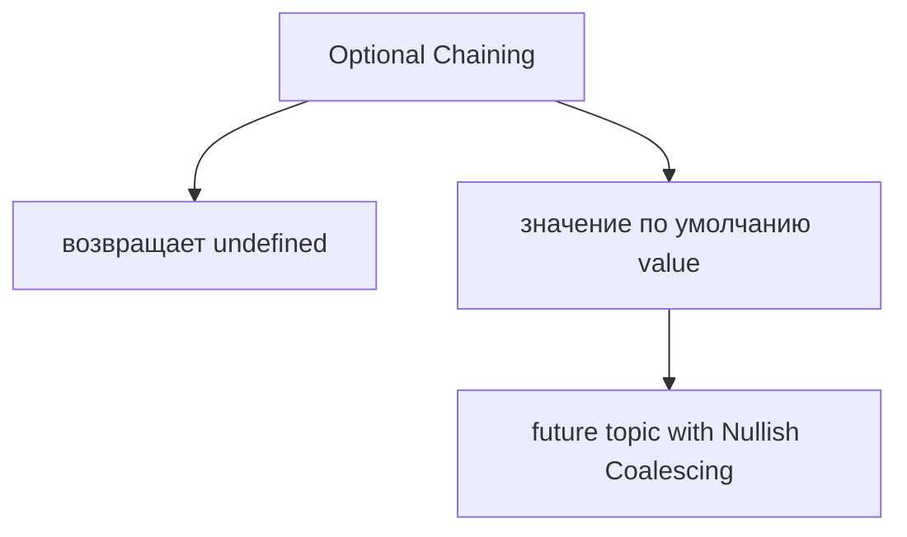

### Comparison with ordinary access

Ordinary access:

```javascript
response.body.user.profile.name;
```

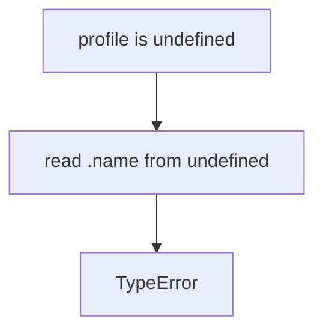

Optional Chaining:

```javascript
response.body.user.profile?.name;
```

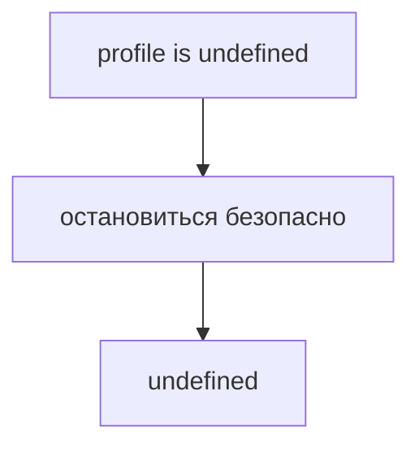

### Optional method call preview

Optional Chaining can also be used with method calls:

```javascript
reporter.log?.('test passed');
```

High-level meaning:

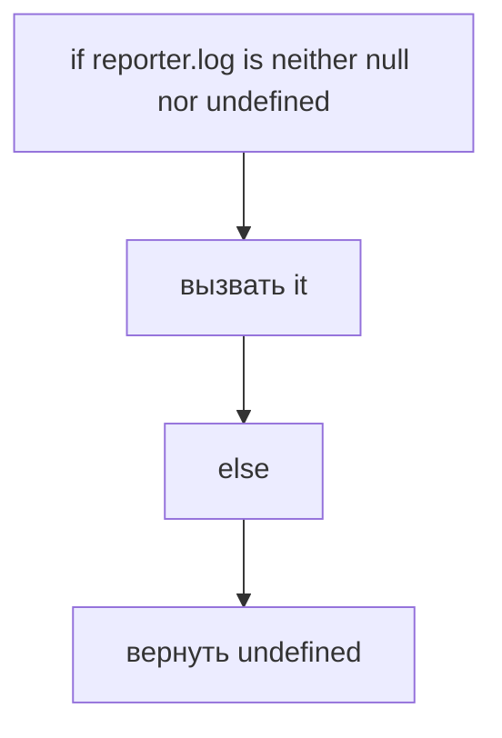

Эта глава только предварительно показывает optional method calls. Продвинутые формы вызова здесь не изучаются.

---

## Внутренний механизм

Рассмотрим:

```javascript
const city = response.body.user.profile?.address?.city;
```

Концептуальный поток engine:

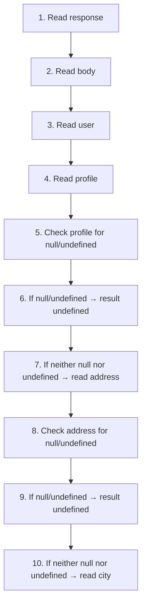

### Property access flow

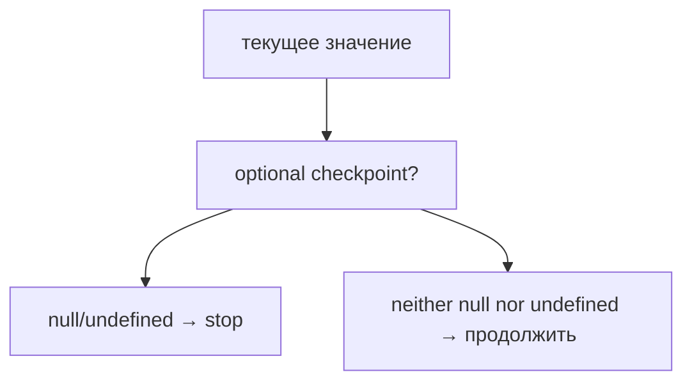

### Existing path

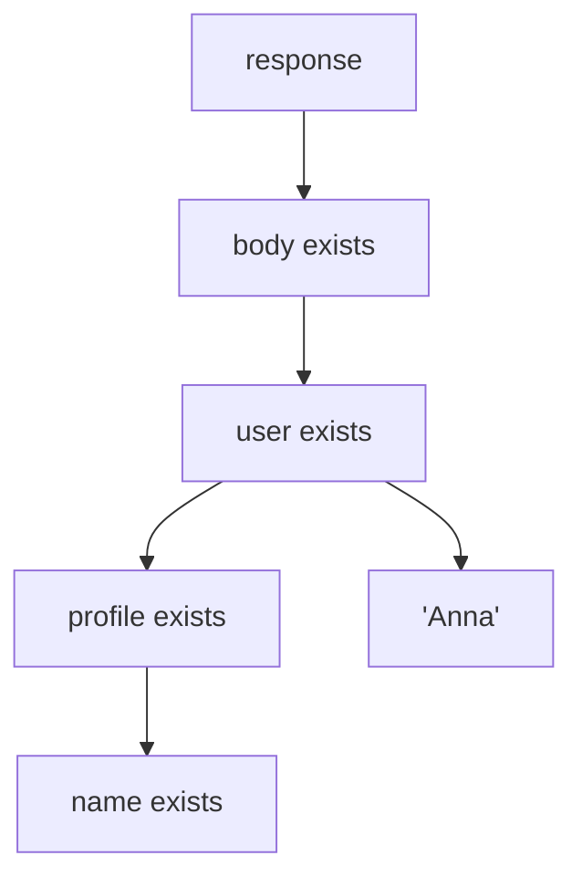

### Missing path

```mermaid
flowchart TD
    N1["response"]
    N2["body exists"]
    N3["user exists"]
    N4["profile значение отсутствует"]
    N5["optional checkpoint stops"]
    N6["undefined"]
    N1 --> N2
    N2 --> N3
    N3 --> N4
    N1 --> N5
    N5 --> N6
```

### Object unchanged

Optional Chaining only reads.

```mermaid
flowchart TD
    N1["before optional chaining"]
    N2["object structure"]
    N3["after optional chaining"]
    N4["same object structure"]
    N1 --> N2
    N1 --> N3
    N3 --> N4
```

It does not add missing properties.

It does not create fallback objects.

It does not change response.

### Variable assignment

```javascript
const name = response.body.user.profile?.name;
```

If path exists:

```text
name = 'Anna'
```

If path stops:

```text
name = undefined
```

The variable receives the result of traversal.

---

## Ментальная модель

Представьте hallway with doors:

```mermaid
flowchart TD
    N1["Door: body"]
    N2["Door: user"]
    N3["Door: profile"]
    N4["Door: name"]
    N1 --> N2
    N2 --> N3
    N3 --> N4
```

Ordinary access идет вперед и ожидает, что каждая дверь существует.

Optional Chaining ставит checkpoint:

```mermaid
flowchart TD
    N1["arrive at door value"]
    N2["null/undefined → остановиться безопасно"]
    N3["иначе → продолжить"]
    N1 --> N2
    N1 --> N3
```

Staircase model:

```text
Step 1: response
Step 2: body
Step 3: user
Step 4: profile
Step 5: name
```

If a step is missing:

```mermaid
flowchart TD
    N1["do not fall"]
    N2["stop"]
    N3["undefined"]
    N1 --> N2
    N2 --> N3
```

Bridge segments:

```mermaid
flowchart TD
    N1["segment value is neither null nor undefined"]
    N2["walk forward"]
    N3["segment value is null or undefined"]
    N4["stop before crossing"]
    N1 --> N2
    N2 --> N3
    N3 --> N4
```

Главная модель:

```mermaid
flowchart TD
    N1["Read property"]
    N2["If текущее значение is neither null nor undefined"]
    N3["продолжить"]
    N4["If текущее значение is null or undefined, остановиться безопасно"]
    N5["Return undefined"]
    N1 --> N2
    N2 --> N3
    N3 --> N4
    N4 --> N5
```

---

## Примеры кода

Примеры находятся в:

```text
examples/01-javascript/chapter-35/
```

Запуск:

```bash
node examples/01-javascript/chapter-35/01-basic-optional-chaining.js
node examples/01-javascript/chapter-35/02-nested-properties.js
node examples/01-javascript/chapter-35/03-short-circuit.js
node examples/01-javascript/chapter-35/04-common-mistakes.js
node examples/01-javascript/chapter-35/05-method-preview.js
node examples/01-javascript/chapter-35/06-qa-example.js
```

### Пример 1. Basic Optional Chaining

```javascript
const user = {
  profile: {
    name: 'Anna'
  }
};

const userWithoutProfile = {};

console.log(user.profile?.name);
console.log(userWithoutProfile.profile?.name);
```

### Пример 2. Nested properties

```javascript
const response = {
  body: {
    user: {
      profile: {
        email: 'anna@example.test'
      }
    }
  }
};

console.log(response.body.user.profile?.email);
console.log(response.body.user.settings?.theme);
```

### Пример 3. Short-circuit

```javascript
const response = {
  body: {
    user: {}
  }
};

const profileName = response.body.user.profile?.name;

console.log(profileName);
console.log('execution continues');
```

### Пример 4. Типичные ошибки

```javascript
const response = {
  body: {}
};

const name = response.body.user?.profile?.name;

console.log(name);
```

Optional Chaining must be placed at each level that may be missing.

### Пример 5. Method preview

```javascript
const reporter = {
  log: function (message) {
    console.log('report:', message);
  }
};

const silentReporter = {};

reporter.log?.('test passed');
silentReporter.log?.('test skipped');
```

### Пример 6. QA example

```javascript
const apiResponse = {
  status: 200,
  body: {
    user: {
      id: 101,
      profile: {
        name: 'Anna'
      }
    }
  }
};

const userName = apiResponse.body.user.profile?.name;
const userTheme = apiResponse.body.user.settings?.theme;

console.log(apiResponse.status);
console.log(userName);
console.log(userTheme);
```

---

## Частые вопросы

### Optional Chaining задает default value?

Нет.

```mermaid
flowchart TD
    N1["значение отсутствует path"]
    N2["undefined"]
    N1 --> N2
```

Default value будет темой следующей главы: Nullish Coalescing.

### Optional Chaining меняет object?

Нет.

Он только читает цепочку safely.

### Почему возвращается `undefined`, а не ошибка?

Потому что `?.` tells JavaScript:

```mermaid
flowchart TD
    N1["if текущее значение is null or undefined"]
    N2["stop traversal safely"]
    N1 --> N2
```

### Нужно ли ставить `?.` на каждом уровне?

Только на тех уровнях, которые могут быть `null` or `undefined`.

Если `response.body` тоже может отсутствовать, нужно:

```javascript
response.body?.user?.profile?.name
```

### Это замена validation?

Нет.

Optional Chaining helps safe reading. It does not prove that data is valid.

---

## Распространенные мифы

### Миф: Optional Chaining исправляет данные

Реальность:

Он не исправляет response and does not add missing properties.

### Миф: Optional Chaining возвращает пустую строку или `null`

Реальность:

When it stops, result is `undefined`.

### Миф: Optional Chaining - это просто короткая запись многих `if`

Реальность:

Главная идея не в краткости, а в safe traversal of property chain.

### Миф: Optional Chaining можно поставить только один раз в начале

Реальность:

Checkpoint нужен на каждом level that may be missing.

---

## Типичные ошибки

### Ошибка 1. Поставить `?.` слишком поздно

Неправильно:

```javascript
response.body.user.profile?.name;
```

Если `user` missing, code still throws before reaching `profile?.`.

Исправление:

```javascript
response.body.user?.profile?.name;
```

### Ошибка 2. Ожидать default value

```javascript
const theme = user.settings?.theme;
```

If settings missing:

```text
theme = undefined
```

Не так:

```text
theme = 'default'
```

Default value будет изучаться в Nullish Coalescing.

### Ошибка 3. Скрыть обязательную ошибку

Если property must exist, Optional Chaining может замаскировать проблему.

```mermaid
flowchart TD
    N1["required data значение отсутствует"]
    N2["test should fail clearly"]
    N1 --> N2
```

Use Optional Chaining for truly optional paths.

### Ошибка 4. Думать, что object стал безопасным навсегда

Optional Chaining protects only the chain where it is used.

Other property access can still throw.

---

## Практическое использование

Optional Chaining useful when object shape is partially optional.

### Необязательные API-поля

```javascript
const middleName = response.body.user.profile?.middleName;
```

### Nested response objects

```javascript
const city = response.body.user.profile?.address?.city;
```

### Optional configuration

```javascript
const retryCount = config.retryPolicy?.retries;
```

### Assertion helpers

```javascript
const actualRole = response.body.user?.role;
```

The helper can safely read optional поле and then decide what assertion should do.

---

## Использование в Automation QA

### Необязательные API-поля

Some API поля appear only for specific users:

```mermaid
flowchart TD
    N1["admin user"]
    N2["permissions"]
    N3["regular user"]
    N4["нет permissions field"]
    N1 --> N2
    N1 --> N3
    N3 --> N4
```

Optional Chaining:

```javascript
const permissions = response.body.user.permissions?.items;
```

### Nested response objects

API response can contain deeply nested data:

```javascript
const country = response.body.user.profile?.address?.country;
```

If address missing, test code does not crash during reading.

### Optional configuration

```javascript
const retries = config.retryPolicy?.retries;
```

This reads optional config safely. It does not provide default retries. That comes next with Nullish Coalescing.

### Payload validation

```javascript
const promoCode = payload.discount?.promoCode;
```

Useful when поле is optional.

### Assertion helpers

Optional Chaining can make helper robust, but it must not hide required data bugs.

```mermaid
flowchart TD
    N1["optional field"]
    N2["safe access is appropriate"]
    N3["required field"]
    N4["значение отсутствует value should fail clearly"]
    N1 --> N2
    N1 --> N3
    N3 --> N4
```

---

## Диаграммы главы

### 1. Why Optional Chaining exists

```mermaid
flowchart TD
    N1["nested property path"]
    N2["some level may be значение отсутствует"]
    N3["need safe traversal"]
    N1 --> N2
    N2 --> N3
```

### 2. Nested object

```mermaid
flowchart TD
    N1["response"]
    N2["body"]
    N3["user"]
    N4["profile"]
    N5["name"]
    N1 --> N2
    N2 --> N3
    N3 --> N4
    N4 --> N5
```

### 3. Missing intermediate object

```mermaid
flowchart TD
    N1["response"]
    N2["body"]
    N3["user"]
    N4["profile значение отсутствует"]
    N1 --> N2
    N2 --> N3
    N3 --> N4
```

### 4. Property access flow

```mermaid
flowchart TD
    N1["read level"]
    N2["read next level"]
    N3["read next level"]
    N1 --> N2
    N2 --> N3
```

### 5. Safe stopping

```mermaid
flowchart TD
    N1["значение отсутствует level"]
    N2["остановиться безопасно"]
    N1 --> N2
```

### 6. Undefined result

```mermaid
flowchart TD
    N1["safe stop"]
    N2["undefined"]
    N1 --> N2
```

### 7. Short-circuit

```mermaid
flowchart TD
    N1["checkpoint fails"]
    N2["rest of chain skipped"]
    N1 --> N2
```

### 8. Comparison with ordinary access

```mermaid
flowchart TD
    N1["ordinary access → TypeError"]
    N2["optional access → undefined"]
    N1 --> N2
```

### 9. Текущая модель JavaScript

```mermaid
flowchart TD
    N1["Objects"]
    N2["properties"]
    N3["destructuring"]
    N4["optional chaining"]
    N1 --> N2
    N1 --> N3
    N1 --> N4
```

### 10. QA API response

```mermaid
flowchart TD
    N1["apiResponse"]
    N2["body"]
    N3["user"]
    N4["optional profile"]
    N1 --> N2
    N2 --> N3
    N3 --> N4
```

### 11. Читаемость

```mermaid
flowchart TD
    N1["safe traversal"]
    N2["intent visible in property chain"]
    N1 --> N2
```

### 12. Типичные ошибки

```mermaid
flowchart TD
    N1["?. too late"]
    N2["earlier значение отсутствует level still throws"]
    N1 --> N2
```

### 13. Optional method call preview

```mermaid
flowchart TD
    N1["method value is null or undefined?"]
    N2["да → undefined"]
    N3["нет → call"]
    N1 --> N2
    N1 --> N3
```

### 14. Object traversal

```mermaid
flowchart TD
    N1["объект"]
    N2["property"]
    N3["property"]
    N4["значение"]
    N1 --> N2
    N2 --> N3
    N3 --> N4
```

### 15. Existing path

```mermaid
flowchart TD
    N1["all checked levels are neither null nor undefined"]
    N2["final value returned"]
    N1 --> N2
```

### 16. Missing path

```mermaid
flowchart TD
    N1["checked level is null or undefined"]
    N2["undefined returned"]
    N1 --> N2
```

### 17. Checkpoint model

```mermaid
flowchart TD
    N1["текущее значение"]
    N2["null/undefined → stop"]
    N3["иначе → продолжить"]
    N1 --> N2
    N1 --> N3
```

### 18. Hallway analogy

```mermaid
flowchart TD
    N1["door value is neither null nor undefined"]
    N2["walk through"]
    N3["door value is null or undefined"]
    N4["stop"]
    N1 --> N2
    N2 --> N3
    N3 --> N4
```

### 19. Staircase analogy

```mermaid
flowchart TD
    N1["step value is neither null nor undefined"]
    N2["go up"]
    N3["step value is null or undefined"]
    N4["остановиться безопасно"]
    N1 --> N2
    N2 --> N3
    N3 --> N4
```

### 20. Execution timeline

```mermaid
flowchart TD
    N1["read response"]
    N2["read body"]
    N3["checkpoint"]
    N4["продолжить or stop"]
    N1 --> N2
    N2 --> N3
    N3 --> N4
```

### 21. Переход к Nullish Coalescing

```mermaid
flowchart TD
    N1["optional chaining result"]
    N2["undefined"]
    N3["need fallback value"]
    N1 --> N2
    N2 --> N3
```

### 22. Object unchanged

```mermaid
flowchart TD
    N1["read safely"]
    N2["object remains unchanged"]
    N1 --> N2
```

### 23. Safe access

```mermaid
flowchart TD
    N1["?."]
    N2["safe access checkpoint"]
    N1 --> N2
```

### 24. Variable assignment

```mermaid
flowchart TD
    N1["optional chain result"]
    N2["assigned to variable"]
    N1 --> N2
```

### 25. API payload example

```mermaid
flowchart TD
    N1["payload"]
    N2["discount?"]
    N3["promoCode?"]
    N1 --> N2
    N2 --> N3
```

### 26. Assertion helper

```mermaid
flowchart TD
    N1["helper"]
    N2["read optional field"]
    N3["decide assertion"]
    N1 --> N2
    N2 --> N3
```

### 27. Краткая ментальная модель

```mermaid
flowchart TD
    N1["path inspection"]
    N2["checkpoint"]
    N3["safe stop"]
    N1 --> N2
    N2 --> N3
```

### 28. Complete Optional Chaining model

```mermaid
flowchart TD
    N1["путь объекта"]
    N2["проверка текущего значения"]
    N3["null/undefined → undefined"]
    N4["иначе → продолжить"]
    N1 --> N2
    N2 --> N3
    N2 --> N4
```

### 29. Property chain

```mermaid
flowchart TD
    N1["a"]
    N2["b"]
    N3["c"]
    N4["d"]
    N1 --> N2
    N2 --> N3
    N3 --> N4
```

### 30. Early stop

```mermaid
flowchart TD
    N1["a.b значение отсутствует"]
    N2["do not read c.d"]
    N1 --> N2
```

### 31. Undefined propagation

```mermaid
flowchart TD
    N1["значение отсутствует checkpoint"]
    N2["undefined result"]
    N3["variable receives undefined"]
    N1 --> N2
    N2 --> N3
```

### 32. Итоговая схема

```mermaid
flowchart TD
    N1["Optional Chaining"]
    N2["checks whether текущее значение is null or undefined"]
    N3["continues if it is neither null nor undefined"]
    N4["stops safely if it is null or undefined"]
    N5["возвращает undefined"]
    N1 --> N2
    N1 --> N3
    N1 --> N4
    N1 --> N5
```

---

## Практика

Практика находится в:

```text
practice/01-javascript/35-optional-chaining.md
```

Рекомендуемый порядок:

```text
1. Ответить на концептуальные вопросы.
2. Определить result optional chains.
3. Предсказать вывод кода.
4. Запустить examples/01-javascript/chapter-35/.
5. Выполнить debugging tasks.
6. Сделать QA mini-project.
7. Свериться с solutions/01-javascript/35-optional-chaining.md.
```

---

## Решения

Решения находятся в:

```text
solutions/01-javascript/35-optional-chaining.md
```

Не открывайте решения до самостоятельной попытки. Главный навык главы - понимать, где chain stops and why result becomes `undefined`.

---

## Итоги

Optional Chaining продолжает раздел Objects:

```mermaid
flowchart TD
    N1["Objects"]
    N2["Destructuring"]
    N3["Optional Chaining"]
    N1 --> N2
    N2 --> N3
```

Главная модель:

```mermaid
flowchart TD
    N1["путь объекта"]
    N2["проверка текущего значения"]
    N3["null/undefined → остановиться безопасно → undefined"]
    N4["иначе → продолжить"]
    N1 --> N2
    N2 --> N3
    N2 --> N4
```

Optional Chaining is not a default value mechanism. It only performs safe traversal.

---

## Что нужно запомнить

* Optional Chaining нужен для safe property access.
* `?.` checks whether current value is `null` or `undefined` before continuing.
* If current value is `null` or `undefined`, chain stops.
* Safe stop returns `undefined`.
* Optional Chaining does not create default значения.
* Optional Chaining does not change object.
* `?.` should be placed before levels that may be missing.
* Optional method calls exist, but advanced cases come later.
* In Automation QA, Optional Chaining helps with optional API поля, nested responses and optional config.
* Nullish Coalescing will explain fallback значения in the next chapter.

---

## Проверьте себя

Ответьте без запуска кода.

1. Какую проблему решает Optional Chaining?
2. Что делает operator `?.`?
3. Что произойдет, если current value is `undefined`?
4. Почему Optional Chaining returns `undefined` вместо throwing?
5. Задает ли Optional Chaining default value?
6. Меняет ли Optional Chaining source object?
7. Почему `?.` иногда нужно ставить на нескольких levels?
8. Когда Optional Chaining может скрыть проблему?
9. Где Optional Chaining полезен в Automation QA?
10. Какая следующая тема логически продолжает Optional Chaining?
