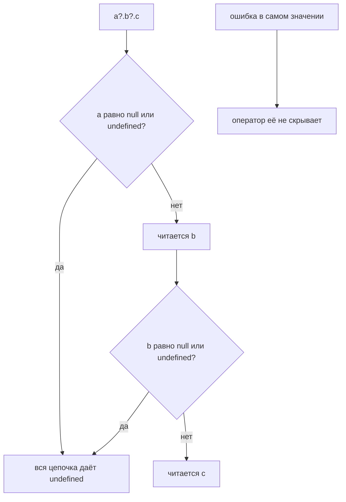

# Опциональная цепочка

## Связь с предыдущей главой

Предыдущая глава объяснила Destructuring.

Главная модель была такой: destructuring извлекает значения из объекта и связывает их с именами.

Destructuring удобно извлекает значения из existing properties.

Но теперь появляется другая проблема.

Иногда property chain выглядит так:

```javascript
response.body.user.profile.name
```

И она работает, если весь путь существует:

Но в реальном API response часть пути может отсутствовать:

Главный вопрос этой главы:

> Что происходит, если один уровень property chain не существует?

Optional Chaining отвечает:

Важно сразу:

Optional Chaining не выбирает fallback value. Он только safely traverses a property chain and returns `undefined` when traversal cannot continue.

---

## Предварительные требования

Для этой главы нужно понимать:

* что object groups related data;
* что property читается через dot notation;
* что nested object может содержать nested properties;
* что reading missing property returns `undefined`;
* что destructuring извлекает existing properties into variables;
* что `undefined` означает отсутствие usable value в данном месте.

Не требуется знать Nullish Coalescing, logical operators, optional element access, advanced chaining, TypeScript optional properties or proxies. Эти темы будут изучаться позже.

---

## Время изучения

Ориентировочное время:

```text
Чтение главы:            120-150 минут
Разбор схем:             50-70 минут
Запуск примеров:         20-30 минут
Практика:                100-130 минут
Повторение материала:    25 минут
```

Уровень сложности: **L3**.

Optional Chaining выглядит маленьким operator, но он меняет mental model чтения nested data: теперь code can safely stop at missing level вместо crashing.

---

## Навигация

Предыдущая глава:

```text
docs/01-javascript/34-destructuring.md
```

Текущая глава:

```text
docs/01-javascript/35-optional-chaining.md
```

Следующая глава:

```text
docs/01-javascript/36-nullish-coalescing.md
```

Следующая глава ответит:

> Какое value использовать, если результат `null` or `undefined`?

---

## Цели обучения

После изучения этой главы вы будете понимать:

* зачем существует Optional Chaining;
* какую проблему решает safe property access;
* как работает operator `?.`;
* что происходит при чтении nested properties;
* что такое short-circuiting на уровне property chain;
* почему результатом становится `undefined`;
* почему Optional Chaining не задает default value;
* как выглядит optional method call на высоком уровне;
* какие ошибки встречаются чаще всего;
* как Optional Chaining используется в Automation QA.

---

## Мотивация

Начнем с реальной проблемы.

API response иногда возвращает profile:

```javascript
const responseWithProfile = {
  body: {
    user: {
      profile: {
        name: 'Anna'
      }
    }
  }
};
```

Тогда ordinary property access работает:

```javascript
console.log(responseWithProfile.body.user.profile.name);
```

Путь существует:

Но другой response может не содержать `profile`:

```javascript
const responseWithoutProfile = {
  body: {
    user: {}
  }
};
```

Обычный доступ ломается:

```javascript
console.log(responseWithoutProfile.body.user.profile.name);
```

Проблема:

Вопрос:

> Как безопасно пройти по цепочке, если один уровень может отсутствовать?

Optional Chaining:

```javascript
const name = responseWithoutProfile.body.user.profile?.name;

console.log(name);
```

Результат:

```text
undefined
```

Code safely continues.

---

## Теория

Безопасное чтение цепочки существует для доступа к свойствам там, где какой-то уровень может быть `null` или `undefined`.

Обычная цепочка:

```javascript
response.body.user.profile.name
```

читает каждый уровень без проверки:

Если промежуточный уровень равен `undefined`, следующее обращение к свойству выбрасывает ошибку.

Оператор `?.` добавляет проверку:

```javascript
response.body.user.profile?.name
```

Модель:

```text
user?.profile?.email

каждый шаг проверяет: есть ли значение
нет  →  результат undefined, ошибки не будет
```

### Оператор `?.`

`?.` означает: если значение слева — `null` или `undefined`, остановиться и
вернуть `undefined`; иначе продолжить обращение.

Пример:

```javascript
const city = user.profile?.address?.city;
```

Каждый `?.` ставит проверку.

### Вложенные свойства

Вложенные данные в автоматизации тестов встречаются часто:

```javascript
const response = {
  body: {
    user: {
      profile: {
        email: 'anna@example.test'
      }
    }
  }
};
```

Безопасное обращение:

```javascript
const email = response.body.user.profile?.email;
```

Если `profile` есть, результатом будет адрес почты.

Если `profile` отсутствует, результат — `undefined`.

### Короткое замыкание

Короткое замыкание означает раннюю остановку.

Пример:

```javascript
const name = response.body.user.profile?.name;
```

Если `profile` равен `undefined`, JavaScript не пытается читать `.name`.

### Результат `undefined`

При безопасной остановке оператор возвращает `undefined`.

Это не значение по умолчанию.

### Сравнение с обычным обращением

Обычное обращение:

```javascript
response.body.user.profile.name;
```

Опциональная цепочка:

```javascript
response.body.user.profile?.name;
```

### Безопасный вызов метода: предварительный взгляд

Оператор `?.` можно использовать и с вызовами методов:

```javascript
reporter.log?.('test passed');
```

Смысл на высоком уровне:

Эта глава только показывает такую форму. Более сложные варианты вызова здесь не изучаются.

---

`?.` останавливает цепочку, а не подавляет ошибку:


```mermaid
flowchart TD
    A["a?.b?.c"] --> B{"a равно null или undefined?"}
    B -- "да" --> C["вся цепочка даёт undefined"]
    B -- "нет" --> D["читается b"]
    D --> E{"b равно null или undefined?"}
    E -- "да" --> C
    E -- "нет" --> F["читается c"]
    G["ошибка в самом значении"] --> H["оператор её не скрывает"]
```

## Внутренний механизм

Рассмотрим:

```javascript
const city = response.body.user.profile?.address?.city;
```

Концептуальный ход работы движка:

```text
1. вычислить значение слева от ?.
2. значение null или undefined  →  вернуть undefined и остановить цепочку
3. иначе                        →  прочитать свойство и продолжить дальше
```

### Порядок чтения цепочки

Цепочка читается слева направо, и каждый `?.` проверяет только то значение,
которое стоит непосредственно перед ним.

```text
response.body.user.profile   ←  обычное чтение, без защиты
     ?.address               ←  проверяется profile
        ?.city               ←  проверяется address
```

### Когда путь существует

```text
profile  →  объект
address  →  объект
city     →  'Berlin'
```

Все проверки пройдены, результат — обычное значение свойства.

### Когда путь обрывается

```text
profile  →  undefined
```

Цепочка останавливается сразу: `address` и `city` не читаются вовсе, а всё
выражение даёт `undefined`. Это и есть короткое замыкание — оно защищает от
ошибки `cannot read property of undefined`.

### Объект не изменился

Оператор только читает.

Он не добавляет отсутствующих свойств.

Он не создаёт запасных объектов.

Он не меняет ответ.

### Присваивание переменной

```javascript
const name = response.body.user.profile?.name;
```

Если путь существует:

```text
name = 'Anna'
```

Если путь обрывается:

```text
name = undefined
```

Переменная получает результат обхода цепочки.

---

## Ментальная модель

Представьте коридор с дверями:

Обычное обращение идёт вперёд и ожидает, что каждая дверь существует.

Оператор `?.` ставит проверку перед каждой дверью, к которой он приписан: если
двери нет, дальше идти не нужно.

Модель лестницы:

```text
шаг 1: response
шаг 2: body
шаг 3: user
шаг 4: profile
шаг 5: name
```

Если шаг отсутствует, мост обрывается — и опциональная цепочка возвращает
`undefined` вместо попытки пройти дальше.

Главная модель: `?.` проверяет только текущее звено. Он не гарантирует, что
дойдёт до конца, и не подставляет значение по умолчанию — это работа
оператора `??` из следующей главы.

---

## Примеры кода

Примеры находятся в:

```text
examples/01-javascript/chapter-35/
```

Запуск:

```bash
node examples/01-javascript/chapter-35/01-basic-optional-chaining.js
node examples/01-javascript/chapter-35/02-nested-properties.js
node examples/01-javascript/chapter-35/03-short-circuit.js
node examples/01-javascript/chapter-35/04-common-mistakes.js
node examples/01-javascript/chapter-35/05-method-preview.js
node examples/01-javascript/chapter-35/06-qa-example.js
```

### Пример 1. Базовое безопасное чтение

```javascript
const user = {
  profile: {
    name: 'Anna'
  }
};

const userWithoutProfile = {};

console.log(user.profile?.name);
console.log(userWithoutProfile.profile?.name);
```

### Пример 2. Вложенные свойства

```javascript
const response = {
  body: {
    user: {
      profile: {
        email: 'anna@example.test'
      }
    }
  }
};

console.log(response.body.user.profile?.email);
console.log(response.body.user.settings?.theme);
```

### Пример 3. Короткое замыкание

```javascript
const response = {
  body: {
    user: {}
  }
};

const profileName = response.body.user.profile?.name;

console.log(profileName);
console.log('execution continues');
```

### Пример 4. Типичные ошибки

```javascript
const response = {
  body: {}
};

const name = response.body.user?.profile?.name;

console.log(name);
```

Проверку нужно ставить на каждом уровне, который может отсутствовать.

### Пример 5. Вызов метода

```javascript
const reporter = {
  log: function (message) {
    console.log('report:', message);
  }
};

const silentReporter = {};

reporter.log?.('test passed');
silentReporter.log?.('test skipped');
```

### Пример 6. Пример из автоматизации тестов

```javascript
const apiResponse = {
  status: 200,
  body: {
    user: {
      id: 101,
      profile: {
        name: 'Anna'
      }
    }
  }
};

const userName = apiResponse.body.user.profile?.name;
const userTheme = apiResponse.body.user.settings?.theme;

console.log(apiResponse.status);
console.log(userName);
console.log(userTheme);
```

---

## Частые вопросы

### Задаёт ли `?.` значение по умолчанию?

Нет.

Значения по умолчанию будут темой следующей главы.

### Меняет ли `?.` объект?

Нет.

Он только безопасно читает цепочку.

### Почему возвращается `undefined`, а не ошибка?

Потому что `?.` сообщает JavaScript:

```text
«отсутствие значения здесь — ожидаемая ситуация, а не ошибка»
```

Оператор ставят там, где отсутствие данных допустимо. Если поле обязано быть,
`?.` только спрячет настоящую проблему до более позднего места.

### Нужно ли ставить `?.` на каждом уровне?

Только на тех уровнях, которые могут быть `null` или `undefined`.

Если `response.body` тоже может отсутствовать, нужно:

```javascript
response.body?.user?.profile?.name
```

### Это замена проверке данных?

Нет.

Оператор помогает безопасно читать. Он не доказывает, что данные корректны.

---

## Распространённые мифы

### Миф: `?.` исправляет данные

Реальность:

Он не исправляет ответ и не добавляет отсутствующих свойств.

### Миф: `?.` возвращает пустую строку или `null`

Реальность:

При остановке результатом будет `undefined`.

### Миф: `?.` — просто короткая запись нескольких `if`

Реальность:

Главная идея не в краткости, а в безопасном обходе цепочки свойств.

### Миф: `?.` можно поставить только один раз, в начале

Реальность:

Проверка нужна на каждом уровне, который может отсутствовать.

---

## Распространённые ошибки

### Ошибка 1. Поставить `?.` слишком поздно

Неправильно:

```javascript
response.body.user.profile?.name;
```

Если `user` отсутствует, код всё равно упадёт до того, как дойдёт до `profile?.`.

Исправление:

```javascript
response.body.user?.profile?.name;
```

### Ошибка 2. Ожидать значение по умолчанию

```javascript
const theme = user.settings?.theme;
```

Если настройки отсутствуют:

```text
theme = undefined
```

Не так:

```text
theme = 'default'
```

Значения по умолчанию будут изучаться в следующей главе.

### Ошибка 3. Скрыть обязательную ошибку

Если свойство обязано быть, оператор может замаскировать проблему.

Используйте его для действительно необязательных путей.

### Ошибка 4. Думать, что объект стал безопасным навсегда

Оператор защищает только ту цепочку, где он записан.

Другие обращения к свойствам по-прежнему могут упасть.

---

## Практическое использование

Оператор полезен, когда структура объекта частично необязательна.

### Необязательные API-поля

```javascript
const middleName = response.body.user.profile?.middleName;
```

### Вложенные объекты ответа

```javascript
const city = response.body.user.profile?.address?.city;
```

### Необязательная конфигурация

```javascript
const retryCount = config.retryPolicy?.retries;
```

### Вспомогательные проверки

```javascript
const actualRole = response.body.user?.role;
```

Вспомогательная функция может безопасно прочитать необязательное поле и затем решить, что делать проверке.

---

## Использование в Automation QA

### Необязательные API-поля

Некоторые поля ответа появляются только для определённых пользователей: у
администратора есть список прав, у обычного пользователя такого поля нет вовсе.

Опциональная цепочка:

```javascript
const permissions = response.body.user.permissions?.items;
```

### Вложенные объекты ответа

Ответ API может содержать глубоко вложенные данные:

```javascript
const country = response.body.user.profile?.address?.country;
```

Если адрес отсутствует, код теста не падает при чтении.

### Необязательная конфигурация

```javascript
const retries = config.retryPolicy?.retries;
```

Так безопасно читается необязательная настройка. Значения по умолчанию он не даёт — это тема следующей главы.

### Проверка тела запроса

```javascript
const promoCode = payload.discount?.promoCode;
```

Полезно, когда поле необязательно.

### Вспомогательные проверки

Оператор делает вспомогательную функцию устойчивой, но он не должен прятать ошибки в обязательных данных.

---

## Практика

Практика находится в:

```text
practice/01-javascript/35-optional-chaining.md
```

Рекомендуемый порядок:

```text
1. Ответить на концептуальные вопросы.
2. Определить result optional chains.
3. Предсказать вывод кода.
4. Запустить examples/01-javascript/chapter-35/.
5. Выполнить debugging tasks.
6. Сделать QA mini-project.
7. Свериться с solutions/01-javascript/35-optional-chaining.md.
```

---

## Решения

Решения находятся в:

```text
solutions/01-javascript/35-optional-chaining.md
```

Не открывайте решения до самостоятельной попытки. Главный навык главы — понимать, где цепочка останавливается и почему результатом становится `undefined`.

---

## Итоги

Безопасное чтение цепочки продолжает раздел про объекты:

Главная модель: `?.` прерывает цепочку на первом отсутствующем звене и возвращает `undefined` вместо ошибки.

Это не механизм значений по умолчанию. Он только безопасно обходит цепочку.

---

## Что нужно запомнить

* Оператор `?.` нужен для безопасного обращения к свойствам.
* Он проверяет, не равно ли текущее значение `null` или `undefined`, прежде чем продолжить.
* Если текущее значение `null` или `undefined`, цепочка останавливается.
* Безопасная остановка даёт `undefined`.
* Оператор не создаёт значений по умолчанию.
* Оператор не меняет объект.
* `?.` ставят перед уровнями, которые могут отсутствовать.
* Безопасный вызов метода существует, но более сложные случаи будут позже.
* В автоматизации тестов оператор помогает с необязательными полями ответа, вложенными структурами и необязательной настройкой.
* Значения по умолчанию будут объяснены в следующей главе.

---

## Проверьте себя

Ответьте без запуска кода.

1. Какую задачу решает безопасное чтение цепочки?
2. Что делает оператор `?.`?
3. Что произойдёт, если текущее значение равно `undefined`?
4. Почему оператор возвращает `undefined`, а не выбрасывает ошибку?
5. Задаёт ли оператор значение по умолчанию?
6. Меняет ли оператор исходный объект?
7. Почему `?.` иногда нужно ставить на нескольких уровнях?
8. Когда оператор может скрыть проблему?
9. Где он полезен в автоматизации тестов?
10. Какая следующая тема логически продолжает эту?

### Ответы

1. Чтение цепочки свойств, в которой промежуточное значение может отсутствовать. Без него обращение к свойству у `undefined` останавливает программу ошибкой.
2. Проверяет значение слева от себя: если оно `null` или `undefined`, вся цепочка сразу даёт `undefined`, иначе чтение продолжается.
3. Цепочка останавливается: свойства правее не читаются, результат — `undefined`.
4. Потому что оператор ставят там, где отсутствие данных — ожидаемая ситуация. Ошибка означала бы, что произошло что-то непредвиденное.
5. Нет. Он только безопасно читает; значение по умолчанию задаёт `??`.
6. Нет. Он ничего не создаёт и не дописывает — только читает.
7. Потому что каждый `?.` проверяет лишь то значение, которое стоит непосредственно перед ним. Если отсутствовать может и промежуточный объект, защищать нужно и его.
8. Когда поле обязано быть. Тогда `?.` превращает настоящую ошибку данных в тихий `undefined`, и тест падает позже, в неочевидном месте.
9. При разборе ответов с необязательными частями: дополнительные поля, вложенные объекты, которых может не быть при некоторых сценариях.
10. Значения по умолчанию: `??` подставляет запасное значение там, где получился `undefined`.

