# Nullish Coalescing

## Связь с предыдущей главой

Предыдущая глава объяснила Optional Chaining.

Главная модель была такой:

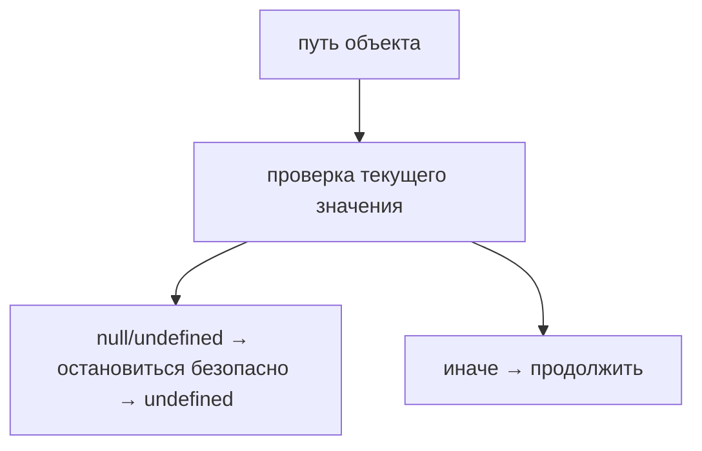

Optional Chaining safely traverses nested properties, but it does not choose a fallback value.

Например:

```javascript
const retries = config.retryPolicy?.retries;
```

Если `retryPolicy` отсутствует:

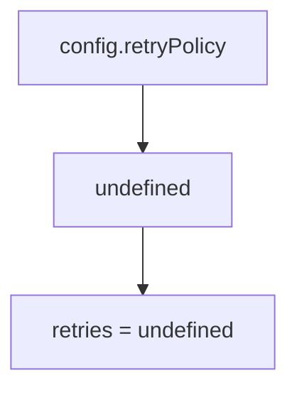

Теперь появляется следующий вопрос:

> Какое value использовать, если результат `null` or `undefined`?

Nullish Coalescing отвечает:

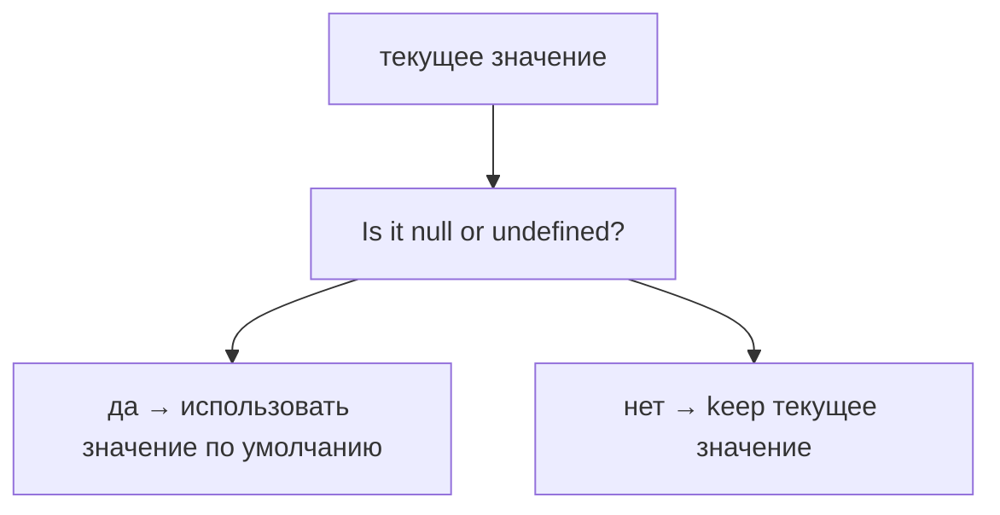

Главная мысль главы:

```text
?? replaces only null and undefined
```

Он не заменяет `0`, `false`, `''` or `NaN`.

---

## Предварительные требования

Для этой главы нужно понимать:

* что object может содержать optional properties;
* что missing property gives `undefined`;
* что Optional Chaining safely returns `undefined`;
* что `null` and `undefined` represent absent or intentionally empty значения in different situations;
* что variable receives expression result;
* что Automation QA code often uses configuration defaults.

Не требуется знать logical operators in detail, precedence rules, assignment operators, `??=`, complex expression parsing or TypeScript. Эти темы будут изучаться позже.

---

## Время изучения

Ориентировочное время:

```text
Чтение главы:            120-150 минут
Разбор схем:             50-70 минут
Запуск примеров:         20-30 минут
Практика:                100-130 минут
Повторение материала:    25 минут
```

Уровень сложности: **L3**.

`??` кажется маленьким operator, но он фиксирует важную инженерную идею: fallback нужен только тогда, когда value действительно отсутствует as `null` or `undefined`.

---

## Навигация

Предыдущая глава:

```text
docs/01-javascript/35-optional-chaining.md
```

Текущая глава:

```text
docs/01-javascript/36-nullish-coalescing.md
```

Следующая глава:

```text
docs/01-javascript/37-object-methods.md
```

Следующая глава ответит:

> Как objects могут хранить не только data, но и поведение?

---

## Цели обучения

После изучения этой главы вы будете понимать:

* зачем существует `??`;
* что такое nullish значения;
* когда используется fallback value;
* как работает evaluation order;
* что short-circuiting означает для `??`;
* как соединять Optional Chaining and `??`;
* чем `??` отличается от `||` на высоком уровне;
* почему `??` keeps `0`, `false`, `''` and `NaN`;
* какие ошибки чаще всего встречаются;
* как `??` используется в Automation QA.

---

## Мотивация

Начнем с проблемы.

Есть configuration object:

```javascript
const config = {
  baseUrl: 'https://api.example.test'
};
```

Test helper хочет прочитать retries:

```javascript
const retries = config.retryPolicy?.retries;
```

Optional Chaining безопасно остановится:


Но helper не может работать с `undefined`. Ему нужен конкретный fallback:

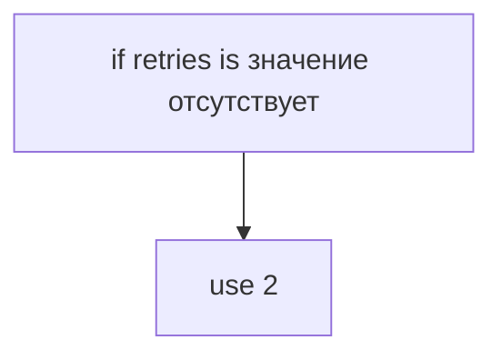

Можно написать:

```javascript
const retries = config.retryPolicy?.retries ?? 2;
```

Модель:

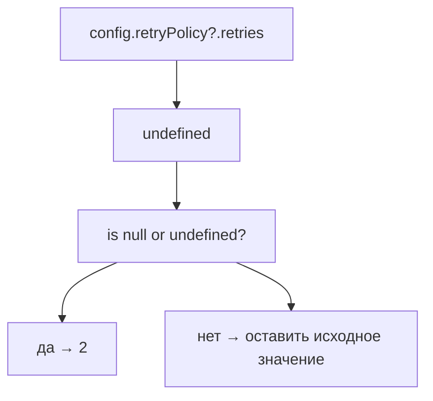

Теперь `retries` becomes `2`.

Важно:

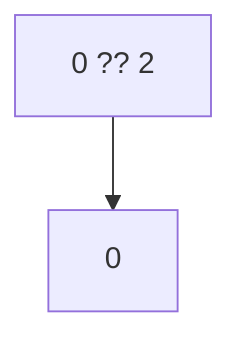

`0` is not `null` and not `undefined`.

---

## Теория

Nullish Coalescing exists because not every value that looks "empty" means "absent".

В JavaScript:

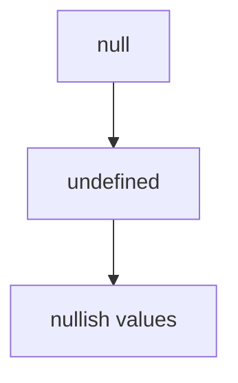

`??` asks exactly one question:

```text
Is the left side null or undefined?
```

It does not ask:

```text
Is the value false-like?
```

We will not study truthy/falsy or logical operators here. The only distinction in this chapter is:

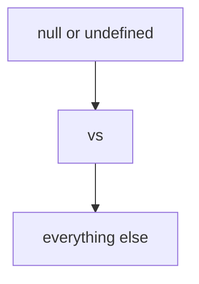

### Syntax

```javascript
const result = value ?? fallback;
```

Значение:

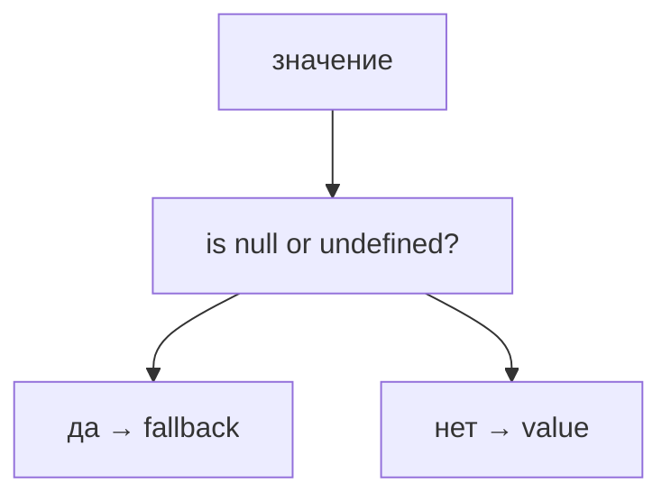

### Nullish значения

Nullish значения are:

```text
null
undefined
```

Only these two trigger fallback.

```javascript
console.log(undefined ?? 'fallback');
console.log(null ?? 'fallback');
```

Both use fallback.

### Existing значения

Values that are not `null` or `undefined` are preserved:

```javascript
console.log(0 ?? 10);
console.log(false ?? true);
console.log('' ?? 'default');
```

Результат:

```text
0
false

```

The third вывод is empty string. It is preserved.

### Fallback значения

Fallback value is used only when current value is `null` or `undefined`.

```javascript
const timeout = config.timeout ?? 5000;
```

Модель:

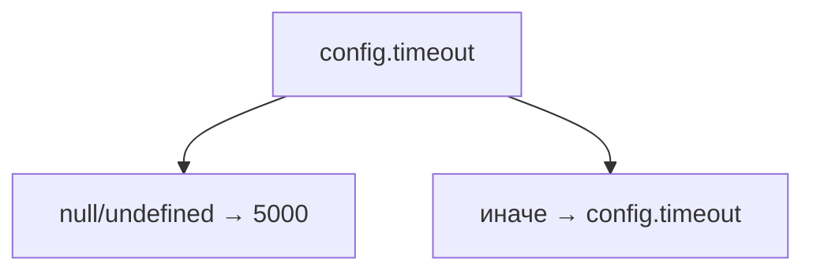

### Evaluation order

JavaScript evaluates left side first:

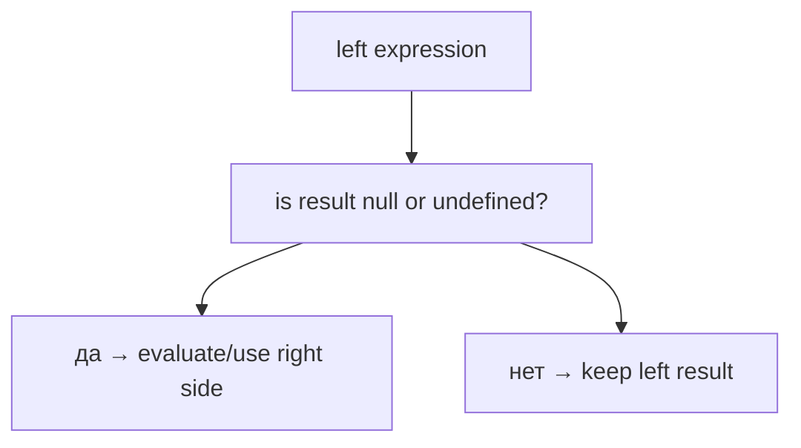

### Short-circuiting

If left side is not `null` and not `undefined`, fallback is not needed.

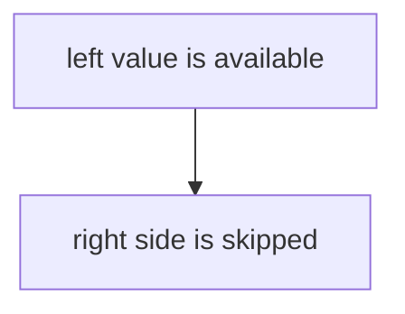

This is short-circuiting at a high level.

### Optional Chaining + `??`

The most natural combination:

```javascript
const retries = config.retryPolicy?.retries ?? 2;
```

Two-step model:

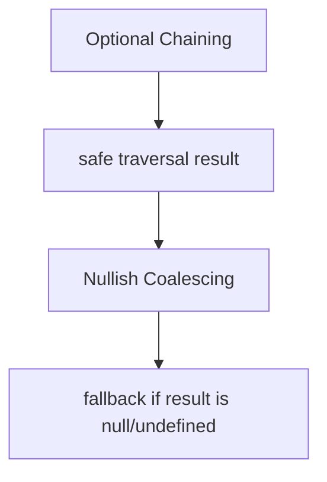

Optional Chaining отвечает:

```text
Can I safely read this path?
```

Nullish Coalescing отвечает:

```text
What should I use if result is null or undefined?
```

### Comparison with `||` preview

`||` will be studied with logical operators later.

Пока достаточно запомнить высокоуровневую разницу:

```text
?? checks only null and undefined
|| has broader logical behavior
```

That is why:

```javascript
console.log(0 ?? 10);
```

keeps `0`.

This matters in QA config:

```javascript
const retries = config.retries ?? 2;
```

If `retries` is intentionally `0`, `??` keeps `0`.

---

## Внутренний механизм

Рассмотрим:

```javascript
const timeout = config.timeout ?? 5000;
```

Концептуальный поток engine:

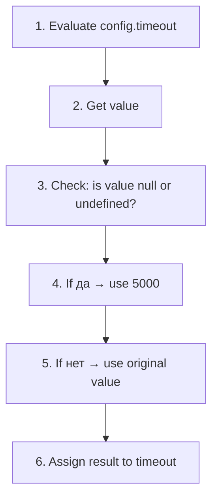

### Value inspection

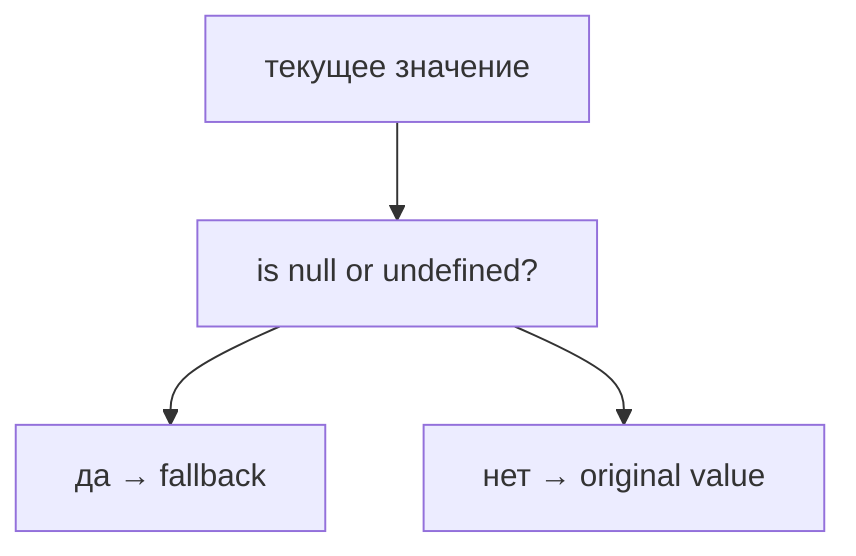

### Undefined path

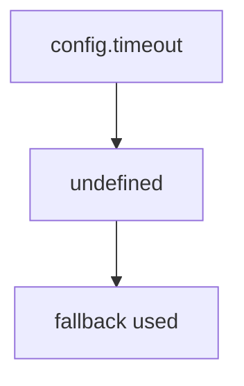

### Null path

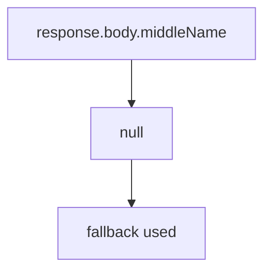

### Existing value path

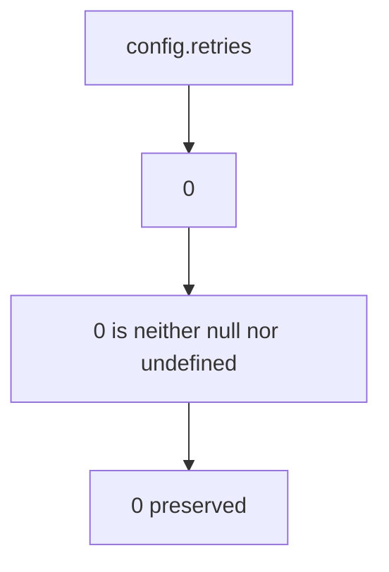

### Variable assignment

```javascript
const retries = config.retryPolicy?.retries ?? 2;
```

Engine conceptual поток:

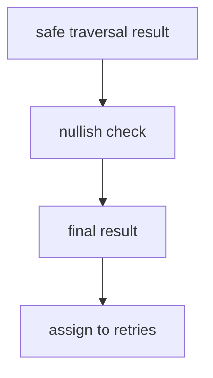

Source object remains unchanged.

---

## Ментальная модель

Представьте backup plan.

```mermaid
flowchart TD
    N1["Primary value"]
    N2["is it null or undefined?"]
    N3["да → backup plan"]
    N4["нет → primary value"]
    N1 --> N2
    N2 --> N3
    N2 --> N4
```

Spare key model:

```mermaid
flowchart TD
    N1["main key exists as usable value"]
    N2["use main key"]
    N3["main key is null/undefined"]
    N4["use spare key"]
    N1 --> N2
    N2 --> N3
    N3 --> N4
```

Fallback box:

```mermaid
flowchart TD
    N1["box with value"]
    N2["null/undefined → открыть запасной вариант"]
    N3["другое значение → keep box value"]
    N1 --> N2
    N1 --> N3
```

Главная модель:

```mermaid
flowchart TD
    N1["текущее значение"]
    N2["Is it null or undefined?"]
    N3["да → использовать значение по умолчанию"]
    N4["нет → keep текущее значение"]
    N1 --> N2
    N2 --> N3
    N2 --> N4
```

---

## Примеры кода

Примеры находятся в:

```text
examples/01-javascript/chapter-36/
```

Запуск:

```bash
node examples/01-javascript/chapter-36/01-basic-nullish.js
node examples/01-javascript/chapter-36/02-undefined.js
node examples/01-javascript/chapter-36/03-null.js
node examples/01-javascript/chapter-36/04-optional-chaining.js
node examples/01-javascript/chapter-36/05-common-mistakes.js
node examples/01-javascript/chapter-36/06-qa-example.js
```

### Пример 1. Basic nullish

```javascript
const configuredTimeout = 3000;
const timeout = configuredTimeout ?? 5000;

console.log(timeout);
```

### Пример 2. Undefined

```javascript
const config = {};

const timeout = config.timeout ?? 5000;

console.log(timeout);
```

### Пример 3. Null

```javascript
const user = {
  middleName: null
};

const middleName = user.middleName ?? 'not provided';

console.log(middleName);
```

### Пример 4. Optional Chaining

```javascript
const config = {};

const retries = config.retryPolicy?.retries ?? 2;

console.log(retries);
```

### Пример 5. Типичные ошибки

```javascript
const config = {
  retries: 0,
  verbose: false,
  label: ''
};

console.log(config.retries ?? 2);
console.log(config.verbose ?? true);
console.log(config.label ?? 'default');
```

`??` keeps `0`, `false` and empty string.

### Пример 6. QA example

```javascript
const apiResponse = {
  status: 200,
  body: {
    user: {
      profile: {
        name: 'Anna'
      }
    }
  }
};

const config = {
  retries: 0
};

const userName = apiResponse.body.user.profile?.name ?? 'anonymous';
const city = apiResponse.body.user.profile?.address?.city ?? 'unknown city';
const retries = config.retries ?? 2;

console.log(userName);
console.log(city);
console.log(retries);
```

---

## Частые вопросы

### `??` заменяет все "пустые" значения?

Нет.

`??` replaces only:

```text
null
undefined
```

It keeps:

```text
0
false
''
NaN
```

### `??` это то же самое, что Optional Chaining?

Нет.

```mermaid
flowchart TD
    N1["Optional Chaining"]
    N2["safe traversal"]
    N3["Nullish Coalescing"]
    N4["fallback selection"]
    N1 --> N2
    N1 --> N3
    N3 --> N4
```

### `??` меняет source object?

Нет.

It produces expression result.

### Когда использовать `??`?

Когда fallback should be used only for `null` or `undefined`.

### Нужно ли использовать `??` после каждого Optional Chaining?

Нет.

Если `undefined` is acceptable result, fallback не нужен.

---

## Распространенные мифы

### Миф: `??` заменяет любое "false-like" value

Реальность:

```text
only null and undefined
```

### Миф: `??` исправляет данные в object

Реальность:

It chooses result value. It does not write back to object.

### Миф: `??` нужен только после Optional Chaining

Реальность:

Optional Chaining + `??` is common, but `??` can work with any expression result.

### Миф: `??` всегда лучше `||`

Реальность:

They solve different problems. Logical operators will be studied later. In this chapter, use `??` when fallback is only for `null` or `undefined`.

---

## Типичные ошибки

### Ошибка 1. Ожидать replacement for `0`

```javascript
const retries = 0 ?? 2;
```

Результат:

```text
0
```

`0` is not `null` and not `undefined`.

### Ошибка 2. Ожидать replacement for `false`

```javascript
const verbose = false ?? true;
```

Результат:

```text
false
```

### Ошибка 3. Думать, что fallback writes into object

```javascript
const config = {};
const timeout = config.timeout ?? 5000;

console.log(config.timeout);
```

`config.timeout` remains `undefined`.

### Ошибка 4. Использовать fallback там, где missing value should fail

If API поле is required, fallback can hide a contract problem.

```mermaid
flowchart TD
    N1["required field значение отсутствует"]
    N2["test should fail clearly"]
    N1 --> N2
```

---

## Практическое использование

### Configuration defaults

```javascript
const timeout = config.timeout ?? 5000;
const retries = config.retries ?? 2;
```

### Необязательные API-поля

```javascript
const middleName = user.middleName ?? 'not provided';
```

### Retry counts

```javascript
const retries = config.retryPolicy?.retries ?? 2;
```

If retries is `0`, `??` keeps `0`.

### Timeout значения

```javascript
const timeoutMs = config.timeouts?.api ?? 5000;
```

### Assertion helpers

```javascript
const displayName = response.body.user.profile?.displayName ?? response.body.user.profile?.name;
```

This keeps fallback logic explicit.

---

## Использование в Automation QA

### Configuration defaults

Automation frameworks often use config objects:

```javascript
const timeout = testConfig.timeout ?? 5000;
```

If timeout is missing, use default.

If timeout is `0`, keep `0`.

### Необязательные API-поля

```javascript
const city = response.body.user.profile?.address?.city ?? 'unknown';
```

Optional Chaining safely reads. `??` chooses fallback.

### Retry counts

```javascript
const retries = config.retryPolicy?.retries ?? 2;
```

This is important because `0` may mean "do not retry".

### Assertion helpers

```javascript
const label = response.body.user.profile?.label ?? 'unlabeled user';
```

Helper receives a stable value without changing source response.

---

## Диаграммы главы

### 1. Why ?? exists

```mermaid
flowchart TD
    N1["safe read result"]
    N2["may be null/undefined"]
    N3["need fallback value"]
    N1 --> N2
    N2 --> N3
```

### 2. Optional Chaining → ??

```mermaid
flowchart TD
    N1["?."]
    N2["undefined"]
    N3["??"]
    N4["fallback"]
    N1 --> N2
    N2 --> N3
    N3 --> N4
```

### 3. Value inspection

```mermaid
flowchart TD
    N1["текущее значение"]
    N2["is null or undefined?"]
    N1 --> N2
```

### 4. Fallback decision

```mermaid
flowchart TD
    N1["null/undefined"]
    N2["да → fallback"]
    N3["нет → текущее значение"]
    N1 --> N2
    N1 --> N3
```

### 5. Null

```mermaid
flowchart TD
    N1["null"]
    N2["использовать значение по умолчанию"]
    N1 --> N2
```

### 6. Undefined

```mermaid
flowchart TD
    N1["undefined"]
    N2["использовать значение по умолчанию"]
    N1 --> N2
```

### 7. Existing value

```mermaid
flowchart TD
    N1["0 / false / ''"]
    N2["keep value"]
    N1 --> N2
```

### 8. Evaluation flow

```mermaid
flowchart TD
    N1["evaluate left"]
    N2["nullish check"]
    N3["choose result"]
    N1 --> N2
    N2 --> N3
```

### 9. Short-circuit

```mermaid
flowchart TD
    N1["left is not null/undefined"]
    N2["right side not needed"]
    N1 --> N2
```

### 10. QA configuration

```mermaid
flowchart TD
    N1["config.timeout"]
    N2["value → использовать значение"]
    N3["undefined → значение по умолчанию"]
    N1 --> N2
    N1 --> N3
```

### 11. API response

```mermaid
flowchart TD
    N1["response optional field"]
    N2["значение есть → value"]
    N3["null/undefined → fallback"]
    N1 --> N2
    N1 --> N3
```

### 12. Читаемость

```mermaid
flowchart TD
    N1["value ?? fallback"]
    N2["explicit значение отсутствует-value policy"]
    N1 --> N2
```

### 13. Типичные ошибки

```mermaid
flowchart TD
    N1["0 ?? 2"]
    N2["0"]
    N1 --> N2
```

### 14. || preview

```mermaid
flowchart TD
    N1["??"]
    N2["null/undefined only"]
    N3["broader logical behavior later"]
    N1 --> N2
    N1 --> N3
```

### 15. Текущая модель JavaScript

```mermaid
flowchart TD
    N1["Objects"]
    N2["Destructuring"]
    N3["Optional Chaining"]
    N4["Nullish Coalescing"]
    N1 --> N2
    N1 --> N3
    N1 --> N4
```

### 16. Complete ?? model

```mermaid
flowchart TD
    N1["значение"]
    N2["null or undefined?"]
    N3["да → fallback"]
    N4["нет → value"]
    N1 --> N2
    N2 --> N3
    N2 --> N4
```

### 17. Reserve value

```mermaid
flowchart TD
    N1["primary value absent"]
    N2["reserve value"]
    N1 --> N2
```

### 18. Backup plan

```mermaid
flowchart TD
    N1["main plan unavailable"]
    N2["backup plan"]
    N1 --> N2
```

### 19. Decision tree

```mermaid
flowchart TD
    N1["check value"]
    N2["null"]
    N3["undefined"]
    N4["other"]
    N1 --> N2
    N1 --> N3
    N1 --> N4
```

### 20. Variable assignment

```mermaid
flowchart TD
    N1["chosen result"]
    N2["assigned to variable"]
    N1 --> N2
```

### 21. Fallback timeline

```mermaid
flowchart TD
    N1["read value"]
    N2["inspect"]
    N3["choose fallback or original"]
    N1 --> N2
    N2 --> N3
```

### 22. Automation QA config

```mermaid
flowchart TD
    N1["retryPolicy?.retries"]
    N2["?? 2"]
    N1 --> N2
```

### 23. Optional API поле

```mermaid
flowchart TD
    N1["profile?.address?.city"]
    N2["?? 'unknown'"]
    N1 --> N2
```

### 24. Chaining with ?.

```mermaid
flowchart TD
    N1["safe traversal"]
    N2["fallback selection"]
    N1 --> N2
```

### 25. Краткая ментальная модель

```mermaid
flowchart TD
    N1["backup plan"]
    N2["spare key"]
    N3["reserve value"]
    N1 --> N2
    N2 --> N3
```

### 26. Existing value preserved

```mermaid
flowchart TD
    N1["false"]
    N2["kept"]
    N1 --> N2
```

### 27. Nullish значения only

```mermaid
flowchart TD
    N1["null"]
    N2["undefined"]
    N3["fallback"]
    N2 --> N3
    N1 --> N2
```

### 28. Safe traversal + fallback

```mermaid
flowchart TD
    N1["?. reads safely"]
    N2["?? fills only null/undefined"]
    N1 --> N2
```

### 29. Undefined path

```mermaid
flowchart TD
    N1["значение отсутствует property"]
    N2["undefined"]
    N3["fallback"]
    N1 --> N2
    N2 --> N3
```

### 30. Complete flow

```mermaid
flowchart TD
    N1["expression"]
    N2["результат"]
    N3["nullish?"]
    N4["final value"]
    N1 --> N2
    N2 --> N3
    N3 --> N4
```

### 31. Переход к Object Methods

```mermaid
flowchart TD
    N1["objects store data"]
    N2["next: objects store behavior"]
    N1 --> N2
```

### 32. Итоговая схема

```mermaid
flowchart TD
    N1["текущее значение"]
    N2["Is it null or undefined?"]
    N3["да → использовать значение по умолчанию"]
    N4["нет → Keep текущее значение"]
    N1 --> N2
    N2 --> N3
    N2 --> N4
```

---

## Практика

Практика находится в:

```text
practice/01-javascript/36-nullish-coalescing.md
```

Рекомендуемый порядок:

```text
1. Ответить на концептуальные вопросы.
2. Определить result expressions.
3. Предсказать вывод кода.
4. Запустить examples/01-javascript/chapter-36/.
5. Выполнить debugging tasks.
6. Сделать QA mini-project.
7. Свериться с solutions/01-javascript/36-nullish-coalescing.md.
```

---

## Решения

Решения находятся в:

```text
solutions/01-javascript/36-nullish-coalescing.md
```

Не открывайте решения до самостоятельной попытки. Главный навык главы - понимать, когда fallback is used and when original value is preserved.

---

## Итоги

Nullish Coalescing продолжает Optional Chaining.

```mermaid
flowchart TD
    N1["Optional Chaining"]
    N2["safe traversal"]
    N3["result may be undefined"]
    N4["Nullish Coalescing"]
    N5["fallback only for null/undefined"]
    N1 --> N2
    N2 --> N3
    N3 --> N4
    N4 --> N5
```

Главная модель:

```mermaid
flowchart TD
    N1["текущее значение"]
    N2["Is it null or undefined?"]
    N3["да → использовать значение по умолчанию"]
    N4["нет → Keep текущее значение"]
    N1 --> N2
    N2 --> N3
    N2 --> N4
```

---

## Что нужно запомнить

* `??` exists for fallback значения.
* Fallback is used only for `null` and `undefined`.
* `??` keeps `0`, `false`, `''` and `NaN`.
* `??` does not change source object.
* Left side is evaluated first.
* If left side is not nullish, fallback is not needed.
* Optional Chaining and `??` work naturally together.
* `??` is not the same as `||`.
* In QA, `??` is useful for config defaults and optional API поля.
* Object Methods are the next step: objects can contain поведение as well as data.

---

## Проверьте себя

Ответьте без запуска кода.

1. Какую проблему решает `??`?
2. Какие значения are nullish?
3. Когда fallback is used?
4. Почему `0 ?? 2` returns `0`?
5. Почему `undefined ?? 2` returns `2`?
6. Меняет ли `??` source object?
7. Как Optional Chaining and `??` work together?
8. Чем `??` differs from `||` at high level?
9. Где `??` useful in Automation QA?
10. Какая следующая тема логически продолжает Objects section?
