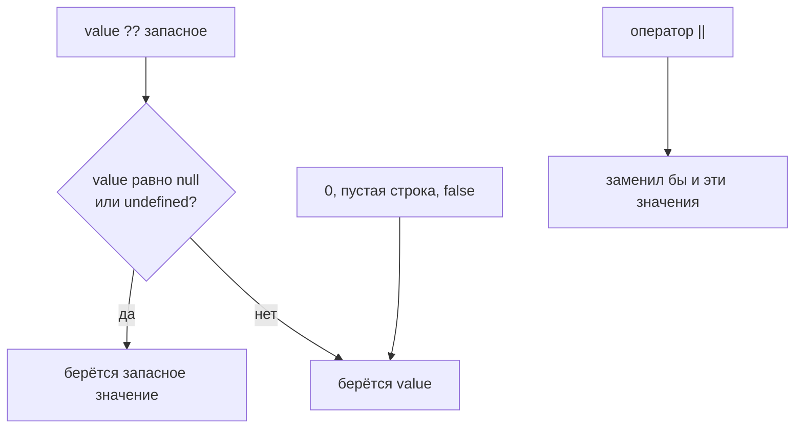

# Нулевое слияние

## Связь с предыдущей главой

Предыдущая глава объяснила Optional Chaining.

Главная модель была такой: `?.` безопасно проходит цепочку свойств и возвращает `undefined`, если звено отсутствует.

Optional Chaining safely traverses nested properties, but it does not choose a fallback value.

Например:

```javascript
const retries = config.retryPolicy?.retries;
```

Если `retryPolicy` отсутствует:

Теперь появляется следующий вопрос:

> Какое value использовать, если результат `null` or `undefined`?

Nullish Coalescing отвечает:

Главная мысль главы:

```text
?? replaces только null и undefined
```

Он не заменяет `0`, `false`, `''` or `NaN`.

---

## Предварительные требования

Для этой главы нужно понимать:

* что object может содержать optional properties;
* что missing property gives `undefined`;
* что Optional Chaining safely returns `undefined`;
* что `null` and `undefined` represent absent or intentionally empty значения in different situations;
* что variable receives expression result;
* что Automation QA code often uses configuration defaults.

Не требуется знать logical operators in detail, precedence rules, assignment operators, `??=`, complex expression parsing or TypeScript. Эти темы будут изучаться позже.

---

## Время изучения

Ориентировочное время:

```text
Чтение главы:            120-150 минут
Разбор схем:             50-70 минут
Запуск примеров:         20-30 минут
Практика:                100-130 минут
Повторение материала:    25 минут
```

Уровень сложности: **L3**.

`??` кажется маленьким operator, но он фиксирует важную инженерную идею: fallback нужен только тогда, когда value действительно отсутствует as `null` or `undefined`.

---

## Навигация

Предыдущая глава:

```text
docs/01-javascript/35-optional-chaining.md
```

Текущая глава:

```text
docs/01-javascript/36-nullish-coalescing.md
```

Следующая глава:

```text
docs/01-javascript/37-object-methods.md
```

Следующая глава ответит:

> Как objects могут хранить не только data, но и поведение?

---

## Цели обучения

После изучения этой главы вы будете понимать:

* зачем существует `??`;
* что такое nullish значения;
* когда используется fallback value;
* как работает evaluation order;
* что short-circuiting означает для `??`;
* как соединять Optional Chaining and `??`;
* чем `??` отличается от `||` на высоком уровне;
* почему `??` keeps `0`, `false`, `''` and `NaN`;
* какие ошибки чаще всего встречаются;
* как `??` используется в Automation QA.

---

## Мотивация

Начнем с проблемы.

Есть configuration object:

```javascript
const config = {
  baseUrl: 'https://api.example.test'
};
```

Test helper хочет прочитать retries:

```javascript
const retries = config.retryPolicy?.retries;
```

Optional Chaining безопасно остановится:

Но helper не может работать с `undefined`. Ему нужен конкретный fallback:

Можно написать:

```javascript
const retries = config.retryPolicy?.retries ?? 2;
```

Модель:

```text
value ?? fallback

срабатывает только при null или undefined
```

Теперь `retries` becomes `2`.

Важно:

`0` is not `null` and not `undefined`.

---

## Теория

Оператор `??` существует потому, что не всякое значение, выглядящее «пустым», означает «отсутствует».

В JavaScript ложными считаются и `0`, и `''`, и `false` — а это часто вполне
осмысленные значения: ноль повторов, пустой заголовок, отключённый флаг.

`??` задаёт ровно один вопрос:

```text
слева null или undefined?
```

Он не спрашивает:

```text
значение ложное?
```

Истинность, ложность и логические операторы здесь не изучаются. Единственное различие в этой главе:

```text
значение отсутствует  —  null или undefined
значение есть         —  всё остальное, включая 0, '' и false
```

### Синтаксис

```javascript
const result = value ?? fallback;
```

Значение:

```text
левая часть — null или undefined  →  результат равен fallback
в остальных случаях               →  результат равен левой части
```

### Отсутствующие значения

Отсутствующими считаются:

```text
null
undefined
```

Только эти два включают запасное значение.

```javascript
console.log(undefined ?? 'fallback');
console.log(null ?? 'fallback');
```

В обоих случаях берётся запасное значение.

### Существующие значения

Значения, которые не равны `null` и `undefined`, сохраняются:

```javascript
console.log(0 ?? 10);
console.log(false ?? true);
console.log('' ?? 'default');
```

Результат:

```text
0
false

```

Третий вывод — пустая строка. Она сохраняется.

### Запасное значение

Запасное значение используется только тогда, когда текущее равно `null` или `undefined`.

```javascript
const timeout = config.timeout ?? 5000;
```

Модель:

| Выражение | `0` | `''` | `null` |
| --- | --- | --- | --- |
| `value \|\| fallback` | заменит | заменит | заменит |
| `value ?? fallback` | оставит | оставит | заменит |

### Порядок вычисления

JavaScript сначала вычисляет левую часть:

```text
1. вычислить левую часть
2. результат null или undefined  →  вычислить и вернуть правую
3. иначе                         →  вернуть левую, правую не вычислять
```

### Короткое замыкание

Если левая часть не `null` и не `undefined`, запасное значение не нужно.

Это короткое замыкание на высоком уровне.

### Опциональная цепочка и `??`

Самое естественное сочетание:

```javascript
const retries = config.retryPolicy?.retries ?? 2;
```

Двухшаговая модель: сначала безопасно прочитать путь, затем подставить значение
по умолчанию, если прочитанного нет.

Оператор `?.` отвечает:

```text
можно ли безопасно прочитать этот путь?
```

Оператор `??` отвечает:

```text
что использовать, если результат null или undefined?
```

### Сравнение с `||`

Оператор `||` будет изучаться позже, вместе с логическими операторами.

Пока достаточно запомнить высокоуровневую разницу:

```text
?? проверяет только null и undefined
|| has broader logical behavior
```

Именно поэтому:

```javascript
console.log(0 ?? 10);
```

сохраняет `0`.

Это важно в настройках тестов:

```javascript
const retries = config.retries ?? 2;
```

Если `retries` намеренно равно `0`, `??` сохранит `0`.

---

`??` реагирует только на отсутствие значения:


```mermaid
flowchart TD
    A["value ?? запасное"] --> B{"value равно null<br/>или undefined?"}
    B -- "да" --> C["берётся запасное значение"]
    B -- "нет" --> D["берётся value"]
    E["0, пустая строка, false"] --> D
    F["оператор ||"] --> G["заменил бы и эти значения"]
```

## Внутренний механизм

Рассмотрим:

```javascript
const timeout = config.timeout ?? 5000;
```

Концептуальный ход работы движка:

```text
1. прочитать config.timeout
2. проверить, равно ли значение null или undefined
3. равно    →  результатом становится 5000
4. не равно →  результатом становится само значение
```

### Что именно проверяется

Проверяется ровно одно: отсутствует значение или нет. Тип и «осмысленность»
значения оператор не интересуют.

### Свойства нет в объекте

```text
config.timeout  →  undefined  →  результат 5000
```

### Свойство есть и равно `null`

```text
config.timeout  →  null  →  результат 5000
```

`null` здесь обычно означает «сервер явно вернул пустое значение», и подстановка
по умолчанию так же уместна, как при отсутствующем поле.

### Свойство есть и содержит значение

```text
config.timeout  →  0  →  результат 0
```

Именно этим `??` отличается от `||`: ноль, пустая строка и `false` — настоящие
значения настройки, и заменять их нельзя.

### Присваивание переменной

```javascript
const retries = config.retryPolicy?.retries ?? 2;
```

Концептуальный ход работы движка:

Исходный объект остаётся неизменным.

---

## Ментальная модель

Представьте запасной план.

Модель запасного ключа: основной ключ берут, если он есть; запасной — только
когда основного нет вовсе.

Главная модель: `??` реагирует ровно на два значения — `null` и `undefined`.
`false`, `0` и пустая строка для него нормальные значения и подмене не
подлежат.

---

## Примеры кода

Примеры находятся в:

```text
examples/01-javascript/chapter-36/
```

Запуск:

```bash
node examples/01-javascript/chapter-36/01-basic-nullish.js
node examples/01-javascript/chapter-36/02-undefined.js
node examples/01-javascript/chapter-36/03-null.js
node examples/01-javascript/chapter-36/04-optional-chaining.js
node examples/01-javascript/chapter-36/05-common-mistakes.js
node examples/01-javascript/chapter-36/06-qa-example.js
```

### Пример 1. Базовое использование

```javascript
const configuredTimeout = 3000;
const timeout = configuredTimeout ?? 5000;

console.log(timeout);
```

### Пример 2. `undefined`

```javascript
const config = {};

const timeout = config.timeout ?? 5000;

console.log(timeout);
```

### Пример 3. `null`

```javascript
const user = {
  middleName: null
};

const middleName = user.middleName ?? 'not provided';

console.log(middleName);
```

### Пример 4. Вместе с безопасным чтением

```javascript
const config = {};

const retries = config.retryPolicy?.retries ?? 2;

console.log(retries);
```

### Пример 5. Типичные ошибки

```javascript
const config = {
  retries: 0,
  verbose: false,
  label: ''
};

console.log(config.retries ?? 2);
console.log(config.verbose ?? true);
console.log(config.label ?? 'default');
```

`??` сохраняет `0`, `false` и пустую строку.

### Пример 6. Пример из автоматизации тестов

```javascript
const apiResponse = {
  status: 200,
  body: {
    user: {
      profile: {
        name: 'Anna'
      }
    }
  }
};

const config = {
  retries: 0
};

const userName = apiResponse.body.user.profile?.name ?? 'anonymous';
const city = apiResponse.body.user.profile?.address?.city ?? 'unknown city';
const retries = config.retries ?? 2;

console.log(userName);
console.log(city);
console.log(retries);
```

---

## Частые вопросы

### `??` заменяет все "пустые" значения?

Нет.

`??` подменяет только:

```text
null
undefined
```

Он сохраняет:

```text
0
false
''
NaN
```

### `??` — это то же самое, что безопасное чтение цепочки?

Нет.

### Меняет ли `??` исходный объект?

Нет.

Он даёт результат выражения.

### Когда использовать `??`?

Когда запасное значение нужно подставлять только вместо `null` или `undefined`.

### Нужно ли использовать `??` после каждого `?.`?

Нет.

Если `undefined` — приемлемый результат, запасное значение не нужно.

---

## Распространённые мифы

### Миф: `??` заменяет любое «похожее на ложь» значение

Реальность:

```text
только null и undefined
```

### Миф: `??` исправляет данные в объекте

Реальность:

Он выбирает результат выражения. В объект он ничего не записывает.

### Миф: `??` нужен только после безопасного чтения

Реальность:

Связка `?.` и `??` встречается часто, но `??` работает с любым результатом выражения.

### Миф: `??` всегда лучше `||`

Реальность:

Они решают разные задачи. Логические операторы будут изучаться позже. В этой главе используйте `??`, когда запасное значение нужно только для `null` или `undefined`.

---

## Распространённые ошибки

### Ошибка 1. Ожидать замену для `0`

```javascript
const retries = 0 ?? 2;
```

Результат:

```text
0
```

`0` не равен ни `null`, ни `undefined`.

### Ошибка 2. Ожидать замену для `false`

```javascript
const verbose = false ?? true;
```

Результат:

```text
false
```

### Ошибка 3. Думать, что запасное значение записывается в объект

```javascript
const config = {};
const timeout = config.timeout ?? 5000;

console.log(config.timeout);
```

`config.timeout` остаётся `undefined`.

### Ошибка 4. Подставлять запасное значение там, где отсутствие должно ломать тест

Если поле ответа обязательно, запасное значение может скрыть нарушение контракта.

---

## Практическое использование

### Значения конфигурации по умолчанию

```javascript
const timeout = config.timeout ?? 5000;
const retries = config.retries ?? 2;
```

### Необязательные API-поля

```javascript
const middleName = user.middleName ?? 'not provided';
```

### Счётчики повторов

```javascript
const retries = config.retryPolicy?.retries ?? 2;
```

Если число повторов равно `0`, `??` сохранит `0`.

### Значения сроков ожидания

```javascript
const timeoutMs = config.timeouts?.api ?? 5000;
```

### Вспомогательные проверки

```javascript
const displayName = response.body.user.profile?.displayName ?? response.body.user.profile?.name;
```

Так логика запасных значений остаётся явной.

---

## Использование в Automation QA

### Значения конфигурации по умолчанию

Фреймворки автоматизации часто используют объекты настройки:

```javascript
const timeout = testConfig.timeout ?? 5000;
```

Если срок ожидания отсутствует, берётся значение по умолчанию.

Если срок ожидания равен `0`, сохраняется `0`.

### Необязательные API-поля

```javascript
const city = response.body.user.profile?.address?.city ?? 'unknown';
```

Оператор `?.` безопасно читает. `??` выбирает запасное значение.

### Счётчики повторов

```javascript
const retries = config.retryPolicy?.retries ?? 2;
```

Это важно, потому что `0` может означать «не повторять».

### Вспомогательные проверки

```javascript
const label = response.body.user.profile?.label ?? 'unlabeled user';
```

Вспомогательная функция получает предсказуемое значение, не меняя исходный ответ.

---

## Практика

Практика находится в:

```text
practice/01-javascript/36-nullish-coalescing.md
```

Рекомендуемый порядок:

```text
1. Ответить на концептуальные вопросы.
2. Определить result expressions.
3. Предсказать вывод кода.
4. Запустить examples/01-javascript/chapter-36/.
5. Выполнить debugging tasks.
6. Сделать QA mini-project.
7. Свериться с solutions/01-javascript/36-nullish-coalescing.md.
```

---

## Решения

Решения находятся в:

```text
solutions/01-javascript/36-nullish-coalescing.md
```

Не открывайте решения до самостоятельной попытки. Главный навык главы — понимать, когда берётся запасное значение, а когда сохраняется исходное.

---

## Итоги

Оператор `??` продолжает тему безопасного чтения цепочки.

Главная модель: `?.` отвечает за безопасный проход по звеньям, `??` — за
значение по умолчанию в конце. Вместе они дают привычную строку
`response?.body?.retries ?? 0`, где отсутствие данных и значение `0` остаются
различимыми.

---

## Что нужно запомнить

* `??` существует для запасных значений.
* Запасное значение берётся только для `null` и `undefined`.
* `??` сохраняет `0`, `false`, `''` и `NaN`.
* `??` не меняет исходный объект.
* Левая часть вычисляется первой.
* Если левая часть не отсутствует, запасное значение не нужно.
* Безопасное чтение и `??` естественно работают вместе.
* `??` — это не то же самое, что `||`.
* В тестах `??` полезен для значений настройки по умолчанию и необязательных полей ответа.
* Методы объектов — следующий шаг: объекты могут содержать не только данные, но и поведение.

---

## Проверьте себя

Ответьте без запуска кода.

1. Какую проблему решает `??`?
2. Какие значения считаются отсутствующими?
3. Когда берётся запасное значение?
4. Почему `0 ?? 2` даёт `0`?
5. Почему `undefined ?? 2` даёт `2`?
6. Меняет ли `??` исходный объект?
7. Как безопасное чтение и `??` работают вместе?
8. Чем `??` отличается от `||` на высоком уровне?
9. Где `??` полезен в автоматизации тестов?
10. Какая следующая тема логически продолжает раздел про объекты?

### Ответы

1. Подстановку значения по умолчанию ровно там, где значения нет, — и только там.
2. `null` и `undefined`. Больше ничего.
3. Когда левая часть равна `null` или `undefined`.
4. `0` — настоящее значение, а не отсутствие значения. Оператор его не заменяет.
5. `undefined` означает, что значения нет, поэтому берётся запасное.
6. Нет. Он только вычисляет результат выражения.
7. `?.` безопасно доходит до нужного поля и при обрыве цепочки даёт `undefined`, а `??` превращает этот `undefined` в осмысленное значение по умолчанию.
8. `||` заменяет любое ложное значение, включая `0`, `''` и `false`. `??` реагирует только на отсутствие значения.
9. В настройках запуска: нулевое число повторов, пустой префикс, выключённый флаг — законные значения, и `||` молча заменил бы их на умолчания.
10. Методы объектов: поведение, которое живёт рядом с данными.

