# Object Methods

## Связь с предыдущей главой

Предыдущие главы раздела Objects показали, что object может хранить related data:

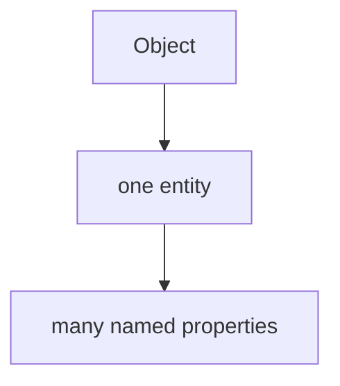

Затем мы научились:

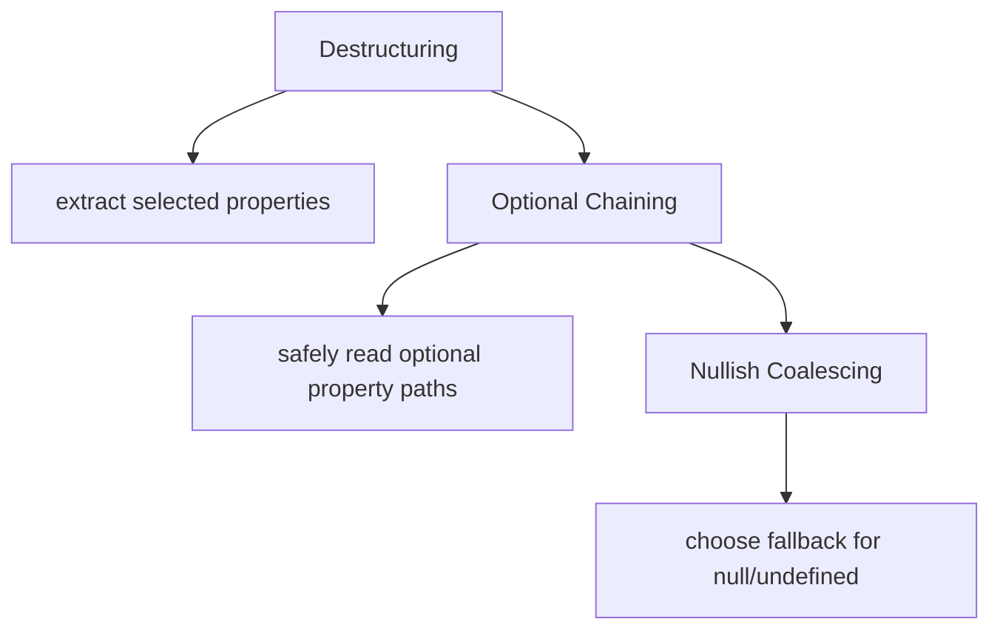

Теперь появляется следующий вопрос:

> Может ли object хранить поведение, связанное с его data?

Например, есть user:

```javascript
const user = {
  name: 'Anna',
  email: 'anna@example.test',
  role: 'admin'
};
```

Данные уже относятся к одной сущности.

Но поведение тоже может относиться к той же сущности:

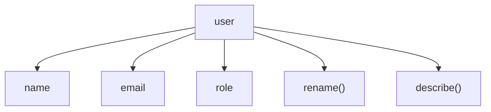

Главная модель главы:

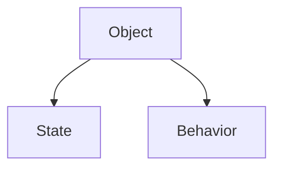

---

## Предварительные требования

Для этой главы нужно понимать:

* что object stores related data;
* что property имеет key и value;
* что property value can be any JavaScript value;
* что function object можно хранить в variable;
* что `this` определяется при invocation;
* что обычный вызов `object.method()` выбирает объект выполнения из формы вызова;
* что `call()`, `apply()` и `bind()` связаны с выбором объекта выполнения.

Не требуется знать descriptors, prototypes, classes, inheritance, `Object.create()`, method borrowing, `super` или arrow functions as methods in depth. Эти темы будут изучаться позже.

---

## Время изучения

Ориентировочное время:

```text
Чтение главы:            130-160 минут
Разбор схем:             55-75 минут
Запуск примеров:         20-30 минут
Практика:                110-140 минут
Повторение материала:    30 минут
```

Уровень сложности: **L3-L4**.

Object methods кажутся простыми, но они связывают несколько важных идей: объекты, функции, свойства, объект выполнения и `this`.

---

## Навигация

Предыдущая глава:

```text
docs/01-javascript/36-nullish-coalescing.md
```

Текущая глава:

```text
docs/01-javascript/37-object-methods.md
```

Следующая глава:

```text
docs/01-javascript/38-object-descriptors.md
```

Следующая глава ответит:

> Почему некоторые object properties behave differently from others?

---

## Цели обучения

После изучения этой главы вы будете понимать:

* зачем существуют object methods;
* почему поведение может относиться к объекту;
* как method связан с состоянием объекта;
* как выглядит method syntax;
* чем вызов метода отличается от вызова обычной функции;
* как вызов метода связан с `this`;
* почему method остается обычной функцией;
* почему не стоит определять method только как "function inside object";
* какие ошибки встречаются чаще всего;
* как object methods используются в Automation QA.

---

## Мотивация

Начнем с проблемы.

Есть user data:

```javascript
const user = {
  name: 'Anna',
  email: 'anna@example.test',
  role: 'admin'
};
```

И есть поведение:

```javascript
function describeUser(user) {
  return user.name + ' <' + user.email + '> [' + user.role + ']';
}

function renameUser(user, newName) {
  user.name = newName;
}
```

Такой код работает.

Но поведение живет отдельно от entity:

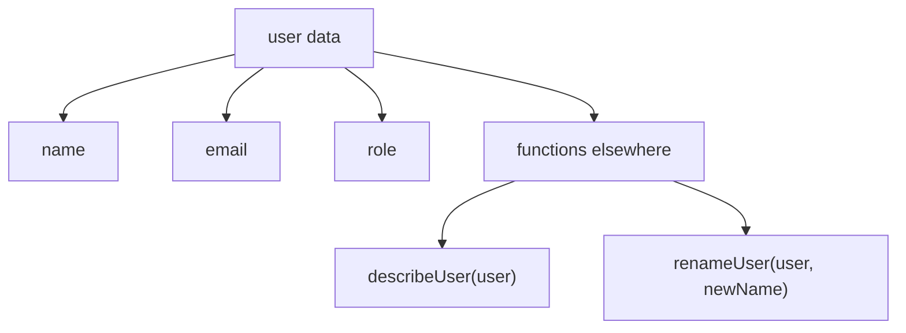

Вопрос:

> Почему поведение, которое работает только с user, живет отдельно от user?

Object method позволяет показать принадлежность:

```javascript
const user = {
  name: 'Anna',
  email: 'anna@example.test',
  role: 'admin',
  describe() {
    return this.name + ' <' + this.email + '> [' + this.role + ']';
  }
};
```

Теперь поведение относится к той же сущности:

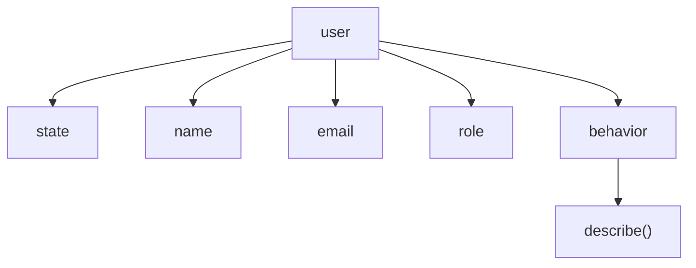

Главный вопрос главы:

> Почему это поведение относится к этому объекту?

---

## Теория

Object method — это поведение, связанное с объектом.

Но важно не начинать и не заканчивать определением "method is a function inside object". Это слишком механическое описание.

Лучше:

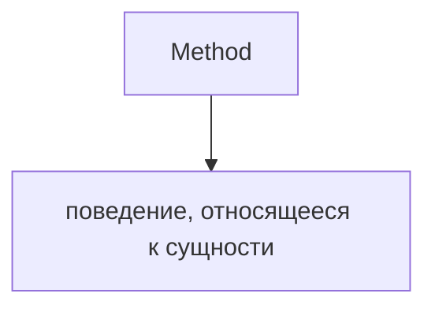

### Why methods exist

Objects started as data grouping:

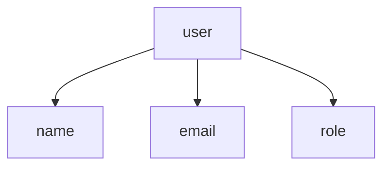

But entities often have actions:

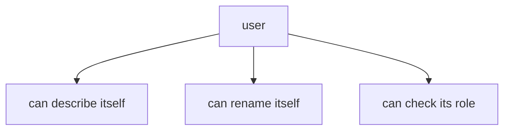

Methods позволяют объекту держать поведение рядом с данными, которые оно использует.

### Состояние и поведение

Состояние — это данные, сохранённые в объекте:

```javascript
const user = {
  name: 'Anna',
  role: 'admin'
};
```

Behavior is what object can do:

```javascript
const user = {
  name: 'Anna',
  role: 'admin',
  isAdmin() {
    return this.role === 'admin';
  }
};
```

Модель:

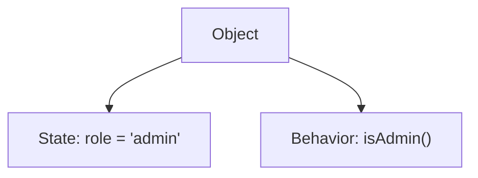

### Method syntax

Modern method syntax:

```javascript
const user = {
  describe() {
    return this.name;
  }
};
```

Older equivalent style:

```javascript
const user = {
  describe: function () {
    return this.name;
  }
};
```

Both store function object in object property.

In this chapter we use method syntax because it expresses intention clearly.

### Calling methods

```javascript
user.describe();
```

This is вызов метода:

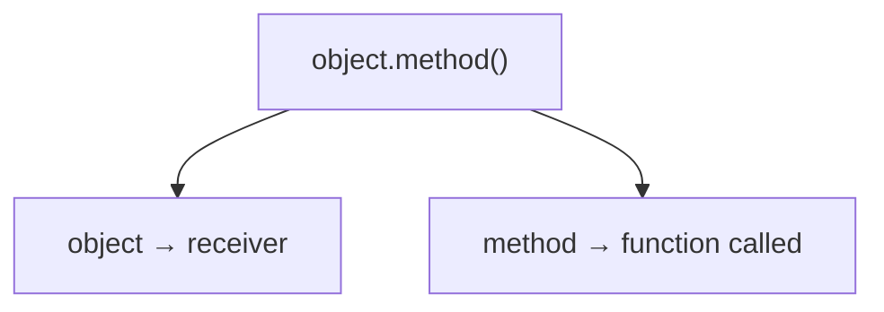

This reconnects to the earlier chapter on `this`:

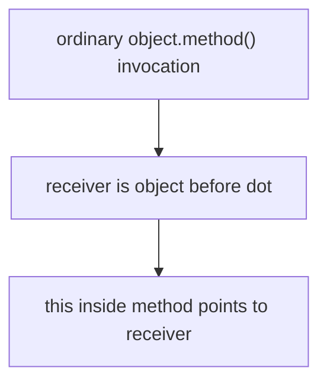

Это рабочая модель обычных вызовов методов в этой главе. Другие формы вызова уже разбирались в `call()`, `apply()` и `bind()`, а более глубокая механика вернётся в главах про Prototype.

### Methods и обычные функции

Обычная функция:

```javascript
function describeUser(user) {
  return user.name;
}
```

Method:

```javascript
const user = {
  name: 'Anna',
  describe() {
    return this.name;
  }
};
```

Difference is not that method is a magical new kind of function.

Важно:

```text
Methods — это обычные функции.
They become methods because they are accessed and called through an object.
```

### Relationship with `this`

Внутри method `this` позволяет поведению читать состояние текущего объекта выполнения:

```javascript
const account = {
  owner: 'Anna',
  balance: 100,
  getLabel() {
    return this.owner + ': ' + this.balance;
  }
};
```

Вызов метода:

```javascript
account.getLabel();
```

Напоминание про объект выполнения:

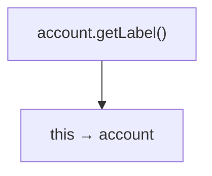

### Arrow functions as methods

Arrow functions имеют особое поведение `this`. Курс уже отдельно вводил arrow functions и `this`, но эта глава не разбирает методы-стрелки глубоко.

Пока достаточно правила:

```text
Используйте обычный синтаксис метода для object methods.
```

Detailed edge cases come later.

---

## Внутренний механизм

Рассмотрим:

```javascript
const apiClient = {
  baseUrl: 'https://api.example.test',
  buildUrl(path) {
    return this.baseUrl + path;
  }
};

apiClient.buildUrl('/users');
```

Концептуальный поток:

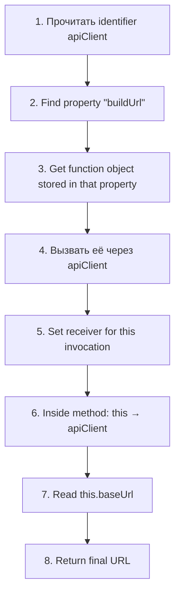

### Method lifecycle

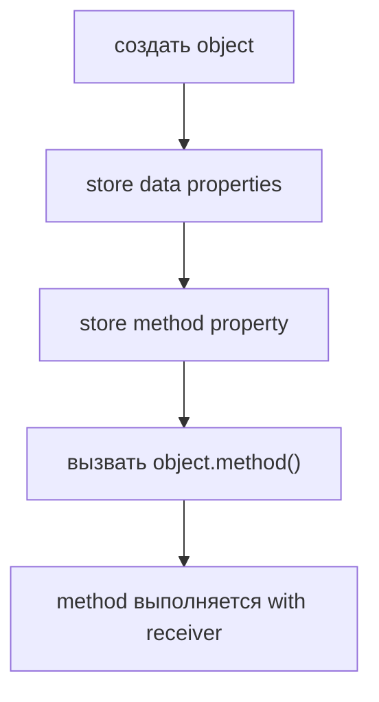

### Method execution

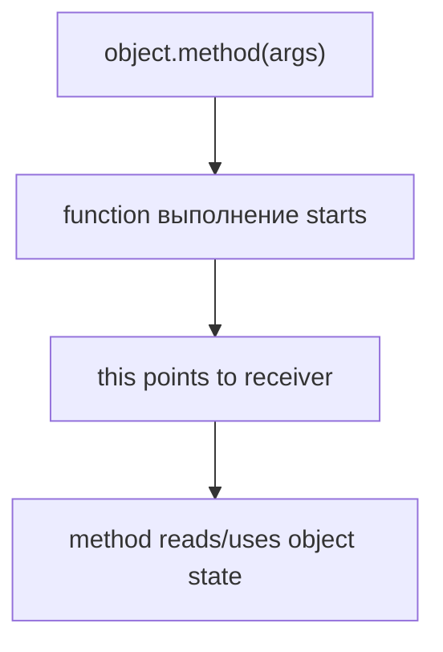

### Function vs method internally

The function object itself remains a function object.

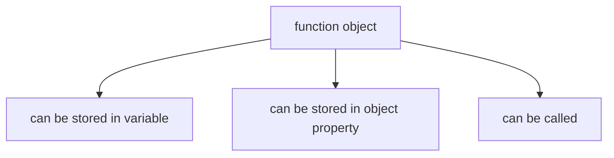

На практике она становится method, когда используется как поведение объекта:

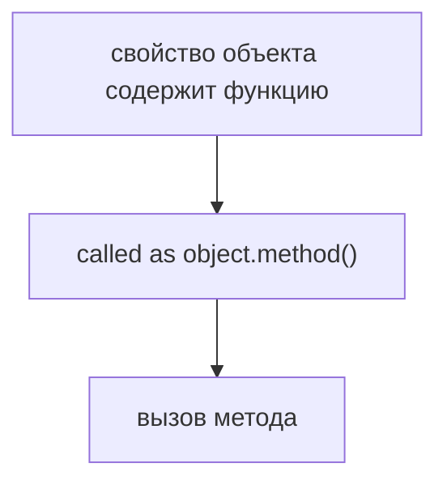

### State change preview

Некоторые методы только читают состояние:

```javascript
describe() {
  return this.name;
}
```

Некоторые методы изменяют состояние:

```javascript
rename(newName) {
  this.name = newName;
}
```

Эта глава только предварительно показывает методы, изменяющие состояние. Object descriptors, паттерны неизменяемости и более глубокое поведение свойств будут изучаться позже.

---

## Ментальная модель

Employee profile:

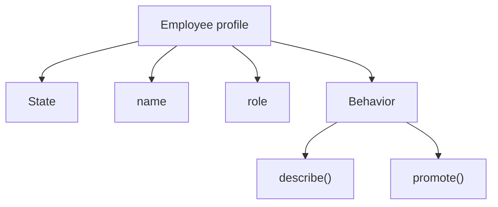

Control panel:

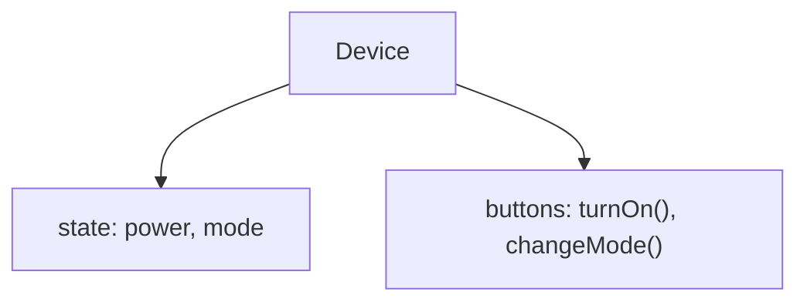

Game character:

```mermaid
flowchart TD
    N1["Character"]
    N2["health"]
    N3["level"]
    N4["move()"]
    N5["takeDamage()"]
    N1 --> N2
    N1 --> N3
    N1 --> N4
    N1 --> N5
```

Bank account:

```mermaid
flowchart TD
    N1["Account"]
    N2["owner"]
    N3["balance"]
    N4["deposit()"]
    N5["getBalance()"]
    N1 --> N2
    N1 --> N3
    N1 --> N4
    N1 --> N5
```

Главная модель:

```mermaid
flowchart TD
    N1["Object"]
    N2["State"]
    N3["Behavior"]
    N1 --> N2
    N1 --> N3
```

---

## Примеры кода

Примеры находятся в:

```text
examples/01-javascript/chapter-37/
```

Запуск:

```bash
node examples/01-javascript/chapter-37/01-basic-method.js
node examples/01-javascript/chapter-37/02-method-call.js
node examples/01-javascript/chapter-37/03-this-preview.js
node examples/01-javascript/chapter-37/04-common-mistakes.js
node examples/01-javascript/chapter-37/05-api-client.js
node examples/01-javascript/chapter-37/06-qa-example.js
```

### Пример 1. Basic method

```javascript
const user = {
  name: 'Anna',
  role: 'admin',
  describe() {
    return this.name + ' is ' + this.role;
  }
};

console.log(user.describe());
```

### Пример 2. Method call

```javascript
const account = {
  owner: 'Anna',
  balance: 100,
  getBalance() {
    return this.balance;
  }
};

console.log(account.getBalance());
```

### Пример 3. this preview

```javascript
const stagingClient = {
  baseUrl: 'https://staging.example.test',
  buildUrl(path) {
    return this.baseUrl + path;
  }
};

console.log(stagingClient.buildUrl('/users'));
```

### Пример 4. Типичные ошибки

```javascript
const user = {
  name: 'Anna',
  describe() {
    return this.name;
  }
};

const describe = user.describe;

console.log(user.describe());
console.log(typeof describe);
```

Detached function is not called here to avoid intentional runtime error. The example shows that method value can be detached as function object.

### Пример 5. API client

```javascript
const apiClient = {
  baseUrl: 'https://api.example.test',
  buildUrl(path) {
    return this.baseUrl + path;
  },
  describeRequest(method, path) {
    return method + ' ' + this.buildUrl(path);
  }
};

console.log(apiClient.describeRequest('GET', '/users'));
```

### Пример 6. QA example

```javascript
const assertionHelper = {
  suite: 'smoke',
  formatStatus(testName, actualStatus, expectedStatus) {
    const passed = actualStatus === expectedStatus;

    return this.suite + ': ' + testName + ' -> ' + passed;
  }
};

console.log(assertionHelper.formatStatus('login', 200, 200));
console.log(assertionHelper.formatStatus('checkout', 500, 200));
```

---

## Частые вопросы

### Method - это отдельный тип function?

Нет.

```mermaid
flowchart TD
    N1["method"]
    N2["обычная функция, используемая как поведение объекта"]
    N1 --> N2
```

### Почему не говорить просто "function inside object"?

Потому что такая фраза описывает форму, но не объясняет принадлежность поведения.

Более точный вопрос:

```text
Почему это поведение относится к этому объекту?
```

### Method всегда использует `this`?

Нет. Method может не использовать `this`, но многие полезные методы читают или изменяют состояние объекта через `this`.

### Можно ли использовать arrow function as method?

Синтаксически можно хранить arrow function в свойстве, но у arrow functions другое поведение `this`. В этой главе рекомендуется обычный синтаксис метода. Детали будут позже.

### Method может менять object?

Да, если method присваивает значения свойствам объекта через `this` или другую ссылку. Эта глава показывает идею, но не уходит глубоко в descriptors или неизменяемость.

---

## Распространенные мифы

### Миф: methods are special magic functions

Реальность:

Methods — это обычные функции, используемые через объекты.

### Миф: method относится к объекту только потому, что записан внутри фигурных скобок

Реальность:

Важная проектная идея — принадлежность поведения. Синтаксис должен выражать эту принадлежность.

### Миф: every object should have methods

Реальность:

Некоторые объекты должны оставаться чистыми данными: payload, expected data, простые config-объекты. Methods полезны, когда поведение естественно относится к сущности.

### Миф: `this` is always obvious

Реальность:

Для обычных вызовов `object.method()` модель объекта выполнения понятна. Другие формы вызова уже разбирались в `call()`, `apply()` и `bind()`.

---

## Типичные ошибки

### Ошибка 1. Отделять поведение, которое относится к объекту

```javascript
function buildUrl(client, path) {
  return client.baseUrl + path;
}
```

Если поведение относится к API client, method может быть понятнее:

```javascript
const apiClient = {
  baseUrl: 'https://api.example.test',
  buildUrl(path) {
    return this.baseUrl + path;
  }
};
```

### Ошибка 2. Использовать method where pure function is clearer

Not every function should become method.

Если поведению не нужно состояние объекта, обычная функция может быть проще.

### Ошибка 3. Detached method loses объект выполнения

```javascript
const buildUrl = apiClient.buildUrl;
```

Теперь function object отделён. Если вызвать `buildUrl('/users')`, обычный объект выполнения будет потерян. Это разбиралось в главах `this`, `call()` и `bind()`.

### Ошибка 4. Использовать arrow function for method without understanding `this`

Use regular method syntax until arrow `this` поведение is fully clear.

---

## Практическое использование

### Entity поведение

```javascript
const user = {
  name: 'Anna',
  rename(newName) {
    this.name = newName;
  }
};
```

### API client

```javascript
const apiClient = {
  baseUrl: 'https://api.example.test',
  buildUrl(path) {
    return this.baseUrl + path;
  }
};
```

### Assertion helper

```javascript
const assertions = {
  suite: 'smoke',
  statusLine(testName, passed) {
    return this.suite + ': ' + testName + ' -> ' + passed;
  }
};
```

### Configuration helper

```javascript
const config = {
  baseUrl: 'https://api.example.test',
  timeout: 5000,
  describe() {
    return this.baseUrl + ' timeout=' + this.timeout;
  }
};
```

---

## Использование в Automation QA

### API client objects

API client естественно владеет поведением для построения URL и описания запроса:

```mermaid
flowchart TD
    N1["apiClient"]
    N2["state: baseUrl"]
    N3["behavior: buildUrl()"]
    N1 --> N2
    N1 --> N3
```

### Page Object preview

Page Object will be studied deeply later.

High-level preview:

```mermaid
flowchart TD
    N1["LoginPage"]
    N2["state: locators"]
    N3["behavior: login()"]
    N1 --> N2
    N1 --> N3
```

### Assertion helpers

Assertion helper object can own suite name or reporting prefix:

```mermaid
flowchart TD
    N1["assertions"]
    N2["state: suite"]
    N3["behavior: format result"]
    N1 --> N2
    N1 --> N3
```

### Request builders

Request builder object может владеть базовым payload и поведением для построения запросов.

### Configuration helpers

Configuration object can expose methods that describe or normalize configuration. Advanced patterns will appear in framework architecture chapters.

---

## Диаграммы главы

### 1. Why methods exist

```mermaid
flowchart TD
    N1["данные относятся к одной сущности"]
    N2["behavior uses that data"]
    N3["method относится к object"]
    N1 --> N2
    N2 --> N3
```

### 2. Data only

```mermaid
flowchart TD
    N1["user"]
    N2["name"]
    N3["email"]
    N4["role"]
    N1 --> N2
    N1 --> N3
    N1 --> N4
```

### 3. Data + поведение

```mermaid
flowchart TD
    N1["user"]
    N2["state"]
    N3["methods"]
    N1 --> N2
    N1 --> N3
```

### 4. Method call

```mermaid
flowchart TD
    N1["object.method()"]
    N2["выполнить behavior"]
    N1 --> N2
```

### 5. Состояние и поведение

```mermaid
flowchart TD
    N1["Object"]
    N2["State"]
    N3["Behavior"]
    N1 --> N2
    N1 --> N3
```

### 6. Object model

```mermaid
flowchart TD
    N1["entity"]
    N2["properties with data"]
    N3["properties with functions"]
    N1 --> N2
    N1 --> N3
```

### 7. Текущая модель JavaScript

```mermaid
flowchart TD
    N1["Objects"]
    N2["properties"]
    N3["safe access"]
    N4["fallback values"]
    N5["methods"]
    N1 --> N2
    N1 --> N3
    N1 --> N4
    N1 --> N5
```

### 8. Method execution

```mermaid
flowchart TD
    N1["вызвать method"]
    N2["создать function выполнение"]
    N3["use receiver as this"]
    N1 --> N2
    N2 --> N3
```

### 9. Receiver reminder

```mermaid
flowchart TD
    N1["apiClient.buildUrl()"]
    N2["receiver → apiClient"]
    N1 --> N2
```

### 10. this inside method

```mermaid
flowchart TD
    N1["this"]
    N2["current receiver"]
    N1 --> N2
```

### 11. Function vs method

```mermaid
flowchart TD
    N1["function object"]
    N2["вызвана отдельно → обычный вызов функции"]
    N3["called through object → method call"]
    N1 --> N2
    N1 --> N3
```

### 12. QA API client

```mermaid
flowchart TD
    N1["apiClient"]
    N2["baseUrl"]
    N3["buildUrl()"]
    N1 --> N2
    N1 --> N3
```

### 13. Assertion helper object

```mermaid
flowchart TD
    N1["assertions"]
    N2["suite"]
    N3["formatStatus()"]
    N1 --> N2
    N1 --> N3
```

### 14. Configuration object

```mermaid
flowchart TD
    N1["config"]
    N2["baseUrl"]
    N3["timeout"]
    N4["describe()"]
    N1 --> N2
    N1 --> N3
    N1 --> N4
```

### 15. Читаемость

```mermaid
flowchart TD
    N1["behavior near data"]
    N2["reader sees responsibility"]
    N1 --> N2
```

### 16. Типичные ошибки

```mermaid
flowchart TD
    N1["detach method"]
    N2["receiver lost"]
    N1 --> N2
```

### 17. Method lifecycle

```mermaid
flowchart TD
    N1["define object"]
    N2["store method"]
    N3["вызвать method"]
    N4["method возвращает result"]
    N1 --> N2
    N2 --> N3
    N3 --> N4
```

### 18. Object responsibility

```mermaid
flowchart TD
    N1["object owns data"]
    N2["object owns related behavior"]
    N1 --> N2
```

### 19. Принадлежность поведения

```mermaid
flowchart TD
    N1["behavior uses object state"]
    N2["поведение относится к object"]
    N1 --> N2
```

### 20. Complete object model

```mermaid
flowchart TD
    N1["Object"]
    N2["State"]
    N3["data properties"]
    N4["Behavior"]
    N5["methods"]
    N1 --> N2
    N1 --> N3
    N1 --> N4
    N4 --> N5
```

### 21. Method invocation

```mermaid
flowchart TD
    N1["object.method(args)"]
    N2["receiver"]
    N3["arguments"]
    N1 --> N2
    N1 --> N3
```

### 22. State change preview

```mermaid
flowchart TD
    N1["method"]
    N2["updates property"]
    N3["state changes"]
    N1 --> N2
    N2 --> N3
```

### 23. Переход к descriptors

```mermaid
flowchart TD
    N1["properties can behave differently"]
    N2["Object Descriptors"]
    N1 --> N2
```

### 24. Переход к prototypes

```mermaid
flowchart TD
    N1["methods can be shared"]
    N2["Prototype later"]
    N1 --> N2
```

### 25. Краткая ментальная модель

```text
employee profile
control panel
device buttons
```

### 26. Entity поведение

```mermaid
flowchart TD
    N1["entity"]
    N2["what it knows"]
    N3["what it can do"]
    N1 --> N2
    N1 --> N3
```

### 27. Device buttons

```mermaid
flowchart TD
    N1["device state"]
    N2["buttons operate on state"]
    N1 --> N2
```

### 28. Game character

```mermaid
flowchart TD
    N1["character"]
    N2["health"]
    N3["takeDamage()"]
    N1 --> N2
    N1 --> N3
```

### 29. Bank account

```mermaid
flowchart TD
    N1["account"]
    N2["balance"]
    N3["deposit()"]
    N1 --> N2
    N1 --> N3
```

### 30. QA Page Object preview

```mermaid
flowchart TD
    N1["Page Object"]
    N2["locators"]
    N3["actions"]
    N1 --> N2
    N1 --> N3
```

### 31. Object evolution

```mermaid
flowchart TD
    N1["data object"]
    N2["object with behavior"]
    N3["future: prototypes/classes"]
    N1 --> N2
    N2 --> N3
```

### 32. Итоговая схема

```mermaid
flowchart TD
    N1["Object"]
    N2["State"]
    N3["Behavior"]
    N1 --> N2
    N1 --> N3
```

---

## Практика

Практика находится в:

```text
practice/01-javascript/37-object-methods.md
```

Рекомендуемый порядок:

```text
1. Ответить на концептуальные вопросы.
2. Определить methods.
3. Предсказать output.
4. Запустить examples/01-javascript/chapter-37/.
5. Выполнить debugging tasks.
6. Сделать QA mini-project.
7. Свериться с solutions/01-javascript/37-object-methods.md.
```

---

## Решения

Решения находятся в:

```text
solutions/01-javascript/37-object-methods.md
```

Не открывайте решения до самостоятельной попытки. Главный вопрос практики:

```text
Почему это поведение должно относиться к объекту?
```

---

## Итоги

Object Methods продолжают Objects section:

```mermaid
flowchart TD
    N1["Objects"]
    N2["Destructuring"]
    N3["Optional Chaining"]
    N4["Nullish Coalescing"]
    N5["Object Methods"]
    N1 --> N2
    N2 --> N3
    N3 --> N4
    N4 --> N5
```

Главная модель:

```mermaid
flowchart TD
    N1["Object"]
    N2["State"]
    N3["Behavior"]
    N1 --> N2
    N1 --> N3
```

Method — это обычная функция, используемая как поведение объекта. Она вызывается как `object.method()`, и при обычном вызове метода `this` указывает на объект выполнения.

---

## Что нужно запомнить

* Object может хранить состояние и поведение.
* Method представляет поведение, относящееся к одной сущности.
* Method — это обычная функция, используемая через объект.
* Do not define method only as "function inside object".
* Ordinary `object.method()` invocation sets объект выполнения from object before dot.
* `this` inside regular method usually reads or updates объект выполнения состояние.
* Detached method can lose объект выполнения.
* Use regular method syntax unless arrow `this` поведение is intentionally needed.
* В Automation QA methods встречаются в API clients, assertion helpers, request builders и Page Objects.
* Object Descriptors are next: they explain why properties can behave differently.

---

## Проверьте себя

Ответьте без запуска кода.

1. Зачем существуют object methods?
2. Что такое состояние объекта?
3. Что такое object поведение?
4. Почему method не стоит определять только как "function inside object"?
5. Чем method отличается от обычной функции на уровне вызова?
6. Как `this` связан с обычным вызовом метода?
7. Почему detached method может быть проблемой?
8. Когда поведение должно относиться к объекту?
9. Где object methods используются в Automation QA?
10. Какая следующая тема логически продолжает Object Methods?
