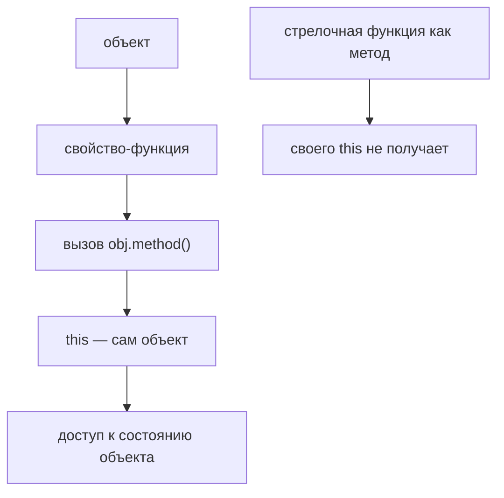

# Методы объекта

## Связь с предыдущей главой

Предыдущие главы раздела Objects показали, что object может хранить related data:

Затем мы научились:

Теперь появляется следующий вопрос:

> Может ли object хранить поведение, связанное с его data?

Например, есть user:

```javascript
const user = {
  name: 'Anna',
  email: 'anna@example.test',
  role: 'admin'
};
```

Данные уже относятся к одной сущности.

Но поведение тоже может относиться к той же сущности:

Главная модель главы:

---

## Предварительные требования

Для этой главы нужно понимать:

* что object stores related data;
* что property имеет key и value;
* что property value can be any JavaScript value;
* что function object можно хранить в variable;
* что `this` определяется при invocation;
* что обычный вызов `object.method()` выбирает объект выполнения из формы вызова;
* что `call()`, `apply()` и `bind()` связаны с выбором объекта выполнения.

Не требуется знать descriptors, prototypes, classes, inheritance, `Object.create()`, method borrowing, `super` или arrow functions as methods in depth. Эти темы будут изучаться позже.

---

## Время изучения

Ориентировочное время:

```text
Чтение главы:            130-160 минут
Разбор схем:             55-75 минут
Запуск примеров:         20-30 минут
Практика:                110-140 минут
Повторение материала:    30 минут
```

Уровень сложности: **L3-L4**.

Object methods кажутся простыми, но они связывают несколько важных идей: объекты, функции, свойства, объект выполнения и `this`.

---

## Навигация

Предыдущая глава:

```text
docs/01-javascript/36-nullish-coalescing.md
```

Текущая глава:

```text
docs/01-javascript/37-object-methods.md
```

Следующая глава:

```text
docs/01-javascript/38-object-descriptors.md
```

Следующая глава ответит:

> Почему некоторые object properties behave differently from others?

---

## Цели обучения

После изучения этой главы вы будете понимать:

* зачем существуют object methods;
* почему поведение может относиться к объекту;
* как method связан с состоянием объекта;
* как выглядит method syntax;
* чем вызов метода отличается от вызова обычной функции;
* как вызов метода связан с `this`;
* почему method остается обычной функцией;
* почему не стоит определять method только как "function inside object";
* какие ошибки встречаются чаще всего;
* как object methods используются в Automation QA.

---

## Мотивация

Начнем с проблемы.

Есть user data:

```javascript
const user = {
  name: 'Anna',
  email: 'anna@example.test',
  role: 'admin'
};
```

И есть поведение:

```javascript
function describeUser(user) {
  return user.name + ' <' + user.email + '> [' + user.role + ']';
}

function renameUser(user, newName) {
  user.name = newName;
}
```

Такой код работает.

Но поведение живет отдельно от entity:

Вопрос:

> Почему поведение, которое работает только с user, живет отдельно от user?

Object method позволяет показать принадлежность:

```javascript
const user = {
  name: 'Anna',
  email: 'anna@example.test',
  role: 'admin',
  describe() {
    return this.name + ' <' + this.email + '> [' + this.role + ']';
  }
};
```

Теперь поведение относится к той же сущности:

```text
было:  объект с данными + отдельная функция, которой их передают
стало: объект, который сам умеет отвечать на вопрос о своих данных
```

Главный вопрос главы:

> Почему это поведение относится к этому объекту?

---

## Теория

Метод объекта — это поведение, связанное с объектом.

Но важно не начинать и не заканчивать определением «функция внутри объекта». Это слишком механическое описание.

Лучше:

```text
метод — это ответ объекта на вопрос о самом себе
```

### Зачем нужны методы

Объекты начинались как способ сгруппировать данные:

```text
account  →  owner, balance
```

Но у сущностей часто есть действия:

```text
account  →  показать подпись, пополнить, списать
```

Методы позволяют объекту держать поведение рядом с данными, которые оно использует.

### Состояние и поведение

Состояние — это данные, сохранённые в объекте:

```javascript
const user = {
  name: 'Anna',
  role: 'admin'
};
```

Поведение — это то, что объект умеет делать:

```javascript
const user = {
  name: 'Anna',
  role: 'admin',
  isAdmin() {
    return this.role === 'admin';
  }
};
```

Модель:

```text
объект  →  свойства-данные и свойства-функции (методы)
```

### Синтаксис метода

Современная запись метода:

```javascript
const user = {
  describe() {
    return this.name;
  }
};
```

Более старая равнозначная запись:

```javascript
const user = {
  describe: function () {
    return this.name;
  }
};
```

Обе кладут объект функции в свойство объекта.

В этой главе мы используем запись метода, потому что она яснее выражает намерение.

### Вызов методов

```javascript
user.describe();
```

Это вызов метода: функция взята из свойства объекта и вызвана так, что объект
стоит слева от точки.

Здесь мы возвращаемся к главе про `this`: именно эта форма записи и делает `user`
объектом выполнения, поэтому `this.name` внутри метода читает поле того же
объекта.

Это рабочая модель обычных вызовов методов в этой главе. Другие формы вызова уже разбирались в главах про `call()`, `apply()` и `bind()`, а более глубокая механика вернётся в главах про прототипы.

### Методы и обычные функции

Обычная функция:

```javascript
function describeUser(user) {
  return user.name;
}
```

Метод:

```javascript
const user = {
  name: 'Anna',
  describe() {
    return this.name;
  }
};
```

Разница не в том, что метод — какой-то новый магический вид функции.

Важно:

```text
Methods — это обычные функции.
They become methods because they are accessed and called through an object.
```

### Связь с `this`

Внутри метода `this` позволяет поведению читать состояние текущего объекта выполнения:

```javascript
const account = {
  owner: 'Anna',
  balance: 100,
  getLabel() {
    return this.owner + ': ' + this.balance;
  }
};
```

Вызов метода:

```javascript
account.getLabel();
```

Напоминание про объект выполнения:

```text
account.getLabel()  →  this внутри метода равен account
```

`this` здесь определяется формой вызова: слева от точки стоит `account`.

### Стрелочные функции как методы

У стрелочных функций особое поведение `this`. Курс уже отдельно вводил стрелочные функции и `this`, но эта глава не разбирает методы-стрелки глубоко.

Пока достаточно правила:

```text
Используйте обычный синтаксис метода для object methods.
```

Подробные особые случаи будут позже.

---

Метод связывает поведение с состоянием объекта:


```mermaid
flowchart TD
    A["объект"] --> B["свойство-функция"]
    B --> C["вызов obj.method()"]
    C --> D["this — сам объект"]
    D --> E["доступ к состоянию объекта"]
    F["стрелочная функция как метод"] --> G["своего this не получает"]
```

## Внутренний механизм

Рассмотрим:

```javascript
const apiClient = {
  baseUrl: 'https://api.example.test',
  buildUrl(path) {
    return this.baseUrl + path;
  }
};

apiClient.buildUrl('/users');
```

Концептуальный поток:

```text
1. по имени apiClient найти объект
2. прочитать свойство buildUrl — там лежит объект функции
3. вызвать её, задав this равным apiClient
4. внутри тела this.baseUrl читается из того же объекта
```

### Жизненный цикл метода

```text
литерал объекта   →  создан объект функции и записан в свойство
обращение по имени →  функция найдена, но не выполнена
скобки вызова      →  создан Execution Context, this задан
```

### Выполнение метода

```text
apiClient.buildUrl('/users')

this      ←  apiClient
path      ←  '/users'
результат →  'https://api.example.test/users'
```

Если ту же функцию вызвать без объекта слева, `this` перестанет указывать на
`apiClient`, и `this.baseUrl` окажется недоступен.

### Функция и метод изнутри

Сам объект функции остаётся объектом функции.

На практике она становится методом, когда используется как поведение объекта:

```text
функция, лежащая в переменной  →  просто функция
та же функция в свойстве объекта, вызванная через точку  →  метод
```

Разницу создаёт не объявление, а форма вызова: именно она задаёт `this`.

### Изменение состояния: предварительный взгляд

Некоторые методы только читают состояние:

```javascript
describe() {
  return this.name;
}
```

Некоторые методы изменяют состояние:

```javascript
rename(newName) {
  this.name = newName;
}
```

Эта глава только показывает методы, изменяющие состояние. Дескрипторы свойств, приёмы неизменяемости и более глубокое поведение свойств будут изучаться позже.

---

## Ментальная модель

Объект с методами удобно представлять как устройство с кнопками: свойства —
это состояние, методы — действия, которые его читают и меняют. Профиль
сотрудника, пульт, игровой персонаж и банковский счёт устроены одинаково —
данные и операции над ними лежат вместе.

Главная модель: метод — это обычная функция, лежащая в свойстве объекта.
Особенным её делает только форма вызова, которая задаёт объект выполнения.

---

## Примеры кода

Примеры находятся в:

```text
examples/01-javascript/chapter-37/
```

Запуск:

```bash
node examples/01-javascript/chapter-37/01-basic-method.js
node examples/01-javascript/chapter-37/02-method-call.js
node examples/01-javascript/chapter-37/03-this-preview.js
node examples/01-javascript/chapter-37/04-common-mistakes.js
node examples/01-javascript/chapter-37/05-api-client.js
node examples/01-javascript/chapter-37/06-qa-example.js
```

### Пример 1. Базовый метод

```javascript
const user = {
  name: 'Anna',
  role: 'admin',
  describe() {
    return this.name + ' is ' + this.role;
  }
};

console.log(user.describe());
```

### Пример 2. Вызов метода

```javascript
const account = {
  owner: 'Anna',
  balance: 100,
  getBalance() {
    return this.balance;
  }
};

console.log(account.getBalance());
```

### Пример 3. Предварительный взгляд на `this`

```javascript
const stagingClient = {
  baseUrl: 'https://staging.example.test',
  buildUrl(path) {
    return this.baseUrl + path;
  }
};

console.log(stagingClient.buildUrl('/users'));
```

### Пример 4. Типичные ошибки

```javascript
const user = {
  name: 'Anna',
  describe() {
    return this.name;
  }
};

const describe = user.describe;

console.log(user.describe());
console.log(typeof describe);
```

Оторванная функция здесь не вызывается, чтобы не получить намеренную ошибку. Пример показывает, что значение метода можно отделить как объект функции.

### Пример 5. Клиент API

```javascript
const apiClient = {
  baseUrl: 'https://api.example.test',
  buildUrl(path) {
    return this.baseUrl + path;
  },
  describeRequest(method, path) {
    return method + ' ' + this.buildUrl(path);
  }
};

console.log(apiClient.describeRequest('GET', '/users'));
```

### Пример 6. Пример из автоматизации тестов

```javascript
const assertionHelper = {
  suite: 'smoke',
  formatStatus(testName, actualStatus, expectedStatus) {
    const passed = actualStatus === expectedStatus;

    return this.suite + ': ' + testName + ' -> ' + passed;
  }
};

console.log(assertionHelper.formatStatus('login', 200, 200));
console.log(assertionHelper.formatStatus('checkout', 500, 200));
```

---

## Частые вопросы

### Метод — это отдельный тип функции?

Нет.

### Почему не говорить просто «функция внутри объекта»?

Потому что такая фраза описывает форму, но не объясняет принадлежность поведения.

Более точный вопрос:

```text
Почему это поведение относится к этому объекту?
```

### Метод всегда использует `this`?

Нет. Метод может не использовать `this`, но многие полезные методы читают или изменяют состояние объекта через него.

### Можно ли использовать стрелочную функцию как метод?

Синтаксически хранить стрелочную функцию в свойстве можно, но у неё другое поведение `this`. В этой главе рекомендуется обычная запись метода. Детали будут позже.

### Может ли метод менять объект?

Да, если он присваивает значения свойствам через `this` или другую ссылку. Эта глава показывает идею, но не уходит глубоко в дескрипторы и неизменяемость.

---

## Распространённые мифы

### Миф: методы — особые магические функции

Реальность:

Методы — обычные функции, используемые через объекты.

### Миф: метод относится к объекту только потому, что записан внутри фигурных скобок

Реальность:

Важная проектная идея — принадлежность поведения. Синтаксис должен выражать эту принадлежность.

### Миф: у каждого объекта должны быть методы

Реальность:

Некоторые объекты должны оставаться чистыми данными: тело запроса, ожидаемые данные, простые объекты настройки. Методы полезны, когда поведение естественно относится к сущности.

### Миф: `this` всегда очевиден

Реальность:

Для обычных вызовов `object.method()` модель объекта выполнения понятна. Другие формы вызова уже разбирались в `call()`, `apply()` и `bind()`.

---

## Распространённые ошибки

### Ошибка 1. Отделять поведение, которое относится к объекту

```javascript
function buildUrl(client, path) {
  return client.baseUrl + path;
}
```

Если поведение относится к клиенту API, метод может быть понятнее:

```javascript
const apiClient = {
  baseUrl: 'https://api.example.test',
  buildUrl(path) {
    return this.baseUrl + path;
  }
};
```

### Ошибка 2. Использовать метод там, где понятнее обычная функция

Не каждая функция должна становиться методом.

Если поведению не нужно состояние объекта, обычная функция может быть проще.

### Ошибка 3. Оторванный метод теряет объект выполнения

```javascript
const buildUrl = apiClient.buildUrl;
```

Теперь объект функции отделён. Если вызвать `buildUrl('/users')`, обычный объект выполнения будет потерян. Это разбиралось в главах про `this`, `call()` и `bind()`.

### Ошибка 4. Использовать стрелочную функцию как метод, не понимая `this`

Используйте обычную запись метода, пока поведение `this` у стрелки не станет полностью понятным.

---

## Практическое использование

### Поведение сущности

```javascript
const user = {
  name: 'Anna',
  rename(newName) {
    this.name = newName;
  }
};
```

### Клиент API

```javascript
const apiClient = {
  baseUrl: 'https://api.example.test',
  buildUrl(path) {
    return this.baseUrl + path;
  }
};
```

### Вспомогательная проверка

```javascript
const assertions = {
  suite: 'smoke',
  statusLine(testName, passed) {
    return this.suite + ': ' + testName + ' -> ' + passed;
  }
};
```

### Вспомогательная функция конфигурации

```javascript
const config = {
  baseUrl: 'https://api.example.test',
  timeout: 5000,
  describe() {
    return this.baseUrl + ' timeout=' + this.timeout;
  }
};
```

---

## Использование в Automation QA

### Объекты клиента API

Клиент API естественно владеет поведением для построения адреса и описания запроса:

```javascript
const apiClient = {
  baseUrl: 'https://staging.example.test',
  buildUrl(path) {
    return this.baseUrl + path;
  }
};
```

Адрес окружения задан в одном месте, и его не приходится передавать в каждый
вызов.

### Объект страницы: предварительный взгляд

Объекты страниц будут подробно изучаться позже.

Предварительный обзор:

```text
Page Object  —  объект, который хранит адрес страницы и её элементы
методы       —  действия, доступные на этой странице
```

### Вспомогательные проверки

Вспомогательный объект проверок может владеть именем набора или префиксом отчёта:

```javascript
const reporter = {
  suite: 'smoke',
  describe(message) {
    return '[' + this.suite + '] ' + message;
  }
};
```

### Построители запросов

Объект-сборщик запроса может владеть базовым телом и поведением для построения запросов.

### Вспомогательные функции конфигурации

Объект настройки может предоставлять методы, которые описывают или нормализуют настройку. Более сложные приёмы появятся в главах об архитектуре фреймворка.

---

## Практика

Практика находится в:

```text
practice/01-javascript/37-object-methods.md
```

Рекомендуемый порядок:

```text
1. Ответить на концептуальные вопросы.
2. Определить methods.
3. Предсказать output.
4. Запустить examples/01-javascript/chapter-37/.
5. Выполнить debugging tasks.
6. Сделать QA mini-project.
7. Свериться с solutions/01-javascript/37-object-methods.md.
```

---

## Решения

Решения находятся в:

```text
solutions/01-javascript/37-object-methods.md
```

Не открывайте решения до самостоятельной попытки. Главный вопрос практики:

```text
Почему это поведение должно относиться к объекту?
```

---

## Итоги

Методы объектов продолжают раздел про объекты:

Главная модель: метод — это свойство объекта, значением которого является функция, и вызывается он через сам объект.

Метод — обычная функция, используемая как поведение объекта. Она вызывается как `object.method()`, и при обычном вызове `this` указывает на объект выполнения.

---

## Что нужно запомнить

* Объект может хранить состояние и поведение.
* Метод представляет поведение, относящееся к одной сущности.
* Метод — обычная функция, используемая через объект.
* Не определяйте метод только как «функцию внутри объекта».
* Обычный вызов `object.method()` задаёт объектом выполнения то, что стоит слева от точки.
* `this` внутри обычного метода обычно читает или изменяет состояние объекта выполнения.
* Оторванный метод может потерять объект выполнения.
* Используйте обычную запись метода, если поведение `this` у стрелки не нужно намеренно.
* В автоматизации тестов методы встречаются в клиентах API, вспомогательных проверках, сборщиках запросов и объектах страниц.
* Дескрипторы свойств — следующая тема: они объясняют, почему свойства могут вести себя по-разному.

---

## Проверьте себя

Ответьте без запуска кода.

1. Зачем существуют методы объектов?
2. Что такое состояние объекта?
3. Что такое поведение объекта?
4. Почему метод не стоит определять только как «функцию внутри объекта»?
5. Чем метод отличается от обычной функции на уровне вызова?
6. Как `this` связан с обычным вызовом метода?
7. Почему оторванный метод может быть проблемой?
8. Когда поведение должно относиться к объекту?
9. Где методы объектов используются в автоматизации тестов?
10. Какая следующая тема логически продолжает методы объектов?

### Ответы

1. Чтобы поведение жило рядом с данными, которые оно использует, и его не приходилось передавать в отдельную функцию вместе со всем состоянием.
2. Данные, принадлежащие объекту: его свойства.
3. Действия, которые объект умеет выполнять над своим состоянием.
4. Это описывает расположение, а не смысл. Метод — это ответ объекта на вопрос о самом себе; он работает с состоянием того объекта, через который вызван.
5. Метод вызывают через объект: `account.getLabel()`. Именно форма вызова задаёт `this`, а не место объявления функции.
6. При вызове через точку `this` становится объектом слева от точки.
7. Оторванный от объекта метод вызывается без точки, и `this` перестаёт указывать на нужный объект. Обращение к свойствам внутри начинает давать ошибку или не то значение.
8. Когда действию нужно состояние этого объекта и оно осмысленно только для него. Если функция не пользуется состоянием, ей лучше остаться обычной функцией.
9. В клиентах API, объектах страниц, помощниках проверок, сборщиках запросов — везде, где действие опирается на настройку, хранящуюся рядом.
10. Дескрипторы свойств: какие правила действуют для каждого свойства объекта.

