# Object Descriptors

## Связь с предыдущей главой

Предыдущая глава объяснила Object Methods.

Главная модель была такой:

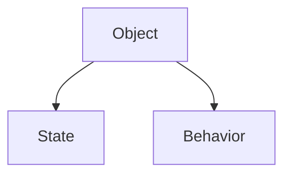

До этого мы работали с properties как будто все они behave the same:

```javascript
const config = {
  baseUrl: 'https://api.example.test',
  timeout: 5000
};

config.timeout = 7000;
delete config.baseUrl;
```

Выглядит так, будто property - это только:

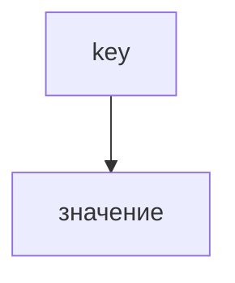

Но в JavaScript property has more than value.

Главный вопрос этой главы:

> Почему две properties с похожими значения могут behave differently?

Например:

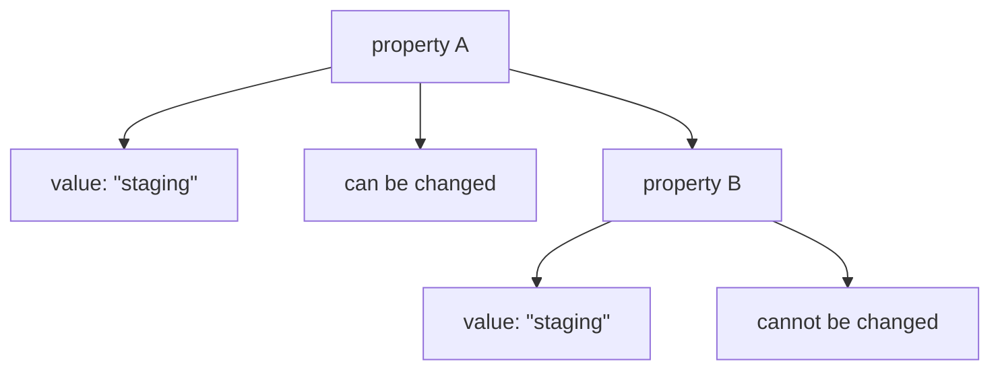

Ответ:

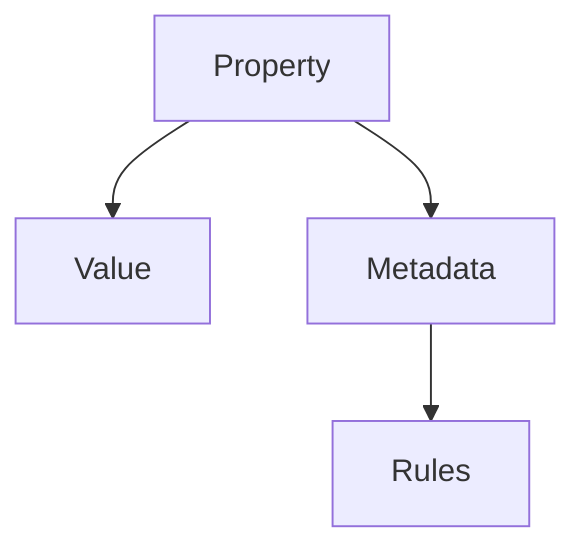

Object Descriptors describe these rules.

---

## Предварительные требования

Для этой главы нужно понимать:

* что object consists of properties;
* что property has key and value;
* что assignment can update property value;
* что `delete` can remove property на базовом уровне;
* что object methods are properties with function objects;
* что `Object` is a built-in object with useful methods;
* что examples can intentionally demonstrate errors.

Не требуется знать accessors, getters, setters, proxies, `Reflect`, sealing/freezing or prototype descriptors. Эти темы будут изучаться позже.

---

## Время изучения

Ориентировочное время:

```text
Чтение главы:            140-170 минут
Разбор схем:             60-80 минут
Запуск примеров:         25-35 минут
Практика:                120-150 минут
Повторение материала:    30 минут
```

Уровень сложности: **L4**.

Object Descriptors важны потому, что они меняют представление о property. Property is not only business data. It also has metadata that controls поведение.

---

## Навигация

Предыдущая глава:

```text
docs/01-javascript/37-object-methods.md
```

Текущая глава:

```text
docs/01-javascript/38-object-descriptors.md
```

Следующая глава:

```text
docs/01-javascript/39-prototype.md
```

Следующая глава ответит:

> Where do methods come from when many objects share the same поведение?

---

## Цели обучения

После изучения этой главы вы будете понимать:

* зачем descriptors существуют;
* почему property is value plus rules;
* что такое property metadata;
* что означает descriptor поле `value`;
* что контролирует `writable`;
* что контролирует `enumerable`;
* что контролирует `configurable`;
* как читать descriptor через `Object.getOwnPropertyDescriptor()`;
* как создавать/изменять property rules через `Object.defineProperty()`;
* как работают readonly and hidden properties на базовом уровне;
* какие ошибки встречаются чаще всего;
* как descriptors встречаются in Automation QA framework infrastructure.

---

## Мотивация

Начнем с проблемы.

Есть два object:

```javascript
const firstConfig = {
  environment: 'staging'
};

const secondConfig = {};

Object.defineProperty(secondConfig, 'environment', {
  value: 'staging',
  writable: false,
  enumerable: true,
  configurable: false
});
```

Обе properties выглядят похожими:

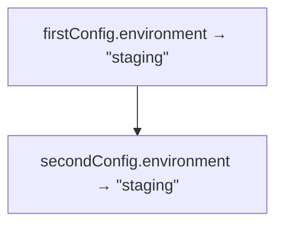

Но поведение differs:

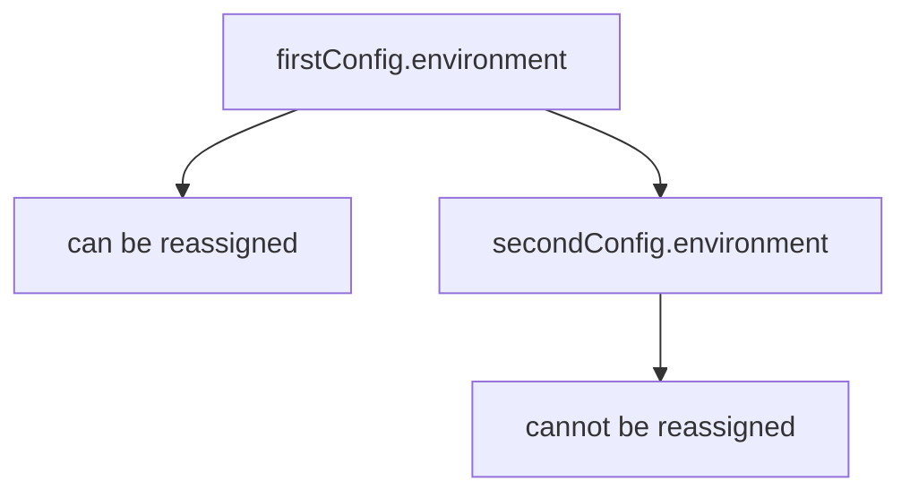

Вопрос:

> Why can two properties with equal значения behave differently?

Потому что у property есть hidden metadata:

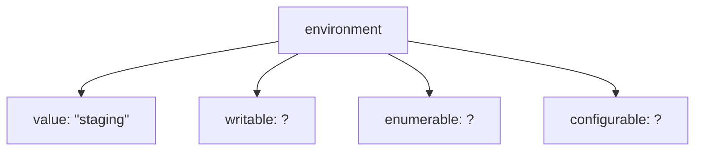

Descriptor is the metadata sheet for a property.

---

## Теория

Object Descriptor describes property поведение.

Не API является главным.

Главная идея:

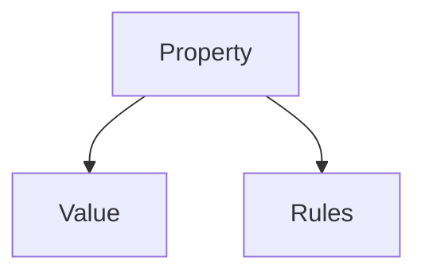

### Why descriptors exist

Если бы property была только value, JavaScript не мог бы ответить на вопросы:

```text
Can this property be changed?
Can this property appear in enumeration?
Can this property definition be changed?
Can deleting this property be allowed as one consequence?
```

Descriptors exist to store these rules.

### Property metadata

Metadata is information about information.

Business data:

```text
environment = "staging"
```

Metadata:

```text
writable: false
enumerable: true
configurable: false
```

Descriptors describe property поведение. They do not store business data beyond the `value` поле itself.

### Descriptor поля

For data properties in this chapter:

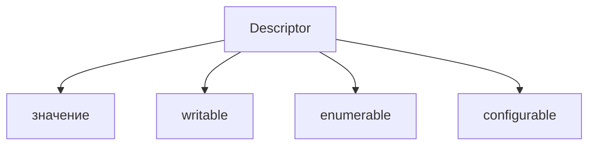

We do not study accessors, getters and setters yet.

### `value`

`value` is the property value:

```javascript
Object.defineProperty(config, 'environment', {
  value: 'staging'
});
```

Концептуально:

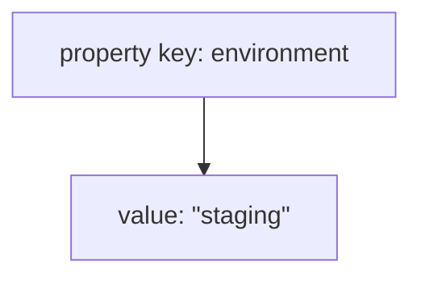

### `writable`

`writable` controls whether property value can be changed through assignment.

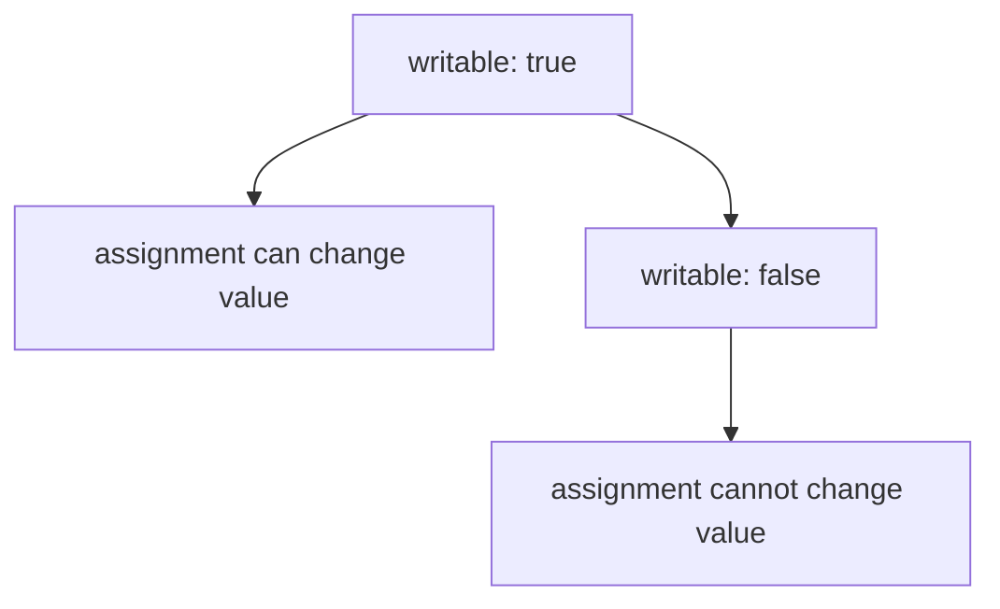

Readonly property:

```javascript
Object.defineProperty(config, 'environment', {
  value: 'staging',
  writable: false
});
```

### `enumerable`

`enumerable` controls whether property appears in common enumeration.

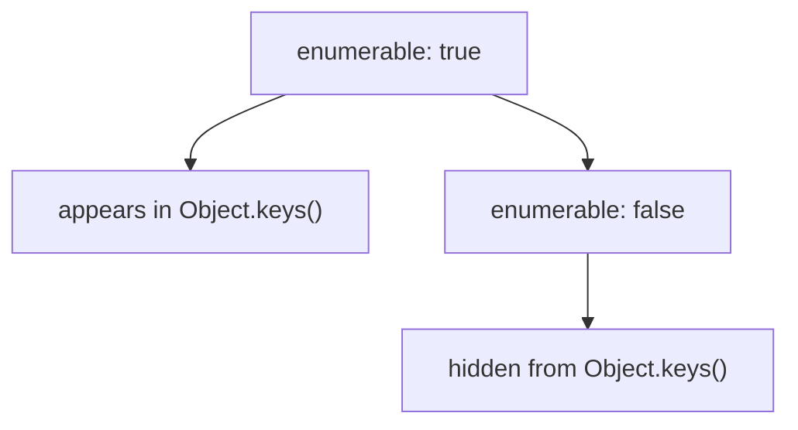

Hidden property in this chapter means non-enumerable property, not secret secure storage.

### `configurable`

`configurable` controls whether the property definition itself may be changed.

Удаление property - одно из практических следствий этого правила, потому что removing property also changes object structure.

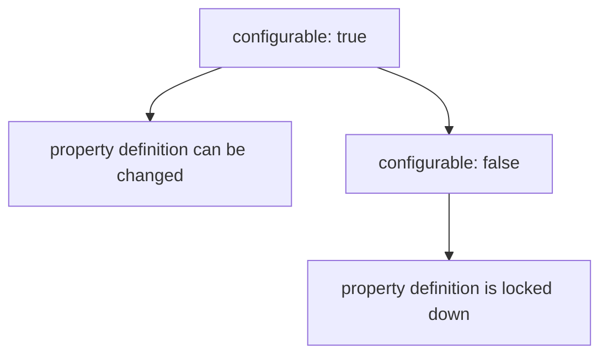

Эта глава оставляет модель высокоуровневой. Точные детали спецификации более тонкие.

### Object.getOwnPropertyDescriptor()

After understanding why descriptors exist, API becomes meaningful.

```javascript
const descriptor = Object.getOwnPropertyDescriptor(config, 'environment');
```

It отвечает:

```text
What rules control this property?
```

### Object.defineProperty()

`Object.defineProperty()` creates or modifies a property with explicit descriptor rules:

```javascript
Object.defineProperty(config, 'environment', {
  value: 'staging',
  writable: false,
  enumerable: true,
  configurable: false
});
```

It отвечает:

```text
Create this property with these rules.
```

### Defaults matter

Properties created by object literal are usually writable, enumerable and configurable.

Properties created by `Object.defineProperty()` have restrictive defaults when поля are omitted.

Пример:

```javascript
Object.defineProperty(config, 'internalId', {
  value: 'abc-123'
});
```

Концептуальные значения по умолчанию:

```text
writable: false
enumerable: false
configurable: false
```

This is a common beginner mistake.

---

## Внутренний механизм

When JavaScript performs an operation on property, it checks rules.

### Assignment attempt

```javascript
config.environment = 'production';
```

Концептуальный поток:

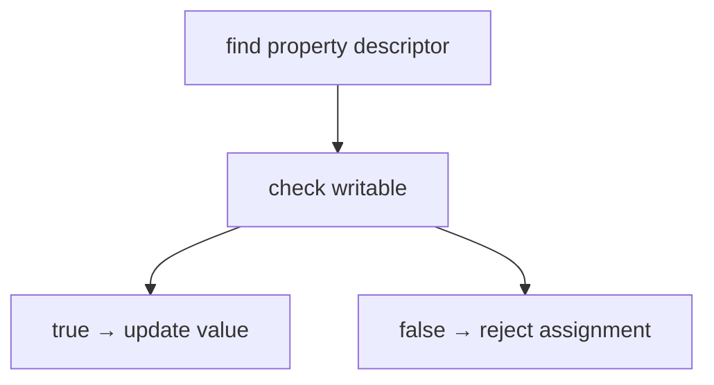

In strict mode, rejected assignment throws TypeError.

### Delete as a consequence

```javascript
delete config.environment;
```

Концептуальный поток:

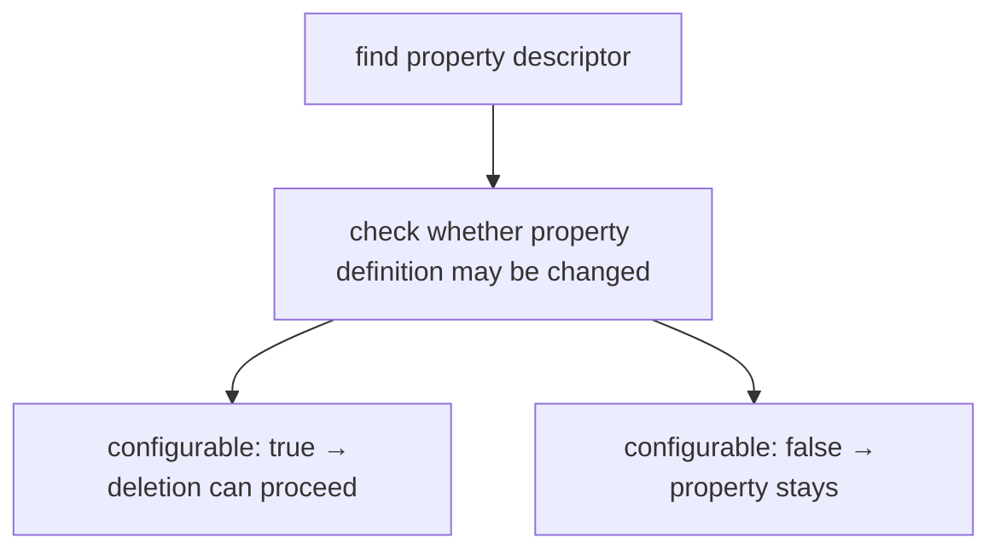

Deletion is shown here as one visible consequence of `configurable`, not as the whole meaning of the flag.

### Enumeration

```javascript
Object.keys(config);
```

Концептуальный поток:

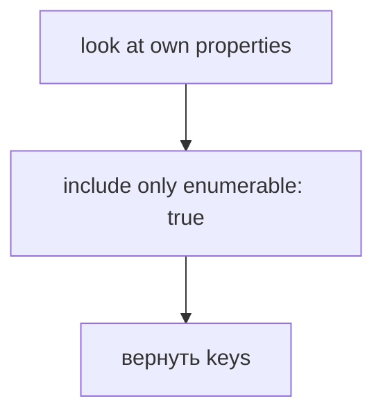

### Metadata flow

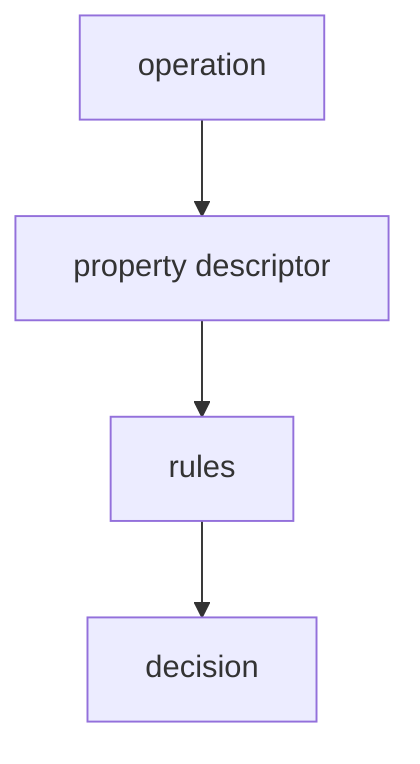

Descriptors are not business data. They are the rule layer that controls how operations behave.

---

## Ментальная модель

Property passport:

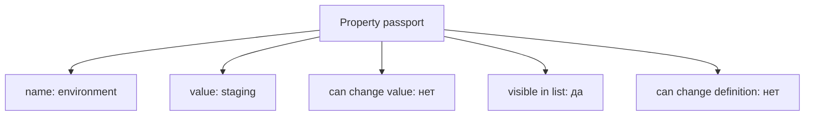

Permissions card:

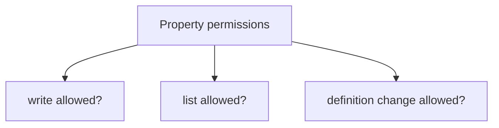

Property contract:

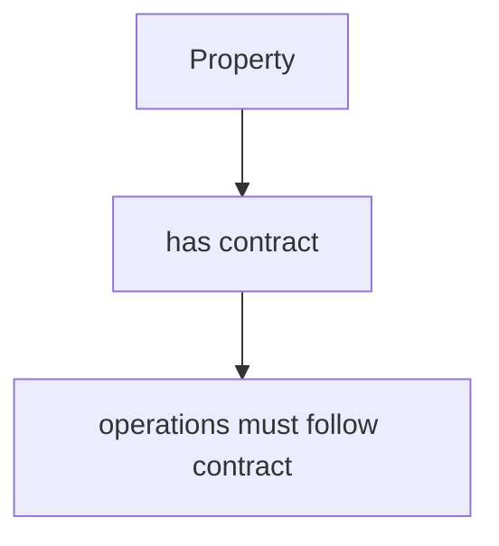

Главная модель:

```mermaid
flowchart TD
    N1["Property"]
    N2["Value"]
    N3["Metadata"]
    N4["Rules"]
    N1 --> N2
    N1 --> N3
    N3 --> N4
```

---

## Примеры кода

Примеры находятся в:

```text
examples/01-javascript/chapter-38/
```

Запуск:

```bash
node examples/01-javascript/chapter-38/01-basic-descriptor.js
node examples/01-javascript/chapter-38/02-readonly.js
node examples/01-javascript/chapter-38/03-hidden-property.js
node examples/01-javascript/chapter-38/04-define-property.js
node examples/01-javascript/chapter-38/05-common-mistakes.js
node examples/01-javascript/chapter-38/06-qa-example.js
```

### Пример 1. Basic descriptor

```javascript
const config = {
  environment: 'staging'
};

console.log(Object.getOwnPropertyDescriptor(config, 'environment'));
```

### Пример 2. Readonly

```javascript
'use strict';

const config = {};

Object.defineProperty(config, 'environment', {
  value: 'staging',
  writable: false,
  enumerable: true,
  configurable: true
});

try {
  config.environment = 'production';
} catch (error) {
  console.log(error.name);
}

console.log(config.environment);
```

### Пример 3. Hidden property

```javascript
const helper = {
  name: 'status helper'
};

Object.defineProperty(helper, 'internalId', {
  value: 'helper-001',
  enumerable: false
});

console.log(Object.keys(helper));
console.log(helper.internalId);
```

### Пример 4. defineProperty

```javascript
const config = {};

Object.defineProperty(config, 'timeout', {
  value: 5000,
  writable: true,
  enumerable: true,
  configurable: true
});

config.timeout = 7000;

console.log(config.timeout);
console.log(Object.keys(config));
```

### Пример 5. Типичные ошибки

```javascript
const config = {};

Object.defineProperty(config, 'environment', {
  value: 'staging'
});

console.log(Object.keys(config));
console.log(Object.getOwnPropertyDescriptor(config, 'environment'));
```

Omitted descriptor поля are not the same as object literal defaults.

### Пример 6. QA example

```javascript
'use strict';

const frameworkConfig = {};

Object.defineProperty(frameworkConfig, 'baseUrl', {
  value: 'https://api.example.test',
  writable: false,
  enumerable: true,
  configurable: false
});

Object.defineProperty(frameworkConfig, 'internalRunId', {
  value: 'run-001',
  enumerable: false
});

console.log(Object.keys(frameworkConfig));
console.log(frameworkConfig.internalRunId);

try {
  frameworkConfig.baseUrl = 'https://prod.example.test';
} catch (error) {
  console.log(error.name);
}

console.log(frameworkConfig.baseUrl);
```

---

## Частые вопросы

### Descriptor stores business data?

Descriptor describes property поведение. The `value` поле contains property value, but descriptor itself is metadata about the property.

### Hidden property is secure?

No.

`enumerable: false` hides property from enumeration like `Object.keys()`, but property can still be read directly if its name is known.

### Readonly property makes object immutable?

No.

It controls one property. Other properties may still be changed.

### `configurable: false` means writable is false?

No.

These are separate rules. A property can be non-configurable but still writable, depending on descriptor.

### Why not use descriptors everywhere?

Most application code does not need explicit descriptors. They are most useful for infrastructure, libraries and framework internals.

---

## Распространенные мифы

### Миф: property is only key and value

Реальность:

```mermaid
flowchart TD
    N1["Property"]
    N2["key"]
    N3["значение"]
    N4["metadata rules"]
    N1 --> N2
    N1 --> N3
    N1 --> N4
```

### Миф: non-enumerable means private

Реальность:

Non-enumerable means hidden from enumeration, not private.

### Миф: `Object.defineProperty()` is just another way to assign value

Реальность:

It defines value plus поведение rules.

### Миф: descriptors are business data

Реальность:

Descriptors are metadata controlling property operations.

---

## Типичные ошибки

### Ошибка 1. Forgetting defineProperty defaults

```javascript
Object.defineProperty(config, 'environment', {
  value: 'staging'
});
```

This creates restrictive property by default.

Исправление:

```javascript
Object.defineProperty(config, 'environment', {
  value: 'staging',
  writable: true,
  enumerable: true,
  configurable: true
});
```

### Ошибка 2. Expect hidden property to be unreadable

```javascript
helper.internalId;
```

If key is known, value can be read.

### Ошибка 3. Expect readonly assignment to always be silent

In strict mode, assigning to non-writable property throws TypeError.

### Ошибка 4. Use descriptors for ordinary test data

Most test payloads should stay simple objects. Descriptors are better for framework infrastructure and internal metadata.

---

## Практическое использование

### Immutable configuration property

```javascript
Object.defineProperty(config, 'baseUrl', {
  value: 'https://api.example.test',
  writable: false,
  enumerable: true,
  configurable: false
});
```

### Hidden framework internal

```javascript
Object.defineProperty(helper, 'internalRunId', {
  value: 'run-001',
  enumerable: false
});
```

### Helper metadata

Metadata can exist on helper object without appearing in ordinary key lists.

### Internal service objects

Framework infrastructure may lock certain properties to avoid accidental mutation.

---

## Использование в Automation QA

### Immutable configuration

Framework config sometimes must not be changed after setup:

```mermaid
flowchart TD
    N1["baseUrl"]
    N2["writable: false"]
    N1 --> N2
```

This protects important infrastructure значения from accidental reassignment.

### Hidden framework internals

Internal IDs or technical metadata can be non-enumerable:

```mermaid
flowchart TD
    N1["Object.keys(helper)"]
    N2["does not include internalRunId"]
    N1 --> N2
```

But this is not security. It is visibility control for normal enumeration.

### Helper metadata

Assertion helpers may carry internal tags, run IDs or debug metadata.

### Internal service objects

Service objects in a test framework may expose public configuration while keeping internal metadata out of ordinary listings.

Descriptors are more common in framework infrastructure than in ordinary test scripts.

---

## Диаграммы главы

### 1. Why descriptors exist

```mermaid
flowchart TD
    N1["same visible value"]
    N2["different behavior"]
    N3["hidden rules"]
    N1 --> N2
    N2 --> N3
```

### 2. Two identical-looking properties

```mermaid
flowchart TD
    N1["environment: &quot;staging&quot;"]
    N2["environment: &quot;staging&quot;"]
    N3["different rules"]
    N2 --> N3
    N1 --> N2
```

### 3. Hidden metadata

```mermaid
flowchart TD
    N1["property"]
    N2["visible value"]
    N3["hidden metadata"]
    N1 --> N2
    N1 --> N3
```

### 4. Property structure

```mermaid
flowchart TD
    N1["Property"]
    N2["key"]
    N3["значение"]
    N4["descriptor"]
    N1 --> N2
    N1 --> N3
    N1 --> N4
```

### 5. Descriptor поля

```mermaid
flowchart TD
    N1["Descriptor"]
    N2["значение"]
    N3["writable"]
    N4["enumerable"]
    N5["configurable"]
    N1 --> N2
    N1 --> N3
    N1 --> N4
    N1 --> N5
```

### 6. writable

```mermaid
flowchart TD
    N1["writable?"]
    N2["true → assignment allowed"]
    N3["false → assignment blocked"]
    N1 --> N2
    N1 --> N3
```

### 7. enumerable

```mermaid
flowchart TD
    N1["enumerable?"]
    N2["true → appears in Object.keys"]
    N3["false → hidden from Object.keys"]
    N1 --> N2
    N1 --> N3
```

### 8. configurable

```mermaid
flowchart TD
    N1["configurable?"]
    N2["true → definition can change"]
    N3["false → definition locked"]
    N1 --> N2
    N1 --> N3
```

### 9. Property passport

```mermaid
flowchart TD
    N1["passport"]
    N2["значение"]
    N3["write permission"]
    N4["list permission"]
    N5["definition-change permission"]
    N1 --> N2
    N1 --> N3
    N1 --> N4
    N1 --> N5
```

### 10. Property contract

```mermaid
flowchart TD
    N1["operation"]
    N2["must follow property contract"]
    N1 --> N2
```

### 11. Текущая модель JavaScript

```mermaid
flowchart TD
    N1["Objects"]
    N2["data"]
    N3["methods"]
    N4["descriptors"]
    N1 --> N2
    N1 --> N3
    N1 --> N4
```

### 12. Object.getOwnPropertyDescriptor()

```mermaid
flowchart TD
    N1["property key"]
    N2["descriptor object"]
    N1 --> N2
```

### 13. Object.defineProperty()

```mermaid
flowchart TD
    N1["object + key + descriptor"]
    N2["property with rules"]
    N1 --> N2
```

### 14. Readonly property

```mermaid
flowchart TD
    N1["writable: false"]
    N2["assignment rejected"]
    N1 --> N2
```

### 15. Hidden property

```mermaid
flowchart TD
    N1["enumerable: false"]
    N2["not in Object.keys"]
    N1 --> N2
```

### 16. Delete as consequence

```mermaid
flowchart TD
    N1["delete property attempt"]
    N2["check whether definition may change"]
    N1 --> N2
```

### 17. Assignment attempt

```mermaid
flowchart TD
    N1["assign new value"]
    N2["check writable"]
    N1 --> N2
```

### 18. Enumeration

```mermaid
flowchart TD
    N1["Object.keys"]
    N2["include enumerable properties"]
    N1 --> N2
```

### 19. Metadata flow

```mermaid
flowchart TD
    N1["operation"]
    N2["descriptor"]
    N3["decision"]
    N1 --> N2
    N2 --> N3
```

### 20. Property lifecycle

```mermaid
flowchart TD
    N1["define property"]
    N2["set rules"]
    N3["operations follow rules"]
    N1 --> N2
    N2 --> N3
```

### 21. Object evolution

```mermaid
flowchart TD
    N1["simple object"]
    N2["properties with behavior rules"]
    N1 --> N2
```

### 22. QA config object

```mermaid
flowchart TD
    N1["frameworkConfig"]
    N2["baseUrl readonly"]
    N3["internalRunId hidden"]
    N1 --> N2
    N1 --> N3
```

### 23. API response preview

```mermaid
flowchart TD
    N1["API response"]
    N2["usually plain data"]
    N1 --> N2
```

### 24. Типичные ошибки

```mermaid
flowchart TD
    N1["defineProperty without flags"]
    N2["restrictive defaults"]
    N1 --> N2
```

### 25. Краткая ментальная модель

```text
passport
permissions card
metadata sheet
```

### 26. Complete descriptor model

```mermaid
flowchart TD
    N1["Property"]
    N2["Value"]
    N3["Metadata"]
    N4["Rules"]
    N1 --> N2
    N1 --> N3
    N3 --> N4
```

### 27. Rules before operation

```mermaid
flowchart TD
    N1["before assignment/delete/list"]
    N2["check rules"]
    N1 --> N2
```

### 28. Operation decision

```mermaid
flowchart TD
    N1["rule allows?"]
    N2["да → perform operation"]
    N3["нет → reject/skip"]
    N1 --> N2
    N1 --> N3
```

### 29. Property permissions

```text
write
list
change property definition
```

### 30. Переход к Prototype

```mermaid
flowchart TD
    N1["properties can exist elsewhere"]
    N2["Prototype"]
    N1 --> N2
```

### 31. Переход к Classes

```mermaid
flowchart TD
    N1["classes создать objects"]
    N2["properties still have rules"]
    N1 --> N2
```

### 32. Internal metadata

```mermaid
flowchart TD
    N1["business data"]
    N2["≠"]
    N3["metadata"]
    N1 --> N2
    N2 --> N3
```

### 33. State vs metadata

```text
state: environment = staging
metadata: writable = false
```

### 34. Итоговая схема

```mermaid
flowchart TD
    N1["Property"]
    N2["Value"]
    N3["Rules"]
    N4["writable"]
    N5["enumerable"]
    N6["configurable"]
    N1 --> N2
    N1 --> N3
    N3 --> N4
    N3 --> N5
    N3 --> N6
```

---

## Практика

Практика находится в:

```text
practice/01-javascript/38-object-descriptors.md
```

Рекомендуемый порядок:

```text
1. Ответить на концептуальные вопросы.
2. Определить descriptor behavior.
3. Предсказать output.
4. Запустить examples/01-javascript/chapter-38/.
5. Выполнить debugging tasks.
6. Сделать QA mini-project.
7. Свериться с solutions/01-javascript/38-object-descriptors.md.
```

---

## Решения

Решения находятся в:

```text
solutions/01-javascript/38-object-descriptors.md
```

Не открывайте решения до самостоятельной попытки. Главный вопрос:

```text
What rule controls this property?
```

---

## Итоги

Object Descriptors расширяют модель object properties.

```mermaid
flowchart TD
    N1["Property"]
    N2["Value"]
    N3["Metadata"]
    N4["Rules"]
    N1 --> N2
    N1 --> N3
    N3 --> N4
```

Descriptors describe property поведение. They do not represent business data.

We studied:

* `value`;
* `writable`;
* `enumerable`;
* `configurable`;
* `Object.getOwnPropertyDescriptor()`;
* `Object.defineProperty()`;
* readonly properties;
* hidden properties.

Next chapter begins Prototype:

```mermaid
flowchart TD
    N1["many objects"]
    N2["shared behavior"]
    N3["Prototype"]
    N1 --> N2
    N2 --> N3
```

---

## Что нужно запомнить

* Property is not only value.
* Property has metadata.
* Descriptor describes property поведение.
* `writable` controls assignment.
* `enumerable` controls visibility in enumeration.
* `configurable` controls whether the property definition itself may be changed.
* Deletion is one practical consequence of `configurable`, not the whole meaning of it.
* `Object.getOwnPropertyDescriptor()` reads descriptor.
* `Object.defineProperty()` defines property with rules.
* Non-enumerable does not mean private.
* Descriptors are more common in framework infrastructure than ordinary test data.

---

## Проверьте себя

Ответьте без запуска кода.

1. Why do descriptors exist?
2. What does descriptor describe?
3. What does `writable` control?
4. What does `enumerable` control?
5. What does `configurable` control?
6. Why can two properties with equal значения behave differently?
7. Does non-enumerable mean private?
8. Why can `Object.defineProperty()` surprise beginners?
9. Where can descriptors be useful in Automation QA?
10. What is the next topic after descriptors?
