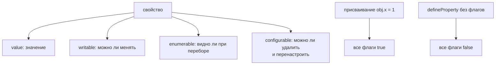

# Дескрипторы свойств

## Связь с предыдущей главой

Предыдущая глава объяснила Object Methods.

Главная модель была такой: метод — это функция, лежащая в свойстве объекта.

До этого мы работали с properties как будто все они behave the same:

```javascript
const config = {
  baseUrl: 'https://api.example.test',
  timeout: 5000
};

config.timeout = 7000;
delete config.baseUrl;
```

Выглядит так, будто property - это только:

Но в JavaScript property has more than value.

Главный вопрос этой главы:

> Почему две properties с похожими значения могут behave differently?

Например: одно свойство можно переопределить, а другое — нет, хотя выглядят они одинаково.

Например, свойство можно сделать нередактируемым или скрыть его из перебора — это задаётся дескриптором, а не самим значением.

Ответ:

Object Descriptors describe these rules.

---

## Предварительные требования

Для этой главы нужно понимать:

* что object consists of properties;
* что property has key and value;
* что assignment can update property value;
* что `delete` can remove property на базовом уровне;
* что object methods are properties with function objects;
* что `Object` is a built-in object with useful methods;
* что examples can intentionally demonstrate errors.

Не требуется знать accessors, getters, setters, proxies, `Reflect`, sealing/freezing or prototype descriptors. Эти темы будут изучаться позже.

---

## Время изучения

Ориентировочное время:

```text
Чтение главы:            140-170 минут
Разбор схем:             60-80 минут
Запуск примеров:         25-35 минут
Практика:                120-150 минут
Повторение материала:    30 минут
```

Уровень сложности: **L4**.

Object Descriptors важны потому, что они меняют представление о property. Property is not only business data. It also has metadata that controls поведение.

---

## Навигация

Предыдущая глава:

```text
docs/01-javascript/37-object-methods.md
```

Текущая глава:

```text
docs/01-javascript/38-object-descriptors.md
```

Следующая глава:

```text
docs/01-javascript/39-prototype.md
```

Следующая глава ответит:

> Where do methods come from when many objects share the same поведение?

---

## Цели обучения

После изучения этой главы вы будете понимать:

* зачем descriptors существуют;
* почему property is value plus rules;
* что такое property metadata;
* что означает descriptor поле `value`;
* что контролирует `writable`;
* что контролирует `enumerable`;
* что контролирует `configurable`;
* как читать descriptor через `Object.getOwnPropertyDescriptor()`;
* как создавать/изменять property rules через `Object.defineProperty()`;
* как работают readonly and hidden properties на базовом уровне;
* какие ошибки встречаются чаще всего;
* как descriptors встречаются in Automation QA framework infrastructure.

---

## Мотивация

Начнем с проблемы.

Есть два object:

```javascript
const firstConfig = {
  environment: 'staging'
};

const secondConfig = {};

Object.defineProperty(secondConfig, 'environment', {
  value: 'staging',
  writable: false,
  enumerable: true,
  configurable: false
});
```

Обе properties выглядят похожими:

Но поведение differs:

Вопрос:

> Why can two properties with equal значения behave differently?

Потому что у property есть hidden metadata:

Descriptor is the metadata sheet for a property.

---

## Теория

Дескриптор свойства описывает его поведение.

Не API является главным.

Главная идея:

```text
у свойства есть не только значение, но и правила обращения с ним
```

### Зачем нужны дескрипторы

Если бы у свойства было только значение, JavaScript не смог бы ответить на вопросы:

```text
Can this property be changed?
Can this property appear in enumeration?
Can this property definition be changed?
Can deleting this property be allowed as one consequence?
```

Дескрипторы существуют, чтобы хранить эти правила.

### Метаданные свойства

Метаданные — это информация об информации.

Бизнес-данные:

```text
environment = "staging"
```

Метаданные:

```text
writable: false
enumerable: true
configurable: false
```

Дескрипторы описывают поведение свойства. Кроме самого поля `value`, деловых данных они не хранят.

### Поля дескриптора

Для обычных свойств данных в этой главе:

Геттеры и сеттеры мы пока не изучаем.

### `value`

`value` — значение свойства:

```javascript
Object.defineProperty(config, 'environment', {
  value: 'staging'
});
```

Концептуально:

```text
value  —  единственное поле дескриптора, которое хранит сами данные
```

Остальные поля хранят правила: что с этим значением разрешено делать.

### `writable`

`writable` управляет тем, можно ли изменить значение свойства присваиванием.

Свойство только для чтения:

```javascript
Object.defineProperty(config, 'environment', {
  value: 'staging',
  writable: false
});
```

### `enumerable`

`enumerable` управляет тем, попадает ли свойство в обычный перебор.

Скрытое свойство в этой главе означает свойство вне перебора, а не защищённое хранилище.

### `configurable`

`configurable` управляет тем, можно ли изменить само описание свойства.

Удаление свойства — одно из практических следствий этого правила, потому что оно тоже меняет структуру объекта.

Эта глава оставляет модель высокоуровневой. Точные детали спецификации более тонкие.

### Метод `Object.getOwnPropertyDescriptor()`

Когда понятно, зачем нужны дескрипторы, сам набор функций становится осмысленным.

```javascript
const descriptor = Object.getOwnPropertyDescriptor(config, 'environment');
```

Она отвечает:

```text
What rules control this property?
```

### Метод `Object.defineProperty()`

`Object.defineProperty()` создаёт или изменяет свойство с явными правилами:

```javascript
Object.defineProperty(config, 'environment', {
  value: 'staging',
  writable: false,
  enumerable: true,
  configurable: false
});
```

Она отвечает:

```text
Create this property with these rules.
```

### Значения по умолчанию важны

Свойства, созданные литералом объекта, обычно изменяемы, перечисляемы и настраиваемы.

Свойства, созданные через `Object.defineProperty()`, при пропущенных полях получают ограничительные значения по умолчанию.

Пример:

```javascript
Object.defineProperty(config, 'internalId', {
  value: 'abc-123'
});
```

Концептуальные значения по умолчанию:

```text
writable: false
enumerable: false
configurable: false
```

Это распространённая ошибка новичков.

---

У каждого свойства есть скрытые настройки:


```mermaid
flowchart TD
    A["свойство"] --> B["value: значение"]
    A --> C["writable: можно ли менять"]
    A --> D["enumerable: видно ли при переборе"]
    A --> E["configurable: можно ли удалить<br/>и перенастроить"]
    F["присваивание obj.x = 1"] --> G["все флаги true"]
    H["defineProperty без флагов"] --> I["все флаги false"]
```

## Внутренний механизм

Когда JavaScript выполняет операцию над свойством, он проверяет правила.

### Попытка присваивания

```javascript
config.environment = 'production';
```

Концептуальный поток:

В строгом режиме отклонённое присваивание выбрасывает `TypeError`.

### Удаление как следствие

```javascript
delete config.environment;
```

Концептуальный поток:

Удаление показано здесь как одно видимое следствие флага `configurable`, а не как весь его смысл.

### Перебор свойств

```javascript
Object.keys(config);
```

Концептуальный поток:

```text
1. взять список свойств объекта
2. для каждого прочитать флаг enumerable
3. enumerable: true   →  свойство попадает в результат
4. enumerable: false  →  свойство пропускается
```

Свойство при этом остаётся: оно читается по имени, но не показывается при
переборе.

### Поток метаданных

Дескрипторы — не деловые данные. Это слой правил, который управляет поведением операций.

---

## Ментальная модель

Дескриптор удобно представлять как паспорт свойства: в нём записано не только
значение, но и что с этим свойством разрешено делать — можно ли менять,
попадает ли оно в перебор, можно ли переопределить сам паспорт.

Главная модель: у свойства есть значение и отдельно от него — правила
обращения. Обычное присваивание задаёт значение и оставляет правила по
умолчанию; `Object.defineProperty()` позволяет задать и то и другое.

---

## Примеры кода

Примеры находятся в:

```text
examples/01-javascript/chapter-38/
```

Запуск:

```bash
node examples/01-javascript/chapter-38/01-basic-descriptor.js
node examples/01-javascript/chapter-38/02-readonly.js
node examples/01-javascript/chapter-38/03-hidden-property.js
node examples/01-javascript/chapter-38/04-define-property.js
node examples/01-javascript/chapter-38/05-common-mistakes.js
node examples/01-javascript/chapter-38/06-qa-example.js
```

### Пример 1. Базовый дескриптор

```javascript
const config = {
  environment: 'staging'
};

console.log(Object.getOwnPropertyDescriptor(config, 'environment'));
```

### Пример 2. Только для чтения

```javascript
'use strict';

const config = {};

Object.defineProperty(config, 'environment', {
  value: 'staging',
  writable: false,
  enumerable: true,
  configurable: true
});

try {
  config.environment = 'production';
} catch (error) {
  console.log(error.name);
}

console.log(config.environment);
```

### Пример 3. Скрытое свойство

```javascript
const helper = {
  name: 'status helper'
};

Object.defineProperty(helper, 'internalId', {
  value: 'helper-001',
  enumerable: false
});

console.log(Object.keys(helper));
console.log(helper.internalId);
```

### Пример 4. `defineProperty`

```javascript
const config = {};

Object.defineProperty(config, 'timeout', {
  value: 5000,
  writable: true,
  enumerable: true,
  configurable: true
});

config.timeout = 7000;

console.log(config.timeout);
console.log(Object.keys(config));
```

### Пример 5. Типичные ошибки

```javascript
const config = {};

Object.defineProperty(config, 'environment', {
  value: 'staging'
});

console.log(Object.keys(config));
console.log(Object.getOwnPropertyDescriptor(config, 'environment'));
```

Пропущенные поля дескриптора — не то же самое, что значения по умолчанию у литерала объекта.

### Пример 6. Пример из автоматизации тестов

```javascript
'use strict';

const frameworkConfig = {};

Object.defineProperty(frameworkConfig, 'baseUrl', {
  value: 'https://api.example.test',
  writable: false,
  enumerable: true,
  configurable: false
});

Object.defineProperty(frameworkConfig, 'internalRunId', {
  value: 'run-001',
  enumerable: false
});

console.log(Object.keys(frameworkConfig));
console.log(frameworkConfig.internalRunId);

try {
  frameworkConfig.baseUrl = 'https://prod.example.test';
} catch (error) {
  console.log(error.name);
}

console.log(frameworkConfig.baseUrl);
```

---

## Частые вопросы

### Дескриптор хранит деловые данные?

Дескриптор описывает поведение свойства. Поле `value` содержит значение, но сам дескриптор — метаданные о свойстве.

### Скрытое свойство защищено?

Нет.

`enumerable: false` убирает свойство из перебора вроде `Object.keys()`, но его по-прежнему можно прочитать напрямую, зная имя.

### Свойство только для чтения делает объект неизменяемым?

Нет.

Оно управляет одним свойством. Остальные по-прежнему можно менять.

### `configurable: false` означает, что `writable` тоже `false`?

Нет.

Это отдельные правила. Свойство может быть ненастраиваемым и при этом изменяемым — всё зависит от дескриптора.

### Почему не использовать дескрипторы везде?

Большинству прикладного кода явные дескрипторы не нужны. Они полезнее всего в инфраструктуре, библиотеках и внутренностях фреймворков.

---

## Распространённые мифы

### Миф: свойство — это только ключ и значение

Реальность: кроме ключа и значения у свойства есть флаги `writable`,
`enumerable` и `configurable`. Обычный литерал объекта просто задаёт им
значение `true`, поэтому их обычно не видно.

### Миф: невидимое в переборе значит приватное

Реальность: скрытое от перебора свойство по-прежнему читается и изменяется по
имени.

Невидимое в переборе означает скрытое от перебора, а не приватное.

### Миф: `Object.defineProperty()` — просто другой способ присвоить значение

Реальность:

Она задаёт и значение, и правила поведения.

### Миф: дескрипторы — это деловые данные

Реальность:

Дескрипторы — метаданные, управляющие операциями над свойством.

---

## Распространённые ошибки

### Ошибка 1. Забыть про умолчания `defineProperty`

```javascript
Object.defineProperty(config, 'environment', {
  value: 'staging'
});
```

Так по умолчанию создаётся ограниченное свойство.

Исправление:

```javascript
Object.defineProperty(config, 'environment', {
  value: 'staging',
  writable: true,
  enumerable: true,
  configurable: true
});
```

### Ошибка 2. Ожидать, что скрытое свойство нельзя прочитать

```javascript
helper.internalId;
```

Если ключ известен, значение читается.

### Ошибка 3. Ожидать, что присваивание в свойство только для чтения всегда тихое

В строгом режиме присваивание в неизменяемое свойство выбрасывает `TypeError`.

### Ошибка 4. Использовать дескрипторы для обычных тестовых данных

Большинство тел запросов должны оставаться простыми объектами. Дескрипторы лучше подходят для инфраструктуры фреймворка и внутренних метаданных.

---

## Практическое использование

### Неизменяемое свойство настройки

```javascript
Object.defineProperty(config, 'baseUrl', {
  value: 'https://api.example.test',
  writable: false,
  enumerable: true,
  configurable: false
});
```

### Скрытые внутренности фреймворка

```javascript
Object.defineProperty(helper, 'internalRunId', {
  value: 'run-001',
  enumerable: false
});
```

### Метаданные вспомогательных функций

Метаданные могут жить на вспомогательном объекте, не попадая в обычные списки ключей.

### Служебные объекты

Инфраструктура фреймворка может закрывать отдельные свойства, чтобы их не изменили случайно.

---

## Использование в Automation QA

### Неизменяемая конфигурация

Настройку фреймворка иногда нельзя менять после подготовки:

Это защищает важные значения инфраструктуры от случайного переприсваивания.

### Скрытые внутренности фреймворка

Внутренние идентификаторы и технические метаданные можно сделать невидимыми в переборе:

Но это не защита. Это управление видимостью при обычном переборе.

### Метаданные вспомогательных функций

Вспомогательные проверки могут нести внутренние метки, идентификаторы прогона или отладочные метаданные.

### Служебные объекты

Служебные объекты тестового фреймворка могут показывать публичную настройку, оставляя внутренние метаданные вне обычных списков.

Дескрипторы чаще встречаются в инфраструктуре фреймворка, чем в обычных тестовых сценариях.

---

## Практика

Практика находится в:

```text
practice/01-javascript/38-object-descriptors.md
```

Рекомендуемый порядок:

```text
1. Ответить на концептуальные вопросы.
2. Определить descriptor behavior.
3. Предсказать output.
4. Запустить examples/01-javascript/chapter-38/.
5. Выполнить debugging tasks.
6. Сделать QA mini-project.
7. Свериться с solutions/01-javascript/38-object-descriptors.md.
```

---

## Решения

Решения находятся в:

```text
solutions/01-javascript/38-object-descriptors.md
```

Не открывайте решения до самостоятельной попытки. Главный вопрос:

```text
What rule controls this property?
```

---

## Итоги

Дескрипторы расширяют модель свойств объекта.

Дескрипторы описывают поведение свойства. Деловых данных они не представляют.

Мы изучили:

* `value`;
* `writable`;
* `enumerable`;
* `configurable`;
* `Object.getOwnPropertyDescriptor()`;
* `Object.defineProperty()`;
* свойства только для чтения;
* скрытые от перебора свойства.

Следующая глава начинает тему прототипов: она объясняет, откуда объект берёт
свойства, которых нет в нём самом.

---

## Что нужно запомнить

* Свойство — это не только значение.
* У свойства есть метаданные.
* Дескриптор описывает поведение свойства.
* `writable` управляет присваиванием.
* `enumerable` управляет видимостью при переборе.
* `configurable` управляет тем, можно ли изменить само описание свойства.
* Удаление — одно практическое следствие флага `configurable`, а не весь его смысл.
* `Object.getOwnPropertyDescriptor()` читает дескриптор.
* `Object.defineProperty()` задаёт свойство вместе с правилами.
* Невидимое в переборе не означает приватное.
* Дескрипторы чаще встречаются в инфраструктуре фреймворка, чем в обычных тестовых данных.

---

## Проверьте себя

Ответьте без запуска кода.

1. Зачем существуют дескрипторы?
2. Что описывает дескриптор?
3. Чем управляет `writable`?
4. Чем управляет `enumerable`?
5. Чем управляет `configurable`?
6. Почему два свойства с одинаковыми значениями могут вести себя по-разному?
7. Означает ли невидимость при переборе приватность?
8. Почему `Object.defineProperty()` удивляет новичков?
9. Где дескрипторы полезны в автоматизации тестов?
10. Какая тема идёт после дескрипторов?

### Ответы

1. Потому что у свойства есть не только значение, но и правила обращения с ним. Дескрипторы — место, где эти правила хранятся.
2. Как ведёт себя свойство: можно ли изменить его значение, показывается ли оно при переборе, можно ли изменить само его описание.
3. Можно ли заменить значение свойства присваиванием.
4. Попадает ли свойство в перебор — например, в `Object.keys()`.
5. Можно ли изменить описание свойства и удалить его.
6. Потому что совпадают только значения, а флаги могут быть разными. Одно свойство изменяется присваиванием и видно при переборе, другое — нет.
7. Нет. Скрытое от перебора свойство по-прежнему читается и изменяется по имени.
8. Потому что по умолчанию все три флага у создаваемого свойства равны `false`. Свойство, заданное так, оказывается неизменяемым и невидимым при переборе, хотя автор этого не просил.
9. В инфраструктуре фреймворка: служебные поля, которые не должны попадать в сериализацию или сравнение объектов, и настройки, которые нельзя перезаписать по ошибке.
10. Прототипы: где живёт поведение, общее для многих объектов.

