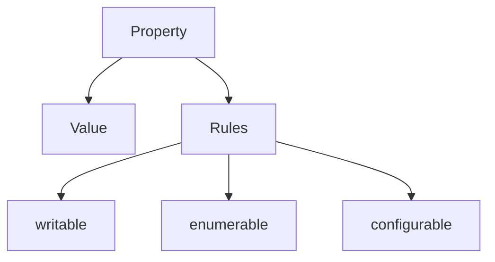
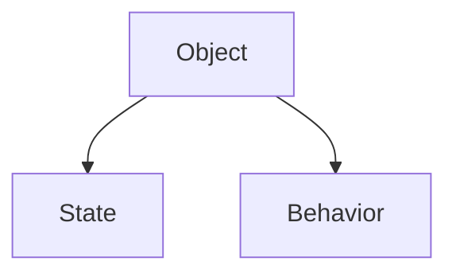
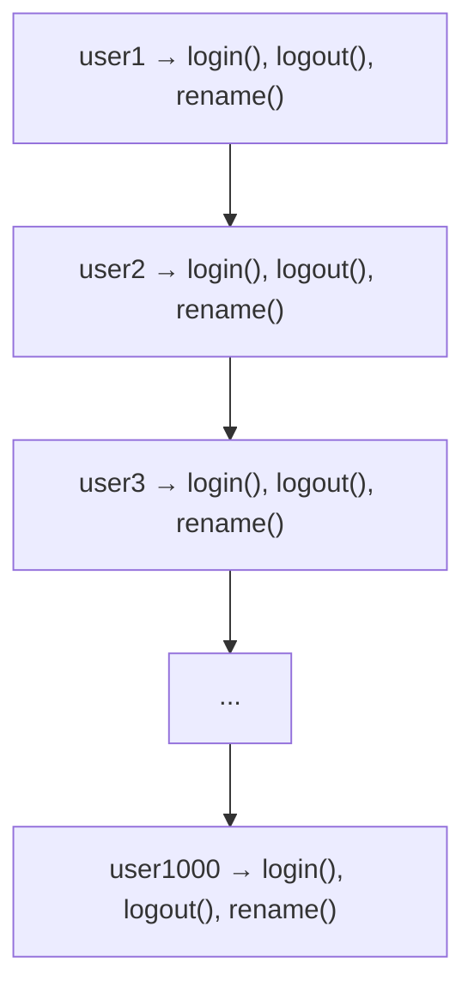
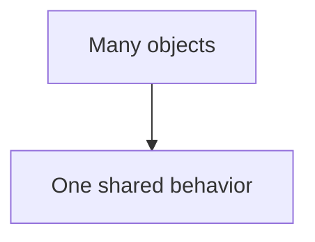
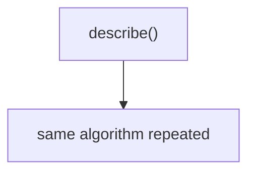
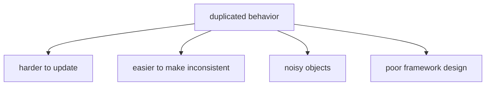
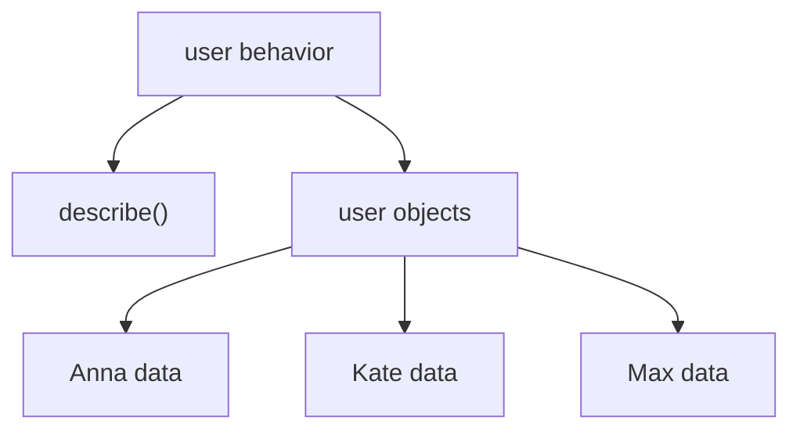
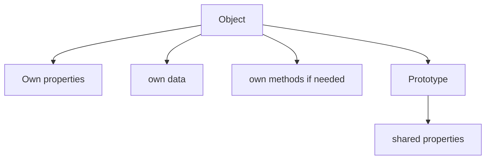

# Prototype

## Связь с предыдущей главой

Предыдущая глава объяснила Object Descriptors.

Главная модель была такой:



Теперь мы возвращаемся к поведение.

В главе про Object Methods мы видели, что object может хранить methods:



Но появляется новый вопрос:

> Если много объектов нуждаются в одинаковом поведение, должен ли каждый object хранить собственную копию method?

Представьте 1000 user objects:



Data у каждого user своя.

Behavior одинаковый.

Prototype отвечает именно на этот вопрос:



В этой главе Prototype рассматривается как практический механизм sharing поведение. Мы не будем подробно изучать Prototype Chain, `constructor.prototype`, classes, `new` или inheritance. Эти темы идут позже.

---

## Предварительные требования

Для этой главы нужно понимать:

* что object stores related data;
* что object property has key and value;
* что method is property with function object value;
* что обычный вызов `object.method()` выбирает объект выполнения из формы вызова;
* что `this` внутри обычного method call связан с объект выполнения;
* что descriptor describes own property rules;
* что `Object` содержит встроенные helper methods.

Не требуется знать Prototype Chain in depth, classes, `new`, `constructor.prototype`, `hasOwnProperty()`, `Reflect` или `__proto__` internals. `__proto__` будет упомянут только как деталь, к которой не нужно привязывать основную модель.

---

## Время изучения

Ориентировочное время:

```text
Чтение главы:            150-190 минут
Разбор схем:             70-90 минут
Запуск примеров:         25-35 минут
Практика:                130-160 минут
Повторение материала:    35 минут
```

Уровень сложности: **L4**.

Prototype кажется внутренней темой, но в этой главе он начинается с простой инженерной проблемы: repeated methods. Если много объектов хранят одинаковые function objects, код становится тяжелее читать, сложнее поддерживать и легче сломать.

---

## Навигация

Предыдущая глава:

```text
docs/01-javascript/38-object-descriptors.md
```

Текущая глава:

```text
docs/01-javascript/39-prototype.md
```

Следующая глава:

```text
docs/01-javascript/40-prototype-chain.md
```

Следующая глава ответит:

> Что происходит, если requested property не найдена ни в object, ни в его prototype?

---

## Цели обучения

После изучения этой главы вы будете понимать:

* зачем существует Prototype;
* почему duplicated methods are a problem;
* что такое prototype object на концептуальном уровне;
* чем own property отличается от inherited property;
* как JavaScript ищет property через object and prototype;
* как `Object.getPrototypeOf()` помогает увидеть prototype;
* зачем существует `Object.setPrototypeOf()` на высоком уровне;
* почему Prototype прежде всего about общее поведение;
* почему не стоит начинать изучение Prototype с inheritance;
* как Prototype связан с Page Objects, API clients and framework utilities.

---

## Мотивация

Начнем с проблемы.

Есть три user objects:

```javascript
const userAnna = {
  name: 'Anna',
  role: 'admin',
  describe() {
    return this.name + ' [' + this.role + ']';
  }
};

const userKate = {
  name: 'Kate',
  role: 'editor',
  describe() {
    return this.name + ' [' + this.role + ']';
  }
};

const userMax = {
  name: 'Max',
  role: 'viewer',
  describe() {
    return this.name + ' [' + this.role + ']';
  }
};
```

Состояние разное:

```text
Anna / admin
Kate / editor
Max  / viewer
```

Но method одинаковый:



Проблема не в том, что код не работает.

Он работает.

Проблема в другом:



Если завтра формат описания изменится, нужно найти каждую копию:

```text
Anna.describe()
Kate.describe()
Max.describe()
...
```

Это плохая модель для framework code.

Нам нужен один shared place:



Prototype дает такой shared place.

---

## Теория

Prototype - это object, который может использоваться другим object как shared source of properties.

Главная идея:



Важно:

Prototype is an object.

Не абстрактная магия.

Не отдельный тип значения.

Не synonym for class.

Так как prototype - обычный object, он может содержать любые properties:

Но на практике prototype чаще всего используют именно для общее поведение.

Причина простая: data обычно отличается у каждого конкретного object, а поведение часто повторяется.

Поэтому в этой главе examples deliberately focus on methods.

Это не ограничение механизма языка.

Это наиболее частый и полезный способ его применения.

В нашем основном примере prototype содержит общее поведение:

```text
объект            →  собственные данные
его prototype     →  общее поведение
```

Другие objects могут быть связаны с этим prototype:

Когда JavaScript читает property, он сначала смотрит в сам object:

Если property не найдена, JavaScript может посмотреть в prototype:

В этой главе мы ограничиваемся одним prototype level. Полный Prototype Chain будет изучаться в следующей главе.

### Own property

Own property - property, которая находится directly on object.

```javascript
const user = {
  name: 'Anna'
};
```

`name` is own property:

### Inherited property

Inherited property - property, которую object получает через prototype lookup.

Термин "inherited" здесь означает:

Это не значит, что мы уже изучаем inheritance как архитектурную тему. Inheritance будет обсуждаться позже вместе с Prototype Chain and Classes.

### `Object.getPrototypeOf()`

`Object.getPrototypeOf(object)` возвращает prototype object, связанный с object.

```javascript
const prototype = Object.getPrototypeOf(user);
```

Ментально:

### `Object.setPrototypeOf()`

`Object.setPrototypeOf(object, prototype)` может установить prototype manually.

В этой главе мы используем его только как понятный учебный инструмент:

```javascript
Object.setPrototypeOf(user, userBehavior);
```

Ментально:

Важно: в production code `Object.setPrototypeOf()` применяют осторожно. Он меняет связь уже существующего object and can make code harder to reason about. Более устойчивые способы создания объектов с нужным prototype будут изучаться позже.

---

## Внутренний механизм

Когда engine выполняет чтение property, он не сразу говорит `undefined`.

Он проходит lookup process.

Допустим:

```javascript
console.log(user.describe());
```

Engine видит:

```text
Need property: "describe"
Target object: user
```

Дальше:

Затем:

После этого method вызывается как обычный method:

Это важный момент.

Method может быть stored in prototype, но ordinary invocation still uses object before dot as объект выполнения:

Поэтому inside method:

```javascript
describe() {
  return this.name;
}
```

`this` points to `user` при обычном вызове `user.describe()`.

Так одна function object может работать с разными objects:

### Что делает engine прямо сейчас?

Для чтения `user.describe`:

Для вызова `user.describe()`:

Мы пока не разбираем, что будет, если prototype itself has another prototype. Это Prototype Chain, следующая глава.

---

## Ментальная модель

Prototype удобно представить как shared toolbox.

Каждый object хранит свои данные:

Но tools лежат в общей комнате:

Object не копирует каждый tool внутрь себя.

Он knows where shared toolbox is:

Если нужен own data:

Если нужен общее поведение:

Другие mental models:

Главное:

Не начинайте с мысли "Prototype is inheritance".

В этой главе точнее:

---

## Примеры кода

Примеры находятся в:

```text
examples/01-javascript/chapter-39/
```

Запуск:

```bash
node examples/01-javascript/chapter-39/01-duplicated-methods.js
```

### Пример 1. Дублированные методы

Файл:

```text
examples/01-javascript/chapter-39/01-duplicated-methods.js
```

Идея:

Такой код работает, но плохо масштабируется.

### Пример 2. Shared method через prototype

Файл:

```text
examples/01-javascript/chapter-39/02-shared-method.js
```

Идея:

### Пример 3. Property lookup

Файл:

```text
examples/01-javascript/chapter-39/03-property-lookup.js
```

Идея:

### Пример 4. Типичные ошибки

Файл:

```text
examples/01-javascript/chapter-39/04-common-mistakes.js
```

Идея:

### Пример 5. Page Object preview

Файл:

```text
examples/01-javascript/chapter-39/05-page-object-preview.js
```

Идея:

### Пример 6. QA example

Файл:

```text
examples/01-javascript/chapter-39/06-qa-example.js
```

Идея:

---

## Частые вопросы

### Prototype - это то же самое, что class?

Нет.

Prototype is object used for shared property lookup.

Class будет изучаться позже как синтаксис и модель создания objects. Не нужно смешивать эти темы сейчас.

### Prototype - это hidden object?

Prototype не виден как обычная own property, но его можно получить через `Object.getPrototypeOf()`.

Главная мысль: prototype is connected to object, but not stored as ordinary data property like `name`.

### В prototype могут быть только методы?

Нет.

Prototype - обычный object, поэтому он может содержать любые properties.

Но practical convention usually differs:

В этой главе акцент сделан на methods, потому что именно общее поведение чаще всего объясняет, зачем Prototype нужен в реальном коде.

### Нужно ли использовать `__proto__`?

В этой главе нет.

`__proto__` часто встречается в статьях и DevTools, но для учебной модели достаточно `Object.getPrototypeOf()` and `Object.setPrototypeOf()`. Детали `__proto__` будут обсуждаться позже.

### Prototype нужен только для экономии памяти?

Нет.

Memory intuition полезна:

Но главная польза шире:

* меньше дублирования;
* единое место для поведение;
* более читаемая архитектура;
* проще обновлять shared logic.

### Если method находится в prototype, чей `this` внутри method?

При обычном вызове:

```javascript
user.describe();
```

объект выполнения is `user`.

Другие формы вызова уже изучались в главах про `call()`, `apply()` and `bind()`.

---

## Распространённые мифы

### Миф: Prototype - это про classes

Реальность: Prototype exists independently of classes.

В этой главе Prototype is about sharing поведение between objects.

### Миф: inherited property copied into object

Реальность: property is not copied during lookup.

### Миф: Prototype should store all data

Реальность: prototype is good for общее поведение. Per-object changing состояние should usually remain own data.

### Миф: Prototype Chain нужно знать сразу

Реальность: сначала нужно понять one object + one prototype. Chain is the next layer.

---

## Распространённые ошибки

### Ошибка 1. Хранить per-object состояние в prototype

Неправильный код:

```javascript
const userBehavior = {
  lastLogin: null,
  login() {
    this.lastLogin = '2026-06-26';
  }
};
```

Что произошло:

Почему это опасно:

* читатель кода ожидает shared methods in prototype;
* Изменение состояния в общем объекте может запутать принадлежность;
* framework objects become harder to debug.

Исправленный вариант:

```javascript
const user = {
  name: 'Anna',
  lastLogin: null
};
```

### Ошибка 2. Думать, что inherited property стала own property

Неправильная модель: будто найденное через prototype свойство становится собственным свойством объекта.

Что происходит на самом деле:

Исправленная модель: объект по-прежнему не имеет этого свойства — оно найдено по цепочке и принадлежит prototype.

### Ошибка 3. Начинать изучение Prototype с `__proto__`

Неправильный подход:

Почему это мешает:

* внимание уходит в деталь доступа;
* теряется главная проблема duplicated поведение;
* сложнее понять, зачем механизм существует.

Исправленный подход:

### Ошибка 4. Путать объект выполнения and method location

Неправильная модель: будто `this` внутри метода указывает на объект, где метод объявлен.

Правильная модель для ordinary invocation:

---

## Практическое использование

Prototype полезен, когда:

Типичные случаи:

* common object поведение;
* framework utilities;
* shared validators;
* objects created from same pattern;
* internal architecture of many JavaScript features.

Пример без prototype: каждое создание объекта копирует одни и те же функции заново.

Пример с общим поведением: функции лежат в prototype в одном экземпляре, а объекты хранят только свои данные.

Это улучшает maintainability:

Но Prototype не нужно применять везде.

Если object один и поведение уникален, own method может быть читаемее.

---

## Использование в Automation QA

В Automation QA Prototype важен не как академическая тема, а как база для понимания framework architecture.

### Page Objects

Page Objects часто имеют:

Пока мы не изучаем classes, но idea уже видна:

### API clients

API clients часто различаются состояние:

```text
stagingClient.baseUrl
productionClient.baseUrl
localClient.baseUrl
```

Но поведение одинаковый:

```text
buildUrl()
describeRequest()
validateStatus()
```

Prototype помогает понять, почему поведение can live in shared place:

### Assertion helpers

Shared validators:

```text
statusValidator
schemaValidator
businessValidator
```

могут использовать common поведение:

### Framework utilities

В framework code важно отделять:

Это помогает избегать случайного shared mutable состояние.

---

## Диаграммы главы

### 1. Why Prototype exists

### 2. Duplicated methods

### 3. Shared methods

### 4. Object before prototype

### 5. Object after prototype

### 6. Prototype object

### 7. Own properties

### 8. Shared поведение

### 9. Property lookup

### 10. Текущая модель JavaScript

### 11. QA Page Objects

### 12. API client sharing

### 13. Читаемость

### 14. Типичные ошибки

### 15. Property search

### 16. Missing property

### 17. Prototype lookup

### 18. Memory intuition

### 19. Shared function

### 20. Object relationship

### 21. Method location

### 22. Object evolution

### 23. Prototype object again

### 24. Shared repository

### 25. Переход к Prototype Chain

### 26. Переход к Classes

### 27. Краткая ментальная модель

### 28. Complete prototype model

### 29. Lookup timeline

### 30. Принадлежность свойства

### 31. Shared состояние warning

### 32. Function reuse

### 33. Object vs prototype

### 34. Shared поведение flow

### 35. Library analogy

### 36. Итоговая схема

## Итоги

Prototype появляется не из желания усложнить JavaScript.

Он решает конкретную проблему:

Без Prototype одинаковые methods приходится хранить directly inside every object. Это создает duplication and maintenance cost.

Prototype дает shared object, в котором может жить common поведение:

Когда JavaScript читает property, он сначала проверяет own properties. Если property не найдена, engine смотрит в prototype.

Prototype can contain any properties because it is an ordinary object.

В practical code его чаще всего используют for shared methods, because methods are the поведение that many objects can reuse safely.

Главная модель главы: объект может делегировать поиск свойства другому объекту — своему prototype.

Следующая глава расширит эту модель: prototype сам может иметь prototype, и поиск идёт по цепочке.

Это будет Prototype Chain.

---

## Что нужно запомнить

✓ Prototype is an object used as shared source of properties.

✓ Prototype может содержать любые properties, но в этой главе главный practical focus - shared methods.

✓ Own property находится directly on object.

✓ Inherited property находится through prototype lookup.

✓ Lookup сначала проверяет object, затем prototype.

✓ Method can be found in prototype, while объект выполнения can still be original object.

✓ Prototype не копирует method into every object.

✓ Per-object состояние should usually remain own property.

✓ `Object.getPrototypeOf()` показывает prototype object.

✓ Prototype Chain будет изучаться в следующей главе.

---

## Проверьте себя

1. Why is duplicated поведение a problem?

2. What kind of value is a prototype?

3. Чем own property отличается от inherited property?

4. Where does JavaScript look first during property lookup?

5. What happens if property is not found on object?

6. Why is Prototype about sharing поведение, not primarily inheritance?

7. If method is found in prototype during `user.describe()`, what is the объект выполнения?

8. Why should per-object состояние usually not live in prototype?

9. What does `Object.getPrototypeOf()` return?

10. What question will Prototype Chain answer?

---

## Практика

Практические задания находятся в отдельном файле:

```text
practice/01-javascript/39-prototype.md
```

Выполняйте их после чтения главы и запуска examples.

---

## Решения

Решения находятся в отдельном файле:

```text
solutions/01-javascript/39-prototype.md
```

Сначала выполните задания самостоятельно. Затем сравните не только answer, но и reasoning.
