# Prototype

## Связь с предыдущей главой

Предыдущая глава объяснила Object Descriptors.

Главная модель была такой:

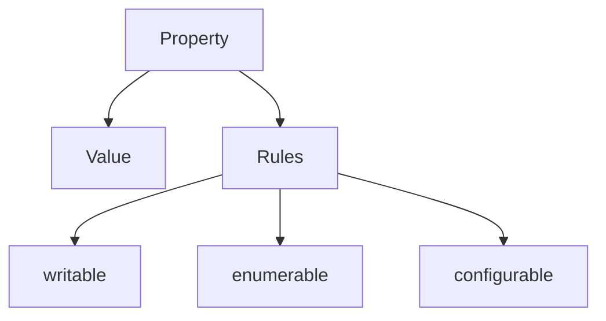

Теперь мы возвращаемся к поведение.

В главе про Object Methods мы видели, что object может хранить methods:

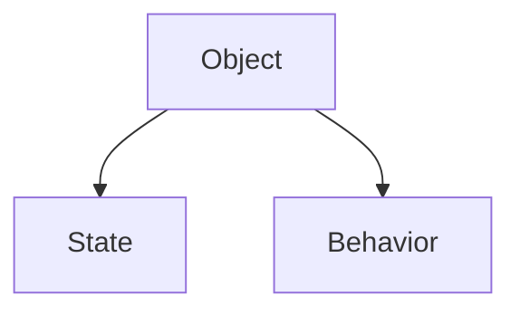

Но появляется новый вопрос:

> Если много объектов нуждаются в одинаковом поведение, должен ли каждый object хранить собственную копию method?

Представьте 1000 user objects:

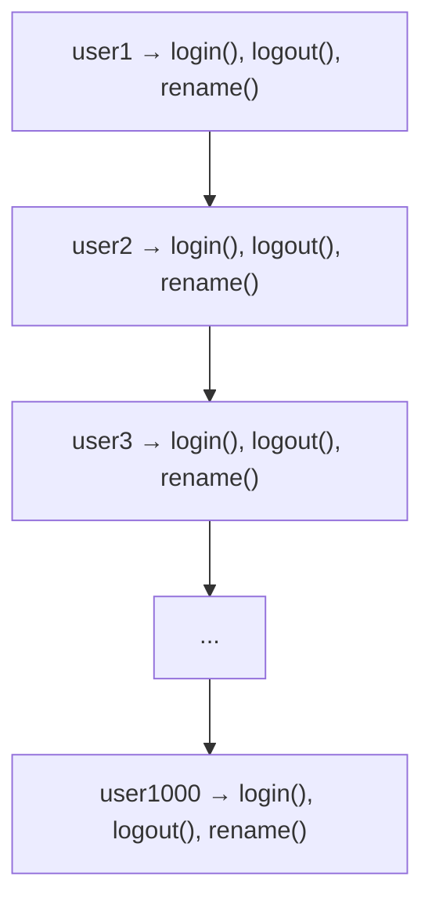

Data у каждого user своя.

Behavior одинаковый.

Prototype отвечает именно на этот вопрос:

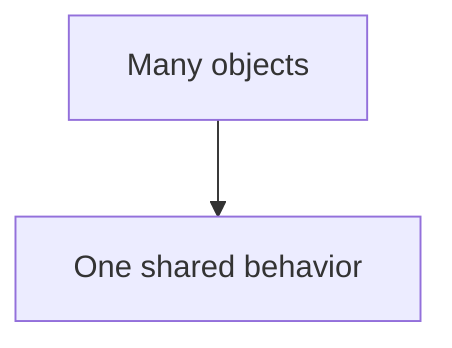

В этой главе Prototype рассматривается как практический механизм sharing поведение. Мы не будем подробно изучать Prototype Chain, `constructor.prototype`, classes, `new` или inheritance. Эти темы идут позже.

---

## Предварительные требования

Для этой главы нужно понимать:

* что object stores related data;
* что object property has key and value;
* что method is property with function object value;
* что обычный вызов `object.method()` выбирает объект выполнения из формы вызова;
* что `this` внутри обычного method call связан с объект выполнения;
* что descriptor describes own property rules;
* что `Object` содержит встроенные helper methods.

Не требуется знать Prototype Chain in depth, classes, `new`, `constructor.prototype`, `hasOwnProperty()`, `Reflect` или `__proto__` internals. `__proto__` будет упомянут только как деталь, к которой не нужно привязывать основную модель.

---

## Время изучения

Ориентировочное время:

```text
Чтение главы:            150-190 минут
Разбор схем:             70-90 минут
Запуск примеров:         25-35 минут
Практика:                130-160 минут
Повторение материала:    35 минут
```

Уровень сложности: **L4**.

Prototype кажется внутренней темой, но в этой главе он начинается с простой инженерной проблемы: repeated methods. Если много объектов хранят одинаковые function objects, код становится тяжелее читать, сложнее поддерживать и легче сломать.

---

## Навигация

Предыдущая глава:

```text
docs/01-javascript/38-object-descriptors.md
```

Текущая глава:

```text
docs/01-javascript/39-prototype.md
```

Следующая глава:

```text
docs/01-javascript/40-prototype-chain.md
```

Следующая глава ответит:

> Что происходит, если requested property не найдена ни в object, ни в его prototype?

---

## Цели обучения

После изучения этой главы вы будете понимать:

* зачем существует Prototype;
* почему duplicated methods are a problem;
* что такое prototype object на концептуальном уровне;
* чем own property отличается от inherited property;
* как JavaScript ищет property через object and prototype;
* как `Object.getPrototypeOf()` помогает увидеть prototype;
* зачем существует `Object.setPrototypeOf()` на высоком уровне;
* почему Prototype прежде всего about общее поведение;
* почему не стоит начинать изучение Prototype с inheritance;
* как Prototype связан с Page Objects, API clients and framework utilities.

---

## Мотивация

Начнем с проблемы.

Есть три user objects:

```javascript
const userAnna = {
  name: 'Anna',
  role: 'admin',
  describe() {
    return this.name + ' [' + this.role + ']';
  }
};

const userKate = {
  name: 'Kate',
  role: 'editor',
  describe() {
    return this.name + ' [' + this.role + ']';
  }
};

const userMax = {
  name: 'Max',
  role: 'viewer',
  describe() {
    return this.name + ' [' + this.role + ']';
  }
};
```

Состояние разное:

```text
Anna / admin
Kate / editor
Max  / viewer
```

Но method одинаковый:

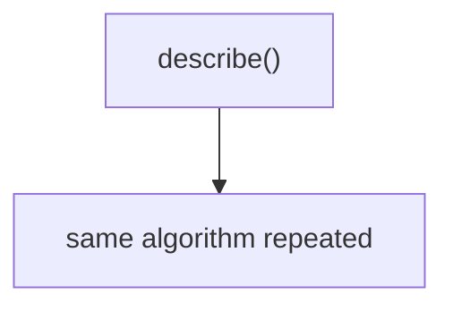

Проблема не в том, что код не работает.

Он работает.

Проблема в другом:

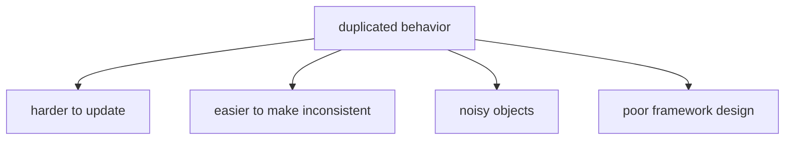

Если завтра формат описания изменится, нужно найти каждую копию:

```text
Anna.describe()
Kate.describe()
Max.describe()
...
```

Это плохая модель для framework code.

Нам нужен один shared place:

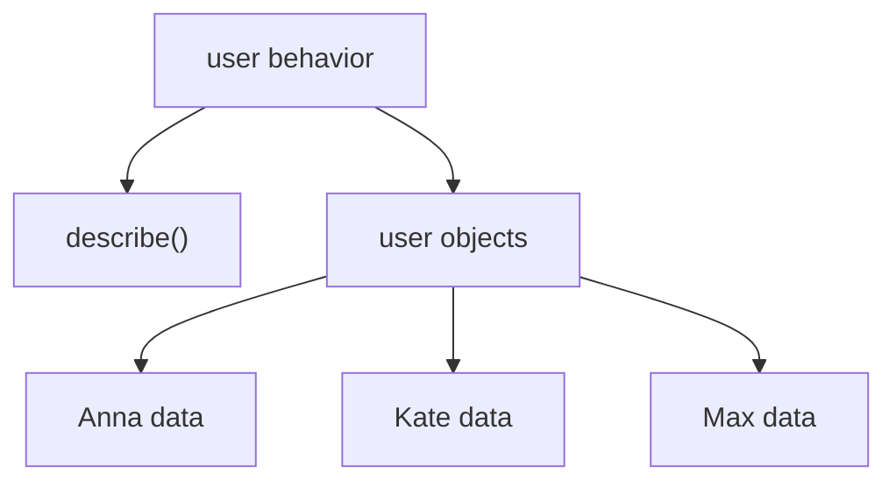

Prototype дает такой shared place.

---

## Теория

Prototype - это object, который может использоваться другим object как shared source of properties.

Главная идея:

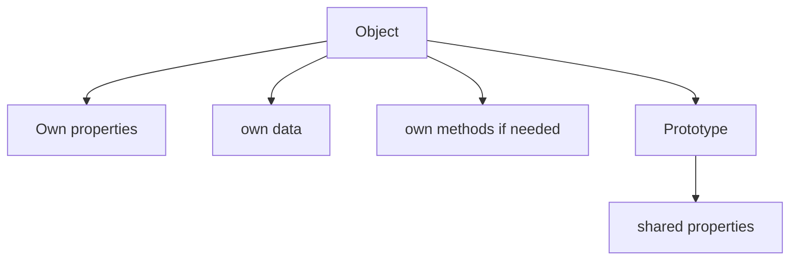

Важно:

Prototype is an object.

Не абстрактная магия.

Не отдельный тип значения.

Не synonym for class.

Так как prototype - обычный object, он может содержать любые properties:

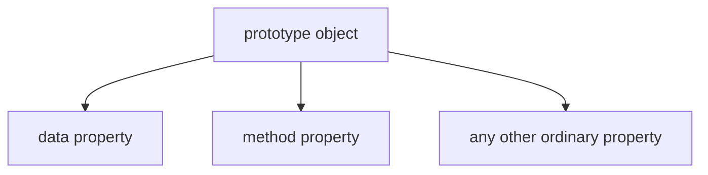

Но на практике prototype чаще всего используют именно для общее поведение.

Причина простая: data обычно отличается у каждого конкретного object, а поведение часто повторяется.

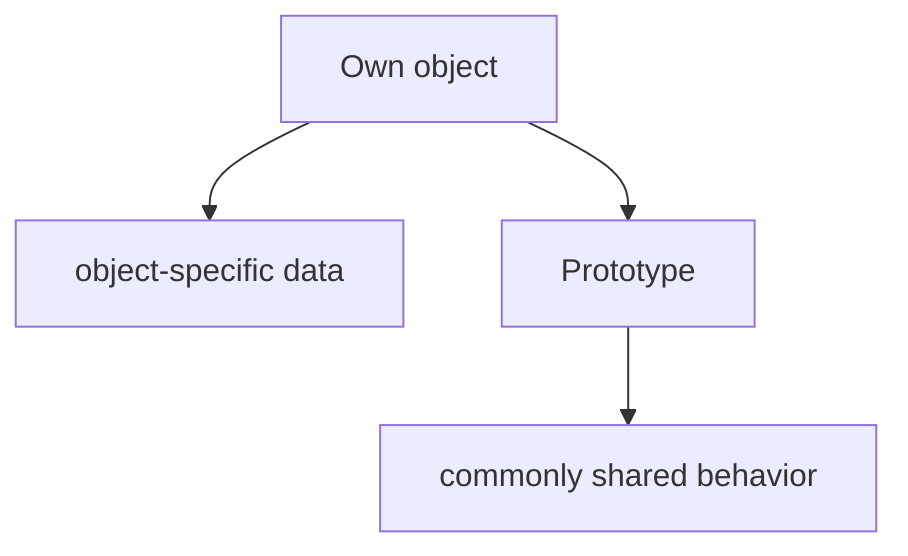

Поэтому в этой главе examples deliberately focus on methods.

Это не ограничение механизма языка.

Это наиболее частый и полезный способ его применения.

В нашем основном примере prototype содержит общее поведение:

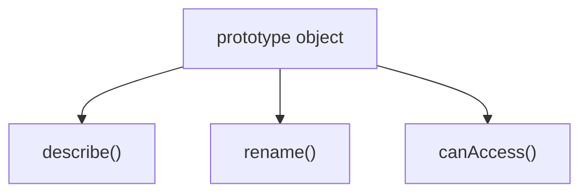

Другие objects могут быть связаны с этим prototype:

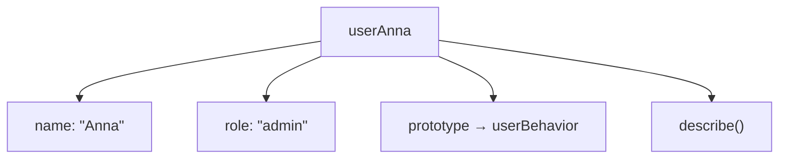

Когда JavaScript читает property, он сначала смотрит в сам object:

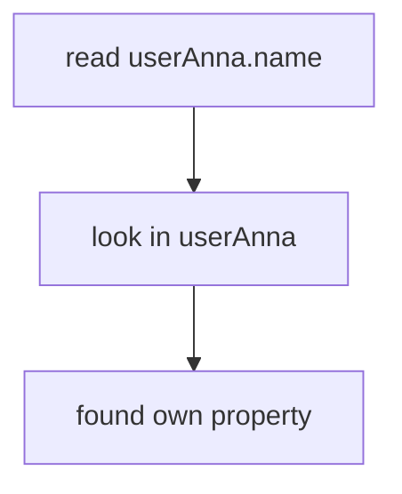

Если property не найдена, JavaScript может посмотреть в prototype:

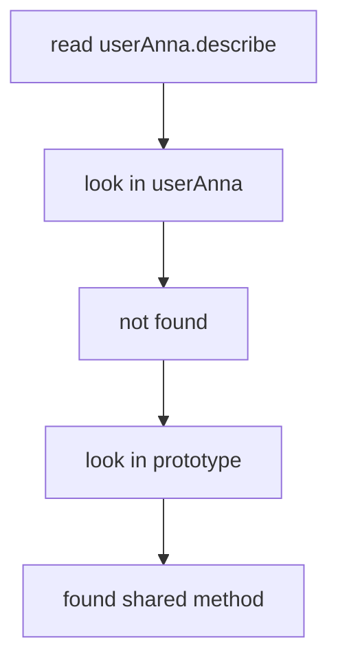

В этой главе мы ограничиваемся одним prototype level. Полный Prototype Chain будет изучаться в следующей главе.

### Own property

Own property - property, которая находится directly on object.

```javascript
const user = {
  name: 'Anna'
};
```

`name` is own property:

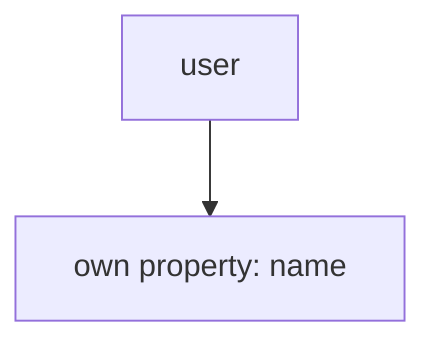

### Inherited property

Inherited property - property, которую object получает через prototype lookup.

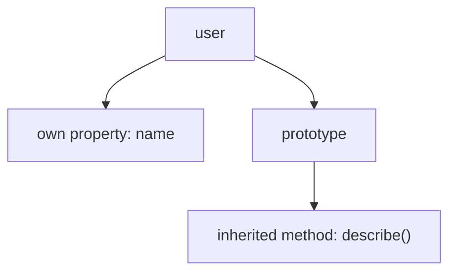

Термин "inherited" здесь означает:

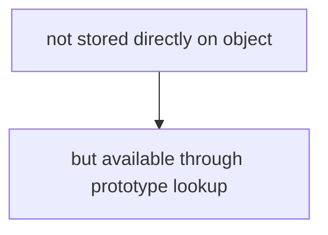

Это не значит, что мы уже изучаем inheritance как архитектурную тему. Inheritance будет обсуждаться позже вместе с Prototype Chain and Classes.

### `Object.getPrototypeOf()`

`Object.getPrototypeOf(object)` возвращает prototype object, связанный с object.

```javascript
const prototype = Object.getPrototypeOf(user);
```

Ментально:

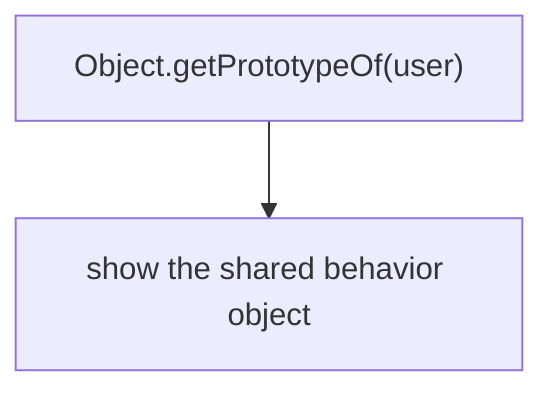

### `Object.setPrototypeOf()`

`Object.setPrototypeOf(object, prototype)` может установить prototype manually.

В этой главе мы используем его только как понятный учебный инструмент:

```javascript
Object.setPrototypeOf(user, userBehavior);
```

Ментально:

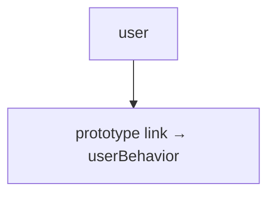

Важно: в production code `Object.setPrototypeOf()` применяют осторожно. Он меняет связь уже существующего object and can make code harder to reason about. Более устойчивые способы создания объектов с нужным prototype будут изучаться позже.

---

## Внутренний механизм

Когда engine выполняет чтение property, он не сразу говорит `undefined`.

Он проходит lookup process.

Допустим:

```javascript
console.log(user.describe());
```

Engine видит:

```text
Need property: "describe"
Target object: user
```

Дальше:

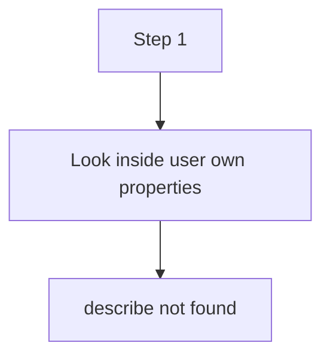

Затем:

```mermaid
flowchart TD
    N1["Step 2"]
    N2["Look inside user's prototype"]
    N3["describe found"]
    N1 --> N2
    N2 --> N3
```

После этого method вызывается как обычный method:

```mermaid
flowchart TD
    N1["user.describe()"]
    N2["function found in prototype"]
    N3["receiver is still user"]
    N1 --> N2
    N1 --> N3
```

Это важный момент.

Method может быть stored in prototype, но ordinary invocation still uses object before dot as объект выполнения:

```mermaid
flowchart TD
    N1["user.describe()"]
    N2["method location: prototype"]
    N3["receiver: user"]
    N1 --> N2
    N1 --> N3
```

Поэтому inside method:

```javascript
describe() {
  return this.name;
}
```

`this` points to `user` при обычном вызове `user.describe()`.

```mermaid
flowchart TD
    N1["shared method"]
    N2["uses this"]
    N3["reads data from actual receiver"]
    N1 --> N2
    N2 --> N3
```

Так одна function object может работать с разными objects:

```mermaid
flowchart TD
    N1["Anna object ──┐"]
    N2["uses same describe()"]
    N3["Kate object ──┘"]
    N1 --> N2
    N2 --> N3
```

### Что делает engine прямо сейчас?

Для чтения `user.describe`:

```mermaid
flowchart TD
    N1["Engine"]
    N2["receives property name: &quot;describe&quot;"]
    N3["checks own properties of user"]
    N4["does not find it"]
    N5["follows prototype link"]
    N6["checks prototype properties"]
    N7["finds function object"]
    N8["возвращает it as property value"]
    N1 --> N2
    N1 --> N3
    N1 --> N4
    N1 --> N5
    N1 --> N6
    N1 --> N7
    N1 --> N8
```

Для вызова `user.describe()`:

```mermaid
flowchart TD
    N1["Engine"]
    N2["finds function through lookup"]
    N3["sees ordinary method invocation"]
    N4["chooses user as receiver"]
    N5["создает Function Execution Context"]
    N6["выполняется shared function with this = user"]
    N1 --> N2
    N1 --> N3
    N1 --> N4
    N1 --> N5
    N1 --> N6
```

Мы пока не разбираем, что будет, если prototype itself has another prototype. Это Prototype Chain, следующая глава.

---

## Ментальная модель

Prototype удобно представить как shared toolbox.

Каждый object хранит свои данные:

```mermaid
flowchart TD
    N1["userAnna"]
    N2["name: &quot;Anna&quot;"]
    N3["role: &quot;admin&quot;"]
    N1 --> N2
    N1 --> N3
```

Но tools лежат в общей комнате:

```mermaid
flowchart TD
    N1["shared toolbox"]
    N2["describe()"]
    N3["rename()"]
    N4["canAccess()"]
    N1 --> N2
    N1 --> N3
    N1 --> N4
```

Object не копирует каждый tool внутрь себя.

Он knows where shared toolbox is:

```mermaid
flowchart TD
    N1["userAnna"]
    N2["link to shared toolbox"]
    N1 --> N2
```

Если нужен own data:

```mermaid
flowchart TD
    N1["look in userAnna"]
    N2["found name"]
    N1 --> N2
```

Если нужен общее поведение:

```mermaid
flowchart TD
    N1["look in userAnna"]
    N2["not found describe"]
    N3["look in shared toolbox"]
    N4["found describe()"]
    N1 --> N2
    N1 --> N3
    N3 --> N4
```

Другие mental models:

```mermaid
flowchart TD
    N1["library"]
    N2["many readers"]
    N3["one shared book of instructions"]
    N1 --> N2
    N1 --> N3
```

```mermaid
flowchart TD
    N1["central instruction manual"]
    N2["object A reads instruction"]
    N3["object B reads instruction"]
    N4["object C reads instruction"]
    N1 --> N2
    N1 --> N3
    N1 --> N4
```

```mermaid
flowchart TD
    N1["blueprint shelf"]
    N2["shared method A"]
    N3["shared method B"]
    N4["shared method C"]
    N1 --> N2
    N1 --> N3
    N1 --> N4
```

Главное:

```mermaid
flowchart TD
    N1["Prototype"]
    N2["place for shared behavior"]
    N1 --> N2
```

Не начинайте с мысли "Prototype is inheritance".

В этой главе точнее:

```mermaid
flowchart TD
    N1["Prototype"]
    N2["shared behavior repository"]
    N1 --> N2
```

---

## Примеры кода

Примеры находятся в:

```text
examples/01-javascript/chapter-39/
```

Запуск:

```bash
node examples/01-javascript/chapter-39/01-duplicated-methods.js
```

### Пример 1. Дублированные методы

Файл:

```text
examples/01-javascript/chapter-39/01-duplicated-methods.js
```

Идея:

```mermaid
flowchart TD
    N1["many objects"]
    N2["same method copied many times"]
    N1 --> N2
```

Такой код работает, но плохо масштабируется.

### Пример 2. Shared method через prototype

Файл:

```text
examples/01-javascript/chapter-39/02-shared-method.js
```

Идея:

```mermaid
flowchart TD
    N1["object data"]
    N2["own properties"]
    N3["shared behavior"]
    N4["prototype method"]
    N1 --> N2
    N1 --> N3
    N3 --> N4
```

### Пример 3. Property lookup

Файл:

```text
examples/01-javascript/chapter-39/03-property-lookup.js
```

Идея:

```mermaid
flowchart TD
    N1["read property"]
    N2["first: own object"]
    N3["then: prototype"]
    N1 --> N2
    N1 --> N3
```

### Пример 4. Типичные ошибки

Файл:

```text
examples/01-javascript/chapter-39/04-common-mistakes.js
```

Идея:

```mermaid
flowchart TD
    N1["shared prototype object"]
    N2["should not store per-user changing state"]
    N1 --> N2
```

### Пример 5. Page Object preview

Файл:

```text
examples/01-javascript/chapter-39/05-page-object-preview.js
```

Идея:

```mermaid
flowchart TD
    N1["Page Object instances"]
    N2["own page name"]
    N3["shared actions"]
    N1 --> N2
    N1 --> N3
```

### Пример 6. QA example

Файл:

```text
examples/01-javascript/chapter-39/06-qa-example.js
```

Идея:

```mermaid
flowchart TD
    N1["API clients"]
    N2["own baseUrl"]
    N3["shared request description behavior"]
    N1 --> N2
    N1 --> N3
```

---

## Частые вопросы

### Prototype - это то же самое, что class?

Нет.

Prototype is object used for shared property lookup.

Class будет изучаться позже как синтаксис и модель создания objects. Не нужно смешивать эти темы сейчас.

### Prototype - это hidden object?

Prototype не виден как обычная own property, но его можно получить через `Object.getPrototypeOf()`.

```mermaid
flowchart TD
    N1["объект"]
    N2["prototype link"]
    N1 --> N2
```

Главная мысль: prototype is connected to object, but not stored as ordinary data property like `name`.

### В prototype могут быть только методы?

Нет.

Prototype - обычный object, поэтому он может содержать любые properties.

```mermaid
flowchart TD
    N1["Prototype"]
    N2["data property"]
    N3["method property"]
    N1 --> N2
    N1 --> N3
```

Но practical convention usually differs:

```mermaid
flowchart TD
    N1["объект"]
    N2["own data"]
    N3["prototype"]
    N4["shared behavior"]
    N1 --> N2
    N1 --> N3
    N3 --> N4
```

В этой главе акцент сделан на methods, потому что именно общее поведение чаще всего объясняет, зачем Prototype нужен в реальном коде.

### Нужно ли использовать `__proto__`?

В этой главе нет.

`__proto__` часто встречается в статьях и DevTools, но для учебной модели достаточно `Object.getPrototypeOf()` and `Object.setPrototypeOf()`. Детали `__proto__` будут обсуждаться позже.

### Prototype нужен только для экономии памяти?

Нет.

Memory intuition полезна:

```mermaid
flowchart TD
    N1["one shared function"]
    N2["instead of many copied functions"]
    N1 --> N2
```

Но главная польза шире:

* меньше дублирования;
* единое место для поведение;
* более читаемая архитектура;
* проще обновлять shared logic.

### Если method находится в prototype, чей `this` внутри method?

При обычном вызове:

```javascript
user.describe();
```

объект выполнения is `user`.

```mermaid
flowchart TD
    N1["method found in prototype"]
    N2["but"]
    N3["receiver is user"]
    N1 --> N2
    N2 --> N3
```

Другие формы вызова уже изучались в главах про `call()`, `apply()` and `bind()`.

---

## Распространенные мифы

### Миф: Prototype - это про classes

Реальность: Prototype exists independently of classes.

В этой главе Prototype is about sharing поведение between objects.

### Миф: inherited property copied into object

Реальность: property is not copied during lookup.

```mermaid
flowchart TD
    N1["объект"]
    N2["значение отсутствует property"]
    N3["prototype"]
    N4["property found there"]
    N1 --> N2
    N1 --> N3
    N3 --> N4
```

### Миф: Prototype should store all data

Реальность: prototype is good for общее поведение. Per-object changing состояние should usually remain own data.

```mermaid
flowchart TD
    N1["own object"]
    N2["user-specific state"]
    N3["prototype"]
    N4["shared behavior"]
    N1 --> N2
    N1 --> N3
    N3 --> N4
```

### Миф: Prototype Chain нужно знать сразу

Реальность: сначала нужно понять one object + one prototype. Chain is the next layer.

---

## Типичные ошибки

### Ошибка 1. Хранить per-object состояние в prototype

Неправильный код:

```javascript
const userBehavior = {
  lastLogin: null,
  login() {
    this.lastLogin = '2026-06-26';
  }
};
```

Что произошло:

```mermaid
flowchart TD
    N1["lastLogin looks like user-specific state"]
    N2["but placed in shared behavior object"]
    N1 --> N2
```

Почему это опасно:

* читатель кода ожидает shared methods in prototype;
* Изменение состояния в общем объекте может запутать принадлежность;
* framework objects become harder to debug.

Исправленный вариант:

```javascript
const user = {
  name: 'Anna',
  lastLogin: null
};
```

```mermaid
flowchart TD
    N1["user-specific data"]
    N2["own property"]
    N1 --> N2
```

### Ошибка 2. Думать, что inherited property стала own property

Неправильная модель:

```mermaid
flowchart TD
    N1["user.describe()"]
    N2["describe copied into user"]
    N1 --> N2
```

Что происходит на самом деле:

```mermaid
flowchart TD
    N1["user"]
    N2["нет own describe"]
    N3["prototype"]
    N4["describe found"]
    N1 --> N2
    N1 --> N3
    N3 --> N4
```

Исправленная модель:

```mermaid
flowchart TD
    N1["lookup"]
    N2["≠"]
    N3["copy"]
    N1 --> N2
    N2 --> N3
```

### Ошибка 3. Начинать изучение Prototype с `__proto__`

Неправильный подход:

```mermaid
flowchart TD
    N1["Prototype"]
    N2["start with __proto__"]
    N1 --> N2
```

Почему это мешает:

* внимание уходит в деталь доступа;
* теряется главная проблема duplicated поведение;
* сложнее понять, зачем механизм существует.

Исправленный подход:

```mermaid
flowchart TD
    N1["duplicated methods"]
    N2["shared behavior"]
    N3["prototype object"]
    N1 --> N2
    N2 --> N3
```

### Ошибка 4. Путать объект выполнения and method location

Неправильная модель:

```mermaid
flowchart TD
    N1["method stored in prototype"]
    N2["this is prototype"]
    N1 --> N2
```

Правильная модель для ordinary invocation:

```mermaid
flowchart TD
    N1["user.describe()"]
    N2["method found in prototype"]
    N3["receiver is user"]
    N1 --> N2
    N1 --> N3
```

---

## Практическое использование

Prototype полезен, когда:

```mermaid
flowchart TD
    N1["many objects"]
    N2["different data"]
    N3["same behavior"]
    N1 --> N2
    N1 --> N3
```

Типичные случаи:

* common object поведение;
* framework utilities;
* shared validators;
* objects created from same pattern;
* internal architecture of many JavaScript features.

Пример без prototype:

```mermaid
flowchart TD
    N1["clientA"]
    N2["baseUrl"]
    N3["describeRequest()"]
    N4["clientB"]
    N5["baseUrl"]
    N6["describeRequest()"]
    N1 --> N2
    N1 --> N3
    N1 --> N4
    N4 --> N5
    N4 --> N6
```

Пример with общее поведение:

```mermaid
flowchart TD
    N1["clientA ──┐"]
    N2["prototype → apiClientBehavior"]
    N3["clientB ──┘ └── describeRequest()"]
    N1 --> N3
    N1 --> N2
```

Это улучшает maintainability:

```mermaid
flowchart TD
    N1["change shared method once"]
    N2["all linked objects use updated behavior"]
    N1 --> N2
```

Но Prototype не нужно применять везде.

Если object один и поведение уникален, own method может быть читаемее.

```mermaid
flowchart TD
    N1["one object"]
    N2["unique behavior"]
    N3["own method is fine"]
    N1 --> N2
    N1 --> N3
```

---

## Использование в Automation QA

В Automation QA Prototype важен не как академическая тема, а как база для понимания framework architecture.

### Page Objects

Page Objects часто имеют:

```mermaid
flowchart TD
    N1["LoginPage"]
    N2["own data"]
    N3["page"]
    N4["locators"]
    N5["shared behavior"]
    N6["open()"]
    N7["login()"]
    N8["assertLoaded()"]
    N1 --> N2
    N1 --> N3
    N1 --> N4
    N1 --> N5
    N5 --> N6
    N5 --> N7
    N5 --> N8
```

Пока мы не изучаем classes, но idea уже видна:

```mermaid
flowchart TD
    N1["many page objects"]
    N2["shared page behavior"]
    N1 --> N2
```

### API clients

API clients часто различаются состояние:

```text
stagingClient.baseUrl
productionClient.baseUrl
localClient.baseUrl
```

Но поведение одинаковый:

```text
buildUrl()
describeRequest()
validateStatus()
```

Prototype помогает понять, почему поведение can live in shared place:

```mermaid
flowchart TD
    N1["API client objects"]
    N2["own configuration"]
    N3["shared request behavior"]
    N1 --> N2
    N1 --> N3
```

### Assertion helpers

Shared validators:

```text
statusValidator
schemaValidator
businessValidator
```

могут использовать common поведение:

```mermaid
flowchart TD
    N1["shared assertion behavior"]
    N2["formatError()"]
    N3["describeExpected()"]
    N4["describeActual()"]
    N1 --> N2
    N1 --> N3
    N1 --> N4
```

### Framework utilities

В framework code важно отделять:

```mermaid
flowchart TD
    N1["per-test state"]
    N2["own properties"]
    N3["shared utility behavior"]
    N4["prototype or shared object"]
    N1 --> N2
    N1 --> N3
    N3 --> N4
```

Это помогает избегать случайного shared mutable состояние.

---

## Диаграммы главы

### 1. Why Prototype exists

```mermaid
flowchart TD
    N1["Many objects"]
    N2["same method A"]
    N3["same method A"]
    N4["same method A"]
    N5["same method A"]
    N6["Need shared behavior"]
    N1 --> N2
    N1 --> N3
    N1 --> N4
    N1 --> N5
    N1 --> N6
```

### 2. Duplicated methods

```mermaid
flowchart TD
    N1["userAnna"]
    N2["describe()"]
    N3["userKate"]
    N4["describe()"]
    N5["userMax"]
    N6["describe()"]
    N1 --> N2
    N1 --> N3
    N3 --> N4
    N3 --> N5
    N5 --> N6
```

### 3. Shared methods

```mermaid
flowchart TD
    N1["userAnna ──┐"]
    N2["userKate ──┼ → userBehavior"]
    N3["userMax ──┘ └── describe()"]
    N2 --> N3
    N1 --> N2
```

### 4. Object before prototype

```mermaid
flowchart TD
    N1["user"]
    N2["name"]
    N3["role"]
    N4["describe()"]
    N1 --> N2
    N1 --> N3
    N1 --> N4
```

### 5. Object after prototype

```mermaid
flowchart TD
    N1["user"]
    N2["name"]
    N3["role"]
    N4["prototype → behavior"]
    N5["describe()"]
    N1 --> N2
    N1 --> N3
    N1 --> N4
    N4 --> N5
```

### 6. Prototype object

```mermaid
flowchart TD
    N1["prototype object"]
    N2["shared method"]
    N3["shared method"]
    N4["shared method"]
    N1 --> N2
    N1 --> N3
    N1 --> N4
```

### 7. Own properties

```mermaid
flowchart TD
    N1["user"]
    N2["own: name"]
    N3["own: role"]
    N1 --> N2
    N1 --> N3
```

### 8. Shared поведение

```mermaid
flowchart TD
    N1["behavior"]
    N2["describe()"]
    N3["rename()"]
    N4["canAccess()"]
    N1 --> N2
    N1 --> N3
    N1 --> N4
```

### 9. Property lookup

```mermaid
flowchart TD
    N1["read user.describe"]
    N2["user own properties"]
    N3["not found"]
    N4["prototype"]
    N5["found"]
    N1 --> N2
    N1 --> N3
    N1 --> N4
    N4 --> N5
```

### 10. Текущая модель JavaScript

```mermaid
flowchart TD
    N1["Object model"]
    N2["properties"]
    N3["descriptors"]
    N4["methods"]
    N5["prototype"]
    N6["shared behavior"]
    N1 --> N2
    N1 --> N3
    N1 --> N4
    N1 --> N5
    N5 --> N6
```

### 11. QA Page Objects

```mermaid
flowchart TD
    N1["LoginPage ──┐"]
    N2["ProfilePage ┼ → pageBehavior"]
    N3["OrdersPage ─┘ ├── open()"]
    N4["assertLoaded()"]
    N2 --> N3
    N1 --> N2
    N3 --> N4
```

### 12. API client sharing

```mermaid
flowchart TD
    N1["stagingClient ─────┐"]
    N2["productionClient ──┼ → apiClientBehavior"]
    N3["localClient ───────┘ └── describeRequest()"]
    N2 --> N3
    N1 --> N2
```

### 13. Читаемость

```mermaid
flowchart TD
    N1["объект"]
    N2["business data"]
    N3["link to shared behavior"]
    N1 --> N2
    N1 --> N3
```

### 14. Типичные ошибки

```mermaid
flowchart TD
    N1["prototype"]
    N2["shared method OK"]
    N3["user-specific state risky"]
    N1 --> N2
    N1 --> N3
```

### 15. Property search

```mermaid
flowchart TD
    N1["property name"]
    N2["объект"]
    N3["prototype"]
    N1 --> N2
    N2 --> N3
```

### 16. Missing property

```mermaid
flowchart TD
    N1["объект"]
    N2["not found"]
    N3["prototype"]
    N4["not found"]
    N5["undefined"]
    N1 --> N2
    N1 --> N3
    N3 --> N4
    N3 --> N5
```

### 17. Prototype lookup

```mermaid
flowchart TD
    N1["lookup"]
    N2["own first"]
    N3["prototype second"]
    N1 --> N2
    N1 --> N3
```

### 18. Memory intuition

```mermaid
flowchart TD
    N1["Without prototype"]
    N2["many copies of same behavior"]
    N3["With prototype"]
    N4["one shared function"]
    N1 --> N2
    N1 --> N3
    N3 --> N4
```

### 19. Shared function

```mermaid
flowchart TD
    N1["describe()"]
    N2["used by userAnna"]
    N3["used by userKate"]
    N4["used by userMax"]
    N1 --> N2
    N1 --> N3
    N1 --> N4
```

### 20. Object relationship

```mermaid
flowchart TD
    N1["объект"]
    N2["has prototype link"]
    N3["prototype object"]
    N1 --> N2
    N1 --> N3
```

### 21. Method location

```mermaid
flowchart TD
    N1["user.describe()"]
    N2["location: prototype"]
    N3["receiver: user"]
    N1 --> N2
    N1 --> N3
```

### 22. Object evolution

```mermaid
flowchart TD
    N1["separate data"]
    N2["object with own methods"]
    N3["object with shared prototype behavior"]
    N1 --> N2
    N2 --> N3
```

### 23. Prototype object again

```mermaid
flowchart TD
    N1["Prototype"]
    N2["ordinary object used as shared source"]
    N1 --> N2
```

### 24. Shared repository

```mermaid
flowchart TD
    N1["behavior repository"]
    N2["method A"]
    N3["method B"]
    N4["method C"]
    N1 --> N2
    N1 --> N3
    N1 --> N4
```

### 25. Переход к Prototype Chain

```mermaid
flowchart TD
    N1["объект"]
    N2["prototype"]
    N3["next question:"]
    N4["what if not found here?"]
    N1 --> N2
    N2 --> N3
    N2 --> N4
```

### 26. Переход к Classes

```mermaid
flowchart TD
    N1["Prototype understanding"]
    N2["Classes later become easier"]
    N1 --> N2
```

### 27. Краткая ментальная модель

```mermaid
flowchart TD
    N1["Object"]
    N2["own data"]
    N3["shared toolbox"]
    N1 --> N2
    N1 --> N3
```

### 28. Complete prototype model

```mermaid
flowchart TD
    N1["Object"]
    N2["own properties"]
    N3["prototype link"]
    N4["Prototype object"]
    N5["shared behavior"]
    N1 --> N2
    N1 --> N3
    N1 --> N4
    N4 --> N5
```

### 29. Lookup timeline

```mermaid
flowchart TD
    N1["read property"]
    N2["check object"]
    N3["check prototype"]
    N4["возвращаемое значение or undefined"]
    N1 --> N2
    N1 --> N3
    N1 --> N4
```

### 30. Принадлежность свойства

```mermaid
flowchart TD
    N1["own property"]
    N2["stored on object"]
    N3["inherited property"]
    N4["found through prototype"]
    N1 --> N2
    N1 --> N3
    N3 --> N4
```

### 31. Shared состояние warning

```mermaid
flowchart TD
    N1["prototype"]
    N2["shared place"]
    N3["avoid per-object changing state here"]
    N1 --> N2
    N1 --> N3
```

### 32. Function reuse

```mermaid
flowchart TD
    N1["one function object"]
    N2["receiver A"]
    N3["receiver B"]
    N4["receiver C"]
    N1 --> N2
    N1 --> N3
    N1 --> N4
```

### 33. Object vs prototype

```mermaid
flowchart TD
    N1["объект"]
    N2["specific data"]
    N3["prototype"]
    N4["shared behavior"]
    N1 --> N2
    N1 --> N3
    N3 --> N4
```

### 34. Shared поведение flow

```mermaid
flowchart TD
    N1["вызвать method"]
    N2["lookup finds prototype method"]
    N3["выполнить with actual receiver"]
    N1 --> N2
    N2 --> N3
```

### 35. Library analogy

```mermaid
flowchart TD
    N1["many readers"]
    N2["one library book"]
    N1 --> N2
```

### 36. Итоговая схема

```mermaid
flowchart TD
    N1["Object"]
    N2["Own data"]
    N3["Own methods if needed"]
    N4["значение отсутствует property?"]
    N5["Look in Prototype"]
    N1 --> N2
    N1 --> N3
    N1 --> N4
    N1 --> N5
```

## Итоги

Prototype появляется не из желания усложнить JavaScript.

Он решает конкретную проблему:

```mermaid
flowchart TD
    N1["many objects"]
    N2["same behavior"]
    N1 --> N2
```

Без Prototype одинаковые methods приходится хранить directly inside every object. Это создает duplication and maintenance cost.

Prototype дает shared object, в котором может жить common поведение:

```mermaid
flowchart TD
    N1["объект"]
    N2["own data"]
    N3["prototype"]
    N4["shared properties"]
    N1 --> N2
    N1 --> N3
    N3 --> N4
```

Когда JavaScript читает property, он сначала проверяет own properties. Если property не найдена, engine смотрит в prototype.

Prototype can contain any properties because it is an ordinary object.

В practical code его чаще всего используют for shared methods, because methods are the поведение that many objects can reuse safely.

Главная модель главы:

```mermaid
flowchart TD
    N1["Object"]
    N2["Own data"]
    N3["Own methods if needed"]
    N4["значение отсутствует property?"]
    N5["Look in Prototype"]
    N1 --> N2
    N1 --> N3
    N1 --> N4
    N1 --> N5
```

Следующая глава расширит эту модель:

```mermaid
flowchart TD
    N1["Object"]
    N2["Prototype"]
    N3["Prototype of prototype"]
    N4["..."]
    N1 --> N2
    N2 --> N3
    N3 --> N4
```

Это будет Prototype Chain.

---

## Что нужно запомнить

✓ Prototype is an object used as shared source of properties.

✓ Prototype может содержать любые properties, но в этой главе главный practical focus - shared methods.

✓ Own property находится directly on object.

✓ Inherited property находится through prototype lookup.

✓ Lookup сначала проверяет object, затем prototype.

✓ Method can be found in prototype, while объект выполнения can still be original object.

✓ Prototype не копирует method into every object.

✓ Per-object состояние should usually remain own property.

✓ `Object.getPrototypeOf()` показывает prototype object.

✓ Prototype Chain будет изучаться в следующей главе.

---

## Проверьте себя

1. Why is duplicated поведение a problem?

2. What kind of value is a prototype?

3. Чем own property отличается от inherited property?

4. Where does JavaScript look first during property lookup?

5. What happens if property is not found on object?

6. Why is Prototype about sharing поведение, not primarily inheritance?

7. If method is found in prototype during `user.describe()`, what is the объект выполнения?

8. Why should per-object состояние usually not live in prototype?

9. What does `Object.getPrototypeOf()` return?

10. What question will Prototype Chain answer?

---

## Практика

Практические задания находятся в отдельном файле:

```text
practice/01-javascript/39-prototype.md
```

Выполняйте их после чтения главы и запуска examples.

---

## Решения

Решения находятся в отдельном файле:

```text
solutions/01-javascript/39-prototype.md
```

Сначала выполните задания самостоятельно. Затем сравните не только answer, но и reasoning.
