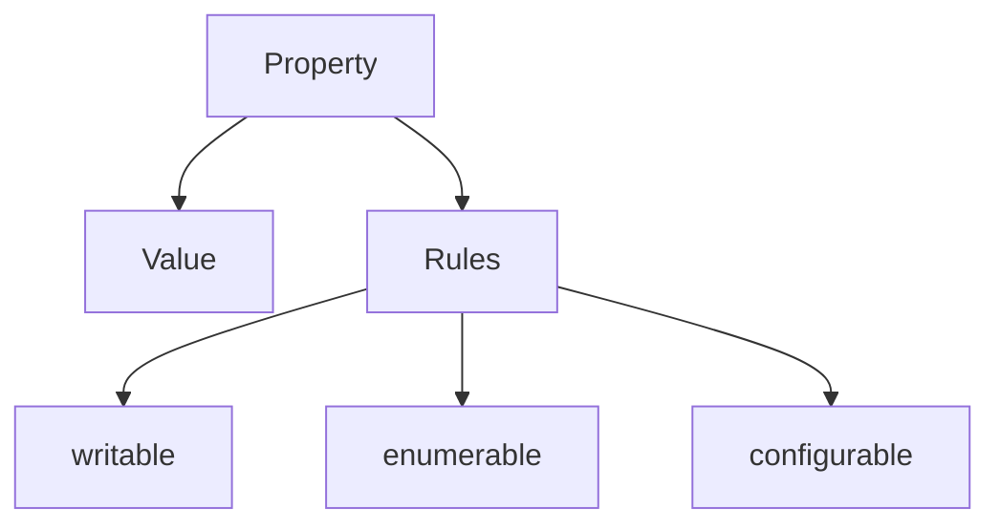
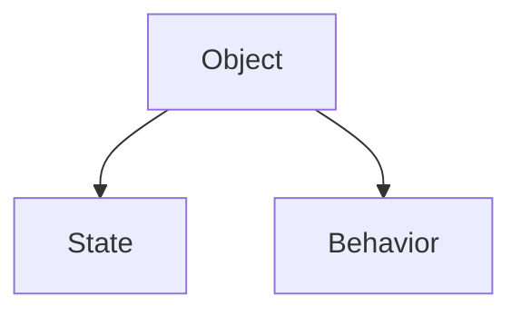
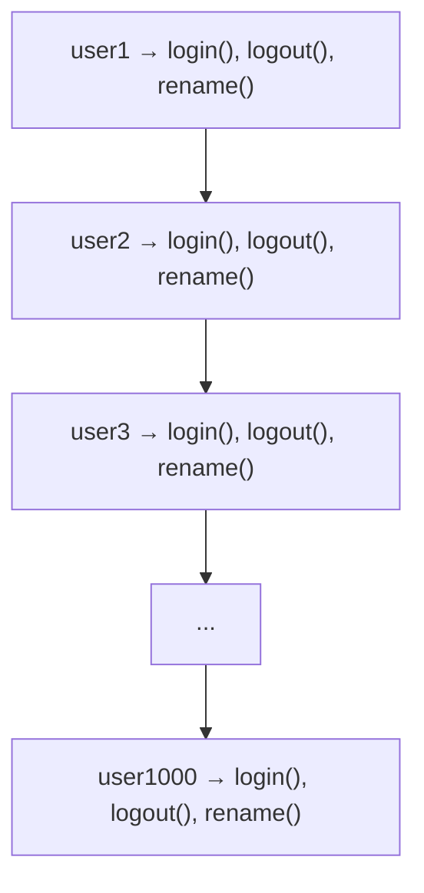
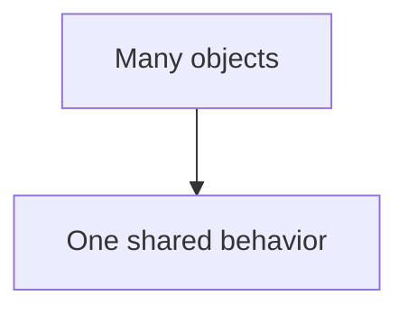
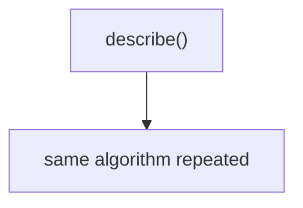
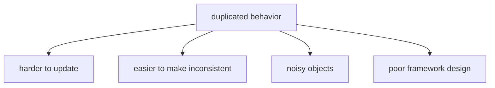
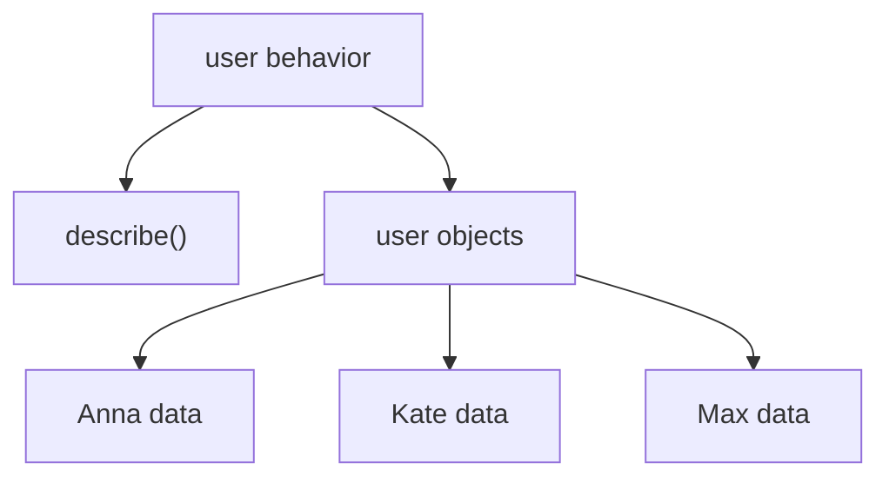
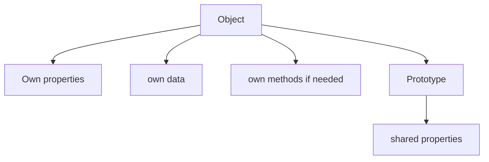

# Прототип

## Связь с предыдущей главой

Предыдущая глава объяснила Object Descriptors.

Главная модель была такой:


```mermaid
flowchart TD
    N1["Property"]
    N2["Value"]
    N3["Rules"]
    N4["writable"]
    N5["enumerable"]
    N6["configurable"]
    N1 --> N2
    N1 --> N3
    N3 --> N4
    N3 --> N5
    N3 --> N6
```

Теперь мы возвращаемся к поведение.

В главе про Object Methods мы видели, что object может хранить methods:


```mermaid
flowchart TD
    N1["Object"]
    N2["State"]
    N3["Behavior"]
    N1 --> N2
    N1 --> N3
```

Но появляется новый вопрос:

> Если много объектов нуждаются в одинаковом поведение, должен ли каждый object хранить собственную копию method?

Представьте 1000 user objects:


```mermaid
flowchart TD
    N1["user1 → login(), logout(), rename()"]
    N2["user2 → login(), logout(), rename()"]
    N3["user3 → login(), logout(), rename()"]
    N4["..."]
    N5["user1000 → login(), logout(), rename()"]
    N1 --> N2
    N2 --> N3
    N3 --> N4
    N4 --> N5
```

Data у каждого user своя.

Behavior одинаковый.

Prototype отвечает именно на этот вопрос:


```mermaid
flowchart TD
    N1["Many objects"]
    N2["One shared behavior"]
    N1 --> N2
```

В этой главе Prototype рассматривается как практический механизм sharing поведение. Мы не будем подробно изучать Prototype Chain, `constructor.prototype`, classes, `new` или inheritance. Эти темы идут позже.

---

## Предварительные требования

Для этой главы нужно понимать:

* что object stores related data;
* что object property has key and value;
* что method is property with function object value;
* что обычный вызов `object.method()` выбирает объект выполнения из формы вызова;
* что `this` внутри обычного method call связан с объект выполнения;
* что descriptor describes own property rules;
* что `Object` содержит встроенные helper methods.

Не требуется знать Prototype Chain in depth, classes, `new`, `constructor.prototype`, `hasOwnProperty()`, `Reflect` или `__proto__` internals. `__proto__` будет упомянут только как деталь, к которой не нужно привязывать основную модель.

---

## Время изучения

Ориентировочное время:

```text
Чтение главы:            150-190 минут
Разбор схем:             70-90 минут
Запуск примеров:         25-35 минут
Практика:                130-160 минут
Повторение материала:    35 минут
```

Уровень сложности: **L4**.

Prototype кажется внутренней темой, но в этой главе он начинается с простой инженерной проблемы: repeated methods. Если много объектов хранят одинаковые function objects, код становится тяжелее читать, сложнее поддерживать и легче сломать.

---

## Навигация

Предыдущая глава:

```text
docs/01-javascript/38-object-descriptors.md
```

Текущая глава:

```text
docs/01-javascript/39-prototype.md
```

Следующая глава:

```text
docs/01-javascript/40-prototype-chain.md
```

Следующая глава ответит:

> Что происходит, если requested property не найдена ни в object, ни в его prototype?

---

## Цели обучения

После изучения этой главы вы будете понимать:

* зачем существует Prototype;
* почему duplicated methods are a problem;
* что такое prototype object на концептуальном уровне;
* чем own property отличается от inherited property;
* как JavaScript ищет property через object and prototype;
* как `Object.getPrototypeOf()` помогает увидеть prototype;
* зачем существует `Object.setPrototypeOf()` на высоком уровне;
* почему Prototype прежде всего about общее поведение;
* почему не стоит начинать изучение Prototype с inheritance;
* как Prototype связан с Page Objects, API clients and framework utilities.

---

## Мотивация

Начнем с проблемы.

Есть три user objects:

```javascript
const userAnna = {
  name: 'Anna',
  role: 'admin',
  describe() {
    return this.name + ' [' + this.role + ']';
  }
};

const userKate = {
  name: 'Kate',
  role: 'editor',
  describe() {
    return this.name + ' [' + this.role + ']';
  }
};

const userMax = {
  name: 'Max',
  role: 'viewer',
  describe() {
    return this.name + ' [' + this.role + ']';
  }
};
```

Состояние разное:

```text
Anna / admin
Kate / editor
Max  / viewer
```

Но method одинаковый:


```mermaid
flowchart TD
    N1["describe()"]
    N2["same algorithm repeated"]
    N1 --> N2
```

Проблема не в том, что код не работает.

Он работает.

Проблема в другом:


```mermaid
flowchart TD
    N1["duplicated behavior"]
    N2["harder to update"]
    N3["easier to make inconsistent"]
    N4["noisy objects"]
    N5["poor framework design"]
    N1 --> N2
    N1 --> N3
    N1 --> N4
    N1 --> N5
```

Если завтра формат описания изменится, нужно найти каждую копию:

```text
Anna.describe()
Kate.describe()
Max.describe()
...
```

Это плохая модель для framework code.

Нам нужен один shared place:


```mermaid
flowchart TD
    N1["user behavior"]
    N2["describe()"]
    N3["user objects"]
    N4["Anna data"]
    N5["Kate data"]
    N6["Max data"]
    N1 --> N2
    N1 --> N3
    N3 --> N4
    N3 --> N5
    N3 --> N6
```

Prototype дает такой shared place.

---

## Теория

Прототип — это объект, который другой объект может использовать как общий источник свойств.

Главная идея:


```mermaid
flowchart TD
    N1["Object"]
    N2["Own properties"]
    N3["own data"]
    N4["own methods if needed"]
    N5["Prototype"]
    N6["shared properties"]
    N1 --> N2
    N1 --> N3
    N1 --> N4
    N1 --> N5
    N5 --> N6
```

Важно:

Прототип — это объект.

Не абстрактная магия.

Не отдельный тип значения.

Не синоним класса.

Так как прототип — обычный объект, он может содержать любые свойства:

Но на практике прототип чаще всего используют именно для общего поведения.

Причина простая: данные обычно отличаются у каждого конкретного объекта, а поведение часто повторяется.

Поэтому в этой главе примеры намеренно сосредоточены на методах.

Это не ограничение механизма языка.

Это наиболее частый и полезный способ его применения.

В нашем основном примере прототип содержит общее поведение:

```text
объект            →  собственные данные
его prototype     →  общее поведение
```

Другие объекты могут быть связаны с этим же прототипом — и тогда поведение у них
общее, а данные свои:

```text
adminUser  ──┐
editorUser ──┼──→  userBehavior  (общий прототип)
viewerUser ──┘
```

Чтение свойства идёт в два шага:

```text
1. есть ли такое свойство в САМОМ объекте?   → да: вернуть его
2. нет → посмотреть в прототипе              → да: вернуть его
                                             → нет: undefined
```

В этой главе мы ограничиваемся одним уровнем прототипа. Полная цепочка будет изучаться в следующей главе.

### Собственное свойство

Собственное свойство — то, которое находится прямо в объекте.

```javascript
const user = {
  name: 'Anna'
};
```

`name` — собственное свойство:

```text
свойство записано в самом объекте user,
и для его чтения никуда идти не нужно
```

### Унаследованное свойство

Унаследованное свойство — то, которое объект получает через поиск в прототипе.

Слово «унаследованное» здесь означает:

```text
свойства нет в самом объекте,
но оно найдено в связанном с ним prototype
```

Это не значит, что мы уже изучаем наследование как архитектурную тему. Оно будет обсуждаться позже, вместе с цепочкой прототипов и классами.

### `Object.getPrototypeOf()`

`Object.getPrototypeOf(object)` возвращает прототип, связанный с объектом.

```javascript
const prototype = Object.getPrototypeOf(user);
```

Ментально:

```text
user  ──→ prototype: userBehavior
```

Функция отвечает на вопрос «куда объект пойдёт, если своего свойства не
нашлось».

### `Object.setPrototypeOf()`

`Object.setPrototypeOf(object, prototype)` может установить прототип вручную.

В этой главе мы используем его только как понятный учебный инструмент:

```javascript
Object.setPrototypeOf(user, userBehavior);
```

Ментально:

Важно: в рабочем коде `Object.setPrototypeOf()` применяют осторожно. Он меняет связь уже существующего объекта и усложняет рассуждение о коде. Более устойчивые способы создания объектов с нужным прототипом будут изучаться позже.

---

## Внутренний механизм

Когда движок читает свойство, он не сразу говорит `undefined`.

Он выполняет поиск.

Допустим:

```javascript
console.log(user.describe());
```

Движок делает так:

```text
нужно свойство: "describe"
объект:         user
```

Дальше движок проверяет собственные свойства `user` — там только данные
(`name`), метода нет.

Затем он переходит к прототипу `user` и находит `describe` там.

После этого метод вызывается как обычный — и здесь важный момент: объектом
выполнения становится **то, что стоит слева от точки**, а не объект, в котором
метод был найден.

```text
user.describe()
└──┘              this === user
       └──────┘   функция взята из прототипа
```

Поэтому внутри метода:

```javascript
describe() {
  return this.name;
}
```

`this` указывает на `user` при обычном вызове `user.describe()`.

Так один объект функции может работать с разными объектами:

```javascript
adminUser.describe();   // this — adminUser
editorUser.describe();  // this — editorUser
```

Метод лежит в одном месте, а состояние берётся из того объекта, через который
метод вызвали.

### Что движок делает прямо сейчас?

Для чтения `user.describe`:

```text
собственные свойства user → нет
прототип user             → есть  →  вернуть функцию
```

Для вызова `user.describe()`:

```text
найти функцию (как выше)
создать контекст выполнения, this = user
выполнить тело
```

Мы пока не разбираем, что будет, если у самого прототипа есть свой прототип. Это цепочка прототипов, следующая глава.

---

## Ментальная модель

Прототип удобно представить как общий ящик с инструментами.

```text
adminUser   │ name: 'admin'      ← свои данные
editorUser  │ name: 'editor'     ← свои данные
            │
общий ящик  │ describe(), login()  ← общее поведение
```

Объект не копирует каждый инструмент внутрь себя — он знает, где лежит общий
ящик, и берёт инструмент оттуда в момент обращения.

Правило чтения такого кода:

| Что нужно | Где искать |
| --- | --- |
| свои данные объекта | в самом объекте |
| общее поведение | в прототипе |
| кто станет `this` | слева от точки в вызове |

Не начинайте с мысли «прототип — это наследование».

В этой главе точнее: прототип — это **другой объект, к которому обращаются,
если свойство не нашлось в текущем**. Никакого копирования при этом не
происходит, и отношения «родитель — потомок» в классическом смысле здесь тоже
нет: есть ссылка и поиск по ней.

---

## Примеры кода

Примеры находятся в:

```text
examples/01-javascript/chapter-39/
```

Запуск:

```bash
node examples/01-javascript/chapter-39/01-duplicated-methods.js
```

### Пример 1. Дублированные методы

Файл:

```text
examples/01-javascript/chapter-39/01-duplicated-methods.js
```

Идея:

Такой код работает, но плохо масштабируется.

### Пример 2. Общий метод через прототип

Файл:

```text
examples/01-javascript/chapter-39/02-shared-method.js
```

Идея: один объект с методом `describe` становится прототипом для двух разных
пользователей. Метод существует в единственном экземпляре, а результат у
каждого вызова свой.

### Пример 3. Поиск свойства

Файл:

```text
examples/01-javascript/chapter-39/03-property-lookup.js
```

Идея: показать разницу между своим и найденным свойством. `user.name`
находится в самом объекте, `user.describe` — в его прототипе.

### Пример 4. Типичные ошибки

Файл:

```text
examples/01-javascript/chapter-39/04-common-mistakes.js
```

Идея: в прототип положено не только поведение, но и данные — `lastAction`.
Пока у объектов есть своё такое свойство, разницы не видно; как только своего
свойства нет, все объекты начинают показывать одно общее значение.

### Пример 5. Объект страницы: предварительный взгляд

Файл:

```text
examples/01-javascript/chapter-39/05-page-object-preview.js
```

Идея: две страницы отличаются только своим состоянием — именем, — а описание
действий берут из общего прототипа. Это та же схема, на которой позже строятся
Объекты страниц.

### Пример 6. Пример из автоматизации тестов

Файл:

```text
examples/01-javascript/chapter-39/06-qa-example.js
```

Идея примера: общее поведение проверок лежит в одном объекте-прототипе, а
конкретные ожидания — в самих объектах. Добавление новой проверки не требует
копировать код в каждый объект: достаточно положить её в прототип.

---

## Частые вопросы

### Прототип — это то же самое, что класс?

Нет.

Прототип — объект, используемый как общий источник свойств при поиске.

Классы будут изучаться позже как синтаксис и модель создания объектов. Не нужно смешивать эти темы сейчас.

### Прототип — это скрытый объект?

Прототип не виден как обычное собственное свойство, но его можно получить через `Object.getPrototypeOf()`.

Главная мысль: прототип связан с объектом, но не хранится как обычное свойство данных вроде `name`.

### В прототипе могут быть только методы?

Нет.

Прототип — обычный объект, поэтому он может содержать любые свойства.

Но принятая практика обычно другая:

В этой главе упор сделан на методы, потому что именно общее поведение чаще всего объясняет, зачем прототип нужен в реальном коде.

### Нужно ли использовать `__proto__`?

В этой главе нет.

`__proto__` часто встречается в статьях и в инструментах разработчика, но для учебной модели достаточно `Object.getPrototypeOf()` и `Object.setPrototypeOf()`. Детали `__proto__` будут обсуждаться позже.

### Прототип нужен только для экономии памяти?

Нет.

Соображения о памяти полезны: тысяча объектов с одним прототипом хранит методы
один раз, а не тысячу.

Но главная польза шире:

* меньше дублирования;
* единое место для поведение;
* более читаемая архитектура;
* проще обновлять общую логику.

### Если метод находится в прототипе, чей `this` внутри него?

При обычном вызове:

```javascript
user.describe();
```

Объектом выполнения будет `user`.

Другие формы вызова уже изучались в главах про `call()`, `apply()` и `bind()`.

---

## Распространённые мифы

### Миф: прототип — это про классы

Реальность: прототип существует независимо от классов.

В этой главе прототип — про разделение поведения между объектами.

### Миф: унаследованное свойство копируется в объект

Реальность: при поиске свойство не копируется.

### Миф: в прототипе должны храниться все данные

Реальность: прототип хорош для общего поведения. Меняющееся состояние каждого объекта обычно должно оставаться его собственными данными.

### Миф: цепочку прототипов нужно знать сразу

Реальность: сначала нужно понять один объект и один прототип. Цепочка — следующий слой.

---

## Распространённые ошибки

### Ошибка 1. Хранить состояние отдельного объекта в прототипе

Неправильный код:

```javascript
const userBehavior = {
  lastLogin: null,
  login() {
    this.lastLogin = '2026-06-26';
  }
};
```

Что произошло: поле `lastLogin` объявлено в прототипе, то есть стало общим. Но
`this.lastLogin = …` внутри метода создаёт **собственное** свойство того объекта,
через который метод вызвали — и дальше два объекта читают разные значения, хотя
поле объявлено одно.

Почему это опасно:

* читатель кода ожидает в прототипе общие методы;
* Изменение состояния в общем объекте может запутать принадлежность;
* объекты фреймворка становится труднее разбирать при падении.

Исправленный вариант:

```javascript
const user = {
  name: 'Anna',
  lastLogin: null
};
```

### Ошибка 2. Думать, что унаследованное свойство стало собственным

Неправильная модель: будто найденное через прототип свойство становится собственным свойством объекта.

Что происходит на самом деле:

```javascript
console.log(user.describe);                        // функция найдена
console.log(Object.hasOwn(user, 'describe'));      // false
```

Исправленная модель: объект по-прежнему не имеет этого свойства — оно найдено по цепочке и принадлежит прототипу.

### Ошибка 3. Начинать изучение прототипов с `__proto__`

Неправильный подход: начать с того, что `obj.__proto__` — это «ссылка на
родителя», и разбирать разницу между `__proto__` и `prototype` до того, как
понятна сама задача.

Почему это мешает:

* внимание уходит в деталь доступа;
* теряется главная проблема — дублирование поведения;
* сложнее понять, зачем механизм существует.

Исправленный подход:

```text
1. увидеть проблему: одинаковое поведение скопировано в каждый объект
2. понять решение: поведение выносится в один общий объект
3. и только потом разбираться, какими средствами эта связь создаётся
```

### Ошибка 4. Путать объект выполнения и место, где лежит метод

Неправильная модель: будто `this` внутри метода указывает на объект, где метод объявлен.

Правильная модель для обычного вызова: `this` — это объект слева от точки.
Метод может лежать в прототипе, а `this` будет указывать на объект, через
который его вызвали. Место объявления и объект выполнения — разные вещи.

---

## Практическое использование

Прототип полезен, когда одно и то же поведение нужно многим объектам, а данные у
них свои.

Типичные случаи:

* общее поведение объектов;
* утилиты фреймворка;
* общие проверки;
* объекты, созданные по одному образцу;
* внутреннее устройство многих возможностей JavaScript.

Пример без прототипа: каждое создание объекта копирует одни и те же функции заново.

Пример с общим поведением: функции лежат в прототипе в одном экземпляре, а объекты хранят только свои данные.

Это упрощает сопровождение:

Но прототип не нужно применять везде.

Если объект один и поведение уникально, собственный метод может быть читаемее.

---

## Использование в Automation QA

В автоматизации тестов прототип важен не как академическая тема, а как основа для понимания архитектуры фреймворка.

### Объекты страниц

У объектов страниц часто есть:

```text
своё состояние    —  имя страницы, адрес, элементы
общее поведение   —  открыть, заполнить, проверить заголовок
```

Пока мы не изучаем классы, но идея уже видна:

```text
состояние живёт в самом объекте,
поведение — в одном общем месте, до которого объект умеет дойти
```

### Клиенты API

Клиенты API часто различаются состоянием:

```text
stagingClient.baseUrl
productionClient.baseUrl
localClient.baseUrl
```

Но поведение одинаковый:

```text
buildUrl()
describeRequest()
validateStatus()
```

Прототип помогает понять, почему поведение может жить в одном общем месте:

```text
методы не копируются в каждый клиент —
они лежат один раз, а this подставляет нужный baseUrl
```

### Вспомогательные проверки

Общие проверки:

```text
statusValidator
schemaValidator
businessValidator
```

могут использовать общее поведение:

```text
describe()   —  как называется проверка
report()     —  как записать результат
```

Отличается только то, что именно проверяет каждый валидатор.

### Утилиты фреймворка

В коде фреймворка важно отделять:

```text
поведение  —  общее, его место в prototype
состояние  —  своё у каждого объекта, его место в самом объекте
```

Это помогает избегать случайного общего изменяемого состояния.

---

## Итоги

Прототип появляется не из желания усложнить JavaScript.

Он решает конкретную проблему:

Без прототипа одинаковые методы приходится хранить прямо внутри каждого объекта. Это создаёт дублирование и стоимость сопровождения.

Прототип даёт общий объект, в котором может жить общее поведение:

Когда JavaScript читает свойство, он сначала проверяет собственные свойства. Если свойство не найдено, движок смотрит в прототип.

Прототип может содержать любые свойства, потому что это обычный объект.

На практике его чаще всего используют для общих методов, потому что именно поведение многие объекты могут безопасно переиспользовать.

Главная модель главы: объект может делегировать поиск свойства другому объекту — своему прототипу.

Следующая глава расширит эту модель: у прототипа сам может быть прототип, и поиск идёт по цепочке.

Это и будет цепочка прототипов.

---

## Что нужно запомнить

✓ Прототип — объект, используемый как общий источник свойств.

✓ Прототип может содержать любые свойства, но на практике в нём держат общие методы.

✓ Собственное свойство находится прямо в объекте.

✓ Унаследованное свойство находится через поиск в прототипе.

✓ Поиск сначала проверяет объект, затем прототип.

✓ Метод может быть найден в прототипе, а объектом выполнения останется исходный объект.

✓ Прототип не копирует метод в каждый объект.

✓ Состояние отдельного объекта обычно должно оставаться его собственным свойством.

✓ `Object.getPrototypeOf()` показывает прототип объекта.

✓ Цепочка прототипов будет изучаться в следующей главе.

---

## Проверьте себя

1. Почему дублирование поведения — проблема?

2. Каким видом значения является прототип?

3. Чем собственное свойство отличается от унаследованного?

4. Куда JavaScript смотрит первым при поиске свойства?

5. Что произойдёт, если свойство не найдено в объекте?

6. Почему прототип — это про общее поведение, а не в первую очередь про наследование?

7. Если метод найден в прототипе при вызове `user.describe()`, каким будет объект выполнения?

8. Почему состояние отдельного объекта обычно не должно жить в прототипе?

9. Что возвращает `Object.getPrototypeOf()`?

10. На какой вопрос ответит цепочка прототипов?

### Ответы

1. Одинаковая логика, скопированная в каждый объект, меняется в каждом месте отдельно, и одно из них обычно забывают. Кроме того, каждая копия занимает своё место.
2. Обычный объект. Особенным его делает не устройство, а роль: другой объект ссылается на него как на место, где продолжать поиск.
3. Собственное свойство лежит в самом объекте. Унаследованное найдено в прототипе — в объекте его нет.
4. В самом объекте.
5. Поиск продолжается в прототипе этого объекта.
6. Потому что задача, которую он решает, — не построить иерархию сущностей, а дать многим объектам одно общее поведение. Наследование — лишь один из способов этим воспользоваться.
7. Сам объект `user`: `this` задаётся формой вызова, а не тем, где найден метод.
8. Потому что прототип один на всех. Состояние, положенное туда, станет общим, и объекты начнут видеть чужие значения.
9. Прототип, связанный с объектом, — то есть место, куда движок пойдёт, если своего свойства не нашлось.
10. Что происходит, если и в прототипе свойства нет: как устроен поиск дальше и где он заканчивается.

---

## Практика

Практические задания находятся в отдельном файле:

```text
practice/01-javascript/39-prototype.md
```

Выполняйте их после чтения главы и запуска примеров.

---

## Решения

Решения находятся в отдельном файле:

```text
solutions/01-javascript/39-prototype.md
```

Сначала выполните задания самостоятельно. Затем сравните не только ответ, но и рассуждение.
