# Prototype Chain

## Связь с предыдущей главой

Предыдущая глава объяснила Prototype.

Главная модель была такой:

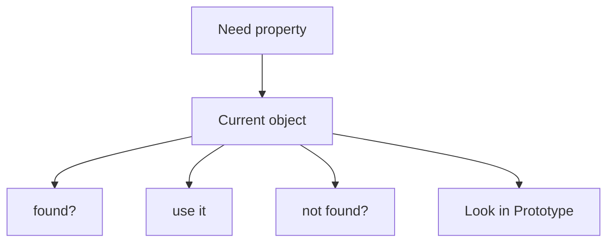

Prototype был представлен как обычный object, который может быть shared source of properties. На практике мы чаще всего использовали его для общее поведение:

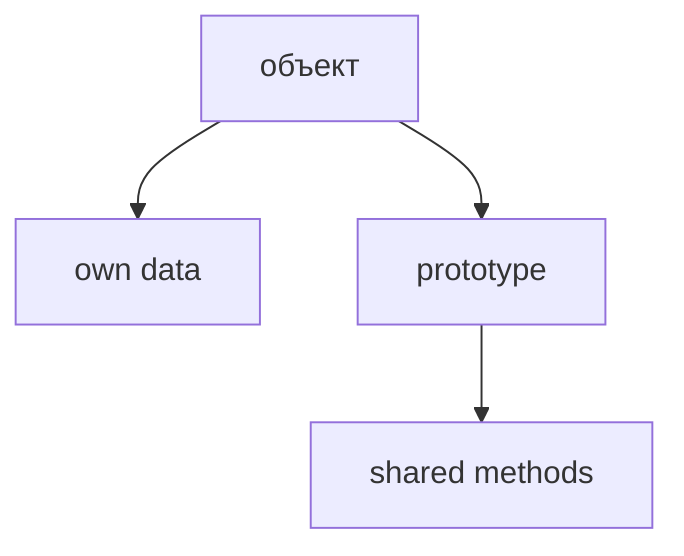

Теперь появляется следующий вопрос:

> Что происходит, если property не найдена и в prototype?

Например:

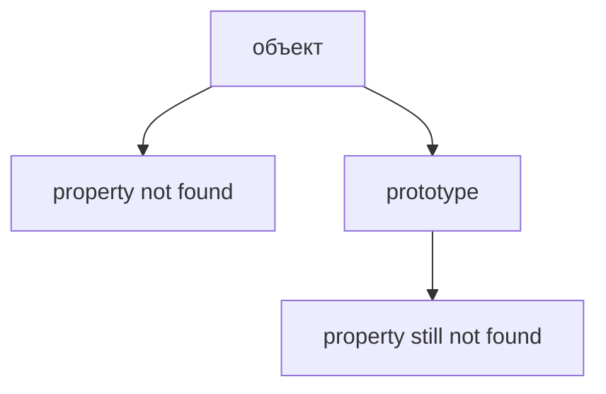

JavaScript не останавливается на слове "prototype" как на магической стене. Если у prototype тоже есть свой prototype, lookup может продолжиться.

Эта повторяющаяся последовательность называется Prototype Chain.

Главная модель главы:

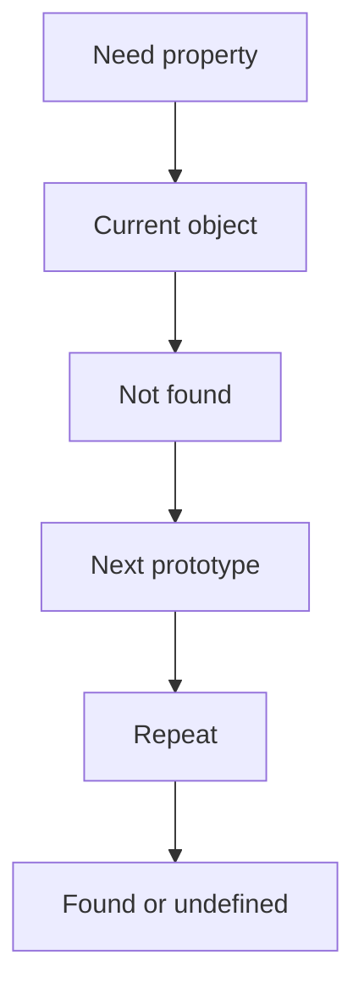

Важно: Prototype Chain в этой главе - это lookup algorithm, not inheritance hierarchy.

---

## Предварительные требования

Для этой главы нужно понимать:

* что object has own properties;
* что prototype is ordinary object;
* что prototype can contain any properties;
* что на практике prototype часто содержит общее поведение;
* что property lookup сначала проверяет own properties;
* что inherited property is found through prototype lookup;
* что method location and объект выполнения are different concepts;
* что ordinary `object.method()` invocation uses object before dot as объект выполнения.

Не требуется знать `constructor.prototype`, classes, `new`, `instanceof`, `Reflect`, `Proxy`, `Symbol.hasInstance` или advanced inheritance. Эти темы будут изучаться позже.

---

## Время изучения

Ориентировочное время:

```text
Чтение главы:            150-190 минут
Разбор схем:             70-95 минут
Запуск примеров:         25-35 минут
Практика:                130-160 минут
Повторение материала:    35 минут
```

Уровень сложности: **L4**.

Сложность Prototype Chain не в синтаксисе. Сложность в том, чтобы перестать думать "JavaScript где-то наследует" и начать видеть конкретный search algorithm.

---

## Навигация

Предыдущая глава:

```text
docs/01-javascript/39-prototype.md
```

Текущая глава:

```text
docs/01-javascript/40-prototype-chain.md
```

Следующая глава:

```text
docs/01-javascript/41-classes.md
```

Следующая глава ответит:

> Как JavaScript может создавать много objects с одинаковым prototype удобнее?

---

## Цели обучения

После изучения этой главы вы будете понимать:

* зачем существует Prototype Chain;
* как lookup продолжается через несколько prototype levels;
* почему own property has priority;
* что такое shadowing;
* что такое property overriding на уровне lookup;
* где в цепочке находится `Object.prototype`;
* когда lookup ends;
* почему missing property дает `undefined`;
* почему Prototype Chain is lookup algorithm, not inheritance hierarchy;
* как эта модель помогает читать Page Objects, API clients and framework utilities.

---

## Мотивация

Начнем с уже знакомой модели.

Есть объект:

```javascript
const loginPage = {
  name: 'LoginPage'
};
```

Есть shared page поведение:

```javascript
const pageBehavior = {
  describePage() {
    return this.name;
  }
};
```

Связь:

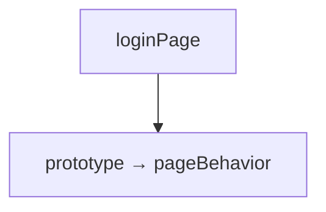

Если JavaScript ищет `describePage`, все понятно:

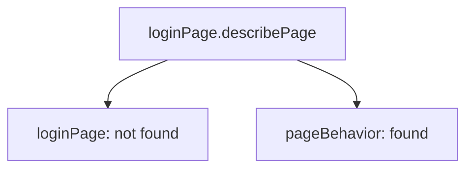

Но что если нужен method, которого нет и в `pageBehavior`?

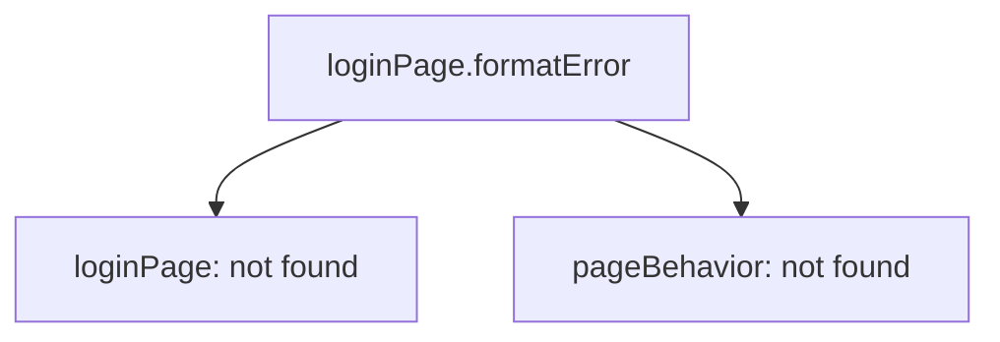

Вопрос:

> Где следующий lookup step?

Если `pageBehavior` itself has prototype, JavaScript может продолжить поиск там:

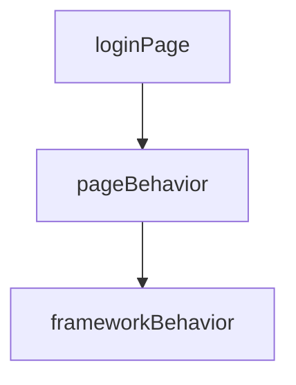

Это уже chain.

Не hierarchy for design.

А последовательность lookup steps.

---

## Теория

Prototype Chain - это последовательность objects, по которой JavaScript ищет property.

Не начинаем с `Object.prototype`.

Не начинаем с `null`.

Начинаем с действия:

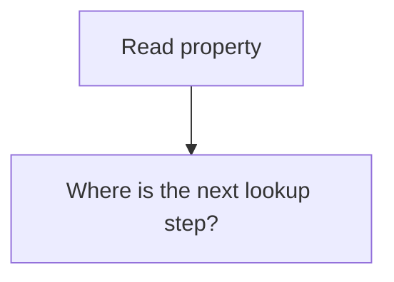

Если property не найдена на current object, engine переходит к prototype.

Если property не найдена на prototype, engine переходит к prototype of that prototype.

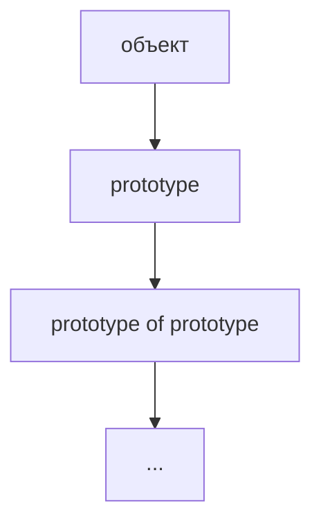

Так появляется chain.

### Lookup algorithm

Упрощенная модель:

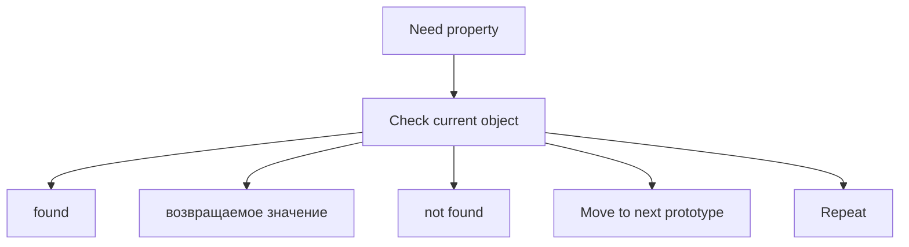

Если JavaScript дошел до конца chain and property was not found:

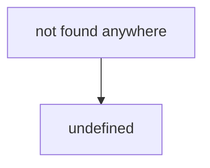

### `Object.prototype`

Most ordinary objects eventually lead to `Object.prototype`.

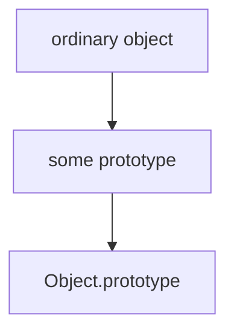

`Object.prototype` contains common properties available to many ordinary objects.

В этой главе не нужно запоминать его полный набор properties. Важно понять место:

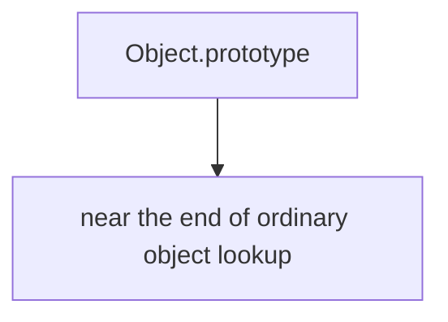

Если property не найдена и там, lookup ends.

### End of chain

У цепочки есть конец.

Концептуально:

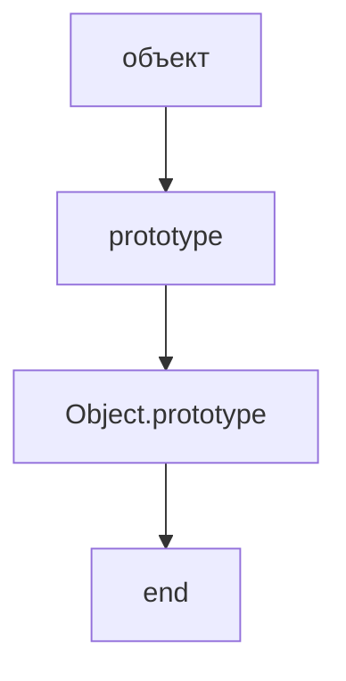

Когда next prototype больше нет, JavaScript stops searching.

Именно поэтому missing property becomes `undefined`.

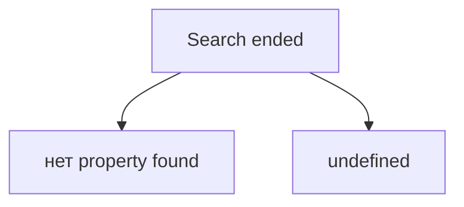

### Own property priority

Если property найдена на current object, JavaScript не идет дальше.

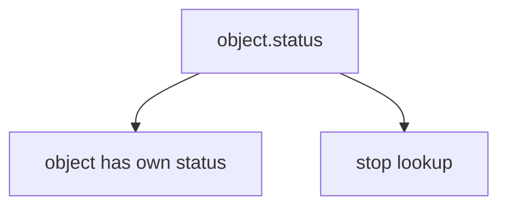

Prototype value с тем же name не используется.

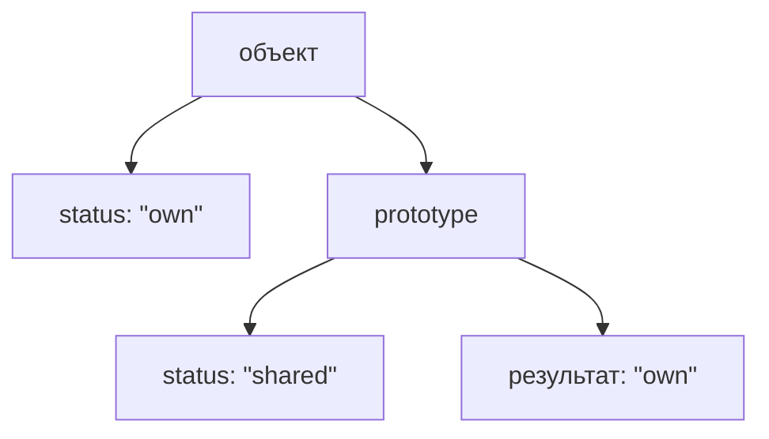

### Shadowing

Shadowing happens when a property on a closer object hides property with same name later in chain.

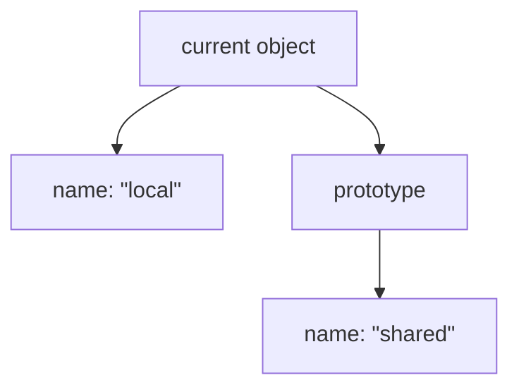

Lookup result:

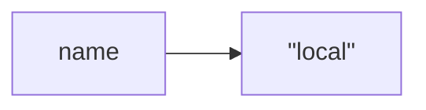

Prototype property still exists.

It is just not reached for this lookup.

### Property overriding

Property overriding is practical effect of shadowing:

```mermaid
flowchart TD
    N1["shared method in prototype"]
    N2["but"]
    N3["own method with same name exists"]
    N4["own method wins"]
    N1 --> N2
    N2 --> N3
    N3 --> N4
```

Например, shared `describe()` можно override directly on one object:

```mermaid
flowchart TD
    N1["generic describe()"]
    N2["in prototype"]
    N3["special describe()"]
    N4["own property"]
    N1 --> N2
    N1 --> N3
    N3 --> N4
```

Lookup chooses special one.

---

## Внутренний механизм

Рассмотрим chain from QA example:

```mermaid
flowchart TD
    N1["loginPage"]
    N2["pageBehavior"]
    N3["frameworkBehavior"]
    N4["Object.prototype"]
    N5["end"]
    N1 --> N2
    N2 --> N3
    N3 --> N4
    N4 --> N5
```

Engine receives:

```text
property name: "formatError"
start object: loginPage
```

Step by step:

```mermaid
flowchart TD
    N1["Step 1"]
    N2["Check loginPage own properties"]
    N3["formatError not found"]
    N1 --> N2
    N2 --> N3
```

```mermaid
flowchart TD
    N1["Step 2"]
    N2["Move to pageBehavior"]
    N3["formatError not found"]
    N1 --> N2
    N2 --> N3
```

```mermaid
flowchart TD
    N1["Step 3"]
    N2["Move to frameworkBehavior"]
    N3["formatError found"]
    N1 --> N2
    N2 --> N3
```

Lookup stops immediately:

```mermaid
flowchart TD
    N1["found"]
    N2["вернуть property value"]
    N1 --> N2
```

If returned value is a function and call form is:

```javascript
loginPage.formatError();
```

объект выполнения reminder:

```mermaid
flowchart TD
    N1["method found in frameworkBehavior"]
    N2["but ordinary вызвать is loginPage.formatError()"]
    N3["therefore receiver is loginPage"]
    N1 --> N2
    N2 --> N3
```

The method location does not automatically become объект выполнения.

```text
Location: frameworkBehavior
Receiver: loginPage
```

This connects Prototype Chain with the previous chapters about `this`.

### Why does JavaScript stop searching?

JavaScript stops for two reasons:

```mermaid
flowchart TD
    N1["Reason 1"]
    N2["property found"]
    N1 --> N2
```

or:

```mermaid
flowchart TD
    N1["Reason 2"]
    N2["chain ended"]
    N1 --> N2
```

It does not keep searching after a found property because lookup has a clear priority rule:

```text
closer property wins
```

It does not search forever because every chain has an end.

```mermaid
flowchart TD
    N1["end reached"]
    N2["вернуть undefined for simple property read"]
    N1 --> N2
```

---

## Ментальная модель

Prototype Chain можно представить как chain of libraries.

Вы ищете instruction:

```mermaid
flowchart TD
    N1["Need instruction"]
    N2["Local shelf"]
    N3["found? use it"]
    N4["not found? go to next library"]
    N1 --> N2
    N2 --> N3
    N2 --> N4
```

Если в первой библиотеке нет нужной книги, вы идете в следующую:

```mermaid
flowchart TD
    N1["local library"]
    N2["city library"]
    N3["central archive"]
    N1 --> N2
    N2 --> N3
```

Если нашли, поиск заканчивается.

Если не нашли нигде, результата нет.

Другие mental models:

```mermaid
flowchart TD
    N1["chain of managers"]
    N2["ask direct manager"]
    N3["ask senior manager"]
    N4["ask department head"]
    N1 --> N2
    N1 --> N3
    N1 --> N4
```

```mermaid
flowchart TD
    N1["asking one colleague after another"]
    N2["colleague A"]
    N3["colleague B"]
    N4["colleague C"]
    N1 --> N2
    N1 --> N3
    N1 --> N4
```

```mermaid
flowchart TD
    N1["linked instruction manuals"]
    N2["object manual"]
    N3["shared manual"]
    N4["base manual"]
    N1 --> N2
    N1 --> N3
    N1 --> N4
```

Главная мысль:

```mermaid
flowchart TD
    N1["Prototype Chain"]
    N2["repeated lookup path"]
    N1 --> N2
```

---

## Примеры кода

Примеры находятся в:

```text
examples/01-javascript/chapter-40/
```

Запуск:

```bash
node examples/01-javascript/chapter-40/01-basic-chain.js
```

### Пример 1. Basic chain

Файл:

```text
examples/01-javascript/chapter-40/01-basic-chain.js
```

Показывает:

```mermaid
flowchart TD
    N1["объект"]
    N2["first prototype"]
    N3["second prototype"]
    N1 --> N2
    N2 --> N3
```

### Пример 2. Property lookup

Файл:

```text
examples/01-javascript/chapter-40/02-property-lookup.js
```

Показывает lookup order from own property to shared framework поведение.

### Пример 3. Shadowing

Файл:

```text
examples/01-javascript/chapter-40/03-shadowing.js
```

Показывает:

```mermaid
flowchart TD
    N1["own property"]
    N2["wins over inherited property"]
    N1 --> N2
```

### Пример 4. Типичные ошибки

Файл:

```text
examples/01-javascript/chapter-40/04-common-mistakes.js
```

Показывает ошибку ожидания, что far prototype wins over closer property.

### Пример 5. Framework preview

Файл:

```text
examples/01-javascript/chapter-40/05-framework-preview.js
```

Показывает layered framework поведение.

### Пример 6. QA example

Файл:

```text
examples/01-javascript/chapter-40/06-qa-example.js
```

Показывает API client lookup through client-specific, service-level and framework-level поведение.

---

## Частые вопросы

### Prototype Chain - это inheritance hierarchy?

Нет.

В этой главе Prototype Chain is lookup algorithm.

```mermaid
flowchart TD
    N1["Need property"]
    N2["Where to search next?"]
    N1 --> N2
```

Inheritance as architecture will appear later. Здесь важно понять search path.

### Почему JavaScript не ищет property во всех objects проекта?

Потому что lookup follows only one connected chain.

```mermaid
flowchart TD
    N1["объект"]
    N2["its prototype"]
    N3["next prototype"]
    N1 --> N2
    N2 --> N3
```

Unrelated objects are not searched.

### Почему own property wins?

Because lookup starts from current object.

```mermaid
flowchart TD
    N1["closer object"]
    N2["higher priority"]
    N1 --> N2
```

Это делает local override predictable.

### Почему missing property gives `undefined`?

Because lookup ended without finding property.

```mermaid
flowchart TD
    N1["searched whole chain"]
    N2["not found"]
    N3["undefined"]
    N1 --> N2
    N1 --> N3
```

### Что такое `Object.prototype`?

`Object.prototype` is common prototype near the end of many ordinary object chains.

В этой главе достаточно понимать его position in lookup. Detailed built-in поведение будет встречаться позже по мере необходимости.

---

## Распространенные мифы

### Миф: Prototype Chain копирует properties вниз

Реальность: lookup reads through the chain. It does not copy properties into object.

```mermaid
flowchart TD
    N1["lookup"]
    N2["≠"]
    N3["copy"]
    N1 --> N2
    N2 --> N3
```

### Миф: самый дальний prototype важнее

Реальность: closer property wins.

```mermaid
flowchart TD
    N1["объект"]
    N2["first priority"]
    N3["prototype"]
    N4["second priority"]
    N1 --> N2
    N1 --> N3
    N3 --> N4
```

### Миф: Prototype Chain нужен только для classes

Реальность: Prototype Chain exists for ordinary property lookup. Classes will use related mechanisms later, but the algorithm already exists now.

### Миф: missing property always throws

Реальность: simple property read returns `undefined` when lookup ends without result.

---

## Типичные ошибки

### Ошибка 1. Ожидать, что prototype overrides own property

Неправильная модель:

```mermaid
flowchart TD
    N1["prototype.status"]
    N2["wins over object.status"]
    N1 --> N2
```

Что происходит:

```mermaid
flowchart TD
    N1["object.status found first"]
    N2["lookup stops"]
    N1 --> N2
```

Исправленная модель:

```mermaid
flowchart TD
    N1["own property priority"]
    N2["closer property wins"]
    N1 --> N2
```

### Ошибка 2. Думать, что method объект выполнения is where method was found

Неправильная модель:

```mermaid
flowchart TD
    N1["method found in frameworkBehavior"]
    N2["this = frameworkBehavior"]
    N1 --> N2
```

Что происходит при ordinary call:

```mermaid
flowchart TD
    N1["loginPage.formatError()"]
    N2["method found through chain"]
    N3["receiver is loginPage"]
    N1 --> N2
    N1 --> N3
```

Исправленная модель:

```mermaid
flowchart TD
    N1["lookup location"]
    N2["≠"]
    N3["receiver"]
    N1 --> N2
    N2 --> N3
```

### Ошибка 3. Делать слишком глубокие chains

Неправильный дизайн:

```mermaid
flowchart TD
    N1["объект"]
    N2["level 1"]
    N3["level 2"]
    N4["level 3"]
    N5["level 4"]
    N1 --> N2
    N2 --> N3
    N3 --> N4
    N4 --> N5
```

Что произошло:

* сложно понять, где property found;
* сложно debug;
* сложно explain поведение to team.

Исправленный подход:

```text
prefer shallow, readable object relationships
```

### Ошибка 4. Считать missing property ошибкой всегда

Неправильное ожидание:

```mermaid
flowchart TD
    N1["object.значение отсутствует"]
    N2["throw error"]
    N1 --> N2
```

Реальность:

```mermaid
flowchart TD
    N1["object.значение отсутствует"]
    N2["undefined"]
    N1 --> N2
```

Ошибка появится later if code tries to use `undefined` incorrectly.

---

## Практическое использование

Prototype Chain помогает читать код, где поведение organized in layers.

```mermaid
flowchart TD
    N1["specific object"]
    N2["specific state"]
    N3["lookup to shared behavior"]
    N1 --> N2
    N1 --> N3
```

Например:

```mermaid
flowchart TD
    N1["loginPage"]
    N2["pageBehavior"]
    N3["frameworkBehavior"]
    N1 --> N2
    N2 --> N3
```

Такая модель может быть полезной, если нужно:

* separate object-specific data from shared actions;
* provide default поведение;
* override поведение locally;
* understand where method was found;
* debug unexpected property значения.

Но deep chain is not automatically good architecture.

Readable code matters:

```mermaid
flowchart TD
    N1["short clear chain"]
    N2["easier to debug"]
    N3["deep unclear chain"]
    N4["harder to maintain"]
    N1 --> N2
    N1 --> N3
    N3 --> N4
```

---

## Использование в Automation QA

### Layered Page Objects

Page Objects may have layers:

```mermaid
flowchart TD
    N1["loginPage"]
    N2["own: page name, selectors"]
    N3["pageBehavior"]
    N4["open()"]
    N5["assertLoaded()"]
    N6["frameworkBehavior"]
    N7["formatError()"]
    N1 --> N2
    N1 --> N3
    N3 --> N4
    N3 --> N5
    N3 --> N6
    N6 --> N7
```

Lookup explains why `loginPage.formatError()` can work even if `formatError` is not own property.

### API client hierarchy

API clients often combine:

```mermaid
flowchart TD
    N1["client-specific config"]
    N2["service-level behavior"]
    N3["framework-level helpers"]
    N1 --> N2
    N2 --> N3
```

Example model:

```mermaid
flowchart TD
    N1["usersClient"]
    N2["own baseUrl"]
    N3["own serviceName"]
    N4["serviceBehavior"]
    N5["buildEndpoint()"]
    N6["frameworkBehavior"]
    N7["describeRequest()"]
    N1 --> N2
    N1 --> N3
    N1 --> N4
    N4 --> N5
    N4 --> N6
    N6 --> N7
```

### Assertion infrastructure

Assertion helpers may share:

```mermaid
flowchart TD
    N1["specific validator"]
    N2["validator behavior"]
    N3["reporting behavior"]
    N1 --> N2
    N2 --> N3
```

This can help reuse formatting and error reporting.

### Отладка unexpected methods

If method exists but not directly in object:

```mermaid
flowchart TD
    N1["method is доступно для вызова"]
    N2["but"]
    N3["not visible as own property"]
    N1 --> N2
    N2 --> N3
```

Prototype Chain gives the mental route:

```mermaid
flowchart TD
    N1["start from object"]
    N2["walk prototypes"]
    N3["find method location"]
    N1 --> N2
    N2 --> N3
```

---

## Диаграммы главы

### 1. Why Prototype Chain exists

```mermaid
flowchart TD
    N1["Object"]
    N2["not found"]
    N3["Prototype"]
    N4["not found"]
    N5["Need next lookup step"]
    N1 --> N2
    N1 --> N3
    N3 --> N4
    N3 --> N5
```

### 2. Lookup continuation

```mermaid
flowchart TD
    N1["not found here"]
    N2["try next prototype"]
    N1 --> N2
```

### 3. Multiple prototype levels

```mermaid
flowchart TD
    N1["объект"]
    N2["prototype A"]
    N3["prototype B"]
    N1 --> N2
    N2 --> N3
```

### 4. Property search

```mermaid
flowchart TD
    N1["property name"]
    N2["search current object"]
    N3["search next prototype"]
    N1 --> N2
    N2 --> N3
```

### 5. Lookup timeline

```text
t1 object
t2 prototype A
t3 prototype B
t4 result
```

### 6. Current object

```mermaid
flowchart TD
    N1["current object"]
    N2["first lookup step"]
    N1 --> N2
```

### 7. First prototype

```mermaid
flowchart TD
    N1["current object"]
    N2["first prototype"]
    N1 --> N2
```

### 8. Second prototype

```mermaid
flowchart TD
    N1["first prototype"]
    N2["second prototype"]
    N1 --> N2
```

### 9. Object.prototype

```mermaid
flowchart TD
    N1["ordinary object"]
    N2["Object.prototype"]
    N1 --> N2
```

### 10. End of chain

```mermaid
flowchart TD
    N1["Object.prototype"]
    N2["end"]
    N1 --> N2
```

### 11. Property found

```mermaid
flowchart TD
    N1["search"]
    N2["found"]
    N3["stop"]
    N1 --> N2
    N2 --> N3
```

### 12. Property missing

```mermaid
flowchart TD
    N1["search all chain"]
    N2["not found"]
    N3["undefined"]
    N1 --> N2
    N2 --> N3
```

### 13. Shadowing

```mermaid
flowchart TD
    N1["object.name: &quot;local&quot;"]
    N2["shadows"]
    N3["prototype.name: &quot;shared&quot;"]
    N1 --> N2
    N2 --> N3
```

### 14. Own property priority

```mermaid
flowchart TD
    N1["own property"]
    N2["wins first"]
    N1 --> N2
```

### 15. Shared поведение

```mermaid
flowchart TD
    N1["объект"]
    N2["prototype"]
    N3["shared method"]
    N1 --> N2
    N2 --> N3
```

### 16. QA framework example

```mermaid
flowchart TD
    N1["test helper"]
    N2["validator behavior"]
    N3["reporting behavior"]
    N1 --> N2
    N2 --> N3
```

### 17. API client example

```mermaid
flowchart TD
    N1["usersClient"]
    N2["serviceBehavior"]
    N3["frameworkBehavior"]
    N1 --> N2
    N2 --> N3
```

### 18. Page Object example

```mermaid
flowchart TD
    N1["loginPage"]
    N2["pageBehavior"]
    N3["frameworkBehavior"]
    N1 --> N2
    N2 --> N3
```

### 19. Читаемость

```mermaid
flowchart TD
    N1["short chain"]
    N2["readable"]
    N3["deep chain"]
    N4["harder to debug"]
    N1 --> N2
    N1 --> N3
    N3 --> N4
```

### 20. Типичные ошибки

```mermaid
flowchart TD
    N1["far property"]
    N2["does not beat"]
    N3["near property"]
    N1 --> N2
    N2 --> N3
```

### 21. Escalation analogy

```mermaid
flowchart TD
    N1["ask first person"]
    N2["ask next person"]
    N3["ask final person"]
    N1 --> N2
    N2 --> N3
```

### 22. Library analogy

```mermaid
flowchart TD
    N1["local library"]
    N2["city library"]
    N3["central archive"]
    N1 --> N2
    N2 --> N3
```

### 23. Manager analogy

```mermaid
flowchart TD
    N1["team lead"]
    N2["manager"]
    N3["director"]
    N1 --> N2
    N2 --> N3
```

### 24. Complete lookup model

```mermaid
flowchart TD
    N1["Need property"]
    N2["Current object"]
    N3["found → use it"]
    N4["not found → next prototype"]
    N1 --> N2
    N2 --> N3
    N2 --> N4
```

### 25. Object relationship

```mermaid
flowchart TD
    N1["объект"]
    N2["prototype link"]
    N3["next object"]
    N1 --> N2
    N1 --> N3
```

### 26. Search flow

```mermaid
flowchart TD
    N1["начало"]
    N2["check"]
    N3["move"]
    N4["check"]
    N1 --> N2
    N2 --> N3
    N3 --> N4
```

### 27. Undefined result

```mermaid
flowchart TD
    N1["end reached"]
    N2["нет property"]
    N3["undefined"]
    N1 --> N2
    N1 --> N3
```

### 28. Принадлежность свойства

```mermaid
flowchart TD
    N1["own"]
    N2["stored here"]
    N3["inherited"]
    N4["found later"]
    N1 --> N2
    N1 --> N3
    N3 --> N4
```

### 29. Receiver reminder

```mermaid
flowchart TD
    N1["object.method()"]
    N2["method found anywhere in chain"]
    N3["receiver is object"]
    N1 --> N2
    N1 --> N3
```

### 30. Method lookup

```mermaid
flowchart TD
    N1["method name"]
    N2["lookup chain"]
    N3["function object"]
    N1 --> N2
    N2 --> N3
```

### 31. Краткая ментальная модель

```mermaid
flowchart TD
    N1["Prototype Chain"]
    N2["escalation path for property search"]
    N1 --> N2
```

### 32. Complete chain

```mermaid
flowchart TD
    N1["объект"]
    N2["prototype A"]
    N3["prototype B"]
    N4["Object.prototype"]
    N5["end"]
    N1 --> N2
    N2 --> N3
    N3 --> N4
    N4 --> N5
```

### 33. Object evolution

```mermaid
flowchart TD
    N1["own methods"]
    N2["prototype"]
    N3["prototype chain"]
    N1 --> N2
    N2 --> N3
```

### 34. Переход к Classes

```mermaid
flowchart TD
    N1["Prototype Chain"]
    N2["Classes later создать objects with shared prototypes more conveniently"]
    N1 --> N2
```

### 35. Переход к new

```mermaid
flowchart TD
    N1["object creation question"]
    N2["how to set prototype conveniently?"]
    N1 --> N2
```

### 36. Internal lookup

```mermaid
flowchart TD
    N1["engine"]
    N2["property name"]
    N3["current object"]
    N4["next prototype pointer"]
    N1 --> N2
    N1 --> N3
    N1 --> N4
```

### 37. Property override

```mermaid
flowchart TD
    N1["own describe()"]
    N2["overrides inherited describe()"]
    N1 --> N2
```

### 38. Итоговая схема

```mermaid
flowchart TD
    N1["Need property"]
    N2["Current object"]
    N3["Found? use it"]
    N4["Not found"]
    N5["Next prototype"]
    N6["Repeat until found or undefined"]
    N1 --> N2
    N2 --> N3
    N2 --> N4
    N2 --> N5
    N2 --> N6
```

## Итоги

Prototype Chain продолжает модель Prototype.

Prototype отвечал:

```mermaid
flowchart TD
    N1["значение отсутствует property?"]
    N2["Look in Prototype"]
    N1 --> N2
```

Prototype Chain отвечает:

```mermaid
flowchart TD
    N1["Prototype also значение отсутствует?"]
    N2["продолжить to next prototype"]
    N1 --> N2
```

Это не скрытая магия и не обязательная class hierarchy.

Это lookup algorithm:

```mermaid
flowchart TD
    N1["Need property"]
    N2["Current object"]
    N3["Found? use it"]
    N4["Not found"]
    N5["Next prototype"]
    N6["Repeat"]
    N1 --> N2
    N2 --> N3
    N2 --> N4
    N2 --> N5
    N2 --> N6
```

Own properties have priority. Closer properties shadow farther properties. If lookup reaches the end of chain without result, simple property read returns `undefined`.

Следующая глава покажет, как classes make object creation with shared prototypes more convenient.

---

## Что нужно запомнить

✓ Prototype Chain is repeated property lookup through prototypes.

✓ JavaScript checks current object before prototypes.

✓ Own property wins over inherited property.

✓ Shadowing means closer property hides farther property with same name.

✓ Lookup stops when property is found.

✓ Lookup also stops when chain ends.

✓ Missing property after full lookup gives `undefined`.

✓ `Object.prototype` is near the end of many ordinary object chains.

✓ Method location and объект выполнения are different concepts.

✓ Prototype Chain is lookup algorithm, not inheritance hierarchy.

---

## Проверьте себя

1. What problem does Prototype Chain solve?

2. Where does lookup start?

3. What happens if property is found on current object?

4. What happens if property is not found on current object?

5. Why does JavaScript stop searching?

6. What is shadowing?

7. Why does own property win over inherited property?

8. What is the role of `Object.prototype` in this chapter?

9. What result appears when property is not found anywhere?

10. Why is Prototype Chain not primarily an inheritance hierarchy?

---

## Практика

Практические задания находятся в отдельном файле:

```text
practice/01-javascript/40-prototype-chain.md
```

---

## Решения

Решения находятся в отдельном файле:

```text
solutions/01-javascript/40-prototype-chain.md
```

Сначала выполните практику самостоятельно. Затем сравните ход рассуждения, а не только итоговый ответ.
