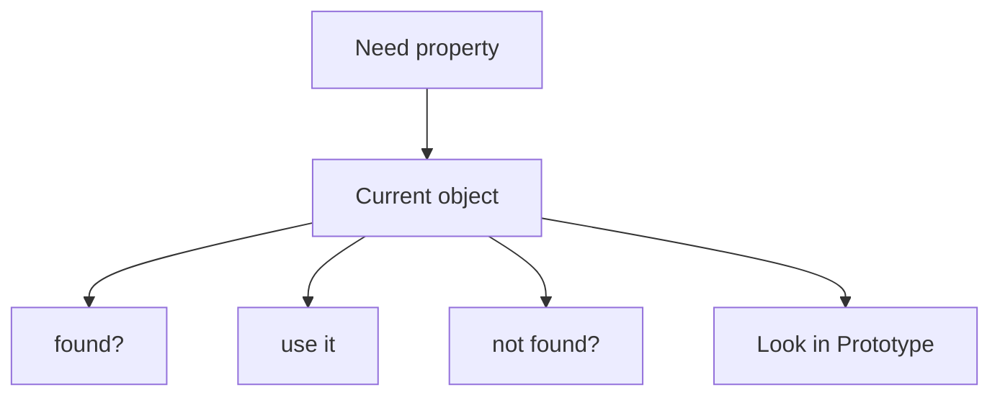
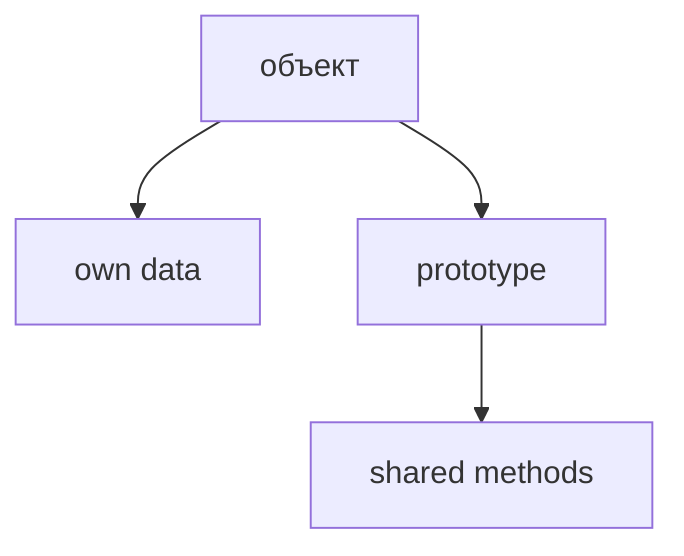
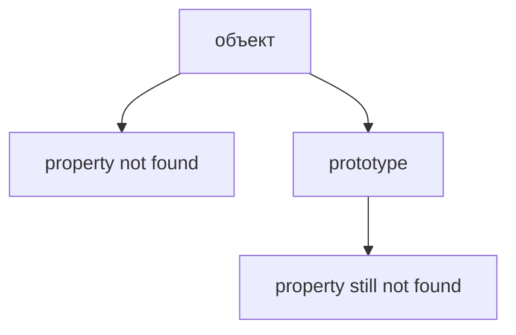
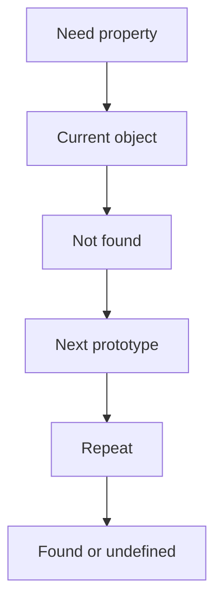
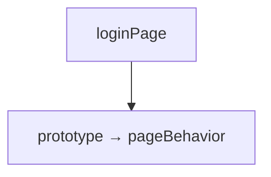
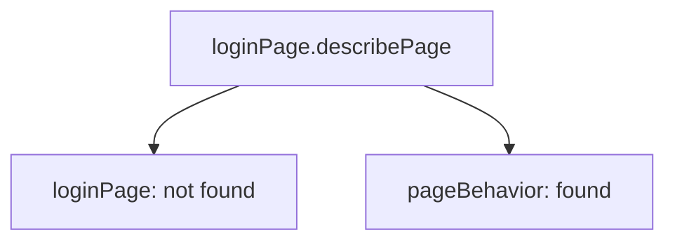
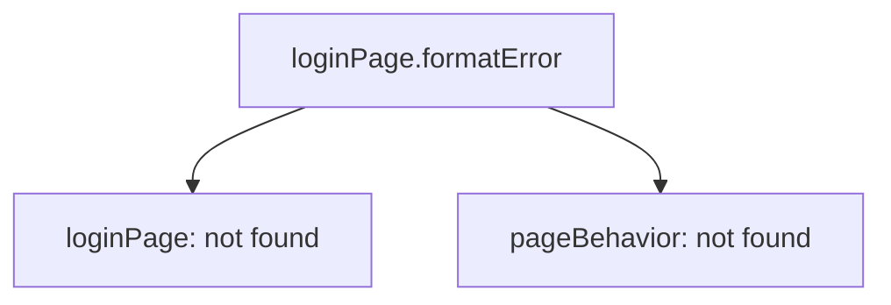
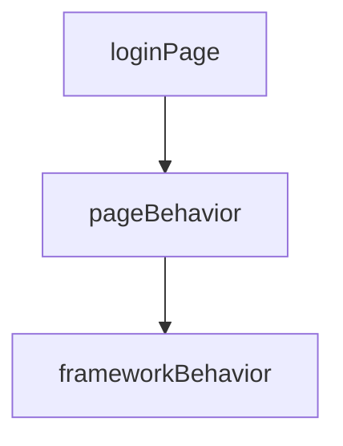

# Prototype Chain

## Связь с предыдущей главой

Предыдущая глава объяснила Prototype.

Главная модель была такой:



Prototype был представлен как обычный object, который может быть shared source of properties. На практике мы чаще всего использовали его для общее поведение:



Теперь появляется следующий вопрос:

> Что происходит, если property не найдена и в prototype?

Например:



JavaScript не останавливается на слове "prototype" как на магической стене. Если у prototype тоже есть свой prototype, lookup может продолжиться.

Эта повторяющаяся последовательность называется Prototype Chain.

Главная модель главы:



Важно: Prototype Chain в этой главе - это lookup algorithm, not inheritance hierarchy.

---

## Предварительные требования

Для этой главы нужно понимать:

* что object has own properties;
* что prototype is ordinary object;
* что prototype can contain any properties;
* что на практике prototype часто содержит общее поведение;
* что property lookup сначала проверяет own properties;
* что inherited property is found through prototype lookup;
* что method location and объект выполнения are different concepts;
* что ordinary `object.method()` invocation uses object before dot as объект выполнения.

Не требуется знать `constructor.prototype`, classes, `new`, `instanceof`, `Reflect`, `Proxy`, `Symbol.hasInstance` или advanced inheritance. Эти темы будут изучаться позже.

---

## Время изучения

Ориентировочное время:

```text
Чтение главы:            150-190 минут
Разбор схем:             70-95 минут
Запуск примеров:         25-35 минут
Практика:                130-160 минут
Повторение материала:    35 минут
```

Уровень сложности: **L4**.

Сложность Prototype Chain не в синтаксисе. Сложность в том, чтобы перестать думать "JavaScript где-то наследует" и начать видеть конкретный search algorithm.

---

## Навигация

Предыдущая глава:

```text
docs/01-javascript/39-prototype.md
```

Текущая глава:

```text
docs/01-javascript/40-prototype-chain.md
```

Следующая глава:

```text
docs/01-javascript/41-classes.md
```

Следующая глава ответит:

> Как JavaScript может создавать много objects с одинаковым prototype удобнее?

---

## Цели обучения

После изучения этой главы вы будете понимать:

* зачем существует Prototype Chain;
* как lookup продолжается через несколько prototype levels;
* почему own property has priority;
* что такое shadowing;
* что такое property overriding на уровне lookup;
* где в цепочке находится `Object.prototype`;
* когда lookup ends;
* почему missing property дает `undefined`;
* почему Prototype Chain is lookup algorithm, not inheritance hierarchy;
* как эта модель помогает читать Page Objects, API clients and framework utilities.

---

## Мотивация

Начнем с уже знакомой модели.

Есть объект:

```javascript
const loginPage = {
  name: 'LoginPage'
};
```

Есть shared page поведение:

```javascript
const pageBehavior = {
  describePage() {
    return this.name;
  }
};
```

Связь:



Если JavaScript ищет `describePage`, все понятно:



Но что если нужен method, которого нет и в `pageBehavior`?



Вопрос:

> Где следующий lookup step?

Если `pageBehavior` itself has prototype, JavaScript может продолжить поиск там:



Это уже chain.

Не hierarchy for design.

А последовательность lookup steps.

---

## Теория

Prototype Chain - это последовательность objects, по которой JavaScript ищет property.

Не начинаем с `Object.prototype`.

Не начинаем с `null`.

Начинаем с действия:

Если property не найдена на current object, engine переходит к prototype.

Если property не найдена на prototype, engine переходит к prototype of that prototype.

Так появляется chain.

### Lookup algorithm

Упрощенная модель:

```text
объект  →  prototype  →  prototype прототипа  →  null
поиск идёт вверх и останавливается на первом совпадении
```

Если JavaScript дошел до конца chain and property was not found:

### `Object.prototype`

Most ordinary objects eventually lead to `Object.prototype`.

`Object.prototype` contains common properties available to many ordinary objects.

В этой главе не нужно запоминать его полный набор properties. Важно понять место:

Если property не найдена и там, lookup ends.

### End of chain

У цепочки есть конец.

Концептуально:

Когда next prototype больше нет, JavaScript stops searching.

Именно поэтому missing property becomes `undefined`.

### Own property priority

Если property найдена на current object, JavaScript не идет дальше.

Prototype value с тем же name не используется.

### Shadowing

Shadowing happens when a property on a closer object hides property with same name later in chain.

Lookup result:

Prototype property still exists.

It is just not reached for this lookup.

### Property overriding

Property overriding is practical effect of shadowing:

Например, общий метод `describe()` можно переопределить прямо на одном объекте — тогда для него будет использоваться собственная версия, а для остальных — общая.

Lookup chooses special one.

---

## Внутренний механизм

Рассмотрим chain from QA example:

Engine receives:

```text
property name: "formatError"
start object: loginPage
```

Step by step:

Lookup stops immediately:

If returned value is a function and call form is:

```javascript
loginPage.formatError();
```

объект выполнения reminder:

The method location does not automatically become объект выполнения.

```text
Location: frameworkBehavior
Receiver: loginPage
```

This connects Prototype Chain with the previous chapters about `this`.

### Why does JavaScript stop searching?

JavaScript stops for two reasons:

or:

It does not keep searching after a found property because lookup has a clear priority rule:

```text
closer property wins
```

It does not search forever because every chain has an end.

---

## Ментальная модель

Prototype Chain можно представить как chain of libraries.

Вы ищете instruction:

Если в первой библиотеке нет нужной книги, вы идете в следующую:

Если нашли, поиск заканчивается.

Если не нашли нигде, результата нет.

Другие mental models:

Главная мысль:

---

## Примеры кода

Примеры находятся в:

```text
examples/01-javascript/chapter-40/
```

Запуск:

```bash
node examples/01-javascript/chapter-40/01-basic-chain.js
```

### Пример 1. Basic chain

Файл:

```text
examples/01-javascript/chapter-40/01-basic-chain.js
```

Показывает:

### Пример 2. Property lookup

Файл:

```text
examples/01-javascript/chapter-40/02-property-lookup.js
```

Показывает lookup order from own property to shared framework поведение.

### Пример 3. Shadowing

Файл:

```text
examples/01-javascript/chapter-40/03-shadowing.js
```

Показывает:

### Пример 4. Типичные ошибки

Файл:

```text
examples/01-javascript/chapter-40/04-common-mistakes.js
```

Показывает ошибку ожидания, что far prototype wins over closer property.

### Пример 5. Framework preview

Файл:

```text
examples/01-javascript/chapter-40/05-framework-preview.js
```

Показывает layered framework поведение.

### Пример 6. QA example

Файл:

```text
examples/01-javascript/chapter-40/06-qa-example.js
```

Показывает API client lookup through client-specific, service-level and framework-level поведение.

---

## Частые вопросы

### Prototype Chain - это inheritance hierarchy?

Нет.

В этой главе Prototype Chain is lookup algorithm.

Inheritance as architecture will appear later. Здесь важно понять search path.

### Почему JavaScript не ищет property во всех objects проекта?

Потому что lookup follows only one connected chain.

Unrelated objects are not searched.

### Почему own property wins?

Because lookup starts from current object.

Это делает local override predictable.

### Почему missing property gives `undefined`?

Because lookup ended without finding property.

### Что такое `Object.prototype`?

`Object.prototype` is common prototype near the end of many ordinary object chains.

В этой главе достаточно понимать его position in lookup. Detailed built-in поведение будет встречаться позже по мере необходимости.

---

## Распространённые мифы

### Миф: Prototype Chain копирует properties вниз

Реальность: lookup reads through the chain. It does not copy properties into object.

### Миф: самый дальний prototype важнее

Реальность: closer property wins.

### Миф: Prototype Chain нужен только для classes

Реальность: Prototype Chain exists for ordinary property lookup. Classes will use related mechanisms later, but the algorithm already exists now.

### Миф: missing property always throws

Реальность: simple property read returns `undefined` when lookup ends without result.

---

## Распространённые ошибки

### Ошибка 1. Ожидать, что prototype overrides own property

Неправильная модель: будто свойство из prototype перекрывает собственное свойство объекта.

Что происходит:

Исправленная модель: поиск начинается с самого объекта, поэтому собственное свойство всегда выигрывает.

### Ошибка 2. Думать, что method объект выполнения is where method was found

Неправильная модель: будто `this` указывает на объект, в котором метод был найден.

Что происходит при ordinary call:

Исправленная модель: `this` указывает на объект, через который метод был вызван, независимо от места его хранения.

### Ошибка 3. Делать слишком глубокие chains

Неправильный дизайн:

Что произошло:

* сложно понять, где property found;
* сложно debug;
* сложно explain поведение to team.

Исправленный подход:

```text
prefer shallow, readable object relationships
```

### Ошибка 4. Считать missing property ошибкой всегда

Неправильное ожидание:

Реальность:

Ошибка появится later if code tries to use `undefined` incorrectly.

---

## Практическое использование

Prototype Chain помогает читать код, где поведение organized in layers.

Например: общие проверки лежат в одном объекте, специфичные — в другом, а конкретный объект дополняет их своими данными.

Такая модель может быть полезной, если нужно:

* separate object-specific data from shared actions;
* provide default поведение;
* override поведение locally;
* understand where method was found;
* debug unexpected property значения.

Но deep chain is not automatically good architecture.

Readable code matters:

---

## Использование в Automation QA

### Layered Page Objects

Page Objects may have layers:

Lookup explains why `loginPage.formatError()` can work even if `formatError` is not own property.

### API client hierarchy

API clients often combine:

Example model:

### Assertion infrastructure

Assertion helpers may share:

This can help reuse formatting and error reporting.

### Отладка unexpected methods

If method exists but not directly in object:

Prototype Chain gives the mental route:

---

## Диаграммы главы

### 1. Why Prototype Chain exists

### 2. Lookup continuation

### 3. Multiple prototype levels

### 4. Property search

### 5. Lookup timeline

```text
t1 object
t2 prototype A
t3 prototype B
t4 result
```

### 6. Current object

### 7. First prototype

### 8. Second prototype

### 9. Object.prototype

### 10. End of chain

### 11. Property found

### 12. Property missing

### 13. Shadowing

### 14. Own property priority

### 15. Shared поведение

### 16. QA framework example

### 17. API client example

### 18. Page Object example

### 19. Читаемость

### 20. Типичные ошибки

### 21. Escalation analogy

### 22. Library analogy

### 23. Manager analogy

### 24. Complete lookup model

### 25. Object relationship

### 26. Search flow

### 27. Undefined result

### 28. Принадлежность свойства

### 29. Receiver reminder

### 30. Method lookup

### 31. Краткая ментальная модель

### 32. Complete chain

### 33. Object evolution

### 34. Переход к Classes

### 35. Переход к new

### 36. Internal lookup

### 37. Property override

### 38. Итоговая схема

## Итоги

Prototype Chain продолжает модель Prototype.

Prototype отвечал:

Prototype Chain отвечает:

Это не скрытая магия и не обязательная class hierarchy.

Это lookup algorithm:

Own properties have priority. Closer properties shadow farther properties. If lookup reaches the end of chain without result, simple property read returns `undefined`.

Следующая глава покажет, как classes make object creation with shared prototypes more convenient.

---

## Что нужно запомнить

✓ Prototype Chain is repeated property lookup through prototypes.

✓ JavaScript checks current object before prototypes.

✓ Own property wins over inherited property.

✓ Shadowing means closer property hides farther property with same name.

✓ Lookup stops when property is found.

✓ Lookup also stops when chain ends.

✓ Missing property after full lookup gives `undefined`.

✓ `Object.prototype` is near the end of many ordinary object chains.

✓ Method location and объект выполнения are different concepts.

✓ Prototype Chain is lookup algorithm, not inheritance hierarchy.

---

## Проверьте себя

1. What problem does Prototype Chain solve?

2. Where does lookup start?

3. What happens if property is found on current object?

4. What happens if property is not found on current object?

5. Why does JavaScript stop searching?

6. What is shadowing?

7. Why does own property win over inherited property?

8. What is the role of `Object.prototype` in this chapter?

9. What result appears when property is not found anywhere?

10. Why is Prototype Chain not primarily an inheritance hierarchy?

---

## Практика

Практические задания находятся в отдельном файле:

```text
practice/01-javascript/40-prototype-chain.md
```

---

## Решения

Решения находятся в отдельном файле:

```text
solutions/01-javascript/40-prototype-chain.md
```

Сначала выполните практику самостоятельно. Затем сравните ход рассуждения, а не только итоговый ответ.
