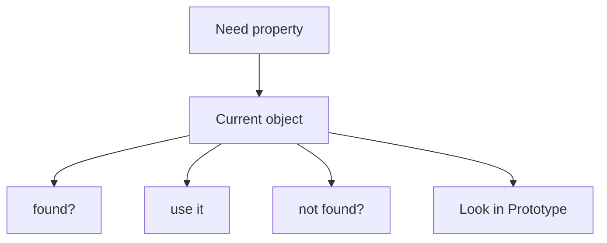
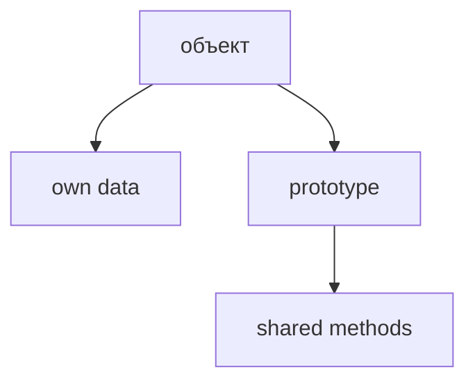
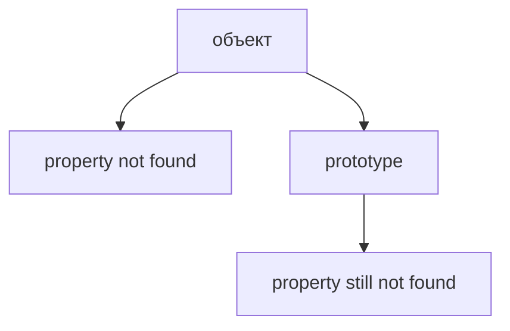
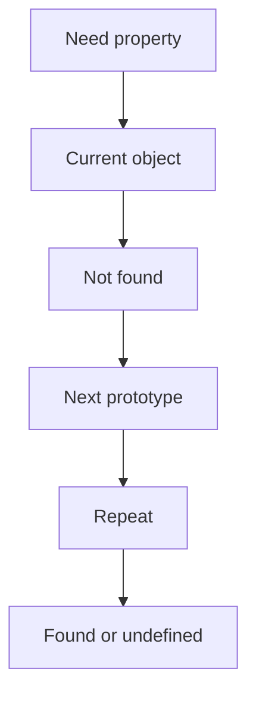
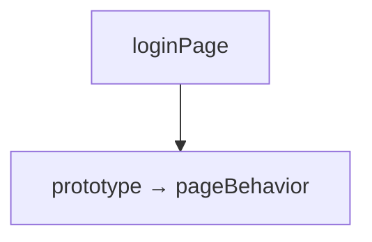
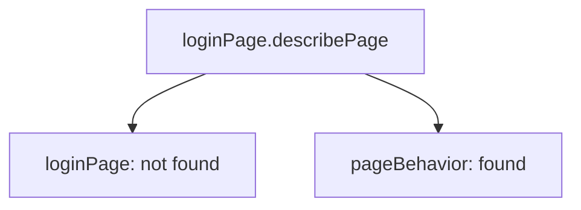
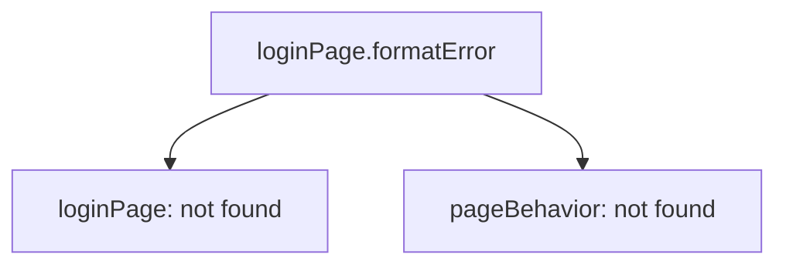
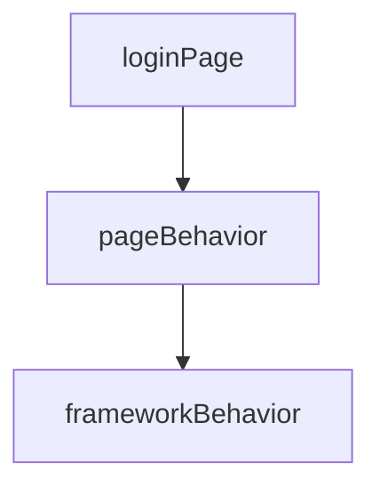

# Цепочка прототипов

## Связь с предыдущей главой

Предыдущая глава объяснила Prototype.

Главная модель была такой:


```mermaid
flowchart TD
    N1["Need property"]
    N2["Current object"]
    N3["found?"]
    N4["use it"]
    N5["not found?"]
    N6["Look in Prototype"]
    N1 --> N2
    N2 --> N3
    N2 --> N4
    N2 --> N5
    N2 --> N6
```

Prototype был представлен как обычный object, который может быть shared source of properties. На практике мы чаще всего использовали его для общее поведение:


```mermaid
flowchart TD
    N1["объект"]
    N2["own data"]
    N3["prototype"]
    N4["shared methods"]
    N1 --> N2
    N1 --> N3
    N3 --> N4
```

Теперь появляется следующий вопрос:

> Что происходит, если property не найдена и в prototype?

Например:


```mermaid
flowchart TD
    N1["объект"]
    N2["property not found"]
    N3["prototype"]
    N4["property still not found"]
    N1 --> N2
    N1 --> N3
    N3 --> N4
```

JavaScript не останавливается на слове "prototype" как на магической стене. Если у prototype тоже есть свой prototype, lookup может продолжиться.

Эта повторяющаяся последовательность называется Prototype Chain.

Главная модель главы:


```mermaid
flowchart TD
    N1["Need property"]
    N2["Current object"]
    N3["Not found"]
    N4["Next prototype"]
    N5["Repeat"]
    N6["Found or undefined"]
    N1 --> N2
    N2 --> N3
    N3 --> N4
    N4 --> N5
    N5 --> N6
```

Важно: Prototype Chain в этой главе - это lookup algorithm, not inheritance hierarchy.

---

## Предварительные требования

Для этой главы нужно понимать:

* что object has own properties;
* что prototype is ordinary object;
* что prototype can contain any properties;
* что на практике prototype часто содержит общее поведение;
* что property lookup сначала проверяет own properties;
* что inherited property is found through prototype lookup;
* что method location and объект выполнения are different concepts;
* что ordinary `object.method()` invocation uses object before dot as объект выполнения.

Не требуется знать `constructor.prototype`, classes, `new`, `instanceof`, `Reflect`, `Proxy`, `Symbol.hasInstance` или advanced inheritance. Эти темы будут изучаться позже.

---

## Время изучения

Ориентировочное время:

```text
Чтение главы:            150-190 минут
Разбор схем:             70-95 минут
Запуск примеров:         25-35 минут
Практика:                130-160 минут
Повторение материала:    35 минут
```

Уровень сложности: **L4**.

Сложность Prototype Chain не в синтаксисе. Сложность в том, чтобы перестать думать "JavaScript где-то наследует" и начать видеть конкретный search algorithm.

---

## Навигация

Предыдущая глава:

```text
docs/01-javascript/39-prototype.md
```

Текущая глава:

```text
docs/01-javascript/40-prototype-chain.md
```

Следующая глава:

```text
docs/01-javascript/41-classes.md
```

Следующая глава ответит:

> Как JavaScript может создавать много objects с одинаковым prototype удобнее?

---

## Цели обучения

После изучения этой главы вы будете понимать:

* зачем существует Prototype Chain;
* как lookup продолжается через несколько prototype levels;
* почему own property has priority;
* что такое shadowing;
* что такое property overriding на уровне lookup;
* где в цепочке находится `Object.prototype`;
* когда lookup ends;
* почему missing property дает `undefined`;
* почему Prototype Chain is lookup algorithm, not inheritance hierarchy;
* как эта модель помогает читать Page Objects, API clients and framework utilities.

---

## Мотивация

Начнем с уже знакомой модели.

Есть объект:

```javascript
const loginPage = {
  name: 'LoginPage'
};
```

Есть shared page поведение:

```javascript
const pageBehavior = {
  describePage() {
    return this.name;
  }
};
```

Связь:


```mermaid
flowchart TD
    N1["loginPage"]
    N2["prototype → pageBehavior"]
    N1 --> N2
```

Если JavaScript ищет `describePage`, все понятно:


```mermaid
flowchart TD
    N1["loginPage.describePage"]
    N2["loginPage: not found"]
    N3["pageBehavior: found"]
    N1 --> N2
    N1 --> N3
```

Но что если нужен method, которого нет и в `pageBehavior`?


```mermaid
flowchart TD
    N1["loginPage.formatError"]
    N2["loginPage: not found"]
    N3["pageBehavior: not found"]
    N1 --> N2
    N1 --> N3
```

Вопрос:

> Где следующий lookup step?

Если `pageBehavior` itself has prototype, JavaScript может продолжить поиск там:


```mermaid
flowchart TD
    N1["loginPage"]
    N2["pageBehavior"]
    N3["frameworkBehavior"]
    N1 --> N2
    N2 --> N3
```

Это уже chain.

Не hierarchy for design.

А последовательность lookup steps.

---

## Теория

Цепочка прототипов — последовательность объектов, по которой JavaScript ищет свойство.

Не начинаем с `Object.prototype`.

Не начинаем с `null`.

Начинаем с действия:

Если свойство не найдено в текущем объекте, движок переходит к его прототипу.

Если свойство не найдено и там, движок переходит к прототипу этого прототипа.

Так появляется цепочка.

### Алгоритм поиска

Упрощенная модель:

```text
объект  →  prototype  →  prototype прототипа  →  null
поиск идёт вверх и останавливается на первом совпадении
```

Если JavaScript дошёл до конца цепочки, а свойство не найдено:

```text
чтение свойства  →  undefined, без ошибки
вызов метода     →  TypeError: ... is not a function
```

Отсутствие свойства в конце цепочки — обычный результат, а не сбой поиска.

### `Object.prototype`

Большинство обычных объектов в итоге приводят к `Object.prototype`.

`Object.prototype` содержит общие свойства, доступные многим обычным объектам.

В этой главе не нужно запоминать полный набор его свойств. Важно понять место:

Если свойство не найдено и там, поиск заканчивается.

### Конец цепочки

У цепочки есть конец.

Концептуально:

Когда следующего прототипа больше нет, JavaScript прекращает поиск.

Именно поэтому отсутствующее свойство даёт `undefined`.

### Приоритет собственного свойства

Если свойство найдено в текущем объекте, JavaScript дальше не идёт.

Значение с тем же именем из прототипа не используется.

### Затенение

Перекрытие происходит, когда свойство более близкого объекта скрывает одноимённое свойство дальше по цепочке.

Результат поиска:

Свойство прототипа по-прежнему существует.

Просто при этом поиске до него не доходит.

### Переопределение свойства

Переопределение свойства — практическое следствие перекрытия:

Например, общий метод `describe()` можно переопределить прямо на одном объекте — тогда для него будет использоваться собственная версия, а для остальных — общая.

Поиск выбирает более частный вариант.

---

## Внутренний механизм

Рассмотрим цепочку из примера автоматизации:

```text
loginPage  →  pageBehavior  →  frameworkBehavior  →  Object.prototype  →  null
```

Движок получает:

```text
имя свойства: "formatError"
начальный объект: loginPage
```

Шаг за шагом:

```text
1. loginPage           собственные свойства → нет
2. pageBehavior        → нет
3. frameworkBehavior   → ЕСТЬ, вернуть значение
```

Поиск останавливается сразу на шаге 3: до `Object.prototype` он не доходит.

Если найденное значение — функция и форма вызова такая:

```javascript
loginPage.formatError();
```

Напоминание об объекте выполнения: `this` определяет форма вызова, а не место
хранения метода.

```text
где лежит метод: frameworkBehavior
кто станет this: loginPage
```

Это связывает цепочку прототипов с предыдущими главами про `this`.

### Почему JavaScript прекращает поиск?

JavaScript останавливается по двум причинам: либо свойство найдено, либо цепочка
закончилась.

```text
свойство найдено      →  вернуть значение, дальше не идти
дошли до null         →  вернуть undefined
```

Он не продолжает искать после найденного свойства, потому что у поиска есть ясное
правило приоритета:

```text
побеждает ближайшее свойство
```

Он не ищет вечно, потому что у каждой цепочки есть конец.

---

## Ментальная модель

Цепочку прототипов можно представить как цепочку библиотек.

Вы ищете инструкцию — например, «как отформатировать сообщение об ошибке».

Если в первой библиотеке нет нужной книги, вы идёте в следующую:

```text
своя полка  →  библиотека отдела  →  центральная библиотека  →  дальше некуда
```

Если нашли, поиск заканчивается.

Если не нашли нигде, результата нет.

Главная мысль: поиск свойства идёт по цепочке в одну сторону — от объекта к
его прототипу и дальше, до `null`. Остановка происходит на первом совпадении,
поэтому свойство ближе к объекту затеняет такое же свойство выше по цепочке.

---

## Примеры кода

Примеры находятся в:

```text
examples/01-javascript/chapter-40/
```

Запуск:

```bash
node examples/01-javascript/chapter-40/01-basic-chain.js
```

### Пример 1. Базовая цепочка

Файл:

```text
examples/01-javascript/chapter-40/01-basic-chain.js
```

Показывает цепочку из трёх звеньев: `loginPage` → `pageBehavior` →
`frameworkBehavior`. Метод `formatError` лежит в самом дальнем звене, но
доступен странице.

### Пример 2. Поиск свойства

Файл:

```text
examples/01-javascript/chapter-40/02-property-lookup.js
```

Показывает порядок поиска от собственного свойства до общего поведения фреймворка.

### Пример 3. Перекрытие

Файл:

```text
examples/01-javascript/chapter-40/03-shadowing.js
```

Показывает перекрытие: своё свойство `status` объекта `testRun` закрывает
одноимённое свойство прототипа. Поиск останавливается на первом совпадении,
поэтому и метод из прототипа читает уже своё значение.

### Пример 4. Типичные ошибки

Файл:

```text
examples/01-javascript/chapter-40/04-common-mistakes.js
```

Показывает ошибочное ожидание, что дальний прототип победит более близкое свойство.

### Пример 5. Слои фреймворка

Файл:

```text
examples/01-javascript/chapter-40/05-framework-preview.js
```

Показывает многослойное поведение фреймворка.

### Пример 6. Пример из автоматизации тестов

Файл:

```text
examples/01-javascript/chapter-40/06-qa-example.js
```

Показывает поиск в клиенте API через уровни клиента, сервиса и фреймворка.

---

## Частые вопросы

### Цепочка прототипов — это иерархия наследования?

Нет.

В этой главе цепочка прототипов — алгоритм поиска.

Наследование как архитектура появится позже. Здесь важно понять путь поиска.

### Почему JavaScript не ищет свойство во всех объектах проекта?

Потому что поиск идёт только по одной связанной цепочке.

Несвязанные объекты не просматриваются.

### Почему собственное свойство побеждает?

Потому что поиск начинается с текущего объекта.

Это делает локальное переопределение предсказуемым.

### Почему отсутствующее свойство даёт `undefined`?

Потому что поиск закончился, не найдя свойства.

### Что такое `Object.prototype`?

`Object.prototype` — общий прототип ближе к концу цепочек многих обычных объектов.

В этой главе достаточно понимать его место в поиске. Подробное поведение встроенных объектов будет встречаться позже, по мере необходимости.

---

## Распространённые мифы

### Миф: цепочка прототипов копирует свойства вниз

Реальность: поиск читает по цепочке. Свойства в объект он не копирует.

### Миф: самый дальний прототип важнее

Реальность: побеждает более близкое свойство.

### Миф: цепочка прототипов нужна только для классов

Реальность: цепочка существует для обычного поиска свойств. Классы позже используют связанные механизмы, но сам алгоритм работает уже сейчас.

### Миф: отсутствующее свойство всегда вызывает ошибку

Реальность: простое чтение свойства возвращает `undefined`, когда поиск закончился без результата.

---

## Распространённые ошибки

### Ошибка 1. Ожидать, что прототип перекроет собственное свойство

Неправильная модель: будто свойство из прототипа перекрывает собственное свойство объекта.

Что происходит:

Исправленная модель: поиск начинается с самого объекта, поэтому собственное свойство всегда выигрывает.

### Ошибка 2. Думать, что объект выполнения — там, где найден метод

Неправильная модель: будто `this` указывает на объект, в котором метод был найден.

Что происходит при обычном вызове:

Исправленная модель: `this` указывает на объект, через который метод был вызван, независимо от места его хранения.

### Ошибка 3. Делать слишком глубокие цепочки

Неправильный дизайн: пять-шесть уровней прототипов, где каждый добавляет по
одному методу.

Что произошло:

* сложно понять, где найдено свойство;
* сложно разбирать падения;
* сложно объяснить поведение команде.

Исправленный подход:

```text
предпочитайте неглубокие и читаемые связи между объектами
```

### Ошибка 4. Считать отсутствующее свойство ошибкой всегда

Неправильное ожидание: обращение к несуществующему свойству должно падать.

Реальность: поиск дойдёт до конца цепочки и вернёт `undefined`. Ошибки в этот
момент нет.

Ошибка появится позже, если код попытается неправильно использовать `undefined`.

---

## Практическое использование

Цепочка прототипов помогает читать код, где поведение организовано слоями.

Например: общие проверки лежат в одном объекте, специфичные — в другом, а конкретный объект дополняет их своими данными.

Такая модель может быть полезной, если нужно:

* отделять данные конкретного объекта от общих действий;
* задавать поведение по умолчанию;
* переопределять поведение локально;
* понимать, где был найден метод;
* разбирать неожиданные значения свойств.

Но глубокая цепочка не является хорошей архитектурой сама по себе.

Читаемость кода важнее: чем длиннее цепочка, тем труднее ответить на вопрос
«откуда взялся этот метод». В тестовом проекте это обычно значит, что два-три
уровня — предел, после которого композиция понятнее наследования.

---

## Использование в Automation QA

### Слои объектов страниц

У объектов страниц могут быть слои:

```text
loginPage  →  общее поведение страниц  →  общее поведение фреймворка
```

Поиск объясняет, почему `loginPage.formatError()` работает, даже если `formatError` не является собственным свойством.

### Иерархия клиентов API

Клиенты API часто сочетают:

```text
своё состояние    —  адрес окружения, заголовки
общий слой        —  построение запроса и разбор ответа
базовый слой      —  логирование и обработка ошибок
```

Пример модели:

```text
stagingClient  →  httpClientBehavior  →  frameworkBehavior
```

### Инфраструктура проверок

Вспомогательные проверки могут разделять:

```text
формат сообщения об ошибке
способ записи результата в отчёт
```

Это помогает переиспользовать форматирование и вывод сообщений об ошибках.

### Разбор неожиданных методов

Если метод существует, но не находится прямо в объекте, цепочка прототипов
даёт мысленный маршрут поиска:

```text
сам объект          →  нет
его прототип        →  нет
прототип прототипа  →  найден здесь
```

Тот же маршрут проходит и движок. `Object.getPrototypeOf()` позволяет пройти
его вручную и увидеть, на каком шаге метод нашёлся.

---

## Итоги

Цепочка прототипов продолжает модель прототипа.

Прототип отвечал на вопрос: что делать, если свойства нет в самом объекте?

Цепочка отвечает на следующий: что делать, если его нет и в прототипе?

Это не скрытая магия и не обязательная иерархия классов.

Это алгоритм поиска:

Собственные свойства имеют приоритет. Более близкие свойства перекрывают более дальние. Если поиск дошёл до конца цепочки без результата, простое чтение свойства даёт `undefined`.

Следующая глава покажет, как классы делают создание объектов с общими прототипами удобнее.

---

## Что нужно запомнить

✓ Цепочка прототипов — повторяющийся поиск свойства по прототипам.

✓ JavaScript проверяет текущий объект раньше прототипов.

✓ Собственное свойство побеждает унаследованное.

✓ Перекрытие означает, что более близкое свойство скрывает более дальнее с тем же именем.

✓ Поиск останавливается, когда свойство найдено.

✓ Поиск останавливается и когда цепочка закончилась.

✓ Отсутствующее свойство после полного поиска даёт `undefined`.

✓ `Object.prototype` находится ближе к концу цепочек многих обычных объектов.

✓ Место, где лежит метод, и объект выполнения — разные вещи.

✓ Цепочка прототипов — алгоритм поиска, а не иерархия наследования.

---

## Проверьте себя

1. Какую задачу решает цепочка прототипов?

2. С чего начинается поиск?

3. Что произойдёт, если свойство найдено в текущем объекте?

4. Что произойдёт, если свойство не найдено в текущем объекте?

5. Почему JavaScript прекращает поиск?

6. Что такое перекрытие?

7. Почему собственное свойство побеждает унаследованное?

8. Какова роль `Object.prototype` в этой главе?

9. Какой результат получается, если свойство не найдено нигде?

10. Почему цепочка прототипов — не в первую очередь иерархия наследования?

### Ответы

1. Поиск свойства не в одном прототипе, а в нескольких связанных уровнях: объект — общее поведение — базовое поведение.
2. С самого объекта.
3. Поиск сразу заканчивается, возвращается найденное значение.
4. Поиск переходит к прототипу и повторяется там.
5. На первом совпадении: дальше искать незачем, значение уже найдено.
6. Перекрытие: своё свойство объекта закрывает одноимённое свойство прототипа.
7. Потому что поиск начинается с самого объекта и останавливается на первом совпадении — до прототипа дело просто не доходит.
8. Это обычный конец цепочки для большинства объектов. Его прототип — `null`, и на нём поиск прекращается.
9. `undefined` при чтении свойства; при попытке вызвать его как метод — `TypeError`.
10. Потому что это механизм поиска, а не описание родства сущностей. На нём можно построить иерархию, но сам он отвечает лишь на вопрос, где продолжать искать свойство.

---

## Практика

Практические задания находятся в отдельном файле:

```text
practice/01-javascript/40-prototype-chain.md
```

---

## Решения

Решения находятся в отдельном файле:

```text
solutions/01-javascript/40-prototype-chain.md
```

Сначала выполните практику самостоятельно. Затем сравните ход рассуждения, а не только итоговый ответ.
