# Classes

## Связь с предыдущей главой

Предыдущие главы объяснили три связанные идеи.

Сначала Object Methods:

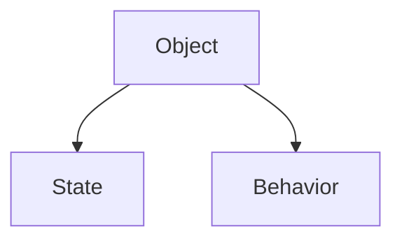

Затем Prototype:

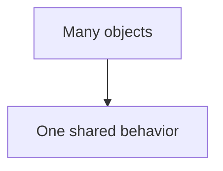

Затем Prototype Chain:

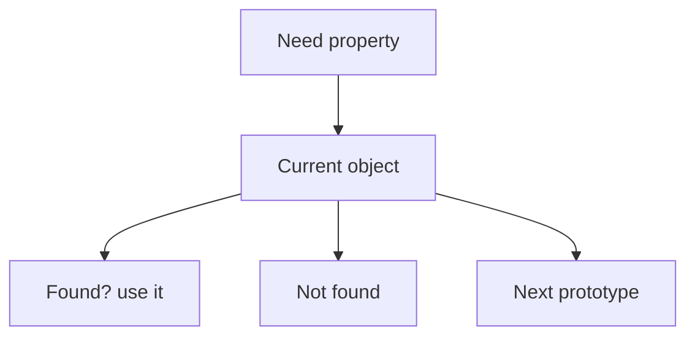

Теперь появляется следующий практический вопрос:

> Как удобно создать много похожих objects, которые имеют own data and shared prototype methods?

Вручную это возможно:

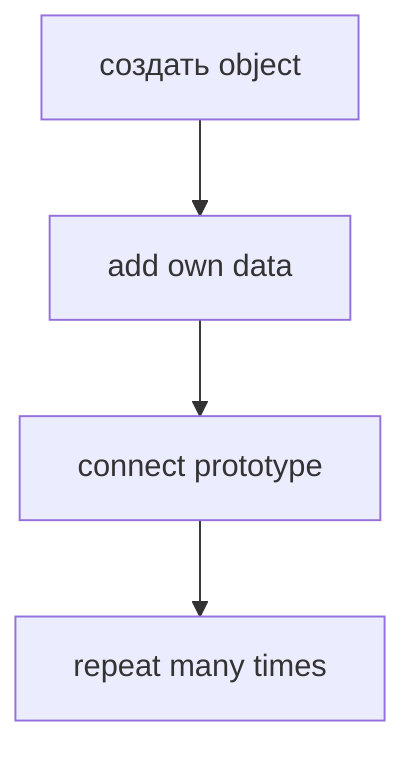

Но repeated setup быстро становится шумным.

Classes дают более удобную форму для этой задачи:

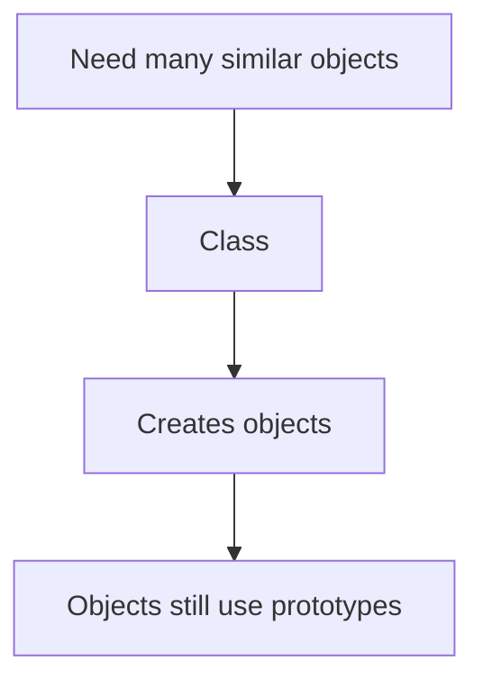

Важно: classes do not replace prototypes. Classes use prototypes.

---

## Предварительные требования

Для этой главы нужно понимать:

* что object can contain own data;
* что methods are function object properties;
* что обычный вызов метода выбирает объект выполнения из формы вызова;
* что prototype is ordinary object used as shared source of properties;
* что Prototype Chain is lookup algorithm;
* что own property wins over inherited property;
* что method location and объект выполнения are different concepts.

Не требуется знать inheritance, `extends`, `super`, private поля, static members, decorators, `instanceof`, advanced constructor поведение or transpilation. Эти темы будут изучаться позже.

---

## Время изучения

Ориентировочное время:

```text
Чтение главы:            150-190 минут
Разбор схем:             70-90 минут
Запуск примеров:         25-35 минут
Практика:                130-160 минут
Повторение материала:    35 минут
```

Уровень сложности: **L4**.

Classes выглядят как новая большая тема, но в этой главе они изучаются как следующий слой над уже понятной моделью: object creation + own data + shared prototype methods.

---

## Навигация

Предыдущая глава:

```text
docs/01-javascript/40-prototype-chain.md
```

Текущая глава:

```text
docs/01-javascript/41-classes.md
```

Следующая глава:

```text
docs/01-javascript/42-class-inheritance.md
```

Следующая глава ответит:

> Как one class can reuse поведение from another class?

---

## Цели обучения

После изучения этой главы вы будете понимать:

* зачем classes появились в JavaScript;
* какую повторяющуюся работу class убирает;
* что такое class declaration;
* зачем нужен constructor;
* что такое instance;
* как создаются own data properties;
* где находятся class methods на высоком уровне;
* почему class does not replace prototype;
* почему class improves readability for repeated object creation;
* как classes применяются in Automation QA architecture.

---

## Мотивация

Начнем не с `class`.

Начнем с проблемы.

Есть Page Объект:

```javascript
const loginPage = {
  name: 'LoginPage',
  url: '/login'
};
```

Есть общее поведение:

```javascript
const pageBehavior = {
  describePage() {
    return `${this.name}: ${this.url}`;
  }
};
```

Можно вручную связать object with prototype:

```javascript
Object.setPrototypeOf(loginPage, pageBehavior);
```

Для одного object это нормально.

Но теперь нужно много pages:

```text
LoginPage
ProfilePage
OrdersPage
SettingsPage
AdminPage
...
```

Для каждого object повторяется setup:

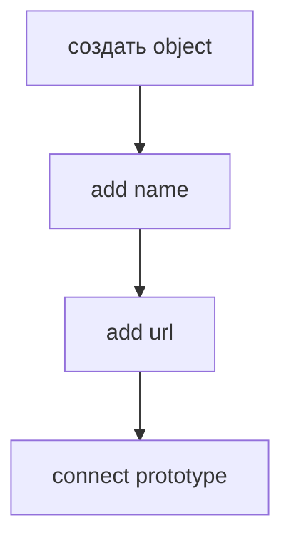

Проблема:

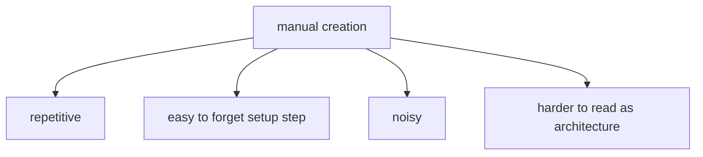

Нужен object recipe:

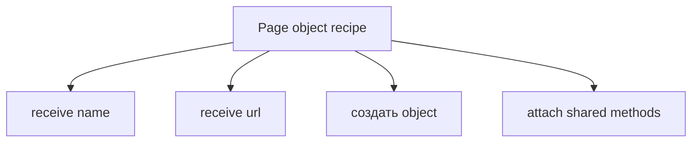

Class gives this recipe a language-level form.

---

## Теория

Class is a convenient syntax for creating similar objects with shared prototype methods.

Главная модель:

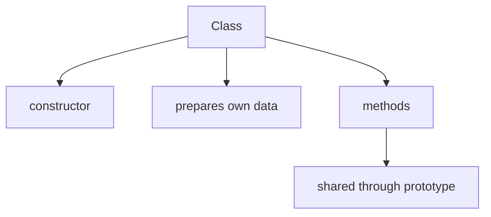

Class declaration:

```javascript
class PageObject {
  constructor(name, url) {
    this.name = name;
    this.url = url;
  }

  describePage() {
    return `${this.name}: ${this.url}`;
  }
}
```

Создание instance:

```javascript
const loginPage = new PageObject('LoginPage', '/login');
```

В этой главе `new` рассматривается только как syntax for creating class instance. Advanced поведение of `new` will be studied later.

Что важно сейчас:

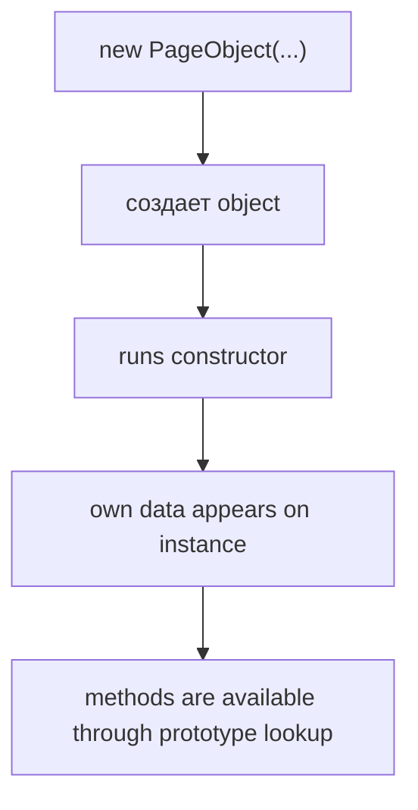

### Constructor

Constructor is special method that runs when new instance is created.

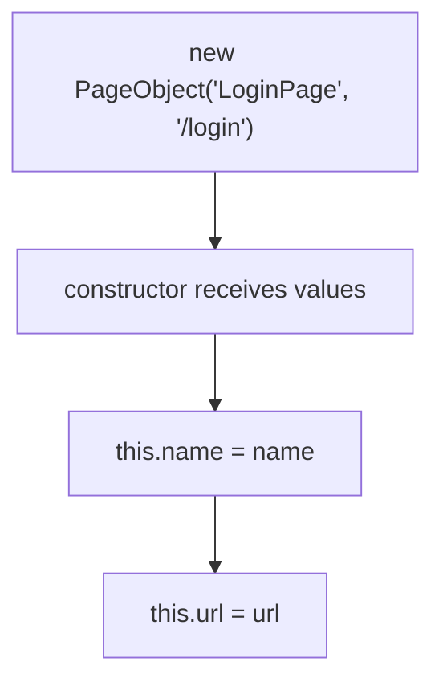

Constructor отвечает:

> What own data should each new object receive?

### Instance

Instance is object created from class.

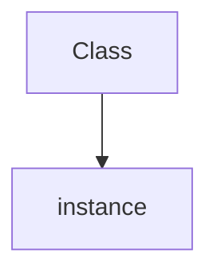

Например:

```javascript
const loginPage = new PageObject('LoginPage', '/login');
const profilePage = new PageObject('ProfilePage', '/profile');
```

Each instance has own data:

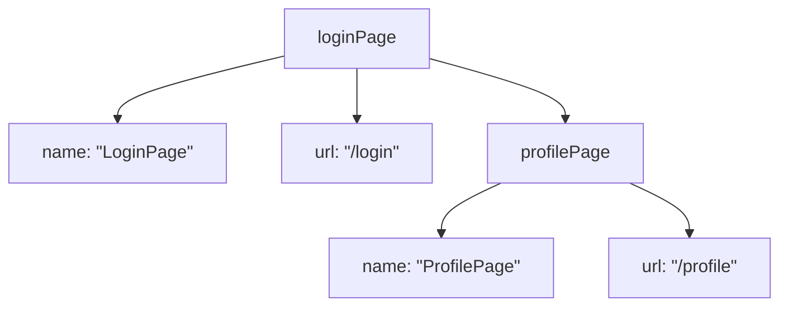

But methods are shared:

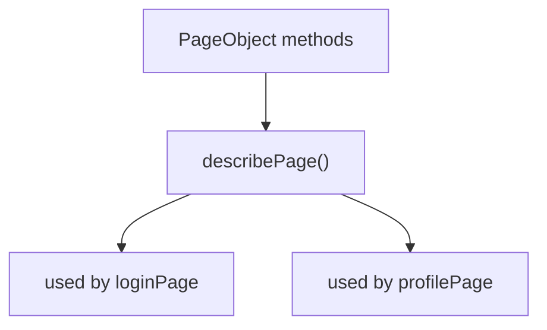

### Relationship with prototypes

Class does not remove prototype lookup.

Модель высокого уровня:

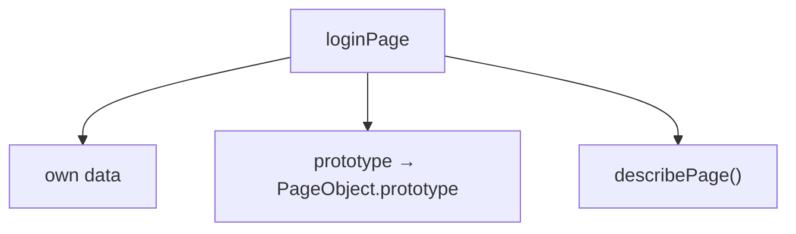

You do not need to manually write `PageObject.prototype` in this chapter.

But you must understand the relationship:

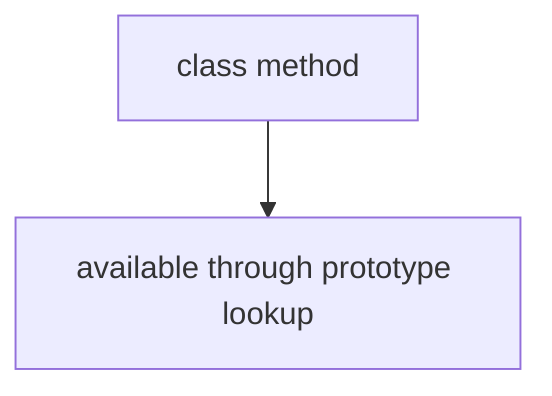

This is why classes fit naturally after Prototype and Prototype Chain.

---

## Внутренний механизм

When JavaScript evaluates:

```javascript
const loginPage = new PageObject('LoginPage', '/login');
```

Mentally:

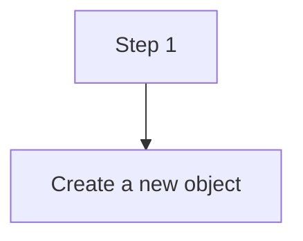

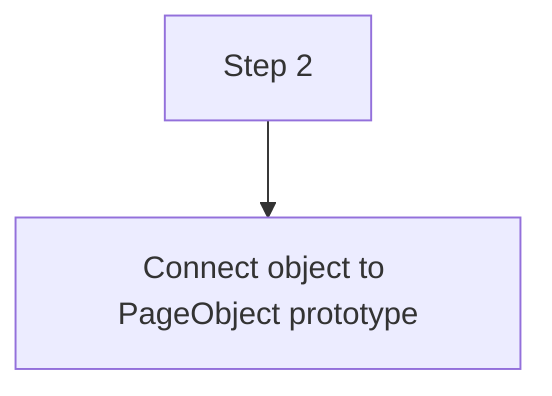

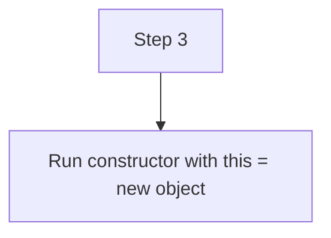

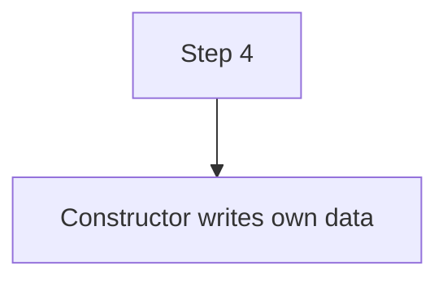

```mermaid
flowchart TD
    N1["Step 5"]
    N2["Variable receives created instance"]
    N1 --> N2
```

After creation:

```mermaid
flowchart TD
    N1["loginPage"]
    N2["own: name"]
    N3["own: url"]
    N4["prototype"]
    N5["describePage()"]
    N1 --> N2
    N1 --> N3
    N1 --> N4
    N4 --> N5
```

When code calls:

```javascript
loginPage.describePage();
```

Lookup still works:

```mermaid
flowchart TD
    N1["Need describePage"]
    N2["Check loginPage"]
    N3["not found as own property"]
    N4["Check PageObject prototype"]
    N5["found"]
    N1 --> N2
    N2 --> N3
    N2 --> N4
    N4 --> N5
```

Напоминание про объект выполнения:

```mermaid
flowchart TD
    N1["loginPage.describePage()"]
    N2["method found through prototype"]
    N3["receiver is loginPage"]
    N1 --> N2
    N1 --> N3
```

Inside method:

```javascript
return `${this.name}: ${this.url}`;
```

`this.name` reads from instance:

```mermaid
flowchart TD
    N1["this"]
    N2["loginPage"]
    N3["name"]
    N4["url"]
    N1 --> N2
    N2 --> N3
    N2 --> N4
```

This is the same model from `this`, Prototype and Prototype Chain chapters.

### Syntactic sugar

After the mental model is clear, we can say the common phrase:

Class syntax is often described as syntactic sugar over prototype-based object creation.

Значение:

```mermaid
flowchart TD
    N1["class"]
    N2["does not создать a separate object model"]
    N3["uses prototype mechanism underneath"]
    N1 --> N2
    N2 --> N3
```

Do not reduce the whole chapter to this phrase. It is useful only after you understand what repetitive work class removes.

---

## Ментальная модель

Class is an object recipe.

Важно отделять учебную аналогию от технического определения.

В этой главе слова `recipe`, `blueprint`, `template`, `factory` and `cookie cutter` используются как mental models.

Они помогают понять назначение classes:

```mermaid
flowchart TD
    N1["need many similar objects"]
    N2["use one creation form"]
    N1 --> N2
```

Но это не формальное определение class в JavaScript.

Мы используем эти аналогии, чтобы увидеть проблему repeated object creation and the role of class syntax. Внутренние детали языка здесь не раскрываются и будут появляться только тогда, когда станут нужны для следующих тем.

```mermaid
flowchart TD
    N1["Class"]
    N2["recipe for similar objects"]
    N1 --> N2
```

Factory blueprint:

```mermaid
flowchart TD
    N1["Blueprint"]
    N2["what data each object gets"]
    N3["what shared methods objects can use"]
    N1 --> N2
    N1 --> N3
```

Cookie cutter:

```mermaid
flowchart TD
    N1["cookie cutter"]
    N2["same shape"]
    N3["many cookies"]
    N1 --> N2
    N1 --> N3
```

Building template:

```mermaid
flowchart TD
    N1["template"]
    N2["common plan"]
    N3["individual buildings"]
    N1 --> N2
    N1 --> N3
```

Production line:

```mermaid
flowchart TD
    N1["production line"]
    N2["input data"]
    N3["создать object"]
    N4["output instance"]
    N1 --> N2
    N1 --> N3
    N1 --> N4
```

Важное различие:

```mermaid
flowchart TD
    N1["Class"]
    N2["template"]
    N3["Instance"]
    N4["actual object"]
    N1 --> N2
    N1 --> N3
    N3 --> N4
```

---

## Примеры кода

Примеры находятся в:

```text
examples/01-javascript/chapter-41/
```

Запуск:

```bash
node examples/01-javascript/chapter-41/01-first-class.js
```

### Пример 1. First class

Файл:

```text
examples/01-javascript/chapter-41/01-first-class.js
```

Показывает minimal class and instance creation.

### Пример 2. Constructor

Файл:

```text
examples/01-javascript/chapter-41/02-constructor.js
```

Показывает how constructor writes own data.

### Пример 3. Methods

Файл:

```text
examples/01-javascript/chapter-41/03-methods.js
```

Показывает shared methods used by different instances.

### Пример 4. Prototype reminder

Файл:

```text
examples/01-javascript/chapter-41/04-prototype-reminder.js
```

Показывает high-level relationship between class method and prototype lookup.

### Пример 5. Типичные ошибки

Файл:

```text
examples/01-javascript/chapter-41/05-common-mistakes.js
```

Показывает mistake: forgetting `this` inside class method.

### Пример 6. QA example

Файл:

```text
examples/01-javascript/chapter-41/06-qa-example.js
```

Показывает API client class with own config and shared methods.

---

## Частые вопросы

### Class заменяет prototype?

Нет.

Class does not replace prototype. Class uses prototype.

```mermaid
flowchart TD
    N1["class method"]
    N2["available through prototype lookup"]
    N1 --> N2
```

### JavaScript стал class-based language?

Нет.

В этой главе важно не менять mental model. Objects still use prototypes.

### Constructor - это обычный method?

Constructor has special role during instance creation. It runs when the new instance is created and prepares own data.

Advanced constructor поведение будет изучаться позже.

### Methods inside class copied into every instance?

Нет.

Модель высокого уровня:

```mermaid
flowchart TD
    N1["instances"]
    N2["own data"]
    N3["shared methods through prototype"]
    N1 --> N2
    N1 --> N3
```

### Нужно ли всегда использовать classes?

Нет.

Classes useful when you need many similar objects. For one small object, object literal may be clearer.

---

## Распространенные мифы

### Миф: class создает новый object model

Реальность: class gives convenient syntax over prototype-based object creation.

### Миф: class methods are copied to every instance

Реальность: methods are shared through prototype lookup.

### Миф: constructor is for business logic

Реальность: constructor should primarily initialize the new object. Heavy business logic makes instances harder to create and test.

### Миф: classes are required for Automation QA

Реальность: classes are useful for Page Objects and framework objects, but not every helper must be a class.

---

## Типичные ошибки

### Ошибка 1. Забыть `new`

Неправильный код:

```javascript
const loginPage = PageObject('LoginPage', '/login');
```

Что произошло:

`class` must be called with `new`.

Исправленный вариант:

```javascript
const loginPage = new PageObject('LoginPage', '/login');
```

Почему:

Class describes how to create instance. `new` starts instance creation.

### Ошибка 2. Забыть `this` inside method

Неправильный код:

```javascript
class PageObject {
  constructor(name) {
    this.name = name;
  }

  describePage() {
    return name;
  }
}
```

Что произошло:

`name` is variable lookup, not instance property lookup.

Исправленный вариант:

```javascript
describePage() {
  return this.name;
}
```

### Ошибка 3. Думать, что class method is own property

Неправильная модель:

```mermaid
flowchart TD
    N1["instance"]
    N2["own method copy"]
    N1 --> N2
```

Правильная модель:

```mermaid
flowchart TD
    N1["instance"]
    N2["prototype"]
    N3["method"]
    N1 --> N2
    N2 --> N3
```

### Ошибка 4. Перегружать constructor

Неправильная модель:

```mermaid
flowchart TD
    N1["constructor"]
    N2["создать object"]
    N3["send API request"]
    N4["read files"]
    N5["assert result"]
    N1 --> N2
    N1 --> N3
    N1 --> N4
    N1 --> N5
```

Почему плохо:

Instance creation becomes unpredictable.

Исправленная модель:

```mermaid
flowchart TD
    N1["constructor"]
    N2["initialize object data"]
    N1 --> N2
```

---

## Практическое использование

Use class when:

```mermaid
flowchart TD
    N1["many similar objects"]
    N2["same structure"]
    N3["similar own data"]
    N4["shared behavior"]
    N1 --> N2
    N1 --> N3
    N1 --> N4
```

Примеры:

* Page Objects;
* API clients;
* validators;
* request builders;
* configuration wrappers;
* framework service objects.

Do not use class only because it looks serious.

```mermaid
flowchart TD
    N1["single simple object"]
    N2["object literal may be enough"]
    N1 --> N2
```

Good class design:

```mermaid
flowchart TD
    N1["constructor"]
    N2["clear data initialization"]
    N3["methods"]
    N4["meaningful behavior"]
    N1 --> N2
    N1 --> N3
    N3 --> N4
```

---

## Использование в Automation QA

### Page Objects

Page Objects are natural class candidates:

```mermaid
flowchart TD
    N1["class LoginPage"]
    N2["own data"]
    N3["page"]
    N4["url"]
    N5["methods"]
    N6["open()"]
    N7["login()"]
    N1 --> N2
    N1 --> N3
    N1 --> N4
    N1 --> N5
    N5 --> N6
    N5 --> N7
```

This creates readable test code:

```javascript
const loginPage = new LoginPage('/login');
```

### API clients

API client class can keep environment config as own data:

```mermaid
flowchart TD
    N1["ApiClient instance"]
    N2["own baseUrl"]
    N3["shared request methods"]
    N1 --> N2
    N1 --> N3
```

### Reusable validators

Validator class:

```mermaid
flowchart TD
    N1["StatusValidator"]
    N2["expected"]
    N3["actual"]
    N4["isValid()"]
    N1 --> N2
    N1 --> N3
    N1 --> N4
```

### Request builders

Request builder class can collect request data and provide methods for building payloads.

Detailed builder patterns will appear later in Automation QA architecture sections.

### Framework objects

Classes help make framework objects explicit:

```text
Reporter
ConfigProvider
ApiClient
DatabaseClient
PageObject
```

But they should still be small and readable.

---

## Диаграммы главы

### 1. Why classes exist

```mermaid
flowchart TD
    N1["many similar objects"]
    N2["repeated setup"]
    N3["class"]
    N1 --> N2
    N1 --> N3
```

### 2. Manual creation

```mermaid
flowchart TD
    N1["создать object"]
    N2["set data"]
    N3["connect prototype"]
    N1 --> N2
    N2 --> N3
```

### 3. Repeated setup

```text
object A setup
object B setup
object C setup
```

### 4. Class template

```mermaid
flowchart TD
    N1["Class"]
    N2["constructor"]
    N3["methods"]
    N1 --> N2
    N1 --> N3
```

### 5. Instance creation

```mermaid
flowchart TD
    N1["Class"]
    N2["new instance"]
    N1 --> N2
```

### 6. Constructor

```mermaid
flowchart TD
    N1["constructor"]
    N2["initializes own data"]
    N1 --> N2
```

### 7. Methods

```mermaid
flowchart TD
    N1["class methods"]
    N2["shared behavior"]
    N1 --> N2
```

### 8. Prototype reminder

```mermaid
flowchart TD
    N1["instance"]
    N2["prototype"]
    N3["class methods"]
    N1 --> N2
    N2 --> N3
```

### 9. Текущая модель JavaScript

```mermaid
flowchart TD
    N1["Objects"]
    N2["Prototype"]
    N3["Prototype Chain"]
    N4["Classes"]
    N1 --> N2
    N1 --> N3
    N1 --> N4
```

### 10. Object creation flow

```mermaid
flowchart TD
    N1["new Class(args)"]
    N2["создать object"]
    N3["run constructor"]
    N1 --> N2
    N2 --> N3
```

### 11. QA Page Object example

```mermaid
flowchart TD
    N1["LoginPage instance"]
    N2["own url"]
    N3["shared methods"]
    N1 --> N2
    N1 --> N3
```

### 12. API client example

```mermaid
flowchart TD
    N1["ApiClient"]
    N2["baseUrl"]
    N3["request()"]
    N1 --> N2
    N1 --> N3
```

### 13. Test user example

```mermaid
flowchart TD
    N1["TestUser"]
    N2["email"]
    N3["role"]
    N4["describe()"]
    N1 --> N2
    N1 --> N3
    N1 --> N4
```

### 14. Читаемость

```mermaid
flowchart TD
    N1["Class name"]
    N2["communicates object purpose"]
    N1 --> N2
```

### 15. Типичные ошибки

```mermaid
flowchart TD
    N1["class without new"]
    N2["error"]
    N1 --> N2
```

### 16. Blueprint analogy

```mermaid
flowchart TD
    N1["blueprint"]
    N2["many buildings"]
    N1 --> N2
```

### 17. Cookie cutter analogy

```mermaid
flowchart TD
    N1["cutter"]
    N2["many cookies"]
    N1 --> N2
```

### 18. Factory analogy

```mermaid
flowchart TD
    N1["factory"]
    N2["production output"]
    N1 --> N2
```

### 19. Recipe analogy

```mermaid
flowchart TD
    N1["recipe"]
    N2["prepared object"]
    N1 --> N2
```

### 20. Constructor flow

```mermaid
flowchart TD
    N1["arguments"]
    N2["constructor"]
    N3["own properties"]
    N1 --> N2
    N2 --> N3
```

### 21. Instance lifecycle

```mermaid
flowchart TD
    N1["create"]
    N2["initialize"]
    N3["use methods"]
    N1 --> N2
    N2 --> N3
```

### 22. Shared methods

```mermaid
flowchart TD
    N1["method"]
    N2["instance A"]
    N3["instance B"]
    N1 --> N2
    N1 --> N3
```

### 23. Own data

```mermaid
flowchart TD
    N1["instance"]
    N2["own name"]
    N3["own url"]
    N1 --> N2
    N1 --> N3
```

### 24. Prototype behind class

```mermaid
flowchart TD
    N1["class method"]
    N2["prototype"]
    N1 --> N2
```

### 25. Class to prototype

```mermaid
flowchart TD
    N1["Class"]
    N2["prototype with methods"]
    N1 --> N2
```

### 26. Object relationship

```mermaid
flowchart TD
    N1["instance"]
    N2["linked to class prototype"]
    N1 --> N2
```

### 27. Краткая ментальная модель

```mermaid
flowchart TD
    N1["Class"]
    N2["Object template"]
    N3["Many similar objects"]
    N1 --> N2
    N2 --> N3
```

### 28. Complete class model

```mermaid
flowchart TD
    N1["Class"]
    N2["constructor → own data"]
    N3["methods → prototype"]
    N1 --> N2
    N1 --> N3
```

### 29. Build process

```mermaid
flowchart TD
    N1["input values"]
    N2["constructor"]
    N3["instance"]
    N1 --> N2
    N2 --> N3
```

### 30. Receiver reminder

```mermaid
flowchart TD
    N1["instance.method()"]
    N2["receiver is instance"]
    N1 --> N2
```

### 31. Constructor execution

```mermaid
flowchart TD
    N1["new"]
    N2["constructor runs"]
    N1 --> N2
```

### 32. Shared поведение reuse

```mermaid
flowchart TD
    N1["one method"]
    N2["many instances"]
    N1 --> N2
```

### 33. Переход к Inheritance

```mermaid
flowchart TD
    N1["Class"]
    N2["next: reuse behavior between classes"]
    N1 --> N2
```

### 34. Переход к extends

```mermaid
flowchart TD
    N1["next chapter"]
    N2["extends"]
    N1 --> N2
```

### 35. Object evolution

```mermaid
flowchart TD
    N1["object literal"]
    N2["prototype"]
    N3["class"]
    N1 --> N2
    N2 --> N3
```

### 36. Production line

```mermaid
flowchart TD
    N1["same class"]
    N2["object 1"]
    N3["object 2"]
    N4["object 3"]
    N1 --> N2
    N1 --> N3
    N1 --> N4
```

### 37. Object identity

```mermaid
flowchart TD
    N1["instance A"]
    N2["≠"]
    N3["instance B"]
    N1 --> N2
    N2 --> N3
```

### 38. Prototype lookup still works

```mermaid
flowchart TD
    N1["instance method call"]
    N2["prototype lookup"]
    N1 --> N2
```

### 39. Hidden prototype

```mermaid
flowchart TD
    N1["class syntax"]
    N2["prototype mechanism underneath"]
    N1 --> N2
```

### 40. Итоговая схема

```mermaid
flowchart TD
    N1["Need many similar objects"]
    N2["Class"]
    N3["Creates instances"]
    N4["Instances have own data"]
    N5["Methods are shared through prototype"]
    N1 --> N2
    N2 --> N3
    N3 --> N4
    N4 --> N5
```

---

## Итоги

Classes appear after Prototype and Prototype Chain naturally.

Prototype showed:

```mermaid
flowchart TD
    N1["many objects"]
    N2["shared behavior"]
    N1 --> N2
```

Prototype Chain showed:

```mermaid
flowchart TD
    N1["method lookup"]
    N2["through prototypes"]
    N1 --> N2
```

Classes answer:

```text
How to create many similar objects more conveniently?
```

Class gives object creation a readable template:

```mermaid
flowchart TD
    N1["Class"]
    N2["constructor"]
    N3["own data"]
    N4["methods"]
    N5["shared through prototype"]
    N1 --> N2
    N1 --> N3
    N1 --> N4
    N4 --> N5
```

Classes do not replace prototypes. Classes use prototypes.

The next chapter will explain class inheritance: how one class can reuse поведение from another class.

---

## Что нужно запомнить

✓ Class is a convenient template for creating similar objects.

✓ Constructor runs during instance creation.

✓ Constructor usually initializes own data.

✓ Instance is object created from class.

✓ Class methods are shared through prototype lookup.

✓ Classes do not replace prototypes.

✓ Classes use prototypes.

✓ `this` inside method refers to объект выполнения during ordinary invocation.

✓ Use classes when repeated object creation becomes clearer.

✓ Inheritance is a separate topic for the next chapter.

---

## Проверьте себя

1. What repetitive work does class remove?

2. What does constructor usually do?

3. What is an instance?

4. Where does instance own data live?

5. Are class methods copied into every instance?

6. Why does class not replace prototypes?

7. What does `new Class(...)` start?

8. Why should constructor not contain too much business logic?

9. How are classes useful for Page Objects?

10. What topic comes next after classes?

---

## Практика

Практические задания находятся в отдельном файле:

```text
practice/01-javascript/41-classes.md
```

---

## Решения

Решения находятся в отдельном файле:

```text
solutions/01-javascript/41-classes.md
```

Сначала выполните практику самостоятельно. Затем сравните ход рассуждения, а не только итоговый ответ.
