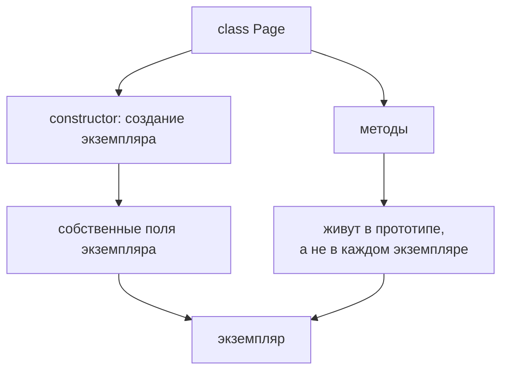

# Классы

## Связь с предыдущей главой

Предыдущие главы объяснили три связанные идеи.

Сначала Object Methods:

Затем Prototype Chain:

Теперь появляется следующий практический вопрос:

> Как удобно создать много похожих objects, которые имеют own data and shared prototype methods?

Вручную это возможно:

Но repeated setup быстро становится шумным.

Classes дают более удобную форму для этой задачи:

Важно: classes do not replace prototypes. Classes use prototypes.

---

## Предварительные требования

Для этой главы нужно понимать:

* что object can contain own data;
* что methods are function object properties;
* что обычный вызов метода выбирает объект выполнения из формы вызова;
* что prototype is ordinary object used as shared source of properties;
* что Prototype Chain is lookup algorithm;
* что own property wins over inherited property;
* что method location and объект выполнения are different concepts.

Не требуется знать inheritance, `extends`, `super`, private поля, static members, decorators, `instanceof`, advanced constructor поведение or transpilation. Эти темы будут изучаться позже.

---

## Время изучения

Ориентировочное время:

```text
Чтение главы:            150-190 минут
Разбор схем:             70-90 минут
Запуск примеров:         25-35 минут
Практика:                130-160 минут
Повторение материала:    35 минут
```

Уровень сложности: **L4**.

Classes выглядят как новая большая тема, но в этой главе они изучаются как следующий слой над уже понятной моделью: object creation + own data + shared prototype methods.

---

## Навигация

Предыдущая глава:

```text
docs/01-javascript/40-prototype-chain.md
```

Текущая глава:

```text
docs/01-javascript/41-classes.md
```

Следующая глава:

```text
docs/01-javascript/42-class-inheritance.md
```

Следующая глава ответит:

> Как one class can reuse поведение from another class?

---

## Цели обучения

После изучения этой главы вы будете понимать:

* зачем classes появились в JavaScript;
* какую повторяющуюся работу class убирает;
* что такое class declaration;
* зачем нужен constructor;
* что такое instance;
* как создаются own data properties;
* где находятся class methods на высоком уровне;
* почему class does not replace prototype;
* почему class improves readability for repeated object creation;
* как classes применяются in Automation QA architecture.

---

## Мотивация

Начнем не с `class`.

Начнем с проблемы.

Есть Page Объект:

```javascript
const loginPage = {
  name: 'LoginPage',
  url: '/login'
};
```

Есть общее поведение:

```javascript
const pageBehavior = {
  describePage() {
    return `${this.name}: ${this.url}`;
  }
};
```

Можно вручную связать object with prototype:

```javascript
Object.setPrototypeOf(loginPage, pageBehavior);
```

Для одного object это нормально.

Но теперь нужно много pages:

```text
LoginPage
ProfilePage
OrdersPage
SettingsPage
AdminPage
...
```

Для каждого object повторяется setup:

Проблема:

Нужен object recipe:

Class gives this recipe a language-level form.

---

## Теория

Класс — удобная запись для создания похожих объектов с общими методами в прототипе.

Главная модель: `class` — это удобная запись для создания объектов с общим поведением.

Объявление класса:

```javascript
class PageObject {
  constructor(name, url) {
    this.name = name;
    this.url = url;
  }

  describePage() {
    return `${this.name}: ${this.url}`;
  }
}
```

Создание экземпляра:

```javascript
const loginPage = new PageObject('LoginPage', '/login');
```

В этой главе `new` рассматривается только как запись для создания экземпляра. Более сложное его поведение будет изучаться позже.

Что важно сейчас:

```text
class     —  описание, как устроен объект такого вида
new       —  создание одного конкретного объекта по этому описанию
```

Само описание объектов не создаёт: их создаёт каждый вызов `new`.

### Конструктор

Конструктор — особый метод, который выполняется при создании нового экземпляра.

Конструктор отвечает на вопрос:

> Какие собственные данные должен получить каждый новый объект?

### Экземпляр

Экземпляр — объект, созданный по классу.

Например:

```javascript
const loginPage = new PageObject('LoginPage', '/login');
const profilePage = new PageObject('ProfilePage', '/profile');
```

У каждого экземпляра свои данные:

```text
loginPage    →  name: 'LoginPage',   path: '/login'
profilePage  →  name: 'ProfilePage', path: '/profile'
```

Но методы общие:

```text
метод describe существует в одном экземпляре
и работает с данными того объекта, через который вызван
```

### Связь с прототипами

Класс не отменяет поиск по прототипу.

Модель высокого уровня:

```text
class  →  конструктор + методы в prototype
```

Писать `PageObject.prototype` вручную в этой главе не нужно.

Но связь понимать обязательно:

Именно поэтому классы естественно идут после прототипа и цепочки прототипов.

---

`class` — это запись поверх прототипов:


```mermaid
flowchart TD
    A["class Page"] --> B["constructor: создание экземпляра"]
    B --> C["собственные поля экземпляра"]
    A --> D["методы"]
    D --> E["живут в прототипе,<br/>а не в каждом экземпляре"]
    C --> F["экземпляр"]
    E --> F
```

## Внутренний механизм

Когда JavaScript вычисляет:

```javascript
const loginPage = new PageObject('LoginPage', '/login');
```

Мысленно происходит следующее:

```text
1. создан пустой объект
2. его прототипом назначен PageObject.prototype
3. вызван constructor с this = этот объект
4. constructor записал name и url как СОБСТВЕННЫЕ свойства
5. объект возвращён и связан с именем loginPage
```

После создания собственные данные лежат в экземпляре, а методы — в прототипе:

```text
loginPage             name: 'LoginPage', url: '/login'
  └─ прототип         describePage()
```

Когда код вызывает:

```javascript
loginPage.describePage();
```

Поиск по-прежнему работает по цепочке: в самом `loginPage` метода нет, он
находится в прототипе.

Напоминание про объект выполнения: `this` определяет форма вызова, а не место
хранения метода — слева от точки стоит `loginPage`, он и станет `this`.

Внутри метода:

```javascript
return `${this.name}: ${this.url}`;
```

`this.name` читается из экземпляра — из собственных свойств того объекта, через
который метод вызвали. Поэтому один метод в прототипе обслуживает сколько угодно
страниц.

Это та же модель, что в главах про `this`, прототип и цепочку прототипов.

### Синтаксический сахар

Когда мысленная модель ясна, можно произнести и расхожую фразу:

Запись класса часто называют синтаксическим сахаром над созданием объектов через прототипы.

Значение этой фразы конкретное: `class` не добавил нового механизма. Тот же
результат достижим через функцию-конструктор и `prototype` — класс лишь убирает
повторяющуюся ручную работу и делает намерение видимым.

Не сводите всю главу к этой фразе. Она полезна только после того, как понятно, какую повторяющуюся работу класс убирает.

---

## Ментальная модель

Класс — это рецепт объекта.

Важно отделять учебную аналогию от технического определения.

В этой главе слова «рецепт», «чертёж», «шаблон», «фабрика» и «форма для печенья» используются как мысленные модели.

Они помогают понять назначение классов:

Но это не формальное определение класса в JavaScript.

Мы используем эти аналогии, чтобы увидеть задачу повторяющегося создания объектов и роль записи класса. Внутренние детали языка здесь не раскрываются и появятся только тогда, когда понадобятся для следующих тем.

Чертёж, форма для печенья, проект здания, производственная линия — все эти
модели говорят об одном: описание создаётся один раз, а объекты по нему —
много раз.

Важное различие: чертёж не является зданием. Класс — это описание, экземпляр —
результат его применения. Свойства принадлежат экземпляру, а методы обычно
лежат в прототипе и существуют в одном экземпляре на всех.

---

## Примеры кода

Примеры находятся в:

```text
examples/01-javascript/chapter-41/
```

Запуск:

```bash
node examples/01-javascript/chapter-41/01-first-class.js
```

### Пример 1. Первый класс

Файл:

```text
examples/01-javascript/chapter-41/01-first-class.js
```

Показывает минимальный класс и создание экземпляра.

### Пример 2. Конструктор

Файл:

```text
examples/01-javascript/chapter-41/02-constructor.js
```

Показывает, как конструктор записывает собственные данные.

### Пример 3. Методы

Файл:

```text
examples/01-javascript/chapter-41/03-methods.js
```

Показывает общие методы, используемые разными экземплярами.

### Пример 4. Напоминание о прототипе

Файл:

```text
examples/01-javascript/chapter-41/04-prototype-reminder.js
```

Показывает на высоком уровне связь между методом класса и поиском по прототипу.

### Пример 5. Типичные ошибки

Файл:

```text
examples/01-javascript/chapter-41/05-common-mistakes.js
```

Показывает ошибку: забытый `this` внутри метода класса.

### Пример 6. Пример из автоматизации тестов

Файл:

```text
examples/01-javascript/chapter-41/06-qa-example.js
```

Показывает класс клиента API со своей настройкой и общими методами.

---

## Частые вопросы

### Класс заменяет прототип?

Нет.

Класс не заменяет прототип. Класс его использует.

### JavaScript стал языком на основе классов?

Нет.

В этой главе важно не менять мысленную модель. Объекты по-прежнему используют прототипы.

### Конструктор — это обычный метод?

У конструктора особая роль при создании экземпляра. Он выполняется при создании нового объекта и готовит его собственные данные.

Более сложное поведение конструктора будет изучаться позже.

Методы внутри класса копируются в каждый экземпляр?

Нет.

Модель высокого уровня:

```text
new ClassName()  →  создать объект  →  выполнить конструктор  →  вернуть объект
```

### Нужно ли всегда использовать классы?

Нет.

Классы полезны, когда нужно много похожих объектов. Для одного небольшого объекта литерал может быть понятнее.

---

## Распространённые мифы

### Миф: класс создаёт новую модель объектов

Реальность: класс даёт удобную запись над созданием объектов через прототипы.

### Миф: методы класса копируются в каждый экземпляр

Реальность: методы общие и доступны через поиск по прототипу.

### Миф: конструктор нужен для бизнес-логики

Реальность: конструктор должен прежде всего подготовить новый объект. Тяжёлая логика усложняет создание экземпляров и их проверку.

### Миф: классы обязательны в автоматизации тестов

Реальность: классы полезны для объектов страниц и объектов фреймворка, но не каждая вспомогательная функция должна быть классом.

---

## Распространённые ошибки

### Ошибка 1. Забыть `new`

Неправильный код:

```javascript
const loginPage = PageObject('LoginPage', '/login');
```

Что произошло:

`class` нужно вызывать через `new`.

Исправленный вариант:

```javascript
const loginPage = new PageObject('LoginPage', '/login');
```

Почему:

Класс описывает, как создать экземпляр. `new` запускает создание.

### Ошибка 2. Забыть `this` внутри метода

Неправильный код:

```javascript
class PageObject {
  constructor(name) {
    this.name = name;
  }

  describePage() {
    return name;
  }
}
```

Что произошло:

Это поиск переменной, а не свойства экземпляра.

Исправленный вариант:

```javascript
describePage() {
  return this.name;
}
```

### Ошибка 3. Думать, что метод класса — собственное свойство

Неправильная модель: будто `class` вводит в JavaScript принципиально новый механизм наследования.

Правильная модель: за классом стоит тот же прототип, только с более удобным синтаксисом.

### Ошибка 4. Перегружать конструктор

Неправильная модель: будто методы класса копируются в каждый созданный объект.

Почему плохо:

Создание экземпляра становится непредсказуемым.

Исправленная модель: конструктор только принимает зависимости и записывает
состояние. Сетевые запросы, чтение файлов и обращения к стенду выполняются
отдельными методами — тогда создание объекта дёшево и не может упасть.

---

## Практическое использование

Используйте класс, когда нужно создавать много похожих объектов: у них общее
поведение и своя настройка.

Примеры:

* объекты страниц;
* клиенты API;
* проверки;
* построители запросов;
* обёртки конфигурации;
* служебные объекты фреймворка.

Не используйте класс только потому, что он выглядит солиднее.

Признаки хорошего класса простые: у него есть состояние, которое живёт между
вызовами методов, и несколько операций над этим состоянием. Если состояния нет
и метод один, обычная функция читается лучше.

---

## Использование в Automation QA

### Объекты страниц

Объекты страниц — естественные кандидаты на класс:

```text
у каждой страницы своё состояние — адрес и элементы,
а поведение (открыть, заполнить, проверить) одинаково по форме
```

Так получается читаемый код теста:

```javascript
const loginPage = new LoginPage('/login');
```

### Клиенты API

Класс клиента API может хранить настройку окружения как свои данные:

```javascript
class ApiClient {
  constructor(baseUrl) {
    this.baseUrl = baseUrl;
  }

  buildUrl(path) {
    return this.baseUrl + path;
  }
}
```

### Переиспользуемые проверки

Класс проверки:

```javascript
class StatusValidator {
  constructor(expectedStatus) {
    this.expectedStatus = expectedStatus;
  }

  check(actualStatus) {
    return actualStatus === this.expectedStatus;
  }
}
```

Ожидаемое значение задаётся один раз при создании, а проверка вызывается
сколько угодно раз.

### Построители запросов

Класс-сборщик запроса может собирать данные запроса и предоставлять методы для построения тела.

Подробные приёмы сборки появятся позже, в разделах про архитектуру фреймворка.

### Объекты фреймворка

Классы помогают сделать объекты фреймворка явными:

```text
Reporter
ConfigProvider
ApiClient
DatabaseClient
PageObject
```

Но они всё равно должны оставаться маленькими и читаемыми.

---

## Итоги

Классы естественно появляются после прототипа и цепочки прототипов.

Прототип показал, где лежит общее поведение.

Цепочка прототипов показала, как идёт поиск, если свойства нет ни в объекте, ни в
его прототипе.

Классы отвечают на следующий вопрос:

```text
как удобнее создавать много похожих объектов?
```

Класс даёт созданию объектов читаемый шаблон: конструктор задаёт собственные
данные, методы класса попадают в прототип и остаются общими.

Классы не заменяют прототипы. Классы их используют.

Следующая глава объяснит наследование классов: как один класс может переиспользовать поведение другого.

---

## Что нужно запомнить

✓ Класс — удобный шаблон для создания похожих объектов.

✓ Конструктор выполняется при создании экземпляра.

✓ Конструктор обычно задаёт собственные данные.

✓ Экземпляр — объект, созданный по классу.

✓ Методы класса общие и доступны через поиск по прототипу.

✓ Классы не заменяют прототипы.

✓ Классы используют прототипы.

✓ `this` внутри метода при обычном вызове указывает на объект выполнения.

✓ Используйте классы, когда повторяющееся создание объектов становится от этого понятнее.

✓ Наследование — отдельная тема следующей главы.

---

## Проверьте себя

1. Какую повторяющуюся работу убирает класс?

2. Что обычно делает конструктор?

3. Что такое экземпляр?

4. Где живут собственные данные экземпляра?

5. Копируются ли методы класса в каждый экземпляр?

6. Почему класс не заменяет прототипы?

7. Что запускает `new Class(...)`?

8. Почему конструктор не должен содержать много бизнес-логики?

9. Чем классы полезны для объектов страниц?

10. Какая тема идёт после классов?

### Ответы

1. Ручное создание одинаково устроенных объектов и ручную привязку общего поведения: класс описывает и то и другое один раз.
2. Задаёт собственные данные нового объекта: записывает в него значения, переданные при создании.
3. Объект, созданный по классу через `new`.
4. В самом объекте — это его собственные свойства.
5. Нет. Методы лежат в одном месте, а экземпляры доходят до них по цепочке прототипов.
6. Класс — более удобная запись того же механизма. Поиск методов по-прежнему идёт по цепочке прототипов.
7. Создание нового объекта: он создаётся, выполняется конструктор, и готовый объект возвращается.
8. Конструктор отвечает за готовность объекта к работе. Если в нём делаются запросы и вычисления, создание объекта перестаёт быть предсказуемым, а проверить такой класс становится трудно.
9. У каждой страницы своё состояние — адрес, элементы, — а набор действий по форме одинаков. Класс описывает действия один раз, а состояние задаёт при создании.
10. Наследование классов: как один класс переиспользует поведение другого.

---

## Практика

Практические задания находятся в отдельном файле:

```text
practice/01-javascript/41-classes.md
```

---

## Решения

Решения находятся в отдельном файле:

```text
solutions/01-javascript/41-classes.md
```

Сначала выполните практику самостоятельно. Затем сравните ход рассуждения, а не только итоговый ответ.
