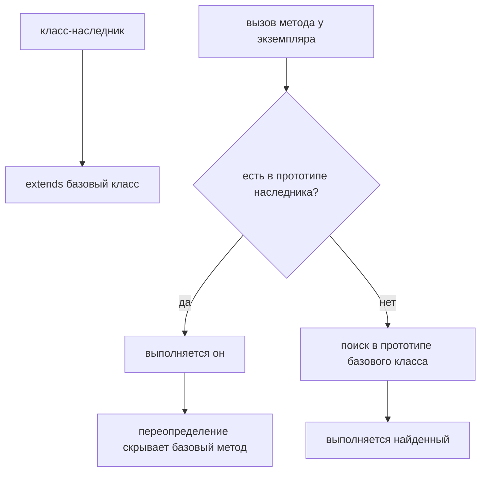

# Class Inheritance

## Связь с предыдущей главой

Предыдущая глава объяснила Classes.

Главная модель была такой: класс задаёт конструктор и общее поведение для создаваемых объектов.

Мы специально не представляли class как новую объектную модель.

Главная мысль была:

Теперь появляется следующий вопрос:

> Что если несколько classes нуждаются в одинаковом поведение?

Например, в Automation QA есть разные page classes:

```text
LoginPage
ProfilePage
OrdersPage
SettingsPage
```

И каждая повторяет:

```text
open()
waitReady()
formatError()
```

Вопрос:

> Should every class copy identical methods?

Class Inheritance отвечает:

Важно: inheritance does not replace prototypes. Inheritance builds on prototype lookup.

---

## Предварительные требования

Для этой главы нужно понимать:

* что class creates instances;
* что class methods are shared through prototype lookup;
* что Prototype Chain is lookup algorithm;
* что own property or closer method wins;
* что method location and объект выполнения are different concepts;
* что ordinary `object.method()` call uses object before dot as объект выполнения;
* что class mental models are pedagogical analogies, not formal definitions.

Не требуется знать `super`, constructor inheritance, private поля, static members, `instanceof`, mixins, composition vs inheritance or advanced prototype internals. Эти темы будут изучаться позже.

---

## Время изучения

Ориентировочное время:

```text
Чтение главы:            150-190 минут
Разбор схем:             70-90 минут
Запуск примеров:         25-35 минут
Практика:                130-160 минут
Повторение материала:    35 минут
```

Уровень сложности: **L4**.

Class Inheritance легко превратить в разговор о большой архитектуре. В этой главе мы держим фокус уже: duplicated class methods and поведение reuse through prototype lookup.

---

## Навигация

Предыдущая глава:

```text
docs/01-javascript/41-classes.md
```

Текущая глава:

```text
docs/01-javascript/42-class-inheritance.md
```

Следующая глава:

```text
docs/01-javascript/43-super.md
```

Следующая глава ответит:

> How can a derived class call поведение from its base class?

---

## Цели обучения

После изучения этой главы вы будете понимать:

* зачем inheritance существует;
* какую проблему решает duplicated class поведение;
* что такое base class;
* что такое derived class;
* зачем нужен `extends`;
* как derived class получает inherited methods;
* как работает method overriding на базовом уровне;
* как inheritance связано с Prototype Chain;
* почему inheritance не копирует methods;
* где inheritance полезен in Automation QA architecture.

---

## Мотивация

Начнем с проблемы.

Есть несколько page classes:

```javascript
class LoginPage {
  open() {
    return 'open page';
  }

  waitReady() {
    return 'wait until page is ready';
  }

  login() {
    return 'submit login form';
  }
}

class ProfilePage {
  open() {
    return 'open page';
  }

  waitReady() {
    return 'wait until page is ready';
  }

  updateProfile() {
    return 'update profile';
  }
}
```

Код работает.

Но поведение duplicated:

Если изменится общая логика `waitReady()`, нужно обновить каждую class.

Нужен общий place for common поведение:

Inheritance lets derived classes reuse поведение from base class.

---

## Теория

Class Inheritance is поведение reuse between classes.

Главная модель: наследование позволяет одному классу переиспользовать поведение другого.

Base class contains общее поведение:

```javascript
class BasePage {
  open() {
    return 'open page';
  }

  waitReady() {
    return 'wait until page is ready';
  }
}
```

Derived class reuses it:

```javascript
class LoginPage extends BasePage {
  login() {
    return 'submit login form';
  }
}
```

Now instance can use both:

```javascript
const loginPage = new LoginPage();

console.log(loginPage.open());
console.log(loginPage.login());
```

Концептуально:

### `extends`

`extends` creates relationship between classes.

It means:

Do not read `extends` as copying methods.

More accurate model:

### Inherited methods

Inherited method is method available to derived class instance through the class/prototype relationship.

This is why the previous chapters matter.

Inheritance is not a new search model.

```text
Prototype lookup still works
```

### Overriding

Derived class can define method with same name as base class.

```javascript
class LoginPage extends BasePage {
  open() {
    return 'open login page';
  }
}
```

Теперь:

This is overriding.

It follows the same priority idea:

```text
closer method wins
```

We do not explain `super` in this chapter. Calling base поведение from overridden method is the next chapter.

---

Наследование продолжает цепочку прототипов:



## Внутренний механизм

When JavaScript sees:

```javascript
class LoginPage extends BasePage {}
```

Модель высокого уровня:

```text
Child  →  extends  →  Parent
поиск метода идёт от Child к Parent
```

This creates a relationship that allows method lookup to continue from derived class поведение to base class поведение.

If code calls:

```javascript
loginPage.waitReady();
```

Engine mentally follows:

Then call happens with the same объект выполнения rule:

So inside inherited method:

```javascript
waitReady() {
  return `${this.pageName} is ready`;
}
```

`this` refers to the actual объект выполнения:

Method location and объект выполнения are still different concepts.

### Prototype reminder

The exact internal structure is more detailed than this chapter needs.

But the important high-level connection is:

That is enough for this chapter.

---

## Ментальная модель

Inheritance can be understood as shared manual.

When поведение is missing in specialized manual, JavaScript can use common manual.

Other useful analogies:

Это ментальные модели, а не формальные определения.

The technical idea remains:

---

## Примеры кода

Примеры находятся в:

```text
examples/01-javascript/chapter-42/
```

Запуск:

```bash
node examples/01-javascript/chapter-42/01-first-inheritance.js
```

### Пример 1. First inheritance

Файл:

```text
examples/01-javascript/chapter-42/01-first-inheritance.js
```

Показывает `BasePage` and `LoginPage extends BasePage`.

### Пример 2. Shared methods

Файл:

```text
examples/01-javascript/chapter-42/02-shared-methods.js
```

Показывает several derived classes using same base methods.

### Пример 3. Overriding

Файл:

```text
examples/01-javascript/chapter-42/03-overriding.js
```

Показывает method with same name in derived class.

### Пример 4. Типичные ошибки

Файл:

```text
examples/01-javascript/chapter-42/04-common-mistakes.js
```

Показывает that inheritance does not copy methods into instance.

### Пример 5. Page Object

Файл:

```text
examples/01-javascript/chapter-42/05-page-object.js
```

Показывает realistic BasePage/LoginPage/ProfilePage model.

### Пример 6. QA example

Файл:

```text
examples/01-javascript/chapter-42/06-qa-example.js
```

Показывает base API client поведение reused by service clients.

---

## Частые вопросы

### `extends` копирует методы?

Нет.

Более точная ментальная модель: `extends` связывает прототипы двух классов, поэтому поиск метода продолжается в родителе.

### Inheritance заменяет Prototype Chain?

Нет.

Inheritance builds on prototype lookup.

### Нужно ли всегда использовать inheritance?

Нет.

Inheritance полезен when there is real общее поведение between classes. Если общего поведение мало, inheritance может усложнить код.

Composition vs inheritance будет отдельной темой позже.

### Почему `super` не объясняется здесь?

Потому что сначала нужно понять simple поведение reuse.

Следующая глава объяснит:

### Можно ли override inherited method?

Да.

Derived class method with same name is found first.

---

## Распространённые мифы

### Миф: inheritance copies methods into derived class

Реальность: methods are reused through class/prototype relationship.

### Миф: base class should contain everything

Реальность: base class should contain common поведение only.

### Миф: overriding removes base method

Реальность: overriding changes which method lookup finds first for this derived class.

### Миф: inheritance is always better than duplication

Реальность: inheritance can reduce duplication, but unclear hierarchies hurt readability.

---

## Распространённые ошибки

### Ошибка 1. Копировать methods after creating base class

Неправильная модель: будто наследование копирует методы родителя в дочерний класс.

Что происходит:

Исправленная модель: методы остаются в родителе, а дочерний класс лишь продолжает цепочку поиска.

### Ошибка 2. Put page-specific поведение into base class

Неправильный дизайн:

Почему плохо:

`login()` belongs to `LoginPage`, not every page.

Исправленная модель: переопределённый метод в дочернем классе находится первым и скрывает родительский, не удаляя его.

### Ошибка 3. Override accidentally

Неправильный код:

```javascript
class BasePage {
  open() {
    return 'base open';
  }
}

class LoginPage extends BasePage {
  open() {
    return 'login open';
  }
}
```

Что произошло:

`LoginPage.open()` shadows inherited `BasePage.open()`.

Если это было intentional, fine.

Если accidental, method name should be changed.

### Ошибка 4. Forget объект выполнения

Неправильная модель: будто конструктор родителя вызывается сам собой.

Правильная модель:

---

## Практическое использование

Inheritance useful when:

Примеры:

* base page actions;
* common API client поведение;
* shared validator formatting;
* framework reporting helpers;
* common test data builders.

Good inheritance:

Bad inheritance:

Вопрос читаемости:

> Does the hierarchy explain the domain, or only hide duplicated code?

Эта глава не сравнивает inheritance и composition глубоко. Это обсуждение будет позже.

---

## Использование в Automation QA

### BasePage

Common page поведение:

Specific pages:

This keeps common actions in one place.

### API base client

Common API поведение:

Specific clients:

### Reusable validators

Base validator:

Specific validators:

```text
StatusValidator
RoleValidator
SchemaValidator
```

The goal is not to build deep hierarchies.

The goal is to keep shared framework поведение explicit and readable.

---

## Диаграммы главы

### 1. Why inheritance exists

### 2. Duplicated class methods

```text
LoginPage.open()
ProfilePage.open()
OrdersPage.open()
```

### 3. Base class

### 4. Derived class

### 5. Shared поведение

### 6. extends

### 7. Method reuse

### 8. Overriding

### 9. Текущая модель JavaScript

### 10. Prototype reminder

### 11. QA Page Objects

### 12. API client hierarchy

### 13. Читаемость

### 14. Типичные ошибки

### 15. Method lookup

### 16. Prototype behind extends

### 17. Object creation

### 18. Shared toolkit

### 19. Family recipe

### 20. Company handbook

### 21. Base responsibility

### 22. Derived responsibility

### 23. Override flow

### 24. Краткая ментальная модель

### 25. Complete inheritance model

### 26. Object relationship

### 27. Class relationship

### 28. Lookup reminder

### 29. Receiver reminder

### 30. Переход к super

### 31. Переход к composition

### 32. Framework example

### 33. Shared validator

### 34. Build hierarchy

### 35. Object evolution

### 36. Принадлежность поведения

### 37. Prototype connection

### 38. Override lookup

### 39. Shared methods

### 40. Итоговая схема

---

## Итоги

Class Inheritance continues the Classes chapter.

Classes answered:

```text
How to create many similar objects conveniently?
```

Class Inheritance отвечает:

```text
What if several classes need the same behavior?
```

Основная модель: наследование — это продолжение цепочки поиска, а не копирование поведения.

Inheritance does not copy methods. It creates a relationship between classes, while the already-learned prototype mechanism continues to perform property lookup.

The next chapter will explain `super`: how a derived class can call поведение from its base class.

---

## Что нужно запомнить

✓ Inheritance reuses поведение between classes.

✓ Base class contains common поведение.

✓ Derived class contains specific поведение.

✓ `extends` creates relationship between classes.

✓ Inherited methods are found through lookup, not copied.

✓ Derived method can override base method.

✓ Closer method wins during lookup.

✓ Receiver remains the actual object used in method call.

✓ Inheritance builds on prototype lookup.

✓ `super` is the next chapter.

---

## Проверьте себя

1. What problem does class inheritance solve?

2. Какое поведение относится к base class?

3. Какое поведение относится к derived class?

4. Does `extends` copy methods?

5. How is inheritance related to Prototype Chain?

6. What is method overriding?

7. Which method wins if derived and base class define the same name?

8. What is the объект выполнения during `loginPage.open()`?

9. Why can copying identical methods into every class be a bad idea?

10. What will the next chapter explain?

---

## Практика

Практические задания находятся в отдельном файле:

```text
practice/01-javascript/42-class-inheritance.md
```

---

## Решения

Решения находятся в отдельном файле:

```text
solutions/01-javascript/42-class-inheritance.md
```

Сначала выполните практику самостоятельно. Затем сравните ход рассуждения, а не только итоговый ответ.
