# Class Inheritance

## Связь с предыдущей главой

Предыдущая глава объяснила Classes.

Главная модель была такой:

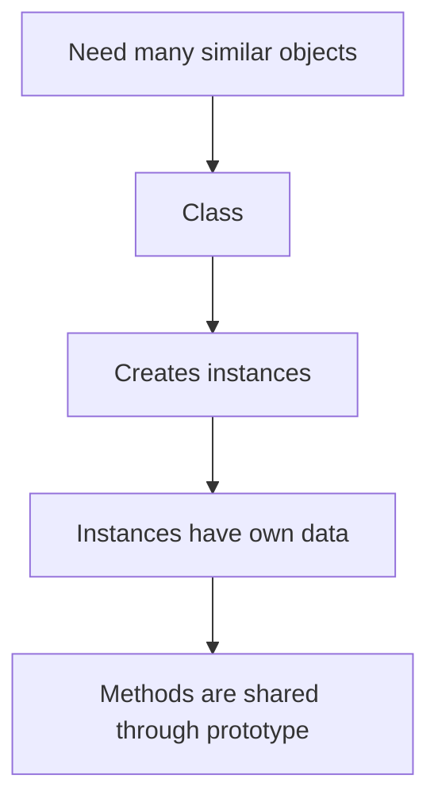

Мы специально не представляли class как новую объектную модель.

Главная мысль была:

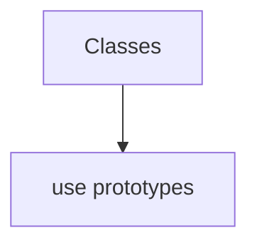

Теперь появляется следующий вопрос:

> Что если несколько classes нуждаются в одинаковом поведение?

Например, в Automation QA есть разные page classes:

```text
LoginPage
ProfilePage
OrdersPage
SettingsPage
```

И каждая повторяет:

```text
open()
waitReady()
formatError()
```

Вопрос:

> Should every class copy identical methods?

Class Inheritance отвечает:

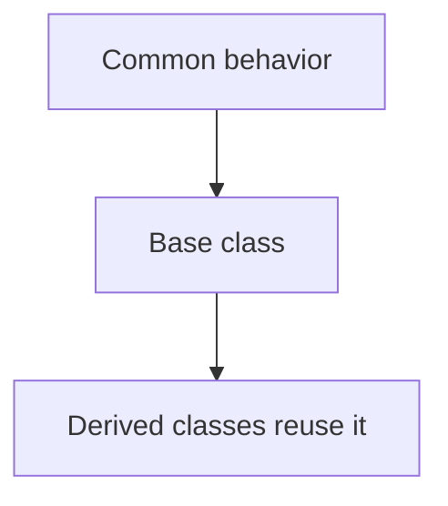

Важно: inheritance does not replace prototypes. Inheritance builds on prototype lookup.

---

## Предварительные требования

Для этой главы нужно понимать:

* что class creates instances;
* что class methods are shared through prototype lookup;
* что Prototype Chain is lookup algorithm;
* что own property or closer method wins;
* что method location and объект выполнения are different concepts;
* что ordinary `object.method()` call uses object before dot as объект выполнения;
* что class mental models are pedagogical analogies, not formal definitions.

Не требуется знать `super`, constructor inheritance, private поля, static members, `instanceof`, mixins, composition vs inheritance or advanced prototype internals. Эти темы будут изучаться позже.

---

## Время изучения

Ориентировочное время:

```text
Чтение главы:            150-190 минут
Разбор схем:             70-90 минут
Запуск примеров:         25-35 минут
Практика:                130-160 минут
Повторение материала:    35 минут
```

Уровень сложности: **L4**.

Class Inheritance легко превратить в разговор о большой архитектуре. В этой главе мы держим фокус уже: duplicated class methods and поведение reuse through prototype lookup.

---

## Навигация

Предыдущая глава:

```text
docs/01-javascript/41-classes.md
```

Текущая глава:

```text
docs/01-javascript/42-class-inheritance.md
```

Следующая глава:

```text
docs/01-javascript/43-super.md
```

Следующая глава ответит:

> How can a derived class call поведение from its base class?

---

## Цели обучения

После изучения этой главы вы будете понимать:

* зачем inheritance существует;
* какую проблему решает duplicated class поведение;
* что такое base class;
* что такое derived class;
* зачем нужен `extends`;
* как derived class получает inherited methods;
* как работает method overriding на базовом уровне;
* как inheritance связано с Prototype Chain;
* почему inheritance не копирует methods;
* где inheritance полезен in Automation QA architecture.

---

## Мотивация

Начнем с проблемы.

Есть несколько page classes:

```javascript
class LoginPage {
  open() {
    return 'open page';
  }

  waitReady() {
    return 'wait until page is ready';
  }

  login() {
    return 'submit login form';
  }
}

class ProfilePage {
  open() {
    return 'open page';
  }

  waitReady() {
    return 'wait until page is ready';
  }

  updateProfile() {
    return 'update profile';
  }
}
```

Код работает.

Но поведение duplicated:

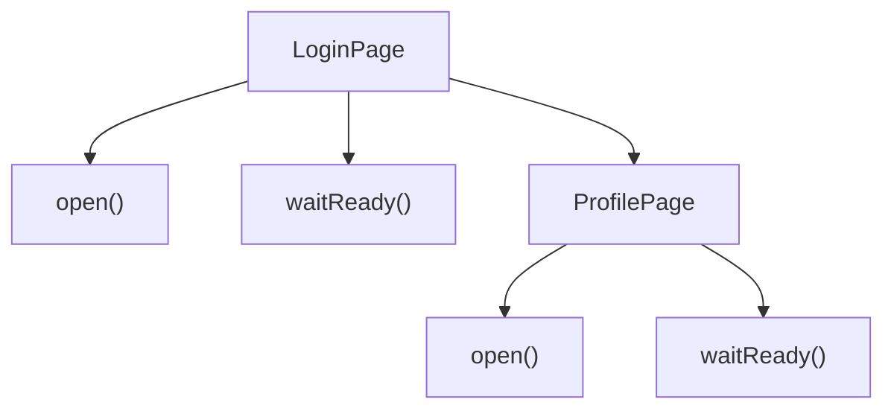

Если изменится общая логика `waitReady()`, нужно обновить каждую class.

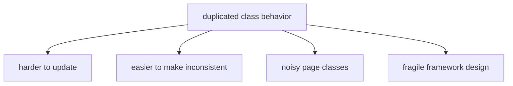

Нужен общий place for common поведение:

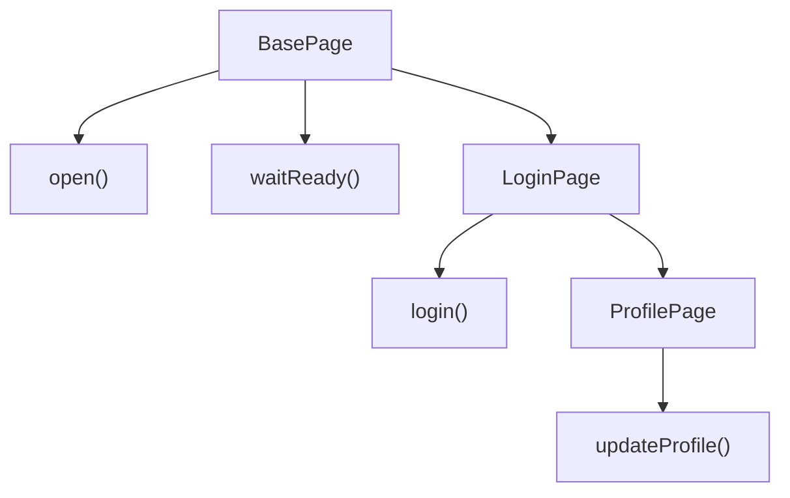

Inheritance lets derived classes reuse поведение from base class.

---

## Теория

Class Inheritance is поведение reuse between classes.

Главная модель:

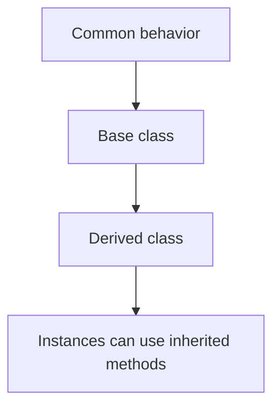

Base class contains общее поведение:

```javascript
class BasePage {
  open() {
    return 'open page';
  }

  waitReady() {
    return 'wait until page is ready';
  }
}
```

Derived class reuses it:

```javascript
class LoginPage extends BasePage {
  login() {
    return 'submit login form';
  }
}
```

Now instance can use both:

```javascript
const loginPage = new LoginPage();

console.log(loginPage.open());
console.log(loginPage.login());
```

Концептуально:

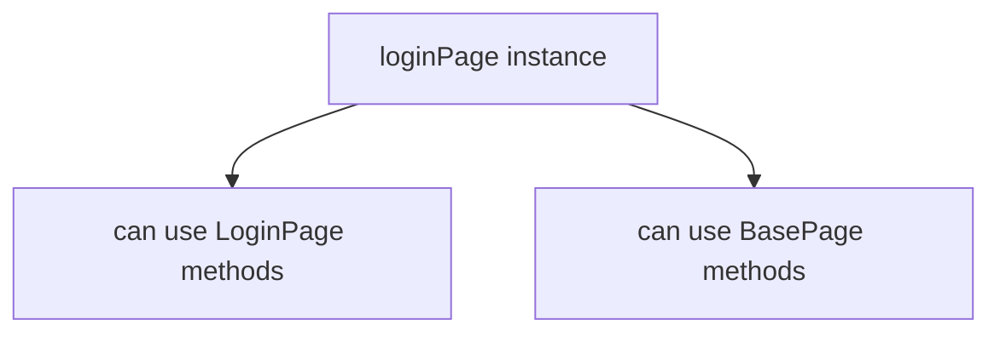

### `extends`

`extends` creates relationship between classes.

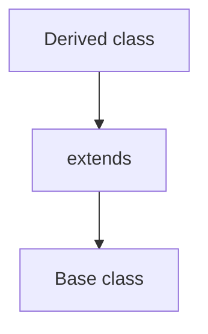

It means:

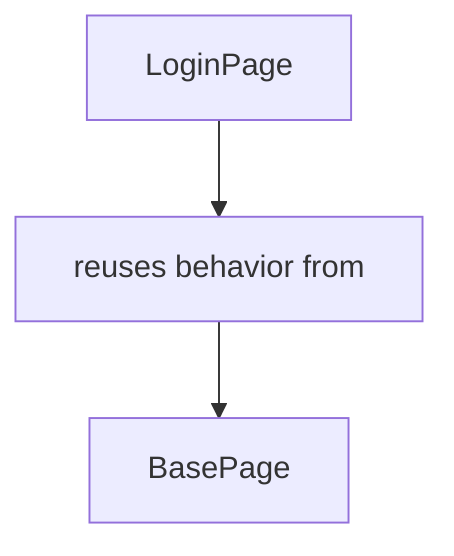

Do not read `extends` as copying methods.

More accurate model:

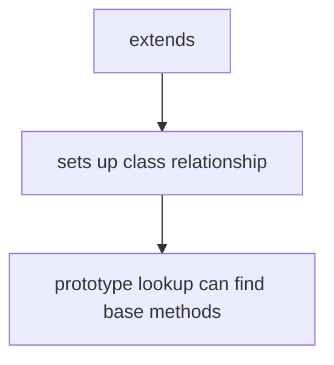

### Inherited methods

Inherited method is method available to derived class instance through the class/prototype relationship.

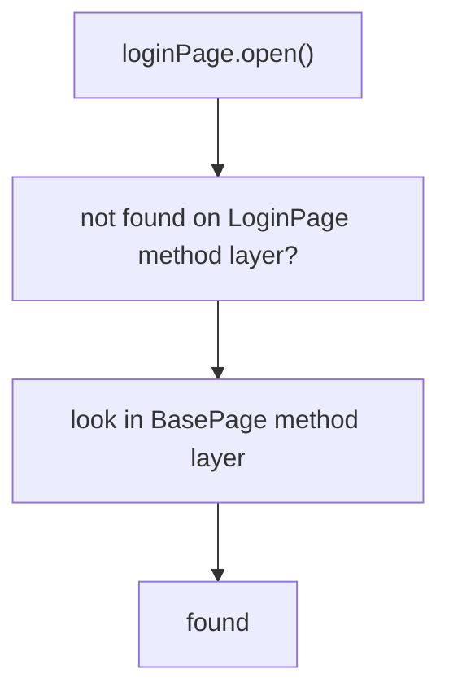

This is why the previous chapters matter.

Inheritance is not a new search model.

```text
Prototype lookup still works
```

### Overriding

Derived class can define method with same name as base class.

```javascript
class LoginPage extends BasePage {
  open() {
    return 'open login page';
  }
}
```

Теперь:

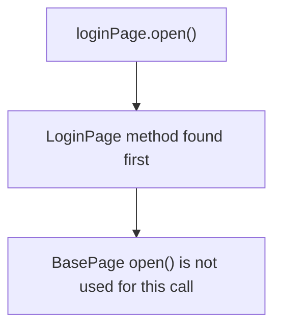

This is overriding.

It follows the same priority idea:

```text
closer method wins
```

We do not explain `super` in this chapter. Calling base поведение from overridden method is the next chapter.

---

## Внутренний механизм

When JavaScript sees:

```javascript
class LoginPage extends BasePage {}
```

Модель высокого уровня:

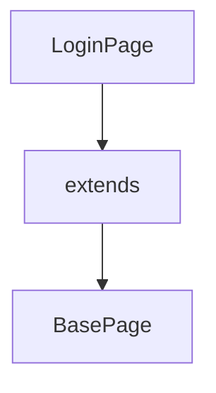

This creates a relationship that allows method lookup to continue from derived class поведение to base class поведение.

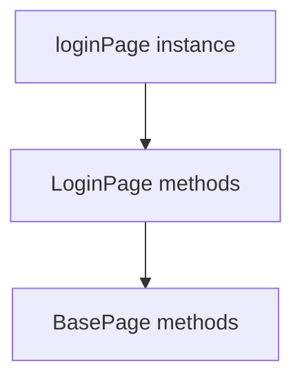

If code calls:

```javascript
loginPage.waitReady();
```

Engine mentally follows:

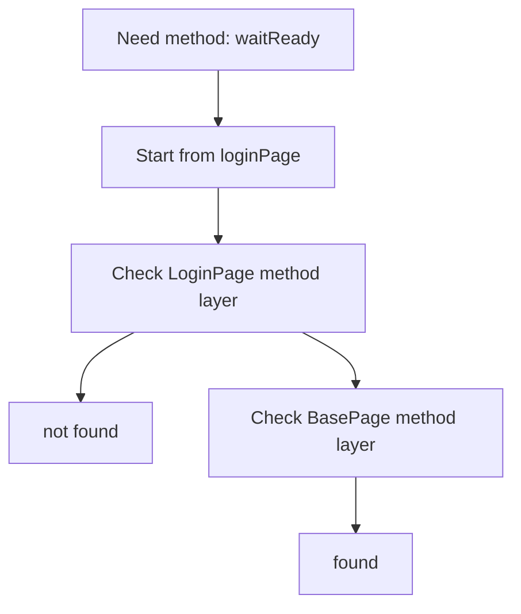

Then call happens with the same объект выполнения rule:

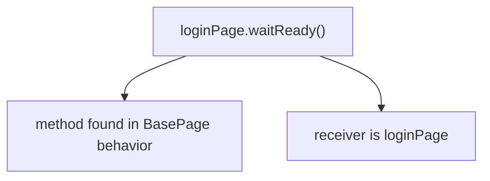

So inside inherited method:

```javascript
waitReady() {
  return `${this.pageName} is ready`;
}
```

`this` refers to the actual объект выполнения:

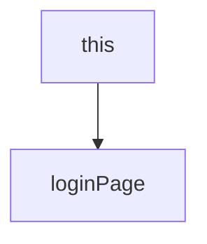

Method location and объект выполнения are still different concepts.

### Prototype reminder

The exact internal structure is more detailed than this chapter needs.

But the important high-level connection is:

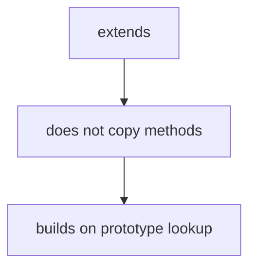

That is enough for this chapter.

---

## Ментальная модель

Inheritance can be understood as shared manual.

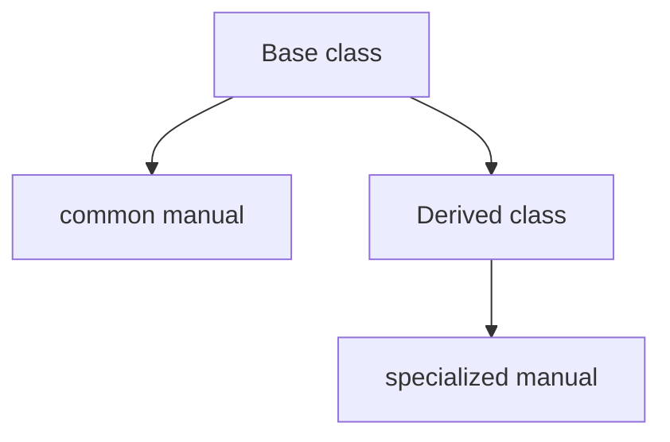

When поведение is missing in specialized manual, JavaScript can use common manual.

```mermaid
flowchart TD
    N1["Need instruction"]
    N2["Derived class"]
    N3["found? use it"]
    N4["not found?"]
    N5["Base class"]
    N1 --> N2
    N2 --> N3
    N2 --> N4
    N2 --> N5
```

Other useful analogies:

```mermaid
flowchart TD
    N1["family recipe"]
    N2["common base recipe"]
    N3["specialized variation"]
    N1 --> N2
    N1 --> N3
```

```mermaid
flowchart TD
    N1["company handbook"]
    N2["common rules for all employees"]
    N3["team-specific rules"]
    N1 --> N2
    N1 --> N3
```

```mermaid
flowchart TD
    N1["common base toolkit"]
    N2["open()"]
    N3["waitReady()"]
    N4["formatError()"]
    N1 --> N2
    N1 --> N3
    N1 --> N4
```

```mermaid
flowchart TD
    N1["reusable training program"]
    N2["shared foundation"]
    N3["specialized skills"]
    N1 --> N2
    N1 --> N3
```

Это ментальные модели, а не формальные определения.

The technical idea remains:

```mermaid
flowchart TD
    N1["extends"]
    N2["class relationship"]
    N3["prototype lookup still works"]
    N1 --> N2
    N2 --> N3
```

---

## Примеры кода

Примеры находятся в:

```text
examples/01-javascript/chapter-42/
```

Запуск:

```bash
node examples/01-javascript/chapter-42/01-first-inheritance.js
```

### Пример 1. First inheritance

Файл:

```text
examples/01-javascript/chapter-42/01-first-inheritance.js
```

Показывает `BasePage` and `LoginPage extends BasePage`.

### Пример 2. Shared methods

Файл:

```text
examples/01-javascript/chapter-42/02-shared-methods.js
```

Показывает several derived classes using same base methods.

### Пример 3. Overriding

Файл:

```text
examples/01-javascript/chapter-42/03-overriding.js
```

Показывает method with same name in derived class.

### Пример 4. Типичные ошибки

Файл:

```text
examples/01-javascript/chapter-42/04-common-mistakes.js
```

Показывает that inheritance does not copy methods into instance.

### Пример 5. Page Object

Файл:

```text
examples/01-javascript/chapter-42/05-page-object.js
```

Показывает realistic BasePage/LoginPage/ProfilePage model.

### Пример 6. QA example

Файл:

```text
examples/01-javascript/chapter-42/06-qa-example.js
```

Показывает base API client поведение reused by service clients.

---

## Частые вопросы

### `extends` копирует методы?

Нет.

Более точная ментальная модель:

```mermaid
flowchart TD
    N1["extends"]
    N2["sets relationship"]
    N3["prototype lookup finds methods"]
    N1 --> N2
    N2 --> N3
```

### Inheritance заменяет Prototype Chain?

Нет.

Inheritance builds on prototype lookup.

```mermaid
flowchart TD
    N1["Derived class instance"]
    N2["Derived behavior"]
    N3["Base behavior"]
    N1 --> N2
    N2 --> N3
```

### Нужно ли всегда использовать inheritance?

Нет.

Inheritance полезен when there is real общее поведение between classes. Если общего поведение мало, inheritance может усложнить код.

Composition vs inheritance будет отдельной темой позже.

### Почему `super` не объясняется здесь?

Потому что сначала нужно понять simple поведение reuse.

Следующая глава объяснит:

```mermaid
flowchart TD
    N1["derived method"]
    N2["calls"]
    N3["base method"]
    N1 --> N2
    N2 --> N3
```

### Можно ли override inherited method?

Да.

Derived class method with same name is found first.

```mermaid
flowchart TD
    N1["Derived method"]
    N2["wins over base method"]
    N1 --> N2
```

---

## Распространенные мифы

### Миф: inheritance copies methods into derived class

Реальность: methods are reused through class/prototype relationship.

### Миф: base class should contain everything

Реальность: base class should contain common поведение only.

### Миф: overriding removes base method

Реальность: overriding changes which method lookup finds first for this derived class.

### Миф: inheritance is always better than duplication

Реальность: inheritance can reduce duplication, but unclear hierarchies hurt readability.

---

## Типичные ошибки

### Ошибка 1. Копировать methods after creating base class

Неправильная модель:

```mermaid
flowchart TD
    N1["BasePage.open()"]
    N2["copied into"]
    N3["LoginPage"]
    N1 --> N2
    N2 --> N3
```

Что происходит:

```mermaid
flowchart TD
    N1["LoginPage instance"]
    N2["uses lookup"]
    N3["finds BasePage.open()"]
    N1 --> N2
    N2 --> N3
```

Исправленная модель:

```mermaid
flowchart TD
    N1["reuse through lookup"]
    N2["not copy"]
    N1 --> N2
```

### Ошибка 2. Put page-specific поведение into base class

Неправильный дизайн:

```mermaid
flowchart TD
    N1["BasePage"]
    N2["open()"]
    N3["waitReady()"]
    N4["login()"]
    N1 --> N2
    N1 --> N3
    N1 --> N4
```

Почему плохо:

`login()` belongs to `LoginPage`, not every page.

Исправленная модель:

```mermaid
flowchart TD
    N1["BasePage"]
    N2["open()"]
    N3["waitReady()"]
    N4["LoginPage"]
    N5["login()"]
    N1 --> N2
    N1 --> N3
    N1 --> N4
    N4 --> N5
```

### Ошибка 3. Override accidentally

Неправильный код:

```javascript
class BasePage {
  open() {
    return 'base open';
  }
}

class LoginPage extends BasePage {
  open() {
    return 'login open';
  }
}
```

Что произошло:

`LoginPage.open()` shadows inherited `BasePage.open()`.

Если это было intentional, fine.

Если accidental, method name should be changed.

### Ошибка 4. Forget объект выполнения

Неправильная модель:

```mermaid
flowchart TD
    N1["method found in BasePage"]
    N2["this = BasePage"]
    N1 --> N2
```

Правильная модель:

```mermaid
flowchart TD
    N1["loginPage.open()"]
    N2["method found through inheritance"]
    N3["receiver is loginPage"]
    N1 --> N2
    N1 --> N3
```

---

## Практическое использование

Inheritance useful when:

```mermaid
flowchart TD
    N1["several classes"]
    N2["share same behavior"]
    N1 --> N2
```

Примеры:

* base page actions;
* common API client поведение;
* shared validator formatting;
* framework reporting helpers;
* common test data builders.

Good inheritance:

```mermaid
flowchart TD
    N1["Base class"]
    N2["truly common behavior"]
    N3["Derived class"]
    N4["specific behavior"]
    N1 --> N2
    N1 --> N3
    N3 --> N4
```

Bad inheritance:

```mermaid
flowchart TD
    N1["Base class"]
    N2["everything that seemed convenient"]
    N1 --> N2
```

Вопрос читаемости:

> Does the hierarchy explain the domain, or only hide duplicated code?

Эта глава не сравнивает inheritance и composition глубоко. Это обсуждение будет позже.

---

## Использование в Automation QA

### BasePage

Common page поведение:

```mermaid
flowchart TD
    N1["BasePage"]
    N2["open()"]
    N3["waitReady()"]
    N4["formatError()"]
    N1 --> N2
    N1 --> N3
    N1 --> N4
```

Specific pages:

```mermaid
flowchart TD
    N1["LoginPage extends BasePage"]
    N2["login()"]
    N3["ProfilePage extends BasePage"]
    N4["updateProfile()"]
    N1 --> N2
    N1 --> N3
    N3 --> N4
```

This keeps common actions in one place.

### API base client

Common API поведение:

```mermaid
flowchart TD
    N1["BaseApiClient"]
    N2["buildUrl()"]
    N3["describeRequest()"]
    N1 --> N2
    N1 --> N3
```

Specific clients:

```mermaid
flowchart TD
    N1["UsersClient"]
    N2["userEndpoint()"]
    N3["OrdersClient"]
    N4["orderEndpoint()"]
    N1 --> N2
    N1 --> N3
    N3 --> N4
```

### Reusable validators

Base validator:

```mermaid
flowchart TD
    N1["BaseValidator"]
    N2["formatExpected()"]
    N3["formatActual()"]
    N1 --> N2
    N1 --> N3
```

Specific validators:

```text
StatusValidator
RoleValidator
SchemaValidator
```

The goal is not to build deep hierarchies.

The goal is to keep shared framework поведение explicit and readable.

---

## Диаграммы главы

### 1. Why inheritance exists

```mermaid
flowchart TD
    N1["many classes"]
    N2["same methods repeated"]
    N3["need shared behavior"]
    N1 --> N2
    N1 --> N3
```

### 2. Duplicated class methods

```text
LoginPage.open()
ProfilePage.open()
OrdersPage.open()
```

### 3. Base class

```mermaid
flowchart TD
    N1["BasePage"]
    N2["open()"]
    N3["waitReady()"]
    N1 --> N2
    N1 --> N3
```

### 4. Derived class

```mermaid
flowchart TD
    N1["LoginPage"]
    N2["login()"]
    N1 --> N2
```

### 5. Shared поведение

```mermaid
flowchart TD
    N1["Base class"]
    N2["common methods"]
    N1 --> N2
```

### 6. extends

```mermaid
flowchart TD
    N1["LoginPage"]
    N2["extends"]
    N3["BasePage"]
    N1 --> N2
    N2 --> N3
```

### 7. Method reuse

```mermaid
flowchart TD
    N1["loginPage.open()"]
    N2["BasePage.open()"]
    N1 --> N2
```

### 8. Overriding

```mermaid
flowchart TD
    N1["BasePage.open()"]
    N2["shadowed by"]
    N3["LoginPage.open()"]
    N1 --> N2
    N2 --> N3
```

### 9. Текущая модель JavaScript

```mermaid
flowchart TD
    N1["Objects"]
    N2["Prototype"]
    N3["Prototype Chain"]
    N4["Classes"]
    N5["Class Inheritance"]
    N1 --> N2
    N1 --> N3
    N1 --> N4
    N1 --> N5
```

### 10. Prototype reminder

```mermaid
flowchart TD
    N1["extends"]
    N2["prototype lookup still works"]
    N1 --> N2
```

### 11. QA Page Objects

```mermaid
flowchart TD
    N1["BasePage"]
    N2["LoginPage"]
    N3["ProfilePage"]
    N1 --> N2
    N1 --> N3
```

### 12. API client hierarchy

```mermaid
flowchart TD
    N1["BaseApiClient"]
    N2["UsersClient"]
    N3["OrdersClient"]
    N1 --> N2
    N1 --> N3
```

### 13. Читаемость

```mermaid
flowchart TD
    N1["common behavior"]
    N2["one clear base class"]
    N1 --> N2
```

### 14. Типичные ошибки

```mermaid
flowchart TD
    N1["base class"]
    N2["too much responsibility"]
    N1 --> N2
```

### 15. Method lookup

```mermaid
flowchart TD
    N1["instance"]
    N2["derived methods"]
    N3["base methods"]
    N1 --> N2
    N2 --> N3
```

### 16. Prototype behind extends

```mermaid
flowchart TD
    N1["extends"]
    N2["class relationship"]
    N3["prototype lookup"]
    N1 --> N2
    N2 --> N3
```

### 17. Object creation

```mermaid
flowchart TD
    N1["new LoginPage()"]
    N2["instance"]
    N3["can use inherited methods"]
    N1 --> N2
    N2 --> N3
```

### 18. Shared toolkit

```mermaid
flowchart TD
    N1["BasePage toolkit"]
    N2["open()"]
    N3["waitReady()"]
    N1 --> N2
    N1 --> N3
```

### 19. Family recipe

```mermaid
flowchart TD
    N1["base recipe"]
    N2["page-specific variation"]
    N1 --> N2
```

### 20. Company handbook

```mermaid
flowchart TD
    N1["company handbook"]
    N2["team handbook"]
    N1 --> N2
```

### 21. Base responsibility

```mermaid
flowchart TD
    N1["Base class"]
    N2["common behavior only"]
    N1 --> N2
```

### 22. Derived responsibility

```mermaid
flowchart TD
    N1["Derived class"]
    N2["specific behavior"]
    N1 --> N2
```

### 23. Override flow

```mermaid
flowchart TD
    N1["вызвать method"]
    N2["check derived"]
    N3["found? stop"]
    N1 --> N2
    N2 --> N3
```

### 24. Краткая ментальная модель

```mermaid
flowchart TD
    N1["Common behavior"]
    N2["Base class"]
    N3["Derived classes reuse it"]
    N1 --> N2
    N2 --> N3
```

### 25. Complete inheritance model

```mermaid
flowchart TD
    N1["Base class"]
    N2["shared methods"]
    N3["Derived class"]
    N4["specific methods"]
    N1 --> N2
    N1 --> N3
    N3 --> N4
```

### 26. Object relationship

```mermaid
flowchart TD
    N1["instance"]
    N2["uses derived and base behavior"]
    N1 --> N2
```

### 27. Class relationship

```mermaid
flowchart TD
    N1["Derived class"]
    N2["extends"]
    N3["Base class"]
    N1 --> N2
    N2 --> N3
```

### 28. Lookup reminder

```mermaid
flowchart TD
    N1["not found closer"]
    N2["look farther"]
    N1 --> N2
```

### 29. Receiver reminder

```mermaid
flowchart TD
    N1["loginPage.open()"]
    N2["this is loginPage"]
    N1 --> N2
```

### 30. Переход к super

```mermaid
flowchart TD
    N1["override method"]
    N2["next: вызвать base method"]
    N1 --> N2
```

### 31. Переход к composition

```mermaid
flowchart TD
    N1["inheritance"]
    N2["not always best design"]
    N3["composition later"]
    N1 --> N2
    N2 --> N3
```

### 32. Framework example

```mermaid
flowchart TD
    N1["BaseFrameworkObject"]
    N2["Reporter"]
    N3["ApiClient"]
    N1 --> N2
    N1 --> N3
```

### 33. Shared validator

```mermaid
flowchart TD
    N1["BaseValidator"]
    N2["StatusValidator"]
    N3["RoleValidator"]
    N1 --> N2
    N1 --> N3
```

### 34. Build hierarchy

```mermaid
flowchart TD
    N1["common"]
    N2["specific"]
    N1 --> N2
```

### 35. Object evolution

```mermaid
flowchart TD
    N1["object methods"]
    N2["prototype"]
    N3["class"]
    N4["class inheritance"]
    N1 --> N2
    N2 --> N3
    N3 --> N4
```

### 36. Принадлежность поведения

```mermaid
flowchart TD
    N1["common behavior → base"]
    N2["specific behavior → derived"]
    N1 --> N2
```

### 37. Prototype connection

```mermaid
flowchart TD
    N1["extends"]
    N2["does not remove prototypes"]
    N1 --> N2
```

### 38. Override lookup

```mermaid
flowchart TD
    N1["derived method exists"]
    N2["base method not reached"]
    N1 --> N2
```

### 39. Shared methods

```mermaid
flowchart TD
    N1["one base method"]
    N2["used by LoginPage"]
    N3["used by ProfilePage"]
    N1 --> N2
    N1 --> N3
```

### 40. Итоговая схема

```mermaid
flowchart TD
    N1["Shared behavior"]
    N2["Base class"]
    N3["extends"]
    N4["Derived class"]
    N5["Prototype lookup still works"]
    N1 --> N2
    N2 --> N3
    N3 --> N4
    N4 --> N5
```

---

## Итоги

Class Inheritance continues the Classes chapter.

Classes answered:

```text
How to create many similar objects conveniently?
```

Class Inheritance отвечает:

```text
What if several classes need the same behavior?
```

Основная модель:

```mermaid
flowchart TD
    N1["Shared behavior"]
    N2["Base class"]
    N3["extends"]
    N4["Derived class"]
    N5["Prototype lookup still works"]
    N1 --> N2
    N2 --> N3
    N3 --> N4
    N4 --> N5
```

Inheritance does not copy methods. It creates a relationship between classes, while the already-learned prototype mechanism continues to perform property lookup.

The next chapter will explain `super`: how a derived class can call поведение from its base class.

---

## Что нужно запомнить

✓ Inheritance reuses поведение between classes.

✓ Base class contains common поведение.

✓ Derived class contains specific поведение.

✓ `extends` creates relationship between classes.

✓ Inherited methods are found through lookup, not copied.

✓ Derived method can override base method.

✓ Closer method wins during lookup.

✓ Receiver remains the actual object used in method call.

✓ Inheritance builds on prototype lookup.

✓ `super` is the next chapter.

---

## Проверьте себя

1. What problem does class inheritance solve?

2. Какое поведение относится к base class?

3. Какое поведение относится к derived class?

4. Does `extends` copy methods?

5. How is inheritance related to Prototype Chain?

6. What is method overriding?

7. Which method wins if derived and base class define the same name?

8. What is the объект выполнения during `loginPage.open()`?

9. Why can copying identical methods into every class be a bad idea?

10. What will the next chapter explain?

---

## Практика

Практические задания находятся в отдельном файле:

```text
practice/01-javascript/42-class-inheritance.md
```

---

## Решения

Решения находятся в отдельном файле:

```text
solutions/01-javascript/42-class-inheritance.md
```

Сначала выполните практику самостоятельно. Затем сравните ход рассуждения, а не только итоговый ответ.
