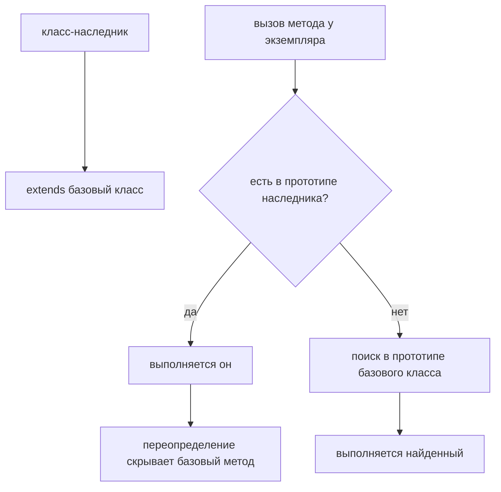

# Наследование классов

## Связь с предыдущей главой

Предыдущая глава объяснила Classes.

Главная модель была такой: класс задаёт конструктор и общее поведение для создаваемых объектов.

Мы специально не представляли class как новую объектную модель.

Главная мысль была:

Теперь появляется следующий вопрос:

> Что если несколько classes нуждаются в одинаковом поведение?

Например, в Automation QA есть разные page classes:

```text
LoginPage
ProfilePage
OrdersPage
SettingsPage
```

И каждая повторяет:

```text
open()
waitReady()
formatError()
```

Вопрос:

> Should every class copy identical methods?

Class Inheritance отвечает:

Важно: inheritance does not replace prototypes. Inheritance builds on prototype lookup.

---

## Предварительные требования

Для этой главы нужно понимать:

* что class creates instances;
* что class methods are shared through prototype lookup;
* что Prototype Chain is lookup algorithm;
* что own property or closer method wins;
* что method location and объект выполнения are different concepts;
* что ordinary `object.method()` call uses object before dot as объект выполнения;
* что class mental models are pedagogical analogies, not formal definitions.

Не требуется знать `super`, constructor inheritance, private поля, static members, `instanceof`, mixins, composition vs inheritance or advanced prototype internals. Эти темы будут изучаться позже.

---

## Время изучения

Ориентировочное время:

```text
Чтение главы:            150-190 минут
Разбор схем:             70-90 минут
Запуск примеров:         25-35 минут
Практика:                130-160 минут
Повторение материала:    35 минут
```

Уровень сложности: **L4**.

Class Inheritance легко превратить в разговор о большой архитектуре. В этой главе мы держим фокус уже: duplicated class methods and поведение reuse through prototype lookup.

---

## Навигация

Предыдущая глава:

```text
docs/01-javascript/41-classes.md
```

Текущая глава:

```text
docs/01-javascript/42-class-inheritance.md
```

Следующая глава:

```text
docs/01-javascript/43-super.md
```

Следующая глава ответит:

> How can a derived class call поведение from its base class?

---

## Цели обучения

После изучения этой главы вы будете понимать:

* зачем inheritance существует;
* какую проблему решает duplicated class поведение;
* что такое base class;
* что такое derived class;
* зачем нужен `extends`;
* как derived class получает inherited methods;
* как работает method overriding на базовом уровне;
* как inheritance связано с Prototype Chain;
* почему inheritance не копирует methods;
* где inheritance полезен in Automation QA architecture.

---

## Мотивация

Начнем с проблемы.

Есть несколько page classes:

```javascript
class LoginPage {
  open() {
    return 'open page';
  }

  waitReady() {
    return 'wait until page is ready';
  }

  login() {
    return 'submit login form';
  }
}

class ProfilePage {
  open() {
    return 'open page';
  }

  waitReady() {
    return 'wait until page is ready';
  }

  updateProfile() {
    return 'update profile';
  }
}
```

Код работает.

Но поведение duplicated:

Если изменится общая логика `waitReady()`, нужно обновить каждую class.

Нужен общий place for common поведение:

Inheritance lets derived classes reuse поведение from base class.

---

## Теория

Наследование классов — переиспользование поведения между классами.

Главная модель: наследование позволяет одному классу переиспользовать поведение другого.

Базовый класс содержит общее поведение:

```javascript
class BasePage {
  open() {
    return 'open page';
  }

  waitReady() {
    return 'wait until page is ready';
  }
}
```

Производный класс его переиспользует:

```javascript
class LoginPage extends BasePage {
  login() {
    return 'submit login form';
  }
}
```

Теперь экземпляр может использовать оба:

```javascript
const loginPage = new LoginPage();

console.log(loginPage.open());
console.log(loginPage.login());
```

Концептуально:

```text
open()   —  метод базового класса, у LoginPage своего такого нет
login()  —  собственный метод LoginPage
```

Оба вызова выглядят одинаково: откуда взялся метод, на месте вызова не видно.

### `extends`

`extends` создаёт связь между классами.

Это означает:

```text
экземпляры LoginPage могут пользоваться методами BasePage
```

Не читайте `extends` как копирование методов.

Более точная модель:

```text
экземпляр  →  прототип LoginPage  →  прототип BasePage
```

Методы остаются каждый в своём классе, а связь между классами позволяет до
них дойти.

### Унаследованные методы

Унаследованный метод — метод, доступный экземпляру производного класса через связь классов и прототипов.

Именно поэтому предыдущие главы важны.

Наследование — не новая модель поиска.

```text
Поиск по прототипам работает как раньше
```

### Переопределение

Производный класс может объявить метод с тем же именем, что и базовый.

```javascript
class LoginPage extends BasePage {
  open() {
    return 'open login page';
  }
}
```

Теперь:

Это переопределение.

Оно подчиняется той же идее приоритета:

```text
closer method wins
```

Мы не объясняем `super` в этой главе. Вызов базового поведения из переопределённого метода — тема следующей.

---

Наследование продолжает цепочку прототипов:


```mermaid
flowchart TD
    A["класс-наследник"] --> B["extends базовый класс"]
    C["вызов метода у экземпляра"] --> D{"есть в прототипе наследника?"}
    D -- "да" --> E["выполняется он"]
    D -- "нет" --> F["поиск в прототипе базового класса"]
    F --> G["выполняется найденный"]
    E --> H["переопределение скрывает базовый метод"]
```

## Внутренний механизм

Когда JavaScript видит:

```javascript
class LoginPage extends BasePage {}
```

Модель высокого уровня:

```text
Child  →  extends  →  Parent
поиск метода идёт от Child к Parent
```

Так создаётся связь, которая позволяет поиску метода продолжиться от поведения производного класса к поведению базового.

Если код вызывает:

```javascript
loginPage.waitReady();
```

Движок мысленно проходит цепочку:

```text
loginPage                    собственные свойства → метода нет
LoginPage.prototype          → нет
BasePage.prototype           → ЕСТЬ waitReady
```

Затем вызов происходит по тому же правилу объекта выполнения: `this` — это
`loginPage`, а не `BasePage.prototype`, где метод найден.

Поэтому внутри унаследованного метода:

```javascript
waitReady() {
  return `${this.pageName} is ready`;
}
```

`this` указывает на фактический объект выполнения:

Место, где лежит метод, и объект выполнения по-прежнему разные вещи.

### Напоминание о прототипах

Точное внутреннее устройство подробнее, чем нужно этой главе.

Но важная связь на высоком уровне такая:

Для этой главы этого достаточно.

---

## Ментальная модель

Наследование можно понимать как общую инструкцию.

Когда нужного поведения нет в частной инструкции, JavaScript может использовать общую.

Это ментальные модели, а не формальные определения.

Техническая идея остаётся прежней: наследование связывает прототипы. Экземпляр
наследника ссылается на прототип наследника, тот — на прототип родителя, и
поиск метода идёт по этой цепочке.

---

## Примеры кода

Примеры находятся в:

```text
examples/01-javascript/chapter-42/
```

Запуск:

```bash
node examples/01-javascript/chapter-42/01-first-inheritance.js
```

### Пример 1. Первое наследование

Файл:

```text
examples/01-javascript/chapter-42/01-first-inheritance.js
```

Показывает `BasePage` и `LoginPage extends BasePage`.

### Пример 2. Общие методы

Файл:

```text
examples/01-javascript/chapter-42/02-shared-methods.js
```

Показывает несколько производных классов, использующих одни базовые методы.

### Пример 3. Переопределение

Файл:

```text
examples/01-javascript/chapter-42/03-overriding.js
```

Показывает метод с тем же именем в производном классе.

### Пример 4. Типичные ошибки

Файл:

```text
examples/01-javascript/chapter-42/04-common-mistakes.js
```

Показывает, что наследование не копирует методы в экземпляр.

### Пример 5. Объект страницы

Файл:

```text
examples/01-javascript/chapter-42/05-page-object.js
```

Показывает реалистичную модель базовой страницы, страницы входа и страницы профиля.

### Пример 6. Пример из автоматизации тестов

Файл:

```text
examples/01-javascript/chapter-42/06-qa-example.js
```

Показывает поведение базового клиента API, переиспользуемое клиентами сервисов.

---

## Частые вопросы

### `extends` копирует методы?

Нет.

Более точная ментальная модель: `extends` связывает прототипы двух классов, поэтому поиск метода продолжается в родителе.

### Наследование заменяет цепочку прототипов?

Нет.

Наследование построено на поиске по прототипу.

### Нужно ли всегда использовать наследование?

Нет.

Наследование полезно, когда между классами есть настоящее общее поведение. Если общего мало, наследование усложняет код.

Композиция против наследования будет отдельной темой позже.

### Почему `super` не объясняется здесь?

Потому что сначала нужно понять простое переиспользование поведения.

Следующая глава объяснит:

```text
как переопределённый метод может вызвать версию базового класса,
а не заменить её целиком
```

### Можно ли переопределить унаследованный метод?

Да.

Метод производного класса с тем же именем находится первым.

---

## Распространённые мифы

### Миф: наследование копирует методы в производный класс

Реальность: методы переиспользуются через связь классов и прототипов.

### Миф: базовый класс должен содержать всё

Реальность: базовый класс должен содержать только общее поведение.

### Миф: переопределение удаляет базовый метод

Реальность: переопределение меняет то, какой метод поиск находит первым для этого производного класса.

### Миф: наследование всегда лучше дублирования

Реальность: наследование уменьшает дублирование, но непонятная иерархия вредит читаемости.

---

## Распространённые ошибки

### Ошибка 1. Копировать методы после создания базового класса

Неправильная модель: будто наследование копирует методы родителя в дочерний класс.

Что происходит на самом деле: `extends` связывает прототипы, а не копирует
методы. В дочернем прототипе метода родителя нет — он находится шагом дальше по
цепочке.

Исправленная модель: методы остаются в родителе, а дочерний класс лишь продолжает цепочку поиска.

### Ошибка 2. Класть поведение конкретной страницы в базовый класс

Неправильный дизайн: метод `login()` объявлен в `BasePage`, чтобы «не
дублировать».

Почему плохо: он появляется у всех страниц, включая те, где входа нет. Иерархия
начинает обещать поведение, которого у объекта нет.

`login()` принадлежит странице входа, а не каждой странице.

Исправленная модель: переопределённый метод в дочернем классе находится первым и скрывает родительский, не удаляя его.

### Ошибка 3. Переопределить метод случайно

Неправильный код:

```javascript
class BasePage {
  open() {
    return 'base open';
  }
}

class LoginPage extends BasePage {
  open() {
    return 'login open';
  }
}
```

Что произошло:

`LoginPage.open()` затеняет унаследованный `BasePage.open()`.

Если это было намеренно — хорошо.

Если случайно — имя метода нужно изменить.

### Ошибка 4. Забыть про объект выполнения

Неправильная модель: будто конструктор родителя вызывается сам собой.

Правильная модель: конструктор наследника обязан вызвать `super()` явно, и до
этого вызова обращаться к `this` нельзя — объект ещё не готов. Обращение выше
даёт `ReferenceError`.

---

## Практическое использование

Наследование полезно, когда у нескольких классов действительно общее поведение и
общая роль в предметной области.

Примеры:

* действия базовой страницы;
* общее поведение клиента API;
* общее форматирование проверок;
* вспомогательные средства отчётности фреймворка;
* общие сборщики тестовых данных.

| | Удачное наследование | Неудачное |
| --- | --- | --- |
| что общего | роль в предметной области | случайно похожий код |
| что в базовом классе | то, что верно для ВСЕХ наследников | то, что нужно одному |
| глубина | один-два уровня | четыре и больше |
| читаемость | иерархия объясняет домен | иерархия прячет дублирование |

Вопрос читаемости:

> Объясняет ли иерархия предметную область или только прячет дублированный код?

Эта глава не сравнивает наследование и композицию глубоко. Это обсуждение будет позже.

---

## Использование в Automation QA

### Базовый объект страницы

Общее поведение страниц:

```text
open()        —  открыть страницу по её адресу
waitReady()   —  дождаться готовности
```

Конкретные страницы:

```text
LoginPage     —  login()
ProfilePage   —  updateEmail()
```

Так общие действия остаются в одном месте.

### Базовый клиент API

Общее поведение API:

```text
buildUrl()      —  собрать адрес из baseUrl и пути
sendRequest()   —  отправить запрос и вернуть ответ
```

Конкретные клиенты:

```text
UsersClient     —  createUser(), getUser()
OrdersClient    —  createOrder()
```

### Переиспользуемые проверки

Базовая проверка задаёт общую форму: как формируется сообщение об ошибке и как
возвращается результат.

Конкретные проверки добавляют только своё правило:

```text
StatusValidator
RoleValidator
SchemaValidator
```

Цель не в том, чтобы строить глубокие иерархии.

Цель в том, чтобы общее поведение фреймворка оставалось явным и читаемым.

---

## Итоги

Наследование классов продолжает главу про классы.

Классы ответили:

```text
Как удобно создавать много похожих объектов?
```

Наследование отвечает:

```text
А если одно и то же поведение нужно нескольким классам?
```

Основная модель: наследование — это продолжение цепочки поиска, а не копирование поведения.

Наследование не копирует методы. Оно создаёт связь между классами, а поиск свойств по-прежнему выполняет уже изученный механизм прототипов.

Следующая глава объяснит `super`: как производный класс может вызвать поведение базового.

---

## Что нужно запомнить

✓ Наследование переиспользует поведение между классами.

✓ Базовый класс содержит общее поведение.

✓ Производный класс содержит частное поведение.

✓ `extends` создаёт связь между классами.

✓ Унаследованные методы находятся поиском, а не копируются.

✓ Метод производного класса может переопределить базовый.

✓ При поиске побеждает более близкий метод.

✓ Объектом выполнения остаётся тот объект, через который вызван метод.

✓ Наследование построено на поиске по прототипу.

✓ `super` — тема следующей главы.

---

## Проверьте себя

1. Какую задачу решает наследование классов?

2. Какое поведение относится к базовому классу?

3. Какое поведение относится к производному классу?

4. Копирует ли `extends` методы?

5. Как наследование связано с цепочкой прототипов?

6. Что такое переопределение метода?

7. Какой метод побеждает, если производный и базовый класс объявляют одно имя?

8. Каким будет объект выполнения при вызове `loginPage.open()`?

9. Почему копировать одинаковые методы в каждый класс — плохая идея?

10. Что объяснит следующая глава?

### Ответы

1. Повторение одинакового поведения в нескольких классах: общее выносится в базовый класс, а различия остаются в производных.
2. То, что одинаково для всех потомков: открыть страницу, дождаться готовности, собрать адрес запроса.
3. То, что свойственно только ему: вход на странице логина, создание пользователя в клиенте пользователей.
4. Нет. Он создаёт связь между классами, по которой экземпляр доходит до методов базового класса.
5. Это та же цепочка поиска: экземпляр — прототип производного класса — прототип базового класса.
6. Объявление в производном классе метода с тем же именем, что и в базовом. При вызове побеждает метод производного класса.
7. Метод производного класса: поиск начинается ближе к объекту и останавливается на первом совпадении.
8. Сам объект `loginPage` — независимо от того, в каком классе найден метод.
9. Изменение придётся вносить в каждый класс, и одно место обычно пропускают. Кроме того, из кода перестаёт быть видно, что поведение общее.
10. Как переопределённый метод может вызвать версию базового класса вместо того, чтобы заменить её целиком.

---

## Практика

Практические задания находятся в отдельном файле:

```text
practice/01-javascript/42-class-inheritance.md
```

---

## Решения

Решения находятся в отдельном файле:

```text
solutions/01-javascript/42-class-inheritance.md
```

Сначала выполните практику самостоятельно. Затем сравните ход рассуждения, а не только итоговый ответ.
