# super

## Связь с предыдущей главой

Предыдущая глава объяснила Class Inheritance.

Главная модель была такой:

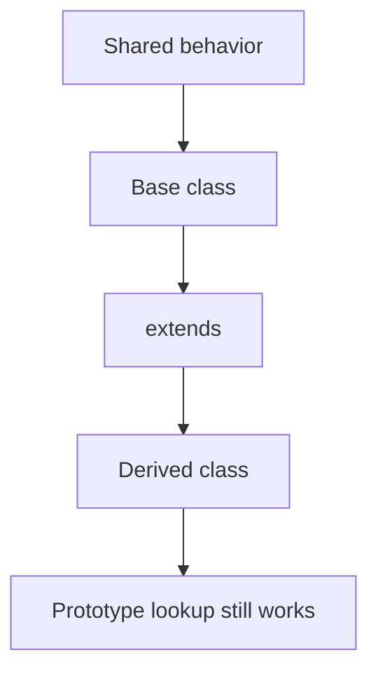

Мы увидели, что derived class can reuse base class поведение:

```javascript
class BasePage {
  open(pageName) {
    return `open ${pageName}`;
  }
}

class LoginPage extends BasePage {}

const loginPage = new LoginPage();

console.log(loginPage.open('LoginPage'));
```

Также мы увидели overriding:

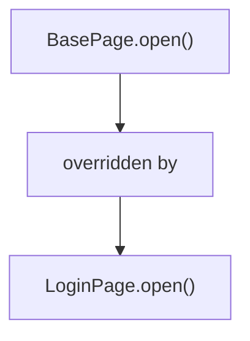

Теперь появляется следующий вопрос:

> Что если derived method переопределяет base method, но все еще хочет использовать base поведение?

Например:

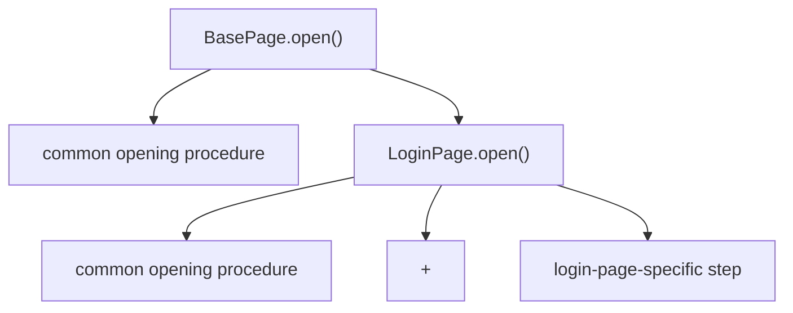

Если просто override method, base method no longer runs for that call.

`super` отвечает на этот вопрос.

Главная модель главы:

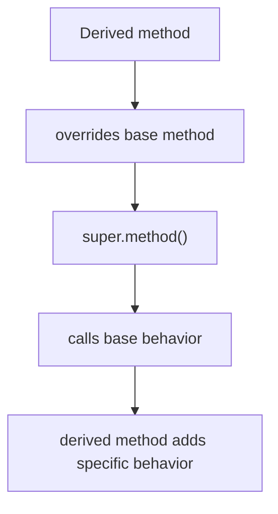

Важно: `super` does not copy base code. `super` calls base поведение through the class relationship.

---

## Предварительные требования

Для этой главы нужно понимать:

* что class methods are shared through prototype lookup;
* что inheritance reuses поведение between classes;
* что `extends` creates relationship between derived and base class;
* что overriding means closer method wins;
* что method location and объект выполнения are different concepts;
* что `this` inside method refers to объект выполнения during ordinary invocation.

Не требуется знать `super()` in constructors, constructor inheritance, private поля, static members, mixins, decorators, advanced prototype internals or `Reflect`. Constructor `super()` будет отдельной темой позже.

---

## Время изучения

Ориентировочное время:

```text
Чтение главы:            130-170 минут
Разбор схем:             60-80 минут
Запуск примеров:         25-35 минут
Практика:                120-150 минут
Повторение материала:    30 минут
```

Уровень сложности: **L4**.

`super` часто кажется коротким синтаксисом. Но важно видеть механизм: derived method не хочет заменить base поведение полностью. Он хочет reuse base поведение and extend it.

---

## Навигация

Предыдущая глава:

```text
docs/01-javascript/42-class-inheritance.md
```

Текущая глава:

```text
docs/01-javascript/43-super.md
```

Следующая глава:

```text
docs/01-javascript/44-arrays.md
```

Следующая глава начнет новый раздел:

> Как JavaScript работает с ordered collections значений?

---

## Цели обучения

После изучения этой главы вы будете понимать:

* зачем существует `super`;
* почему override sometimes still needs base поведение;
* что делает `super.method()`;
* как derived method extends base method;
* как `super` связан с class relationship;
* как `super` связан с prototype lookup;
* почему `this` inside base method still refers to объект выполнения;
* почему `super` не копирует base code;
* какие ошибки встречаются чаще всего;
* как `super` используется in Automation QA framework classes.

---

## Мотивация

Начнем с проблемы.

Есть base class:

```javascript
class BasePage {
  open(pageName) {
    return `open ${pageName}`;
  }
}
```

Есть derived class:

```javascript
class LoginPage extends BasePage {
  open(pageName) {
    return `open ${pageName} and focus login form`;
  }
}
```

Код работает.

Но common opening logic now duplicated conceptually:

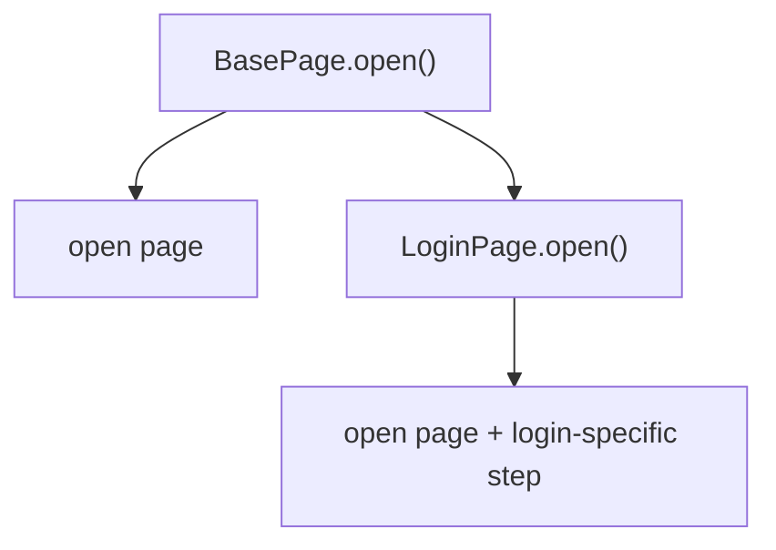

Если base opening procedure changes, derived method must be updated manually.

Мы хотим другой поток:

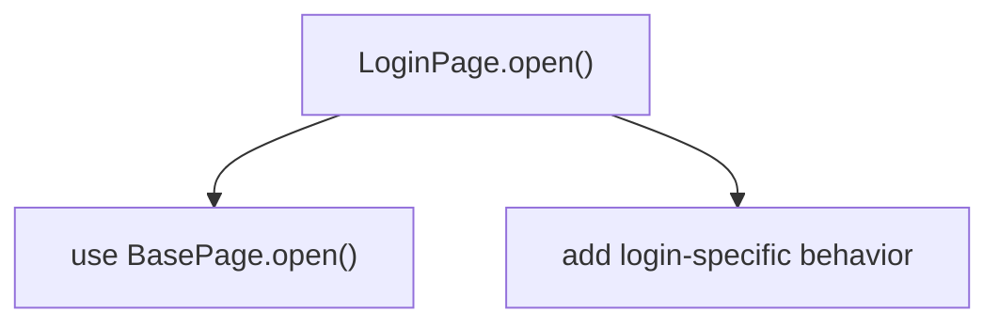

Это не просто "доступ к родителю".

Это поведение reuse inside override.

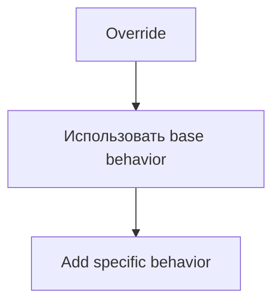

Для этого существует `super.method()`.

---

## Теория

`super.method()` calls base class method from derived class method.

Но не начинайте с синтаксиса.

Начинайте с вопроса:

> Какое base поведение используется повторно?

Пример:

```javascript
class BasePage {
  open(pageName) {
    return `open ${pageName}`;
  }
}

class LoginPage extends BasePage {
  open(pageName) {
    const baseResult = super.open(pageName);
    return `${baseResult} and focus login form`;
  }
}
```

Теперь:

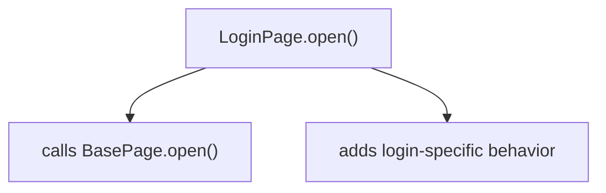

### Override without `super`

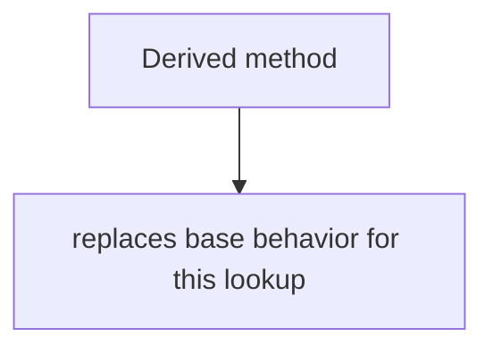

### Override with `super`

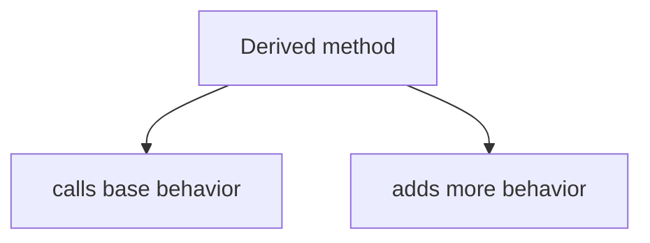

### Base method call

`super.open(pageName)` means:

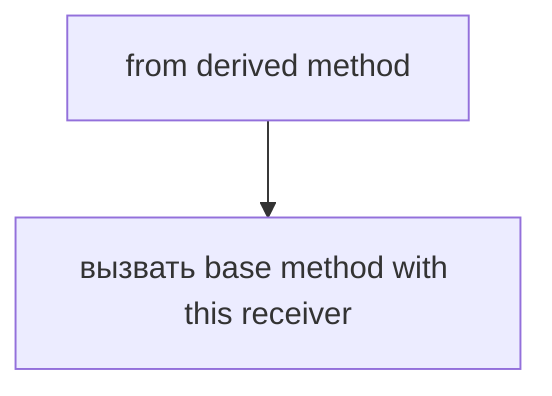

It does not mean:

```text
copy BasePage.open()
```

It means:

```text
call BasePage behavior through class relationship
```

### Relationship with `this`

Важно:

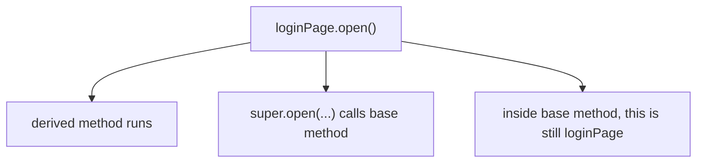

`super` chooses where method is taken from.

`this` still describes which object the method works with.

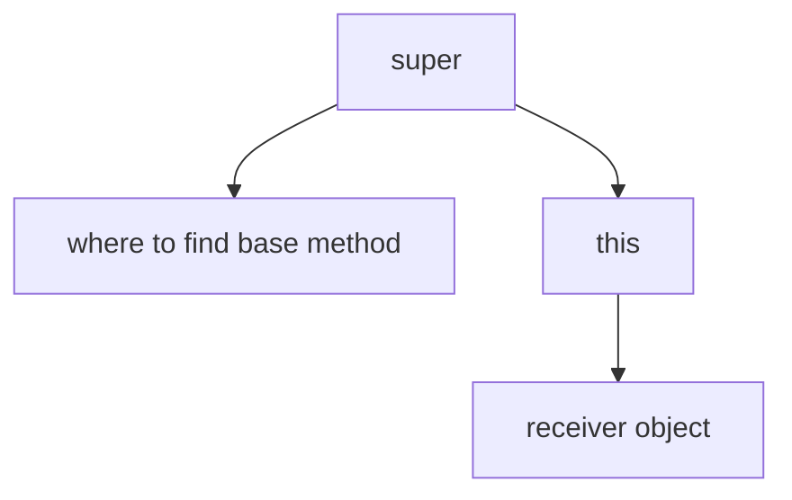

### Relationship with prototype lookup

`super` does not erase prototype-chain model.

High-level:

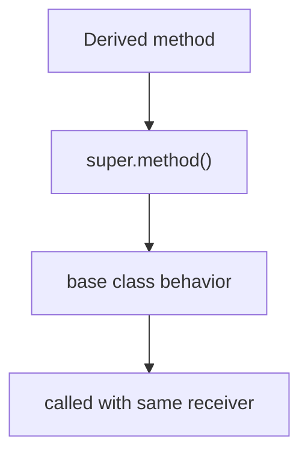

The class relationship created by `extends` tells JavaScript where base поведение is.

We do not need advanced prototype internals in this chapter.

---

## Внутренний механизм

Consider:

```javascript
const loginPage = new LoginPage();

loginPage.open('LoginPage');
```

Шаг 1:

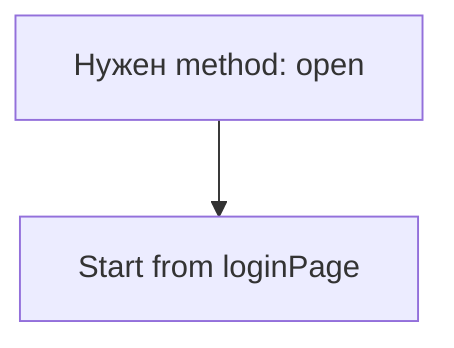

Шаг 2:

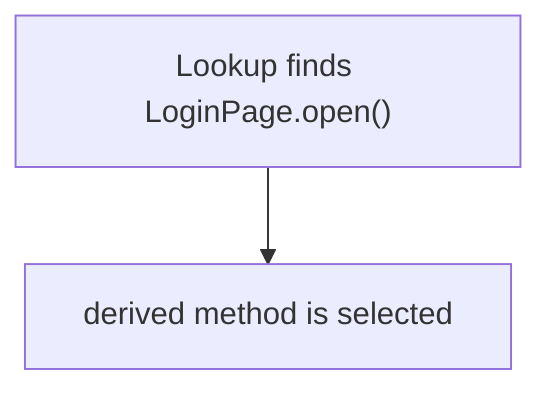

Шаг 3:

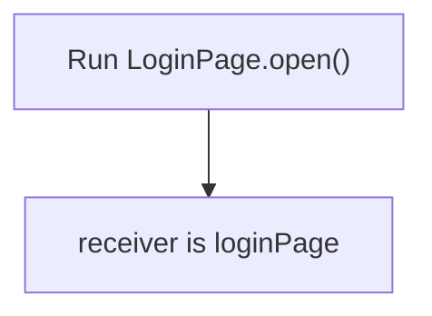

Шаг 4:

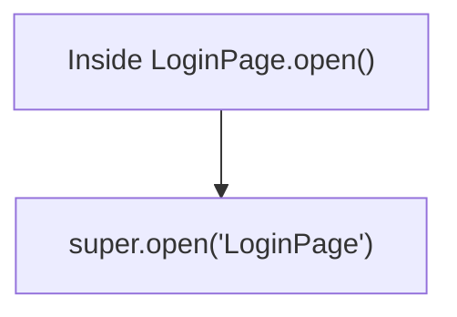

Шаг 5:

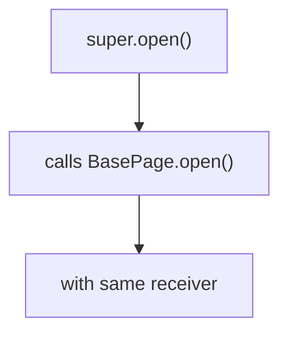

Шаг 6:

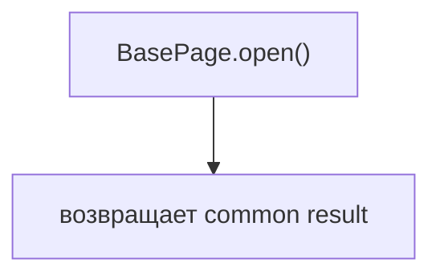

Шаг 7:

```mermaid
flowchart TD
    N1["LoginPage.open()"]
    N2["adds specific behavior"]
    N3["возвращает final result"]
    N1 --> N2
    N2 --> N3
```

Complete поток:

```mermaid
flowchart TD
    N1["loginPage.open()"]
    N2["LoginPage.open()"]
    N3["super.open()"]
    N4["BasePage.open()"]
    N5["back to LoginPage.open()"]
    N6["final result"]
    N1 --> N2
    N2 --> N3
    N3 --> N4
    N4 --> N5
    N5 --> N6
```

### Что происходит с `this`?

If base method uses `this`:

```javascript
class BasePage {
  label(pageName) {
    return `${this.prefix}: ${pageName}`;
  }
}
```

And derived instance has `prefix`:

```javascript
const loginPage = new LoginPage();
loginPage.prefix = 'page';
```

Then `super.label('LoginPage')` still uses `this` as `loginPage`.

```mermaid
flowchart TD
    N1["super.label()"]
    N2["calls BasePage.label"]
    N3["but"]
    N4["this → loginPage"]
    N1 --> N2
    N2 --> N3
    N3 --> N4
```

This is why `super` and `this` must not be confused.

---

## Ментальная модель

`super` is like calling the base manual from specialized procedure.

```mermaid
flowchart TD
    N1["Specialized procedure"]
    N2["вызвать base manual"]
    N3["add special step"]
    N1 --> N2
    N1 --> N3
```

Сначала использовать стандартную процедуру:

```mermaid
flowchart TD
    N1["Derived method"]
    N2["use standard base procedure"]
    N3["extend it"]
    N1 --> N2
    N1 --> N3
```

Extend common recipe:

```mermaid
flowchart TD
    N1["common recipe"]
    N2["special recipe adds ingredient"]
    N1 --> N2
```

Ask parent implementation:

```mermaid
flowchart TD
    N1["derived method"]
    N2["asks base method"]
    N3["then continues"]
    N1 --> N2
    N2 --> N3
```

Foundation and specialization:

```mermaid
flowchart TD
    N1["foundation"]
    N2["specialization"]
    N1 --> N2
```

Central idea:

```mermaid
flowchart TD
    N1["Override"]
    N2["Использовать base behavior"]
    N3["Add specific behavior"]
    N1 --> N2
    N2 --> N3
```

Это ментальные модели, а не формальные определения.

The technical idea for this chapter:

```mermaid
flowchart TD
    N1["super.method()"]
    N2["calls base method"]
    N3["through class relationship"]
    N1 --> N2
    N2 --> N3
```

---

## Примеры кода

Примеры находятся в:

```text
examples/01-javascript/chapter-43/
```

Запуск:

```bash
node examples/01-javascript/chapter-43/01-basic-super.js
```

### Пример 1. Basic super

Файл:

```text
examples/01-javascript/chapter-43/01-basic-super.js
```

Показывает `super.open()` inside derived `open()`.

### Пример 2. Extend method

Файл:

```text
examples/01-javascript/chapter-43/02-extend-method.js
```

Показывает base result plus derived-specific text.

### Пример 3. this with super

Файл:

```text
examples/01-javascript/chapter-43/03-this-with-super.js
```

Показывает that base method called through `super` still works with объект выполнения object.

### Пример 4. Типичные ошибки

Файл:

```text
examples/01-javascript/chapter-43/04-common-mistakes.js
```

Показывает override without `super`: base поведение is not reused.

### Пример 5. Page Object

Файл:

```text
examples/01-javascript/chapter-43/05-page-object.js
```

Показывает `BasePage.open()` and `LoginPage.open()` extending it.

### Пример 6. QA example

Файл:

```text
examples/01-javascript/chapter-43/06-qa-example.js
```

Показывает base API client request description extended by service client.

---

## Частые вопросы

### `super` копирует код base method?

Нет.

`super.method()` calls base поведение. It does not copy method body into derived class.

```mermaid
flowchart TD
    N1["super.method()"]
    N2["вызвать base behavior"]
    N1 --> N2
```

### `super` и `this` - одно и то же?

Нет.

```mermaid
flowchart TD
    N1["super"]
    N2["where to find base method"]
    N3["this"]
    N4["receiver object"]
    N1 --> N2
    N1 --> N3
    N3 --> N4
```

### Почему нельзя просто скопировать base method code?

Copy creates duplication.

If base поведение changes, copied code must be updated manually.

```mermaid
flowchart TD
    N1["copy"]
    N2["duplicated maintenance"]
    N3["super"]
    N4["reuse base behavior"]
    N1 --> N2
    N1 --> N3
    N3 --> N4
```

### Это то же самое, что `super()` in constructor?

Нет.

Эта глава объясняет `super.method()` внутри methods.

Constructor `super()` will be studied later when constructor inheritance becomes necessary.

### Можно ли использовать `super` without overriding?

`super.method()` is useful inside derived поведение when you need base поведение as part of derived поведение. The core case in this chapter is override plus extension.

---

## Распространенные мифы

### Миф: `super` means parent object

Реальность: in this chapter `super.method()` is a way to call base class поведение through class relationship.

### Миф: `super` changes `this`

Реальность: base method called through `super` still works with the current объект выполнения.

### Миф: `super` copies base method

Реальность: it calls base поведение.

### Миф: every override should call `super`

Реальность: иногда override намеренно заменяет поведение. Используйте `super`, когда base поведение нужно переиспользовать.

---

## Типичные ошибки

### Ошибка 1. Override and forget base поведение

Неправильный код:

```javascript
class BasePage {
  open(pageName) {
    return `open ${pageName}`;
  }
}

class LoginPage extends BasePage {
  open(pageName) {
    return `focus form on ${pageName}`;
  }
}
```

Что произошло:

`LoginPage.open()` replaced base поведение.

Исправленный вариант:

```javascript
open(pageName) {
  const baseResult = super.open(pageName);
  return `${baseResult} and focus form`;
}
```

### Ошибка 2. Think `super` changes объект выполнения

Неправильная модель:

```mermaid
flowchart TD
    N1["super.open()"]
    N2["this = BasePage"]
    N1 --> N2
```

Правильная модель:

```mermaid
flowchart TD
    N1["loginPage.open()"]
    N2["super.open()"]
    N3["this is still loginPage"]
    N1 --> N2
    N2 --> N3
```

### Ошибка 3. Использовать `super`, когда нужна замена поведение

Sometimes derived method should fully replace base поведение.

If so:

```mermaid
flowchart TD
    N1["override without super"]
    N2["can be intentional"]
    N1 --> N2
```

The decision is semantic:

```mermaid
flowchart TD
    N1["reuse base behavior?"]
    N2["да → super.method()"]
    N3["нет → нет super"]
    N1 --> N2
    N1 --> N3
```

### Ошибка 4. Try to use `super()` here

Эта глава не про constructor `super()`.

Wrong direction for this chapter:

```mermaid
flowchart TD
    N1["constructor super()"]
    N2["future topic"]
    N1 --> N2
```

Current topic:

```mermaid
flowchart TD
    N1["super.method()"]
    N2["вызвать base behavior inside method"]
    N1 --> N2
```

---

## Практическое использование

Используйте `super.method()`, когда:

```mermaid
flowchart TD
    N1["derived method"]
    N2["needs base behavior"]
    N3["plus"]
    N4["specific behavior"]
    N1 --> N2
    N2 --> N3
    N3 --> N4
```

Good examples:

* base page open + page-specific preparation;
* base request description + service-specific label;
* base validation formatting + specialized validation message;
* base framework logging + feature-specific context.

Avoid `super` when:

```mermaid
flowchart TD
    N1["derived behavior"]
    N2["should fully replace base behavior"]
    N1 --> N2
```

Правило читаемости:

```mermaid
flowchart TD
    N1["super.method()"]
    N2["should make behavior easier to follow"]
    N3["not hide important work"]
    N1 --> N2
    N2 --> N3
```

---

## Использование в Automation QA

### BasePage.open()

Base page:

```mermaid
flowchart TD
    N1["BasePage.open()"]
    N2["common open behavior"]
    N1 --> N2
```

Login page:

```mermaid
flowchart TD
    N1["LoginPage.open()"]
    N2["super.open()"]
    N3["focus login form"]
    N1 --> N2
    N1 --> N3
```

### API client

Base API client:

```mermaid
flowchart TD
    N1["BaseApiClient.describeRequest()"]
    N2["common request description"]
    N1 --> N2
```

Users client:

```mermaid
flowchart TD
    N1["UsersClient.describeRequest()"]
    N2["super.describeRequest()"]
    N3["add users service context"]
    N1 --> N2
    N1 --> N3
```

### Validators

Base validator:

```mermaid
flowchart TD
    N1["BaseValidator.formatFailure()"]
    N2["common expected/actual formatting"]
    N1 --> N2
```

Status validator:

```mermaid
flowchart TD
    N1["StatusValidator.formatFailure()"]
    N2["super.formatFailure()"]
    N3["add status-specific explanation"]
    N1 --> N2
    N1 --> N3
```

---

## Диаграммы главы

### 1. Зачем существует super

```mermaid
flowchart TD
    N1["override"]
    N2["but still need base behavior"]
    N3["super"]
    N1 --> N2
    N2 --> N3
```

### 2. Base method

```mermaid
flowchart TD
    N1["BasePage"]
    N2["open()"]
    N1 --> N2
```

### 3. Derived override

```mermaid
flowchart TD
    N1["LoginPage"]
    N2["open()"]
    N1 --> N2
```

### 4. Reuse base поведение

```mermaid
flowchart TD
    N1["LoginPage.open()"]
    N2["calls BasePage.open()"]
    N1 --> N2
```

### 5. Extend поведение

```mermaid
flowchart TD
    N1["base behavior"]
    N2["+"]
    N3["specific behavior"]
    N1 --> N2
    N2 --> N3
```

### 6. `super.method()`

```mermaid
flowchart TD
    N1["super.open()"]
    N2["вызвать base open()"]
    N1 --> N2
```

### 7. Base call flow

```mermaid
flowchart TD
    N1["derived method"]
    N2["super.method()"]
    N3["base method"]
    N1 --> N2
    N2 --> N3
```

### 8. Derived method flow

```mermaid
flowchart TD
    N1["start derived"]
    N2["вызвать base"]
    N3["add specific"]
    N4["вернуть result"]
    N1 --> N2
    N2 --> N3
    N3 --> N4
```

### 9. Текущая модель JavaScript

```mermaid
flowchart TD
    N1["Classes"]
    N2["Inheritance"]
    N3["super"]
    N1 --> N2
    N1 --> N3
```

### 10. Prototype lookup reminder

```mermaid
flowchart TD
    N1["derived behavior"]
    N2["base behavior"]
    N1 --> N2
```

### 11. Receiver reminder

```mermaid
flowchart TD
    N1["loginPage.open()"]
    N2["receiver is loginPage"]
    N1 --> N2
```

### 12. `this` inside base method

```mermaid
flowchart TD
    N1["super.open()"]
    N2["calls base method"]
    N3["but this → loginPage"]
    N1 --> N2
    N2 --> N3
```

### 13. QA BasePage example

```mermaid
flowchart TD
    N1["BasePage.open()"]
    N2["common navigation"]
    N1 --> N2
```

### 14. LoginPage example

```mermaid
flowchart TD
    N1["LoginPage.open()"]
    N2["super.open()"]
    N3["focus login form"]
    N1 --> N2
    N1 --> N3
```

### 15. API client example

```mermaid
flowchart TD
    N1["UsersClient.describeRequest()"]
    N2["super.describeRequest()"]
    N3["add service name"]
    N1 --> N2
    N1 --> N3
```

### 16. Читаемость

```mermaid
flowchart TD
    N1["common behavior stays common"]
    N2["specific behavior stays specific"]
    N1 --> N2
```

### 17. Типичные ошибки

```mermaid
flowchart TD
    N1["override"]
    N2["forget super"]
    N1 --> N2
```

### 18. Override without super

```mermaid
flowchart TD
    N1["derived method"]
    N2["replaces base behavior"]
    N1 --> N2
```

### 19. Override with super

```mermaid
flowchart TD
    N1["derived method"]
    N2["base behavior"]
    N3["specific behavior"]
    N1 --> N2
    N1 --> N3
```

### 20. Method composition

```mermaid
flowchart TD
    N1["base result"]
    N2["derived result"]
    N1 --> N2
```

### 21. Краткая ментальная модель

```mermaid
flowchart TD
    N1["Использовать base behavior"]
    N2["then add specialization"]
    N1 --> N2
```

### 22. Complete super model

```mermaid
flowchart TD
    N1["Derived method"]
    N2["super.method()"]
    N3["Base method"]
    N4["Derived method continues"]
    N1 --> N2
    N2 --> N3
    N3 --> N4
```

### 23. Base manual analogy

```mermaid
flowchart TD
    N1["special manual"]
    N2["calls"]
    N3["base manual"]
    N1 --> N2
    N2 --> N3
```

### 24. Recipe analogy

```mermaid
flowchart TD
    N1["common recipe"]
    N2["special recipe extension"]
    N1 --> N2
```

### 25. Procedure analogy

```mermaid
flowchart TD
    N1["standard procedure"]
    N2["then"]
    N3["special step"]
    N1 --> N2
    N2 --> N3
```

### 26. Object relationship

```mermaid
flowchart TD
    N1["loginPage"]
    N2["uses derived and base behavior"]
    N1 --> N2
```

### 27. Class relationship

```mermaid
flowchart TD
    N1["LoginPage"]
    N2["extends"]
    N3["BasePage"]
    N1 --> N2
    N2 --> N3
```

### 28. Lookup relationship

```mermaid
flowchart TD
    N1["derived method"]
    N2["can refer to"]
    N3["base method"]
    N1 --> N2
    N2 --> N3
```

### 29. Receiver relationship

```text
method source: base
receiver: derived instance
```

### 30. Переход к constructor super

```mermaid
flowchart TD
    N1["super.method()"]
    N2["now"]
    N3["super() in constructors later"]
    N1 --> N2
    N2 --> N3
```

### 31. Переход к advanced inheritance

```mermaid
flowchart TD
    N1["basic super"]
    N2["before"]
    N3["advanced inheritance details"]
    N1 --> N2
    N2 --> N3
```

### 32. Framework example

```mermaid
flowchart TD
    N1["BaseFrameworkObject.log()"]
    N2["FeatureObject.log()"]
    N1 --> N2
```

### 33. Validation helper

```mermaid
flowchart TD
    N1["BaseValidator.formatFailure()"]
    N2["StatusValidator.formatFailure()"]
    N1 --> N2
```

### 34. Derived extension

```mermaid
flowchart TD
    N1["base"]
    N2["plus"]
    N3["derived addition"]
    N1 --> N2
    N2 --> N3
```

### 35. Принадлежность поведения

```mermaid
flowchart TD
    N1["common part → base"]
    N2["specific part → derived"]
    N1 --> N2
```

### 36. Итоговая схема

```mermaid
flowchart TD
    N1["Derived method"]
    N2["overrides base method"]
    N3["super.method()"]
    N4["calls base behavior"]
    N5["adds specific behavior"]
    N1 --> N2
    N2 --> N3
    N3 --> N4
    N4 --> N5
```

---

## Итоги

`super` appears after Class Inheritance naturally.

Inheritance showed:

```mermaid
flowchart TD
    N1["Derived class"]
    N2["reuses"]
    N3["Base class behavior"]
    N1 --> N2
    N2 --> N3
```

Overriding showed:

```mermaid
flowchart TD
    N1["Derived method"]
    N2["can replace"]
    N3["Base method"]
    N1 --> N2
    N2 --> N3
```

`super` отвечает:

```text
Как derived method может переопределить base method
but still reuse base behavior?
```

Основная модель:

```mermaid
flowchart TD
    N1["Derived method"]
    N2["super.method()"]
    N3["base behavior"]
    N4["derived method adds specialization"]
    N1 --> N2
    N2 --> N3
    N3 --> N4
```

`super` does not copy base code. It calls base поведение through the class relationship, while the объект выполнения model and prototype-chain mental model still matter.

The next chapter starts the Arrays section.

---

## Что нужно запомнить

✓ `super.method()` calls base class поведение from derived method.

✓ `super` is most useful when override should extend base поведение.

✓ `super` does not copy base code.

✓ `super` and `this` are different concepts.

✓ Base method called through `super` still uses current объект выполнения.

✓ Override without `super` replaces base поведение for that method call.

✓ Override with `super` reuses and extends base поведение.

✓ Constructor `super()` is a future topic.

✓ Prototype-chain mental model still matters.

✓ Next section begins Arrays.

---

## Проверьте себя

1. Какую проблему решает `super`?

2. В чем разница между override с `super` и без `super`?

3. Does `super.method()` copy base method code?

4. Какое base поведение переиспользуется в `LoginPage.open()`?

5. На что указывает `this` внутри base method, вызванного через `super`?

6. Почему использовать `super`, а не копировать код base method?

7. When should an override avoid `super`?

8. Почему constructor `super()` здесь не рассматривается?

9. Чем `super` полезен в Page Objects?

10. Какой раздел идет дальше?

---

## Практика

Практические задания находятся в отдельном файле:

```text
practice/01-javascript/43-super.md
```

---

## Решения

Решения находятся в отдельном файле:

```text
solutions/01-javascript/43-super.md
```

Сначала выполните практику самостоятельно. Затем сравните объяснение, а не только финальный ответ.
