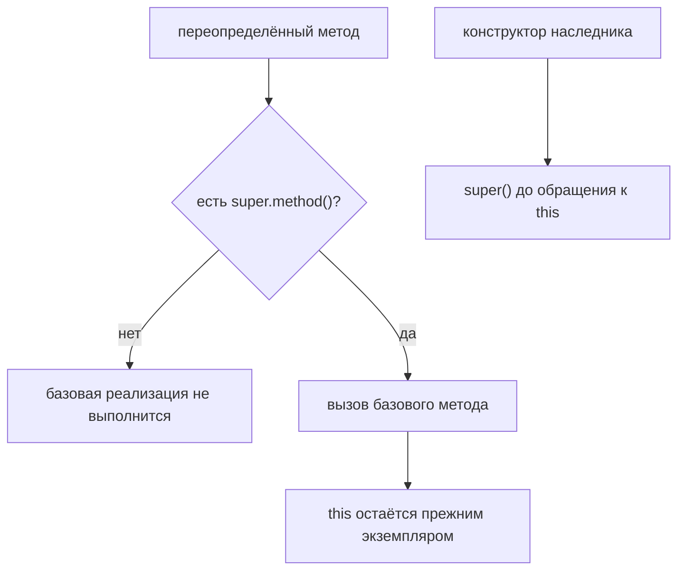

# Ключевое слово `super`

## Связь с предыдущей главой

Предыдущая глава объяснила Class Inheritance.

Главная модель была такой: наследование продолжает цепочку поиска методов от дочернего класса к родительскому.

Мы увидели, что derived class can reuse base class поведение:

```javascript
class BasePage {
  open(pageName) {
    return `open ${pageName}`;
  }
}

class LoginPage extends BasePage {}

const loginPage = new LoginPage();

console.log(loginPage.open('LoginPage'));
```

Также мы увидели overriding:

Теперь появляется следующий вопрос:

> Что если derived method переопределяет base method, но все еще хочет использовать base поведение?

Например: дочернему конструктору нужно передать часть данных родительскому, а не заполнять их заново.

Если просто override method, base method no longer runs for that call.

`super` отвечает на этот вопрос.

Главная модель главы: `super` — это способ обратиться к родительской реализации.

Важно: `super` does not copy base code. `super` calls base поведение through the class relationship.

---

## Предварительные требования

Для этой главы нужно понимать:

* что class methods are shared through prototype lookup;
* что inheritance reuses поведение between classes;
* что `extends` creates relationship between derived and base class;
* что overriding means closer method wins;
* что method location and объект выполнения are different concepts;
* что `this` inside method refers to объект выполнения during ordinary invocation.

Не требуется знать `super()` in constructors, constructor inheritance, private поля, static members, mixins, decorators, advanced prototype internals or `Reflect`. Constructor `super()` будет отдельной темой позже.

---

## Время изучения

Ориентировочное время:

```text
Чтение главы:            130-170 минут
Разбор схем:             60-80 минут
Запуск примеров:         25-35 минут
Практика:                120-150 минут
Повторение материала:    30 минут
```

Уровень сложности: **L4**.

`super` часто кажется коротким синтаксисом. Но важно видеть механизм: derived method не хочет заменить base поведение полностью. Он хочет reuse base поведение and extend it.

---

## Навигация

Предыдущая глава:

```text
docs/01-javascript/42-class-inheritance.md
```

Текущая глава:

```text
docs/01-javascript/43-super.md
```

Следующая глава:

```text
docs/01-javascript/44-arrays.md
```

Следующая глава начнет новый раздел:

> Как JavaScript работает с ordered collections значений?

---

## Цели обучения

После изучения этой главы вы будете понимать:

* зачем существует `super`;
* почему override sometimes still needs base поведение;
* что делает `super.method()`;
* как derived method extends base method;
* как `super` связан с class relationship;
* как `super` связан с prototype lookup;
* почему `this` inside base method still refers to объект выполнения;
* почему `super` не копирует base code;
* какие ошибки встречаются чаще всего;
* как `super` используется in Automation QA framework classes.

---

## Мотивация

Начнем с проблемы.

Есть base class:

```javascript
class BasePage {
  open(pageName) {
    return `open ${pageName}`;
  }
}
```

Есть derived class:

```javascript
class LoginPage extends BasePage {
  open(pageName) {
    return `open ${pageName} and focus login form`;
  }
}
```

Код работает.

Но common opening logic now duplicated conceptually:

Если base opening procedure changes, derived method must be updated manually.

Мы хотим другой поток:

Это не просто "доступ к родителю".

Это поведение reuse inside override.

Для этого существует `super.method()`.

---

## Теория

`super.method()` вызывает метод базового класса из метода производного.

Но не начинайте с синтаксиса.

Начинайте с вопроса:

> Какое базовое поведение используется повторно?

Пример:

```javascript
class BasePage {
  open(pageName) {
    return `open ${pageName}`;
  }
}

class LoginPage extends BasePage {
  open(pageName) {
    const baseResult = super.open(pageName);
    return `${baseResult} and focus login form`;
  }
}
```

Теперь:

```text
loginPage.open('LoginPage')  →  'open LoginPage and focus login form'
```

### Переопределение без `super`

Метод наследника полностью заменяет базовый: базовая реализация не выполняется
вовсе.

```text
'focus login form'      ←  от BasePage не осталось ничего
```

### Переопределение с `super`

Метод наследника дополняет базовый: сначала выполняется базовая реализация,
затем к её результату добавляется своё.

```text
'open LoginPage'  +  ' and focus login form'
```

### Вызов базового метода

`super.open(pageName)` означает:

```text
выполнить метод open, взятый из базового класса
```

Это не означает:

```text
copy BasePage.open()
```

Это означает:

```text
call BasePage behavior through class relationship
```

### Связь с `this`

Важно:

```text
super.open(pageName)  →  this внутри базового метода — тот же loginPage
```

`super` выбирает, откуда берётся метод.

`this` по-прежнему описывает, с каким объектом метод работает.

### Связь с поиском по прототипу

`super` не отменяет модель цепочки прототипов.

На высоком уровне:

```text
обычный вызов  —  поиск метода начинается с самого объекта
super          —  поиск начинается сразу с базового класса
```

Поэтому `super.open()` внутри `open()` не приводит к бесконечному вызову
самого себя.

Связь между классами, созданная через `extends`, сообщает JavaScript, где находится базовое поведение.

Углубляться в устройство прототипов в этой главе не нужно.

---

`super` вызывает базовую реализацию с тем же `this`:


```mermaid
flowchart TD
    A["переопределённый метод"] --> B{"есть super.method()?"}
    B -- "нет" --> C["базовая реализация не выполнится"]
    B -- "да" --> D["вызов базового метода"]
    D --> E["this остаётся прежним экземпляром"]
    F["конструктор наследника"] --> G["super() до обращения к this"]
```

## Внутренний механизм

Рассмотрим:

```javascript
const loginPage = new LoginPage();

loginPage.open('LoginPage');
```

Шаг 1: вызывается `loginPage.open('LoginPage')`.

Шаг 2: метод `open` найден в `LoginPage` — поиск останавливается здесь.

Шаг 3: выполняется тело переопределённого метода, `this` равен `loginPage`.

Шаг 4: встречается `super.open(pageName)`.

Шаг 5: метод `open` берётся из `BasePage`, а не из `LoginPage`.

Шаг 6: базовый метод выполняется с тем же `this` и возвращает строку.

Шаг 7: результат базового метода дополняется и возвращается наружу.

Полный ход выполнения:

```text
loginPage.open()  →  LoginPage.open  →  super  →  BasePage.open
                                                   ↓
                                             результат базового
                                                   ↓
                                        дополнен и возвращён
```

### Что происходит с `this`?

Если базовый метод использует `this`:

```javascript
class BasePage {
  label(pageName) {
    return `${this.prefix}: ${pageName}`;
  }
}
```

А у экземпляра производного класса есть `prefix`:

```javascript
const loginPage = new LoginPage();
loginPage.prefix = 'page';
```

То `super.label('LoginPage')` по-прежнему использует `this`, равный `loginPage`.

Именно поэтому `super` и `this` нельзя путать.

---

## Ментальная модель

`super` похож на обращение к общей инструкции из частной процедуры.

```text
дочерний метод
 ├─ super.open()     сначала выполнить стандартную процедуру родителя
 └─ своё дополнение  затем сделать то, что нужно этой странице
```

Все три привычные аналогии — «сначала общая инструкция», «дополнить общий
рецепт», «спросить реализацию родителя» — про одно: наследник не заменяет
поведение родителя, а опирается на него.

Фундамент и надстройка: наследник достраивает то, что уже сделал родитель, а
не заменяет его целиком.

Это ментальные модели, а не формальные определения.

Техническая идея для этой главы: `super` — это ссылка на реализацию родителя.
В конструкторе `super()` вызывает конструктор родителя, в методе
`super.method()` вызывает родительскую версию метода, не теряя текущего объекта
выполнения.

---

## Примеры кода

Примеры находятся в:

```text
examples/01-javascript/chapter-43/
```

Запуск:

```bash
node examples/01-javascript/chapter-43/01-basic-super.js
```

### Пример 1. Базовый `super`

Файл:

```text
examples/01-javascript/chapter-43/01-basic-super.js
```

Показывает `super.open()` внутри переопределённого `open()`.

### Пример 2. Дополнение метода

Файл:

```text
examples/01-javascript/chapter-43/02-extend-method.js
```

Показывает результат базового метода плюс текст производного.

### Пример 3. `this` вместе с `super`

Файл:

```text
examples/01-javascript/chapter-43/03-this-with-super.js
```

Показывает, что базовый метод, вызванный через `super`, по-прежнему работает с объектом выполнения.

### Пример 4. Типичные ошибки

Файл:

```text
examples/01-javascript/chapter-43/04-common-mistakes.js
```

Показывает переопределение без `super`: базовое поведение не переиспользуется.

### Пример 5. Объект страницы

Файл:

```text
examples/01-javascript/chapter-43/05-page-object.js
```

Показывает `BasePage.open()` и дополняющий его `LoginPage.open()`.

### Пример 6. Пример из автоматизации тестов

Файл:

```text
examples/01-javascript/chapter-43/06-qa-example.js
```

Показывает описание запроса базового клиента API, дополненное клиентом сервиса.

---

## Частые вопросы

### `super` копирует код базового метода?

Нет.

`super.method()` вызывает базовое поведение. Тело метода в производный класс он не копирует.

### `super` и `this` - одно и то же?

Нет.

### Почему нельзя просто скопировать код базового метода?

Копия создаёт дублирование.

Если базовое поведение изменится, копию придётся править вручную.

### Это то же самое, что `super()` в конструкторе?

Нет.

Эта глава объясняет `super.method()` внутри методов.

`super()` в конструкторе будет изучаться позже, когда понадобится наследование конструкторов.

### Можно ли использовать `super` без переопределения?

`super.method()` полезен внутри производного поведения, когда базовое нужно как его часть. Основной случай в этой главе — переопределение с дополнением.

---

## Распространённые мифы

### Миф: `super` означает родительский объект

Реальность: в этой главе `super.method()` — способ вызвать поведение базового класса через связь классов.

### Миф: `super` меняет `this`

Реальность: базовый метод, вызванный через `super`, по-прежнему работает с текущим объектом выполнения.

### Миф: `super` копирует базовый метод

Реальность: он вызывает базовое поведение.

### Миф: каждое переопределение должно вызывать `super`

Реальность: иногда переопределение намеренно заменяет поведение. Используйте `super`, когда базовое поведение нужно переиспользовать.

---

## Распространённые ошибки

### Ошибка 1. Переопределить и забыть базовое поведение

Неправильный код:

```javascript
class BasePage {
  open(pageName) {
    return `open ${pageName}`;
  }
}

class LoginPage extends BasePage {
  open(pageName) {
    return `focus form on ${pageName}`;
  }
}
```

Что произошло:

`LoginPage.open()` заменил базовое поведение.

Исправленный вариант:

```javascript
open(pageName) {
  const baseResult = super.open(pageName);
  return `${baseResult} and focus form`;
}
```

### Ошибка 2. Думать, что `super` меняет объект выполнения

Неправильная модель: будто `super` можно вызывать в любом месте дочернего конструктора.

Правильная модель: `super()` вызывается до первого обращения к `this` — иначе объект ещё не готов.

### Ошибка 3. Использовать `super`, когда нужна замена поведение

Иногда производный метод должен полностью заменить базовое поведение.

Если так:

```text
базовый метод не вызывают — наследник описывает поведение целиком
```

Решение принимается по смыслу:

```text
дополняем базовое поведение  →  нужен super
заменяем базовое поведение   →  super не нужен
```

Вопрос решается смыслом, а не привычкой всегда вызывать `super`.

### Ошибка 4. Пытаться использовать здесь `super()`

Эта глава не про `super()` в конструкторе.

Неверное направление для этой главы:

```text
super() в конструкторе — тема главы о конструкторах наследников
```

Текущая тема:

```text
super.method() в обычном методе — вызов базовой реализации
```

---

## Практическое использование

Используйте `super.method()`, когда поведение родителя нужно выполнить целиком, а
затем добавить своё.

Удачные примеры:

* открытие базовой страницы плюс подготовка конкретной;
* описание базового запроса плюс метка конкретного сервиса;
* базовое форматирование проверки плюс частное сообщение;
* базовое журналирование фреймворка плюс контекст конкретной возможности.

Не используйте `super`, когда:

```text
базовое поведение в этом случае не нужно вовсе
```

Правило читаемости:

```text
super в начале метода — базовое поведение, затем своё;
это самый предсказуемый порядок для читателя
```

---

## Использование в Automation QA

### Метод `open()` базовой страницы

Базовая страница:

```javascript
class BasePage {
  open(pageName) {
    return `open ${pageName}`;
  }
}
```

Страница входа:

```javascript
class LoginPage extends BasePage {
  open(pageName) {
    return `${super.open(pageName)} and focus login form`;
  }
}
```

### Клиент API

Базовый клиент API:

```javascript
class BaseClient {
  describeRequest(path) {
    return `GET ${path}`;
  }
}
```

Клиент пользователей:

```javascript
class UsersClient extends BaseClient {
  describeRequest(path) {
    return `${super.describeRequest(path)} [users]`;
  }
}
```

### Проверки

Базовая проверка:

```javascript
class BaseValidator {
  describe() {
    return 'validator';
  }
}
```

```javascript
class StatusValidator extends BaseValidator {
  describe() {
    return `${super.describe()} статуса ответа`;
  }
}

console.log(new StatusValidator().describe());
```

Наследник дополняет описание родителя, а не переписывает его. Если позже
изменится базовая формулировка, изменится и результат наследника — дублировать
строку не пришлось.

---

## Итоги

`super` естественно появляется после наследования классов.

Наследование показало, как дочерний класс получает поведение родителя.

Переопределение показало, как дочерний класс может заменить это поведение своим.

`super` отвечает на следующий вопрос:

```text
как переопределить метод родителя
и при этом переиспользовать его поведение?
```

Основная модель: `super` даёт доступ к родительскому конструктору и родительским методам из дочернего класса.

`super` не копирует базовый код. Он вызывает базовое поведение через связь классов, а модель объекта выполнения и цепочки прототипов по-прежнему важны.

Следующая глава начинает раздел про массивы.

---

## Что нужно запомнить

✓ `super.method()` вызывает поведение базового класса из метода производного.

✓ `super` полезнее всего, когда переопределение должно дополнить базовое поведение.

✓ `super` не копирует базовый код.

✓ `super` и `this` — разные вещи.

✓ Базовый метод, вызванный через `super`, по-прежнему использует текущий объект выполнения.

✓ Переопределение без `super` заменяет базовое поведение для этого вызова.

✓ Переопределение с `super` переиспользует и дополняет базовое поведение.

✓ `super()` в конструкторе — будущая тема.

✓ Модель цепочки прототипов по-прежнему важна.

✓ Следующий раздел начинает массивы.

---

## Проверьте себя

1. Какую проблему решает `super`?

2. В чём разница между переопределением с `super` и без него?

3. Копирует ли `super.method()` код базового метода?

4. Какое базовое поведение переиспользуется в `LoginPage.open()`?

5. На что указывает `this` внутри базового метода, вызванного через `super`?

6. Почему использовать `super`, а не копировать код базового метода?

7. Когда переопределению не нужен `super`?

8. Почему `super()` в конструкторе здесь не рассматривается?

9. Чем `super` полезен в объектах страниц?

10. Какой раздел идет дальше?

### Ответы

1. Позволяет переопределённому методу дополнить базовую реализацию, а не заменить её целиком.
2. Без `super` базовый метод не выполняется вовсе. С `super` сначала выполняется базовая реализация, а затем к её результату добавляется своё.
3. Нет. Он вызывает метод, лежащий в базовом классе, по связи между классами.
4. Общая часть открытия страницы: то, что делает `BasePage.open()` для любой страницы. `LoginPage` добавляет к этому только своё — фокус на форме входа.
5. На тот же объект, через который вызван переопределённый метод. `super` меняет, откуда берётся метод, а не для какого объекта он выполняется.
6. Копия живёт своей жизнью: изменение базового поведения придётся повторять в каждом потомке. `super` оставляет общую часть в одном месте.
7. Когда производный класс описывает поведение целиком и базовая реализация в этом случае не нужна.
8. `super()` в конструкторе решает другую задачу — подготовку объекта перед обращением к `this`. Эта глава о вызове базового метода из обычного метода.
9. Общее для всех страниц действие описывается один раз в базовом классе, а конкретная страница добавляет к нему свой шаг, не переписывая общую часть.
10. Массивы: упорядоченные коллекции значений.

---

## Практика

Практические задания находятся в отдельном файле:

```text
practice/01-javascript/43-super.md
```

---

## Решения

Решения находятся в отдельном файле:

```text
solutions/01-javascript/43-super.md
```

Сначала выполните практику самостоятельно. Затем сравните объяснение, а не только финальный ответ.
