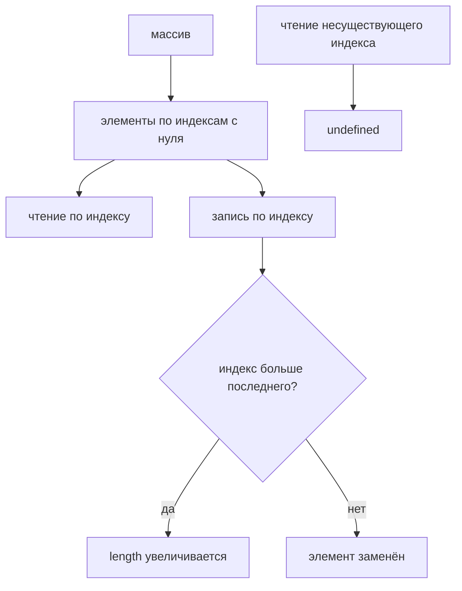

# Arrays

## Связь с предыдущей главой

Предыдущая глава завершила блок Objects and Classes.

Мы научились моделировать одну entity:

Например:

```javascript
const user = {
  email: 'anna@example.test',
  role: 'admin'
};
```

Object отвечает на вопрос:

```text
What value belongs to this name?
```

Теперь появляется новый вопрос:

> Как хранить много значения together, если важен порядок?

Например, API вернул 100 users.

Неудобная модель:

```text
user1
user2
user3
...
user100
```

Нужна ordered collection:

Arrays start a new section.

---

## Предварительные требования

Для этой главы нужно понимать:

* что value can be primitive or object;
* что object models one entity with named properties;
* что variable gives named access to value;
* что JavaScript can read and update значения;
* что Automation QA often works with API responses, users, assertions and test data.

Не требуется знать array methods, `push`, `pop`, `shift`, `unshift`, `splice`, `slice`, `map`, `filter`, `reduce`, loops or iteration. Эти темы будут изучаться позже.

---

## Время изучения

Ориентировочное время:

```text
Чтение главы:            120-150 минут
Разбор схем:             60-80 минут
Запуск примеров:         20-30 минут
Практика:                110-140 минут
Повторение материала:    30 минут
```

Уровень сложности: **L3**.

Array syntax looks simple. The important part is not square brackets. The important part is ordered storage and index-based access.

---

## Навигация

Предыдущая глава:

```text
docs/01-javascript/43-super.md
```

Текущая глава:

```text
docs/01-javascript/44-arrays.md
```

Следующая глава:

```text
docs/01-javascript/45-push-pop.md
```

Следующая глава ответит:

> How do arrays grow and shrink?

---

## Цели обучения

После изучения этой главы вы будете понимать:

* зачем arrays существуют;
* что такое ordered collection;
* что такое index;
* почему index starts from `0`;
* как создать array literal;
* как читать element by index;
* как заменить element by index;
* что показывает `length`;
* что означает empty array;
* чем array отличается от object на уровне задачи;
* как arrays используются in Automation QA.

---

## Мотивация

Начнем с проблемы.

Нужно хранить test users:

```javascript
const firstUser = 'anna@example.test';
const secondUser = 'kate@example.test';
const thirdUser = 'max@example.test';
```

Для трех users это еще терпимо.

Но если users сто:

```text
user1
user2
user3
...
user100
```

Проблема:

Нам нужна одна value, которая represents many ordered значения:

```javascript
const testUsers = [
  'anna@example.test',
  'kate@example.test',
  'max@example.test'
];
```

Теперь есть one collection:

Array solves ordered storage.

---

## Теория

Array is an ordered collection of значения.

Главная модель: массив — это упорядоченный список значений, доступных по числовому индексу.

Array literal:

```javascript
const users = [
  'anna@example.test',
  'kate@example.test',
  'max@example.test'
];
```

Square brackets are syntax.

The concept is ordered collection:

### Index

Index is numbered position inside array.

JavaScript arrays use zero-based indexes:

```text
index:  0                  1                  2
value: "anna@example.test" "kate@example.test" "max@example.test"
```

First element has index `0`.

```javascript
console.log(users[0]);
```

Результат:

```text
anna@example.test
```

### Reading elements

Reading by index:

```javascript
const firstUser = users[0];
const secondUser = users[1];
```

Ментальная модель:

```text
index:  0        1        2
value: 'login'  'order'  'logout'
```

### Updating elements

You can replace value at position:

```javascript
users[1] = 'kate.updated@example.test';
```

Ментальная модель: пронумерованные ячейки, где номер — это позиция, а не имя.

This is element replacement.

We are not studying array growth yet. Adding/removing elements with methods such as `push()` and `pop()` is the next chapter.

### Length

`length` shows how many elements array currently contains.

```javascript
console.log(users.length);
```

Для:

```javascript
const users = ['Anna', 'Kate', 'Max'];
```

`length` is:

```text
3
```

Важная связь:

For length `3`, last index is `2`.

```text
index: 0 1 2
count: 1 2 3
```

### Empty array

Empty array contains no elements:

```javascript
const failedAssertions = [];
```

Ментальная модель: `length` — не последний индекс, а количество элементов; последний индекс всегда на единицу меньше.

It can represent:

```text
no failures yet
no users yet
no requests yet
```

We are not adding elements yet. Growth is next chapter.

### Mixed значения

JavaScript arrays can contain different kinds of значения:

```javascript
const mixed = ['status', 200, true];
```

This is allowed.

But for readable test code, arrays are usually clearer when elements represent the same kind of thing:

Mixed значения will appear naturally later, but do not use them as default style.

---

Индекс и длина связаны, но не одно и то же:



## Внутренний механизм

When JavaScript reads:

```javascript
users[2]
```

Engine has:

```text
array value: users
requested index: 2
```

Then:

If index exists:

If index does not contain element:

This is similar to reading missing object property in one important way:

But the question is different.

Объект:

```text
What value belongs to this name?
```

Array:

```text
What value is stored at this position?
```

### Updating flow

Для:

```javascript
users[1] = 'updated@example.test';
```

Engine:

After update:

### Length flow

When reading:

```javascript
users.length
```

You ask:

```text
How many elements are in this array?
```

Не так:

```text
What is the last index?
```

This distinction matters:

```text
length: 3
last index: 2
```

---

## Ментальная модель

Array is like bookshelf.

Numbered lockers:

Train cars:

Hotel rooms:

Spreadsheet rows:

These are analogies.

The technical mental model:

---

## Примеры кода

Примеры находятся в:

```text
examples/01-javascript/chapter-44/
```

Запуск:

```bash
node examples/01-javascript/chapter-44/01-first-array.js
```

### Пример 1. First array

Файл:

```text
examples/01-javascript/chapter-44/01-first-array.js
```

Показывает array literal as ordered collection.

### Пример 2. Indexes

Файл:

```text
examples/01-javascript/chapter-44/02-indexes.js
```

Показывает reading значения by index.

### Пример 3. Update elements

Файл:

```text
examples/01-javascript/chapter-44/03-update-elements.js
```

Показывает replacement at existing position.

### Пример 4. Length

Файл:

```text
examples/01-javascript/chapter-44/04-length.js
```

Показывает `length` and last index relation.

### Пример 5. Типичные ошибки

Файл:

```text
examples/01-javascript/chapter-44/05-common-mistakes.js
```

Показывает off-by-one mistake.

### Пример 6. QA example

Файл:

```text
examples/01-javascript/chapter-44/06-qa-example.js
```

Показывает list of users returned from API.

---

## Частые вопросы

### Array - это просто квадратные скобки?

Нет.

Square brackets are syntax.

Array is ordered collection.

### Почему первый index is `0`?

JavaScript uses zero-based indexing. This is common in many programming languages.

For this chapter, remember practical rule:

### Array can store objects?

Да.

Например:

```javascript
const users = [
  { email: 'anna@example.test' },
  { email: 'kate@example.test' }
];
```

This is common in API testing.

### Should arrays contain mixed значения?

JavaScript allows it, but readability often suffers.

Prefer arrays where elements represent same kind of thing:

```text
users
requests
assertions
test cases
```

### Why not use object вместо array?

Use object when names matter.

Use array when order and positions matter.

---

## Распространённые мифы

### Миф: Array is just object with square brackets

Реальность: arrays are object значения in JavaScript, but for this chapter the useful model is ordered collection with indexes. Object internals will be discussed only when needed.

### Миф: `length` is last index

Реальность: last index is `length - 1`.

### Миф: `users[1]` reads first user

Реальность: `users[0]` reads first user.

### Миф: Empty array means error

Реальность: empty array can validly represent "no items".

---

## Распространённые ошибки

### Ошибка 1. Off-by-one

Неправильный код:

```javascript
const users = ['Anna', 'Kate', 'Max'];

console.log(users[3]);
```

Что произошло:

Array has length `3`, but indexes are `0`, `1`, `2`.

```text
length: 3
last index: 2
```

Исправленный вариант:

```javascript
console.log(users[2]);
```

### Ошибка 2. Путать object property and array index

Неправильная модель:

```text
users.email
```

Для array:

```text
users[0]
```

Если element is object:

```javascript
users[0].email
```

### Ошибка 3. Считать `length` position

Неправильно:

```javascript
const lastUser = users[users.length];
```

Правильно:

```javascript
const lastUser = users[users.length - 1];
```

### Ошибка 4. Использовать many variables вместо array

Неправильная модель:

```javascript
const firstRequest = '/users';
const secondRequest = '/orders';
const thirdRequest = '/profile';
```

Лучше:

```javascript
const requests = ['/users', '/orders', '/profile'];
```

---

## Практическое использование

Arrays useful when you have:

Примеры:

* list of users;
* list of test cases;
* list of API responses;
* list of failed assertions;
* list of HTTP requests;
* list of browser tabs.

Array improves readability:

Instead of:

```text
user1
user2
user3
```

---

## Использование в Automation QA

### Users returned from API

API often возвращает:

В коде:

```javascript
const users = [
  { email: 'anna@example.test', role: 'admin' },
  { email: 'kate@example.test', role: 'editor' }
];
```

Read first user:

```javascript
const firstUser = users[0];
```

### List of test cases

```javascript
const testCases = [
  'valid login',
  'invalid password',
  'locked user'
];
```

The order can match reporting order.

### Browser tabs

Browser contexts can have many pages/tabs.

Концептуально:

### Failed assertions

Empty array can represent no failures:

```javascript
const failedAssertions = [];
```

Later chapters will explain how arrays grow when new failure is added.

### HTTP requests

```javascript
const requests = [
  'GET /users',
  'POST /orders',
  'GET /profile'
];
```

This keeps related request descriptions together.

---

## Диаграммы главы

### 1. Why arrays exist

### 2. One object vs many objects

### 3. Ordered collection

### 4. Numbered positions

```text
position 0
position 1
position 2
```

### 5. Indexes

```text
index: 0 1 2
value: A B C
```

### 6. Reading by index

### 7. Updating by index

### 8. Length

### 9. Empty array

### 10. Mixed значения

### 11. Текущая модель JavaScript

### 12. QA users list

### 13. API response

### 14. Test cases

### 15. Читаемость

### 16. Типичные ошибки

### 17. Bookshelf analogy

### 18. Train analogy

### 19. Hotel analogy

### 20. Spreadsheet analogy

### 21. Index lookup

### 22. Last element

### 23. Array growth preview

### 24. Element replacement

### 25. Краткая ментальная модель

### 26. Complete array model

### 27. Object vs array

### 28. Ordered storage

### 29. Принадлежность значения

### 30. Array lifecycle

### 31. Переход к push()

### 32. Переход к loops

### 33. Переход к iteration

### 34. QA framework example

### 35. API collection

### 36. Collection evolution

### 37. Element identity

### 38. Array memory intuition

### 39. Reading flow

### 40. Итоговая схема

---

## Итоги

Objects answered:

```text
How do we model one entity?
```

Arrays answer:

```text
How do we store many values together in order?
```

The central model:

Objects and arrays solve different problems:

The next chapter will explain how arrays grow and shrink with methods such as `push()` and `pop()`.

---

## Что нужно запомнить

✓ Array is an ordered collection of значения.

✓ Array elements are accessed by indexes.

✓ First index is `0`.

✓ `length` is count of elements, not last index.

✓ Last index is `length - 1`.

✓ Empty array has length `0`.

✓ Arrays can contain primitive значения and objects.

✓ Objects use names; arrays use positions.

✓ Arrays are common in API responses and test data.

✓ Array methods and loops are future topics.

---

## Проверьте себя

1. What problem do arrays solve?

2. Why use an array вместо many variables?

3. What is an index?

4. What index reads the first element?

5. If array length is `4`, what is the last index?

6. What does `users[1]` mean?

7. What does empty array represent?

8. How is array different from object?

9. Why should mixed arrays be used carefully?

10. What will the next chapter explain?

---

## Практика

Практические задания находятся в отдельном файле:

```text
practice/01-javascript/44-arrays.md
```

---

## Решения

Решения находятся в отдельном файле:

```text
solutions/01-javascript/44-arrays.md
```

Сначала выполните практику самостоятельно. Затем сравните ход рассуждения, а не только итоговый ответ.
