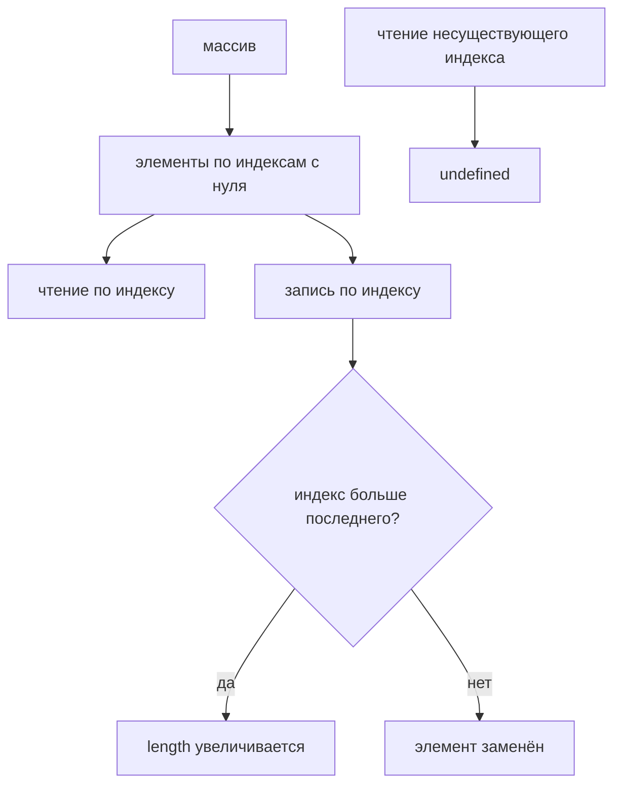

# Массивы

## Связь с предыдущей главой

Предыдущая глава завершила блок Objects and Classes.

Мы научились моделировать одну entity:

Например:

```javascript
const user = {
  email: 'anna@example.test',
  role: 'admin'
};
```

Object отвечает на вопрос:

```text
What value belongs to this name?
```

Теперь появляется новый вопрос:

> Как хранить много значения together, если важен порядок?

Например, API вернул 100 users.

Неудобная модель:

```text
user1
user2
user3
...
user100
```

Нужна ordered collection:

Arrays start a new section.

---

## Предварительные требования

Для этой главы нужно понимать:

* что value can be primitive or object;
* что object models one entity with named properties;
* что variable gives named access to value;
* что JavaScript can read and update значения;
* что Automation QA often works with API responses, users, assertions and test data.

Не требуется знать array methods, `push`, `pop`, `shift`, `unshift`, `splice`, `slice`, `map`, `filter`, `reduce`, loops or iteration. Эти темы будут изучаться позже.

---

## Время изучения

Ориентировочное время:

```text
Чтение главы:            120-150 минут
Разбор схем:             60-80 минут
Запуск примеров:         20-30 минут
Практика:                110-140 минут
Повторение материала:    30 минут
```

Уровень сложности: **L3**.

Array syntax looks simple. The important part is not square brackets. The important part is ordered storage and index-based access.

---

## Навигация

Предыдущая глава:

```text
docs/01-javascript/43-super.md
```

Текущая глава:

```text
docs/01-javascript/44-arrays.md
```

Следующая глава:

```text
docs/01-javascript/45-push-pop.md
```

Следующая глава ответит:

> How do arrays grow and shrink?

---

## Цели обучения

После изучения этой главы вы будете понимать:

* зачем arrays существуют;
* что такое ordered collection;
* что такое index;
* почему index starts from `0`;
* как создать array literal;
* как читать element by index;
* как заменить element by index;
* что показывает `length`;
* что означает empty array;
* чем array отличается от object на уровне задачи;
* как arrays используются in Automation QA.

---

## Мотивация

Начнем с проблемы.

Нужно хранить test users:

```javascript
const firstUser = 'anna@example.test';
const secondUser = 'kate@example.test';
const thirdUser = 'max@example.test';
```

Для трех users это еще терпимо.

Но если users сто:

```text
user1
user2
user3
...
user100
```

Проблема:

Нам нужна одна value, которая represents many ordered значения:

```javascript
const testUsers = [
  'anna@example.test',
  'kate@example.test',
  'max@example.test'
];
```

Теперь есть one collection:

Array solves ordered storage.

---

## Теория

Массив — упорядоченная коллекция значений.

Главная модель: массив — это упорядоченный список значений, доступных по числовому индексу.

Литерал массива:

```javascript
const users = [
  'anna@example.test',
  'kate@example.test',
  'max@example.test'
];
```

Квадратные скобки — это запись.

Суть — упорядоченная коллекция:

```text
значения лежат по порядку,
у каждого есть номер позиции,
и этот порядок сохраняется между обращениями
```

### Индекс

Индекс — номер позиции внутри массива.

Индексы массивов в JavaScript начинаются с нуля:

```text
index:  0                  1                  2
value: "anna@example.test" "kate@example.test" "max@example.test"
```

У первого элемента индекс `0`.

```javascript
console.log(users[0]);
```

Результат:

```text
anna@example.test
```

### Чтение элементов

Чтение по индексу:

```javascript
const firstUser = users[0];
const secondUser = users[1];
```

Ментальная модель:

```text
index:  0        1        2
value: 'login'  'order'  'logout'
```

### Обновление элементов

Значение на позиции можно заменить:

```javascript
users[1] = 'kate.updated@example.test';
```

Ментальная модель: пронумерованные ячейки, где номер — это позиция, а не имя.

Это замена элемента.

Рост массива мы пока не изучаем. Добавление и удаление элементов методами вроде `push()` и `pop()` — тема следующей главы.

### Длина

`length` показывает, сколько элементов сейчас в массиве.

```javascript
console.log(users.length);
```

Для:

```javascript
const users = ['Anna', 'Kate', 'Max'];
```

`length` равен:

```text
3
```

Важная связь:

При длине `3` последний индекс равен `2`.

```text
index: 0 1 2
count: 1 2 3
```

### Пустой массив

Пустой массив не содержит элементов:

```javascript
const failedAssertions = [];
```

Ментальная модель: `length` — не последний индекс, а количество элементов; последний индекс всегда на единицу меньше.

Он может означать:

```text
no failures yet
no users yet
no requests yet
```

Элементы мы пока не добавляем. Рост массива — следующая глава.

### Разнородные значения

Массивы в JavaScript могут содержать значения разного вида:

```javascript
const mixed = ['status', 200, true];
```

Это допустимо.

Но код тестов читается лучше, когда элементы массива означают однотипные вещи:

Разнородные значения встретятся позже естественным образом, но не используйте их как стиль по умолчанию.

---

Индекс и длина связаны, но не одно и то же:


```mermaid
flowchart TD
    A["массив"] --> B["элементы по индексам с нуля"]
    B --> C["чтение по индексу"]
    B --> D["запись по индексу"]
    D --> E{"индекс больше последнего?"}
    E -- "да" --> F["length увеличивается"]
    E -- "нет" --> G["элемент заменён"]
    H["чтение несуществующего индекса"] --> I["undefined"]
```

## Внутренний механизм

Когда JavaScript читает:

```javascript
users[2]
```

У движка есть:

```text
массив: users
запрошенный индекс: 2
```

Затем движок смотрит, есть ли элемент на этой позиции:

```text
индекс существует      →  вернуть элемент
элемента на позиции нет →  вернуть undefined, ошибки НЕТ
```

Это похоже на чтение отсутствующего свойства объекта в одном важном смысле: ни то
ни другое не падает. Падение приходит позже, когда с `undefined` пытаются
работать как со значением.

Но вопрос здесь другой.

Объект:

```text
какое значение принадлежит этому имени?
```

Массив:

```text
какое значение хранится на этой позиции?
```

### Поток обновления

Для:

```javascript
users[1] = 'updated@example.test';
```

Движок:

```text
1. по имени users найти массив
2. взять позицию с номером 1
3. заменить лежащее там значение
```

После обновления:

```text
[0] 'anna@example.test'
[1] 'updated@example.test'
[2] 'max@example.test'
```

Длина массива не изменилась: заменено значение, а не добавлена позиция.

### Поток изменения длины

При чтении:

```javascript
users.length
```

Вы спрашиваете:

```text
How many elements are in this array?
```

Не так:

```text
What is the last index?
```

Это различие важно:

```text
length: 3
last index: 2
```

---

## Ментальная модель

Массив похож на книжную полку.

```text
users
 ├─ [0]  'anna@example.test'
 ├─ [1]  'ivan@example.test'
 └─ [2]  'olga@example.test'
```

Ячейки пронумерованы, и номер — часть адреса значения, а не его описание.

Номера в гостинице и строки таблицы — привычные аналогии: у каждого элемента
есть номер, и по номеру его находят.

Это аналогии.

Техническая мысленная модель точнее: массив — объект с числовыми ключами и
свойством `length`. Именно поэтому индексация начинается с нуля, а `length`
всегда на единицу больше последнего индекса.

---

## Примеры кода

Примеры находятся в:

```text
examples/01-javascript/chapter-44/
```

Запуск:

```bash
node examples/01-javascript/chapter-44/01-first-array.js
```

### Пример 1. Первый массив

Файл:

```text
examples/01-javascript/chapter-44/01-first-array.js
```

Показывает литерал массива как упорядоченную коллекцию.

### Пример 2. Индексы

Файл:

```text
examples/01-javascript/chapter-44/02-indexes.js
```

Показывает чтение значений по индексу.

### Пример 3. Замена элементов

Файл:

```text
examples/01-javascript/chapter-44/03-update-elements.js
```

Показывает замену на существующей позиции.

### Пример 4. Длина

Файл:

```text
examples/01-javascript/chapter-44/04-length.js
```

Показывает связь `length` и последнего индекса.

### Пример 5. Типичные ошибки

Файл:

```text
examples/01-javascript/chapter-44/05-common-mistakes.js
```

Показывает ошибку на единицу.

### Пример 6. Пример из автоматизации тестов

Файл:

```text
examples/01-javascript/chapter-44/06-qa-example.js
```

Показывает список пользователей, полученный от API.

---

## Частые вопросы

### Массив — это просто квадратные скобки?

Нет.

Квадратные скобки — это запись.

Массив — упорядоченная коллекция.

### Почему первый индекс равен `0`?

JavaScript использует нумерацию с нуля. Так устроены многие языки программирования.

Для этой главы запомните практическое правило:

```text
первый элемент  →  index 0
последний       →  index length - 1
```

### Может ли массив хранить объекты?

Да.

Например:

```javascript
const users = [
  { email: 'anna@example.test' },
  { email: 'kate@example.test' }
];
```

Это частый случай при тестировании API.

### Должен ли массив содержать разнородные значения?

JavaScript это разрешает, но читаемость обычно страдает.

Предпочитайте массивы, где элементы означают однотипные вещи:

```text
users
requests
assertions
test cases
```

### Почему не использовать объект вместо массива?

Берите объект, когда важны имена.

Берите массив, когда важны порядок и позиции.

---

## Распространённые мифы

### Миф: массив — это просто объект с квадратными скобками

Реальность: массивы действительно являются объектными значениями, но для этой главы полезна модель упорядоченной коллекции с индексами. Внутреннее устройство обсудим, когда это понадобится.

### Миф: `length` — это последний индекс

Реальность: последний индекс равен `length - 1`.

### Миф: `users[1]` читает первого пользователя

Реальность: первого пользователя читает `users[0]`.

### Миф: пустой массив означает ошибку

Реальность: пустой массив может законно означать «элементов нет».

---

## Распространённые ошибки

### Ошибка 1. Ошибка на единицу

Неправильный код:

```javascript
const users = ['Anna', 'Kate', 'Max'];

console.log(users[3]);
```

Что произошло:

Длина массива равна `3`, но индексы — `0`, `1` и `2`.

```text
length: 3
last index: 2
```

Исправленный вариант:

```javascript
console.log(users[2]);
```

### Ошибка 2. Путать свойство объекта и индекс массива

Неправильная модель:

```text
users.email
```

Для массива:

```text
users[0]
```

Если элемент — объект:

```javascript
users[0].email
```

### Ошибка 3. Считать `length` позицией

Неправильно:

```javascript
const lastUser = users[users.length];
```

Правильно:

```javascript
const lastUser = users[users.length - 1];
```

### Ошибка 4. Использовать много переменных вместо массива

Неправильная модель:

```javascript
const firstRequest = '/users';
const secondRequest = '/orders';
const thirdRequest = '/profile';
```

Лучше:

```javascript
const requests = ['/users', '/orders', '/profile'];
```

---

## Практическое использование

Массивы полезны, когда значений несколько, они однородны по смыслу и их порядок
имеет значение.

Примеры:

* список пользователей;
* список тестовых случаев;
* список ответов API;
* список проваленных проверок;
* список HTTP-запросов;
* список вкладок браузера.

Массив улучшает читаемость: вместо набора пронумерованных имён появляется одно
имя и обращение по индексу.

Вместо этого:

```text
user1
user2
user3
```

---

## Использование в Automation QA

### Пользователи, полученные от API

API часто возвращает список записей, а не одну: даже запрос «найти по фильтру»
отвечает массивом, в котором может быть ноль, один или несколько элементов.

В коде:

```javascript
const users = [
  { email: 'anna@example.test', role: 'admin' },
  { email: 'kate@example.test', role: 'editor' }
];
```

Прочитать первого пользователя:

```javascript
const firstUser = users[0];
```

### Список тестовых случаев

```javascript
const testCases = [
  'valid login',
  'invalid password',
  'locked user'
];
```

Порядок может совпадать с порядком в отчёте.

### Вкладки браузера

В контексте браузера может быть много страниц и вкладок.

Концептуально:

```text
список вкладок — упорядоченная коллекция,
и «первая вкладка» означает элемент с индексом 0
```

### Непройденные проверки

Пустой массив может означать отсутствие падений:

```javascript
const failedAssertions = [];
```

Следующие главы объяснят, как массив растёт при добавлении нового падения.

### Запросы HTTP

```javascript
const requests = [
  'GET /users',
  'POST /orders',
  'GET /profile'
];
```

Так связанные описания запросов держатся вместе.

---

## Итоги

Объекты ответили:

```text
How do we model one entity?
```

Массивы отвечают:

```text
как хранить много значений вместе и в порядке?
```

Центральная модель: **индекс — это адрес позиции**, а не имя свойства по смыслу.

Объекты и массивы решают разные задачи:

| | Объект | Массив |
| --- | --- | --- |
| адресация | по имени свойства | по номеру позиции |
| порядок | не является договором | является |
| типичное содержимое | признаки одной сущности | однородный список сущностей |

Следующая глава объяснит, как массивы растут и уменьшаются с помощью методов вроде `push()` и `pop()`.

---

## Что нужно запомнить

✓ Массив — упорядоченная коллекция значений.

✓ К элементам массива обращаются по индексам.

✓ Первый индекс равен `0`.

✓ `length` — количество элементов, а не последний индекс.

✓ Последний индекс равен `length - 1`.

✓ У пустого массива длина `0`.

✓ Массивы могут содержать примитивные значения и объекты.

✓ Объекты используют имена, массивы — позиции.

✓ Массивы часто встречаются в ответах API и тестовых данных.

✓ Методы массивов и циклы — будущие темы.

---

## Проверьте себя

1. Какую задачу решают массивы?

2. Почему массив лучше, чем много переменных?

3. Что такое индекс?

4. По какому индексу читается первый элемент?

5. Если длина массива равна `4`, какой у него последний индекс?

6. Что означает `users[1]`?

7. Что означает пустой массив?

8. Чем массив отличается от объекта?

9. Почему разнородные массивы нужно использовать осторожно?

10. Что объяснит следующая глава?

### Ответы

1. Хранение упорядоченного набора значений под одним именем: список пользователей, набор ответов, перечень проверок.
2. Набор из десяти переменных нельзя обойти циклом и передать одним значением. Массив делает список одним значением и сохраняет порядок.
3. Номер позиции элемента в массиве.
4. `0`.
5. `3` — последний индекс всегда на единицу меньше длины.
6. Элемент на позиции `1`, то есть второй по счёту.
7. Список, в котором сейчас нет элементов. Это осмысленное значение: например, ни одна проверка не провалилась.
8. У массива позиции пронумерованы и порядок важен; у объекта значения лежат под именами свойств. Массив отвечает на вопрос «какие по порядку», объект — «что известно о сущности».
9. Обход такого массива требует проверки типа на каждом шаге, и ошибка в данных перестаёт быть заметной. Обычно это признак того, что нужен массив объектов.
10. Как добавлять и удалять элементы в конце массива.

---

## Практика

Практические задания находятся в отдельном файле:

```text
practice/01-javascript/44-arrays.md
```

---

## Решения

Решения находятся в отдельном файле:

```text
solutions/01-javascript/44-arrays.md
```

Сначала выполните практику самостоятельно. Затем сравните ход рассуждения, а не только итоговый ответ.
