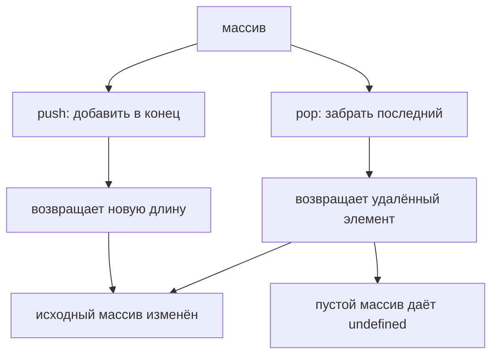

# push() and pop()

## Связь с предыдущей главой

Предыдущая глава объяснила Arrays.

Главная модель была такой: массив — упорядоченный список значений с доступом по индексу.

Мы научились читать и заменять elements by index:

```javascript
const users = ['Anna', 'Kate'];

console.log(users[0]);

users[1] = 'Kate Updated';
```

Но предыдущая глава работала с arrays как будто их размер уже известен.

Теперь появляется следующий вопрос:

> How can an array grow or shrink?

Например, API возвращает новых пользователей по одному, и каждого нужно добавить в конец накопленного списка.

Нужно добавить Kate в конец collection.

Позже последний user нужно убрать:

Эта глава отвечает:

---

## Предварительные требования

Для этой главы нужно понимать:

* что array is ordered collection;
* что array elements have indexes;
* что first index is `0`;
* что `length` is count of elements;
* что last index is `length - 1`;
* что arrays are useful for API responses, failed assertions and test data.

Не требуется знать `shift`, `unshift`, `splice`, `slice`, queue, deque, loops or iteration methods. Эти темы будут изучаться позже.

---

## Время изучения

Ориентировочное время:

```text
Чтение главы:            120-150 минут
Разбор схем:             60-80 минут
Запуск примеров:         20-30 минут
Практика:                110-140 минут
Повторение материала:    30 минут
```

Уровень сложности: **L3**.

`push()` and `pop()` are small methods, but they introduce an important idea: array size can change. The array is not only read; it can grow and shrink.

---

## Навигация

Предыдущая глава:

```text
docs/01-javascript/44-arrays.md
```

Текущая глава:

```text
docs/01-javascript/45-push-pop.md
```

Следующая глава:

```text
docs/01-javascript/46-shift-unshift.md
```

Следующая глава ответит:

> How can arrays change at the beginning вместо the end?

---

## Цели обучения

После изучения этой главы вы будете понимать:

* зачем существует `push()`;
* зачем существует `pop()`;
* как array receives a new last element;
* как array loses its last element;
* что `push()` changes existing array;
* что `pop()` changes existing array;
* почему `length` changes after element count changes;
* что возвращает `pop()`;
* почему stack intuition полезна только на высоком уровне;
* как `push()` and `pop()` применяются in Automation QA.

---

## Мотивация

Начнем с growing collection.

Есть массив:

```javascript
const users = ['Anna'];
```

API returns new user:

```text
Kate
```

Вопрос:

> Как collection может вырасти?

Не хочется заранее писать:

```javascript
const users = ['Anna', 'Kate'];
```

Потому что Kate может появиться позже, например после ответа API.

Нужна операция:

Для этого используется `push()`.

Теперь обратная ситуация.

Есть массив:

```javascript
const users = ['Anna', 'Kate'];
```

Нужно удалить последнего пользователя и узнать, кто был удален.

Вопрос:

> Как collection может уменьшиться с конца?

Для этого используется `pop()`.

---

## Теория

`push()` добавляет один или несколько elements в конец array.

В этой главе мы фокусируемся на одном element за раз:

```javascript
const users = ['Anna'];

users.push('Kate');
```

До:

После:

Важно:

We are not discussing immutability yet.

### Why `push()` exists

`push()` exists because arrays often need to grow after creation.

Примеры:

```text
new API response received
new failed assertion collected
new request executed
new test result recorded
```

`push()` отвечает:

```text
How do we add a new last element?
```

### `pop()`

`pop()` removes the last element from an array and returns removed value.

```javascript
const users = ['Anna', 'Kate'];

const removedUser = users.pop();
```

До:

После:

Возвращаемое значение:

```text
"Kate"
```

Важно:

### Why `pop()` exists

`pop()` exists because sometimes last element should be removed.

Примеры:

```text
remove last collected result
undo last collected item
take last executed request
remove last temporary value
```

`pop()` отвечает:

```text
How do we remove and get the last element?
```

### Length as consequence

`push()` adds a new element to the end.

Because the array now contains one more element, `length` increases.

`pop()` removes the last element.

Because the array now contains one fewer element, `length` decreases.

### Stack intuition

High-level only:

This is similar to stack of plates:

We do not study formal Stack data structure here. This is only intuition for adding/removing from the end.

---

Обе операции работают с концом массива:



## Внутренний механизм

When JavaScript executes:

```javascript
users.push('Kate');
```

Engine has:

```text
array: users
new value: "Kate"
```

Поток:

Например: `plan.push('logout')` добавляет элемент и возвращает новую длину массива.

When JavaScript executes:

```javascript
const removed = users.pop();
```

Engine:

If array is empty:

```javascript
const items = [];
const removed = items.pop();
```

Результат: `pop()` возвращает удалённый элемент, а массив становится короче на единицу.

No element existed to remove.

---

## Ментальная модель

Growing bookshelf:

Stack of plates:

Train gaining last car:

Train losing last car:

Notebook with new last page:

Expandable list:

Центральная модель:

---

## Примеры кода

Примеры находятся в:

```text
examples/01-javascript/chapter-45/
```

Запуск:

```bash
node examples/01-javascript/chapter-45/01-push.js
```

### Пример 1. push

Файл:

```text
examples/01-javascript/chapter-45/01-push.js
```

Показывает adding new last element.

### Пример 2. pop

Файл:

```text
examples/01-javascript/chapter-45/02-pop.js
```

Показывает removing last element.

### Пример 3. length

Файл:

```text
examples/01-javascript/chapter-45/03-length.js
```

Показывает how `length` reflects the current number of elements.

### Пример 4. Возвращаемое значение

Файл:

```text
examples/01-javascript/chapter-45/04-return-value.js
```

Показывает that `pop()` returns removed value.

### Пример 5. Типичные ошибки

Файл:

```text
examples/01-javascript/chapter-45/05-common-mistakes.js
```

Показывает mistake: expecting `pop()` to return array.

### Пример 6. QA example

Файл:

```text
examples/01-javascript/chapter-45/06-qa-example.js
```

Показывает collecting failed assertions.

---

## Частые вопросы

### `push()` создает новый array?

Нет.

In this chapter model:

Immutability will be discussed later.

### `pop()` создает новый array?

Нет.

### Что возвращает `pop()`?

Removed last element.

### What happens when pop from empty array?

Array remains empty.

### Is this a stack?

At a high level, adding/removing from the end resembles stack поведение.

But formal stacks are not the topic of this chapter.

---

## Распространённые мифы

### Миф: `push()` returns the added element

Реальность: this chapter focuses on adding elements to the end. The key learning goal is that the array receives one more element, and only then `length` reflects the new count. Do not rely on guessed return значения.

### Миф: `pop()` returns the changed array

Реальность: `pop()` returns removed last element.

### Миф: `pop()` from empty array is always a crash

Реальность: it returns `undefined`.

### Миф: `push()` and `pop()` work at the beginning

Реальность: both operate at the end of array. Beginning operations are next chapter.

---

## Распространённые ошибки

### Ошибка 1. Expect `pop()` to return array

Неправильный код:

```javascript
const users = ['Anna', 'Kate'];
const result = users.pop();

console.log(result.length);
```

Что произошло:

`result` is removed element, not array.

Исправленная модель: `push()` возвращает новую длину массива, а не сам массив.

### Ошибка 2. Forget that original array changes

Неправильная модель: будто `pop()` возвращает изменённый массив.

Правильная модель: `pop()` возвращает удалённый элемент, а изменяется исходный массив.

### Ошибка 3. Expect `pop()` to remove first element

Неправильно:

Правильно:

### Ошибка 4. Ignore empty array

```javascript
const failedAssertions = [];
const lastFailure = failedAssertions.pop();
```

`lastFailure` is `undefined`.

Before using removed value, code should account for empty collection.

---

## Практическое использование

Use `push()` when new value arrives and should become last element:

```text
new API response
new failed assertion
new executed request
new test result
```

Use `pop()` when last value should be removed and used:

```text
last collected item
last temporary result
last request in simple history
```

Читаемость:

---

## Использование в Automation QA

### Accumulating API responses

```javascript
const responses = [];

responses.push('GET /users -> 200');
responses.push('GET /orders -> 200');
```

Ментальная модель: стопка — кладём сверху и снимаем сверху.

### Failed assertions

```javascript
const failedAssertions = [];

failedAssertions.push('status expected 200, actual 500');
```

Empty array means no failures yet.

After push:

```text
one failure collected
```

### Executed requests

`pop()` can retrieve last executed request in simple history model.

### Browser history high level

На высоком уровне:

We are not implementing browser history here.

### Collected test results

`push()` is natural when results appear one after another.

---

## Диаграммы главы

### 1. Why push exists

### 2. Why pop exists

### 3. Array growth

### 4. Array shrink

### 5. Before push

### 6. After push

### 7. Before pop

### 8. After pop

### 9. Element count growth

### 10. Element count shrink

### 11. Возвращаемое значение pop

### 12. Текущая модель JavaScript

### 13. Stack intuition

### 14. QA failed assertions

### 15. API users

### 16. Test queue preview

### 17. Читаемость

### 18. Типичные ошибки

### 19. Bookshelf analogy

```text
book 0
book 1 <- new last book
```

### 20. Plate stack

### 21. Train analogy

```text
train + last car
train - last car
```

### 22. Notebook analogy

```text
last page added
last page removed
```

### 23. Complete push model

### 24. Полная модель pop

### 25. Element lifecycle

### 26. Last element

### 27. Push flow

### 28. Pop flow

### 29. Length timeline

### 30. Ordered collection reminder

### 31. Краткая ментальная модель

```text
push adds at end
pop removes from end
```

### 32. Переход к shift()

### 33. Переход к loops

### 34. QA framework example

### 35. API response growth

### 36. Removed value

### 37. Array evolution

### 38. Итоговая схема

---

## Итоги

The previous chapter introduced arrays as ordered collections.

Эта глава ответила:

```text
How can array grow or shrink?
```

`push()`:

`pop()`:

Both methods change the existing array.

The next chapter will explain `shift()` and `unshift()`: changing arrays at the beginning вместо the end.

---

## Что нужно запомнить

✓ `push()` adds value to the end of array.

✓ `push()` changes existing array.

✓ After `push()` array contains one more element, so `length` increases.

✓ `pop()` removes last element.

✓ `pop()` changes existing array.

✓ `pop()` returns removed value.

✓ After `pop()` array contains one fewer element, so `length` decreases.

✓ `pop()` from empty array returns `undefined`.

✓ `push()` and `pop()` operate at the end.

✓ Beginning operations are the next chapter.

---

## Проверьте себя

1. What problem does `push()` solve?

2. What problem does `pop()` solve?

3. Why does `length` increase after `push()`?

4. What does `pop()` return?

5. Does `pop()` return the changed array?

6. What happens when `pop()` is called on empty array?

7. Which end of array do `push()` and `pop()` use?

8. Why is stack intuition useful only at high level here?

9. How can `push()` be useful for failed assertions?

10. What will the next chapter explain?

---

## Практика

Практические задания находятся в отдельном файле:

```text
practice/01-javascript/45-push-pop.md
```

---

## Решения

Решения находятся в отдельном файле:

```text
solutions/01-javascript/45-push-pop.md
```

Сначала выполните практику самостоятельно. Затем сравните ход рассуждения, а не только итоговый ответ.
