# push() and pop()

## Связь с предыдущей главой

Предыдущая глава объяснила Arrays.

Главная модель была такой:

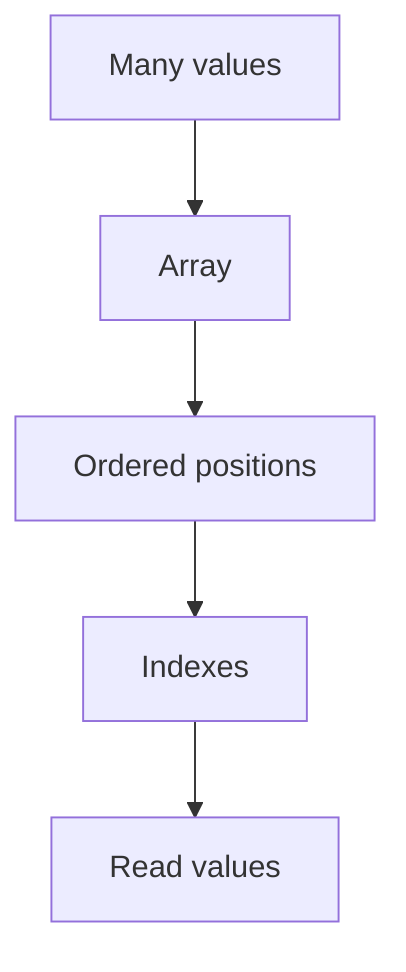

Мы научились читать и заменять elements by index:

```javascript
const users = ['Anna', 'Kate'];

console.log(users[0]);

users[1] = 'Kate Updated';
```

Но предыдущая глава работала с arrays как будто их размер уже известен.

Теперь появляется следующий вопрос:

> How can an array grow or shrink?

Например, API возвращает new users one by one:

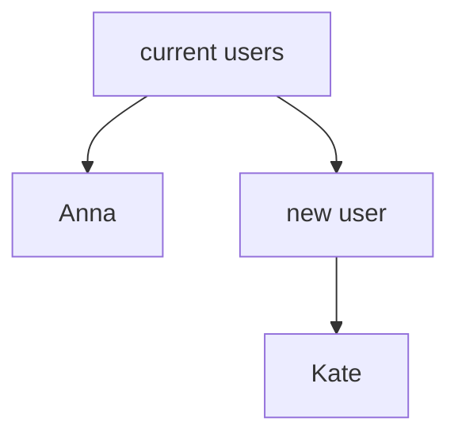

Нужно добавить Kate в конец collection.

Позже последний user нужно убрать:

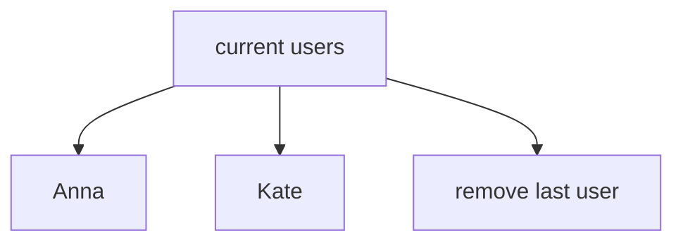

Эта глава отвечает:

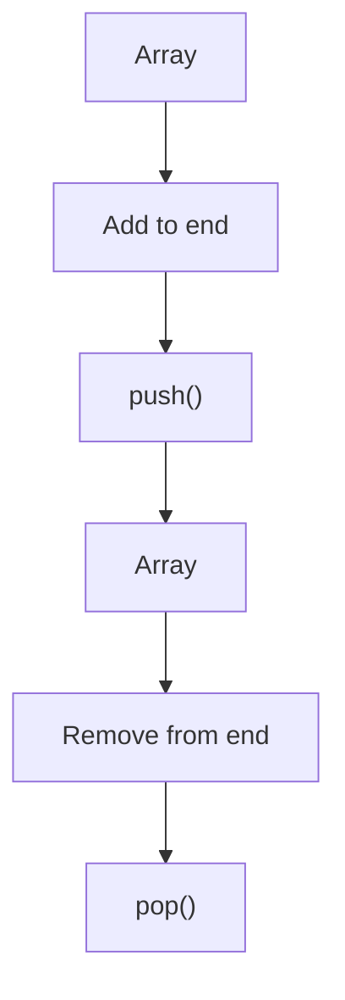

---

## Предварительные требования

Для этой главы нужно понимать:

* что array is ordered collection;
* что array elements have indexes;
* что first index is `0`;
* что `length` is count of elements;
* что last index is `length - 1`;
* что arrays are useful for API responses, failed assertions and test data.

Не требуется знать `shift`, `unshift`, `splice`, `slice`, queue, deque, loops or iteration methods. Эти темы будут изучаться позже.

---

## Время изучения

Ориентировочное время:

```text
Чтение главы:            120-150 минут
Разбор схем:             60-80 минут
Запуск примеров:         20-30 минут
Практика:                110-140 минут
Повторение материала:    30 минут
```

Уровень сложности: **L3**.

`push()` and `pop()` are small methods, but they introduce an important idea: array size can change. The array is not only read; it can grow and shrink.

---

## Навигация

Предыдущая глава:

```text
docs/01-javascript/44-arrays.md
```

Текущая глава:

```text
docs/01-javascript/45-push-pop.md
```

Следующая глава:

```text
docs/01-javascript/46-shift-unshift.md
```

Следующая глава ответит:

> How can arrays change at the beginning вместо the end?

---

## Цели обучения

После изучения этой главы вы будете понимать:

* зачем существует `push()`;
* зачем существует `pop()`;
* как array receives a new last element;
* как array loses its last element;
* что `push()` changes existing array;
* что `pop()` changes existing array;
* почему `length` changes after element count changes;
* что возвращает `pop()`;
* почему stack intuition полезна только на высоком уровне;
* как `push()` and `pop()` применяются in Automation QA.

---

## Мотивация

Начнем с growing collection.

Есть массив:

```javascript
const users = ['Anna'];
```

API returns new user:

```text
Kate
```

Вопрос:

> Как collection может вырасти?

Не хочется заранее писать:

```javascript
const users = ['Anna', 'Kate'];
```

Потому что Kate может появиться позже, например после ответа API.

Нужна операция:

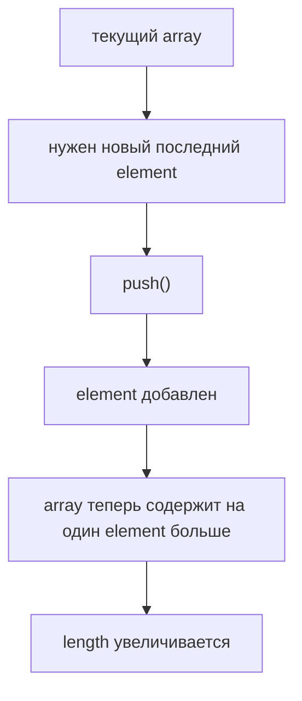

Для этого используется `push()`.

Теперь обратная ситуация.

Есть массив:

```javascript
const users = ['Anna', 'Kate'];
```

Нужно удалить последнего пользователя и узнать, кто был удален.

Вопрос:

> Как collection может уменьшиться с конца?

Для этого используется `pop()`.

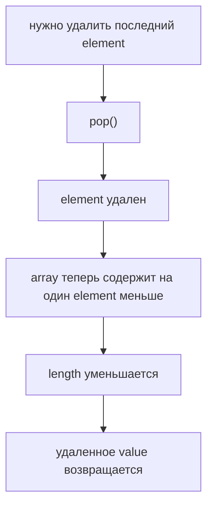

---

## Теория

`push()` добавляет один или несколько elements в конец array.

В этой главе мы фокусируемся на одном element за раз:

```javascript
const users = ['Anna'];

users.push('Kate');
```

До:

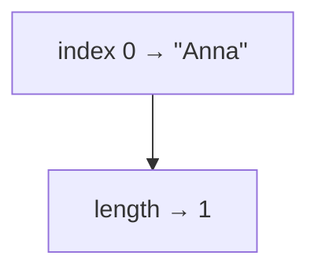

После:

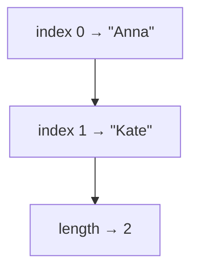

Важно:

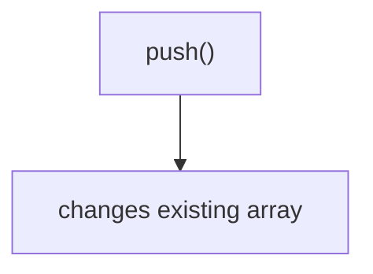

We are not discussing immutability yet.

### Why `push()` exists

`push()` exists because arrays often need to grow after creation.

Примеры:

```text
new API response received
new failed assertion collected
new request executed
new test result recorded
```

`push()` отвечает:

```text
How do we add a new last element?
```

### `pop()`

`pop()` removes the last element from an array and returns removed value.

```javascript
const users = ['Anna', 'Kate'];

const removedUser = users.pop();
```

До:


После:


Возвращаемое значение:

```text
"Kate"
```

Важно:

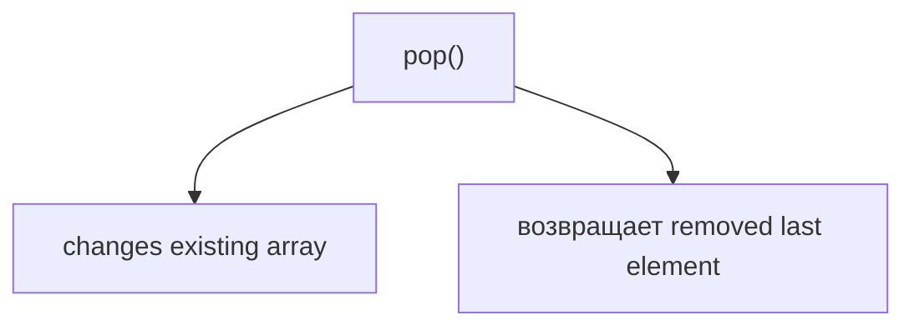

### Why `pop()` exists

`pop()` exists because sometimes last element should be removed.

Примеры:

```text
remove last collected result
undo last collected item
take last executed request
remove last temporary value
```

`pop()` отвечает:

```text
How do we remove and get the last element?
```

### Length as consequence

`push()` adds a new element to the end.

Because the array now contains one more element, `length` increases.

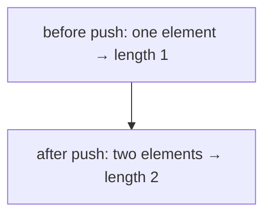

`pop()` removes the last element.

Because the array now contains one fewer element, `length` decreases.

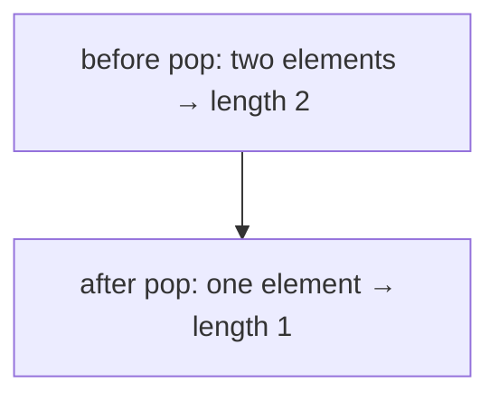

### Stack intuition

High-level only:

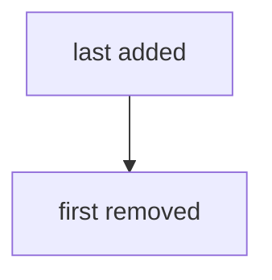

This is similar to stack of plates:

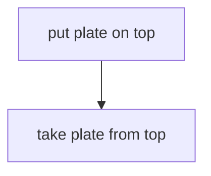

We do not study formal Stack data structure here. This is only intuition for adding/removing from the end.

---

## Внутренний механизм

When JavaScript executes:

```javascript
users.push('Kate');
```

Engine has:

```text
array: users
new value: "Kate"
```

Поток:

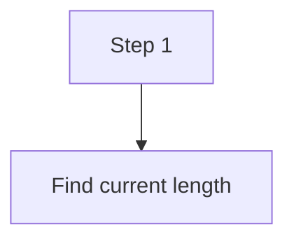

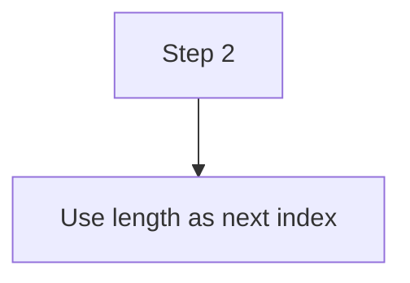

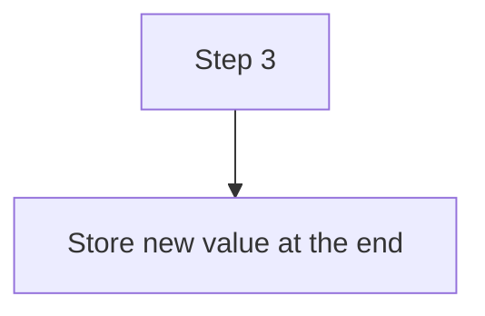

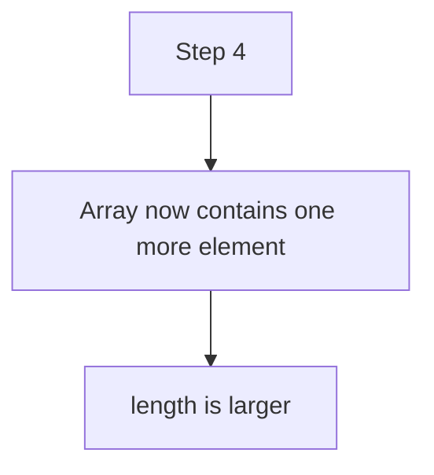

Пример:

```mermaid
flowchart TD
    N1["before"]
    N2["length: 1"]
    N3["next index: 1"]
    N4["push(&quot;Kate&quot;)"]
    N5["users[1] = &quot;Kate&quot;"]
    N6["length: 2"]
    N1 --> N2
    N1 --> N3
    N1 --> N4
    N4 --> N5
    N5 --> N6
```

When JavaScript executes:

```javascript
const removed = users.pop();
```

Engine:

```mermaid
flowchart TD
    N1["Step 1"]
    N2["Find last index: length - 1"]
    N1 --> N2
```

```mermaid
flowchart TD
    N1["Step 2"]
    N2["Read value at last index"]
    N1 --> N2
```

```mermaid
flowchart TD
    N1["Step 3"]
    N2["Remove last element"]
    N1 --> N2
```

```mermaid
flowchart TD
    N1["Step 4"]
    N2["Array now contains one fewer element"]
    N3["length is smaller"]
    N1 --> N2
    N2 --> N3
```

```mermaid
flowchart TD
    N1["Step 5"]
    N2["Return removed value"]
    N1 --> N2
```

If array is empty:

```javascript
const items = [];
const removed = items.pop();
```

Результат:

```mermaid
flowchart TD
    N1["removed → undefined"]
    N2["length → 0"]
    N1 --> N2
```

No element existed to remove.

---

## Ментальная модель

Growing bookshelf:

```mermaid
flowchart TD
    N1["bookshelf"]
    N2["book 0"]
    N3["add book 1 at end"]
    N1 --> N2
    N1 --> N3
```

Stack of plates:

```mermaid
flowchart TD
    N1["top"]
    N2["last plate"]
    N3["pop removes this one"]
    N1 --> N2
    N1 --> N3
```

Train gaining last car:

```mermaid
flowchart TD
    N1["train"]
    N2["car 0"]
    N3["push → add car 1 at end"]
    N1 --> N2
    N1 --> N3
```

Train losing last car:

```mermaid
flowchart TD
    N1["train"]
    N2["car 0"]
    N3["pop → remove last car"]
    N1 --> N2
    N1 --> N3
```

Notebook with new last page:

```mermaid
flowchart TD
    N1["notebook"]
    N2["page 0"]
    N3["add page 1"]
    N1 --> N2
    N1 --> N3
```

Expandable list:

```mermaid
flowchart TD
    N1["list"]
    N2["adds at end"]
    N3["removes from end"]
    N1 --> N2
    N1 --> N3
```

Центральная модель:

```mermaid
flowchart TD
    N1["Array"]
    N2["push()"]
    N3["element добавлен в конец"]
    N4["появился новый последний element"]
    N5["array теперь содержит на один element больше"]
    N6["length увеличивается"]
    N1 --> N2
    N2 --> N3
    N3 --> N4
    N4 --> N5
    N5 --> N6
```

```mermaid
flowchart TD
    N1["Array"]
    N2["pop()"]
    N3["последний element удален"]
    N4["array теперь содержит на один element меньше"]
    N5["length уменьшается"]
    N6["удаленное value возвращается"]
    N1 --> N2
    N2 --> N3
    N3 --> N4
    N4 --> N5
    N5 --> N6
```

---

## Примеры кода

Примеры находятся в:

```text
examples/01-javascript/chapter-45/
```

Запуск:

```bash
node examples/01-javascript/chapter-45/01-push.js
```

### Пример 1. push

Файл:

```text
examples/01-javascript/chapter-45/01-push.js
```

Показывает adding new last element.

### Пример 2. pop

Файл:

```text
examples/01-javascript/chapter-45/02-pop.js
```

Показывает removing last element.

### Пример 3. length

Файл:

```text
examples/01-javascript/chapter-45/03-length.js
```

Показывает how `length` reflects the current number of elements.

### Пример 4. Возвращаемое значение

Файл:

```text
examples/01-javascript/chapter-45/04-return-value.js
```

Показывает that `pop()` returns removed value.

### Пример 5. Типичные ошибки

Файл:

```text
examples/01-javascript/chapter-45/05-common-mistakes.js
```

Показывает mistake: expecting `pop()` to return array.

### Пример 6. QA example

Файл:

```text
examples/01-javascript/chapter-45/06-qa-example.js
```

Показывает collecting failed assertions.

---

## Частые вопросы

### `push()` создает новый array?

Нет.

In this chapter model:

```mermaid
flowchart TD
    N1["push()"]
    N2["changes existing array"]
    N1 --> N2
```

Immutability will be discussed later.

### `pop()` создает новый array?

Нет.

```mermaid
flowchart TD
    N1["pop()"]
    N2["changes existing array"]
    N3["возвращает removed value"]
    N1 --> N2
    N1 --> N3
```

### Что возвращает `pop()`?

Removed last element.

```mermaid
flowchart TD
    N1["[&quot;Anna&quot;, &quot;Kate&quot;].pop()"]
    N2["&quot;Kate&quot;"]
    N1 --> N2
```

### What happens when pop from empty array?

```mermaid
flowchart TD
    N1["[]"]
    N2["pop()"]
    N3["undefined"]
    N1 --> N2
    N2 --> N3
```

Array remains empty.

### Is this a stack?

At a high level, adding/removing from the end resembles stack поведение.

But formal stacks are not the topic of this chapter.

---

## Распространенные мифы

### Миф: `push()` returns the added element

Реальность: this chapter focuses on adding elements to the end. The key learning goal is that the array receives one more element, and only then `length` reflects the new count. Do not rely on guessed return значения.

### Миф: `pop()` returns the changed array

Реальность: `pop()` returns removed last element.

### Миф: `pop()` from empty array is always a crash

Реальность: it returns `undefined`.

### Миф: `push()` and `pop()` work at the beginning

Реальность: both operate at the end of array. Beginning operations are next chapter.

---

## Типичные ошибки

### Ошибка 1. Expect `pop()` to return array

Неправильный код:

```javascript
const users = ['Anna', 'Kate'];
const result = users.pop();

console.log(result.length);
```

Что произошло:

`result` is removed element, not array.

Исправленная модель:

```mermaid
flowchart TD
    N1["users"]
    N2["changed array"]
    N3["результат"]
    N4["removed value"]
    N1 --> N2
    N1 --> N3
    N3 --> N4
```

### Ошибка 2. Forget that original array changes

Неправильная модель:

```mermaid
flowchart TD
    N1["users.push(&quot;Kate&quot;)"]
    N2["возвращает separate new array"]
    N1 --> N2
```

Правильная модель:

```mermaid
flowchart TD
    N1["users"]
    N2["now contains Kate at the end"]
    N1 --> N2
```

### Ошибка 3. Expect `pop()` to remove first element

Неправильно:

```mermaid
flowchart TD
    N1["pop()"]
    N2["removes first element"]
    N1 --> N2
```

Правильно:

```mermaid
flowchart TD
    N1["pop()"]
    N2["removes last element"]
    N1 --> N2
```

### Ошибка 4. Ignore empty array

```javascript
const failedAssertions = [];
const lastFailure = failedAssertions.pop();
```

`lastFailure` is `undefined`.

Before using removed value, code should account for empty collection.

---

## Практическое использование

Use `push()` when new value arrives and should become last element:

```text
new API response
new failed assertion
new executed request
new test result
```

Use `pop()` when last value should be removed and used:

```text
last collected item
last temporary result
last request in simple history
```

Читаемость:

```mermaid
flowchart TD
    N1["responses.push(response)"]
    N2["clearly means"]
    N3["append response to collection"]
    N1 --> N2
    N2 --> N3
```

```mermaid
flowchart TD
    N1["const lastResponse = responses.pop()"]
    N2["clearly means"]
    N3["remove and use last response"]
    N1 --> N2
    N2 --> N3
```

---

## Использование в Automation QA

### Accumulating API responses

```javascript
const responses = [];

responses.push('GET /users -> 200');
responses.push('GET /orders -> 200');
```

Ментальная модель:

```mermaid
flowchart TD
    N1["responses"]
    N2["first response"]
    N3["second response"]
    N1 --> N2
    N1 --> N3
```

### Failed assertions

```javascript
const failedAssertions = [];

failedAssertions.push('status expected 200, actual 500');
```

Empty array means no failures yet.

After push:

```text
one failure collected
```

### Executed requests

```mermaid
flowchart TD
    N1["executedRequests"]
    N2["request 0"]
    N3["request 1"]
    N4["request 2"]
    N1 --> N2
    N1 --> N3
    N1 --> N4
```

`pop()` can retrieve last executed request in simple history model.

### Browser history high level

На высоком уровне:

```mermaid
flowchart TD
    N1["last visited page"]
    N2["can be treated like"]
    N3["last item in collection"]
    N1 --> N2
    N2 --> N3
```

We are not implementing browser history here.

### Collected test results

```mermaid
flowchart TD
    N1["testResults"]
    N2["result 0"]
    N3["result 1"]
    N4["result 2"]
    N1 --> N2
    N1 --> N3
    N1 --> N4
```

`push()` is natural when results appear one after another.

---

## Диаграммы главы

### 1. Why push exists

```mermaid
flowchart TD
    N1["array has values"]
    N2["new value arrives"]
    N3["need add to end"]
    N1 --> N2
    N2 --> N3
```

### 2. Why pop exists

```mermaid
flowchart TD
    N1["array has values"]
    N2["last value needed"]
    N3["remove from end"]
    N1 --> N2
    N2 --> N3
```

### 3. Array growth

```mermaid
flowchart TD
    N1["[A]"]
    N2["push B"]
    N3["[A, B]"]
    N1 --> N2
    N2 --> N3
```

### 4. Array shrink

```mermaid
flowchart TD
    N1["[A, B]"]
    N2["pop"]
    N3["[A]"]
    N1 --> N2
    N2 --> N3
```

### 5. Before push

```mermaid
flowchart TD
    N1["index 0 → A"]
    N2["length 1"]
    N1 --> N2
```

### 6. After push

```mermaid
flowchart TD
    N1["index 0 → A"]
    N2["index 1 → B"]
    N3["length 2"]
    N1 --> N2
    N2 --> N3
```

### 7. Before pop

```mermaid
flowchart TD
    N1["index 0 → A"]
    N2["index 1 → B"]
    N3["length 2"]
    N1 --> N2
    N2 --> N3
```

### 8. After pop

```mermaid
flowchart TD
    N1["index 0 → A"]
    N2["length 1"]
    N1 --> N2
```

### 9. Element count growth

```mermaid
flowchart TD
    N1["one element"]
    N2["push"]
    N3["two elements"]
    N4["length reflects new count"]
    N1 --> N2
    N2 --> N3
    N3 --> N4
```

### 10. Element count shrink

```mermaid
flowchart TD
    N1["two elements"]
    N2["pop"]
    N3["one element"]
    N4["length reflects new count"]
    N1 --> N2
    N2 --> N3
    N3 --> N4
```

### 11. Возвращаемое значение pop

```mermaid
flowchart TD
    N1["[A, B].pop()"]
    N2["B"]
    N1 --> N2
```

### 12. Текущая модель JavaScript

```mermaid
flowchart TD
    N1["Arrays"]
    N2["indexes"]
    N3["length"]
    N4["push/pop"]
    N1 --> N2
    N1 --> N3
    N1 --> N4
```

### 13. Stack intuition

```mermaid
flowchart TD
    N1["last added"]
    N2["first removed"]
    N1 --> N2
```

### 14. QA failed assertions

```mermaid
flowchart TD
    N1["failedAssertions"]
    N2["push failure"]
    N3["contains failure"]
    N1 --> N2
    N2 --> N3
```

### 15. API users

```mermaid
flowchart TD
    N1["users"]
    N2["push new user"]
    N3["new last user"]
    N1 --> N2
    N2 --> N3
```

### 16. Test queue preview

```mermaid
flowchart TD
    N1["beginning operations"]
    N2["next chapter"]
    N1 --> N2
```

### 17. Читаемость

```mermaid
flowchart TD
    N1["array.push(value)"]
    N2["append value"]
    N1 --> N2
```

### 18. Типичные ошибки

```mermaid
flowchart TD
    N1["pop()"]
    N2["возвращает removed value"]
    N3["not array"]
    N1 --> N2
    N2 --> N3
```

### 19. Bookshelf analogy

```text
book 0
book 1 <- new last book
```

### 20. Plate stack

```mermaid
flowchart TD
    N1["top plate"]
    N2["pop removes top"]
    N1 --> N2
```

### 21. Train analogy

```text
train + last car
train - last car
```

### 22. Notebook analogy

```text
last page added
last page removed
```

### 23. Complete push model

```mermaid
flowchart TD
    N1["Array"]
    N2["Need new last element"]
    N3["push(value)"]
    N4["value становится последним element"]
    N5["array теперь содержит на один element больше"]
    N6["length увеличивается"]
    N1 --> N2
    N2 --> N3
    N3 --> N4
    N4 --> N5
    N5 --> N6
```

### 24. Полная модель pop

```mermaid
flowchart TD
    N1["Array"]
    N2["Нужно удалить последний element"]
    N3["pop()"]
    N4["последний element удален"]
    N5["array теперь содержит на один element меньше"]
    N6["length уменьшается"]
    N7["удаленное value возвращается"]
    N1 --> N2
    N2 --> N3
    N3 --> N4
    N4 --> N5
    N5 --> N6
    N6 --> N7
```

### 25. Element lifecycle

```mermaid
flowchart TD
    N1["not in array"]
    N2["push"]
    N3["in array"]
    N4["pop"]
    N5["removed"]
    N1 --> N2
    N2 --> N3
    N3 --> N4
    N4 --> N5
```

### 26. Last element

```mermaid
flowchart TD
    N1["length - 1"]
    N2["last index"]
    N1 --> N2
```

### 27. Push flow

```mermaid
flowchart TD
    N1["find length"]
    N2["use as next index"]
    N3["store value"]
    N1 --> N2
    N2 --> N3
```

### 28. Pop flow

```mermaid
flowchart TD
    N1["find last index"]
    N2["read value"]
    N3["remove element"]
    N4["возвращаемое значение"]
    N1 --> N2
    N2 --> N3
    N3 --> N4
```

### 29. Length timeline

```mermaid
flowchart LR
    N1["0"]
    N2["push"]
    N3["1"]
    N4["push"]
    N5["2"]
    N6["pop"]
    N7["1"]
    N1 --> N2
    N2 --> N3
    N3 --> N4
    N4 --> N5
    N5 --> N6
    N6 --> N7
```

### 30. Ordered collection reminder

```mermaid
flowchart TD
    N1["order stays"]
    N2["new values added at end"]
    N1 --> N2
```

### 31. Краткая ментальная модель

```text
push adds at end
pop removes from end
```

### 32. Переход к shift()

```mermaid
flowchart TD
    N1["end operations now"]
    N2["beginning operations next"]
    N1 --> N2
```

### 33. Переход к loops

```mermaid
flowchart TD
    N1["arrays with many elements"]
    N2["later: repeat over them"]
    N1 --> N2
```

### 34. QA framework example

```mermaid
flowchart TD
    N1["testResults.push(result)"]
    N2["collect result"]
    N1 --> N2
```

### 35. API response growth

```mermaid
flowchart TD
    N1["responses"]
    N2["push new response"]
    N1 --> N2
```

### 36. Removed value

```mermaid
flowchart TD
    N1["const removed = array.pop()"]
    N2["removed is last element"]
    N1 --> N2
```

### 37. Array evolution

```mermaid
flowchart TD
    N1["[]"]
    N2["push A"]
    N3["[A]"]
    N4["push B"]
    N5["[A, B]"]
    N1 --> N2
    N2 --> N3
    N3 --> N4
    N4 --> N5
```

### 38. Итоговая схема

```mermaid
flowchart TD
    N1["Array"]
    N2["push()"]
    N3["add to end"]
    N4["array has one more element"]
    N5["length reflects new count"]
    N6["pop()"]
    N7["remove from end"]
    N8["array has one fewer element"]
    N9["вернуть removed value"]
    N10["length reflects new count"]
    N1 --> N2
    N1 --> N3
    N1 --> N4
    N1 --> N5
    N1 --> N6
    N6 --> N7
    N6 --> N8
    N6 --> N9
    N6 --> N10
```

---

## Итоги

The previous chapter introduced arrays as ordered collections.

Эта глава ответила:

```text
How can array grow or shrink?
```

`push()`:

```mermaid
flowchart TD
    N1["Array"]
    N2["need new last element"]
    N3["push()"]
    N4["one new last element"]
    N5["array now contains one more element"]
    N6["length increases"]
    N1 --> N2
    N2 --> N3
    N3 --> N4
    N4 --> N5
    N5 --> N6
```

`pop()`:

```mermaid
flowchart TD
    N1["Array"]
    N2["need removed last element"]
    N3["pop()"]
    N4["last element removed"]
    N5["array now contains one fewer element"]
    N6["length decreases"]
    N7["removed value returned"]
    N1 --> N2
    N2 --> N3
    N3 --> N4
    N4 --> N5
    N5 --> N6
    N6 --> N7
```

Both methods change the existing array.

The next chapter will explain `shift()` and `unshift()`: changing arrays at the beginning вместо the end.

---

## Что нужно запомнить

✓ `push()` adds value to the end of array.

✓ `push()` changes existing array.

✓ After `push()` array contains one more element, so `length` increases.

✓ `pop()` removes last element.

✓ `pop()` changes existing array.

✓ `pop()` returns removed value.

✓ After `pop()` array contains one fewer element, so `length` decreases.

✓ `pop()` from empty array returns `undefined`.

✓ `push()` and `pop()` operate at the end.

✓ Beginning operations are the next chapter.

---

## Проверьте себя

1. What problem does `push()` solve?

2. What problem does `pop()` solve?

3. Why does `length` increase after `push()`?

4. What does `pop()` return?

5. Does `pop()` return the changed array?

6. What happens when `pop()` is called on empty array?

7. Which end of array do `push()` and `pop()` use?

8. Why is stack intuition useful only at high level here?

9. How can `push()` be useful for failed assertions?

10. What will the next chapter explain?

---

## Практика

Практические задания находятся в отдельном файле:

```text
practice/01-javascript/45-push-pop.md
```

---

## Решения

Решения находятся в отдельном файле:

```text
solutions/01-javascript/45-push-pop.md
```

Сначала выполните практику самостоятельно. Затем сравните ход рассуждения, а не только итоговый ответ.
