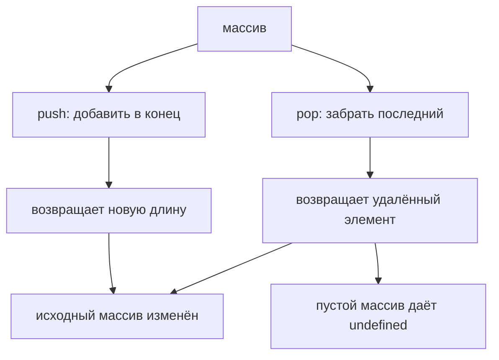

# `push()` и `pop()`

## Связь с предыдущей главой

Предыдущая глава объяснила Arrays.

Главная модель была такой: массив — упорядоченный список значений с доступом по индексу.

Мы научились читать и заменять elements by index:

```javascript
const users = ['Anna', 'Kate'];

console.log(users[0]);

users[1] = 'Kate Updated';
```

Но предыдущая глава работала с arrays как будто их размер уже известен.

Теперь появляется следующий вопрос:

> How can an array grow or shrink?

Например, API возвращает новых пользователей по одному, и каждого нужно добавить в конец накопленного списка.

Нужно добавить Kate в конец collection.

Позже последний user нужно убрать:

Эта глава отвечает:

---

## Предварительные требования

Для этой главы нужно понимать:

* что array is ordered collection;
* что array elements have indexes;
* что first index is `0`;
* что `length` is count of elements;
* что last index is `length - 1`;
* что arrays are useful for API responses, failed assertions and test data.

Не требуется знать `shift`, `unshift`, `splice`, `slice`, queue, deque, loops or iteration methods. Эти темы будут изучаться позже.

---

## Время изучения

Ориентировочное время:

```text
Чтение главы:            120-150 минут
Разбор схем:             60-80 минут
Запуск примеров:         20-30 минут
Практика:                110-140 минут
Повторение материала:    30 минут
```

Уровень сложности: **L3**.

`push()` and `pop()` are small methods, but they introduce an important idea: array size can change. The array is not only read; it can grow and shrink.

---

## Навигация

Предыдущая глава:

```text
docs/01-javascript/44-arrays.md
```

Текущая глава:

```text
docs/01-javascript/45-push-pop.md
```

Следующая глава:

```text
docs/01-javascript/46-shift-unshift.md
```

Следующая глава ответит:

> How can arrays change at the beginning вместо the end?

---

## Цели обучения

После изучения этой главы вы будете понимать:

* зачем существует `push()`;
* зачем существует `pop()`;
* как array receives a new last element;
* как array loses its last element;
* что `push()` changes existing array;
* что `pop()` changes existing array;
* почему `length` changes after element count changes;
* что возвращает `pop()`;
* почему stack intuition полезна только на высоком уровне;
* как `push()` and `pop()` применяются in Automation QA.

---

## Мотивация

Начнем с growing collection.

Есть массив:

```javascript
const users = ['Anna'];
```

API returns new user:

```text
Kate
```

Вопрос:

> Как collection может вырасти?

Не хочется заранее писать:

```javascript
const users = ['Anna', 'Kate'];
```

Потому что Kate может появиться позже, например после ответа API.

Нужна операция:

Для этого используется `push()`.

Теперь обратная ситуация.

Есть массив:

```javascript
const users = ['Anna', 'Kate'];
```

Нужно удалить последнего пользователя и узнать, кто был удален.

Вопрос:

> Как collection может уменьшиться с конца?

Для этого используется `pop()`.

---

## Теория

`push()` добавляет один или несколько элементов в конец массива.

В этой главе мы сосредоточены на одном элементе за раз:

```javascript
const users = ['Anna'];

users.push('Kate');
```

```text
до:     ['Anna']              length 1
после:  ['Anna', 'Kate']      length 2
```

Важно: `push()` изменяет **существующий** массив, а не создаёт новый. Все имена,
указывающие на этот массив, увидят новый элемент.

Неизменяемость мы пока не обсуждаем.

### Зачем нужен `push()`

`push()` существует потому, что массивам часто нужно расти после создания.

Примеры:

```text
new API response received
new failed assertion collected
new request executed
new test result recorded
```

`push()` отвечает:

```text
How do we add a new last element?
```

### `pop()`

`pop()` удаляет последний элемент массива и возвращает удалённое значение.

```javascript
const users = ['Anna', 'Kate'];

const removedUser = users.pop();
```

До:

```text
['Anna', 'Kate']
```

После:

```text
['Anna']
```

Возвращаемое значение:

```text
"Kate"
```

Важно:

```text
исходный массив изменён,
а возвращён удалённый элемент, а не новый массив
```

### Зачем нужен `pop()`

`pop()` существует потому, что иногда последний элемент нужно убрать.

Примеры:

```text
remove last collected result
undo last collected item
take last executed request
remove last temporary value
```

`pop()` отвечает:

```text
How do we remove and get the last element?
```

### Длина как следствие

`push()` добавляет новый элемент в конец.

Поскольку теперь в массиве на один элемент больше, `length` увеличивается.

`pop()` удаляет последний элемент.

Поскольку теперь в массиве на один элемент меньше, `length` уменьшается.

### Интуиция о стеке

Только на высоком уровне: и `push()`, и `pop()` работают с одним и тем же концом
массива — последним.

```text
push  →  добавить в конец
pop   →  забрать с конца
```

Это похоже на стопку тарелок: берут и кладут сверху.

Формальную структуру данных «стек» мы здесь не изучаем. Это только интуиция для добавления и удаления с конца.

---

Обе операции работают с концом массива:


```mermaid
flowchart TD
    A["массив"] --> B["push: добавить в конец"]
    B --> C["возвращает новую длину"]
    A --> D["pop: забрать последний"]
    D --> E["возвращает удалённый элемент"]
    E --> F["пустой массив даёт undefined"]
    C --> G["исходный массив изменён"]
    E --> G
```

## Внутренний механизм

Когда JavaScript выполняет:

```javascript
users.push('Kate');
```

У движка есть:

```text
array: users
new value: "Kate"
```

Поток:

Например: `plan.push('logout')` добавляет элемент и возвращает новую длину массива.

Когда JavaScript выполняет:

```javascript
const removed = users.pop();
```

Движок читает последний элемент, удаляет его из массива, уменьшает `length` на
единицу и возвращает удалённое значение.

Если массив пуст:

```javascript
const items = [];
const removed = items.pop();
```

Результат: `pop()` возвращает удалённый элемент, а массив становится короче на единицу.

Удалять было нечего.

---

## Ментальная модель

Растущая книжная полка, стопка тарелок и поезд с прицепленным последним
вагоном — все три аналогии описывают одно: изменения происходят только на одном
конце.

Поезд, у которого отцепили последний вагон, и блокнот с новой последней
страницей — обе аналогии про один конец списка.

Центральная модель: `push()` и `pop()` работают только с концом массива.
Именно поэтому они не сдвигают остальные элементы и не меняют их индексы.

---

## Примеры кода

Примеры находятся в:

```text
examples/01-javascript/chapter-45/
```

Запуск:

```bash
node examples/01-javascript/chapter-45/01-push.js
```

### Пример 1. `push()`

Файл:

```text
examples/01-javascript/chapter-45/01-push.js
```

Показывает добавление нового последнего элемента.

### Пример 2. `pop()`

Файл:

```text
examples/01-javascript/chapter-45/02-pop.js
```

Показывает удаление последнего элемента.

### Пример 3. Длина

Файл:

```text
examples/01-javascript/chapter-45/03-length.js
```

Показывает, как `length` отражает текущее количество элементов.

### Пример 4. Возвращаемое значение

Файл:

```text
examples/01-javascript/chapter-45/04-return-value.js
```

Показывает, что `pop()` возвращает удалённое значение.

### Пример 5. Типичные ошибки

Файл:

```text
examples/01-javascript/chapter-45/05-common-mistakes.js
```

Показывает ошибку: ожидание, что `pop()` вернёт массив.

### Пример 6. Пример из автоматизации тестов

Файл:

```text
examples/01-javascript/chapter-45/06-qa-example.js
```

Показывает накопление проваленных проверок.

---

## Частые вопросы

### `push()` создаёт новый массив?

Нет.

В модели этой главы:

Неизменяемость будет обсуждаться позже.

### `pop()` создаёт новый массив?

Нет.

### Что возвращает `pop()`?

Удалённый последний элемент.

### Что будет при `pop()` из пустого массива?

Массив останется пустым.

### Это стек?

На высоком уровне добавление и удаление с конца похожи на поведение стека.

Но формальные стеки не являются темой этой главы.

---

## Распространённые мифы

### Миф: `push()` возвращает добавленный элемент

Реальность: эта глава сосредоточена на добавлении элементов в конец. Главное — что в массиве стало на один элемент больше и только после этого `length` отражает новое количество. Не полагайтесь на угаданные возвращаемые значения.

### Миф: `pop()` возвращает изменённый массив

Реальность: `pop()` возвращает удалённый последний элемент.

### Миф: `pop()` из пустого массива всегда падает

Реальность: он возвращает `undefined`.

### Миф: `push()` и `pop()` работают с началом

Реальность: оба работают с концом массива. Операции с началом — тема следующей главы.

---

## Распространённые ошибки

### Ошибка 1. Ожидать, что `pop()` вернёт массив

Неправильный код:

```javascript
const users = ['Anna', 'Kate'];
const result = users.pop();

console.log(result.length);
```

Что произошло:

`result` — удалённый элемент, а не массив.

Исправленная модель: `push()` возвращает новую длину массива, а не сам массив.

### Ошибка 2. Забыть, что исходный массив меняется

Неправильная модель: будто `pop()` возвращает изменённый массив.

Правильная модель: `pop()` возвращает удалённый элемент, а изменяется исходный массив.

### Ошибка 3. Ожидать, что `pop()` удалит первый элемент

Неправильно:

```javascript
const first = users.pop(); // это последний элемент, а не первый
```

Правильно:

```javascript
const first = users.shift(); // удаляет первый элемент
```

### Ошибка 4. Не учитывать пустой массив

```javascript
const failedAssertions = [];
const lastFailure = failedAssertions.pop();
```

`lastFailure` равен `undefined`.

Перед использованием удалённого значения код должен учитывать, что коллекция могла быть пустой.

---

## Практическое использование

Используйте `push()`, когда новое значение должно стать последним элементом:

```text
new API response
new failed assertion
new executed request
new test result
```

Используйте `pop()`, когда последнее значение нужно убрать и использовать:

```text
последний собранный элемент
последний промежуточный результат
последний запрос в простой истории
```

Читаемость: имя переменной должно объяснять, почему берётся именно последний
элемент. `results.pop()` без пояснения читается хуже, чем `lastResponse`,
которому присвоен результат.

---

## Использование в Automation QA

### Накопление ответов API

```javascript
const responses = [];

responses.push('GET /users -> 200');
responses.push('GET /orders -> 200');
```

Ментальная модель: стопка — кладём сверху и снимаем сверху.

### Непройденные проверки

```javascript
const failedAssertions = [];

failedAssertions.push('status expected 200, actual 500');
```

Пустой массив означает, что падений пока нет.

После добавления:

```text
one failure collected
```

### Выполненные запросы

`pop()` может достать последний выполненный запрос в простой модели истории.

### История браузера на высоком уровне

На высоком уровне:

Историю браузера мы здесь не реализуем.

### Собранные результаты тестов

`push()` естественен, когда результаты появляются один за другим.

---

## Итоги

Предыдущая глава ввела массивы как упорядоченные коллекции.

Эта глава ответила:

```text
как массив может расти и уменьшаться?
```

`push()` добавляет элемент в конец и возвращает новую длину.

`pop()` удаляет последний элемент и возвращает его значение.

Оба метода меняют существующий массив.

Следующая глава объяснит `shift()` и `unshift()`: изменение массива с начала, а не с конца.

---

## Что нужно запомнить

✓ `push()` добавляет значение в конец массива.

✓ `push()` меняет существующий массив.

✓ После `push()` в массиве на один элемент больше, поэтому `length` увеличивается.

✓ `pop()` удаляет последний элемент.

✓ `pop()` меняет существующий массив.

✓ `pop()` возвращает удалённое значение.

✓ После `pop()` в массиве на один элемент меньше, поэтому `length` уменьшается.

✓ `pop()` из пустого массива возвращает `undefined`.

✓ `push()` и `pop()` работают с концом массива.

✓ Операции с началом — тема следующей главы.

---

## Проверьте себя

1. Какую задачу решает `push()`?

2. Какую задачу решает `pop()`?

3. Почему `length` увеличивается после `push()`?

4. Что возвращает `pop()`?

5. Возвращает ли `pop()` изменённый массив?

6. Что происходит при вызове `pop()` на пустом массиве?

7. С каким концом массива работают `push()` и `pop()`?

8. Почему аналогия со стеком полезна здесь только на высоком уровне?

9. Чем `push()` полезен для проваленных проверок?

10. Что объяснит следующая глава?

### Ответы

1. Добавление элемента в конец массива: накопление результатов по ходу выполнения.
2. Удаление последнего элемента и получение его значения.
3. Потому что в массиве появилась новая позиция. Длина — это количество позиций.
4. Удалённый элемент.
5. Нет. Массив изменяется на месте, а возвращается именно удалённый элемент.
6. Возвращает `undefined`, массив остаётся пустым. Ошибки не будет, и это частая причина незаметных ошибок в коде.
7. Конец массива. Индексы остальных элементов при этом не меняются.
8. Она объясняет порядок «последним положили — первым взяли», но не описывает устройство массива. Массив остаётся коллекцией с доступом по любому индексу.
9. Проваленные проверки накапливаются в списке по ходу теста, а в конце по нему видно всё сразу, а не только первое падение.
10. Как добавлять и удалять элементы в начале массива.

---

## Практика

Практические задания находятся в отдельном файле:

```text
practice/01-javascript/45-push-pop.md
```

---

## Решения

Решения находятся в отдельном файле:

```text
solutions/01-javascript/45-push-pop.md
```

Сначала выполните практику самостоятельно. Затем сравните ход рассуждения, а не только итоговый ответ.
