# shift() and unshift()

## Связь с предыдущей главой

Предыдущая глава объяснила `push()` и `pop()`.

Главная модель была такой:

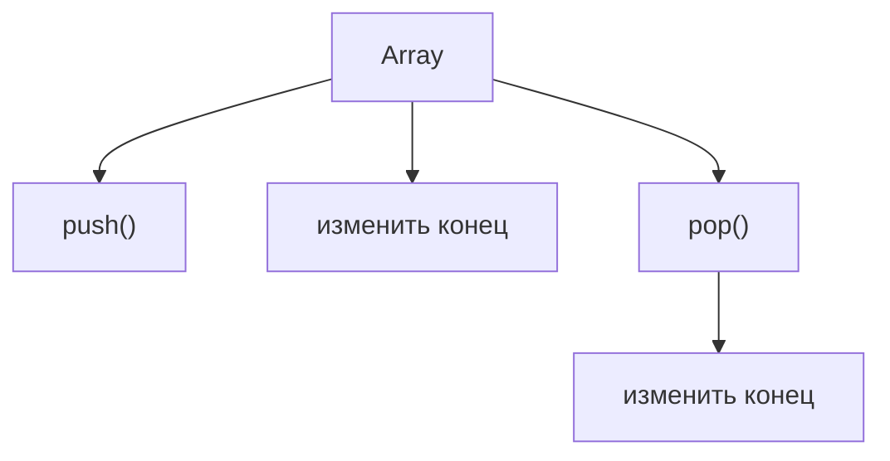

`push()` добавляет новый последний элемент.

`pop()` удаляет и возвращает последний элемент.

Теперь появляется следующий вопрос:

> Как массив может изменяться в начале?

Например, тестовый фреймворк хранит задачи:

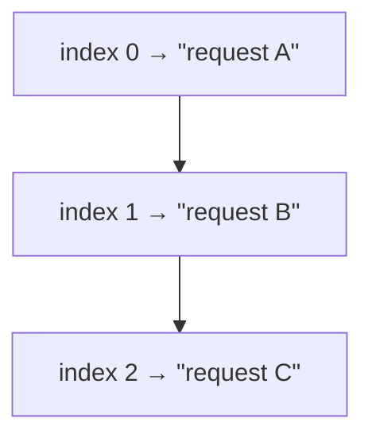

Появилась срочная задача, которая должна стать первой:

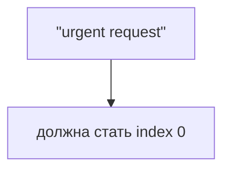

Или первая задача уже обработана:

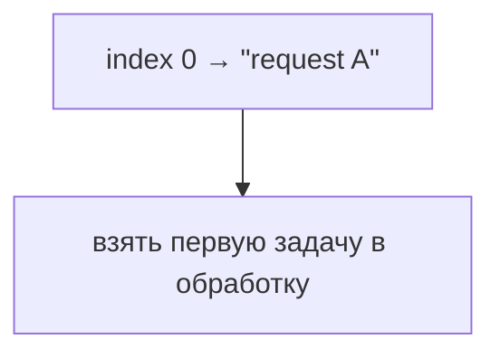

Эта глава отвечает:

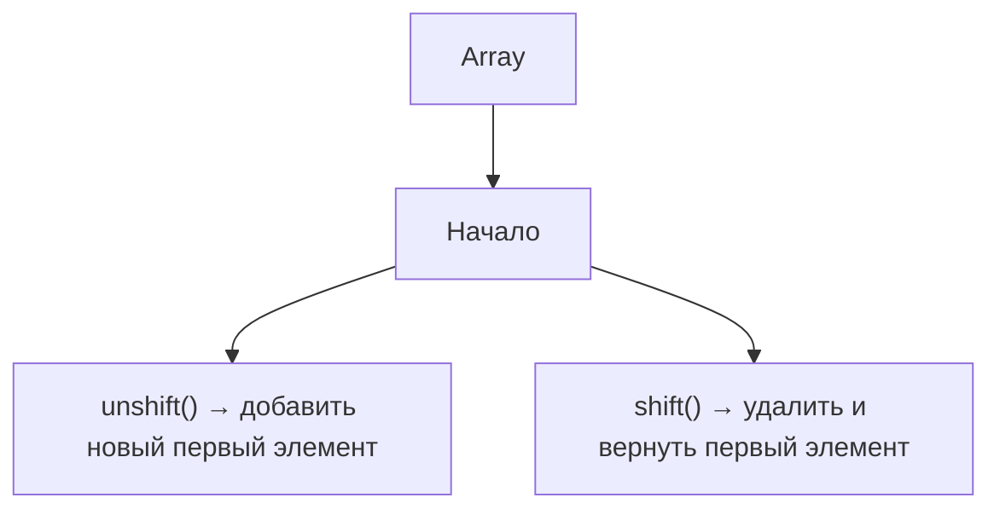

---

## Предварительные требования

Для этой главы нужно понимать:

* что array — это ordered collection;
* что первый element имеет index `0`;
* что `length` отражает количество elements;
* что `push()` и `pop()` изменяют конец array;
* что методы array могут изменять существующий array;
* что Automation QA часто работает со списками requests, test steps и collected failures.

Не требуется знать `splice`, `slice`, queue как формальную структуру данных, deque, loops, iteration methods, `map`, `filter`, `reduce`, Big O notation или performance benchmarking. Эти темы будут изучаться позже.

---

## Время изучения

Ориентировочное время:

```text
Чтение главы:            120-150 минут
Разбор схем:             60-80 минут
Запуск примеров:         20-30 минут
Практика:                110-140 минут
Повторение материала:    30 минут
```

Уровень сложности: **L3**.

`shift()` и `unshift()` выглядят симметрично `pop()` и `push()`, но концептуально они интереснее: они изменяют начало ordered collection, поэтому существующие indexes должны смещаться.

---

## Навигация

Предыдущая глава:

```text
docs/01-javascript/45-push-pop.md
```

Текущая глава:

```text
docs/01-javascript/46-shift-unshift.md
```

Следующая глава ответит:

> Как массив может изменяться в середине?

---

## Цели обучения

После изучения этой главы вы будете понимать:

* зачем существует `unshift()`;
* зачем существует `shift()`;
* что начало array находится at index `0`;
* как добавить новый первый элемент;
* как удалить первый элемент;
* что возвращает `shift()`;
* почему существующие indexes смещаются после операций в начале;
* почему `length` меняется после изменения количества elements;
* чем операции в начале отличаются от операций в конце;
* как `shift()` и `unshift()` применяются в Automation QA.

---

## Мотивация

Начнем с реальной задачи.

Тестовый фреймворк хранит request tспрашивает:

```javascript
const requestTasks = [
  'GET /users',
  'GET /orders',
  'GET /payments'
];
```

Текущий порядок:

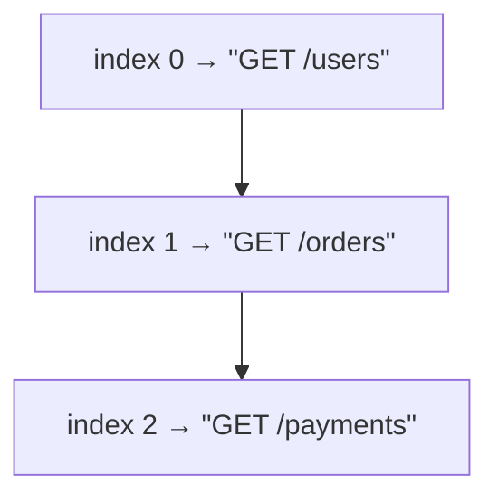

Появился срочный request:

```text
"POST /login"
```

Она должна стать первой, потому что без login следующие requests не смогут выполниться.

Вопрос:

> Как массив может добавить новый первый элемент?

Нужна операция:

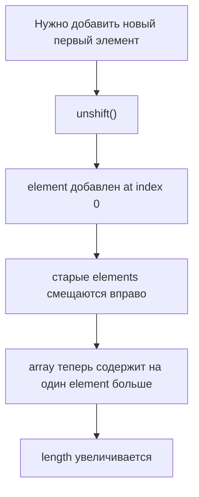

Это `unshift()`.

Теперь первая задача обработана:

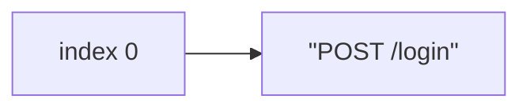

Вопрос:

> Как массив может удалить первый element и передать его программе?

Нужна операция:

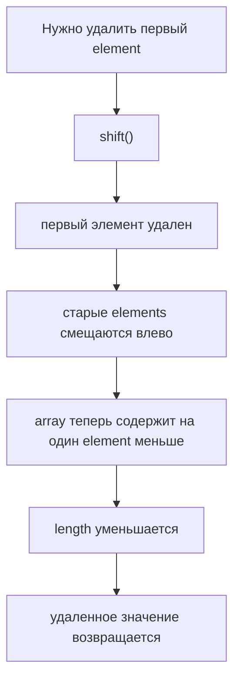

Это `shift()`.

---

## Теория

`unshift()` добавляет один или несколько elements в начало array.

В этой главе мы фокусируемся на одном element за раз:

```javascript
const requestTasks = ['GET /users', 'GET /orders'];

requestTasks.unshift('POST /login');
```

До выполнения:

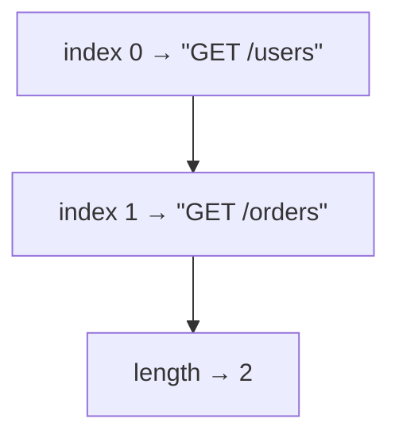

После выполнения:

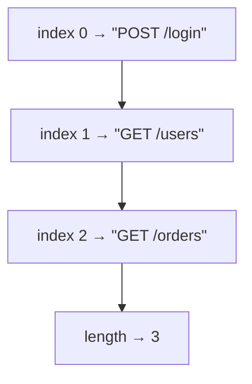

Важно:

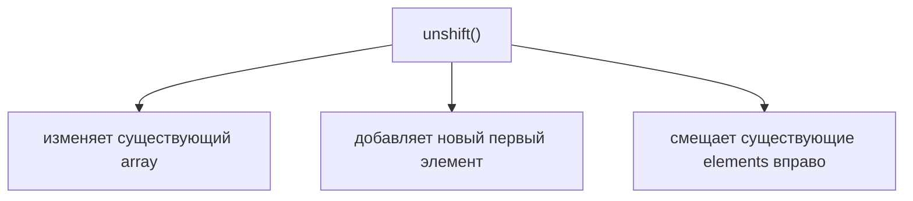

### Зачем существует `unshift()`

`unshift()` существует, потому что иногда новое значение должно стать первым.

Примеры:

```text
срочный request
приоритетный test step
первая browser tab
приоритетная failure
setup task перед обычными задачами
```

`unshift()` отвечает:

```text
Как добавить новый первый element?
```

### `shift()`

`shift()` удаляет первый element из array и возвращает удаленное значение.

```javascript
const requestTasks = ['POST /login', 'GET /users', 'GET /orders'];

const firstTask = requestTasks.shift();
```

До выполнения:


После выполнения:


Возвращаемое значение:

```text
"POST /login"
```

Важно:

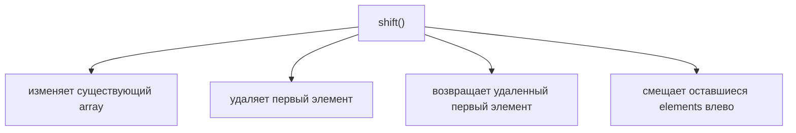

### Зачем существует `shift()`

`shift()` существует, потому что иногда первый element нужно обработать и удалить.

Примеры:

```text
взять первый collected request
обработать первый test step
удалить первую browser tab
взять failure с самым высоким приоритетом
забрать первую задачу из простого списка
```

`shift()` отвечает:

```text
Как удалить и получить первый element?
```

### Начало array

Начало array — это index `0`.

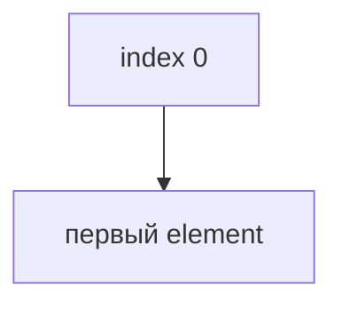

Поскольку arrays упорядочены, изменение начала влияет на позиции других elements.

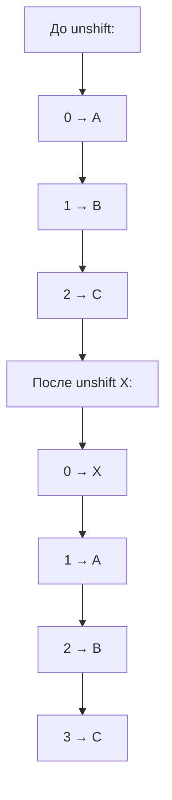

Значения не потеряли порядок относительно друг друга. Они перешли на новые indexes.

### Length как следствие

`unshift()` добавляет новый element в начало.

Так как array теперь содержит на один element больше, `length` увеличивается.

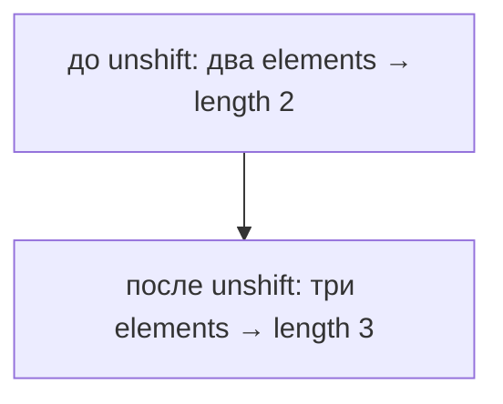

`shift()` удаляет первый элемент.

Так как array теперь содержит на один element меньше, `length` уменьшается.

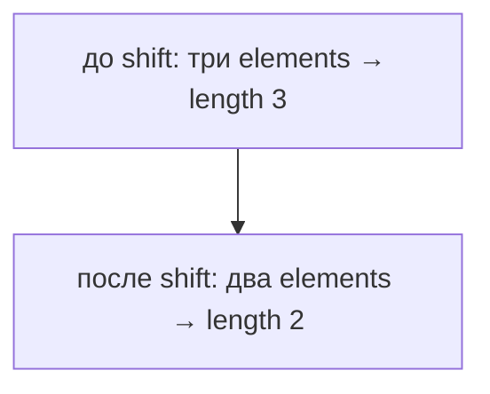

### Отличие от `push()` и `pop()`

Операции в конце:

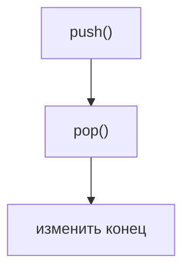

Операции в начале:

```mermaid
flowchart TD
    N1["unshift()"]
    N2["shift()"]
    N3["изменить начало"]
    N2 --> N3
    N1 --> N2
```

Ключевое отличие:

```mermaid
flowchart TD
    N1["изменение конца"]
    N2["предыдущие indexes обычно визуально стабильны"]
    N3["изменение начала"]
    N4["существующие indexes смещаются"]
    N1 --> N2
    N1 --> N3
    N3 --> N4
```

Здесь мы не обсуждаем performance benchmarking или Big O notation. Важная идея главы — смещение indexes.

---

## Внутренний механизм

Когда JavaScript выполняет:

```javascript
requestTasks.unshift('POST /login');
```

У engine есть:

```text
array: requestTasks
новое значение: "POST /login"
текущий первый index: 0
```

Поток действий:

```mermaid
flowchart TD
    N1["Шаг 1"]
    N2["Подготовить index 0 для нового значения"]
    N1 --> N2
```

```mermaid
flowchart TD
    N1["Шаг 2"]
    N2["Сместить существующие elements на одну позицию вправо"]
    N1 --> N2
```

```mermaid
flowchart TD
    N1["Шаг 3"]
    N2["Сохранить новое значение at index 0"]
    N1 --> N2
```

```mermaid
flowchart TD
    N1["Шаг 4"]
    N2["Array теперь содержит на один element больше"]
    N3["length стал больше"]
    N1 --> N2
    N2 --> N3
```

Пример:

```mermaid
flowchart TD
    N1["до выполнения"]
    N2["0 → GET /users"]
    N3["1 → GET /orders"]
    N4["unshift(&quot;POST /login&quot;)"]
    N5["после выполнения"]
    N6["0 → POST /login"]
    N7["1 → GET /users"]
    N8["2 → GET /orders"]
    N1 --> N2
    N1 --> N3
    N1 --> N4
    N4 --> N5
    N5 --> N6
    N5 --> N7
    N5 --> N8
```

Когда JavaScript выполняет:

```javascript
const task = requestTasks.shift();
```

Engine:

```mermaid
flowchart TD
    N1["Шаг 1"]
    N2["Прочитать значение at index 0"]
    N1 --> N2
```

```mermaid
flowchart TD
    N1["Шаг 2"]
    N2["Удалить первый элемент"]
    N1 --> N2
```

```mermaid
flowchart TD
    N1["Шаг 3"]
    N2["Сместить оставшиеся elements на одну позицию влево"]
    N1 --> N2
```

```mermaid
flowchart TD
    N1["Шаг 4"]
    N2["Array теперь содержит на один element меньше"]
    N3["length стал меньше"]
    N1 --> N2
    N2 --> N3
```

```mermaid
flowchart TD
    N1["Шаг 5"]
    N2["Вернуть удаленное значение"]
    N1 --> N2
```

Пример:

```mermaid
flowchart TD
    N1["до выполнения"]
    N2["0 → POST /login"]
    N3["1 → GET /users"]
    N4["2 → GET /orders"]
    N5["shift()"]
    N6["возвращено → POST /login"]
    N7["после выполнения"]
    N8["0 → GET /users"]
    N9["1 → GET /orders"]
    N1 --> N2
    N1 --> N3
    N1 --> N4
    N1 --> N5
    N5 --> N6
    N6 --> N7
    N7 --> N8
    N7 --> N9
```

Если array пустой:

```javascript
const requestTasks = [];
const firstTask = requestTasks.shift();
```

Результат:

```mermaid
flowchart TD
    N1["firstTask → undefined"]
    N2["length → 0"]
    N1 --> N2
```

Не было первый элемент, который можно удалить.

---

## Ментальная модель

Передняя дверь поезда:

```mermaid
flowchart TD
    N1["начало"]
    N2["[car A][car B][car C]"]
    N1 --> N2
```

`unshift()` добавляет новый вагон в начало:

```text
[urgent][car A][car B][car C]
```

Интуиция очереди:

```mermaid
flowchart TD
    N1["начало очереди"]
    N2["первый человек обслуживается первым"]
    N1 --> N2
```

Используйте это только как высокоуровневую интуицию. В этой главе мы не изучаем формальную структуру Queue.

Первая страница блокнота:

```mermaid
flowchart TD
    N1["новая первая страница"]
    N2["старые страницы смещаются после нее"]
    N1 --> N2
```

Ряд сидений:

```mermaid
flowchart TD
    N1["новый человек садится на место 0"]
    N2["остальные смещаются на следующие места"]
    N1 --> N2
```

Конвейер:

```mermaid
flowchart TD
    N1["взять первый элемент"]
    N2["следующий элемент становится первым"]
    N1 --> N2
```

Центральная модель:

```mermaid
flowchart TD
    N1["Array"]
    N2["Начало"]
    N3["unshift()"]
    N4["новый первый элемент"]
    N5["indexes смещаются вправо"]
    N6["array теперь содержит на один element больше"]
    N7["length увеличивается"]
    N1 --> N2
    N2 --> N3
    N3 --> N4
    N4 --> N5
    N5 --> N6
    N6 --> N7
```

```mermaid
flowchart TD
    N1["Array"]
    N2["Начало"]
    N3["shift()"]
    N4["первый элемент удален"]
    N5["indexes смещаются влево"]
    N6["array теперь содержит на один element меньше"]
    N7["length уменьшается"]
    N8["удаленное значение возвращается"]
    N1 --> N2
    N2 --> N3
    N3 --> N4
    N4 --> N5
    N5 --> N6
    N6 --> N7
    N7 --> N8
```

---

## Примеры кода

Примеры находятся в:

```text
examples/01-javascript/chapter-46/
```

Запуск:

```bash
node examples/01-javascript/chapter-46/01-unshift.js
```

### Пример 1. unshift

Файл:

```text
examples/01-javascript/chapter-46/01-unshift.js
```

Показывает добавление срочной задачи в начало.

### Пример 2. shift

Файл:

```text
examples/01-javascript/chapter-46/02-shift.js
```

Показывает удаление и возврат первой задачи.

### Пример 3. Смещение indexes

Файл:

```text
examples/01-javascript/chapter-46/03-index-shifting.js
```

Показывает, почему существующие indexes меняются.

### Пример 4. Возвращаемое значение

Файл:

```text
examples/01-javascript/chapter-46/04-return-value.js
```

Показывает, что `shift()` возвращает удаленный первый элемент.

### Пример 5. Типичные ошибки

Файл:

```text
examples/01-javascript/chapter-46/05-common-mistakes.js
```

Показывает ошибку: ожидание, что `shift()` удалит последний элемент.

### Пример 6. QA example

Файл:

```text
examples/01-javascript/chapter-46/06-qa-example.js
```

Показывает простой сценарий обработки requests.

---

## Частые вопросы

### `unshift()` создает новый array?

Нет.

В модели этой главы:

```mermaid
flowchart TD
    N1["unshift()"]
    N2["изменяет существующий array"]
    N1 --> N2
```

### `shift()` создает новый array?

Нет.

```mermaid
flowchart TD
    N1["shift()"]
    N2["изменяет существующий array"]
    N3["возвращает удаленный первый элемент"]
    N1 --> N2
    N1 --> N3
```

### Что возвращает `shift()`?

Удаленный первый элемент.

```mermaid
flowchart TD
    N1["[&quot;login&quot;, &quot;users&quot;].shift()"]
    N2["&quot;login&quot;"]
    N1 --> N2
```

### Что происходит при `shift()` из пустого array?

```mermaid
flowchart TD
    N1["[]"]
    N2["shift()"]
    N3["undefined"]
    N1 --> N2
    N2 --> N3
```

Array остается пустым.

### Это queue?

На высоком уровне удаление из начала похоже на обработку очереди.

Но формальные структуры Queue и Deque не являются темой этой главы.

### Почему indexes меняются?

Потому что index `0` — это начало.

Когда появляется новый первый элемент, старые elements должны сместиться вправо.

Когда первый элемент удаляется, оставшиеся elements должны сместиться влево.

---

## Распространенные мифы

### Миф: `shift()` — это то же самое, что `pop()`

Реальность: `shift()` удаляет первый элемент. `pop()` удаляет последний элемент.

### Миф: `unshift()` добавляет element в конец

Реальность: `unshift()` добавляет element в начало.

### Миф: indexes остаются такими же после `unshift()`

Реальность: существующие elements смещаются вправо, поэтому их indexes меняются.

### Миф: `shift()` возвращает измененный array

Реальность: `shift()` возвращает удаленный первый элемент.

### Миф: `shift()` из пустого array всегда падает

Реальность: он возвращает `undefined`.

---

## Типичные ошибки

### Ошибка 1. Ожидать, что `shift()` удалит последний элемент

Неправильная модель:

```mermaid
flowchart TD
    N1["shift()"]
    N2["удаляет последний элемент"]
    N1 --> N2
```

Правильная модель:

```mermaid
flowchart TD
    N1["shift()"]
    N2["удаляет первый элемент"]
    N1 --> N2
```

### Ошибка 2. Забыть, что indexes смещаются после `unshift()`

Неправильная модель:

```mermaid
flowchart TD
    N1["до:"]
    N2["0 → A"]
    N3["1 → B"]
    N4["unshift X"]
    N5["после:"]
    N6["0 → X"]
    N7["1 → B"]
    N3 --> N4
    N4 --> N5
    N1 --> N2
    N2 --> N3
    N5 --> N6
    N6 --> N7
```

Что пропущено:

```text
A сместился с index 0 на index 1
B сместился с index 1 на index 2
```

Правильная модель:

```mermaid
flowchart TD
    N1["после:"]
    N2["0 → X"]
    N3["1 → A"]
    N4["2 → B"]
    N1 --> N2
    N2 --> N3
    N3 --> N4
```

### Ошибка 3. Ожидать, что `shift()` вернет array

Неправильный код:

```javascript
const tasks = ['login', 'users'];
const result = tasks.shift();

console.log(result.length);
```

Что произошло:

`result` — это удаленный первый элемент, а не измененный array.

Исправленная модель:

```mermaid
flowchart TD
    N1["tasks"]
    N2["измененный array"]
    N3["результат"]
    N4["удаленное первое значение"]
    N1 --> N2
    N1 --> N3
    N3 --> N4
```

### Ошибка 4. Игнорировать empty array

```javascript
const tasks = [];
const firstTask = tasks.shift();
```

`firstTask` is `undefined`.

Перед использованием удаленного значения код должен учитывать пустую collection.

---

## Практическое использование

Используйте `unshift()`, когда новое значение должно стать первым:

```text
срочный request
приоритетная test task
setup step перед обычными steps
важная failure перед обычными failures
```

Используйте `shift()`, когда первое значение нужно удалить и обработать:

```text
первый request для выполнения
первый collected test step
первая browser tab в простой модели
первая failure для отчета
```

Читаемость:

```mermaid
flowchart TD
    N1["requestTasks.unshift(urgentTask)"]
    N2["явно означает"]
    N3["поместить срочную задачу в начало"]
    N1 --> N2
    N2 --> N3
```

```mermaid
flowchart TD
    N1["const nextTask = requestTasks.shift()"]
    N2["явно означает"]
    N3["взять первую задачу из collection"]
    N1 --> N2
    N2 --> N3
```

---

## Использование в Automation QA

### Интуиция request queue

Тестовый фреймворк может собирать описания requests:

```javascript
const requestTasks = ['GET /users', 'GET /orders'];

requestTasks.unshift('POST /login');
```

Ментальная модель:

```mermaid
flowchart TD
    N1["POST /login"]
    N2["должен выполниться перед другими requests"]
    N1 --> N2
```

Это только queue-like intuition. Здесь мы не формализуем Queue.

### Обработка первого collected item

```javascript
const nextRequest = requestTasks.shift();
```

Теперь:

```mermaid
flowchart TD
    N1["nextRequest"]
    N2["первый удаленный request"]
    N1 --> N2
```

Оставшиеся requests смещаются влево.

### Browser tabs в начале

Если простая модель считает первую tab активной:

```mermaid
flowchart LR
    N1["index 0"]
    N2["active tab"]
    N1 --> N2
```

`unshift()` может поместить новую приоритетную tab в начало этой модели.

### Failed assertions в порядке приоритета

```javascript
const failures = ['missing title'];

failures.unshift('login failed');
```

Теперь самая важная failure находится первой.

### Collected test steps

```mermaid
flowchart TD
    N1["testSteps"]
    N2["setup"]
    N3["action"]
    N4["assertion"]
    N1 --> N2
    N1 --> N3
    N1 --> N4
```

Если обязательный precondition обнаружен поздно, `unshift()` может поместить его перед обычными steps.

---

## Диаграммы главы

### 1. Зачем существует unshift

```mermaid
flowchart TD
    N1["array содержит values"]
    N2["приходит срочное value"]
    N3["нужно добавить в начало"]
    N1 --> N2
    N2 --> N3
```

### 2. Зачем существует shift

```mermaid
flowchart TD
    N1["array содержит values"]
    N2["нужно первое value"]
    N3["удалить из начала"]
    N1 --> N2
    N2 --> N3
```

### 3. Начало vs конец

```mermaid
flowchart TD
    N1["начало конец"]
    N2["index 0 length - 1"]
    N1 --> N2
```

### 4. До unshift

```mermaid
flowchart TD
    N1["0 → A"]
    N2["1 → B"]
    N1 --> N2
```

### 5. После unshift

```mermaid
flowchart TD
    N1["0 → X"]
    N2["1 → A"]
    N3["2 → B"]
    N1 --> N2
    N2 --> N3
```

### 6. До shift

```mermaid
flowchart TD
    N1["0 → X"]
    N2["1 → A"]
    N3["2 → B"]
    N1 --> N2
    N2 --> N3
```

### 7. После shift

```mermaid
flowchart TD
    N1["0 → A"]
    N2["1 → B"]
    N1 --> N2
```

### 8. Index 0

```mermaid
flowchart TD
    N1["index 0"]
    N2["первый элемент"]
    N1 --> N2
```

### 9. Смещение indexes вправо

```mermaid
flowchart TD
    N1["A: 0 → 1"]
    N2["B: 1 → 2"]
    N3["C: 2 → 3"]
    N1 --> N2
    N2 --> N3
```

### 10. Смещение indexes влево

```mermaid
flowchart TD
    N1["A удален"]
    N2["B: 1 → 0"]
    N3["C: 2 → 1"]
    N1 --> N2
    N2 --> N3
```

### 11. Увеличение length

```mermaid
flowchart TD
    N1["два elements"]
    N2["unshift"]
    N3["три elements"]
    N4["length отражает новое количество"]
    N1 --> N2
    N2 --> N3
    N3 --> N4
```

### 12. Уменьшение length

```mermaid
flowchart TD
    N1["три elements"]
    N2["shift"]
    N3["два elements"]
    N4["length отражает новое количество"]
    N1 --> N2
    N2 --> N3
    N3 --> N4
```

### 13. Возвращаемое значение shift

```mermaid
flowchart TD
    N1["[A, B].shift()"]
    N2["A"]
    N1 --> N2
```

### 14. Текущая модель JavaScript

```mermaid
flowchart TD
    N1["Arrays"]
    N2["indexes"]
    N3["length"]
    N4["push/pop"]
    N5["shift/unshift"]
    N1 --> N2
    N1 --> N3
    N1 --> N4
    N1 --> N5
```

### 15. Связь с push/pop

```mermaid
flowchart TD
    N1["push/pop"]
    N2["конец"]
    N3["shift/unshift"]
    N4["начало"]
    N1 --> N2
    N1 --> N3
    N3 --> N4
```

### 16. Интуиция Queue на высоком уровне

```mermaid
flowchart TD
    N1["начало"]
    N2["первый item обработан"]
    N1 --> N2
```

### 17. QA request queue

```text
POST /login
GET /users
GET /orders
```

### 18. Пример failed assertions

```mermaid
flowchart TD
    N1["приоритетная failure"]
    N2["unshift"]
    N3["попадает в отчет первой"]
    N1 --> N2
    N2 --> N3
```

### 19. Пример browser tabs

```mermaid
flowchart TD
    N1["index 0 → первая tab"]
    N2["index 1 → вторая tab"]
    N1 --> N2
```

### 20. Читаемость

```mermaid
flowchart TD
    N1["tasks.shift()"]
    N2["взять первую task"]
    N1 --> N2
```

### 21. Типичные ошибки

```mermaid
flowchart TD
    N1["shift()"]
    N2["возвращает удаленное value"]
    N3["не array"]
    N1 --> N2
    N2 --> N3
```

### 22. Аналогия с началом поезда

```text
передний вагон добавлен
старые вагоны смещаются назад
```

### 23. Аналогия с очередью

```mermaid
flowchart TD
    N1["начало очереди"]
    N2["обслуживается первым"]
    N1 --> N2
```

### 24. Аналогия с первой страницей блокнота

```text
новая page 0
старая page 0 становится page 1
```

### 25. Аналогия с рядом сидений

```text
seat 0 занят новым человеком
остальные смещаются вправо
```

### 26. Аналогия с конвейером

```text
первый item уходит
следующий item становится первым
```

### 27. Полная модель unshift

```mermaid
flowchart TD
    N1["Array"]
    N2["Нужно добавить новый первый элемент"]
    N3["unshift(value)"]
    N4["value становится index 0"]
    N5["существующие elements смещаются вправо"]
    N6["array теперь содержит на один element больше"]
    N7["length увеличивается"]
    N1 --> N2
    N2 --> N3
    N3 --> N4
    N4 --> N5
    N5 --> N6
    N6 --> N7
```

### 28. Полная модель shift

```mermaid
flowchart TD
    N1["Array"]
    N2["Нужно удалить первый элемент"]
    N3["shift()"]
    N4["value at index 0 удалено"]
    N5["оставшиеся elements смещаются влево"]
    N6["array теперь содержит на один element меньше"]
    N7["length уменьшается"]
    N8["удаленное value возвращается"]
    N1 --> N2
    N2 --> N3
    N3 --> N4
    N4 --> N5
    N5 --> N6
    N6 --> N7
    N7 --> N8
```

### 29. Жизненный цикл element в начале

```mermaid
flowchart TD
    N1["не в array"]
    N2["unshift"]
    N3["index 0"]
    N4["shift"]
    N5["удален"]
    N1 --> N2
    N2 --> N3
    N3 --> N4
    N4 --> N5
```

### 30. Первый элемент

```mermaid
flowchart TD
    N1["index 0"]
    N2["начало"]
    N1 --> N2
```

### 31. Поток unshift

```mermaid
flowchart TD
    N1["подготовить index 0"]
    N2["сместить elements вправо"]
    N3["сохранить новое value"]
    N1 --> N2
    N2 --> N3
```

### 32. Поток shift

```mermaid
flowchart TD
    N1["прочитать index 0"]
    N2["удалить первый элемент"]
    N3["сместить elements влево"]
    N4["вернуть value"]
    N1 --> N2
    N2 --> N3
    N3 --> N4
```

### 33. Timeline length

```mermaid
flowchart LR
    N1["2"]
    N2["unshift"]
    N3["3"]
    N4["shift"]
    N5["2"]
    N1 --> N2
    N2 --> N3
    N3 --> N4
    N4 --> N5
```

### 34. Напоминание про ordered collection

```mermaid
flowchart TD
    N1["порядок важен"]
    N2["начало меняет позиции"]
    N1 --> N2
```

### 35. Переход к splice()

```mermaid
flowchart TD
    N1["сейчас начало"]
    N2["дальше середина"]
    N1 --> N2
```

### 36. Переход к iteration

```mermaid
flowchart TD
    N1["arrays с большим количеством elements"]
    N2["позже: повторение по ним"]
    N1 --> N2
```

### 37. Пример QA framework

```text
tasks.unshift(setup)
tasks.shift()
```

### 38. Итоговая схема

```mermaid
flowchart TD
    N1["Array"]
    N2["push/pop"]
    N3["изменить конец"]
    N4["shift/unshift"]
    N5["изменить начало"]
    N6["сместить существующие indexes"]
    N7["обновить length вслед за количеством elements"]
    N1 --> N2
    N1 --> N3
    N1 --> N4
    N4 --> N5
    N4 --> N6
    N4 --> N7
```

---

## Итоги

Предыдущие главы построили такую модель:

```mermaid
flowchart TD
    N1["Arrays"]
    N2["ordered collection"]
    N3["indexes"]
    N4["length"]
    N1 --> N2
    N2 --> N3
    N3 --> N4
```

Затем:

```mermaid
flowchart TD
    N1["push/pop"]
    N2["изменить конец"]
    N1 --> N2
```

Эта глава добавила:

```mermaid
flowchart TD
    N1["shift/unshift"]
    N2["изменить начало"]
    N1 --> N2
```

`unshift()`:

```mermaid
flowchart TD
    N1["Нужно добавить новый первый элемент"]
    N2["unshift()"]
    N3["новый index 0"]
    N4["старые elements смещаются вправо"]
    N5["array теперь содержит на один element больше"]
    N6["length увеличивается"]
    N1 --> N2
    N2 --> N3
    N3 --> N4
    N4 --> N5
    N5 --> N6
```

`shift()`:

```mermaid
flowchart TD
    N1["Нужно удалить первый элемент"]
    N2["shift()"]
    N3["первый элемент удален"]
    N4["старые elements смещаются влево"]
    N5["array теперь содержит на один element меньше"]
    N6["length уменьшается"]
    N7["удаленное value возвращается"]
    N1 --> N2
    N2 --> N3
    N3 --> N4
    N4 --> N5
    N5 --> N6
    N6 --> N7
```

Следующая глава объяснит `splice()`: изменение arrays в середине.

---

## Что нужно запомнить

✓ `unshift()` добавляет value в начало array.

✓ `unshift()` изменяет существующий array.

✓ После `unshift()` существующие indexes смещаются вправо.

✓ После `unshift()` array содержит на один element больше, поэтому `length` увеличивается.

✓ `shift()` удаляет первый элемент.

✓ `shift()` изменяет существующий array.

✓ `shift()` возвращает удаленный первый элемент.

✓ После `shift()` существующие indexes смещаются влево.

✓ После `shift()` array содержит на один element меньше, поэтому `length` уменьшается.

✓ `shift()` не то же самое, что `pop()`.

✓ `unshift()` не то же самое, что `push()`.

✓ `splice()` объяснит изменения в середине.

---

## Проверьте себя

1. Какую проблему решает `unshift()`?

2. Какую проблему решает `shift()`?

3. Что такое начало array?

4. Что происходит с существующими indexes после `unshift()`?

5. Что происходит с существующими indexes после `shift()`?

6. Что возвращает `shift()`?

7. Почему `length` увеличивается после `unshift()`?

8. Почему `length` уменьшается после `shift()`?

9. Почему `shift()` не то же самое, что `pop()`?

10. Чем `unshift()` полезен для срочных QA tasks?

---

## Практика

Практические задания находятся в отдельном файле:

```text
practice/01-javascript/46-shift-unshift.md
```

---

## Решения

Решения находятся в отдельном файле:

```text
solutions/01-javascript/46-shift-unshift.md
```

Сначала выполните практику самостоятельно. Затем сравните объяснение, а не только финальный ответ.
