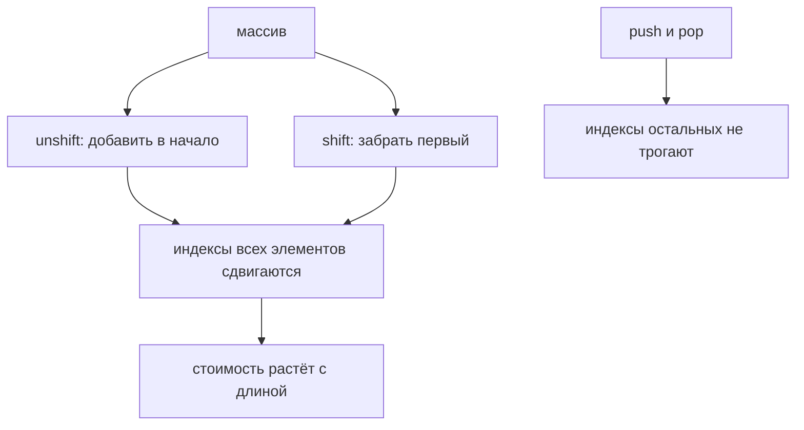

# `shift()` и `unshift()`

## Связь с предыдущей главой

Предыдущая глава объяснила `push()` и `pop()`.

Главная модель была такой: `push()` и `pop()` работают с концом массива.

`push()` добавляет новый последний элемент.

`pop()` удаляет и возвращает последний элемент.

Теперь появляется следующий вопрос:

> Как массив может изменяться в начале?

Например, тестовый фреймворк хранит задачи в очереди и берёт их с начала, а не с конца.

Появилась срочная задача, которая должна стать первой:

Или первая задача уже обработана:

Эта глава отвечает:

---

## Предварительные требования

Для этой главы нужно понимать:

* что массив — это упорядоченная коллекция;
* что первый элемент имеет индекс `0`;
* что `length` отражает количество элементов;
* что `push()` и `pop()` изменяют конец массива;
* что методы массива могут изменять существующий массив;
* что Automation QA часто работает со списками запросы, шаги теста и собранные падения.

Не требуется знать `splice`, `slice`, очередь как формальную структуру данных, двустороннюю очередь, циклы, методы перебора, `map`, `filter`, `reduce`, оценку сложности или замеры производительности. Эти темы будут изучаться позже.

---

## Время изучения

Ориентировочное время:

```text
Чтение главы:            120-150 минут
Разбор схем:             60-80 минут
Запуск примеров:         20-30 минут
Практика:                110-140 минут
Повторение материала:    30 минут
```

Уровень сложности: **L3**.

`shift()` и `unshift()` выглядят симметрично `pop()` и `push()`, но концептуально они интереснее: они изменяют начало упорядоченной коллекции, поэтому существующие индексы должны смещаться.

---

## Навигация

Предыдущая глава:

```text
docs/01-javascript/45-push-pop.md
```

Текущая глава:

```text
docs/01-javascript/46-shift-unshift.md
```

Следующая глава ответит:

> Как массив может изменяться в середине?

---

## Цели обучения

После изучения этой главы вы будете понимать:

* зачем существует `unshift()`;
* зачем существует `shift()`;
* что начало массива находится по индексу `0`;
* как добавить новый первый элемент;
* как удалить первый элемент;
* что возвращает `shift()`;
* почему существующие индексы смещаются после операций в начале;
* почему `length` меняется после изменения количества элементы;
* чем операции в начале отличаются от операций в конце;
* как `shift()` и `unshift()` применяются в Automation QA.

---

## Мотивация

Начнем с реальной задачи.

Тестовый фреймворк хранит очередь запросов:

```javascript
const requestTasks = [
  'GET /users',
  'GET /orders',
  'GET /payments'
];
```

Текущий порядок:

```text
индекс:  0             1              2
значение 'GET /users'   'GET /orders'  'GET /payments'
```

Появился срочный запрос:

```text
"POST /login"
```

Она должна стать первой, потому что без входа следующие запросы не смогут выполниться.

Вопрос:

> Как массив может добавить новый первый элемент?

Нужна операция:

Это `unshift()`.

Теперь первая задача обработана:

Вопрос:

> Как массив может удалить первый элемент и передать его программе?

Нужна операция:

Это `shift()`.

---

## Теория

`unshift()` добавляет один или несколько элементов в начало массива.

В этой главе мы фокусируемся по одному элементу за раз:

```javascript
const requestTasks = ['GET /users', 'GET /orders'];

requestTasks.unshift('POST /login');
```

До выполнения:

```text
индекс:  0              1
значение 'GET /users'   'GET /orders'
```

После выполнения:

```text
индекс:  0              1              2
значение 'POST /login'  'GET /users'   'GET /orders'
```

Важно: исходный массив изменён на месте. Новый массив не создаётся, а прежние
элементы сдвинулись вправо: то, что было под индексом `0`, теперь под `1`.

### Зачем существует `unshift()`

`unshift()` существует, потому что иногда новое значение должно стать первым.

Примеры:

```text
срочный request
приоритетный test step
первая вкладка браузера
приоритетная failure
setup task перед обычными задачами
```

`unshift()` отвечает:

```text
Как добавить новый первый element?
```

### `shift()`

`shift()` удаляет первый элемент из массива и возвращает удалённое значение.

```javascript
const requestTasks = ['POST /login', 'GET /users', 'GET /orders'];

const firstTask = requestTasks.shift();
```

До выполнения:

```text
индекс:  0              1              2
значение 'POST /login'  'GET /users'   'GET /orders'
```

После выполнения:

```text
индекс:  0              1
значение 'GET /users'   'GET /orders'
```

Возвращаемое значение:

```text
"POST /login"
```

Важно: метод возвращает **удалённый элемент**, а не изменённый массив. Сам
массив изменяется на месте, а оставшиеся элементы сдвигаются влево.

### Зачем существует `shift()`

`shift()` существует, потому что иногда первый элемент нужно обработать и удалить.

Примеры:

```text
взять первый собранный request
обработать первый test step
удалить первую вкладку браузера
взять failure с самым высоким приоритетом
забрать первую задачу из простого списка
```

`shift()` отвечает:

```text
Как удалить и получить первый element?
```

### Начало массив

Начало массив — это индекс `0`.

Поскольку массивы упорядочены, изменение начала влияет на позиции других элементов.

Значения не потеряли порядок относительно друг друга. Они перешли на новые индексы.

### Длина как следствие

`unshift()` добавляет новый элемент в начало.

Так как массив теперь содержит на один элемент больше, `length` увеличивается.

`shift()` удаляет первый элемент.

Так как массив теперь содержит на один элемент меньше, `length` уменьшается.

### Отличие от `push()` и `pop()`

Операции в конце:

```text
push(x)  добавляет элемент после последнего — индексы остальных не меняются
pop()    удаляет последний элемент — индексы остальных не меняются
```

Операции в начале:

```text
unshift(x)  добавляет элемент перед первым — все индексы сдвигаются вправо
shift()     удаляет первый элемент — все индексы сдвигаются влево
```

Ключевое отличие: конец массива не имеет соседей справа, поэтому изменение там
никого не задевает. У начала соседи есть всегда, и позиция каждого из них
меняется.

Здесь мы не обсуждаем замеры производительности или оценку сложности. Важная идея главы — смещение индексов.

---

Работа с началом дороже работы с концом:


```mermaid
flowchart TD
    A["массив"] --> B["unshift: добавить в начало"]
    A --> C["shift: забрать первый"]
    B --> D["индексы всех элементов сдвигаются"]
    C --> D
    D --> E["стоимость растёт с длиной"]
    F["push и pop"] --> G["индексы остальных не трогают"]
```

## Внутренний механизм

Когда JavaScript выполняет:

```javascript
requestTasks.unshift('POST /login');
```

У движка есть:

```text
массив:              requestTasks
новое значение:      "POST /login"
текущий первый индекс: 0
```

Поток действий:

```text
1. освободить позицию 0 — сдвинуть каждый элемент на индекс справа
2. записать новое значение в позицию 0
3. увеличить length на единицу
4. вернуть новую длину
```

Например: `tasks.unshift('setup')` ставит элемент в начало и сдвигает остальные
вправо.

Когда JavaScript выполняет:

```javascript
const task = requestTasks.shift();
```

Движок делает обратное:

```text
1. запомнить значение из позиции 0
2. сдвинуть каждый следующий элемент на индекс влево
3. уменьшить length на единицу
4. вернуть запомненное значение
```

Например: `tasks.shift()` забирает первый элемент и сдвигает остальные влево.

Если массив пустой:

```javascript
const requestTasks = [];
const firstTask = requestTasks.shift();
```

Результат: `firstTask` равен `undefined`, а сам массив остаётся пустым. Удалять
нечего, и это не ошибка — метод просто сообщает, что первого элемента не было.

---

## Ментальная модель

Передняя дверь поезда: состав пронумерован от головы, и новый вагон цепляют
спереди. Номера всех прежних вагонов после этого увеличиваются на единицу,
хотя сами вагоны никуда не переставляли.

`unshift()` добавляет новый вагон в начало:

```text
[urgent][car A][car B][car C]
```

Интуиция очереди:

Используйте это только как высокоуровневую интуицию. Формальную структуру данных «очередь» мы здесь не разбираем.

Первая страница блокнота: вклеить лист перед первой страницей можно, но тогда
нумерация всех остальных страниц сдвигается.

Ряд сидений: если посадить человека на первое место, все сидящие смещаются на
одно место вправо.

Конвейер: снять изделие с начала ленты — значит сделать первым то, что было
вторым.

Центральная модель: начало массива — это позиция с индексом `0`, и любая
операция с ней меняет индексы всех остальных элементов.

---

## Примеры кода

Примеры находятся в:

```text
examples/01-javascript/chapter-46/
```

Запуск:

```bash
node examples/01-javascript/chapter-46/01-unshift.js
```

### Пример 1. `unshift()`

Файл:

```text
examples/01-javascript/chapter-46/01-unshift.js
```

Показывает добавление срочной задачи в начало.

### Пример 2. `shift()`

Файл:

```text
examples/01-javascript/chapter-46/02-shift.js
```

Показывает удаление и возврат первой задачи.

### Пример 3. Смещение индексы

Файл:

```text
examples/01-javascript/chapter-46/03-index-shifting.js
```

Показывает, почему существующие индексы меняются.

### Пример 4. Возвращаемое значение

Файл:

```text
examples/01-javascript/chapter-46/04-return-value.js
```

Показывает, что `shift()` возвращает удалённый первый элемент.

### Пример 5. Типичные ошибки

Файл:

```text
examples/01-javascript/chapter-46/05-common-mistakes.js
```

Показывает ошибку: ожидание, что `shift()` удалит последний элемент.

### Пример 6. пример для автоматизации

Файл:

```text
examples/01-javascript/chapter-46/06-qa-example.js
```

Показывает простой сценарий обработки запросы.

---

## Частые вопросы

### `unshift()` создаёт новый массив?

Нет.

В модели этой главы массив изменяется на месте, а возвращается новая длина —
число, а не массив.

### `shift()` создаёт новый массив?

Нет.

### Что возвращает `shift()`?

Удаленный первый элемент.

### Что происходит при `shift()` из пустого массив?

массив остается пустым.

### Это очередь?

На высоком уровне удаление из начала похоже на обработку очереди.

Но формальные структуры очередь и двусторонняя очередь не являются темой этой главы.

### Почему индексы меняются?

Потому что индекс `0` — это начало.

Когда появляется новый первый элемент, старые элементы должны сместиться вправо.

Когда первый элемент удаляется, оставшиеся элементы должны сместиться влево.

---

## Распространённые мифы

### Миф: `shift()` — это то же самое, что `pop()`

Реальность: `shift()` удаляет первый элемент. `pop()` удаляет последний элемент.

### Миф: `unshift()` добавляет элемент в конец

Реальность: `unshift()` добавляет элемент в начало.

### Миф: индексы остаются такими же после `unshift()`

Реальность: существующие элементы смещаются вправо, поэтому их индексы меняются.

### Миф: `shift()` возвращает измененный массив

Реальность: `shift()` возвращает удалённый первый элемент.

### Миф: `shift()` из пустого массив всегда падает

Реальность: он возвращает `undefined`.

---

## Распространённые ошибки

### Ошибка 1. Ожидать, что `shift()` удалит последний элемент

Неправильная модель: будто `shift()` возвращает изменённый массив.

Правильная модель: `shift()` возвращает удалённый первый элемент.

### Ошибка 2. Забыть, что индексы смещаются после `unshift()`

Неправильная модель: будто `unshift()` возвращает новый массив.

Что пропущено:

```text
A сместился с index 0 на index 1
B сместился с index 1 на index 2
```

Правильная модель: `unshift()` изменяет исходный массив и возвращает его новую длину.

### Ошибка 3. Ожидать, что `shift()` вернет массив

Неправильный код:

```javascript
const tasks = ['login', 'users'];
const result = tasks.shift();

console.log(result.length);
```

Что произошло:

`result` — это удалённый первый элемент, а не измененный массив.

Исправленная модель: после операций с началом массива сохранённые ранее индексы указывают уже на другие элементы.

### Ошибка 4. Игнорировать пустой массив

```javascript
const tasks = [];
const firstTask = tasks.shift();
```

`firstTask` равен `undefined`.

Перед использованием удаленного значения код должен учитывать пустую коллекцию.

---

## Практическое использование

Используйте `unshift()`, когда новое значение должно стать первым:

```text
срочный request
приоритетная test task
setup step перед обычными steps
важная failure перед обычными failures
```

Используйте `shift()`, когда первое значение нужно удалить и обработать:

```text
первый запрос для выполнения
первый собранный шаг теста
первая вкладка браузера в простой модели
первое падение для отчёта
```

Читаемость: `shift()` меняет индексы всех оставшихся элементов, и в коде это
не видно. Если из массива берут первый элемент, имя переменной должно об этом
говорить — иначе читатель решит, что порядок не важен.

---

## Использование в Automation QA

### Интуиция очередь запросов

Тестовый фреймворк может собирать описания запросы:

```javascript
const requestTasks = ['GET /users', 'GET /orders'];

requestTasks.unshift('POST /login');
```

Ментальная модель: очередь — встают в конец, обслуживают с начала.

Это только интуиция очереди: формальную структуру данных мы здесь не разбираем.

### Обработка первого собранный элемент

```javascript
const nextRequest = requestTasks.shift();
```

Теперь:

Оставшиеся запросы смещаются влево.

### вкладки браузера в начале

Если простая модель считает первую вкладку активной, то после `unshift()` активной окажется уже другая — индекс сместился.

`unshift()` может поместить новую приоритетную вкладку в начало этой модели.

### Упавшие проверки в порядке приоритета

```javascript
const failures = ['missing title'];

failures.unshift('login failed');
```

Теперь самая важная падение находится первой.

### Собранные шаги теста

Если обязательный предусловие обнаружен поздно, `unshift()` может поместить его перед обычными шаги.

---

## Итоги

Предыдущие главы построили такую модель: массив изменяется на месте, а методы возвращают либо элемент, либо новую длину.

Затем добавилось правило для конца массива: `push()` и `pop()` меняют только
последнюю позицию и не трогают индексы остальных элементов.

Эта глава добавила операции с началом массива и их цену — смещение индексов:

`unshift(значение)` — вставляет элемент перед первым, сдвигает остальные вправо
и возвращает новую длину.

`shift()` — удаляет первый элемент, сдвигает остальные влево и возвращает
удалённое значение.

Следующая глава объяснит `splice()`: изменение массивы в середине.

---

## Что нужно запомнить

✓ `unshift()` добавляет значение в начало массиваа.

✓ `unshift()` изменяет существующий массив.

✓ После `unshift()` существующие индексы смещаются вправо.

✓ После `unshift()` массив содержит на один элемент больше, поэтому `length` увеличивается.

✓ `shift()` удаляет первый элемент.

✓ `shift()` изменяет существующий массив.

✓ `shift()` возвращает удалённый первый элемент.

✓ После `shift()` существующие индексы смещаются влево.

✓ После `shift()` массив содержит на один элемент меньше, поэтому `length` уменьшается.

✓ `shift()` не то же самое, что `pop()`.

✓ `unshift()` не то же самое, что `push()`.

✓ `splice()` объяснит изменения в середине.

---

## Проверьте себя

1. Какую проблему решает `unshift()`?

2. Какую проблему решает `shift()`?

3. Что такое начало массива?

4. Что происходит с существующими индексы после `unshift()`?

5. Что происходит с существующими индексы после `shift()`?

6. Что возвращает `shift()`?

7. Почему `length` увеличивается после `unshift()`?

8. Почему `length` уменьшается после `shift()`?

9. Почему `shift()` не то же самое, что `pop()`?

10. Чем `unshift()` полезен для срочных задач автоматизации?

### Ответы

1. Добавление элемента в начало массива, когда новый элемент должен обрабатываться раньше остальных.
2. Удаление первого элемента и получение его значения — обработку очереди с начала.
3. Позиция с индексом `0`.
4. Все существующие элементы сдвигаются вправо: их индексы увеличиваются на единицу.
5. Все оставшиеся элементы сдвигаются влево: их индексы уменьшаются на единицу.
6. Удалённый первый элемент.
7. В массиве появилась новая позиция в начале, а количество позиций и есть длина.
8. Одна позиция удалена, поэтому количество позиций уменьшилось.
9. `shift()` работает с началом массива, `pop()` — с концом. Кроме того, `shift()` сдвигает индексы всех оставшихся элементов, а `pop()` — нет.
10. Он ставит задачу в начало очереди, и при обработке с начала она берётся первой — это и есть приоритет.

---

## Практика

Практические задания находятся в отдельном файле:

```text
practice/01-javascript/46-shift-unshift.md
```

---

## Решения

Решения находятся в отдельном файле:

```text
solutions/01-javascript/46-shift-unshift.md
```

Сначала выполните практику самостоятельно. Затем сравните объяснение, а не только финальный ответ.
